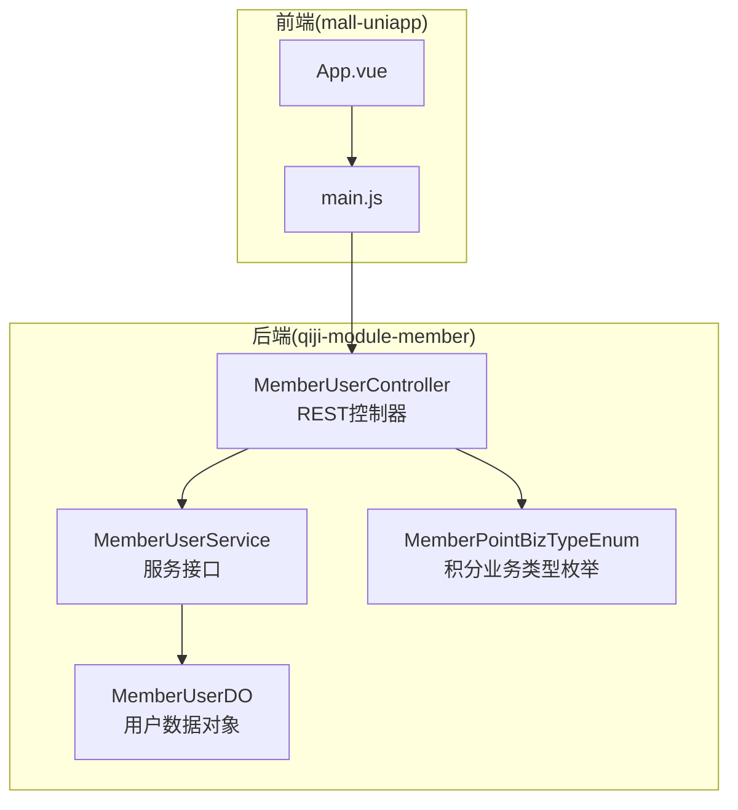
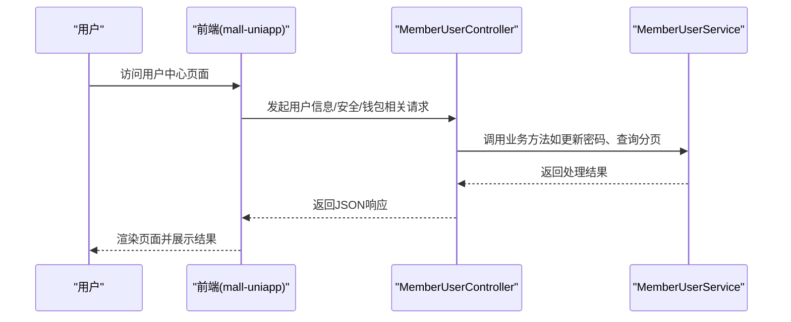
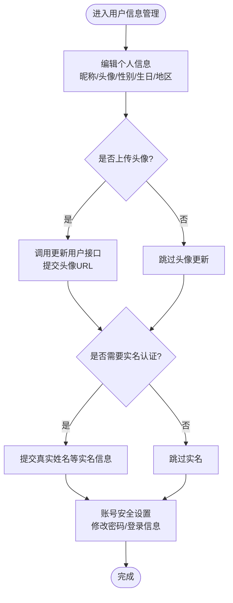
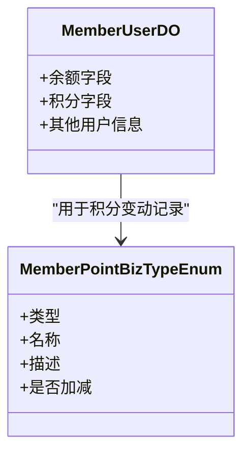
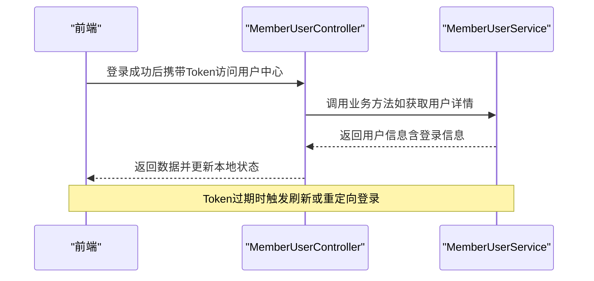
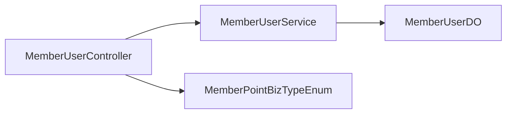

# 用户中心系统

<cite>
**本文引用的文件**
- [MemberUserController.java](file://backend/qiji-module-member/src/main/java/com/qiji/cps/module/member/controller/admin/user/MemberUserController.java)
- [MemberUserService.java](file://backend/qiji-module-member/src/main/java/com/qiji/cps/module/member/service/user/MemberUserService.java)
- [MemberUserDO.java](file://backend/qiji-module-member/src/main/java/com/qiji/cps/module/member/dal/dataobject/user/MemberUserDO.java)
- [MemberPointBizTypeEnum.java](file://backend/qiji-module-member/src/main/java/com/qiji/cps/module/member/enums/point/MemberPointBizTypeEnum.java)
- [App.vue](file://frontend/mall-uniapp/App.vue)
- [main.js](file://frontend/mall-uniapp/main.js)
</cite>

## 目录
1. [简介](#简介)
2. [项目结构](#项目结构)
3. [核心组件](#核心组件)
4. [架构总览](#架构总览)
5. [详细组件分析](#详细组件分析)
6. [依赖分析](#依赖分析)
7. [性能考虑](#性能考虑)
8. [故障排查指南](#故障排查指南)
9. [结论](#结论)
10. [附录](#附录)

## 简介
本技术文档面向AgenticCPS商城“用户中心系统”，聚焦于用户信息管理与钱包相关能力的实现与扩展指导。根据仓库现有代码，用户中心的核心能力主要由后端会员模块提供，前端采用uni-app应用承载。本文将从系统架构、组件职责、数据模型、处理流程、安全与性能等方面进行深入解析，并给出开发者在实现个人信息编辑、头像上传、实名认证、账号安全设置、地址管理、钱包余额与账单、登录状态与权限控制等场景时的最佳实践。

## 项目结构
用户中心系统在当前仓库中由以下关键部分组成：
- 后端会员模块（member）：提供用户信息、密码、等级、积分等核心服务接口与控制器
- 前端uni-app应用（mall-uniapp）：承载用户中心页面与交互逻辑
- 数据模型：用户实体（MemberUserDO）及积分业务类型枚举（MemberPointBizTypeEnum）

**图表来源**
- [MemberUserController.java:1-133](file://backend/qiji-module-member/src/main/java/com/qiji/cps/module/member/controller/admin/user/MemberUserController.java#L1-L133)
- [MemberUserService.java:1-199](file://backend/qiji-module-member/src/main/java/com/qiji/cps/module/member/service/user/MemberUserService.java#L1-L199)
- [MemberUserDO.java:1-146](file://backend/qiji-module-member/src/main/java/com/qiji/cps/module/member/dal/dataobject/user/MemberUserDO.java#L1-L146)
- [MemberPointBizTypeEnum.java:1-59](file://backend/qiji-module-member/src/main/java/com/qiji/cps/module/member/enums/point/MemberPointBizTypeEnum.java#L1-L59)
- [App.vue:1-33](file://frontend/mall-uniapp/App.vue#L1-L33)
- [main.js:1-16](file://frontend/mall-uniapp/main.js#L1-L16)

**章节来源**
- [MemberUserController.java:1-133](file://backend/qiji-module-member/src/main/java/com/qiji/cps/module/member/controller/admin/user/MemberUserController.java#L1-L133)
- [MemberUserService.java:1-199](file://backend/qiji-module-member/src/main/java/com/qiji/cps/module/member/service/user/MemberUserService.java#L1-L199)
- [MemberUserDO.java:1-146](file://backend/qiji-module-member/src/main/java/com/qiji/cps/module/member/dal/dataobject/user/MemberUserDO.java#L1-L146)
- [MemberPointBizTypeEnum.java:1-59](file://backend/qiji-module-member/src/main/java/com/qiji/cps/module/member/enums/point/MemberPointBizTypeEnum.java#L1-L59)
- [App.vue:1-33](file://frontend/mall-uniapp/App.vue#L1-L33)
- [main.js:1-16](file://frontend/mall-uniapp/main.js#L1-L16)

## 核心组件
- REST控制器（MemberUserController）
  - 提供管理员维度的用户信息更新、密码修改、等级与积分调整、用户分页查询等接口
  - 权限控制基于注解（如hasPermission），确保操作安全
- 服务接口（MemberUserService）
  - 定义会员用户相关业务方法，包括基本信息更新、密码修改、手机号变更、登录信息更新、分页查询等
  - 包含管理员与会员端两类调用入口
- 数据对象（MemberUserDO）
  - 用户核心字段：账号信息（手机号、密码、状态、注册/登录信息）、基础信息（昵称、头像、真实姓名、性别、生日、地区）、其他信息（积分、标签、等级、经验、分组）
- 积分业务类型枚举（MemberPointBizTypeEnum）
  - 定义积分变动的业务类型（签到、管理员修改、订单抵扣/奖励及其取消场景），支持加减方向标识

**章节来源**
- [MemberUserController.java:38-132](file://backend/qiji-module-member/src/main/java/com/qiji/cps/module/member/controller/admin/user/MemberUserController.java#L38-L132)
- [MemberUserService.java:21-198](file://backend/qiji-module-member/src/main/java/com/qiji/cps/module/member/service/user/MemberUserService.java#L21-L198)
- [MemberUserDO.java:21-145](file://backend/qiji-module-member/src/main/java/com/qiji/cps/module/member/dal/dataobject/user/MemberUserDO.java#L21-L145)
- [MemberPointBizTypeEnum.java:15-58](file://backend/qiji-module-member/src/main/java/com/qiji/cps/module/member/enums/point/MemberPointBizTypeEnum.java#L15-L58)

## 架构总览
用户中心系统采用前后端分离架构：
- 前端uni-app负责页面渲染与交互，应用启动时初始化底层依赖
- 后端通过REST控制器接收请求，调用服务层完成业务处理，最终持久化至数据对象

**图表来源**
- [MemberUserController.java:55-130](file://backend/qiji-module-member/src/main/java/com/qiji/cps/module/member/controller/admin/user/MemberUserController.java#L55-L130)
- [MemberUserService.java:135-154](file://backend/qiji-module-member/src/main/java/com/qiji/cps/module/member/service/user/MemberUserService.java#L135-L154)
- [App.vue:5-12](file://frontend/mall-uniapp/App.vue#L5-L12)
- [main.js:6-14](file://frontend/mall-uniapp/main.js#L6-L14)

## 详细组件分析

### 用户信息管理（个人信息编辑、头像上传、实名认证、账号安全设置）
- 个人信息编辑
  - 会员端：通过服务接口的“更新用户”方法实现昵称、头像、性别、生日、地区等字段的更新
  - 管理端：通过控制器的“更新会员用户”接口进行批量或定向更新
- 头像上传
  - 建议在前端完成图片上传后，调用“更新用户”接口提交头像URL
- 实名认证
  - 当前数据模型包含真实姓名字段，可在前端表单提交后通过“更新用户”接口保存
- 账号安全设置
  - 密码修改：提供会员端与管理员端两种入口，分别对应不同的业务方法
  - 登录信息更新：服务层提供“更新用户最后登录信息”方法，便于统计与风控

**图表来源**
- [MemberUserService.java:86-146](file://backend/qiji-module-member/src/main/java/com/qiji/cps/module/member/service/user/MemberUserService.java#L86-L146)
- [MemberUserDO.java:37-112](file://backend/qiji-module-member/src/main/java/com/qiji/cps/module/member/dal/dataobject/user/MemberUserDO.java#L37-L112)

**章节来源**
- [MemberUserService.java:86-146](file://backend/qiji-module-member/src/main/java/com/qiji/cps/module/member/service/user/MemberUserService.java#L86-L146)
- [MemberUserDO.java:37-112](file://backend/qiji-module-member/src/main/java/com/qiji/cps/module/member/dal/dataobject/user/MemberUserDO.java#L37-L112)

### 地址管理（添加、编辑、删除、默认地址设置）
- 当前仓库未发现独立的“地址管理”模块或接口
- 建议在现有会员模块基础上扩展地址实体与服务，遵循以下原则：
  - 地址实体应包含收货人、电话、省市区、详细地址、是否默认等字段
  - 提供地址列表、详情、新增、编辑、删除、设置默认等接口
  - 默认地址设置需保证同一用户仅有一个默认地址
  - 删除默认地址时需重新选择新的默认地址或清空默认标记

[本节为概念性扩展说明，不直接分析具体文件，故无章节来源]

### 钱包系统（余额查询、充值记录、提现申请、账单明细）
- 余额查询
  - 用户余额字段位于用户实体（MemberUserDO），前端可调用用户详情接口获取
- 充值记录
  - 可通过“积分业务类型枚举”中的充值相关类型（若无则建议新增）来记录充值行为
- 提现申请
  - 建议新增“钱包账户”与“提现申请”实体，提供申请、审核、打款等流程接口
- 账单明细
  - 结合积分流水或钱包流水表，按时间、类型、金额等维度进行分页查询

**图表来源**
- [MemberUserDO.java:117-120](file://backend/qiji-module-member/src/main/java/com/qiji/cps/module/member/dal/dataobject/user/MemberUserDO.java#L117-L120)
- [MemberPointBizTypeEnum.java:17-29](file://backend/qiji-module-member/src/main/java/com/qiji/cps/module/member/enums/point/MemberPointBizTypeEnum.java#L17-L29)

**章节来源**
- [MemberUserDO.java:117-120](file://backend/qiji-module-member/src/main/java/com/qiji/cps/module/member/dal/dataobject/user/MemberUserDO.java#L117-L120)
- [MemberPointBizTypeEnum.java:17-29](file://backend/qiji-module-member/src/main/java/com/qiji/cps/module/member/enums/point/MemberPointBizTypeEnum.java#L17-L29)

### 用户状态管理（登录状态维护、Token管理、权限控制、会话过期处理）
- 登录状态维护
  - 服务层提供“更新用户最后登录信息”方法，可用于记录登录IP与时间
- Token管理
  - 建议结合后端安全框架（如Spring Security）统一处理Token生成、刷新与校验
- 权限控制
  - 控制器已使用权限注解（如hasPermission），确保敏感操作受控
- 会话过期处理
  - 建议在网关或拦截器中统一处理Token过期与刷新逻辑，避免重复校验

**图表来源**
- [MemberUserController.java:55-105](file://backend/qiji-module-member/src/main/java/com/qiji/cps/module/member/controller/admin/user/MemberUserController.java#L55-L105)
- [MemberUserService.java:62-68](file://backend/qiji-module-member/src/main/java/com/qiji/cps/module/member/service/user/MemberUserService.java#L62-L68)

**章节来源**
- [MemberUserController.java:55-105](file://backend/qiji-module-member/src/main/java/com/qiji/cps/module/member/controller/admin/user/MemberUserController.java#L55-L105)
- [MemberUserService.java:62-68](file://backend/qiji-module-member/src/main/java/com/qiji/cps/module/member/service/user/MemberUserService.java#L62-L68)

### 用户数据安全与隐私设置
- 密码安全
  - 用户密码采用强哈希算法存储，服务层提供密码匹配判断
- 敏感字段保护
  - 前端仅展示必要字段，敏感字段（如密码）不回显
- 隐私设置
  - 建议在用户资料中增加隐私开关（如公开昵称、性别、生日等），接口返回时按开关过滤
- 传输安全
  - 建议启用HTTPS，Token使用安全存储（如HttpOnly Cookie或安全Storage）

**章节来源**
- [MemberUserDO.java:48-53](file://backend/qiji-module-member/src/main/java/com/qiji/cps/module/member/dal/dataobject/user/MemberUserDO.java#L48-L53)
- [MemberUserService.java:125-132](file://backend/qiji-module-member/src/main/java/com/qiji/cps/module/member/service/user/MemberUserService.java#L125-L132)

## 依赖分析
- 控制器对服务层的依赖清晰，职责单一
- 服务层对数据对象与枚举的使用明确，便于扩展
- 前端应用初始化与控制器交互简单，耦合度低

**图表来源**
- [MemberUserController.java:44-53](file://backend/qiji-module-member/src/main/java/com/qiji/cps/module/member/controller/admin/user/MemberUserController.java#L44-L53)
- [MemberUserService.java:10](file://backend/qiji-module-member/src/main/java/com/qiji/cps/module/member/service/user/MemberUserService.java#L10)
- [MemberUserDO.java:35](file://backend/qiji-module-member/src/main/java/com/qiji/cps/module/member/dal/dataobject/user/MemberUserDO.java#L35)
- [MemberPointBizTypeEnum.java:17](file://backend/qiji-module-member/src/main/java/com/qiji/cps/module/member/enums/point/MemberPointBizTypeEnum.java#L17)

**章节来源**
- [MemberUserController.java:44-53](file://backend/qiji-module-member/src/main/java/com/qiji/cps/module/member/controller/admin/user/MemberUserController.java#L44-L53)
- [MemberUserService.java:10](file://backend/qiji-module-member/src/main/java/com/qiji/cps/module/member/service/user/MemberUserService.java#L10)
- [MemberUserDO.java:35](file://backend/qiji-module-member/src/main/java/com/qiji/cps/module/member/dal/dataobject/user/MemberUserDO.java#L35)
- [MemberPointBizTypeEnum.java:17](file://backend/qiji-module-member/src/main/java/com/qiji/cps/module/member/enums/point/MemberPointBizTypeEnum.java#L17)

## 性能考虑
- 接口分页
  - 用户分页查询已内置分页结果，建议在前端实现虚拟滚动与懒加载，降低首屏压力
- 缓存策略
  - 对用户基本信息与常用配置可引入缓存，减少数据库访问
- 并发控制
  - 密码修改、积分变动等敏感操作需加锁或幂等设计，防止并发异常
- 日志与监控
  - 对高风险操作（如密码修改、积分调整）记录审计日志，便于追踪

[本节为通用性能建议，不直接分析具体文件，故无章节来源]

## 故障排查指南
- 权限不足
  - 若出现权限错误，请确认调用方是否具备相应权限（如member:user:update-password）
- 参数校验失败
  - 确认请求体字段是否符合后端校验规则（如手机号格式）
- 登录信息未更新
  - 检查是否正确调用了“更新用户最后登录信息”方法
- 积分变动异常
  - 核对积分业务类型与加减方向是否一致

**章节来源**
- [MemberUserController.java:55-86](file://backend/qiji-module-member/src/main/java/com/qiji/cps/module/member/controller/admin/user/MemberUserController.java#L55-L86)
- [MemberUserService.java:62-68](file://backend/qiji-module-member/src/main/java/com/qiji/cps/module/member/service/user/MemberUserService.java#L62-L68)
- [MemberPointBizTypeEnum.java:17-29](file://backend/qiji-module-member/src/main/java/com/qiji/cps/module/member/enums/point/MemberPointBizTypeEnum.java#L17-L29)

## 结论
用户中心系统在当前仓库中已具备完善的用户信息与安全能力骨架：控制器提供权限受控的REST接口，服务层定义了会员与管理员两类业务方法，数据模型覆盖账号、基础与扩展信息，积分枚举支撑积分流水。围绕这些基础能力，开发者可快速扩展地址管理与钱包系统，并完善登录状态、Token管理与权限控制细节。建议在后续迭代中补充地址与钱包实体、接口与流程，并强化隐私与安全策略。

[本节为总结性内容，不直接分析具体文件，故无章节来源]

## 附录
- 开发者最佳实践清单
  - 接口命名与权限标注保持一致，避免越权
  - 对敏感操作增加二次确认与审计日志
  - 前端对用户输入进行最小化校验，后端进行严格校验
  - 使用分页与缓存优化大数据量场景
  - 为钱包与地址模块预留扩展点，遵循统一的CRUD规范

[本节为通用实践建议，不直接分析具体文件，故无章节来源]