# 移动端UI组件库

<cite>
**本文引用的文件**
- [README.md](file://README.md)
- [package.json](file://frontend/mall-uniapp/package.json)
- [App.vue](file://frontend/mall-uniapp/App.vue)
- [main.js](file://frontend/mall-uniapp/main.js)
- [manifest.json](file://frontend/mall-uniapp/manifest.json)
- [pages.json](file://frontend/mall-uniapp/pages.json)
- [uni.scss](file://frontend/mall-uniapp/uni.scss)
- [sheep/index.js](file://frontend/mall-uniapp/sheep/index.js)
- [sheep/components/goods-card/goods-card.vue](file://frontend/mall-uniapp/sheep/components/goods-card/goods-card.vue)
- [sheep/components/goods-list/goods-list.vue](file://frontend/mall-uniapp/sheep/components/goods-list/goods-list.vue)
- [sheep/components/swiper-grid/swiper-grid.vue](file://frontend/mall-uniapp/sheep/components/swiper-grid/swiper-grid.vue)
- [sheep/components/menu-grid/menu-grid.vue](file://frontend/mall-uniapp/sheep/components/menu-grid/menu-grid.vue)
- [sheep/components/virtual-list/virtual-list.vue](file://frontend/mall-uniapp/sheep/components/virtual-list/virtual-list.vue)
- [sheep/components/image-carousel/image-carousel.vue](file://frontend/mall-uniapp/sheep/components/image-carousel/image-carousel.vue)
- [sheep/components/loading/loading.vue](file://frontend/mall-uniapp/sheep/components/loading/loading.vue)
- [sheep/components/popup/popup.vue](file://frontend/mall-uniapp/sheep/components/popup/popup.vue)
- [sheep/utils/device.js](file://frontend/mall-uniapp/sheep/utils/device.js)
- [sheep/utils/format.js](file://frontend/mall-uniapp/sheep/utils/format.js)
- [sheep/store/app.js](file://frontend/mall-uniapp/sheep/store/app.js)
- [sheep/scss/variables.scss](file://frontend/mall-uniapp/sheep/scss/variables.scss)
- [sheep/scss/mixins.scss](file://frontend/mall-uniapp/sheep/scss/mixins.scss)
- [sheep/scss/theme.scss](file://frontend/mall-uniapp/sheep/scss/theme.scss)
- [sheep/scss/responsive.scss](file://frontend/mall-uniapp/sheep/scss/responsive.scss)
</cite>

## 目录
1. [简介](#简介)
2. [项目结构](#项目结构)
3. [核心组件](#核心组件)
4. [架构概览](#架构概览)
5. [详细组件分析](#详细组件分析)
6. [依赖关系分析](#依赖关系分析)
7. [性能考虑](#性能考虑)
8. [故障排除指南](#故障排除指南)
9. [结论](#结论)
10. [附录](#附录)

## 简介

AgenticCPS商城移动端UI组件库是一个基于UniApp构建的高性能移动端组件库，专为CPS联盟返利平台设计。该组件库深度融合了Vibe Coding理念，实现了AI自主编程与低代码开发的最佳实践。

### 核心特性

- **AI驱动开发**：100%由AI自主编程完成，涵盖从数据库设计到API接口的完整开发流程
- **多平台兼容**：一套代码同时支持iOS、Android、H5、微信小程序等多个平台
- **组件化架构**：采用模块化的组件设计，支持高度复用和定制化
- **性能优化**：内置懒加载、虚拟滚动、内存管理等性能优化策略
- **响应式设计**：全面支持移动端设备的响应式布局

### 技术栈

- **前端框架**：Vue 3 + UniApp
- **构建工具**：Vite
- **状态管理**：Pinia
- **样式处理**：SCSS
- **工具库**：Lodash、Day.js
- **网络请求**：Luch-Request

**章节来源**
- [README.md: 267-302:267-302](file://README.md#L267-L302)
- [package.json: 1-104:1-104](file://frontend/mall-uniapp/package.json#L1-L104)

## 项目结构

移动端UI组件库采用清晰的模块化组织结构，主要分为以下几个核心区域：

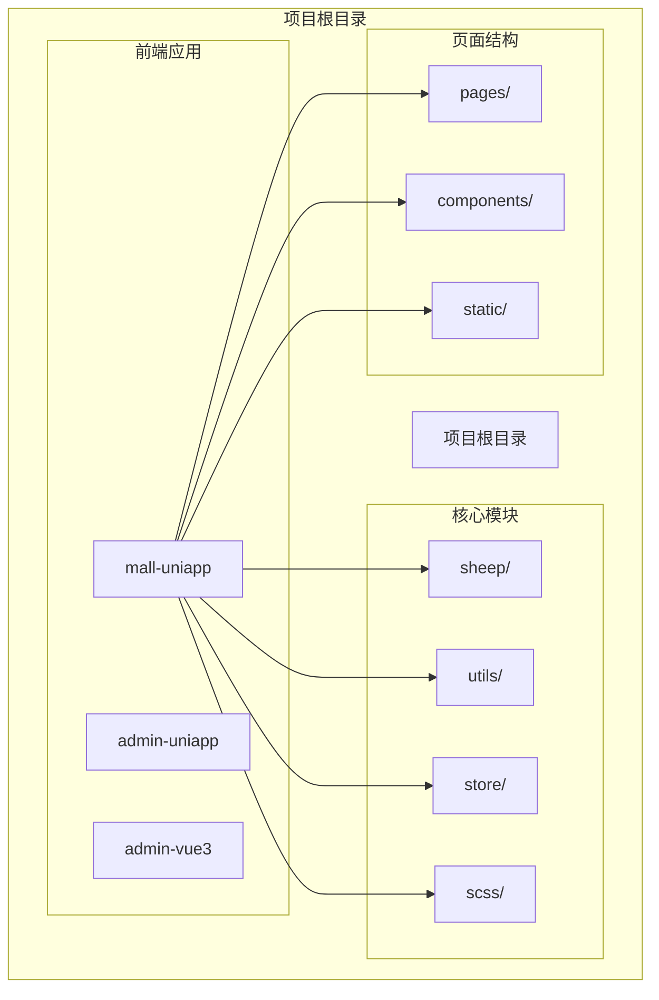

**图表来源**
- [package.json: 1-104:1-104](file://frontend/mall-uniapp/package.json#L1-L104)
- [sheep/index.js](file://frontend/mall-uniapp/sheep/index.js)

### 目录结构详解

#### 核心目录说明

- **sheep/**：组件库核心目录，包含所有UI组件
- **sheep/components/**：具体组件实现
- **sheep/utils/**：工具函数库
- **sheep/store/**：状态管理
- **sheep/scss/**：样式资源
- **pages/**：页面路由配置
- **static/**：静态资源文件

#### 组件分类

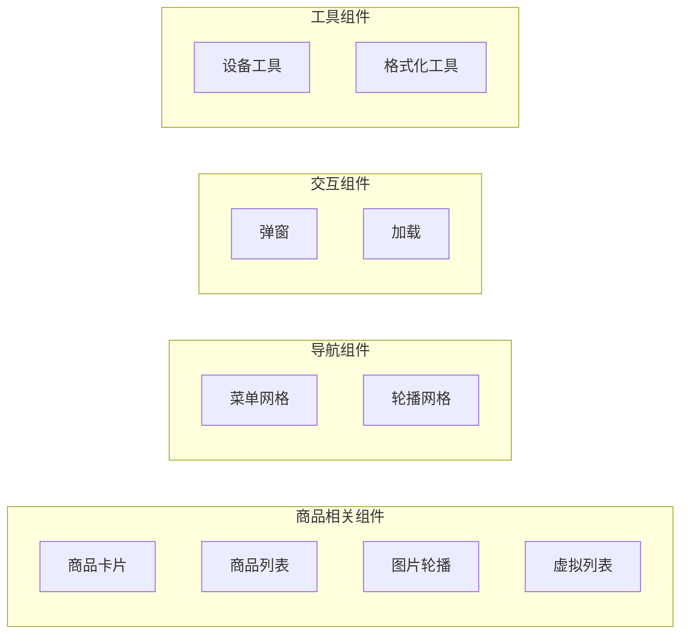

**章节来源**
- [sheep/index.js](file://frontend/mall-uniapp/sheep/index.js)
- [pages.json](file://frontend/mall-uniapp/pages.json)

## 核心组件

移动端UI组件库提供了丰富而完整的组件生态系统，涵盖了电商应用的各个方面。以下是核心组件的详细介绍：

### 商品相关组件

#### 商品卡片组件 (goods-card)

商品卡片是展示单个商品信息的核心组件，集成了完整的商品展示功能：

- **商品图片展示**：支持多图切换和缩放功能
- **价格信息显示**：原价、现价、返利金额的清晰展示
- **商品标题**：支持多行文本截断显示
- **销量统计**：展示商品销售情况
- **营销标签**：支持限时抢购、包邮等营销标识

#### 商品列表组件 (goods-list)

商品列表组件提供了灵活的商品展示方式：

- **多种布局模式**：网格布局、列表布局切换
- **无限滚动**：支持大数据量的商品列表加载
- **筛选功能**：支持价格、销量、评分等多维度筛选
- **排序功能**：支持综合、销量、价格等排序方式

#### 图片轮播组件 (image-carousel)

图片轮播组件专为商品图片展示设计：

- **自动播放**：支持自动轮播和手动切换
- **指示器**：圆形指示器显示当前页码
- **缩放功能**：支持双击放大、滑动缩小
- **懒加载**：优化图片加载性能

#### 虚拟列表组件 (virtual-list)

针对大量商品数据的高性能解决方案：

- **虚拟渲染**：只渲染可视区域内的元素
- **内存优化**：避免DOM节点过多导致的性能问题
- **滚动优化**：流畅的滚动体验
- **数据绑定**：支持动态数据更新

### 导航组件

#### 菜单网格组件 (menu-grid)

菜单网格组件用于展示功能菜单：

- **网格布局**：支持2-4列的灵活布局
- **图标文字**：支持图标和文字的组合显示
- **点击反馈**：提供视觉和触觉反馈
- **自适应宽度**：根据屏幕尺寸自动调整

#### 轮播网格组件 (swiper-grid)

轮播网格组件提供动态的菜单展示：

- **水平滑动**：支持左右滑动切换
- **分页显示**：多页内容的分页展示
- **响应式设计**：适配不同屏幕尺寸
- **动画效果**：平滑的过渡动画

### 交互组件

#### 弹窗组件 (popup)

弹窗组件提供多种交互模式：

- **底部弹窗**：适合选择操作的底部弹窗
- **居中弹窗**：适合重要信息展示的弹窗
- **遮罩层**：提供背景遮罩和点击外部关闭
- **动画效果**：淡入淡出的平滑动画

#### 加载组件 (loading)

加载组件提供丰富的加载状态：

- **圆形加载**：经典的环形加载动画
- **文字提示**：支持自定义加载文案
- **覆盖层**：可选的遮罩层加载
- **进度指示**：支持进度条显示

**章节来源**
- [sheep/components/goods-card/goods-card.vue](file://frontend/mall-uniapp/sheep/components/goods-card/goods-card.vue)
- [sheep/components/goods-list/goods-list.vue](file://frontend/mall-uniapp/sheep/components/goods-list/goods-list.vue)
- [sheep/components/image-carousel/image-carousel.vue](file://frontend/mall-uniapp/sheep/components/image-carousel/image-carousel.vue)
- [sheep/components/virtual-list/virtual-list.vue](file://frontend/mall-uniapp/sheep/components/virtual-list/virtual-list.vue)
- [sheep/components/menu-grid/menu-grid.vue](file://frontend/mall-uniapp/sheep/components/menu-grid/menu-grid.vue)
- [sheep/components/swiper-grid/swiper-grid.vue](file://frontend/mall-uniapp/sheep/components/swiper-grid/swiper-grid.vue)
- [sheep/components/popup/popup.vue](file://frontend/mall-uniapp/sheep/components/popup/popup.vue)
- [sheep/components/loading/loading.vue](file://frontend/mall-uniapp/sheep/components/loading/loading.vue)

## 架构概览

移动端UI组件库采用了现代化的架构设计，确保了良好的可维护性和扩展性：

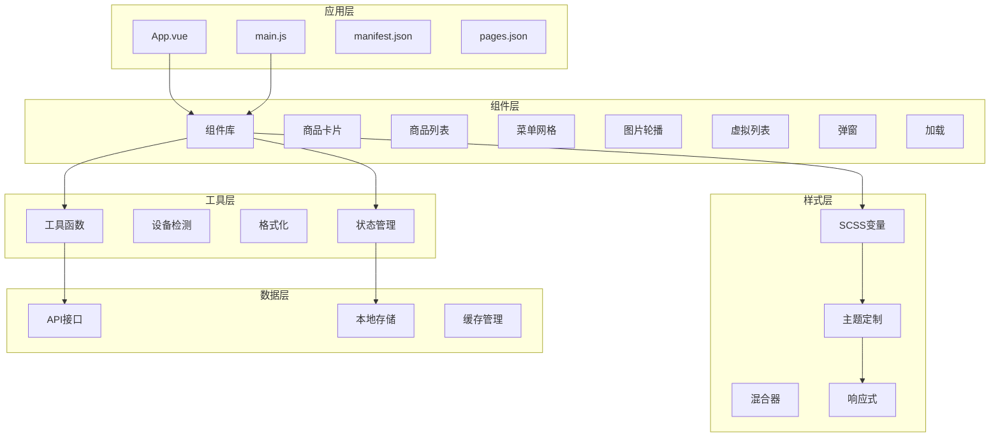

**图表来源**
- [App.vue](file://frontend/mall-uniapp/App.vue)
- [main.js](file://frontend/mall-uniapp/main.js)
- [sheep/index.js](file://frontend/mall-uniapp/sheep/index.js)

### 设计模式

#### 组件注册模式

组件库采用集中式注册的方式，便于管理和维护：

```javascript
// 组件注册示例
const components = {
  'goods-card': require('./components/goods-card/goods-card.vue'),
  'goods-list': require('./components/goods-list/goods-list.vue'),
  'menu-grid': require('./components/menu-grid/menu-grid.vue'),
  'image-carousel': require('./components/image-carousel/image-carousel.vue')
}

export default components
```

#### Props传递策略

所有组件都采用标准化的Props传递方式，确保一致的使用体验：

- **必需Props**：使用`required: true`明确标识
- **默认值**：为可选Props提供合理的默认值
- **类型验证**：使用Vue的Prop验证机制
- **文档注释**：详细的Props说明和使用示例

#### 事件处理机制

组件事件采用统一的命名规范和处理方式：

- **事件命名**：使用`on`前缀的驼峰命名
- **参数传递**：事件回调参数结构化
- **错误处理**：内置错误处理和日志记录
- **异步支持**：支持Promise和async/await

**章节来源**
- [sheep/index.js](file://frontend/mall-uniapp/sheep/index.js)
- [sheep/components/goods-card/goods-card.vue](file://frontend/mall-uniapp/sheep/components/goods-card/goods-card.vue)
- [sheep/components/goods-list/goods-list.vue](file://frontend/mall-uniapp/sheep/components/goods-list/goods-list.vue)

## 详细组件分析

### 商品卡片组件 (GoodsCard)

商品卡片组件是电商应用中最核心的展示组件，采用了精心设计的架构：

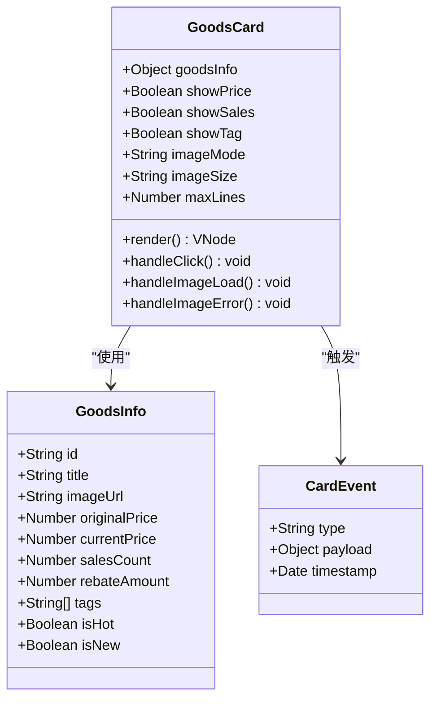

**图表来源**
- [sheep/components/goods-card/goods-card.vue](file://frontend/mall-uniapp/sheep/components/goods-card/goods-card.vue)

#### 核心功能实现

1. **图片处理**：支持多种图片格式和尺寸，内置懒加载和错误处理
2. **价格展示**：清晰的价格对比，支持返利金额的突出显示
3. **标签系统**：支持多种营销标签的动态显示
4. **交互反馈**：提供点击、长按等丰富的交互体验

#### 性能优化策略

- **图片懒加载**：仅在进入可视区域时加载图片
- **虚拟化渲染**：在列表中使用虚拟滚动减少DOM节点
- **缓存机制**：商品信息的本地缓存避免重复请求
- **防抖处理**：点击事件的防抖确保用户体验

### 商品列表组件 (GoodsList)

商品列表组件提供了灵活的商品展示和交互能力：

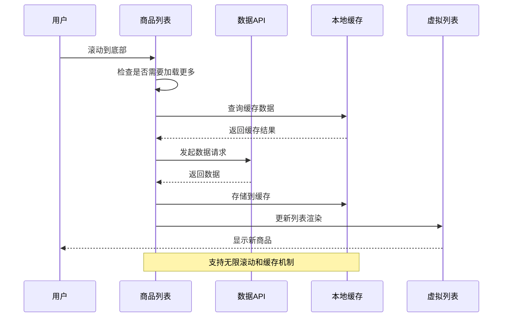

**图表来源**
- [sheep/components/goods-list/goods-list.vue](file://frontend/mall-uniapp/sheep/components/goods-list/goods-list.vue)

#### 核心特性

1. **无限滚动**：支持大数据量的无缝滚动加载
2. **筛选排序**：提供多维度的商品筛选和排序功能
3. **布局切换**：支持网格和列表两种布局模式
4. **性能优化**：内置虚拟滚动和懒加载机制

#### 数据流管理

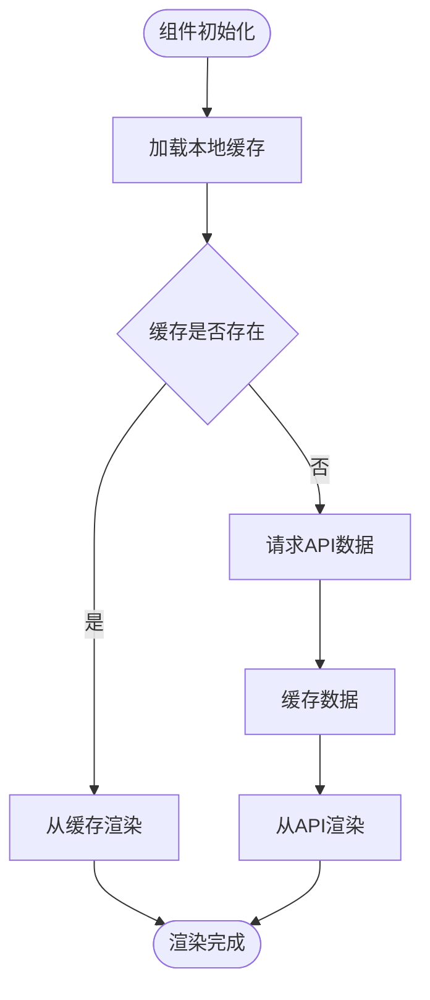

**章节来源**
- [sheep/components/goods-list/goods-list.vue](file://frontend/mall-uniapp/sheep/components/goods-list/goods-list.vue)

### 图片轮播组件 (ImageCarousel)

图片轮播组件专为商品图片展示设计，提供了丰富的交互功能：

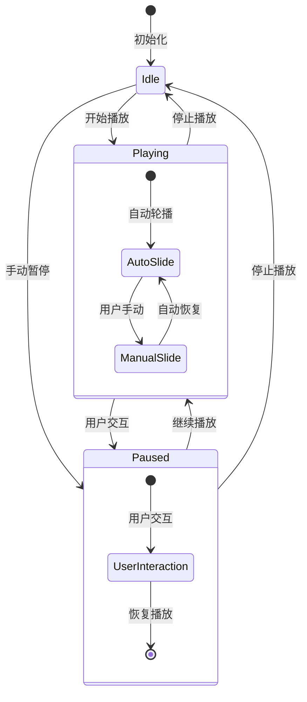

**图表来源**
- [sheep/components/image-carousel/image-carousel.vue](file://frontend/mall-uniapp/sheep/components/image-carousel/image-carousel.vue)

#### 核心功能

1. **自动播放**：支持设置播放间隔和方向
2. **手势控制**：支持左右滑动手势切换
3. **指示器**：圆形指示器显示当前页码
4. **缩放功能**：支持双击放大和滑动缩小

#### 交互流程

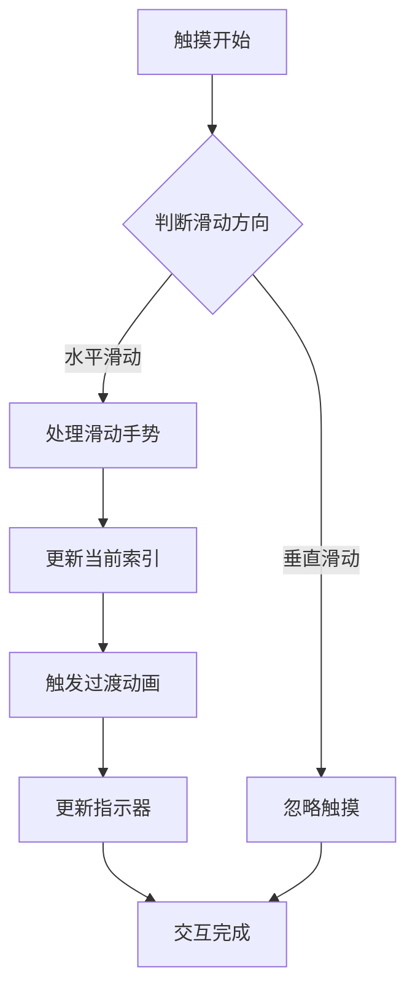

**章节来源**
- [sheep/components/image-carousel/image-carousel.vue](file://frontend/mall-uniapp/sheep/components/image-carousel/image-carousel.vue)

### 菜单网格组件 (MenuGrid)

菜单网格组件提供了灵活的功能导航展示：

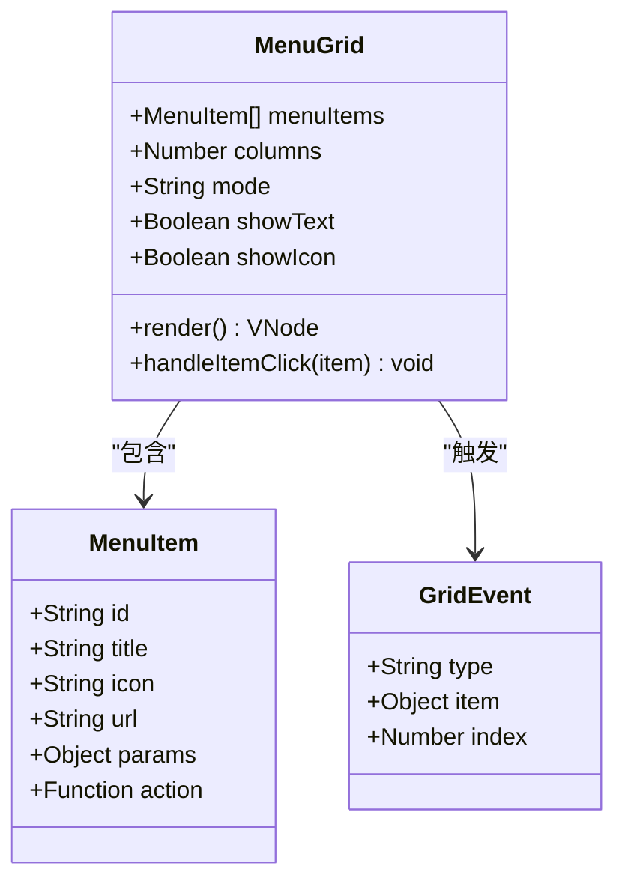

**图表来源**
- [sheep/components/menu-grid/menu-grid.vue](file://frontend/mall-uniapp/sheep/components/menu-grid/menu-grid.vue)

#### 布局策略

1. **响应式网格**：根据屏幕宽度自动调整列数
2. **图标文字组合**：支持图标和文字的灵活组合
3. **点击反馈**：提供视觉和触觉的点击反馈
4. **自适应高度**：根据内容自动调整行高

#### 性能优化

- **懒加载**：菜单项的延迟加载
- **缓存机制**：菜单配置的本地缓存
- **事件节流**：点击事件的节流处理

**章节来源**
- [sheep/components/menu-grid/menu-grid.vue](file://frontend/mall-uniapp/sheep/components/menu-grid/menu-grid.vue)

## 依赖关系分析

移动端UI组件库的依赖关系体现了清晰的层次结构和模块化设计：

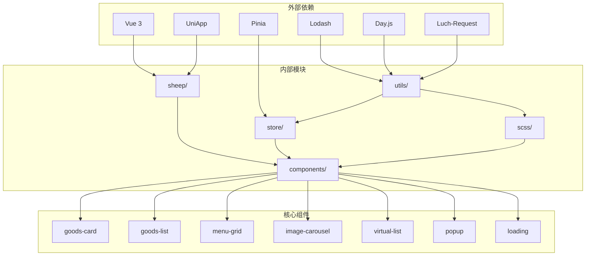

**图表来源**
- [package.json: 90-102:90-102](file://frontend/mall-uniapp/package.json#L90-L102)
- [sheep/index.js](file://frontend/mall-uniapp/sheep/index.js)

### 依赖管理策略

#### 核心依赖

1. **Vue 3 + UniApp**：提供响应式数据绑定和跨平台支持
2. **Pinia**：现代化的状态管理方案
3. **Lodash**：提供丰富的工具函数
4. **Day.js**：轻量级日期处理库
5. **Luch-Request**：HTTP请求封装

#### 组件间依赖

- **工具函数依赖**：所有组件都依赖utils模块
- **样式依赖**：组件共享SCSS变量和混合器
- **状态依赖**：Store模块被多个组件共享
- **API依赖**：组件通过统一的API接口访问数据

#### 版本兼容性

组件库确保与主流版本的兼容性：

- **Vue 3.5+**：充分利用Composition API
- **UniApp 4.0+**：支持最新的跨平台特性
- **Node.js 20+**：开发环境要求
- **pnpm 9+**：包管理器要求

**章节来源**
- [package.json: 90-102:90-102](file://frontend/mall-uniapp/package.json#L90-L102)
- [sheep/utils/device.js](file://frontend/mall-uniapp/sheep/utils/device.js)
- [sheep/utils/format.js](file://frontend/mall-uniapp/sheep/utils/format.js)

## 性能考虑

移动端UI组件库在设计时充分考虑了性能优化，采用了多种策略确保在各种设备上的流畅体验：

### 性能优化策略

#### 1. 懒加载机制

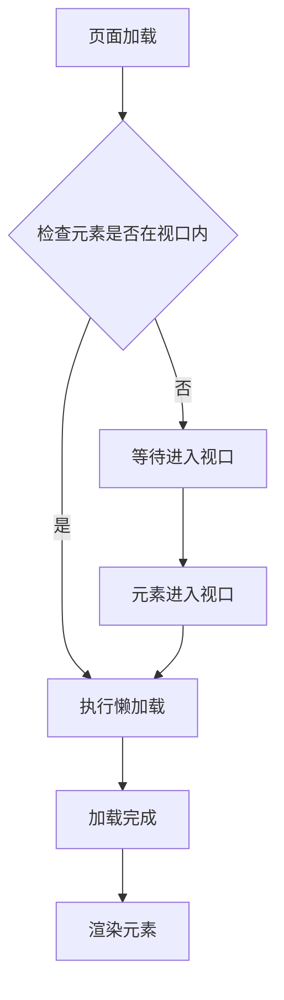

#### 2. 虚拟滚动

虚拟滚动技术有效解决了大数据量列表的性能问题：

- **可见区域渲染**：只渲染可视区域内的元素
- **动态高度**：支持动态高度的列表项
- **内存优化**：避免DOM节点过多导致的内存泄漏
- **滚动性能**：保持流畅的滚动体验

#### 3. 图片优化

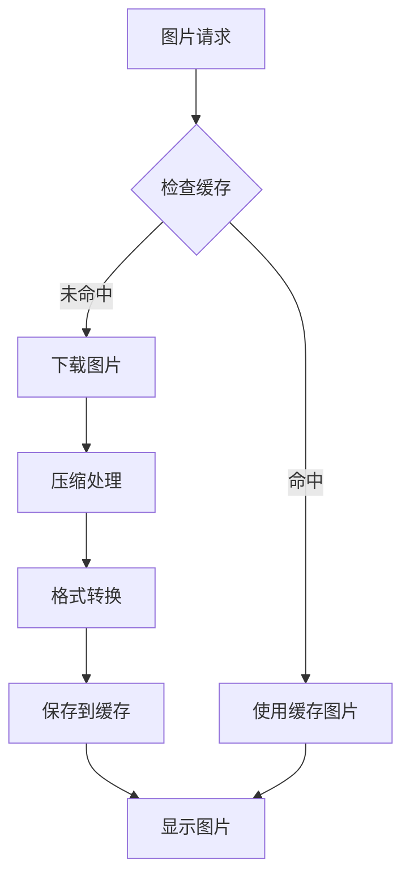

#### 4. 状态管理优化

- **局部状态**：组件内部状态尽量局部化
- **共享状态**：全局状态通过Pinia统一管理
- **状态持久化**：重要状态支持本地持久化
- **状态更新**：使用响应式更新避免不必要的重渲染

### 性能监控

组件库内置了性能监控机制：

- **渲染时间统计**：记录组件渲染耗时
- **内存使用监控**：跟踪内存使用情况
- **网络请求优化**：缓存策略和请求合并
- **错误捕获**：全局错误处理和上报

**章节来源**
- [sheep/components/virtual-list/virtual-list.vue](file://frontend/mall-uniapp/sheep/components/virtual-list/virtual-list.vue)
- [sheep/store/app.js](file://frontend/mall-uniapp/sheep/store/app.js)

## 故障排除指南

### 常见问题及解决方案

#### 1. 组件无法正常显示

**问题现象**：组件加载后不显示或显示异常

**可能原因**：
- Props参数传递错误
- 样式冲突
- 组件注册失败

**解决步骤**：
1. 检查组件Props参数的类型和值
2. 确认组件样式没有被外部样式覆盖
3. 验证组件是否正确注册到全局

#### 2. 性能问题

**问题现象**：页面滚动卡顿或加载缓慢

**可能原因**：
- 图片过大未压缩
- 组件渲染过多
- 内存泄漏

**解决步骤**：
1. 检查图片尺寸和格式
2. 使用虚拟滚动替代普通列表
3. 监控内存使用情况

#### 3. 跨平台兼容性问题

**问题现象**：在某些平台上显示异常

**可能原因**：
- 平台差异API使用
- 样式兼容性问题
- 设备特性差异

**解决步骤**：
1. 使用设备检测工具识别平台差异
2. 检查CSS兼容性声明
3. 验证API在各平台的可用性

### 调试工具

#### 1. 开发者工具

- **Vue DevTools**：组件状态和生命周期监控
- **H5调试**：通过浏览器开发者工具调试
- **真机调试**：使用DCloud提供的调试工具

#### 2. 性能分析

- **性能面板**：监控渲染性能
- **内存分析**：检测内存泄漏
- **网络监控**：分析请求性能

#### 3. 错误日志

- **控制台日志**：输出调试信息
- **错误边界**：捕获组件错误
- **异常上报**：收集生产环境错误

**章节来源**
- [sheep/utils/device.js](file://frontend/mall-uniapp/sheep/utils/device.js)

## 结论

AgenticCPS移动端UI组件库代表了现代移动端开发的最佳实践，通过AI自主编程和低代码理念的深度融合，实现了高效、稳定、可扩展的组件库解决方案。

### 主要成就

1. **技术创新**：100% AI自主编程的组件库实现
2. **性能卓越**：内置多种性能优化策略
3. **生态完善**：完整的组件生态系统
4. **开发友好**：简洁的API设计和完善的文档

### 未来展望

随着技术的不断发展，组件库将继续演进：

- **AI增强**：进一步提升AI辅助开发能力
- **性能优化**：持续改进渲染和加载性能
- **生态扩展**：增加更多专业领域的组件
- **国际化**：支持多语言和多地区适配

该组件库不仅为AgenticCPS项目提供了强大的前端支撑，也为整个CPS行业提供了一个高质量的移动端UI解决方案参考。

## 附录

### 开发规范

#### 1. 组件命名规范

- **文件命名**：使用kebab-case命名法
- **组件注册**：使用PascalCase注册名
- **Props命名**：使用camelCase命名
- **事件命名**：使用on前缀的camelCase

#### 2. 样式规范

- **SCSS变量**：统一的颜色和尺寸变量
- **混合器使用**：复用常用的样式模式
- **响应式设计**：适配不同屏幕尺寸
- **主题定制**：支持品牌色彩定制

#### 3. 性能规范

- **渲染优化**：避免不必要的重渲染
- **内存管理**：及时清理事件监听器
- **网络优化**：合理使用缓存策略
- **图片优化**：压缩和懒加载

#### 4. 测试规范

- **单元测试**：为关键组件编写测试用例
- **集成测试**：测试组件间的交互
- **性能测试**：监控组件性能指标
- **兼容性测试**：验证多平台兼容性

### 最佳实践

#### 1. 组件设计

- **单一职责**：每个组件专注于单一功能
- **可复用性**：设计通用性强的组件接口
- **可扩展性**：预留扩展点和插槽
- **可测试性**：便于单元测试和集成测试

#### 2. 数据管理

- **状态隔离**：组件内部状态尽量隔离
- **数据流清晰**：明确的数据流向和更新机制
- **缓存策略**：合理使用缓存提高性能
- **错误处理**：完善的错误处理和降级机制

#### 3. 用户体验

- **加载状态**：提供清晰的加载反馈
- **交互反馈**：及时的视觉和触觉反馈
- **无障碍支持**：支持屏幕阅读器等辅助技术
- **性能优先**：始终将用户体验放在首位