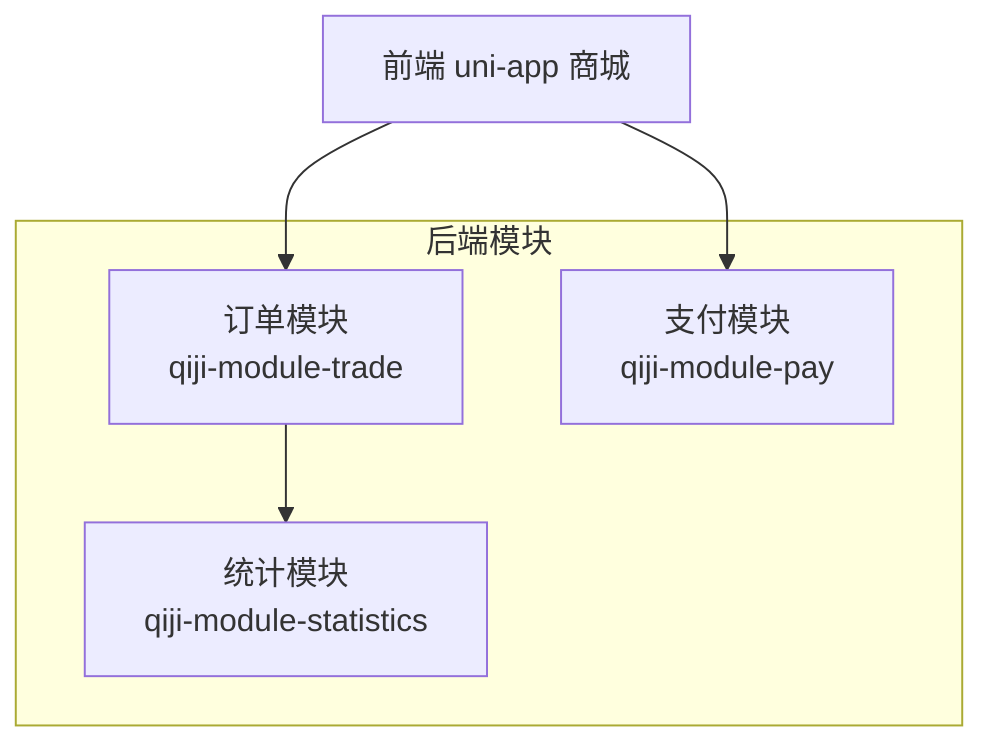
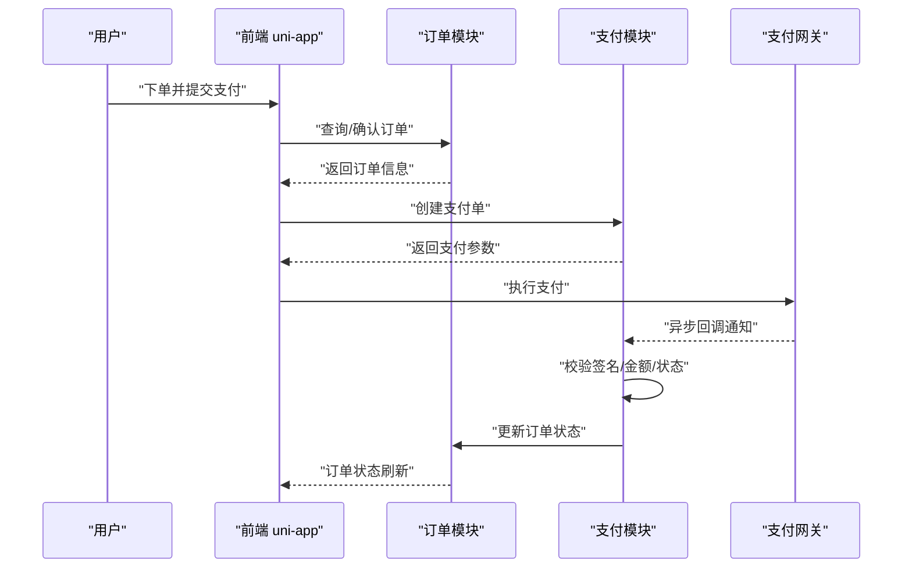
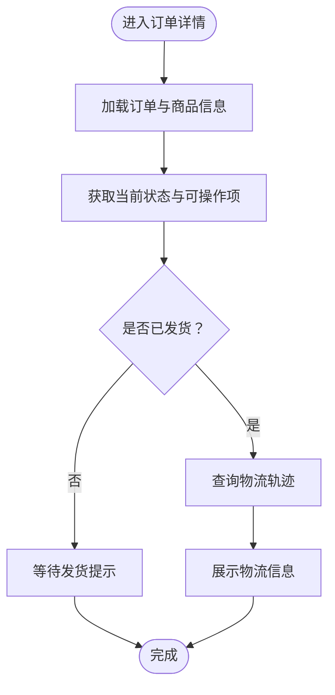
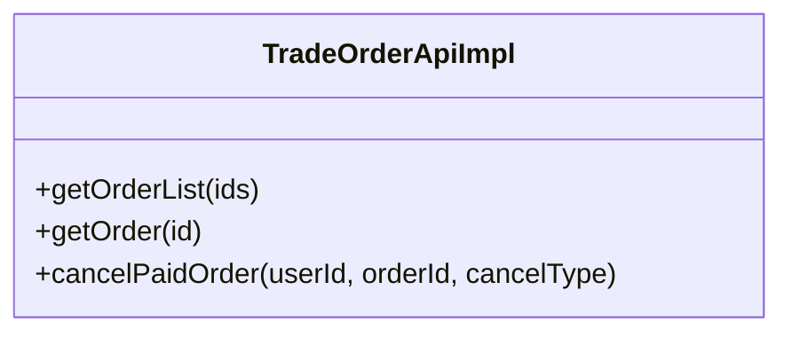
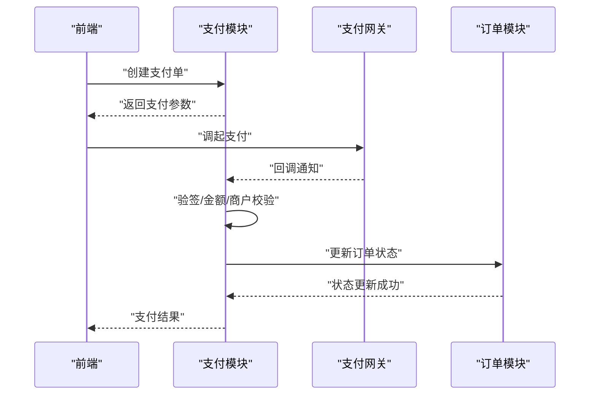
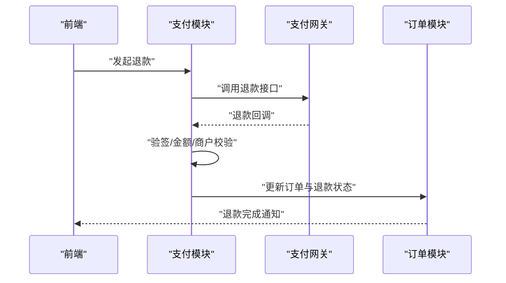
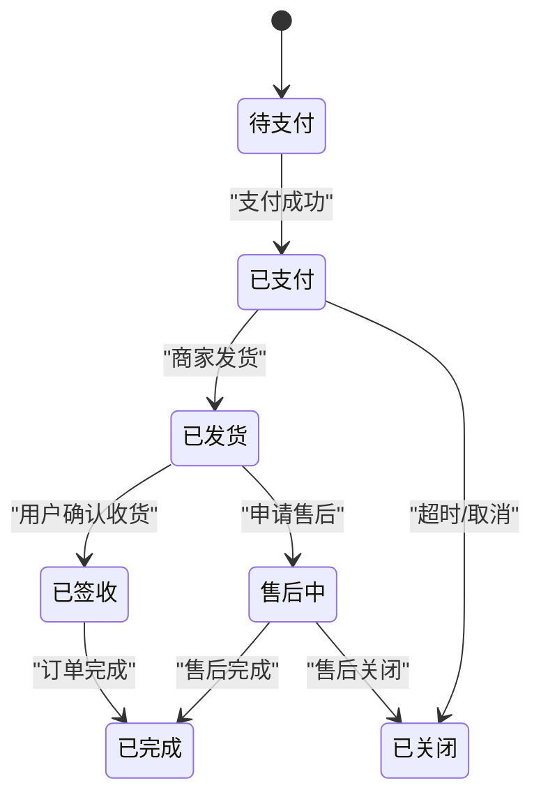
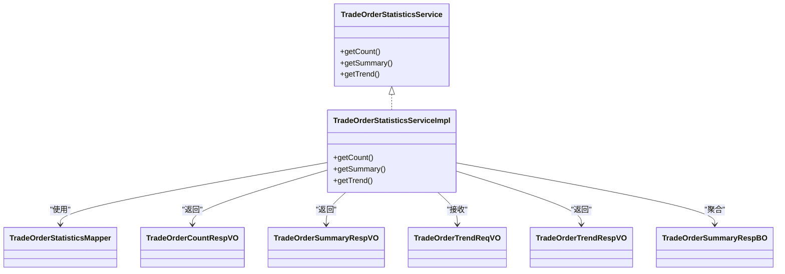
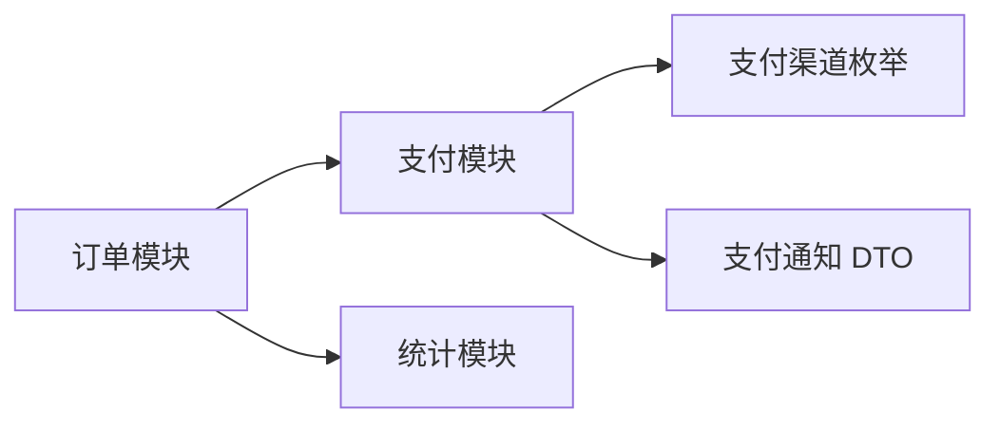

# 订单处理流程

<cite>
**本文引用的文件**
- [TradeOrderApiImpl.java](file://backend/qiji-module-mall/qiji-module-trade/src/main/java/com/qiji/cps/module/trade/api/order/TradeOrderApiImpl.java)
- [PayOrderApiImpl.java](file://backend/qiji-module-pay/src/main/java/com/qiji/cps/module/pay/api/order/PayOrderApiImpl.java)
- [PayChannelEnum.java](file://backend/qiji-module-pay/src/main/java/com/qiji/cps/module/pay/enums/PayChannelEnum.java)
- [PayOrderCreateReqDTO.java](file://backend/qiji-module-pay/src/main/java/com/qiji/cps/module/pay/api/order/dto/PayOrderCreateReqDTO.java)
- [PayOrderRespDTO.java](file://backend/qiji-module-pay/src/main/java/com/qiji/cps/module/pay/api/order/dto/PayOrderRespDTO.java)
- [PayOrderNotifyReqDTO.java](file://backend/qiji-module-pay/src/main/java/com/qiji/cps/module/pay/api/notify/dto/PayOrderNotifyReqDTO.java)
- [PayRefundApiImpl.java](file://backend/qiji-module-pay/src/main/java/com/qiji/cps/module/pay/api/refund/PayRefundApiImpl.java)
- [PayRefundCreateReqDTO.java](file://backend/qiji-module-pay/src/main/java/com/qiji/cps/module/pay/api/refund/dto/PayRefundCreateReqDTO.java)
- [PayRefundRespDTO.java](file://backend/qiji-module-pay/src/main/java/com/qiji/cps/module/pay/api/refund/dto/PayRefundRespDTO.java)
- [TradeOrderController.http](file://backend/qiji-module-mall/qiji-module-trade/src/main/java/com/qiji/cps/module/trade/controller/admin/order/TradeOrderController.http)
- [AppPayOrderController.java](file://backend/qiji-module-pay/src/main/java/com/qiji/cps/module/pay/controller/app/order/AppPayOrderController.java)
- [AppPayOrderSubmitReqVO.java](file://backend/qiji-module-pay/src/main/java/com/qiji/cps/module/pay/controller/app/order/vo/AppPayOrderSubmitReqVO.java)
- [AppPayOrderSubmitRespVO.java](file://backend/qiji-module-pay/src/main/java/com/qiji/cps/module/pay/controller/app/order/vo/AppPayOrderSubmitRespVO.java)
- [TradeOrderCountRespVO.java](file://backend/qiji-module-mall/qiji-module-statistics/src/main/java/com/qiji/cps/module/statistics/controller/admin/trade/vo/TradeOrderCountRespVO.java)
- [TradeOrderSummaryRespVO.java](file://backend/qiji-module-mall/qiji-module-statistics/src/main/java/com/qiji/cps/module/statistics/controller/admin/trade/vo/TradeOrderSummaryRespVO.java)
- [TradeOrderTrendReqVO.java](file://backend/qiji-module-mall/qiji-module-statistics/src/main/java/com/qiji/cps/module/statistics/controller/admin/trade/vo/TradeOrderTrendReqVO.java)
- [TradeOrderTrendRespVO.java](file://backend/qiji-module-mall/qiji-module-statistics/src/main/java/com/qiji/cps/module/statistics/controller/admin/trade/vo/TradeOrderTrendRespVO.java)
- [TradeOrderStatisticsMapper.java](file://backend/qiji-module-mall/qiji-module-statistics/src/main/java/com/qiji/cps/module/statistics/dal/mysql/trade/TradeOrderStatisticsMapper.java)
- [TradeOrderStatisticsService.java](file://backend/qiji-module-mall/qiji-module-statistics/src/main/java/com/qiji/cps/module/statistics/service/trade/TradeOrderStatisticsService.java)
- [TradeOrderStatisticsServiceImpl.java](file://backend/qiji-module-mall/qiji-module-statistics/src/main/java/com/qiji/cps/module/statistics/service/trade/TradeOrderStatisticsServiceImpl.java)
- [TradeOrderSummaryRespBO.java](file://backend/qiji-module-mall/qiji-module-statistics/src/main/java/com/qiji/cps/module/statistics/service/trade/bo/TradeOrderSummaryRespBO.java)
- [TradeOrderStatisticsMapper.xml](file://backend/qiji-module-mall/qiji-module-statistics/src/main/resources/mapper/trade/TradeOrderStatisticsMapper.xml)
</cite>

## 目录
1. [引言](#引言)
2. [项目结构](#项目结构)
3. [核心组件](#核心组件)
4. [架构总览](#架构总览)
5. [详细组件分析](#详细组件分析)
6. [依赖分析](#依赖分析)
7. [性能考虑](#性能考虑)
8. [故障排查指南](#故障排查指南)
9. [结论](#结论)
10. [附录](#附录)

## 引言
本技术文档围绕 AgenticCPS 商城的订单处理流程，系统性梳理从“订单确认”到“订单完成”的关键环节，覆盖收货地址管理、商品清单核对、优惠券与积分使用、运费计算、订单详情与状态跟踪、物流信息查询、售后与退款、支付集成与回调、以及订单数据生命周期与异常处理。文档以代码级映射与可视化图示呈现，帮助开发者快速理解并扩展电商订单系统。

## 项目结构
后端采用多模块分层架构：订单模块（trade）、支付模块（pay）、统计模块（statistics），前端包含 uni-app 商城客户端与 admin 后台。本文聚焦后端模块中与订单处理直接相关的接口与服务实现，并结合支付模块的支付单与退款能力进行端到端说明。

**图表来源**
- [TradeOrderApiImpl.java:1-44](file://backend/qiji-module-mall/qiji-module-trade/src/main/java/com/qiji/cps/module/trade/api/order/TradeOrderApiImpl.java#L1-L44)
- [PayOrderApiImpl.java:1-40](file://backend/qiji-module-pay/src/main/java/com/qiji/cps/module/pay/api/order/PayOrderApiImpl.java#L1-L40)
- [TradeOrderStatisticsService.java](file://backend/qiji-module-mall/qiji-module-statistics/src/main/java/com/qiji/cps/module/statistics/service/trade/TradeOrderStatisticsService.java)

**章节来源**
- [TradeOrderApiImpl.java:1-44](file://backend/qiji-module-mall/qiji-module-trade/src/main/java/com/qiji/cps/module/trade/api/order/TradeOrderApiImpl.java#L1-L44)
- [PayOrderApiImpl.java:1-40](file://backend/qiji-module-pay/src/main/java/com/qiji/cps/module/pay/api/order/PayOrderApiImpl.java#L1-L40)
- [TradeOrderStatisticsService.java](file://backend/qiji-module-mall/qiji-module-statistics/src/main/java/com/qiji/cps/module/statistics/service/trade/TradeOrderStatisticsService.java)

## 核心组件
- 订单 API 实现：负责订单查询、取消等操作的对外接口封装。
- 支付 API 实现：负责支付单创建、查询、价格更新等。
- 支付渠道枚举：定义支持的支付渠道（如微信、支付宝等）。
- 支付通知 DTO：用于接收第三方支付回调参数。
- 退款 API 实现：负责发起退款与查询退款结果。
- 统计服务：提供订单数量、汇总、趋势等统计能力。

**章节来源**
- [TradeOrderApiImpl.java:1-44](file://backend/qiji-module-mall/qiji-module-trade/src/main/java/com/qiji/cps/module/trade/api/order/TradeOrderApiImpl.java#L1-L44)
- [PayOrderApiImpl.java:1-40](file://backend/qiji-module-pay/src/main/java/com/qiji/cps/module/pay/api/order/PayOrderApiImpl.java#L1-L40)
- [PayChannelEnum.java:1-68](file://backend/qiji-module-pay/src/main/java/com/qiji/cps/module/pay/enums/PayChannelEnum.java#L1-L68)
- [PayOrderNotifyReqDTO.java](file://backend/qiji-module-pay/src/main/java/com/qiji/cps/module/pay/api/notify/dto/PayOrderNotifyReqDTO.java)
- [PayRefundApiImpl.java](file://backend/qiji-module-pay/src/main/java/com/qiji/cps/module/pay/api/refund/PayRefundApiImpl.java)
- [TradeOrderStatisticsService.java](file://backend/qiji-module-mall/qiji-module-statistics/src/main/java/com/qiji/cps/module/statistics/service/trade/TradeOrderStatisticsService.java)

## 架构总览
订单处理在后端由“订单模块”与“支付模块”协同完成，前端通过 HTTP 接口调用。支付回调由支付模块接收并落库，随后触发业务状态变更；统计模块基于订单数据提供运营报表。

**图表来源**
- [TradeOrderApiImpl.java:28-41](file://backend/qiji-module-mall/qiji-module-trade/src/main/java/com/qiji/cps/module/trade/api/order/TradeOrderApiImpl.java#L28-L41)
- [PayOrderApiImpl.java:23-37](file://backend/qiji-module-pay/src/main/java/com/qiji/cps/module/pay/api/order/PayOrderApiImpl.java#L23-L37)
- [PayOrderNotifyReqDTO.java](file://backend/qiji-module-pay/src/main/java/com/qiji/cps/module/pay/api/notify/dto/PayOrderNotifyReqDTO.java)

## 详细组件分析

### 订单确认页面设计
- 收货地址管理：前端选择或新增地址，后端提供地址有效性校验与默认地址设置逻辑（具体实现位于地址模块，此处不展开）。
- 商品清单核对：前端展示购物车/下单商品明细，后端提供订单生成前的商品校验与库存锁定。
- 优惠券使用：前端提交优惠券 ID，后端计算优惠金额并回写订单应付金额。
- 积分抵扣：前端提交积分数量，后端按规则折算抵扣并回写应付金额。
- 运费计算：根据收货地址与商品重量/体积计算运费，或满减策略应用。

上述流程在后端通过订单 API 的查询与更新能力支撑，前端负责交互与参数传递。

**章节来源**
- [TradeOrderApiImpl.java:28-41](file://backend/qiji-module-mall/qiji-module-trade/src/main/java/com/qiji/cps/module/trade/api/order/TradeOrderApiImpl.java#L28-L41)

### 订单详情页面功能
- 订单状态跟踪：后端提供订单状态枚举与流转规则，前端轮询或监听状态变化。
- 物流信息查询：对接快递查询接口或第三方物流平台，后端提供物流轨迹存储与查询。
- 售后服务申请：前端提交售后申请，后端校验订单状态与售后规则，生成售后单据。

**图表来源**
- [TradeOrderApiImpl.java:33-36](file://backend/qiji-module-mall/qiji-module-trade/src/main/java/com/qiji/cps/module/trade/api/order/TradeOrderApiImpl.java#L33-L36)

**章节来源**
- [TradeOrderApiImpl.java:33-36](file://backend/qiji-module-mall/qiji-module-trade/src/main/java/com/qiji/cps/module/trade/api/order/TradeOrderApiImpl.java#L33-L36)

### 订单列表页面实现
- 订单筛选：支持按时间、状态、关键字等条件筛选。
- 状态分类：根据订单状态进行分组展示。
- 批量操作：支持批量取消、批量提醒发货等。
- 订单评价：支持批量跳转至评价页面或发起评价。

**图表来源**
- [TradeOrderApiImpl.java:28-41](file://backend/qiji-module-mall/qiji-module-trade/src/main/java/com/qiji/cps/module/trade/api/order/TradeOrderApiImpl.java#L28-L41)

**章节来源**
- [TradeOrderApiImpl.java:28-41](file://backend/qiji-module-mall/qiji-module-trade/src/main/java/com/qiji/cps/module/trade/api/order/TradeOrderApiImpl.java#L28-L41)

### 支付集成实现指南
- 多种支付方式：通过支付渠道枚举定义可用渠道（微信 JSAPI、小程序、App、Native、Wap，以及支付宝 PC/Wap/App/Qr/Bar 等）。
- 支付单创建：前端传入支付参数，后端创建支付单并返回支付凭证。
- 支付状态回调：支付网关异步回调至支付模块，后端校验签名与金额后更新支付单与订单状态。
- 支付安全验证：校验回调参数签名、金额一致性、商户信息匹配。

**图表来源**
- [PayOrderApiImpl.java:23-37](file://backend/qiji-module-pay/src/main/java/com/qiji/cps/module/pay/api/order/PayOrderApiImpl.java#L23-L37)
- [PayChannelEnum.java:18-35](file://backend/qiji-module-pay/src/main/java/com/qiji/cps/module/pay/enums/PayChannelEnum.java#L18-L35)
- [PayOrderNotifyReqDTO.java](file://backend/qiji-module-pay/src/main/java/com/qiji/cps/module/pay/api/notify/dto/PayOrderNotifyReqDTO.java)

**章节来源**
- [PayOrderApiImpl.java:23-37](file://backend/qiji-module-pay/src/main/java/com/qiji/cps/module/pay/api/order/PayOrderApiImpl.java#L23-L37)
- [PayChannelEnum.java:18-67](file://backend/qiji-module-pay/src/main/java/com/qiji/cps/module/pay/enums/PayChannelEnum.java#L18-L67)
- [PayOrderCreateReqDTO.java](file://backend/qiji-module-pay/src/main/java/com/qiji/cps/module/pay/api/order/dto/PayOrderCreateReqDTO.java)
- [PayOrderRespDTO.java](file://backend/qiji-module-pay/src/main/java/com/qiji/cps/module/pay/api/order/dto/PayOrderRespDTO.java)
- [PayOrderNotifyReqDTO.java](file://backend/qiji-module-pay/src/main/java/com/qiji/cps/module/pay/api/notify/dto/PayOrderNotifyReqDTO.java)

### 退款流程设计
- 发起退款：前端提交退款申请，后端校验订单状态与退款规则，创建退款单。
- 退款回调：支付网关回调退款结果，后端更新退款单状态并回写订单。
- 退款完成：订单状态回滚至可售后或关闭，资金原路退回。

**图表来源**
- [PayRefundApiImpl.java](file://backend/qiji-module-pay/src/main/java/com/qiji/cps/module/pay/api/refund/PayRefundApiImpl.java)
- [PayRefundCreateReqDTO.java](file://backend/qiji-module-pay/src/main/java/com/qiji/cps/module/pay/api/refund/dto/PayRefundCreateReqDTO.java)
- [PayRefundRespDTO.java](file://backend/qiji-module-pay/src/main/java/com/qiji/cps/module/pay/api/refund/dto/PayRefundRespDTO.java)

**章节来源**
- [PayRefundApiImpl.java](file://backend/qiji-module-pay/src/main/java/com/qiji/cps/module/pay/api/refund/PayRefundApiImpl.java)
- [PayRefundCreateReqDTO.java](file://backend/qiji-module-pay/src/main/java/com/qiji/cps/module/pay/api/refund/dto/PayRefundCreateReqDTO.java)
- [PayRefundRespDTO.java](file://backend/qiji-module-pay/src/main/java/com/qiji/cps/module/pay/api/refund/dto/PayRefundRespDTO.java)

### 订单数据生命周期管理
- 创建：生成订单与支付单，锁定库存。
- 支付：支付成功后更新订单状态为已支付。
- 发货：商家发货后更新物流信息与状态。
- 完成：确认收货后订单完成，可评价。
- 关闭：超时未支付或取消后订单关闭，释放库存。

[此图为概念性流程示意，无需图表来源]

### 订单统计与运营看板
- 订单数量与汇总：提供订单总量、GMV、客单价等指标。
- 订单趋势：按日/周/月统计订单量与金额走势。
- 统计接口：通过统计服务与 Mapper 提供查询能力。

**图表来源**
- [TradeOrderStatisticsService.java](file://backend/qiji-module-mall/qiji-module-statistics/src/main/java/com/qiji/cps/module/statistics/service/trade/TradeOrderStatisticsService.java)
- [TradeOrderStatisticsServiceImpl.java](file://backend/qiji-module-mall/qiji-module-statistics/src/main/java/com/qiji/cps/module/statistics/service/trade/TradeOrderStatisticsServiceImpl.java)
- [TradeOrderCountRespVO.java](file://backend/qiji-module-mall/qiji-module-statistics/src/main/java/com/qiji/cps/module/statistics/controller/admin/trade/vo/TradeOrderCountRespVO.java)
- [TradeOrderSummaryRespVO.java](file://backend/qiji-module-mall/qiji-module-statistics/src/main/java/com/qiji/cps/module/statistics/controller/admin/trade/vo/TradeOrderSummaryRespVO.java)
- [TradeOrderTrendReqVO.java](file://backend/qiji-module-mall/qiji-module-statistics/src/main/java/com/qiji/cps/module/statistics/controller/admin/trade/vo/TradeOrderTrendReqVO.java)
- [TradeOrderTrendRespVO.java](file://backend/qiji-module-mall/qiji-module-statistics/src/main/java/com/qiji/cps/module/statistics/controller/admin/trade/vo/TradeOrderTrendRespVO.java)
- [TradeOrderStatisticsMapper.java](file://backend/qiji-module-mall/qiji-module-statistics/src/main/java/com/qiji/cps/module/statistics/dal/mysql/trade/TradeOrderStatisticsMapper.java)
- [TradeOrderSummaryRespBO.java](file://backend/qiji-module-mall/qiji-module-statistics/src/main/java/com/qiji/cps/module/statistics/service/trade/bo/TradeOrderSummaryRespBO.java)

**章节来源**
- [TradeOrderStatisticsService.java](file://backend/qiji-module-mall/qiji-module-statistics/src/main/java/com/qiji/cps/module/statistics/service/trade/TradeOrderStatisticsService.java)
- [TradeOrderStatisticsServiceImpl.java](file://backend/qiji-module-mall/qiji-module-statistics/src/main/java/com/qiji/cps/module/statistics/service/trade/TradeOrderStatisticsServiceImpl.java)
- [TradeOrderStatisticsMapper.xml](file://backend/qiji-module-mall/qiji-module-statistics/src/main/resources/mapper/trade/TradeOrderStatisticsMapper.xml)

## 依赖分析
- 订单模块依赖支付模块的支付单能力，用于支付状态联动。
- 支付模块依赖支付渠道枚举与通知 DTO，确保多渠道统一接入与安全校验。
- 统计模块依赖订单数据，提供运营侧指标。

**图表来源**
- [TradeOrderApiImpl.java:1-44](file://backend/qiji-module-mall/qiji-module-trade/src/main/java/com/qiji/cps/module/trade/api/order/TradeOrderApiImpl.java#L1-L44)
- [PayOrderApiImpl.java:1-40](file://backend/qiji-module-pay/src/main/java/com/qiji/cps/module/pay/api/order/PayOrderApiImpl.java#L1-L40)
- [PayChannelEnum.java:1-68](file://backend/qiji-module-pay/src/main/java/com/qiji/cps/module/pay/enums/PayChannelEnum.java#L1-L68)
- [PayOrderNotifyReqDTO.java](file://backend/qiji-module-pay/src/main/java/com/qiji/cps/module/pay/api/notify/dto/PayOrderNotifyReqDTO.java)
- [TradeOrderStatisticsService.java](file://backend/qiji-module-mall/qiji-module-statistics/src/main/java/com/qiji/cps/module/statistics/service/trade/TradeOrderStatisticsService.java)

**章节来源**
- [TradeOrderApiImpl.java:1-44](file://backend/qiji-module-mall/qiji-module-trade/src/main/java/com/qiji/cps/module/trade/api/order/TradeOrderApiImpl.java#L1-L44)
- [PayOrderApiImpl.java:1-40](file://backend/qiji-module-pay/src/main/java/com/qiji/cps/module/pay/api/order/PayOrderApiImpl.java#L1-L40)
- [PayChannelEnum.java:1-68](file://backend/qiji-module-pay/src/main/java/com/qiji/cps/module/pay/enums/PayChannelEnum.java#L1-L68)
- [PayOrderNotifyReqDTO.java](file://backend/qiji-module-pay/src/main/java/com/qiji/cps/module/pay/api/notify/dto/PayOrderNotifyReqDTO.java)
- [TradeOrderStatisticsService.java](file://backend/qiji-module-mall/qiji-module-statistics/src/main/java/com/qiji/cps/module/statistics/service/trade/TradeOrderStatisticsService.java)

## 性能考虑
- 订单查询：对订单主表与订单项表进行分页与索引优化，避免 N+1 查询。
- 支付回调：异步处理回调，幂等校验与分布式锁控制重复处理。
- 统计查询：对高频指标建立缓存与定时聚合，降低实时查询压力。
- 并发控制：支付与库存锁定需使用数据库事务与行级锁，保证一致性。

[本节为通用指导，无需章节来源]

## 故障排查指南
- 支付回调验签失败：检查回调参数签名算法、密钥配置与参数完整性。
- 支付金额不一致：核对订单应付金额与回调金额，确保未被篡改。
- 订单状态异常：检查支付回调处理链路与订单状态机转换规则。
- 退款失败：确认退款渠道可用、参数正确与账户余额充足。

**章节来源**
- [PayOrderNotifyReqDTO.java](file://backend/qiji-module-pay/src/main/java/com/qiji/cps/module/pay/api/notify/dto/PayOrderNotifyReqDTO.java)
- [PayOrderApiImpl.java:23-37](file://backend/qiji-module-pay/src/main/java/com/qiji/cps/module/pay/api/order/PayOrderApiImpl.java#L23-L37)

## 结论
本文档从订单确认、详情、列表到支付与退款的全流程进行了系统化梳理，并结合后端模块的接口与服务实现给出了端到端的架构视图与排障建议。开发者可据此快速落地电商订单系统，并在此基础上扩展更多业务场景。

## 附录
- 订单模块接口参考：可通过 HTTP 接口调试工具查看订单相关接口行为。
- 支付渠道扩展：新增支付渠道时，需同步完善渠道枚举与回调处理逻辑。
- 统计维度扩展：可在统计服务中增加新的指标与趋势分析。

**章节来源**
- [TradeOrderController.http](file://backend/qiji-module-mall/qiji-module-trade/src/main/java/com/qiji/cps/module/trade/controller/admin/order/TradeOrderController.http)
- [AppPayOrderController.java](file://backend/qiji-module-pay/src/main/java/com/qiji/cps/module/pay/controller/app/order/AppPayOrderController.java)
- [AppPayOrderSubmitReqVO.java](file://backend/qiji-module-pay/src/main/java/com/qiji/cps/module/pay/controller/app/order/vo/AppPayOrderSubmitReqVO.java)
- [AppPayOrderSubmitRespVO.java](file://backend/qiji-module-pay/src/main/java/com/qiji/cps/module/pay/controller/app/order/vo/AppPayOrderSubmitRespVO.java)