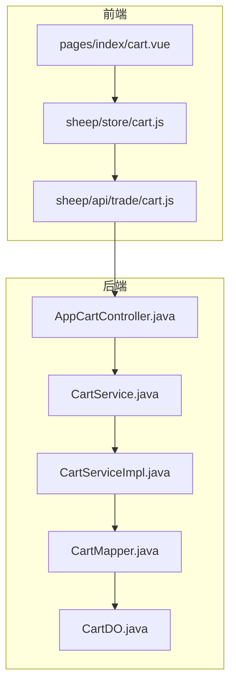
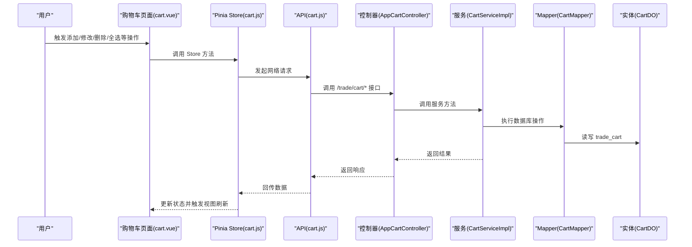
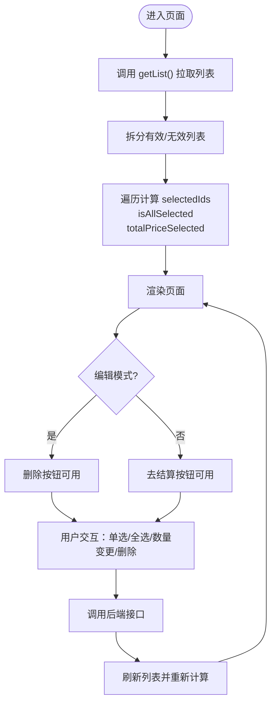
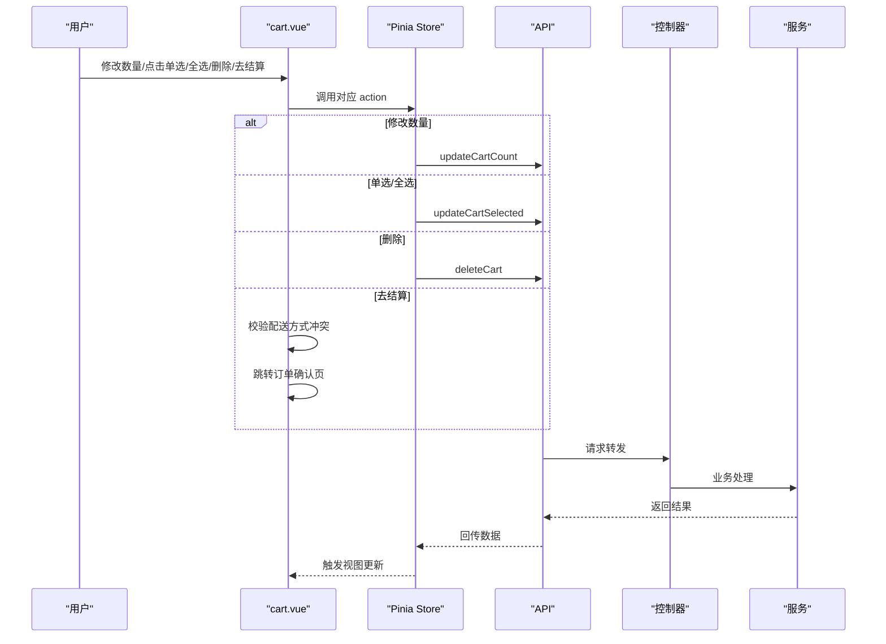
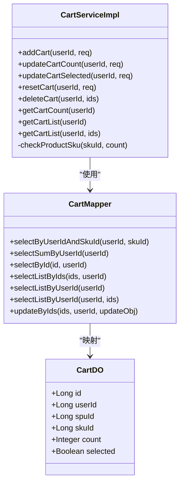

# 购物车系统

<cite>
**本文引用的文件**
- [cart.js（前端 API）](file://frontend/mall-uniapp/sheep/api/trade/cart.js)
- [cart.js（前端 Pinia Store）](file://frontend/mall-uniapp/sheep/store/cart.js)
- [cart.vue（购物车页面）](file://frontend/mall-uniapp/pages/index/cart.vue)
- [AppCartController.java（后端控制器）](file://backend/qiji-module-mall/qiji-module-trade/src/main/java/com/qiji/cps/module/trade/controller/app/cart/AppCartController.java)
- [CartService.java（后端服务接口）](file://backend/qiji-module-mall/qiji-module-trade/src/main/java/com/qiji/cps/module/trade/service/cart/CartService.java)
- [CartServiceImpl.java（后端服务实现）](file://backend/qiji-module-mall/qiji-module-trade/src/main/java/com/qiji/cps/module/trade/service/cart/CartServiceImpl.java)
- [CartMapper.java（后端 Mapper）](file://backend/qiji-module-mall/qiji-module-trade/src/main/java/com/qiji/cps/module/trade/dal/mysql/cart/CartMapper.java)
- [CartDO.java（后端实体）](file://backend/qiji-module-mall/qiji-module-trade/src/main/java/com/qiji/cps/module/trade/dal/dataobject/cart/CartDO.java)
</cite>

## 目录
1. [简介](#简介)
2. [项目结构](#项目结构)
3. [核心组件](#核心组件)
4. [架构总览](#架构总览)
5. [详细组件分析](#详细组件分析)
6. [依赖分析](#依赖分析)
7. [性能考虑](#性能考虑)
8. [故障排查指南](#故障排查指南)
9. [结论](#结论)
10. [附录](#附录)

## 简介
本技术文档围绕 AgenticCPS 商城的购物车系统，从状态管理、数据持久化、UI 设计、与商品详情及下单流程的数据交互、并发与一致性保障、以及性能优化等方面进行全面解析，并提供面向开发者的完整实现指南。系统采用前后端分离架构：前端使用 UniApp + Vue3 + Pinia，后端基于 Spring Boot + MyBatis，数据持久化于数据库表 trade_cart。

## 项目结构
购物车系统涉及的文件分布如下：
- 前端
  - API 层：封装对后端 /trade/cart 的请求
  - Store 层：集中管理购物车状态（列表、选中集合、全选状态、总价等）
  - 页面层：购物车页面，负责渲染、交互与下单前校验
- 后端
  - 控制器：暴露 /trade/cart/* 接口
  - 服务层：业务逻辑（新增、更新、删除、重置、查询）
  - 数据访问层：Mapper 封装 SQL 查询与更新
  - 实体层：数据库表 trade_cart 的 Java 映射

图表来源
- [cart.js（前端 API）:1-50](file://frontend/mall-uniapp/sheep/api/trade/cart.js#L1-L50)
- [cart.js（前端 Pinia Store）:1-122](file://frontend/mall-uniapp/sheep/store/cart.js#L1-L122)
- [cart.vue（购物车页面）:1-316](file://frontend/mall-uniapp/pages/index/cart.vue#L1-L316)
- [AppCartController.java（后端控制器）:1-80](file://backend/qiji-module-mall/qiji-module-trade/src/main/java/com/qiji/cps/module/trade/controller/app/cart/AppCartController.java#L1-L80)
- [CartService.java（后端服务接口）:1-87](file://backend/qiji-module-mall/qiji-module-trade/src/main/java/com/qiji/cps/module/trade/service/cart/CartService.java#L1-L87)
- [CartServiceImpl.java（后端服务实现）:1-197](file://backend/qiji-module-mall/qiji-module-trade/src/main/java/com/qiji/cps/module/trade/service/cart/CartServiceImpl.java#L1-L197)
- [CartMapper.java（后端 Mapper）:1-63](file://backend/qiji-module-mall/qiji-module-trade/src/main/java/com/qiji/cps/module/trade/dal/mysql/cart/CartMapper.java#L1-L63)
- [CartDO.java（后端实体）:1-58](file://backend/qiji-module-mall/qiji-module-trade/src/main/java/com/qiji/cps/module/trade/dal/dataobject/cart/CartDO.java#L1-L58)

章节来源
- [cart.js（前端 API）:1-50](file://frontend/mall-uniapp/sheep/api/trade/cart.js#L1-L50)
- [cart.js（前端 Pinia Store）:1-122](file://frontend/mall-uniapp/sheep/store/cart.js#L1-L122)
- [cart.vue（购物车页面）:1-316](file://frontend/mall-uniapp/pages/index/cart.vue#L1-L316)
- [AppCartController.java（后端控制器）:1-80](file://backend/qiji-module-mall/qiji-module-trade/src/main/java/com/qiji/cps/module/trade/controller/app/cart/AppCartController.java#L1-L80)
- [CartService.java（后端服务接口）:1-87](file://backend/qiji-module-mall/qiji-module-trade/src/main/java/com/qiji/cps/module/trade/service/cart/CartService.java#L1-L87)
- [CartServiceImpl.java（后端服务实现）:1-197](file://backend/qiji-module-mall/qiji-module-trade/src/main/java/com/qiji/cps/module/trade/service/cart/CartServiceImpl.java#L1-L197)
- [CartMapper.java（后端 Mapper）:1-63](file://backend/qiji-module-mall/qiji-module-trade/src/main/java/com/qiji/cps/module/trade/dal/mysql/cart/CartMapper.java#L1-L63)
- [CartDO.java（后端实体）:1-58](file://backend/qiji-module-mall/qiji-module-trade/src/main/java/com/qiji/cps/module/trade/dal/dataobject/cart/CartDO.java#L1-L58)

## 核心组件
- 前端 API 层：封装购物车相关请求，统一处理成功提示与认证开关
- 前端 Store 层：集中维护购物车列表、选中集合、全选状态、总价、编辑模式等，并持久化到本地
- 前端页面层：渲染购物车列表、数量输入框、全选/单选、删除、去结算等交互
- 后端控制器：暴露新增、更新数量、更新选中、删除、重置、查询数量、查询列表等接口
- 后端服务层：校验 SKU、库存，执行新增、更新、删除、重置、查询等业务逻辑
- 后端 Mapper：封装按用户、ID、SKU 组合查询与批量更新
- 后端实体：trade_cart 表的 Java 映射，包含用户、SPU、SKU、数量、选中状态等字段

章节来源
- [cart.js（前端 API）:1-50](file://frontend/mall-uniapp/sheep/api/trade/cart.js#L1-L50)
- [cart.js（前端 Pinia Store）:1-122](file://frontend/mall-uniapp/sheep/store/cart.js#L1-L122)
- [cart.vue（购物车页面）:1-316](file://frontend/mall-uniapp/pages/index/cart.vue#L1-L316)
- [AppCartController.java（后端控制器）:1-80](file://backend/qiji-module-mall/qiji-module-trade/src/main/java/com/qiji/cps/module/trade/controller/app/cart/AppCartController.java#L1-L80)
- [CartService.java（后端服务接口）:1-87](file://backend/qiji-module-mall/qiji-module-trade/src/main/java/com/qiji/cps/module/trade/service/cart/CartService.java#L1-L87)
- [CartServiceImpl.java（后端服务实现）:1-197](file://backend/qiji-module-mall/qiji-module-trade/src/main/java/com/qiji/cps/module/trade/service/cart/CartServiceImpl.java#L1-L197)
- [CartMapper.java（后端 Mapper）:1-63](file://backend/qiji-module-mall/qiji-module-trade/src/main/java/com/qiji/cps/module/trade/dal/mysql/cart/CartMapper.java#L1-L63)
- [CartDO.java（后端实体）:1-58](file://backend/qiji-module-mall/qiji-module-trade/src/main/java/com/qiji/cps/module/trade/dal/dataobject/cart/CartDO.java#L1-L58)

## 架构总览
购物车系统遵循“页面 -> Store -> API -> 控制器 -> 服务 -> Mapper -> 实体”的调用链路，前端通过 Pinia Store 统一管理状态并持久化，后端通过服务层完成业务校验与数据操作。

图表来源
- [cart.vue（购物车页面）:1-316](file://frontend/mall-uniapp/pages/index/cart.vue#L1-L316)
- [cart.js（前端 Pinia Store）:1-122](file://frontend/mall-uniapp/sheep/store/cart.js#L1-L122)
- [cart.js（前端 API）:1-50](file://frontend/mall-uniapp/sheep/api/trade/cart.js#L1-L50)
- [AppCartController.java（后端控制器）:1-80](file://backend/qiji-module-mall/qiji-module-trade/src/main/java/com/qiji/cps/module/trade/controller/app/cart/AppCartController.java#L1-L80)
- [CartServiceImpl.java（后端服务实现）:1-197](file://backend/qiji-module-mall/qiji-module-trade/src/main/java/com/qiji/cps/module/trade/service/cart/CartServiceImpl.java#L1-L197)
- [CartMapper.java（后端 Mapper）:1-63](file://backend/qiji-module-mall/qiji-module-trade/src/main/java/com/qiji/cps/module/trade/dal/mysql/cart/CartMapper.java#L1-L63)
- [CartDO.java（后端实体）:1-58](file://backend/qiji-module-mall/qiji-module-trade/src/main/java/com/qiji/cps/module/trade/dal/dataobject/cart/CartDO.java#L1-L58)

## 详细组件分析

### 前端状态管理与持久化
- 状态字段
  - list：购物车完整列表（有效 + 无效）
  - newList：有效购物车列表（剔除已下架）
  - selectedIds：已选中项 ID 集合
  - isAllSelected：是否全选
  - totalPriceSelected：选中项总金额
  - editMode：编辑模式（显示删除按钮）
- 持久化策略
  - Store 开启持久化，键名为 cart-store，确保刷新或重启后状态不丢失
- 关键动作
  - getList：拉取后端列表，计算选中状态与总价
  - add/update/delete/selectSingle/selectAll：调用后端接口并刷新列表
  - onChangeEditMode：切换编辑模式并重算选中状态

图表来源
- [cart.js（前端 Pinia Store）:1-122](file://frontend/mall-uniapp/sheep/store/cart.js#L1-L122)
- [cart.vue（购物车页面）:1-316](file://frontend/mall-uniapp/pages/index/cart.vue#L1-L316)

章节来源
- [cart.js（前端 Pinia Store）:1-122](file://frontend/mall-uniapp/sheep/store/cart.js#L1-L122)
- [cart.vue（购物车页面）:1-316](file://frontend/mall-uniapp/pages/index/cart.vue#L1-L316)

### 前端 UI 设计与交互
- 列表展示
  - 支持有效/无效商品区分（下架/无库存遮罩）
  - 商品卡片包含图片、标题、SKU 描述、单价、数量输入框
- 价格与统计
  - 顶部显示商品总数
  - 底部固定栏显示“全选”、“合计”与“去结算”
  - 总价通过选中项数量 × 单价累加
- 交互逻辑
  - 数量变更：输入框 change 时调用更新接口，数量为 0 时删除该项
  - 单选/全选：调用后端更新选中状态接口
  - 删除：编辑模式下删除选中项
  - 去结算：收集选中项，进行配送方式冲突校验后再跳转订单确认页

图表来源
- [cart.vue（购物车页面）:1-316](file://frontend/mall-uniapp/pages/index/cart.vue#L1-L316)
- [cart.js（前端 Pinia Store）:1-122](file://frontend/mall-uniapp/sheep/store/cart.js#L1-L122)
- [cart.js（前端 API）:1-50](file://frontend/mall-uniapp/sheep/api/trade/cart.js#L1-L50)
- [AppCartController.java（后端控制器）:1-80](file://backend/qiji-module-mall/qiji-module-trade/src/main/java/com/qiji/cps/module/trade/controller/app/cart/AppCartController.java#L1-L80)
- [CartServiceImpl.java（后端服务实现）:1-197](file://backend/qiji-module-mall/qiji-module-trade/src/main/java/com/qiji/cps/module/trade/service/cart/CartServiceImpl.java#L1-L197)

章节来源
- [cart.vue（购物车页面）:1-316](file://frontend/mall-uniapp/pages/index/cart.vue#L1-L316)

### 后端服务与数据模型
- 接口职责
  - 新增：按用户 + SKU 去重，存在则累加数量，否则新增
  - 更新数量：校验购物项存在性与 SKU 合法性（存在、下架、库存）
  - 更新选中：批量更新 selected 字段
  - 重置：删除旧项并以新 SKU 新增
  - 删除：按 ID 批量删除
  - 查询：按用户查询购物车列表，拼接 SPU/SKU 信息，过滤已删除 SPU 的购物项
- 数据模型
  - 实体 CartDO 包含用户、SPU、SKU、数量、选中状态等字段
  - Mapper 提供按用户、ID、SKU 组合查询与批量更新能力

图表来源
- [CartDO.java（后端实体）:1-58](file://backend/qiji-module-mall/qiji-module-trade/src/main/java/com/qiji/cps/module/trade/dal/dataobject/cart/CartDO.java#L1-L58)
- [CartMapper.java（后端 Mapper）:1-63](file://backend/qiji-module-mall/qiji-module-trade/src/main/java/com/qiji/cps/module/trade/dal/mysql/cart/CartMapper.java#L1-L63)
- [CartServiceImpl.java（后端服务实现）:1-197](file://backend/qiji-module-mall/qiji-module-trade/src/main/java/com/qiji/cps/module/trade/service/cart/CartServiceImpl.java#L1-L197)

章节来源
- [CartServiceImpl.java（后端服务实现）:1-197](file://backend/qiji-module-mall/qiji-module-trade/src/main/java/com/qiji/cps/module/trade/service/cart/CartServiceImpl.java#L1-L197)
- [CartMapper.java（后端 Mapper）:1-63](file://backend/qiji-module-mall/qiji-module-trade/src/main/java/com/qiji/cps/module/trade/dal/mysql/cart/CartMapper.java#L1-L63)
- [CartDO.java（后端实体）:1-58](file://backend/qiji-module-mall/qiji-module-trade/src/main/java/com/qiji/cps/module/trade/dal/dataobject/cart/CartDO.java#L1-L58)

### 数据一致性与并发处理
- 一致性保障
  - 前端每次操作后端接口均会刷新列表，确保 UI 与服务端一致
  - 后端在更新数量时校验购物项存在性与 SKU 合法性，避免脏数据
  - 查询列表时若发现 SPU 已删除，延迟删除对应购物项，保持数据一致性
- 并发处理
  - 后端服务层使用事务控制重置操作（删除旧项 + 新增新项）
  - 批量更新选中状态通过 Mapper 的批量更新方法执行
  - 前端 Store 在每次操作后统一刷新，避免多处状态分散导致的竞态

章节来源
- [CartServiceImpl.java（后端服务实现）:88-107](file://backend/qiji-module-mall/qiji-module-trade/src/main/java/com/qiji/cps/module/trade/service/cart/CartServiceImpl.java#L88-L107)
- [cart.js（前端 Pinia Store）:16-35](file://frontend/mall-uniapp/sheep/store/cart.js#L16-L35)

### 购物车与商品详情、下单流程的数据交互
- 商品详情联动
  - 购物车页面在结算前调用商品接口校验配送方式冲突，避免不兼容商品同时下单
- 下单流程
  - 从购物车选中项构造下单所需参数（skuId、count、cartId、categoryId），跳转订单确认页
  - 若未选择任何商品，弹出提示阻止提交

章节来源
- [cart.vue（购物车页面）:152-229](file://frontend/mall-uniapp/pages/index/cart.vue#L152-L229)

## 依赖分析
- 前端
  - cart.vue 依赖 sheep.$store('cart') 与 sheep.$router、sheep.$helper
  - cart.js（Store）依赖 sheep.api.tradecart
  - cart.js（API）依赖 request 工具
- 后端
  - AppCartController 依赖 CartService
  - CartServiceImpl 依赖 CartMapper、ProductSpuApi、ProductSkuApi
  - CartMapper 依赖 MyBatis 基类与 CartDO

图表来源
- [cart.vue（购物车页面）:1-316](file://frontend/mall-uniapp/pages/index/cart.vue#L1-L316)
- [cart.js（前端 Pinia Store）:1-122](file://frontend/mall-uniapp/sheep/store/cart.js#L1-L122)
- [cart.js（前端 API）:1-50](file://frontend/mall-uniapp/sheep/api/trade/cart.js#L1-L50)
- [AppCartController.java（后端控制器）:1-80](file://backend/qiji-module-mall/qiji-module-trade/src/main/java/com/qiji/cps/module/trade/controller/app/cart/AppCartController.java#L1-L80)
- [CartServiceImpl.java（后端服务实现）:1-197](file://backend/qiji-module-mall/qiji-module-trade/src/main/java/com/qiji/cps/module/trade/service/cart/CartServiceImpl.java#L1-L197)
- [CartMapper.java（后端 Mapper）:1-63](file://backend/qiji-module-mall/qiji-module-trade/src/main/java/com/qiji/cps/module/trade/dal/mysql/cart/CartMapper.java#L1-L63)
- [CartDO.java（后端实体）:1-58](file://backend/qiji-module-mall/qiji-module-trade/src/main/java/com/qiji/cps/module/trade/dal/dataobject/cart/CartDO.java#L1-L58)

## 性能考虑
- 前端
  - 列表渲染：当前为完整列表渲染，建议在商品数量较多时引入虚拟滚动组件以降低 DOM 压力
  - 批量操作：全选/反选通过一次接口调用批量更新 selected，减少多次往返
  - 状态持久化：Store 持久化避免频繁拉取，但需注意与后端状态同步
- 后端
  - 查询优化：按用户查询购物车列表并排序，后续可考虑分页或懒加载
  - 批量更新：Mapper 提供批量更新 selected 的能力，减少循环更新
  - 校验前置：在服务层提前校验 SKU 与库存，避免无效请求

## 故障排查指南
- 常见问题
  - “未找到商品信息”：下单前校验配送方式冲突时，若商品信息为空会提示并中断
  - “选中商品支持的配送方式冲突”：不同商品支持的配送方式无交集时禁止提交
  - “购物车项不存在”：更新数量或重置时若购物项不存在会抛出异常
  - “SKU 不存在或库存不足”：新增或更新数量时若 SKU 不合法或库存不足会抛出异常
- 定位建议
  - 前端：检查 onConfirm 中的校验逻辑与路由跳转
  - 后端：查看 CartServiceImpl 的校验与异常抛出位置

章节来源
- [cart.vue（购物车页面）:177-229](file://frontend/mall-uniapp/pages/index/cart.vue#L177-L229)
- [CartServiceImpl.java（后端服务实现）:185-194](file://backend/qiji-module-mall/qiji-module-trade/src/main/java/com/qiji/cps/module/trade/service/cart/CartServiceImpl.java#L185-L194)

## 结论
购物车系统通过清晰的前后端分层与完善的业务校验，实现了稳定的商品添加、数量修改、删除、全选反选等功能。前端 Store 负责状态管理与持久化，后端服务完成 SKU 校验与数据一致性保障。建议在商品量大时引入虚拟滚动与分页，进一步提升性能体验。

## 附录
- 接口一览（后端）
  - POST /trade/cart/add：添加购物车商品
  - PUT /trade/cart/update-count：更新购物车商品数量
  - PUT /trade/cart/update-selected：更新购物车商品选中
  - PUT /trade/cart/reset：重置购物车商品
  - DELETE /trade/cart/delete?ids=...：删除购物车商品
  - GET /trade/cart/get-count：查询用户在购物车中的商品数量
  - GET /trade/cart/list：查询用户的购物车列表

章节来源
- [AppCartController.java（后端控制器）:32-77](file://backend/qiji-module-mall/qiji-module-trade/src/main/java/com/qiji/cps/module/trade/controller/app/cart/AppCartController.java#L32-L77)