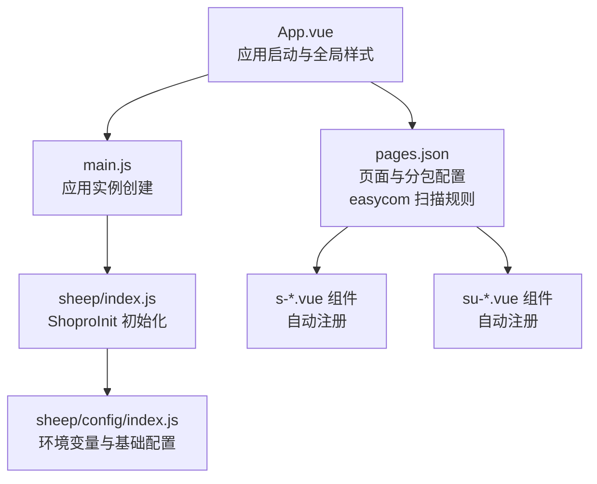
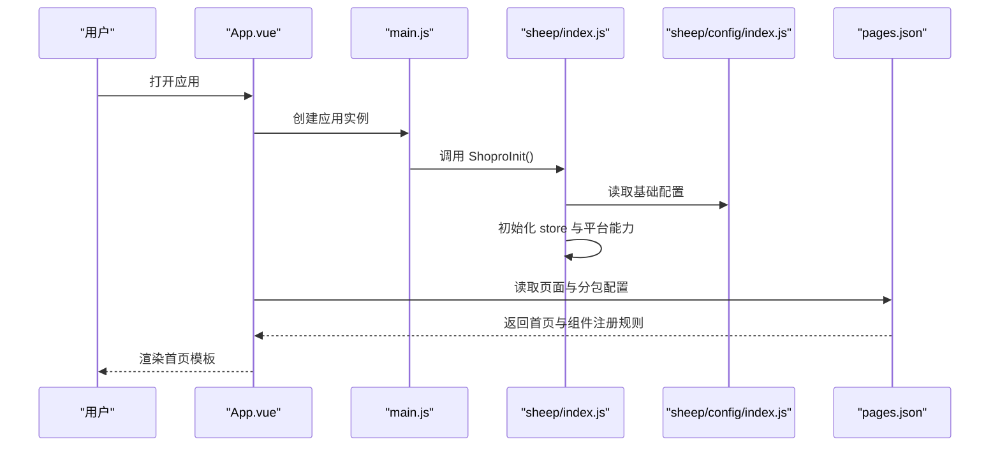
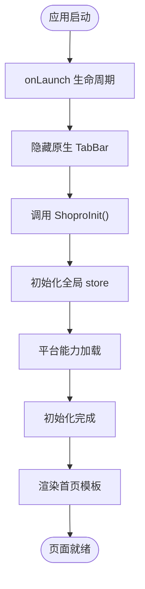
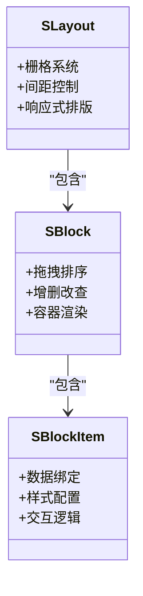
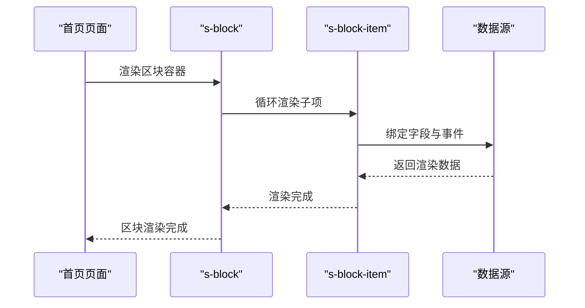
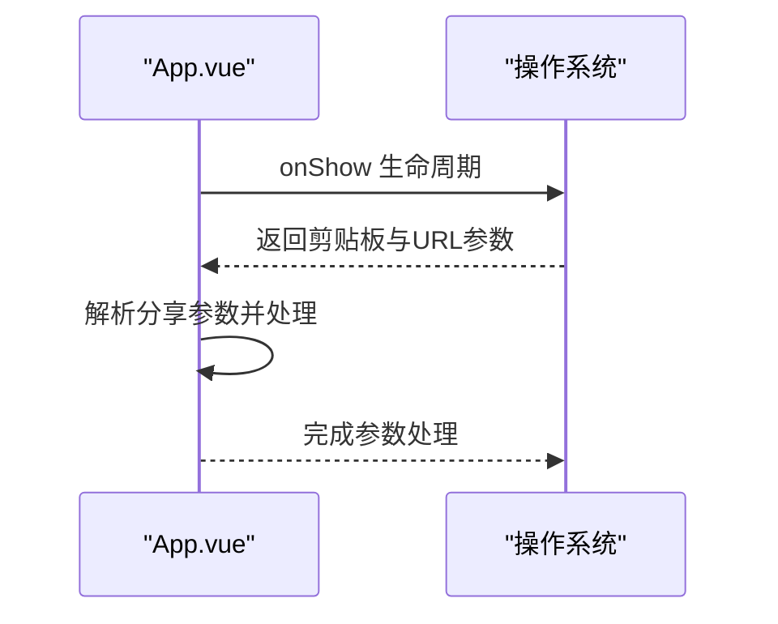
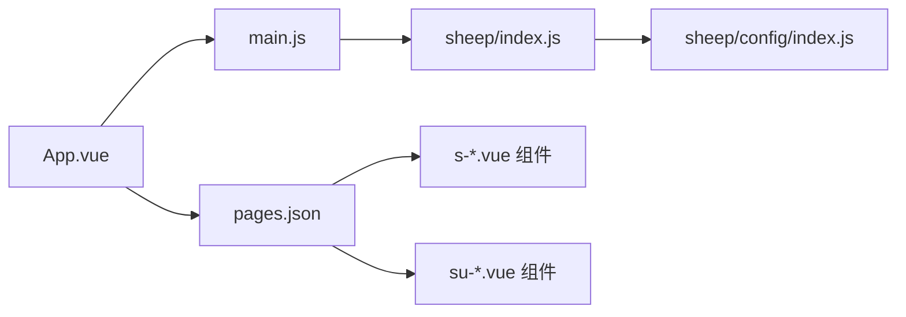

# 首页设计与模板系统

<cite>
**本文引用的文件**
- [App.vue](file://frontend/mall-uniapp/App.vue)
- [main.js](file://frontend/mall-uniapp/main.js)
- [pages.json](file://frontend/mall-uniapp/pages.json)
- [index.js](file://frontend/mall-uniapp/sheep/index.js)
- [index.js](file://frontend/mall-uniapp/sheep/config/index.js)
</cite>

## 目录
1. [简介](#简介)
2. [项目结构](#项目结构)
3. [核心组件](#核心组件)
4. [架构总览](#架构总览)
5. [详细组件分析](#详细组件分析)
6. [依赖关系分析](#依赖关系分析)
7. [性能考虑](#性能考虑)
8. [故障排查指南](#故障排查指南)
9. [结论](#结论)
10. [附录](#附录)

## 简介
本技术文档围绕 AgenticCPS 商城首页的设计与模板系统展开，重点覆盖基于 s-layout、s-block、s-block-item 组件的可拖拽页面搭建体系；解释模板数据结构、组件渲染机制、页面配置管理；详述首页轮播图、商品推荐、分类导航等区块组件的实现原理（数据绑定、样式配置、交互逻辑）；阐述模板系统的动态加载机制（模板 ID 解析、页面初始化流程、分享参数处理）；并提供页面组件的自定义开发指南（新增组件类型、样式定制、事件处理），最后给出性能优化策略与用户体验设计最佳实践。

## 项目结构
本项目采用 uni-app 多端统一开发框架，前端入口位于 mall-uniapp 目录。首页通过 pages.json 的页面配置与 easycom 自动扫描机制，结合 sheep 底层能力完成初始化与路由管理。

图表来源
- [App.vue:1-33](file://frontend/mall-uniapp/App.vue#L1-L33)
- [main.js:1-16](file://frontend/mall-uniapp/main.js#L1-L16)
- [index.js:1-53](file://frontend/mall-uniapp/sheep/index.js#L1-L53)
- [index.js:1-32](file://frontend/mall-uniapp/sheep/config/index.js#L1-L32)
- [pages.json:1-704](file://frontend/mall-uniapp/pages.json#L1-L704)

章节来源
- [App.vue:1-33](file://frontend/mall-uniapp/App.vue#L1-L33)
- [main.js:1-16](file://frontend/mall-uniapp/main.js#L1-L16)
- [pages.json:1-704](file://frontend/mall-uniapp/pages.json#L1-L704)
- [index.js:1-53](file://frontend/mall-uniapp/sheep/index.js#L1-L53)
- [index.js:1-32](file://frontend/mall-uniapp/sheep/config/index.js#L1-L32)

## 核心组件
- s-layout：页面布局容器，负责整体栅格、间距与响应式排版。
- s-block：区块容器，支持拖拽、排序、删除等操作，承载具体业务模块。
- s-block-item：区块内的最小可渲染单元，负责数据绑定、样式与交互。

这些组件通过 pages.json 的 easycom 规则自动扫描并注册，路径映射规则如下：
- s- 开头的组件映射至 @/sheep/components/s-$1/s-$1.vue
- su- 开头的组件映射至 @/sheep/ui/su-$1/su-$1.vue

章节来源
- [pages.json:2-8](file://frontend/mall-uniapp/pages.json#L2-L8)

## 架构总览
首页模板系统由“页面配置 + 组件渲染 + 动态加载”三层构成：

图表来源
- [App.vue:1-33](file://frontend/mall-uniapp/App.vue#L1-L33)
- [main.js:1-16](file://frontend/mall-uniapp/main.js#L1-L16)
- [index.js:1-53](file://frontend/mall-uniapp/sheep/index.js#L1-L53)
- [index.js:1-32](file://frontend/mall-uniapp/sheep/config/index.js#L1-L32)
- [pages.json:1-704](file://frontend/mall-uniapp/pages.json#L1-L704)

## 详细组件分析

### 页面配置与初始化流程
- 页面入口与别名：首页路径为 pages/index/index，别名为 “/”，便于直接访问。
- 分包策略：首页相关页面按功能拆分为多个子包，提升首屏加载效率。
- easycom 自动注册：通过正则映射，s- 与 su- 前缀组件自动注册，简化使用。
- 初始化流程：App.vue 在 onLaunch 中调用 ShoproInit，完成全局依赖加载与平台初始化。

图表来源
- [App.vue:5-27](file://frontend/mall-uniapp/App.vue#L5-L27)
- [index.js:28-38](file://frontend/mall-uniapp/sheep/index.js#L28-L38)

章节来源
- [App.vue:1-33](file://frontend/mall-uniapp/App.vue#L1-L33)
- [pages.json:9-22](file://frontend/mall-uniapp/pages.json#L9-L22)
- [pages.json:2-8](file://frontend/mall-uniapp/pages.json#L2-L8)
- [index.js:28-38](file://frontend/mall-uniapp/sheep/index.js#L28-L38)

### 模板数据结构与渲染机制
- 模板 ID 解析：页面 meta 字段包含 sync、title、group 等元信息，用于标识与同步模板配置。
- 区块与项：s-block 作为容器承载 s-block-item，每个 item 对应一个可渲染的数据单元。
- 渲染链路：pages.json 决定页面与组件注册；App.vue 与 main.js 负责初始化；sheep 提供 API、路由、平台能力等支撑。

图表来源
- [pages.json:2-8](file://frontend/mall-uniapp/pages.json#L2-L8)

章节来源
- [pages.json:16-22](file://frontend/mall-uniapp/pages.json#L16-L22)
- [pages.json:2-8](file://frontend/mall-uniapp/pages.json#L2-L8)

### 首页轮播图、商品推荐、分类导航实现原理
- 轮播图：建议使用 s-block 容纳图片轮播组件，s-block-item 绑定图片资源与跳转链接，支持懒加载与自动播放配置。
- 商品推荐：以网格或流式布局展示商品卡片，s-block-item 绑定商品字段（标题、价格、图片、标签），支持点击跳转与埋点。
- 分类导航：采用宫格或横向滚动布局，s-block-item 绑定分类图标与名称，支持多级跳转与缓存。

图表来源
- [pages.json:2-8](file://frontend/mall-uniapp/pages.json#L2-L8)

章节来源
- [pages.json:9-22](file://frontend/mall-uniapp/pages.json#L9-L22)

### 页面配置管理
- 页面元信息：title、group、sync 等字段用于标识页面属性与同步策略。
- 分包管理：首页相关页面分布在 pages/index、pages/goods、pages/order 等子包中，减少主包体积。
- 导航与标题：首页启用下拉刷新，其他页面根据业务需要设置导航栏标题与样式。

章节来源
- [pages.json:16-22](file://frontend/mall-uniapp/pages.json#L16-L22)
- [pages.json:87-671](file://frontend/mall-uniapp/pages.json#L87-L671)

### 动态加载机制与分享参数处理
- 动态加载：通过 ShoproInit 完成全局 store 初始化与平台能力加载，确保页面渲染前依赖可用。
- 分享参数：在 onShow 生命周期中获取剪贴板与 URL Scheme 参数，用于分享落地页与活动入口识别。

图表来源
- [App.vue:15-27](file://frontend/mall-uniapp/App.vue#L15-L27)

章节来源
- [App.vue:15-27](file://frontend/mall-uniapp/App.vue#L15-L27)
- [index.js:28-38](file://frontend/mall-uniapp/sheep/index.js#L28-L38)

### 自定义开发指南
- 新增组件类型：在 @/sheep/components 或 @/sheep/ui 下创建新组件，并遵循 s- 或 su- 前缀命名，即可通过 easycom 自动注册。
- 样式定制：通过全局 SCSS 变量与主题配置进行统一样式管理；组件内部使用 scoped 样式避免冲突。
- 事件处理：在 s-block-item 中绑定点击、长按等事件，结合路由跳转与埋点上报，确保交互一致性。

章节来源
- [pages.json:2-8](file://frontend/mall-uniapp/pages.json#L2-L8)
- [App.vue:30-32](file://frontend/mall-uniapp/App.vue#L30-L32)

## 依赖关系分析
- 应用启动依赖：App.vue 依赖 sheep 初始化能力；main.js 负责创建应用实例；sheep/index.js 提供 ShoproInit；sheep/config/index.js 提供环境配置。
- 页面与组件依赖：pages.json 决定页面与组件注册；s- 与 su- 组件通过 easycom 自动注册，降低手动导入成本。

图表来源
- [App.vue:1-33](file://frontend/mall-uniapp/App.vue#L1-L33)
- [main.js:1-16](file://frontend/mall-uniapp/main.js#L1-L16)
- [index.js:1-53](file://frontend/mall-uniapp/sheep/index.js#L1-L53)
- [index.js:1-32](file://frontend/mall-uniapp/sheep/config/index.js#L1-L32)
- [pages.json:1-704](file://frontend/mall-uniapp/pages.json#L1-L704)

章节来源
- [App.vue:1-33](file://frontend/mall-uniapp/App.vue#L1-L33)
- [main.js:1-16](file://frontend/mall-uniapp/main.js#L1-L16)
- [index.js:1-53](file://frontend/mall-uniapp/sheep/index.js#L1-L53)
- [index.js:1-32](file://frontend/mall-uniapp/sheep/config/index.js#L1-L32)
- [pages.json:1-704](file://frontend/mall-uniapp/pages.json#L1-L704)

## 性能考虑
- 分包加载：将首页相关页面拆分为子包，减少主包体积，提升首屏加载速度。
- 组件懒加载：对非首屏组件采用动态导入，按需加载。
- 图片优化：轮播图与商品图采用懒加载与尺寸裁剪，避免阻塞主线程。
- 缓存策略：利用本地缓存与服务端缓存，减少重复请求。
- 渲染优化：合理使用虚拟列表与节流防抖，避免频繁重绘。

## 故障排查指南
- 页面无法渲染：检查 pages.json 中页面路径与 alias 是否正确，确认 easycom 映射是否生效。
- 组件未注册：确认组件命名是否符合 s- 或 su- 前缀规范，路径是否正确。
- 初始化失败：检查 ShoproInit 是否在 onLaunch 中调用，全局 store 与平台能力是否加载成功。
- 分享参数无效：确认 onShow 生命周期中是否正确获取剪贴板与 URL Scheme 参数。

章节来源
- [pages.json:1-704](file://frontend/mall-uniapp/pages.json#L1-L704)
- [App.vue:5-27](file://frontend/mall-uniapp/App.vue#L5-L27)
- [index.js:28-38](file://frontend/mall-uniapp/sheep/index.js#L28-L38)

## 结论
AgenticCPS 商城首页模板系统通过 s-layout、s-block、s-block-item 组件实现了高内聚、低耦合的可拖拽搭建体系；配合 pages.json 的 easycom 自动注册与 ShoproInit 初始化流程，形成从页面配置到组件渲染的完整闭环。通过对分包、懒加载、缓存与渲染优化的综合运用，可在保证开发效率的同时，显著提升用户体验与性能表现。

## 附录
- 环境变量与基础配置：通过 sheep/config/index.js 统一管理开发与生产环境的基础 URL、静态资源路径、租户 ID、WebSocket 地址与 H5 地址等。
- 页面元信息：首页 meta 字段包含 sync、title、group 等关键信息，用于模板同步与页面标识。

章节来源
- [index.js:1-32](file://frontend/mall-uniapp/sheep/config/index.js#L1-L32)
- [pages.json:16-22](file://frontend/mall-uniapp/pages.json#L16-L22)