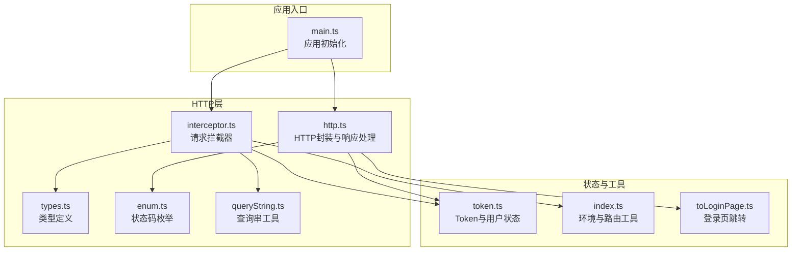
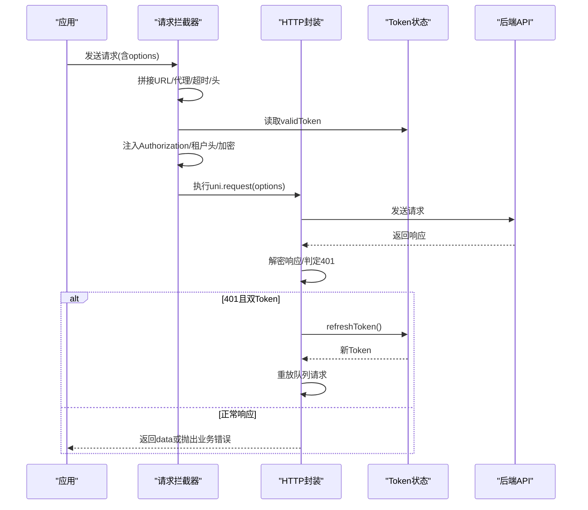
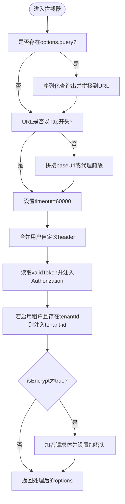
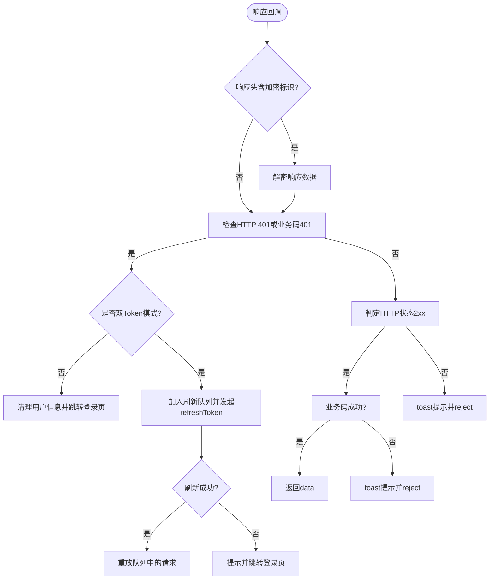
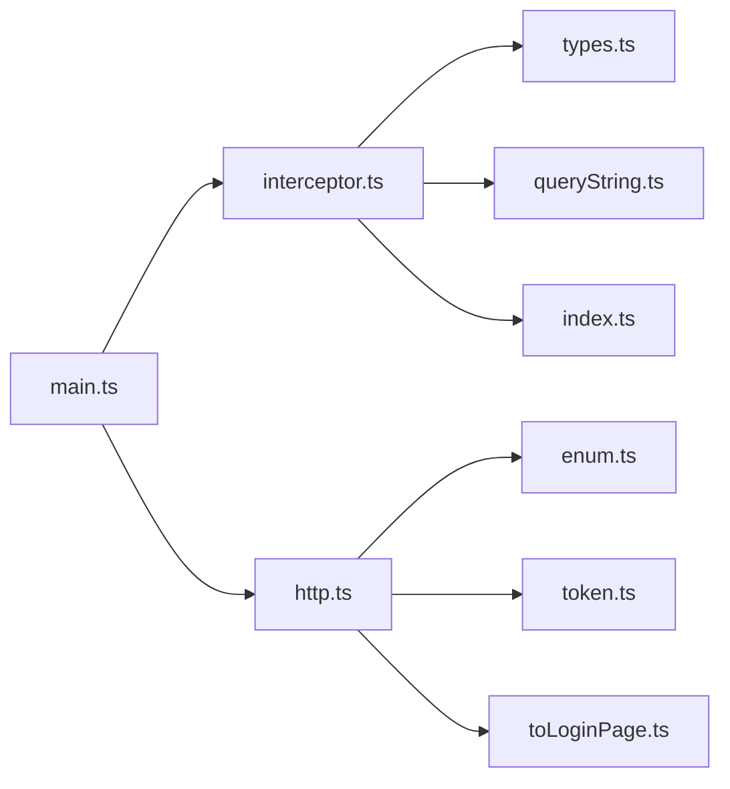

# HTTP请求拦截器

<cite>
**本文档引用的文件**
- [interceptor.ts](file://frontend/admin-uniapp/src/http/interceptor.ts)
- [http.ts](file://frontend/admin-uniapp/src/http/http.ts)
- [types.ts](file://frontend/admin-uniapp/src/http/types.ts)
- [queryString.ts](file://frontend/admin-uniapp/src/http/tools/queryString.ts)
- [token.ts](file://frontend/admin-uniapp/src/store/token.ts)
- [index.ts](file://frontend/admin-uniapp/src/utils/index.ts)
- [toLoginPage.ts](file://frontend/admin-uniapp/src/utils/toLoginPage.ts)
- [enum.ts](file://frontend/admin-uniapp/src/http/tools/enum.ts)
- [main.ts](file://frontend/admin-uniapp/src/main.ts)
</cite>

## 目录
1. [简介](#简介)
2. [项目结构](#项目结构)
3. [核心组件](#核心组件)
4. [架构总览](#架构总览)
5. [详细组件分析](#详细组件分析)
6. [依赖关系分析](#依赖关系分析)
7. [性能考量](#性能考量)
8. [故障排查指南](#故障排查指南)
9. [结论](#结论)
10. [附录](#附录)

## 简介
本文件面向AgenticCPS管理后台的UniApp前端，系统性梳理HTTP请求拦截器的设计与实现，涵盖请求拦截器、响应拦截器、请求头管理策略、API封装、错误处理与重试策略、Token自动注入、请求超时、网络状态监听、请求队列与并发控制、缓存策略以及HTTP通信优化与安全防护等主题。目标是帮助开发者快速理解并高效扩展HTTP通信层。

## 项目结构
与HTTP请求拦截器相关的核心文件组织如下：
- 请求拦截器与安装入口：src/http/interceptor.ts
- HTTP封装与响应处理：src/http/http.ts
- 类型定义：src/http/types.ts、src/http/tools/enum.ts
- 查询串工具：src/http/tools/queryString.ts
- Token与用户状态：src/store/token.ts
- 工具函数（环境、登录页跳转等）：src/utils/index.ts、src/utils/toLoginPage.ts
- 应用初始化：src/main.ts

**图表来源**
- [interceptor.ts:1-105](file://frontend/admin-uniapp/src/http/interceptor.ts#L1-L105)
- [http.ts:1-224](file://frontend/admin-uniapp/src/http/http.ts#L1-L224)
- [types.ts:1-42](file://frontend/admin-uniapp/src/http/types.ts#L1-L42)
- [enum.ts:1-69](file://frontend/admin-uniapp/src/http/tools/enum.ts#L1-L69)
- [queryString.ts:1-30](file://frontend/admin-uniapp/src/http/tools/queryString.ts#L1-L30)
- [token.ts:1-342](file://frontend/admin-uniapp/src/store/token.ts#L1-L342)
- [index.ts:1-244](file://frontend/admin-uniapp/src/utils/index.ts#L1-L244)
- [toLoginPage.ts:1-49](file://frontend/admin-uniapp/src/utils/toLoginPage.ts#L1-L49)
- [main.ts:1-20](file://frontend/admin-uniapp/src/main.ts#L1-L20)

**章节来源**
- [interceptor.ts:1-105](file://frontend/admin-uniapp/src/http/interceptor.ts#L1-L105)
- [http.ts:1-224](file://frontend/admin-uniapp/src/http/http.ts#L1-L224)
- [types.ts:1-42](file://frontend/admin-uniapp/src/http/types.ts#L1-L42)
- [enum.ts:1-69](file://frontend/admin-uniapp/src/http/tools/enum.ts#L1-L69)
- [queryString.ts:1-30](file://frontend/admin-uniapp/src/http/tools/queryString.ts#L1-L30)
- [token.ts:1-342](file://frontend/admin-uniapp/src/store/token.ts#L1-L342)
- [index.ts:1-244](file://frontend/admin-uniapp/src/utils/index.ts#L1-L244)
- [toLoginPage.ts:1-49](file://frontend/admin-uniapp/src/utils/toLoginPage.ts#L1-L49)
- [main.ts:1-20](file://frontend/admin-uniapp/src/main.ts#L1-L20)

## 核心组件
- 请求拦截器：负责在请求发送前拼接URL、注入超时、添加Authorization头、处理租户标识、可选API加密、拼接查询参数等。
- HTTP封装：统一封装uni.request，处理响应解密、401无感刷新、业务码判定、错误提示、失败回调等。
- 类型系统：统一请求与响应类型，支持query、hideErrorToast、original、isEncrypt等扩展字段。
- Token状态：提供validToken、hasValidLogin、tryGetValidToken、refreshToken等能力，支撑自动注入与刷新。
- 工具函数：环境基地址获取、登录页跳转、URL解析与重定向等。

**章节来源**
- [interceptor.ts:19-95](file://frontend/admin-uniapp/src/http/interceptor.ts#L19-L95)
- [http.ts:14-152](file://frontend/admin-uniapp/src/http/http.ts#L14-L152)
- [types.ts:4-25](file://frontend/admin-uniapp/src/http/types.ts#L4-L25)
- [token.ts:257-316](file://frontend/admin-uniapp/src/store/token.ts#L257-L316)

## 架构总览
请求从应用入口安装拦截器开始，随后所有HTTP请求都会经过拦截器预处理，再由HTTP封装统一处理响应与错误，必要时触发Token刷新与登录页跳转。

**图表来源**
- [main.ts:3-14](file://frontend/admin-uniapp/src/main.ts#L3-L14)
- [interceptor.ts:19-95](file://frontend/admin-uniapp/src/http/interceptor.ts#L19-L95)
- [http.ts:14-152](file://frontend/admin-uniapp/src/http/http.ts#L14-L152)
- [token.ts:228-250](file://frontend/admin-uniapp/src/store/token.ts#L228-L250)

## 详细组件分析

### 请求拦截器实现
- URL拼接与代理
  - 非http开头时自动拼接baseUrl；H5端支持通过VITE_APP_PROXY_ENABLE与VITE_APP_PROXY_PREFIX进行代理拼接；非H5端直接拼接。
  - 支持通过options.query将对象序列化为查询串并拼接到URL。
- 请求超时
  - 默认timeout=60000ms，确保长任务稳定执行。
- 请求头策略
  - 自动注入Authorization头（Bearer token），白名单接口可禁用。
  - 支持tenant-id头（当VITE_APP_TENANT_ENABLE为true时）。
  - 支持API加密开关，开启时对请求体加密并在头中打标。
- 平台差异
  - H5与非H5分别处理代理与基础地址拼接，保证多端一致性。

**图表来源**
- [interceptor.ts:21-94](file://frontend/admin-uniapp/src/http/interceptor.ts#L21-L94)
- [queryString.ts:7-29](file://frontend/admin-uniapp/src/http/tools/queryString.ts#L7-L29)
- [index.ts:120-149](file://frontend/admin-uniapp/src/utils/index.ts#L120-L149)

**章节来源**
- [interceptor.ts:19-95](file://frontend/admin-uniapp/src/http/interceptor.ts#L19-L95)
- [queryString.ts:1-30](file://frontend/admin-uniapp/src/http/tools/queryString.ts#L1-L30)
- [index.ts:120-149](file://frontend/admin-uniapp/src/utils/index.ts#L120-L149)

### 响应拦截器与错误处理
- 响应解密
  - 若响应头包含加密标识，则对字符串响应进行解密。
- 401处理
  - HTTP 401或业务码401视为Token失效；单Token模式直接登出并跳转登录页；双Token模式走无感刷新流程。
- 业务码判定
  - 使用ResultEnum兼容0与200作为成功码；非成功码统一toast提示并reject。
- 失败回调
  - 网络错误统一提示“网络错误，换个网络试试”。

**图表来源**
- [http.ts:24-151](file://frontend/admin-uniapp/src/http/http.ts#L24-L151)
- [enum.ts:1-17](file://frontend/admin-uniapp/src/http/tools/enum.ts#L1-L17)
- [toLoginPage.ts:24-48](file://frontend/admin-uniapp/src/utils/toLoginPage.ts#L24-L48)

**章节来源**
- [http.ts:14-152](file://frontend/admin-uniapp/src/http/http.ts#L14-L152)
- [enum.ts:1-69](file://frontend/admin-uniapp/src/http/tools/enum.ts#L1-L69)
- [toLoginPage.ts:1-49](file://frontend/admin-uniapp/src/utils/toLoginPage.ts#L1-L49)

### 请求头管理策略
- Authorization头
  - 通过useTokenStore.validToken自动注入Bearer token；白名单接口可通过header.isToken=false禁用。
- 租户头
  - 当VITE_APP_TENANT_ENABLE为true且存在tenantId时，注入tenant-id头。
- 加密头
  - 开启isEncrypt时，对请求体加密并在头中设置加密标识。

**章节来源**
- [interceptor.ts:56-91](file://frontend/admin-uniapp/src/http/interceptor.ts#L56-L91)
- [token.ts:257-269](file://frontend/admin-uniapp/src/store/token.ts#L257-L269)

### API请求封装
- 统一Promise封装
  - 返回Promise，内部调用uni.request并按约定处理success/fail。
- 方法别名
  - 提供http.get/post/put/delete别名，与axios风格一致。
- 原始数据返回
  - 支持original=true返回原始响应，适用于特殊接口（如验证码）。

**章节来源**
- [http.ts:14-224](file://frontend/admin-uniapp/src/http/http.ts#L14-L224)
- [types.ts:104-151](file://frontend/admin-uniapp/src/http/types.ts#L104-L151)

### 错误处理机制
- 业务错误
  - 非成功码统一toast提示，reject响应对象。
- 网络错误
  - fail回调统一提示网络错误。
- 登录态异常
  - 401时根据模式选择登出或无感刷新，并在刷新成功后重放队列请求。

**章节来源**
- [http.ts:121-149](file://frontend/admin-uniapp/src/http/http.ts#L121-L149)
- [toLoginPage.ts:24-48](file://frontend/admin-uniapp/src/utils/toLoginPage.ts#L24-L48)

### 重试策略配置
- 无感重试
  - 401且双Token时，将原请求加入taskQueue，刷新成功后逐一重放。
- 队列与并发
  - 使用全局变量refreshing与taskQueue控制并发与顺序，避免重复刷新与请求丢失。

**章节来源**
- [http.ts:11-12](file://frontend/admin-uniapp/src/http/http.ts#L11-L12)
- [http.ts:43-112](file://frontend/admin-uniapp/src/http/http.ts#L43-L112)

### Token自动注入
- 读取与判断
  - 通过computed判断token有效性；双Token模式以刷新token过期为准。
- 注入与刷新
  - 拦截器自动注入Authorization；401时触发refreshToken并重放队列。

**章节来源**
- [token.ts:70-98](file://frontend/admin-uniapp/src/store/token.ts#L70-L98)
- [token.ts:257-316](file://frontend/admin-uniapp/src/store/token.ts#L257-L316)
- [interceptor.ts:56-68](file://frontend/admin-uniapp/src/http/interceptor.ts#L56-L68)

### 请求超时处理
- 默认超时
  - 拦截器内设置options.timeout=60000ms，确保长时间任务稳定执行。
- 平台差异
  - 非微信小程序设置responseType=json，避免平台差异导致的解析问题。

**章节来源**
- [interceptor.ts:49-54](file://frontend/admin-uniapp/src/http/interceptor.ts#L49-L54)
- [http.ts:20-22](file://frontend/admin-uniapp/src/http/http.ts#L20-L22)

### 网络状态监听
- 现状
  - 代码中未发现显式的网络状态监听逻辑。
- 建议
  - 可结合uni.onNetworkStatusChange进行监听，结合业务策略（如离线缓存、重试退避）提升体验。

[本节为概念性建议，不直接分析具体文件]

### 请求队列管理与并发控制
- 队列
  - taskQueue保存401时待重放的请求。
- 并发
  - 使用refreshing布尔值防止重复刷新；刷新成功后批量重放。

**章节来源**
- [http.ts:11-12](file://frontend/admin-uniapp/src/http/http.ts#L11-L12)
- [http.ts:62-79](file://frontend/admin-uniapp/src/http/http.ts#L62-L79)

### 缓存策略
- 现状
  - 未发现针对HTTP响应的显式缓存实现。
- 建议
  - 可基于URL+query构建缓存键，结合TTL与LRU策略缓存静态/弱更新数据，减少重复请求。

[本节为概念性建议，不直接分析具体文件]

### HTTP通信优化与安全防护
- 优化
  - 统一超时、合并请求头、避免重复刷新、解密仅在必要时进行。
- 安全
  - 支持API加密开关与响应解密；Authorization头自动注入；白名单机制避免敏感接口被注入token。

**章节来源**
- [interceptor.ts:78-91](file://frontend/admin-uniapp/src/http/interceptor.ts#L78-L91)
- [http.ts:26-37](file://frontend/admin-uniapp/src/http/http.ts#L26-L37)
- [interceptor.ts:56-68](file://frontend/admin-uniapp/src/http/interceptor.ts#L56-L68)

## 依赖关系分析
- 应用初始化依赖拦截器与HTTP封装，二者均依赖Token状态与工具函数。
- 拦截器依赖查询串工具与环境基地址工具。
- HTTP封装依赖状态与工具，同时向应用返回Promise结果。

**图表来源**
- [main.ts:3-14](file://frontend/admin-uniapp/src/main.ts#L3-L14)
- [interceptor.ts:1-10](file://frontend/admin-uniapp/src/http/interceptor.ts#L1-L10)
- [http.ts:1-8](file://frontend/admin-uniapp/src/http/http.ts#L1-L8)
- [types.ts:1-4](file://frontend/admin-uniapp/src/http/types.ts#L1-L4)
- [queryString.ts:1-6](file://frontend/admin-uniapp/src/http/tools/queryString.ts#L1-L6)
- [index.ts:120-149](file://frontend/admin-uniapp/src/utils/index.ts#L120-L149)
- [enum.ts:1-6](file://frontend/admin-uniapp/src/http/tools/enum.ts#L1-L6)
- [token.ts:1-24](file://frontend/admin-uniapp/src/store/token.ts#L1-L24)
- [toLoginPage.ts:1-6](file://frontend/admin-uniapp/src/utils/toLoginPage.ts#L1-L6)

**章节来源**
- [main.ts:1-20](file://frontend/admin-uniapp/src/main.ts#L1-L20)
- [interceptor.ts:1-10](file://frontend/admin-uniapp/src/http/interceptor.ts#L1-L10)
- [http.ts:1-8](file://frontend/admin-uniapp/src/http/http.ts#L1-L8)

## 性能考量
- 请求头合并与序列化
  - 使用简单对象序列化避免引入第三方库，降低包体体积。
- 解密与加密
  - 仅在isEncrypt开启时进行，避免不必要的CPU开销。
- 刷新队列
  - 通过队列与并发控制避免重复刷新与请求丢失，提升稳定性。

[本节提供一般性指导，不直接分析具体文件]

## 故障排查指南
- 401频繁出现
  - 检查是否双Token模式且refreshToken有效；确认刷新流程是否成功；观察taskQueue是否正确重放。
- 登录页循环跳转
  - 检查toLoginPage的防抖与重定向参数；确认redirect参数是否正确传递。
- 响应解密失败
  - 确认后端是否正确设置加密头；检查加密算法与密钥配置。
- H5代理无效
  - 检查VITE_APP_PROXY_ENABLE与VITE_APP_PROXY_PREFIX配置；确认代理前缀与后端地址匹配。

**章节来源**
- [http.ts:43-112](file://frontend/admin-uniapp/src/http/http.ts#L43-L112)
- [toLoginPage.ts:24-48](file://frontend/admin-uniapp/src/utils/toLoginPage.ts#L24-L48)
- [interceptor.ts:78-91](file://frontend/admin-uniapp/src/http/interceptor.ts#L78-L91)
- [index.ts:120-149](file://frontend/admin-uniapp/src/utils/index.ts#L120-L149)

## 结论
该HTTP请求拦截器体系通过拦截器预处理与HTTP封装统一处理响应，实现了Token自动注入、租户头管理、API加密、401无感刷新、错误提示与失败回退等关键能力。配合查询串工具与环境工具，满足多端部署需求。建议后续补充网络状态监听、响应缓存与更细粒度的重试策略，以进一步提升稳定性与用户体验。

## 附录
- 关键流程图与类图已在相应章节中给出，便于快速定位实现细节与依赖关系。
- 使用建议
  - 在新增接口时遵循types.ts中的扩展字段规范（如hideErrorToast、original、isEncrypt）。
  - 对于需要绕过Token的接口，使用白名单或header.isToken=false策略。