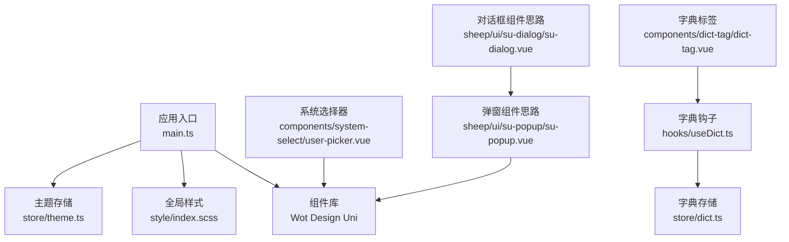
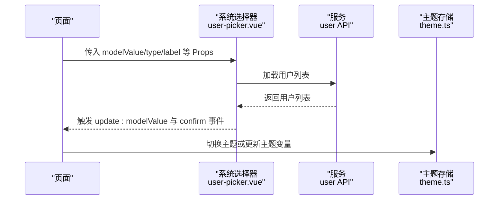
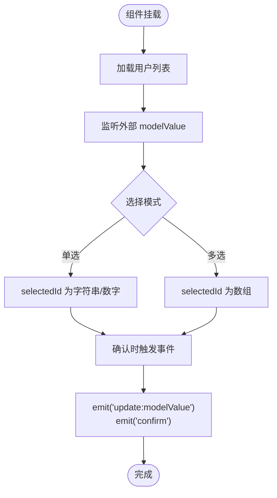
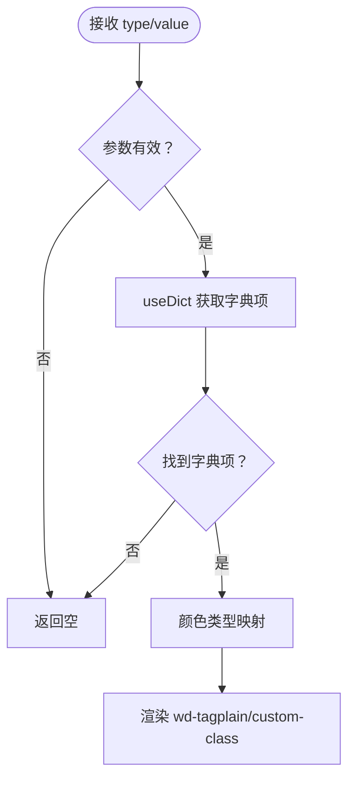
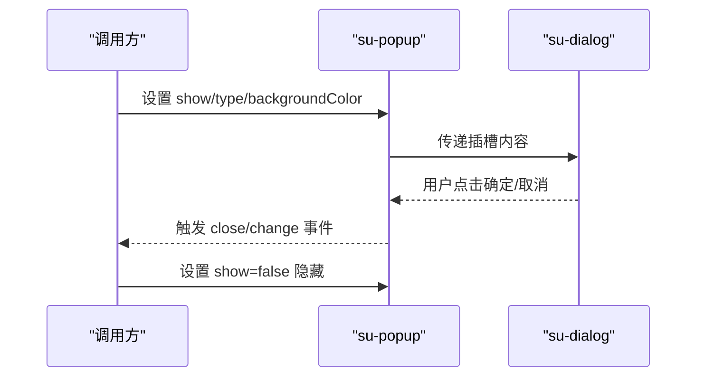
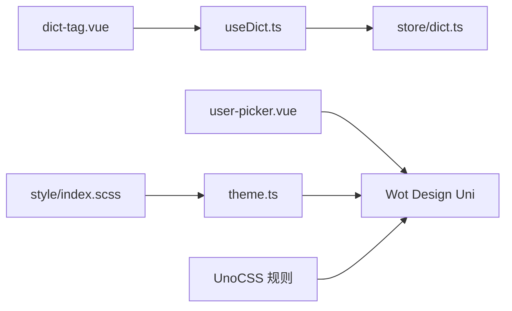

# UI组件系统

<cite>
**本文引用的文件**
- [main.ts](file://frontend/admin-uniapp/src/main.ts)
- [package.json](file://frontend/admin-uniapp/package.json)
- [user-picker.vue](file://frontend/admin-uniapp/src/components/system-select/user-picker.vue)
- [dict-tag.vue](file://frontend/admin-uniapp/src/components/dict-tag/dict-tag.vue)
- [index.scss](file://frontend/admin-uniapp/src/style/index.scss)
- [theme.ts](file://frontend/admin-uniapp/src/store/theme.ts)
- [useDict.ts](file://frontend/admin-uniapp/src/hooks/useDict.ts)
- [4-style.md](file://frontend/admin-uniapp/docs/base/4-style.md)
- [20-best.md](file://frontend/admin-uniapp/docs/base/20-best.md)
- [uni.scss](file://frontend/admin-uniapp/src/uni.scss)
- [su-popup.vue](file://frontend/mall-uniapp/sheep/ui/su-popup/su-popup.vue)
- [su-dialog.vue](file://frontend/mall-uniapp/sheep/ui/su-dialog/su-dialog.vue)
- [modal.js](file://frontend/mall-uniapp/sheep/store/modal.js)
</cite>

## 目录
1. [简介](#简介)
2. [项目结构](#项目结构)
3. [核心组件](#核心组件)
4. [架构总览](#架构总览)
5. [组件详解](#组件详解)
6. [依赖关系分析](#依赖关系分析)
7. [性能考量](#性能考量)
8. [故障排查指南](#故障排查指南)
9. [结论](#结论)
10. [附录](#附录)

## 简介
本文件面向 AgenticCPS 管理后台的 UniApp UI 组件系统，聚焦于自定义组件开发、组件库集成与复用策略，系统性梳理以下能力：
- 系统选择器组件：支持单选/多选、远程加载用户列表、默认插槽与事件透传
- 字典标签组件：基于字典类型与值渲染带颜色/样式的标签
- 弹窗组件：基于现有 Popup/Dialog 组件的二次封装思路与最佳实践
- Props 设计、事件处理、插槽使用
- 样式封装、主题适配、响应式设计
- 组件开发规范与性能优化建议

## 项目结构
前端采用 UniApp 生态，核心入口与依赖如下：
- 应用入口与全局注册：应用在入口处挂载 Store、路由拦截器与请求拦截器
- 组件库：使用 Wot Design Uni 作为基础 UI 组件库
- 样式体系：UnoCSS + 自定义 SCSS，统一主题变量与安全区适配
- 字典系统：通过 Pinia Store 管理字典数据，提供标签渲染与选项生成

**图表来源**
- [main.ts:1-20](file://frontend/admin-uniapp/src/main.ts#L1-L20)
- [index.scss:1-113](file://frontend/admin-uniapp/src/style/index.scss#L1-L113)
- [theme.ts:1-43](file://frontend/admin-uniapp/src/store/theme.ts#L1-L43)
- [user-picker.vue:1-117](file://frontend/admin-uniapp/src/components/system-select/user-picker.vue#L1-L117)
- [dict-tag.vue:1-63](file://frontend/admin-uniapp/src/components/dict-tag/dict-tag.vue#L1-L63)
- [useDict.ts:1-133](file://frontend/admin-uniapp/src/hooks/useDict.ts#L1-L133)
- [su-popup.vue:84-142](file://frontend/mall-uniapp/sheep/ui/su-popup/su-popup.vue#L84-L142)
- [su-dialog.vue:1-42](file://frontend/mall-uniapp/sheep/ui/su-dialog/su-dialog.vue#L1-L42)

**章节来源**
- [main.ts:1-20](file://frontend/admin-uniapp/src/main.ts#L1-L20)
- [package.json:99-127](file://frontend/admin-uniapp/package.json#L99-L127)

## 核心组件
- 系统选择器组件：提供用户选择面板，支持单选/多选、远程加载、默认插槽、确认事件透传
- 字典标签组件：根据字典类型与值渲染标签，自动映射颜色类型并支持自定义样式类
- 弹窗组件：基于 Popup/Dialog 的二次封装，统一遮罩点击、关闭、动画等行为

**章节来源**
- [user-picker.vue:1-117](file://frontend/admin-uniapp/src/components/system-select/user-picker.vue#L1-L117)
- [dict-tag.vue:1-63](file://frontend/admin-uniapp/src/components/dict-tag/dict-tag.vue#L1-L63)
- [su-popup.vue:84-142](file://frontend/mall-uniapp/sheep/ui/su-popup/su-popup.vue#L84-L142)
- [su-dialog.vue:1-42](file://frontend/mall-uniapp/sheep/ui/su-dialog/su-dialog.vue#L1-L42)

## 架构总览
组件系统围绕“数据驱动 + 事件驱动”的模式组织：
- 数据来源：Pinia Store（主题、字典）
- 视图渲染：Wot Design Uni 组件 + 自定义 SCSS
- 交互流程：组件通过 Props 接收数据，通过事件向上反馈，插槽实现内容扩展

**图表来源**
- [user-picker.vue:36-117](file://frontend/admin-uniapp/src/components/system-select/user-picker.vue#L36-L117)
- [theme.ts:18-37](file://frontend/admin-uniapp/src/store/theme.ts#L18-L37)

## 组件详解

### 系统选择器组件（user-picker）
- 功能要点
  - 支持单选/多选（radio/checkbox），默认多选
  - 远程加载用户列表，过滤输入，支持默认插槽
  - 通过 confirm 事件返回完整用户对象，update:modelValue 返回选中值
  - 提供 getUserNickname 方法用于展示文本
- Props 设计
  - modelValue：双向绑定值（数字或数字数组）
  - type：选择类型 radio/checkbox
  - label/placeholder/prop/useDefaultSlot：控制标签宽度、占位符、字段键、是否启用默认插槽
- 事件与插槽
  - update:modelValue：内部变更时向外同步
  - confirm：确认时返回选中的用户对象集合
  - 默认插槽：允许自定义渲染项
- 性能与健壮性
  - 初始化时加载用户列表，避免空数据
  - watch 同步外部 modelValue，保证受控一致性

**图表来源**
- [user-picker.vue:77-117](file://frontend/admin-uniapp/src/components/system-select/user-picker.vue#L77-L117)

**章节来源**
- [user-picker.vue:1-117](file://frontend/admin-uniapp/src/components/system-select/user-picker.vue#L1-L117)

### 字典标签组件（dict-tag）
- 功能要点
  - 根据字典类型与值获取标签信息（标签名、颜色类型、自定义 CSS 类）
  - 自动将后端颜色类型映射到 Wot Design Uni 的 tag 类型
  - 支持镂空样式（plain）
- Props 设计
  - type：字典类型
  - value：字典值
  - plain：是否镂空
- 依赖与数据流
  - 通过 useDict 钩子访问字典存储，计算出最终标签对象
  - 若参数无效或未找到字典项，返回空

**图表来源**
- [dict-tag.vue:17-50](file://frontend/admin-uniapp/src/components/dict-tag/dict-tag.vue#L17-L50)
- [useDict.ts:42-46](file://frontend/admin-uniapp/src/hooks/useDict.ts#L42-L46)

**章节来源**
- [dict-tag.vue:1-63](file://frontend/admin-uniapp/src/components/dict-tag/dict-tag.vue#L1-L63)
- [useDict.ts:1-133](file://frontend/admin-uniapp/src/hooks/useDict.ts#L1-L133)

### 弹窗组件（基于 su-popup/su-dialog 的二次封装思路）
- 设计目标
  - 统一弹窗类型（顶部、底部、居中）、遮罩点击、关闭动画
  - 对话框模式支持基础内容与输入模式
- 关键 Props（摘取自 su-popup）
  - show：是否显示
  - type：弹出层类型（top/bottom/center/message/dialog）
  - isMaskClick：遮罩点击回调开关
  - backgroundColor：背景色
  - animation/showClose/round/space：动画与外观控制
- 事件
  - change/maskClick/close：状态变化与交互事件
- 与 Pinia 的结合
  - 可通过 Pinia Store 管理弹窗状态（如授权弹窗、分享弹窗等）

**图表来源**
- [su-popup.vue:96-142](file://frontend/mall-uniapp/sheep/ui/su-popup/su-popup.vue#L96-L142)
- [su-dialog.vue:1-42](file://frontend/mall-uniapp/sheep/ui/su-dialog/su-dialog.vue#L1-L42)

**章节来源**
- [su-popup.vue:84-142](file://frontend/mall-uniapp/sheep/ui/su-popup/su-popup.vue#L84-L142)
- [su-dialog.vue:1-42](file://frontend/mall-uniapp/sheep/ui/su-dialog/su-dialog.vue#L1-L42)
- [modal.js:1-29](file://frontend/mall-uniapp/sheep/store/modal.js#L1-L29)

## 依赖关系分析
- 组件与组件库
  - 系统选择器与字典标签均依赖 Wot Design Uni 的组件与类型
- 组件与状态
  - 字典标签依赖 useDict 钩子，useDict 依赖字典 Store
  - 主题切换由主题 Store 管理，影响全局主题变量
- 样式与主题
  - UnoCSS 提供原子化样式与单位适配
  - 自定义 SCSS 提供页面容器、搜索表单弹窗等通用样式
  - 主题 Store 提供主题变量合并与持久化

**图表来源**
- [user-picker.vue:2-33](file://frontend/admin-uniapp/src/components/system-select/user-picker.vue#L2-L33)
- [dict-tag.vue:2-51](file://frontend/admin-uniapp/src/components/dict-tag/dict-tag.vue#L2-L51)
- [useDict.ts:1-46](file://frontend/admin-uniapp/src/hooks/useDict.ts#L1-L46)
- [theme.ts:12-21](file://frontend/admin-uniapp/src/store/theme.ts#L12-L21)
- [index.scss:40-113](file://frontend/admin-uniapp/src/style/index.scss#L40-L113)

**章节来源**
- [package.json:99-127](file://frontend/admin-uniapp/package.json#L99-L127)
- [index.scss:1-113](file://frontend/admin-uniapp/src/style/index.scss#L1-L113)
- [theme.ts:1-43](file://frontend/admin-uniapp/src/store/theme.ts#L1-L43)

## 性能考量
- 组件懒加载与异步导入
  - 通过异步组件声明，减少首屏体积
- 事件与数据流
  - 受控组件（v-model）避免重复渲染，watch 仅在必要时更新
- 样式与主题
  - UnoCSS 原子化类减少重复样式，主题变量集中管理
- 字典与远程数据
  - 字典缓存与本地映射，避免重复请求
  - 选择器组件在挂载时一次性加载用户列表，后续通过本地筛选

**章节来源**
- [20-best.md:1-32](file://frontend/admin-uniapp/docs/base/20-best.md#L1-L32)
- [user-picker.vue:77-117](file://frontend/admin-uniapp/src/components/system-select/user-picker.vue#L77-L117)
- [useDict.ts:97-132](file://frontend/admin-uniapp/src/hooks/useDict.ts#L97-L132)

## 故障排查指南
- 字典标签不显示
  - 检查 type 与 value 是否为空，确认字典存储中是否存在该类型与值
  - 核对颜色类型映射是否正确
- 选择器无数据
  - 确认用户列表加载成功，检查网络请求与权限
  - 校验 modelValue 与类型的一致性（单选/多选）
- 主题不生效
  - 检查主题 Store 的主题变量是否正确合并
  - 确认 UnoCSS 预设与平台适配（小程序/非小程序）
- 弹窗遮罩点击无效
  - 检查 isMaskClick 配置与事件绑定
  - 确认弹窗状态与父级容器层级

**章节来源**
- [dict-tag.vue:34-50](file://frontend/admin-uniapp/src/components/dict-tag/dict-tag.vue#L34-L50)
- [user-picker.vue:92-110](file://frontend/admin-uniapp/src/components/system-select/user-picker.vue#L92-L110)
- [theme.ts:18-37](file://frontend/admin-uniapp/src/store/theme.ts#L18-L37)
- [su-popup.vue:128-137](file://frontend/mall-uniapp/sheep/ui/su-popup/su-popup.vue#L128-L137)

## 结论
本 UI 组件系统以 Wot Design Uni 为基础，结合 UnoCSS 与 Pinia Store，实现了：
- 可复用的选择器与字典标签组件
- 可扩展的弹窗与对话框封装思路
- 主题变量与样式体系的统一管理
建议在后续迭代中持续完善组件文档、测试用例与性能监控，确保跨平台一致性与可维护性。

## 附录
- 样式与主题
  - UnoCSS 预设与平台适配、安全区规则与单位换算
  - 自定义 SCSS 提供页面容器与弹窗样式
- 开发规范
  - 组件 Props 设计、事件命名与插槽命名约定
  - 异步组件与模块懒加载的最佳实践

**章节来源**
- [4-style.md:40-136](file://frontend/admin-uniapp/docs/base/4-style.md#L40-L136)
- [index.scss:12-113](file://frontend/admin-uniapp/src/style/index.scss#L12-L113)
- [uni.scss](file://frontend/admin-uniapp/src/uni.scss)