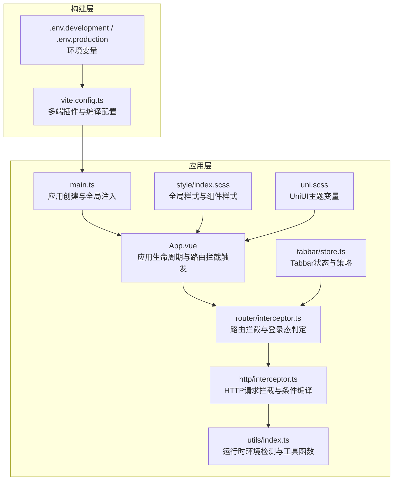
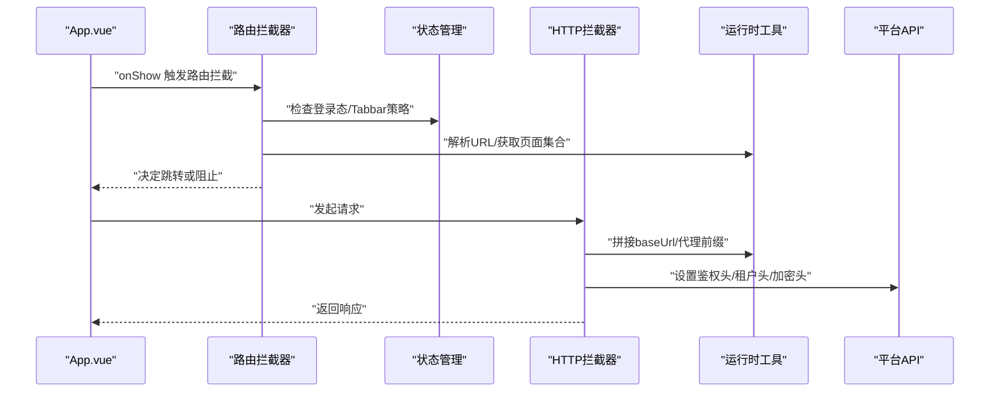
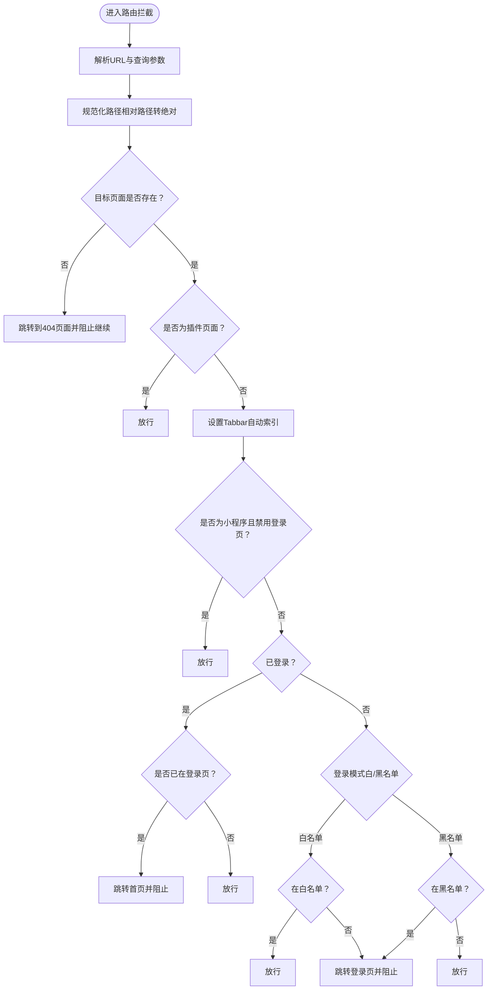
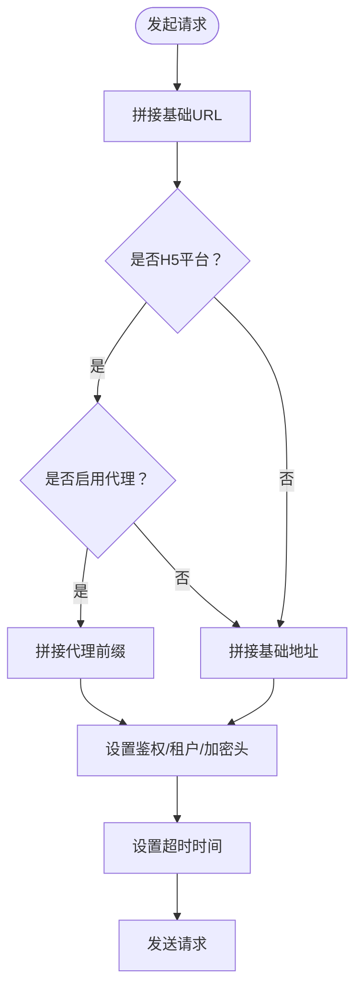
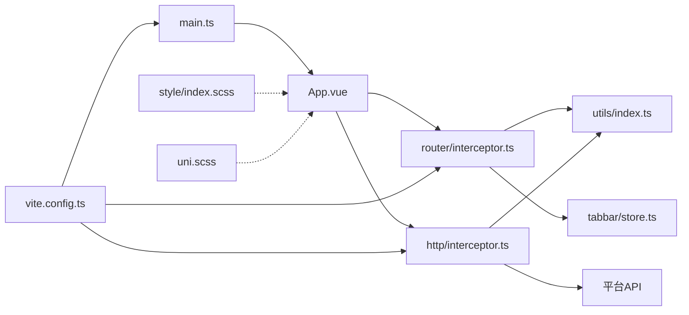

# 多平台适配

<cite>
**本文档引用的文件**
- [frontend/admin-uniapp/src/main.ts](file://frontend/admin-uniapp/src/main.ts)
- [frontend/admin-uniapp/vite.config.ts](file://frontend/admin-uniapp/vite.config.ts)
- [frontend/admin-uniapp/src/App.vue](file://frontend/admin-uniapp/src/App.vue)
- [frontend/admin-uniapp/src/router/interceptor.ts](file://frontend/admin-uniapp/src/router/interceptor.ts)
- [frontend/admin-uniapp/src/http/interceptor.ts](file://frontend/admin-uniapp/src/http/interceptor.ts)
- [frontend/admin-uniapp/src/utils/index.ts](file://frontend/admin-uniapp/src/utils/index.ts)
- [frontend/admin-uniapp/src/style/index.scss](file://frontend/admin-uniapp/src/style/index.scss)
- [frontend/admin-uniapp/src/uni.scss](file://frontend/admin-uniapp/src/uni.scss)
- [frontend/admin-uniapp/src/tabbar/store.ts](file://frontend/admin-uniapp/src/tabbar/store.ts)
- [frontend/admin-uniapp/env/.env.development](file://frontend/admin-uniapp/env/.env.development)
- [frontend/admin-uniapp/env/.env.production](file://frontend/admin-uniapp/env/.env.production)
</cite>

## 目录
1. [引言](#引言)
2. [项目结构](#项目结构)
3. [核心组件](#核心组件)
4. [架构总览](#架构总览)
5. [详细组件分析](#详细组件分析)
6. [依赖关系分析](#依赖关系分析)
7. [性能考量](#性能考量)
8. [故障排查指南](#故障排查指南)
9. [结论](#结论)
10. [附录](#附录)

## 引言
本文件面向 AgenticCPS 管理后台的 UniApp 多平台适配，聚焦 H5、小程序、APP 三大平台的差异化处理与统一开发体验。内容涵盖条件编译策略、平台 API 封装、原生能力调用、样式兼容与组件差异、运行时环境检测、编译配置优化、包体积控制与发布配置管理，并总结多端开发最佳实践与性能优化建议。

## 项目结构
管理后台前端位于 frontend/admin-uniapp，采用 Vite + UniApp 技术栈，结合多种官方与社区插件实现多端统一与差异化适配。关键目录与职责概览：
- src：应用入口、页面、路由、HTTP、状态、工具、样式与 Tabbar 配置
- env：环境变量配置，区分开发/生产
- vite.config.ts：构建与多端插件配置
- pages.json：页面路由与分包配置（由插件生成/同步）

图表来源
- [frontend/admin-uniapp/src/App.vue:1-27](file://frontend/admin-uniapp/src/App.vue#L1-L27)
- [frontend/admin-uniapp/src/main.ts:1-20](file://frontend/admin-uniapp/src/main.ts#L1-L20)
- [frontend/admin-uniapp/src/router/interceptor.ts:1-146](file://frontend/admin-uniapp/src/router/interceptor.ts#L1-L146)
- [frontend/admin-uniapp/src/http/interceptor.ts:1-105](file://frontend/admin-uniapp/src/http/interceptor.ts#L1-L105)
- [frontend/admin-uniapp/src/utils/index.ts:1-244](file://frontend/admin-uniapp/src/utils/index.ts#L1-L244)
- [frontend/admin-uniapp/src/tabbar/store.ts:1-88](file://frontend/admin-uniapp/src/tabbar/store.ts#L1-L88)
- [frontend/admin-uniapp/src/style/index.scss:1-113](file://frontend/admin-uniapp/src/style/index.scss#L1-L113)
- [frontend/admin-uniapp/src/uni.scss:1-78](file://frontend/admin-uniapp/src/uni.scss#L1-L78)
- [frontend/admin-uniapp/vite.config.ts:1-214](file://frontend/admin-uniapp/vite.config.ts#L1-L214)
- [frontend/admin-uniapp/env/.env.development:1-10](file://frontend/admin-uniapp/env/.env.development#L1-L10)
- [frontend/admin-uniapp/env/.env.production:1-10](file://frontend/admin-uniapp/env/.env.production#L1-L10)

章节来源
- [frontend/admin-uniapp/src/main.ts:1-20](file://frontend/admin-uniapp/src/main.ts#L1-L20)
- [frontend/admin-uniapp/vite.config.ts:1-214](file://frontend/admin-uniapp/vite.config.ts#L1-L214)

## 核心组件
- 应用入口与生命周期：在应用启动与显示阶段进行路由拦截与页面栈处理，确保不同平台下的首次进入与分享进入行为一致。
- 路由拦截器：统一处理导航守卫、登录态判定、Tabbar 自动索引、白/黑名单策略与登录页跳转。
- HTTP 拦截器：统一封装请求前缀拼接、超时、鉴权头、租户头、加密头与条件编译的代理策略。
- 运行时工具：提供环境检测、页面解析、导航栏高度计算、首页与回退策略等。
- 样式体系：基于 UnoCSS 与 SCSS，提供全局样式与主题变量，兼顾 H5 与小程序差异。
- 构建配置：通过多端插件链路实现页面生成、分包优化、平台识别与产物分析。

章节来源
- [frontend/admin-uniapp/src/App.vue:1-27](file://frontend/admin-uniapp/src/App.vue#L1-L27)
- [frontend/admin-uniapp/src/router/interceptor.ts:1-146](file://frontend/admin-uniapp/src/router/interceptor.ts#L1-L146)
- [frontend/admin-uniapp/src/http/interceptor.ts:1-105](file://frontend/admin-uniapp/src/http/interceptor.ts#L1-L105)
- [frontend/admin-uniapp/src/utils/index.ts:1-244](file://frontend/admin-uniapp/src/utils/index.ts#L1-L244)
- [frontend/admin-uniapp/src/style/index.scss:1-113](file://frontend/admin-uniapp/src/style/index.scss#L1-L113)
- [frontend/admin-uniapp/src/uni.scss:1-78](file://frontend/admin-uniapp/src/uni.scss#L1-L78)
- [frontend/admin-uniapp/vite.config.ts:1-214](file://frontend/admin-uniapp/vite.config.ts#L1-L214)

## 架构总览
多端适配的关键在于“统一入口 + 条件编译 + 平台 API 封装 + 构建期优化”。下图展示从应用启动到网络请求的关键交互：

图表来源
- [frontend/admin-uniapp/src/App.vue:5-18](file://frontend/admin-uniapp/src/App.vue#L5-L18)
- [frontend/admin-uniapp/src/router/interceptor.ts:36-136](file://frontend/admin-uniapp/src/router/interceptor.ts#L36-L136)
- [frontend/admin-uniapp/src/http/interceptor.ts:19-94](file://frontend/admin-uniapp/src/http/interceptor.ts#L19-L94)
- [frontend/admin-uniapp/src/utils/index.ts:120-150](file://frontend/admin-uniapp/src/utils/index.ts#L120-L150)

## 详细组件分析

### 应用入口与生命周期（App.vue）
- 在 onShow 阶段处理直接进入页面的场景（如 H5 直接输入路由、小程序分享进入），通过路由拦截器统一处理。
- 通过拦截器触发导航，避免不同平台路径差异导致的错误跳转。

章节来源
- [frontend/admin-uniapp/src/App.vue:1-27](file://frontend/admin-uniapp/src/App.vue#L1-L27)

### 路由拦截与登录态判定（router/interceptor.ts）
- 提供统一的 navigateTo/redirectTo/reLaunch/switchTab 拦截器，支持相对路径解析、插件页面、Tabbar 自动索引。
- 通过白/黑名单策略与登录态判断，决定是否放行或重定向至登录页。
- 对小程序平台可配置是否在小程序内启用登录页，避免重复登录流程。

图表来源
- [frontend/admin-uniapp/src/router/interceptor.ts:36-136](file://frontend/admin-uniapp/src/router/interceptor.ts#L36-L136)

章节来源
- [frontend/admin-uniapp/src/router/interceptor.ts:1-146](file://frontend/admin-uniapp/src/router/interceptor.ts#L1-L146)

### HTTP 请求拦截与条件编译（http/interceptor.ts）
- 请求前拼接 baseUrl；H5 环境支持代理前缀自动拼接，非 H5 环境直接拼接。
- 统一设置 Authorization 头、租户头与加密头，支持可选的 API 加密。
- 通过条件编译屏蔽非 H5 平台的代理逻辑，避免无效拼接。

图表来源
- [frontend/admin-uniapp/src/http/interceptor.ts:34-47](file://frontend/admin-uniapp/src/http/interceptor.ts#L34-L47)
- [frontend/admin-uniapp/src/http/interceptor.ts:56-68](file://frontend/admin-uniapp/src/http/interceptor.ts#L56-L68)
- [frontend/admin-uniapp/src/http/interceptor.ts:71-76](file://frontend/admin-uniapp/src/http/interceptor.ts#L71-L76)
- [frontend/admin-uniapp/src/http/interceptor.ts:78-91](file://frontend/admin-uniapp/src/http/interceptor.ts#L78-L91)

章节来源
- [frontend/admin-uniapp/src/http/interceptor.ts:1-105](file://frontend/admin-uniapp/src/http/interceptor.ts#L1-L105)

### 运行时环境检测与工具（utils/index.ts）
- 提供页面栈访问、URL 解析、Tabbar 判断、首页与回退策略等。
- 小程序环境区分 develop/trial/release，动态切换基础地址。
- 导航栏高度计算：小程序通过胶囊按钮信息计算，H5/App 使用状态栏高度 + 固定导航栏高度。

章节来源
- [frontend/admin-uniapp/src/utils/index.ts:1-244](file://frontend/admin-uniapp/src/utils/index.ts#L1-L244)

### 样式体系与主题变量（style/index.scss、uni.scss）
- 全局样式与业务组件样式集中管理，使用 rpx/px 混合单位与 UnoCSS 类名，提升兼容性。
- 主题变量通过 uni.scss 定义，便于在不同平台统一风格。
- 避免使用通配符选择器，减少样式冲突与性能损耗。

章节来源
- [frontend/admin-uniapp/src/style/index.scss:1-113](file://frontend/admin-uniapp/src/style/index.scss#L1-L113)
- [frontend/admin-uniapp/src/uni.scss:1-78](file://frontend/admin-uniapp/src/uni.scss#L1-L78)

### Tabbar 状态与策略（tabbar/store.ts）
- 统一 Tabbar 列表与当前索引状态，支持登录态与白/黑名单策略联动。
- 提供徽标更新、自动索引与前后索引恢复，保障多端一致的 Tabbar 行为。

章节来源
- [frontend/admin-uniapp/src/tabbar/store.ts:1-88](file://frontend/admin-uniapp/src/tabbar/store.ts#L1-L88)

### 构建配置与多端插件（vite.config.ts）
- 多端插件链：UniLayouts、UniPlatform、UniManifest、UniPages、Optimization、UniKuRoot、Components、UnoCSS、AutoImport、ViteRestart 等。
- 分包优化：通过 Optimization 插件开启异步导入与组件异步跨包引用，降低首屏体积。
- 平台识别：UNI_PLATFORM 用于区分 H5/APP/MP 等平台，驱动条件编译与插件行为。
- H5 环境：注入构建时间与站点标题，生产环境可视化打包分析。
- APP 环境：可选复制原生资源插件，按需启用。
- 环境变量：通过 env 目录加载，支持代理、端口、基础路径等配置。

章节来源
- [frontend/admin-uniapp/vite.config.ts:1-214](file://frontend/admin-uniapp/vite.config.ts#L1-L214)
- [frontend/admin-uniapp/env/.env.development:1-10](file://frontend/admin-uniapp/env/.env.development#L1-L10)
- [frontend/admin-uniapp/env/.env.production:1-10](file://frontend/admin-uniapp/env/.env.production#L1-L10)

## 依赖关系分析
- 应用入口依赖路由拦截器与 HTTP 拦截器，形成“启动 → 导航 → 请求”的闭环。
- 路由拦截器依赖状态管理与工具函数，实现登录态与页面策略控制。
- HTTP 拦截器依赖平台 API（如 uni.getStorageSync、uni.getAccountInfoSync）与运行时工具。
- 样式体系独立于业务逻辑，通过主题变量与 UnoCSS 提升一致性与可维护性。
- 构建配置贯穿开发与生产，通过插件链路实现页面生成、分包优化与产物分析。

图表来源
- [frontend/admin-uniapp/src/main.ts:1-20](file://frontend/admin-uniapp/src/main.ts#L1-L20)
- [frontend/admin-uniapp/src/App.vue:1-27](file://frontend/admin-uniapp/src/App.vue#L1-L27)
- [frontend/admin-uniapp/src/router/interceptor.ts:1-146](file://frontend/admin-uniapp/src/router/interceptor.ts#L1-L146)
- [frontend/admin-uniapp/src/http/interceptor.ts:1-105](file://frontend/admin-uniapp/src/http/interceptor.ts#L1-L105)
- [frontend/admin-uniapp/src/utils/index.ts:1-244](file://frontend/admin-uniapp/src/utils/index.ts#L1-L244)
- [frontend/admin-uniapp/src/style/index.scss:1-113](file://frontend/admin-uniapp/src/style/index.scss#L1-L113)
- [frontend/admin-uniapp/src/uni.scss:1-78](file://frontend/admin-uniapp/src/uni.scss#L1-L78)
- [frontend/admin-uniapp/vite.config.ts:1-214](file://frontend/admin-uniapp/vite.config.ts#L1-L214)

## 性能考量
- 分包与异步加载：通过 Optimization 插件开启 async-import 与 async-component，减少主包体积，提升首屏加载速度。
- 代码压缩与移除：开发环境不压缩，生产环境启用 esbuild 压缩；可按需移除 console 与 debugger。
- 打包可视化：H5 生产环境启用打包分析，定位大体积模块与依赖。
- 条件编译：避免在非目标平台执行冗余逻辑，减少分支判断与运行时开销。
- 样式优化：避免通配符选择器与过度层级嵌套，减少渲染压力。
- 平台差异：针对小程序与 H5 的导航栏高度、字体大小等差异进行差异化处理，避免重排与重绘。

## 故障排查指南
- 登录态异常
  - 检查路由拦截器的白/黑名单配置与登录态存储，确认是否被意外重定向。
  - 章节来源
    - [frontend/admin-uniapp/src/router/interceptor.ts:106-134](file://frontend/admin-uniapp/src/router/interceptor.ts#L106-L134)
- 请求地址错误
  - H5 环境需确认代理是否启用，以及代理前缀与基础地址拼接逻辑。
  - 章节来源
    - [frontend/admin-uniapp/src/http/interceptor.ts:34-47](file://frontend/admin-uniapp/src/http/interceptor.ts#L34-L47)
- 小程序环境地址不正确
  - 检查运行时工具中根据 envVersion 切换基础地址的逻辑。
  - 章节来源
    - [frontend/admin-uniapp/src/utils/index.ts:120-149](file://frontend/admin-uniapp/src/utils/index.ts#L120-L149)
- Tabbar 索引不正确
  - 检查 Tabbar 自动索引逻辑与登录态/策略联动，确认存储的索引值。
  - 章节来源
    - [frontend/admin-uniapp/src/tabbar/store.ts:57-78](file://frontend/admin-uniapp/src/tabbar/store.ts#L57-L78)
- 样式显示异常
  - 检查主题变量与平台差异样式（如导航栏高度），确认 rpx/px 使用是否一致。
  - 章节来源
    - [frontend/admin-uniapp/src/style/index.scss:1-113](file://frontend/admin-uniapp/src/style/index.scss#L1-L113)
    - [frontend/admin-uniapp/src/uni.scss:1-78](file://frontend/admin-uniapp/src/uni.scss#L1-L78)
    - [frontend/admin-uniapp/src/utils/index.ts:228-243](file://frontend/admin-uniapp/src/utils/index.ts#L228-L243)
- 构建问题
  - 确认 UNI_PLATFORM 与插件顺序，H5 环境的 HTML 注入与打包分析插件仅在对应平台启用。
  - 章节来源
    - [frontend/admin-uniapp/vite.config.ts:132-146](file://frontend/admin-uniapp/vite.config.ts#L132-L146)
    - [frontend/admin-uniapp/vite.config.ts:148-154](file://frontend/admin-uniapp/vite.config.ts#L148-L154)

## 结论
通过统一的应用入口、路由拦截与 HTTP 拦截，配合条件编译与平台 API 封装，AgenticCPS 管理后台实现了 H5、小程序、APP 的高效多端适配。结合分包优化、样式体系与构建配置，项目在功能一致性与性能表现上达到良好平衡。建议持续关注平台差异与构建分析结果，迭代优化以获得更佳的用户体验与开发效率。

## 附录
- 多平台开发最佳实践
  - 使用条件编译隔离平台差异，避免在运行时做大量分支判断。
  - 统一登录态与路由策略，确保不同平台行为一致。
  - 优先采用异步加载与分包策略，控制首屏体积。
  - 保持样式变量与主题一致，减少平台适配成本。
- 性能优化建议
  - 生产环境启用压缩与移除 console，开发环境保留可调试信息。
  - 使用打包分析定位大体积模块，拆分依赖与懒加载。
  - 避免在样式中使用通配符与深层嵌套，减少渲染压力。
  - 针对小程序与 H5 的导航栏高度、字体等差异进行差异化处理。