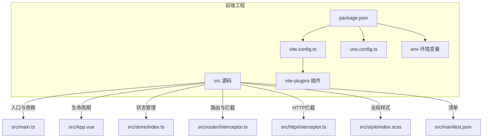
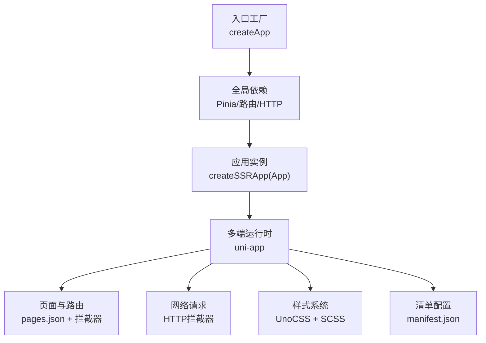
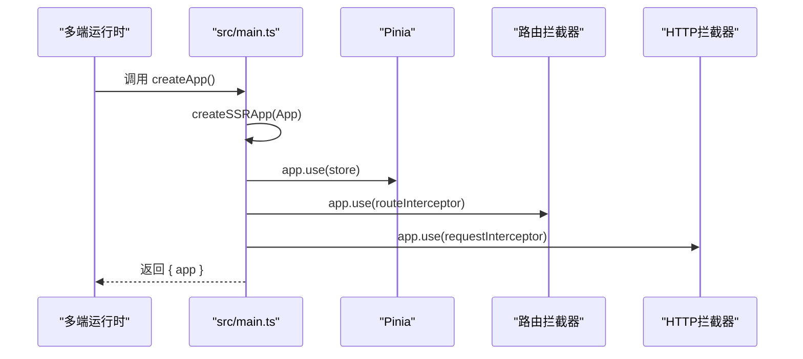
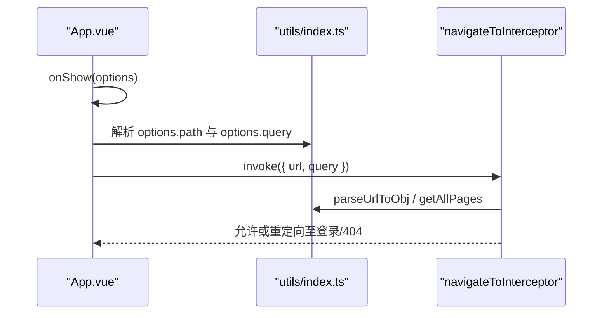
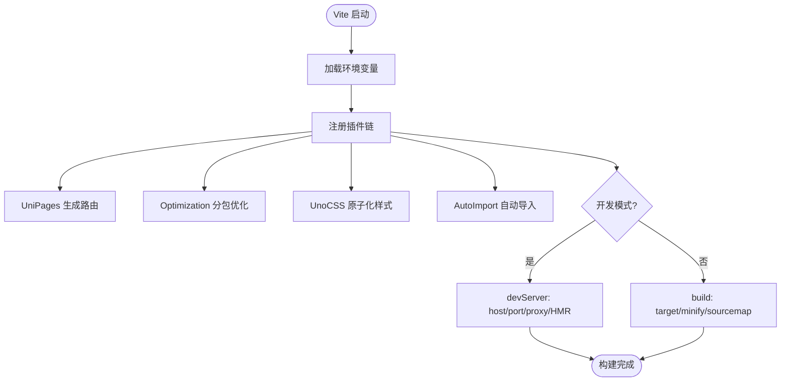
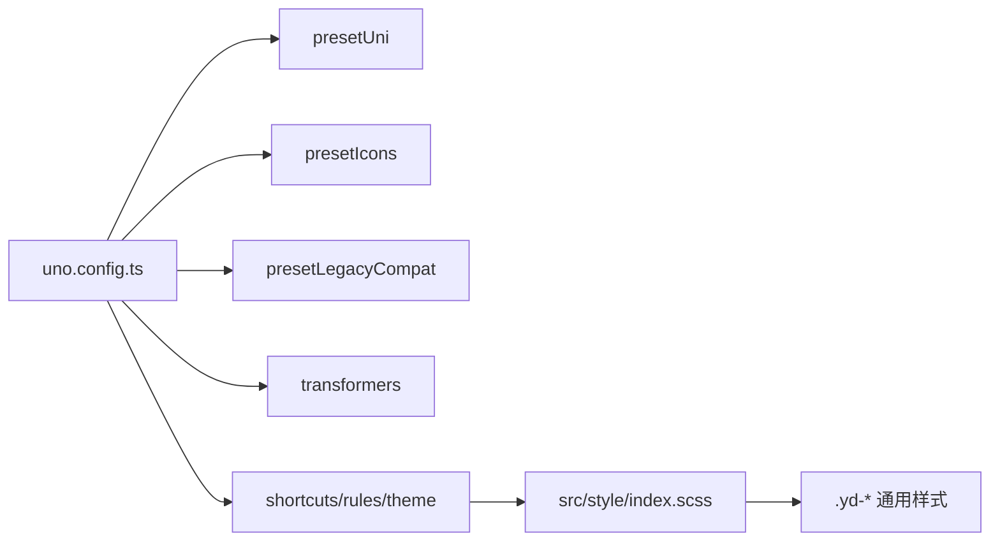
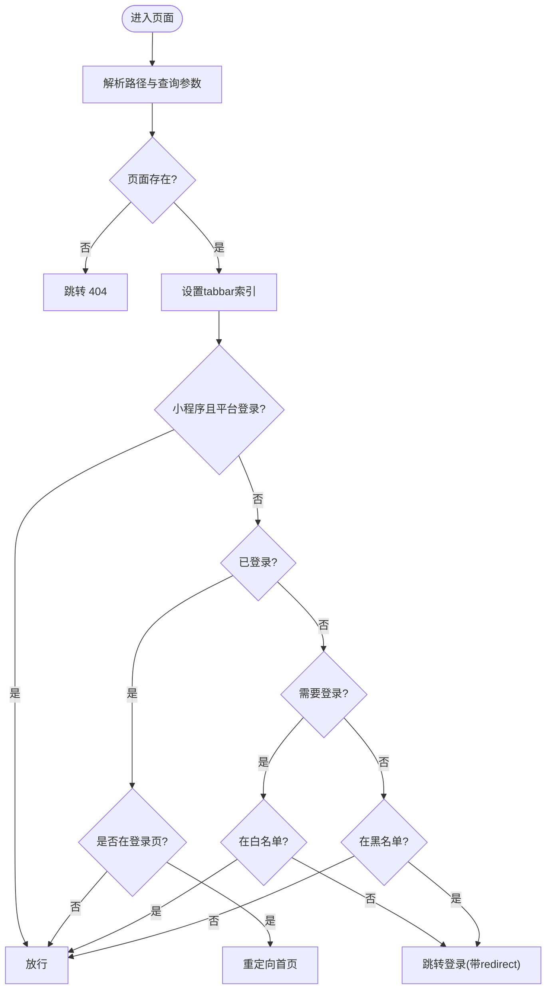
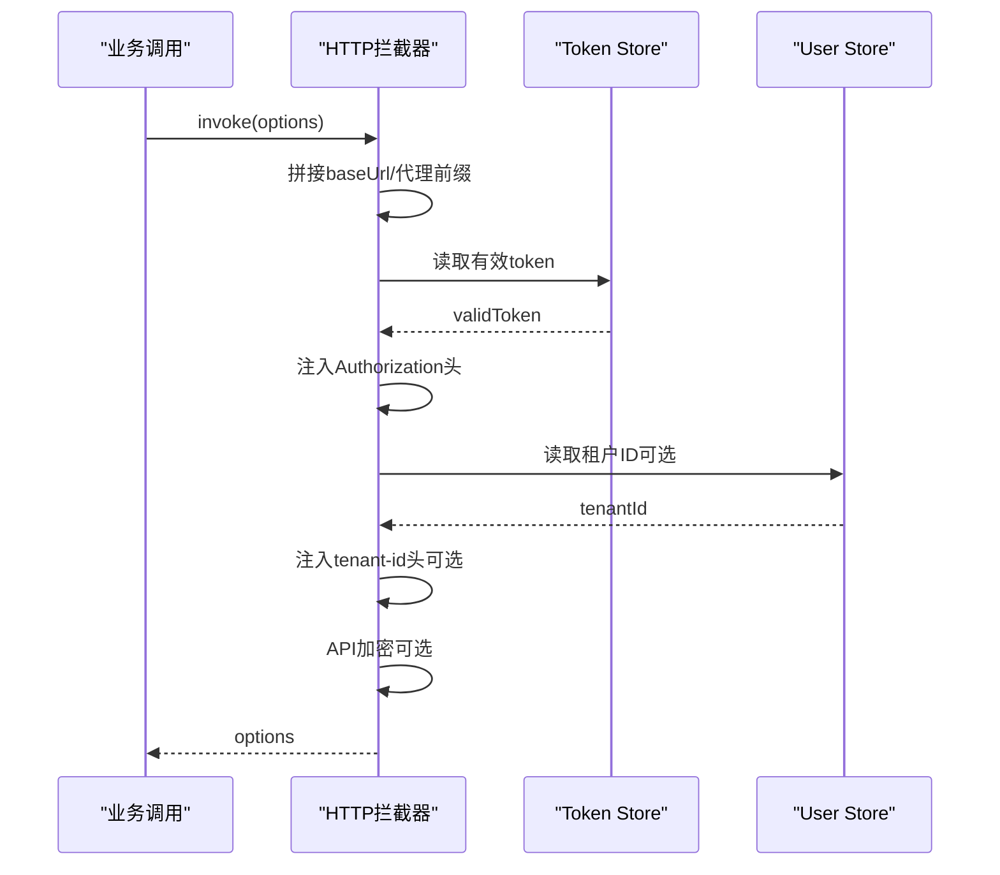
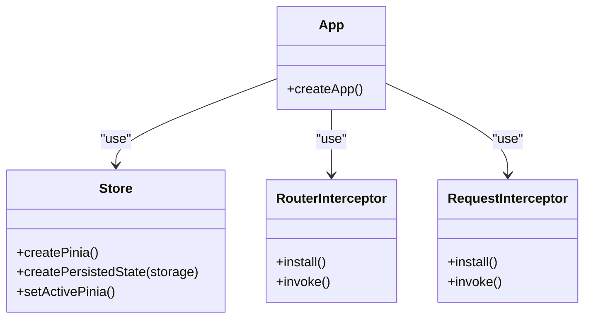
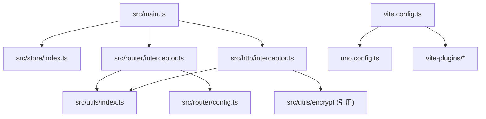

# 应用架构设计

<cite>
**本文档引用的文件**
- [package.json](file://frontend/admin-uniapp/package.json)
- [vite.config.ts](file://frontend/admin-uniapp/vite.config.ts)
- [uno.config.ts](file://frontend/admin-uniapp/uno.config.ts)
- [src/main.ts](file://frontend/admin-uniapp/src/main.ts)
- [src/App.vue](file://frontend/admin-uniapp/src/App.vue)
- [src/store/index.ts](file://frontend/admin-uniapp/src/store/index.ts)
- [src/router/config.ts](file://frontend/admin-uniapp/src/router/config.ts)
- [src/router/interceptor.ts](file://frontend/admin-uniapp/src/router/interceptor.ts)
- [src/http/interceptor.ts](file://frontend/admin-uniapp/src/http/interceptor.ts)
- [src/manifest.json](file://frontend/admin-uniapp/src/manifest.json)
- [src/style/index.scss](file://frontend/admin-uniapp/src/style/index.scss)
- [env/.env.development](file://frontend/admin-uniapp/env/.env.development)
- [env/.env.production](file://frontend/admin-uniapp/env/.env.production)
- [src/utils/index.ts](file://frontend/admin-uniapp/src/utils/index.ts)
- [vite-plugins/copy-native-resources.ts](file://frontend/admin-uniapp/vite-plugins/copy-native-resources.ts)
</cite>

## 目录
1. [引言](#引言)
2. [项目结构](#项目结构)
3. [核心组件](#核心组件)
4. [架构总览](#架构总览)
5. [详细组件分析](#详细组件分析)
6. [依赖关系分析](#依赖关系分析)
7. [性能考虑](#性能考虑)
8. [故障排查指南](#故障排查指南)
9. [结论](#结论)
10. [附录](#附录)

## 引言
本文件面向AgenticCPS管理后台的UniApp应用，系统化梳理应用入口配置、SSR应用创建、全局依赖注入机制；详解应用生命周期管理、插件注册流程、全局样式引入策略；阐述Vite构建配置、UnoCSS原子化CSS框架集成、开发服务器配置；并覆盖应用启动流程、错误边界处理、性能监控集成的最佳实践与优化建议。文档旨在帮助开发者快速理解并高效扩展该管理后台应用。

## 项目结构
前端管理后台采用多端统一的UniApp工程，核心目录与职责如下：
- frontend/admin-uniapp：管理后台UniApp工程
  - src：应用源码
    - main.ts：应用入口与SSR应用创建
    - App.vue：应用生命周期钩子
    - store：状态管理（Pinia）
    - router：路由配置与拦截器
    - http：HTTP请求拦截器
    - utils：通用工具函数
    - style：全局样式
    - manifest.json：多端清单配置
  - vite.config.ts：Vite构建与开发服务器配置
  - uno.config.ts：UnoCSS配置
  - vite-plugins：Vite插件（如原生插件资源复制）
  - env：环境变量
  - package.json：依赖与脚本

**图表来源**
- [vite.config.ts:1-214](file://frontend/admin-uniapp/vite.config.ts#L1-L214)
- [uno.config.ts:1-120](file://frontend/admin-uniapp/uno.config.ts#L1-L120)
- [package.json:1-194](file://frontend/admin-uniapp/package.json#L1-L194)
- [src/main.ts:1-20](file://frontend/admin-uniapp/src/main.ts#L1-L20)
- [src/App.vue:1-27](file://frontend/admin-uniapp/src/App.vue#L1-L27)
- [src/store/index.ts:1-23](file://frontend/admin-uniapp/src/store/index.ts#L1-L23)
- [src/router/interceptor.ts:1-146](file://frontend/admin-uniapp/src/router/interceptor.ts#L1-L146)
- [src/http/interceptor.ts:1-105](file://frontend/admin-uniapp/src/http/interceptor.ts#L1-L105)
- [src/style/index.scss:1-113](file://frontend/admin-uniapp/src/style/index.scss#L1-L113)
- [src/manifest.json:1-136](file://frontend/admin-uniapp/src/manifest.json#L1-L136)

**章节来源**
- [package.json:1-194](file://frontend/admin-uniapp/package.json#L1-L194)
- [vite.config.ts:1-214](file://frontend/admin-uniapp/vite.config.ts#L1-L214)
- [uno.config.ts:1-120](file://frontend/admin-uniapp/uno.config.ts#L1-L120)

## 核心组件
- 应用入口与SSR创建
  - 通过createSSRApp创建Vue应用实例，注入全局依赖（Pinia、路由拦截器、HTTP拦截器），并导出createApp工厂函数，供多端运行时调用。
- 全局依赖注入
  - Pinia状态管理（含持久化插件）
  - 路由拦截器（登录态与白/黑名单策略）
  - HTTP拦截器（统一鉴权、租户头、代理与加密）
- 生命周期管理
  - App.vue onLaunch/onShow处理首次启动与从分享/链接直达场景的路由拦截
- 全局样式与UI
  - 引入全局SCSS与UnoCSS虚拟模块，结合Wot Design Uni组件库与UnoCSS原子类

**章节来源**
- [src/main.ts:1-20](file://frontend/admin-uniapp/src/main.ts#L1-L20)
- [src/store/index.ts:1-23](file://frontend/admin-uniapp/src/store/index.ts#L1-L23)
- [src/router/interceptor.ts:1-146](file://frontend/admin-uniapp/src/router/interceptor.ts#L1-L146)
- [src/http/interceptor.ts:1-105](file://frontend/admin-uniapp/src/http/interceptor.ts#L1-L105)
- [src/App.vue:1-27](file://frontend/admin-uniapp/src/App.vue#L1-L27)
- [src/style/index.scss:1-113](file://frontend/admin-uniapp/src/style/index.scss#L1-L113)

## 架构总览
应用采用“入口工厂 + 插件化构建 + 原子化样式”的架构：
- 入口工厂：createApp统一创建SSR应用并注入依赖
- 插件体系：Vite插件链（页面/布局/平台/组件自动注册、分包优化、UnoCSS、自动导入、打包可视化等）
- 样式体系：UnoCSS预设（含图标、兼容性、主题变量）+ 全局SCSS
- 多端清单：manifest.json统一管理各端能力与图标

**图表来源**
- [src/main.ts:10-19](file://frontend/admin-uniapp/src/main.ts#L10-L19)
- [src/store/index.ts:1-23](file://frontend/admin-uniapp/src/store/index.ts#L1-L23)
- [src/router/interceptor.ts:138-145](file://frontend/admin-uniapp/src/router/interceptor.ts#L138-L145)
- [src/http/interceptor.ts:97-104](file://frontend/admin-uniapp/src/http/interceptor.ts#L97-L104)
- [uno.config.ts:17-67](file://frontend/admin-uniapp/uno.config.ts#L17-L67)
- [src/style/index.scss:1-113](file://frontend/admin-uniapp/src/style/index.scss#L1-L113)
- [src/manifest.json:1-136](file://frontend/admin-uniapp/src/manifest.json#L1-L136)

## 详细组件分析

### 应用入口与SSR创建
- createApp工厂函数负责：
  - 创建SSR应用实例
  - 注入Pinia状态管理（含持久化）
  - 注入路由拦截器与HTTP拦截器
  - 返回app对象供多端初始化
- 入口文件还统一引入全局样式与UnoCSS虚拟模块，保证首屏样式一致性

**图表来源**
- [src/main.ts:10-19](file://frontend/admin-uniapp/src/main.ts#L10-L19)
- [src/store/index.ts:1-23](file://frontend/admin-uniapp/src/store/index.ts#L1-L23)
- [src/router/interceptor.ts:138-145](file://frontend/admin-uniapp/src/router/interceptor.ts#L138-L145)
- [src/http/interceptor.ts:97-104](file://frontend/admin-uniapp/src/http/interceptor.ts#L97-L104)

**章节来源**
- [src/main.ts:1-20](file://frontend/admin-uniapp/src/main.ts#L1-L20)

### 应用生命周期管理
- App.vue onLaunch：应用启动回调
- App.vue onShow：应用显示回调，处理“直接进入页面路由”的情况（如H5直连或微信分享后进入），通过navigateToInterceptor进行路由拦截与重定向
- utils/index.ts提供解析URL、获取当前页、首页路径等工具，支撑路由拦截逻辑

**图表来源**
- [src/App.vue:5-18](file://frontend/admin-uniapp/src/App.vue#L5-L18)
- [src/router/interceptor.ts:36-136](file://frontend/admin-uniapp/src/router/interceptor.ts#L36-L136)
- [src/utils/index.ts:53-103](file://frontend/admin-uniapp/src/utils/index.ts#L53-L103)

**章节来源**
- [src/App.vue:1-27](file://frontend/admin-uniapp/src/App.vue#L1-L27)
- [src/utils/index.ts:1-244](file://frontend/admin-uniapp/src/utils/index.ts#L1-L244)

### 插件注册流程与Vite构建配置
- Vite插件链（顺序与作用）：
  - UniLayouts、UniPlatform、UniManifest、UniPages：页面与布局、平台、清单生成
  - Optimization：分包优化、异步跨包调用与组件引用
  - UniKuRoot：页面根节点处理
  - Components（WotResolver）：组件自动注册与类型声明
  - 自定义修复插件：禁用vite:vue devTools以规避编译BUG
  - UnoCSS：原子化CSS
  - AutoImport：自动导入vue/uni-app API与hooks
  - ViteRestart：热更新配置变更
  - HTML替换（H5）：注入构建时间与标题
  - 打包分析（H5生产）：可视化bundle
  - 原生插件资源复制：仅在app平台且启用时生效
  - syncManifestPlugin：清单同步
- 服务器与构建：
  - devServer：host、端口、HMR、代理（基于环境变量）
  - esbuild删除console与debugger（生产）
  - 构建目标ES6、开发不压缩、生产使用esbuild压缩

**图表来源**
- [vite.config.ts:33-214](file://frontend/admin-uniapp/vite.config.ts#L33-L214)

**章节来源**
- [vite.config.ts:1-214](file://frontend/admin-uniapp/vite.config.ts#L1-L214)

### 全局样式引入策略
- UnoCSS集成：
  - presetUni：UniApp适配的UnoCSS预设
  - presetIcons：图标集（本地SVG动态加载、currentColor继承、尺寸适配）
  - presetLegacyCompat：低端安卓兼容（颜色函数逗号分隔）
  - transformers：指令与变体组合
  - shortcuts/rules/theme：常用简写、安全区、主题色与字号
- 全局SCSS：
  - 定义页面容器、详情页底部操作按钮、搜索表单弹窗等通用样式
  - 通过UnoCSS与SCSS协同，兼顾原子化与语义化

**图表来源**
- [uno.config.ts:17-120](file://frontend/admin-uniapp/uno.config.ts#L17-L120)
- [src/style/index.scss:1-113](file://frontend/admin-uniapp/src/style/index.scss#L1-L113)

**章节来源**
- [uno.config.ts:1-120](file://frontend/admin-uniapp/uno.config.ts#L1-L120)
- [src/style/index.scss:1-113](file://frontend/admin-uniapp/src/style/index.scss#L1-L113)

### 路由拦截与登录策略
- 登录策略配置：
  - 黑名单/白名单策略开关与登录页路径
  - 小程序登录页启用开关
- 拦截逻辑：
  - 判断是否已登录、是否在白/黑名单、是否为插件页面
  - 处理相对路径、路由不存在、tabbar切换
  - 重定向至登录页并携带redirect参数

**图表来源**
- [src/router/interceptor.ts:36-136](file://frontend/admin-uniapp/src/router/interceptor.ts#L36-L136)
- [src/router/config.ts:1-46](file://frontend/admin-uniapp/src/router/config.ts#L1-L46)

**章节来源**
- [src/router/interceptor.ts:1-146](file://frontend/admin-uniapp/src/router/interceptor.ts#L1-L146)
- [src/router/config.ts:1-46](file://frontend/admin-uniapp/src/router/config.ts#L1-L46)

### HTTP拦截与请求策略
- 统一处理：
  - 查询串拼接、协议补齐、代理前缀处理（H5）
  - 超时设置、Authorization头注入、租户头注入
  - 可选API加密（请求体加密与头部标识）
- 拦截范围：request与uploadFile

**图表来源**
- [src/http/interceptor.ts:19-94](file://frontend/admin-uniapp/src/http/interceptor.ts#L19-L94)

**章节来源**
- [src/http/interceptor.ts:1-105](file://frontend/admin-uniapp/src/http/interceptor.ts#L1-L105)

### 全局依赖注入机制
- Pinia状态管理：
  - 创建Pinia实例并启用持久化（storage使用uni的本地存储）
  - 立即激活Pinia，避免APP端白屏
- 插件注册顺序：
  - Components/WotResolver需在Uni之前引入
  - Optimization需在UniPages之后
  - UniKuRoot放置于改变pages.json的插件之后

**图表来源**
- [src/store/index.ts:1-23](file://frontend/admin-uniapp/src/store/index.ts#L1-L23)
- [src/router/interceptor.ts:138-145](file://frontend/admin-uniapp/src/router/interceptor.ts#L138-L145)
- [src/http/interceptor.ts:97-104](file://frontend/admin-uniapp/src/http/interceptor.ts#L97-L104)
- [src/main.ts:10-19](file://frontend/admin-uniapp/src/main.ts#L10-L19)

**章节来源**
- [src/store/index.ts:1-23](file://frontend/admin-uniapp/src/store/index.ts#L1-L23)
- [src/main.ts:1-20](file://frontend/admin-uniapp/src/main.ts#L1-L20)

### 开发服务器与环境变量
- 环境变量：
  - VITE_APP_PORT、VITE_SERVER_BASEURL、VITE_APP_TITLE、VITE_DELETE_CONSOLE、VITE_APP_PUBLIC_BASE、VITE_APP_PROXY_ENABLE、VITE_APP_PROXY_PREFIX、VITE_COPY_NATIVE_RES_ENABLE
- 开发服务器：
  - host='0.0.0.0'、port来自VITE_APP_PORT
  - 代理：当VITE_APP_PROXY_ENABLE为true时，根据VITE_APP_PROXY_PREFIX与VITE_SERVER_BASEURL配置
- 生产构建：
  - 删除console与debugger（VITE_DELETE_CONSOLE）
  - ES6目标、生产使用esbuild压缩

**章节来源**
- [env/.env.development:1-10](file://frontend/admin-uniapp/env/.env.development#L1-L10)
- [env/.env.production:1-10](file://frontend/admin-uniapp/env/.env.production#L1-L10)
- [vite.config.ts:185-212](file://frontend/admin-uniapp/vite.config.ts#L185-L212)

### 清单与多端配置
- manifest.json：
  - app-plus、mp-weixin、mp-alipay、h5等多端能力与图标配置
  - 使用usingComponents、优化策略（如subPackages）

**章节来源**
- [src/manifest.json:1-136](file://frontend/admin-uniapp/src/manifest.json#L1-L136)

### 原生插件资源复制插件
- 仅在app平台且启用时生效
- 将项目根目录nativeplugins复制到构建输出目录，保持原生插件资源可用
- 写在writeBundle阶段，避免影响其他插件执行

**章节来源**
- [vite-plugins/copy-native-resources.ts:1-202](file://frontend/admin-uniapp/vite-plugins/copy-native-resources.ts#L1-L202)
- [vite.config.ts:147-154](file://frontend/admin-uniapp/vite.config.ts#L147-L154)

## 依赖关系分析
- 组件耦合与内聚：
  - main.ts高内聚地创建应用并注入依赖，降低其他模块耦合
  - 路由与HTTP拦截器通过uni拦截器机制解耦业务调用
- 直接与间接依赖：
  - store依赖pinia与持久化插件
  - router依赖utils提供的页面枚举与tabbar状态
  - http依赖utils的环境基地址与加密工具
- 外部依赖与集成点：
  - UnoCSS与Wot Design Uni
  - Vite生态插件链
  - 多端清单与平台能力

**图表来源**
- [src/main.ts:1-20](file://frontend/admin-uniapp/src/main.ts#L1-L20)
- [src/store/index.ts:1-23](file://frontend/admin-uniapp/src/store/index.ts#L1-L23)
- [src/router/interceptor.ts:1-146](file://frontend/admin-uniapp/src/router/interceptor.ts#L1-L146)
- [src/http/interceptor.ts:1-105](file://frontend/admin-uniapp/src/http/interceptor.ts#L1-L105)
- [src/router/config.ts:1-46](file://frontend/admin-uniapp/src/router/config.ts#L1-L46)
- [src/utils/index.ts:1-244](file://frontend/admin-uniapp/src/utils/index.ts#L1-L244)
- [vite.config.ts:1-214](file://frontend/admin-uniapp/vite.config.ts#L1-L214)
- [uno.config.ts:1-120](file://frontend/admin-uniapp/uno.config.ts#L1-L120)

**章节来源**
- [src/main.ts:1-20](file://frontend/admin-uniapp/src/main.ts#L1-L20)
- [vite.config.ts:1-214](file://frontend/admin-uniapp/vite.config.ts#L1-L214)

## 性能考虑
- 构建优化
  - 分包优化（Optimization）减少主包体积，提升冷启动
  - 组件与页面自动注册（Components/UniPages）减少手动开销
  - 生产移除console与debugger，减小包体
- 样式优化
  - UnoCSS按需生成，避免全局样式冗余
  - presetLegacyCompat提升低端机兼容性
- 运行时优化
  - Pinia持久化减少重复拉取
  - 路由与HTTP拦截器集中处理，避免重复逻辑
- 可视化与分析
  - H5生产环境打包分析可视化，定位大体积模块

[本节为通用性能指导，无需特定文件引用]

## 故障排查指南
- 控制台日志
  - 路由拦截器支持日志开关，便于定位登录策略与路径解析问题
- 常见问题
  - 登录态异常：检查Token存储与拦截器Authorization头注入
  - 路由跳转异常：确认白/黑名单配置与tabbar索引设置
  - 代理无效：核对VITE_APP_PROXY_ENABLE/VITE_APP_PROXY_PREFIX/VITE_SERVER_BASEURL
  - 原生插件资源缺失：确认nativeplugins目录存在且插件启用
- 调试建议
  - 开启VITE_DELETE_CONSOLE=false便于开发调试
  - 使用打包分析报告定位体积热点

**章节来源**
- [src/router/interceptor.ts:14-16](file://frontend/admin-uniapp/src/router/interceptor.ts#L14-L16)
- [vite.config.ts:185-200](file://frontend/admin-uniapp/vite.config.ts#L185-L200)
- [vite-plugins/copy-native-resources.ts:110-134](file://frontend/admin-uniapp/vite-plugins/copy-native-resources.ts#L110-L134)

## 结论
该管理后台UniApp应用通过入口工厂、插件化构建与UnoCSS原子化样式，实现了高内聚、低耦合的架构设计。路由与HTTP拦截器集中处理登录态与请求策略，配合Pinia持久化与多端清单，满足多端部署需求。建议在实际迭代中持续关注分包优化、样式按需生成与代理配置，以获得更佳的开发体验与运行性能。

## 附录
- 最佳实践
  - 统一在main.ts注入依赖，避免分散初始化
  - 路由与HTTP拦截器逻辑集中在专用模块，便于维护
  - UnoCSS与SCSS协同使用，优先原子类，必要时补充语义化样式
  - 生产环境启用分包优化与打包分析，持续优化体积
- 配置优化建议
  - 根据业务拆分pages-core与业务模块分包，减少首屏依赖
  - 合理设置代理前缀与目标地址，避免H5跨域与移动端直连问题
  - 为原生插件准备nativeplugins目录并启用复制插件，确保构建产物完整

[本节为通用建议，无需特定文件引用]