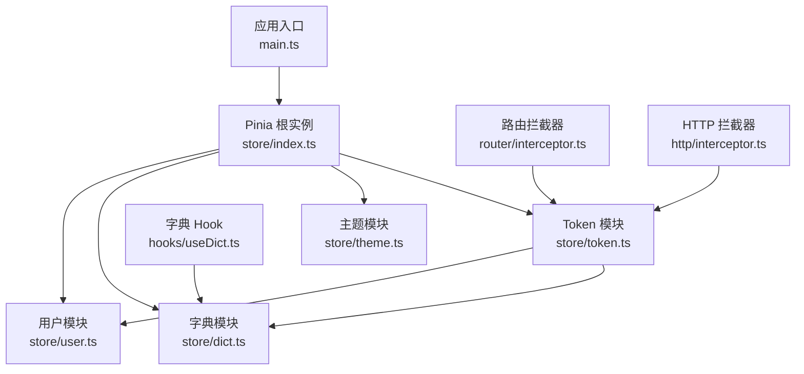
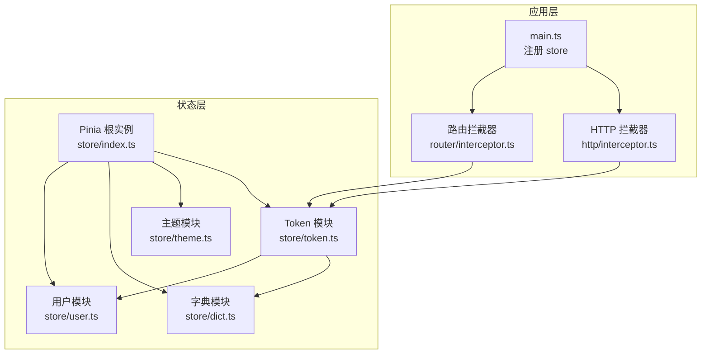
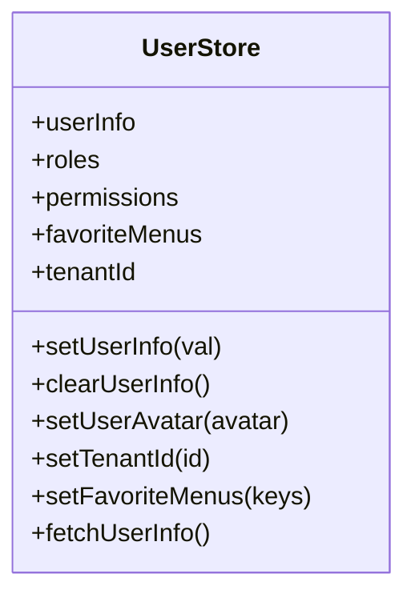
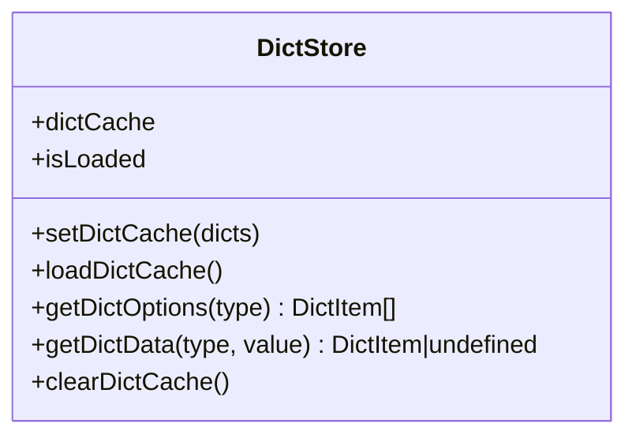
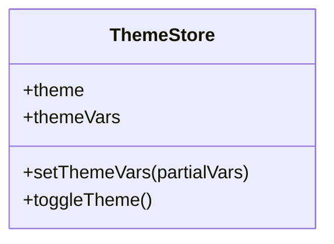
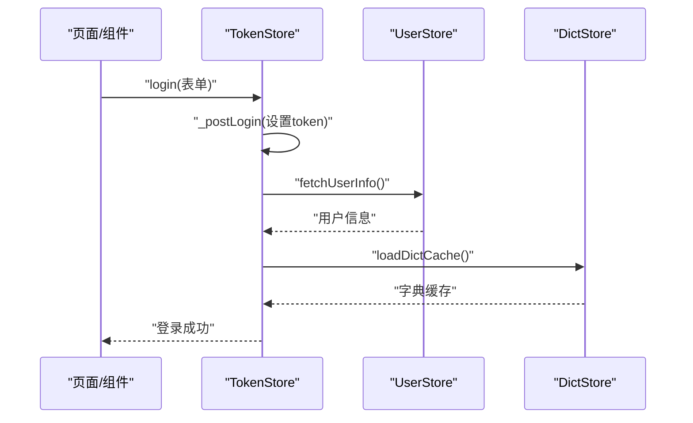
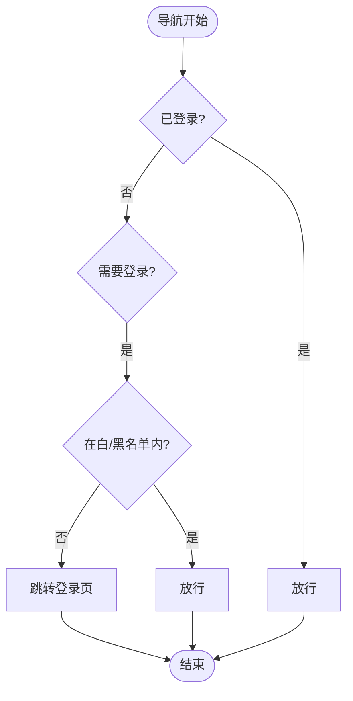
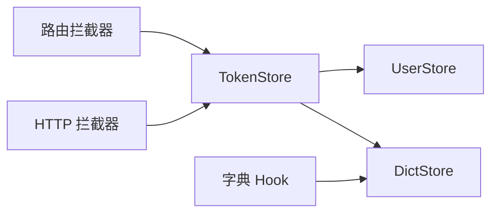

# 状态管理系统

<cite>
**本文引用的文件**
- [frontend/admin-uniapp/src/store/index.ts](file://frontend/admin-uniapp/src/store/index.ts)
- [frontend/admin-uniapp/src/store/user.ts](file://frontend/admin-uniapp/src/store/user.ts)
- [frontend/admin-uniapp/src/store/dict.ts](file://frontend/admin-uniapp/src/store/dict.ts)
- [frontend/admin-uniapp/src/store/theme.ts](file://frontend/admin-uniapp/src/store/theme.ts)
- [frontend/admin-uniapp/src/store/token.ts](file://frontend/admin-uniapp/src/store/token.ts)
- [frontend/admin-uniapp/src/main.ts](file://frontend/admin-uniapp/src/main.ts)
- [frontend/admin-uniapp/src/router/interceptor.ts](file://frontend/admin-uniapp/src/router/interceptor.ts)
- [frontend/admin-uniapp/src/hooks/useDict.ts](file://frontend/admin-uniapp/src/hooks/useDict.ts)
- [frontend/admin-uniapp/src/http/interceptor.ts](file://frontend/admin-uniapp/src/http/interceptor.ts)
</cite>

## 目录
1. [简介](#简介)
2. [项目结构](#项目结构)
3. [核心组件](#核心组件)
4. [架构总览](#架构总览)
5. [详细组件分析](#详细组件分析)
6. [依赖关系分析](#依赖关系分析)
7. [性能考量](#性能考量)
8. [故障排查指南](#故障排查指南)
9. [结论](#结论)
10. [附录](#附录)

## 简介
本文件面向 AgenticCPS 管理后台的 UniApp 前端，系统性梳理其基于 Pinia 的状态管理系统。内容涵盖 Vuex/Pinia 模式对比、Store 模块化设计与状态树规划、用户状态、字典数据、主题配置三大核心域；阐述状态持久化策略、状态同步机制与异步状态处理；总结状态订阅模式、计算属性使用与调试工具；并给出最佳实践与性能优化建议。

## 项目结构
- Store 入口与持久化插件
  - 入口文件集中注册 Pinia 实例与持久化插件，并统一导出模块以便全局按需引入。
  - 使用 uni 提供的本地存储接口实现持久化，解决 APP 端白屏问题。
- Store 模块划分
  - 用户模块：用户信息、角色权限、常用菜单、租户 ID 等。
  - 字典模块：字典缓存、按类型查询、加载与清理。
  - 主题模块：明暗主题切换与主题变量合并。
  - Token 模块：登录、登出、刷新、有效性判断、与用户/字典模块联动。
- 应用集成
  - 在应用入口完成 store 注册，路由与 HTTP 层通过 store 进行鉴权与拦截。

图表来源
- [frontend/admin-uniapp/src/main.ts:1-20](file://frontend/admin-uniapp/src/main.ts#L1-L20)
- [frontend/admin-uniapp/src/store/index.ts:1-23](file://frontend/admin-uniapp/src/store/index.ts#L1-L23)
- [frontend/admin-uniapp/src/store/user.ts:1-90](file://frontend/admin-uniapp/src/store/user.ts#L1-L90)
- [frontend/admin-uniapp/src/store/dict.ts:1-87](file://frontend/admin-uniapp/src/store/dict.ts#L1-L87)
- [frontend/admin-uniapp/src/store/theme.ts:1-43](file://frontend/admin-uniapp/src/store/theme.ts#L1-L43)
- [frontend/admin-uniapp/src/store/token.ts:1-342](file://frontend/admin-uniapp/src/store/token.ts#L1-L342)
- [frontend/admin-uniapp/src/router/interceptor.ts:1-146](file://frontend/admin-uniapp/src/router/interceptor.ts#L1-L146)
- [frontend/admin-uniapp/src/http/interceptor.ts](file://frontend/admin-uniapp/src/http/interceptor.ts)
- [frontend/admin-uniapp/src/hooks/useDict.ts:1-133](file://frontend/admin-uniapp/src/hooks/useDict.ts#L1-L133)

章节来源
- [frontend/admin-uniapp/src/store/index.ts:1-23](file://frontend/admin-uniapp/src/store/index.ts#L1-L23)
- [frontend/admin-uniapp/src/main.ts:1-20](file://frontend/admin-uniapp/src/main.ts#L1-L20)

## 核心组件
- Pinia 根实例与持久化
  - 创建 Pinia 实例并注入持久化插件，指定 uni 存储接口，保证刷新后状态不丢失。
  - 立即激活 Pinia 实例，避免 APP 端初始化顺序导致的白屏。
- 用户状态模块
  - 维护用户信息、角色、权限、常用菜单、租户 ID。
  - 提供设置、清空、拉取用户信息等方法；持久化开启。
- 字典状态模块
  - 维护按类型分组的字典项缓存，提供加载、查询、清理能力。
  - 通过计算属性表达“是否已加载”，减少重复请求。
- 主题状态模块
  - 维护主题模式与主题变量，支持切换与增量合并。
  - 持久化开启，保证主题偏好跨会话保持。
- Token 状态模块
  - 统一处理登录、登出、刷新、有效性判断与过期时间计算。
  - 支持单/双 Token 模式，与用户/字典模块联动，自动拉取用户信息与字典数据。

章节来源
- [frontend/admin-uniapp/src/store/index.ts:1-23](file://frontend/admin-uniapp/src/store/index.ts#L1-L23)
- [frontend/admin-uniapp/src/store/user.ts:1-90](file://frontend/admin-uniapp/src/store/user.ts#L1-L90)
- [frontend/admin-uniapp/src/store/dict.ts:1-87](file://frontend/admin-uniapp/src/store/dict.ts#L1-L87)
- [frontend/admin-uniapp/src/store/theme.ts:1-43](file://frontend/admin-uniapp/src/store/theme.ts#L1-L43)
- [frontend/admin-uniapp/src/store/token.ts:1-342](file://frontend/admin-uniapp/src/store/token.ts#L1-L342)

## 架构总览
状态管理采用“模块化 Store + 全局入口 + 插件化持久化”的架构。应用启动时注册 store，路由与 HTTP 层通过 store 进行鉴权与拦截；Token 模块负责认证生命周期并与用户/字典模块协同；用户/字典/主题模块各自职责清晰，通过计算属性与副作用实现高效的状态同步。

图表来源
- [frontend/admin-uniapp/src/main.ts:1-20](file://frontend/admin-uniapp/src/main.ts#L1-L20)
- [frontend/admin-uniapp/src/router/interceptor.ts:1-146](file://frontend/admin-uniapp/src/router/interceptor.ts#L1-L146)
- [frontend/admin-uniapp/src/http/interceptor.ts](file://frontend/admin-uniapp/src/http/interceptor.ts)
- [frontend/admin-uniapp/src/store/index.ts:1-23](file://frontend/admin-uniapp/src/store/index.ts#L1-L23)
- [frontend/admin-uniapp/src/store/user.ts:1-90](file://frontend/admin-uniapp/src/store/user.ts#L1-L90)
- [frontend/admin-uniapp/src/store/dict.ts:1-87](file://frontend/admin-uniapp/src/store/dict.ts#L1-L87)
- [frontend/admin-uniapp/src/store/theme.ts:1-43](file://frontend/admin-uniapp/src/store/theme.ts#L1-L43)
- [frontend/admin-uniapp/src/store/token.ts:1-342](file://frontend/admin-uniapp/src/store/token.ts#L1-L342)

## 详细组件分析

### 用户状态模块（user）
- 状态结构
  - 用户信息、角色列表、权限列表、常用菜单、租户 ID。
- 关键方法
  - 设置/清空用户信息、设置头像、设置租户、设置常用菜单、拉取用户信息。
- 持久化
  - 开启持久化，配合 Token 模块在登出时清理。
- 订阅与使用
  - 路由与 HTTP 层可读取用户租户 ID 等上下文信息。

图表来源
- [frontend/admin-uniapp/src/store/user.ts:17-89](file://frontend/admin-uniapp/src/store/user.ts#L17-L89)

章节来源
- [frontend/admin-uniapp/src/store/user.ts:1-90](file://frontend/admin-uniapp/src/store/user.ts#L1-L90)

### 字典状态模块（dict）
- 状态结构
  - 字典缓存（按类型分组）、加载状态计算属性。
- 关键方法
  - 设置缓存、加载缓存（幂等）、按类型获取选项、按类型+值获取字典项、清空缓存。
- 性能特性
  - 通过 isLoaded 计算属性避免重复请求；字典项包含标签、值、颜色类型与样式类。
- 使用方式
  - 通过 Hook 将字典项转换为不同值类型的选项列表，便于表单/选择器使用。

图表来源
- [frontend/admin-uniapp/src/store/dict.ts:18-86](file://frontend/admin-uniapp/src/store/dict.ts#L18-L86)

章节来源
- [frontend/admin-uniapp/src/store/dict.ts:1-87](file://frontend/admin-uniapp/src/store/dict.ts#L1-L87)
- [frontend/admin-uniapp/src/hooks/useDict.ts:1-133](file://frontend/admin-uniapp/src/hooks/useDict.ts#L1-L133)

### 主题状态模块（theme）
- 状态结构
  - 主题模式（明/暗）、主题变量对象。
- 关键方法
  - 设置主题变量（增量合并）、切换主题。
- 持久化
  - 开启持久化，保证用户偏好跨会话一致。

图表来源
- [frontend/admin-uniapp/src/store/theme.ts:5-42](file://frontend/admin-uniapp/src/store/theme.ts#L5-L42)

章节来源
- [frontend/admin-uniapp/src/store/theme.ts:1-43](file://frontend/admin-uniapp/src/store/theme.ts#L1-L43)

### Token 状态模块（token）
- 状态结构
  - 单/双 Token 模式下的 token 信息与过期时间；通过本地存储记录过期时间。
- 关键流程
  - 登录（账号/注册/短信/微信）：统一处理登录结果、设置 token、拉取用户信息、加载字典。
  - 登出：调用后端登出接口，清理本地 token 与用户/字典缓存。
  - 刷新：双 Token 模式下刷新访问令牌；单 Token 模式报错。
  - 有效性判断：hasLogin/hasValidLogin/getValidToken/tryGetValidToken。
- 与其他模块的协作
  - 登录后自动拉取用户信息与字典；登出时同步清理。

图表来源
- [frontend/admin-uniapp/src/store/token.ts:104-113](file://frontend/admin-uniapp/src/store/token.ts#L104-L113)
- [frontend/admin-uniapp/src/store/user.ts:64-70](file://frontend/admin-uniapp/src/store/user.ts#L64-L70)
- [frontend/admin-uniapp/src/store/dict.ts:30-52](file://frontend/admin-uniapp/src/store/dict.ts#L30-L52)

章节来源
- [frontend/admin-uniapp/src/store/token.ts:1-342](file://frontend/admin-uniapp/src/store/token.ts#L1-L342)

### 登录态与路由/HTTP 同步
- 路由拦截
  - 依据登录态与黑白名单策略决定放行或跳转登录页；已登录且在登录页则重定向首页或指定地址。
- HTTP 拦截
  - 在请求前根据 Token 模块提供的有效性判断与刷新能力，确保携带有效 token；必要时触发刷新。

图表来源
- [frontend/admin-uniapp/src/router/interceptor.ts:81-98](file://frontend/admin-uniapp/src/router/interceptor.ts#L81-L98)
- [frontend/admin-uniapp/src/router/interceptor.ts:107-133](file://frontend/admin-uniapp/src/router/interceptor.ts#L107-L133)

章节来源
- [frontend/admin-uniapp/src/router/interceptor.ts:1-146](file://frontend/admin-uniapp/src/router/interceptor.ts#L1-L146)
- [frontend/admin-uniapp/src/http/interceptor.ts](file://frontend/admin-uniapp/src/http/interceptor.ts)

## 依赖关系分析
- 模块耦合
  - Token 模块与用户/字典模块存在运行时依赖（登录后拉取用户与字典；登出时清理）。
  - 路由与 HTTP 层依赖 Token 模块进行鉴权判断。
- 外部依赖
  - 本地存储：uni 提供的同步存储接口。
  - UI 组件库：Wot Design Uni 的 Toast 与 ConfigProvider 主题变量类型。

图表来源
- [frontend/admin-uniapp/src/store/token.ts:107-112](file://frontend/admin-uniapp/src/store/token.ts#L107-L112)
- [frontend/admin-uniapp/src/router/interceptor.ts:8,81](file://frontend/admin-uniapp/src/router/interceptor.ts#L8,L81)
- [frontend/admin-uniapp/src/http/interceptor.ts](file://frontend/admin-uniapp/src/http/interceptor.ts)
- [frontend/admin-uniapp/src/hooks/useDict.ts:1-133](file://frontend/admin-uniapp/src/hooks/useDict.ts#L1-L133)

章节来源
- [frontend/admin-uniapp/src/store/token.ts:1-342](file://frontend/admin-uniapp/src/store/token.ts#L1-L342)
- [frontend/admin-uniapp/src/router/interceptor.ts:1-146](file://frontend/admin-uniapp/src/router/interceptor.ts#L1-L146)
- [frontend/admin-uniapp/src/http/interceptor.ts](file://frontend/admin-uniapp/src/http/interceptor.ts)
- [frontend/admin-uniapp/src/hooks/useDict.ts:1-133](file://frontend/admin-uniapp/src/hooks/useDict.ts#L1-L133)

## 性能考量
- 状态持久化
  - 通过持久化插件将关键状态落盘，减少刷新后的重复请求与初始化成本。
- 计算属性与缓存
  - 字典模块使用 isLoaded 与缓存结构避免重复拉取；Token 模块通过本地存储记录过期时间，快速判断有效性。
- 异步处理
  - 登录后异步拉取用户与字典，避免阻塞主流程；刷新令牌仅在必要时触发。
- 组件订阅
  - 通过响应式 ref/computed 精准订阅所需字段，降低不必要的渲染。

## 故障排查指南
- 登录后仍被重定向至登录页
  - 检查 Token 模块是否正确设置 token 与过期时间；确认 hasValidLogin 判断逻辑。
- 页面白屏或初始化异常
  - 确认 Pinia 已在应用启动早期注册并激活，持久化插件已正确配置。
- 字典不显示或标签为空
  - 确认字典模块已加载且缓存非空；检查字典类型与值匹配逻辑。
- 主题切换无效
  - 检查主题变量合并逻辑与主题模式切换；确认持久化已生效。
- 登出后状态未清理
  - 确认登出流程中调用了清理 token 与用户/字典缓存的逻辑。

章节来源
- [frontend/admin-uniapp/src/store/token.ts:200-222](file://frontend/admin-uniapp/src/store/token.ts#L200-L222)
- [frontend/admin-uniapp/src/store/dict.ts:68-71](file://frontend/admin-uniapp/src/store/dict.ts#L68-L71)
- [frontend/admin-uniapp/src/store/theme.ts:23-26](file://frontend/admin-uniapp/src/store/theme.ts#L23-L26)
- [frontend/admin-uniapp/src/store/index.ts:13-14](file://frontend/admin-uniapp/src/store/index.ts#L13-L14)

## 结论
该状态管理系统以 Pinia 为核心，围绕用户、字典、主题与 Token 四大模块构建，结合持久化与计算属性实现高效、可维护的状态管理。通过路由与 HTTP 层与状态模块的协同，形成完整的认证与数据流闭环。建议在后续迭代中进一步完善调试工具链与监控埋点，持续优化异步加载与缓存策略。

## 附录
- 最佳实践
  - 将“状态定义”与“副作用处理”解耦，保持模块内部纯函数风格。
  - 对外暴露最小 API，内部通过计算属性与副作用实现复杂逻辑。
  - 对关键状态开启持久化，但注意控制存储体积与敏感信息脱敏。
- 性能优化建议
  - 合理拆分模块，避免跨模块强耦合；对高频读取的数据建立本地缓存。
  - 使用计算属性表达派生状态，减少重复计算与渲染。
  - 对异步请求进行节流/防抖与幂等处理，避免重复请求。