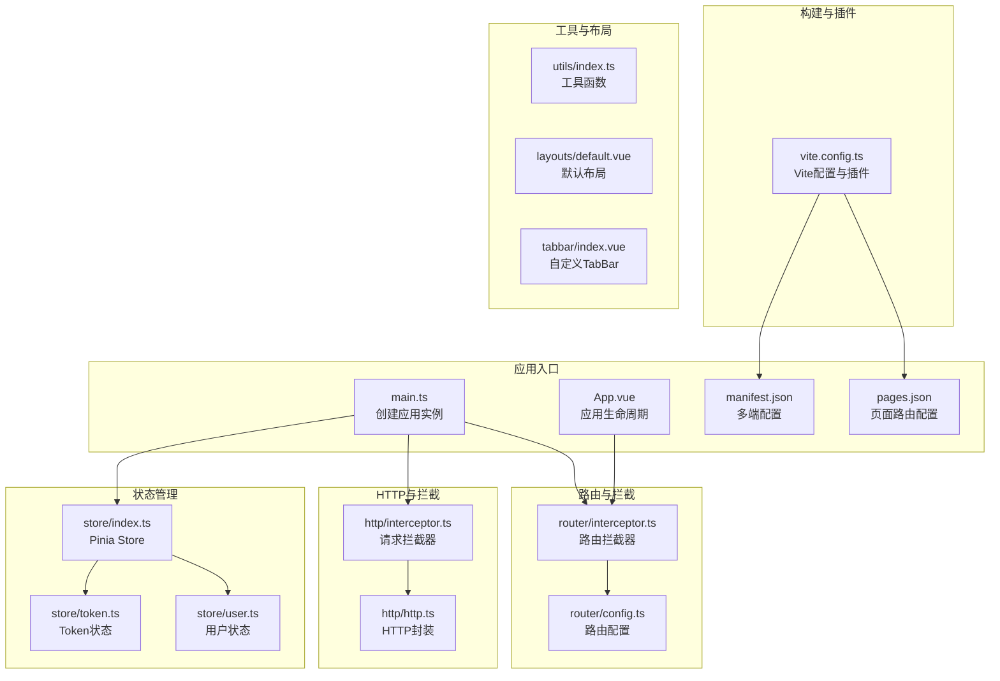
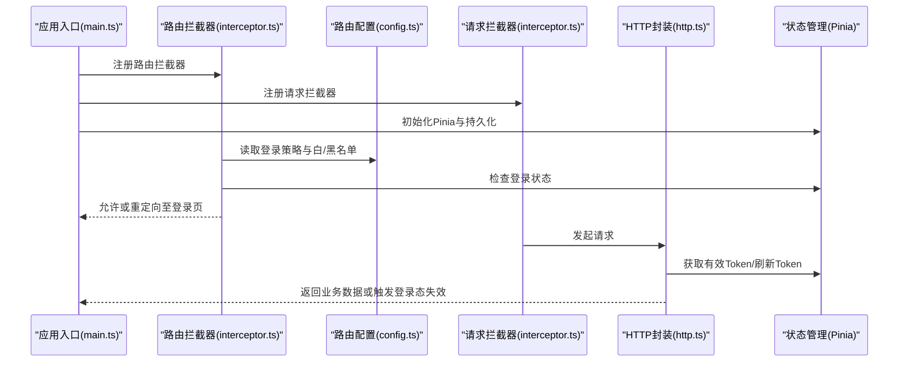
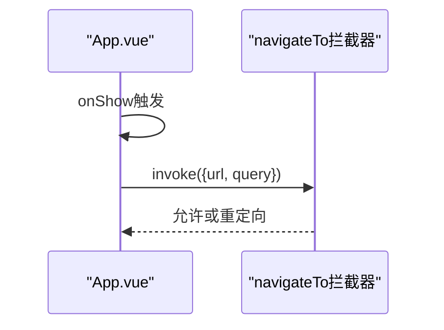
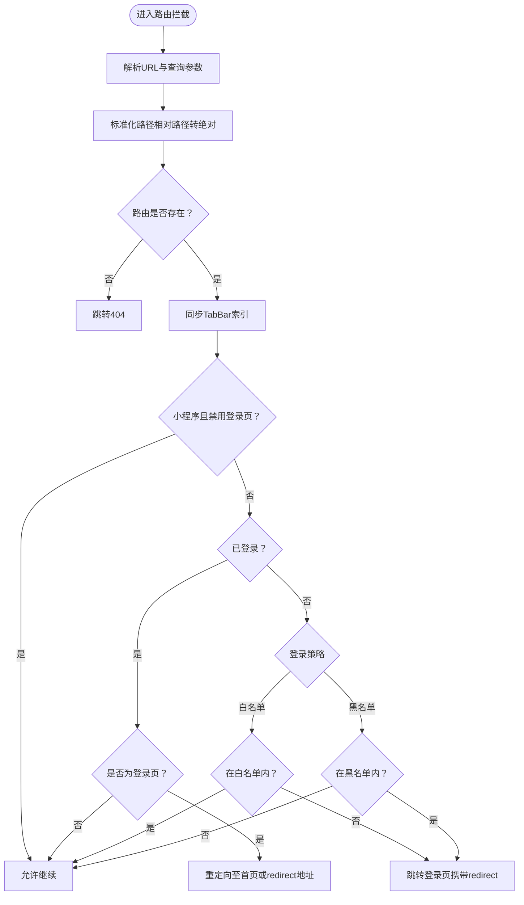
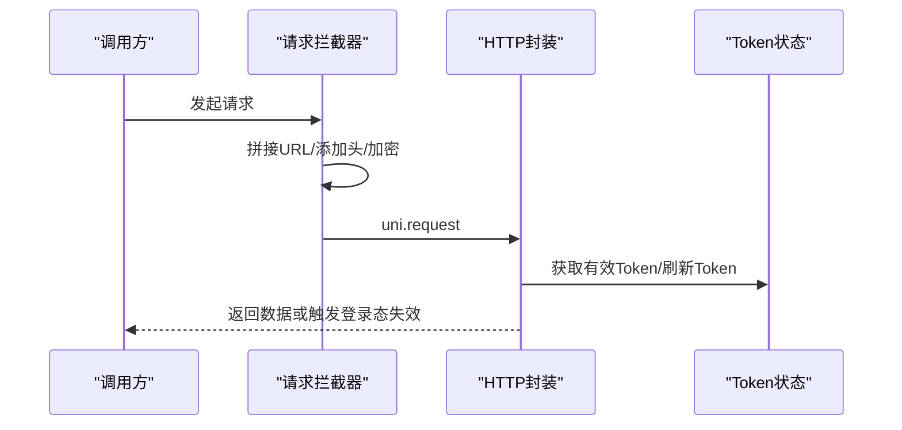
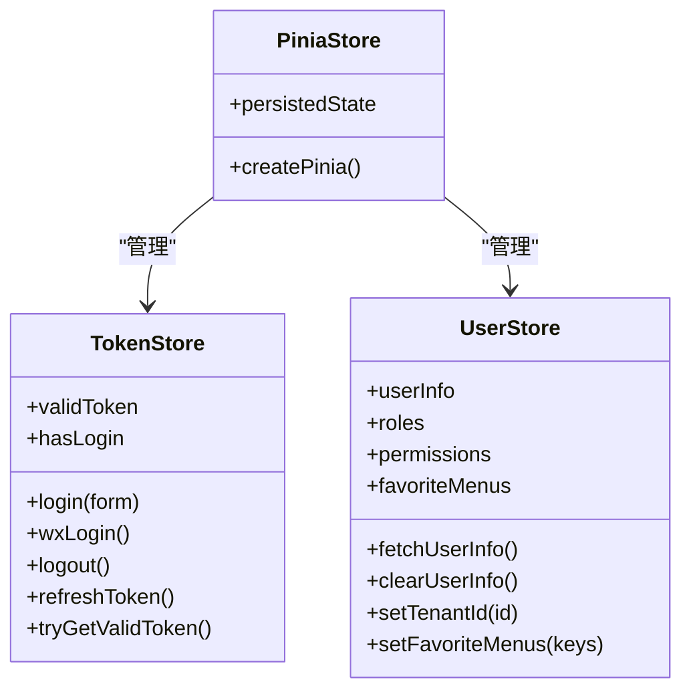
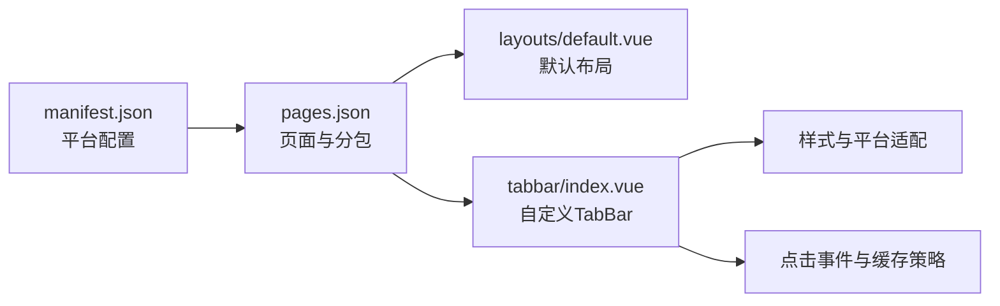
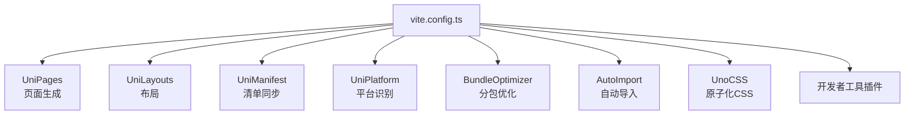
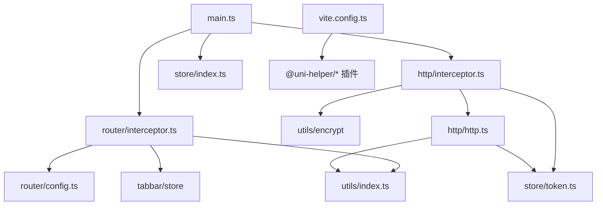

# 管理后台UniApp系统

<cite>
**本文档引用的文件**
- [main.ts](file://frontend/admin-uniapp/src/main.ts)
- [App.vue](file://frontend/admin-uniapp/src/App.vue)
- [manifest.json](file://frontend/admin-uniapp/src/manifest.json)
- [pages.json](file://frontend/admin-uniapp/src/pages.json)
- [vite.config.ts](file://frontend/admin-uniapp/vite.config.ts)
- [interceptor.ts](file://frontend/admin-uniapp/src/router/interceptor.ts)
- [config.ts](file://frontend/admin-uniapp/src/router/config.ts)
- [interceptor.ts](file://frontend/admin-uniapp/src/http/interceptor.ts)
- [http.ts](file://frontend/admin-uniapp/src/http/http.ts)
- [index.ts](file://frontend/admin-uniapp/src/store/index.ts)
- [token.ts](file://frontend/admin-uniapp/src/store/token.ts)
- [user.ts](file://frontend/admin-uniapp/src/store/user.ts)
- [index.ts](file://frontend/admin-uniapp/src/utils/index.ts)
- [default.vue](file://frontend/admin-uniapp/src/layouts/default.vue)
- [index.vue](file://frontend/admin-uniapp/src/tabbar/index.vue)
</cite>

## 目录
1. [简介](#简介)
2. [项目结构](#项目结构)
3. [核心组件](#核心组件)
4. [架构总览](#架构总览)
5. [详细组件分析](#详细组件分析)
6. [依赖关系分析](#依赖关系分析)
7. [性能考量](#性能考量)
8. [故障排查指南](#故障排查指南)
9. [结论](#结论)
10. [附录](#附录)

## 简介
本项目为基于UniApp的多端适配管理后台前端系统，采用Vue 3 + TypeScript + Pinia + UnoCSS技术栈，支持H5、微信小程序、支付宝小程序、App等多端运行。系统通过完善的路由拦截、请求拦截、状态管理与分包优化策略，实现了统一的登录鉴权、权限控制、跨平台兼容与性能优化。

## 项目结构
前端工程位于frontend/admin-uniapp目录，核心结构包括：
- 应用入口与配置：main.ts、App.vue、manifest.json、pages.json
- 构建配置：vite.config.ts
- 路由与拦截：router/interceptor.ts、router/config.ts
- HTTP请求与拦截：http/interceptor.ts、http/http.ts
- 状态管理：store/index.ts、store/token.ts、store/user.ts
- 工具函数：utils/index.ts
- 布局与TabBar：layouts/default.vue、tabbar/index.vue

**图表来源**
- [main.ts:1-20](file://frontend/admin-uniapp/src/main.ts#L1-L20)
- [App.vue:1-27](file://frontend/admin-uniapp/src/App.vue#L1-L27)
- [manifest.json:1-136](file://frontend/admin-uniapp/src/manifest.json#L1-L136)
- [pages.json:1-800](file://frontend/admin-uniapp/src/pages.json#L1-L800)
- [vite.config.ts:1-214](file://frontend/admin-uniapp/vite.config.ts#L1-L214)
- [interceptor.ts:1-146](file://frontend/admin-uniapp/src/router/interceptor.ts#L1-L146)
- [config.ts:1-46](file://frontend/admin-uniapp/src/router/config.ts#L1-L46)
- [interceptor.ts:1-105](file://frontend/admin-uniapp/src/http/interceptor.ts#L1-L105)
- [http.ts:1-224](file://frontend/admin-uniapp/src/http/http.ts#L1-L224)
- [index.ts:1-23](file://frontend/admin-uniapp/src/store/index.ts#L1-L23)
- [token.ts:1-342](file://frontend/admin-uniapp/src/store/token.ts#L1-L342)
- [user.ts:1-90](file://frontend/admin-uniapp/src/store/user.ts#L1-L90)
- [index.ts:1-244](file://frontend/admin-uniapp/src/utils/index.ts#L1-L244)
- [default.vue:1-4](file://frontend/admin-uniapp/src/layouts/default.vue#L1-L4)
- [index.vue:1-175](file://frontend/admin-uniapp/src/tabbar/index.vue#L1-L175)

**章节来源**
- [main.ts:1-20](file://frontend/admin-uniapp/src/main.ts#L1-L20)
- [App.vue:1-27](file://frontend/admin-uniapp/src/App.vue#L1-L27)
- [manifest.json:1-136](file://frontend/admin-uniapp/src/manifest.json#L1-L136)
- [pages.json:1-800](file://frontend/admin-uniapp/src/pages.json#L1-L800)
- [vite.config.ts:1-214](file://frontend/admin-uniapp/vite.config.ts#L1-L214)

## 核心组件
- 应用入口与生命周期：在main.ts中创建SSR应用实例，挂载Pinia、路由拦截器与请求拦截器；在App.vue中处理应用启动、显示与页面路由拦截。
- 路由拦截器：统一处理登录鉴权、白/黑名单策略、相对路径解析、TabBar索引同步与登录页跳转。
- 请求拦截器：自动拼接baseUrl、代理前缀、添加Authorization头、租户标识、API加密与超时控制。
- 状态管理：基于Pinia的token与user状态，支持持久化存储与双token刷新策略。
- 构建配置：集成UniHelper系列插件，实现页面生成、分包优化、组件自动导入与UnoCSS按需生成。

**章节来源**
- [main.ts:1-20](file://frontend/admin-uniapp/src/main.ts#L1-L20)
- [App.vue:1-27](file://frontend/admin-uniapp/src/App.vue#L1-L27)
- [interceptor.ts:1-146](file://frontend/admin-uniapp/src/router/interceptor.ts#L1-L146)
- [interceptor.ts:1-105](file://frontend/admin-uniapp/src/http/interceptor.ts#L1-L105)
- [index.ts:1-23](file://frontend/admin-uniapp/src/store/index.ts#L1-L23)
- [token.ts:1-342](file://frontend/admin-uniapp/src/store/token.ts#L1-L342)
- [user.ts:1-90](file://frontend/admin-uniapp/src/store/user.ts#L1-L90)
- [vite.config.ts:1-214](file://frontend/admin-uniapp/vite.config.ts#L1-L214)

## 架构总览
系统采用“入口配置 → 路由拦截 → 请求拦截 → 状态管理”的控制流，结合多端配置与分包策略，形成统一的多端适配方案。

**图表来源**
- [main.ts:1-20](file://frontend/admin-uniapp/src/main.ts#L1-L20)
- [interceptor.ts:1-146](file://frontend/admin-uniapp/src/router/interceptor.ts#L1-L146)
- [config.ts:1-46](file://frontend/admin-uniapp/src/router/config.ts#L1-L46)
- [interceptor.ts:1-105](file://frontend/admin-uniapp/src/http/interceptor.ts#L1-L105)
- [http.ts:1-224](file://frontend/admin-uniapp/src/http/http.ts#L1-L224)
- [index.ts:1-23](file://frontend/admin-uniapp/src/store/index.ts#L1-L23)

## 详细组件分析

### 应用入口与生命周期
- main.ts负责创建SSR应用实例，安装Pinia、路由拦截器与请求拦截器，并引入全局样式。
- App.vue在onShow钩子中处理直接进入页面路由的情况，调用navigateTo拦截器进行统一处理。

**图表来源**
- [App.vue:1-27](file://frontend/admin-uniapp/src/App.vue#L1-L27)
- [interceptor.ts:36-136](file://frontend/admin-uniapp/src/router/interceptor.ts#L36-L136)

**章节来源**
- [main.ts:1-20](file://frontend/admin-uniapp/src/main.ts#L1-L20)
- [App.vue:1-27](file://frontend/admin-uniapp/src/App.vue#L1-L27)

### 路由拦截器与登录策略
- 支持白名单（默认需要登录）与黑名单（默认不需要登录）两种策略。
- 自动解析相对路径、处理不存在路由、TabBar索引同步与登录页跳转。
- 在小程序端可选择复用H5登录页逻辑。

**图表来源**
- [interceptor.ts:1-146](file://frontend/admin-uniapp/src/router/interceptor.ts#L1-L146)
- [config.ts:1-46](file://frontend/admin-uniapp/src/router/config.ts#L1-L46)

**章节来源**
- [interceptor.ts:1-146](file://frontend/admin-uniapp/src/router/interceptor.ts#L1-L146)
- [config.ts:1-46](file://frontend/admin-uniapp/src/router/config.ts#L1-L46)

### 请求拦截器与HTTP封装
- 自动拼接baseUrl或代理前缀，注入Authorization头与租户标识，支持API加密。
- HTTP封装处理401无感刷新Token、业务码校验与错误提示，支持GET/POST/PUT/DELETE方法。

**图表来源**
- [interceptor.ts:1-105](file://frontend/admin-uniapp/src/http/interceptor.ts#L1-L105)
- [http.ts:1-224](file://frontend/admin-uniapp/src/http/http.ts#L1-L224)
- [token.ts:1-342](file://frontend/admin-uniapp/src/store/token.ts#L1-L342)

**章节来源**
- [interceptor.ts:1-105](file://frontend/admin-uniapp/src/http/interceptor.ts#L1-L105)
- [http.ts:1-224](file://frontend/admin-uniapp/src/http/http.ts#L1-L224)

### 状态管理设计
- Pinia Store统一管理token与user状态，支持持久化存储。
- token状态支持单/双Token模式，提供登录、登出、刷新Token与有效性判断。
- user状态管理用户信息、角色权限、常用菜单与租户信息。

**图表来源**
- [index.ts:1-23](file://frontend/admin-uniapp/src/store/index.ts#L1-L23)
- [token.ts:1-342](file://frontend/admin-uniapp/src/store/token.ts#L1-L342)
- [user.ts:1-90](file://frontend/admin-uniapp/src/store/user.ts#L1-L90)

**章节来源**
- [index.ts:1-23](file://frontend/admin-uniapp/src/store/index.ts#L1-L23)
- [token.ts:1-342](file://frontend/admin-uniapp/src/store/token.ts#L1-L342)
- [user.ts:1-90](file://frontend/admin-uniapp/src/store/user.ts#L1-L90)

### 多端适配与页面布局
- manifest.json配置H5、小程序、App等平台的差异化能力与图标资源。
- pages.json定义全局样式、EasyCom组件映射与分包结构，支持TabBar页面与自定义导航栏。
- 自定义TabBar组件支持多平台兼容（隐藏原生TabBar、中间鼓包按钮、角标显示等）。

**图表来源**
- [manifest.json:1-136](file://frontend/admin-uniapp/src/manifest.json#L1-L136)
- [pages.json:1-800](file://frontend/admin-uniapp/src/pages.json#L1-L800)
- [default.vue:1-4](file://frontend/admin-uniapp/src/layouts/default.vue#L1-L4)
- [index.vue:1-175](file://frontend/admin-uniapp/src/tabbar/index.vue#L1-L175)

**章节来源**
- [manifest.json:1-136](file://frontend/admin-uniapp/src/manifest.json#L1-L136)
- [pages.json:1-800](file://frontend/admin-uniapp/src/pages.json#L1-L800)
- [index.vue:1-175](file://frontend/admin-uniapp/src/tabbar/index.vue#L1-L175)

### 构建配置与分包优化
- vite.config.ts集成UniHelper系列插件，自动生成页面、分包优化、组件自动导入与UnoCSS。
- 支持H5开发服务器代理、打包分析、原生资源复制与平台特定配置。

**图表来源**
- [vite.config.ts:1-214](file://frontend/admin-uniapp/vite.config.ts#L1-L214)

**章节来源**
- [vite.config.ts:1-214](file://frontend/admin-uniapp/vite.config.ts#L1-L214)

## 依赖关系分析
- 入口依赖：main.ts依赖路由拦截器、请求拦截器与Pinia。
- 路由依赖：路由拦截器依赖路由配置、TabBar状态与工具函数。
- HTTP依赖：请求拦截器依赖工具函数与状态管理；HTTP封装依赖状态管理与工具函数。
- 构建依赖：Vite配置依赖多个UniHelper插件与环境变量。

**图表来源**
- [main.ts:1-20](file://frontend/admin-uniapp/src/main.ts#L1-L20)
- [interceptor.ts:1-146](file://frontend/admin-uniapp/src/router/interceptor.ts#L1-L146)
- [config.ts:1-46](file://frontend/admin-uniapp/src/router/config.ts#L1-L46)
- [interceptor.ts:1-105](file://frontend/admin-uniapp/src/http/interceptor.ts#L1-L105)
- [http.ts:1-224](file://frontend/admin-uniapp/src/http/http.ts#L1-L224)
- [index.ts:1-23](file://frontend/admin-uniapp/src/store/index.ts#L1-L23)
- [token.ts:1-342](file://frontend/admin-uniapp/src/store/token.ts#L1-L342)
- [index.ts:1-244](file://frontend/admin-uniapp/src/utils/index.ts#L1-L244)
- [vite.config.ts:1-214](file://frontend/admin-uniapp/vite.config.ts#L1-L214)

**章节来源**
- [main.ts:1-20](file://frontend/admin-uniapp/src/main.ts#L1-L20)
- [interceptor.ts:1-146](file://frontend/admin-uniapp/src/router/interceptor.ts#L1-L146)
- [interceptor.ts:1-105](file://frontend/admin-uniapp/src/http/interceptor.ts#L1-L105)
- [http.ts:1-224](file://frontend/admin-uniapp/src/http/http.ts#L1-L224)
- [index.ts:1-23](file://frontend/admin-uniapp/src/store/index.ts#L1-L23)
- [token.ts:1-342](file://frontend/admin-uniapp/src/store/token.ts#L1-L342)
- [index.ts:1-244](file://frontend/admin-uniapp/src/utils/index.ts#L1-L244)
- [vite.config.ts:1-214](file://frontend/admin-uniapp/vite.config.ts#L1-L214)

## 性能考量
- 分包优化：通过UniHelper插件与bundle-optimizer减少首屏体积，提升加载速度。
- 组件按需：UnoCSS与自动导入减少未使用代码。
- 构建优化：ESBuild压缩、按需SourceMap、代理与缓存策略。
- 状态持久化：Pinia持久化避免刷新丢失登录态。
- 请求优化：统一超时、白名单与加密减少无效请求与安全风险。

[本节为通用性能建议，无需具体文件分析]

## 故障排查指南
- 登录态异常
  - 检查路由拦截器登录策略与白/黑名单配置。
  - 确认Token状态是否过期，双Token模式下是否触发刷新。
- 请求失败
  - 核对请求拦截器的baseUrl与代理配置。
  - 查看HTTP封装对401的处理与错误提示。
- 多端差异
  - 检查manifest.json平台配置与pages.json分包结构。
  - 自定义TabBar在不同平台的隐藏逻辑与事件处理。

**章节来源**
- [interceptor.ts:1-146](file://frontend/admin-uniapp/src/router/interceptor.ts#L1-L146)
- [config.ts:1-46](file://frontend/admin-uniapp/src/router/config.ts#L1-L46)
- [interceptor.ts:1-105](file://frontend/admin-uniapp/src/http/interceptor.ts#L1-L105)
- [http.ts:1-224](file://frontend/admin-uniapp/src/http/http.ts#L1-L224)
- [manifest.json:1-136](file://frontend/admin-uniapp/src/manifest.json#L1-L136)
- [pages.json:1-800](file://frontend/admin-uniapp/src/pages.json#L1-L800)
- [index.vue:1-175](file://frontend/admin-uniapp/src/tabbar/index.vue#L1-L175)

## 结论
该管理后台UniApp系统通过完善的入口配置、路由与请求拦截、状态管理与分包优化，实现了统一的多端适配与良好的开发体验。建议在实际项目中持续关注平台差异、安全策略与性能监控，以保障系统的稳定性与扩展性。

[本节为总结性内容，无需具体文件分析]

## 附录
- 开发与构建命令：参考vite.config.ts中的平台与环境变量配置。
- 页面与分包：通过pages.json与UniPages插件生成，注意分包目录不可位于pages目录下。
- 自定义组件：利用EasyCom与组件自动导入，统一组件命名规范与样式体系。

**章节来源**
- [vite.config.ts:1-214](file://frontend/admin-uniapp/vite.config.ts#L1-L214)
- [pages.json:1-800](file://frontend/admin-uniapp/src/pages.json#L1-L800)