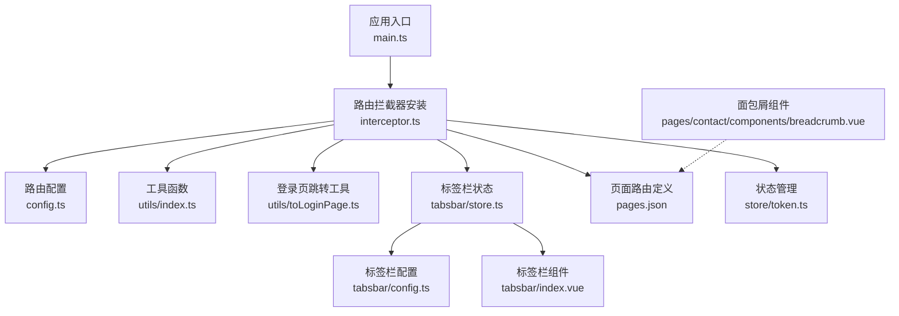
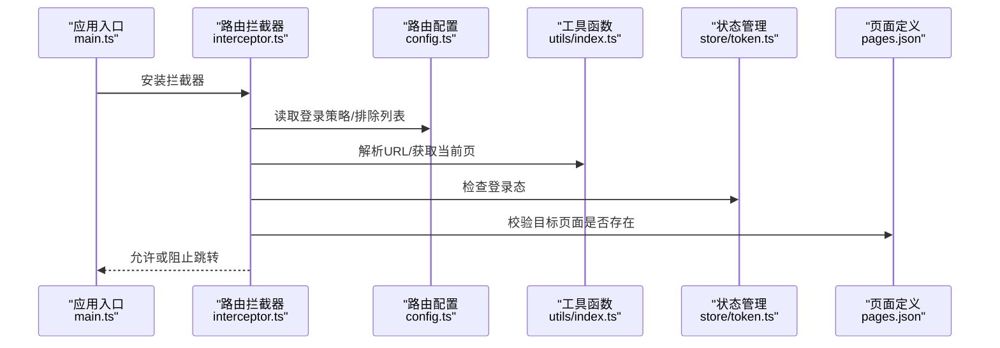
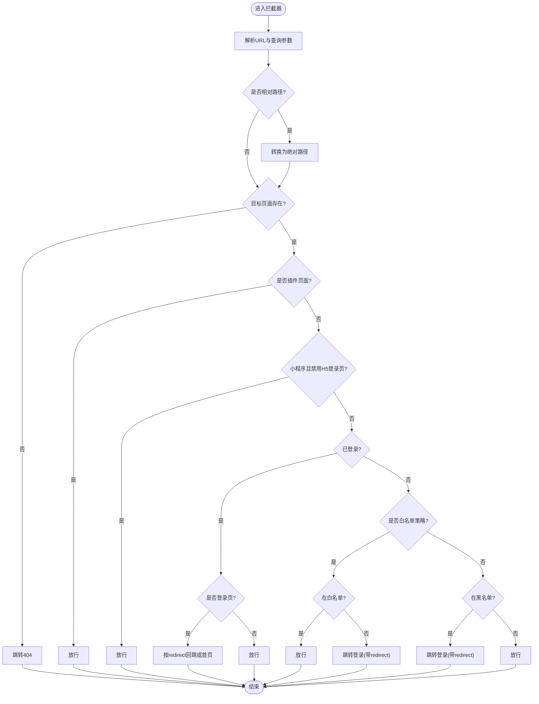
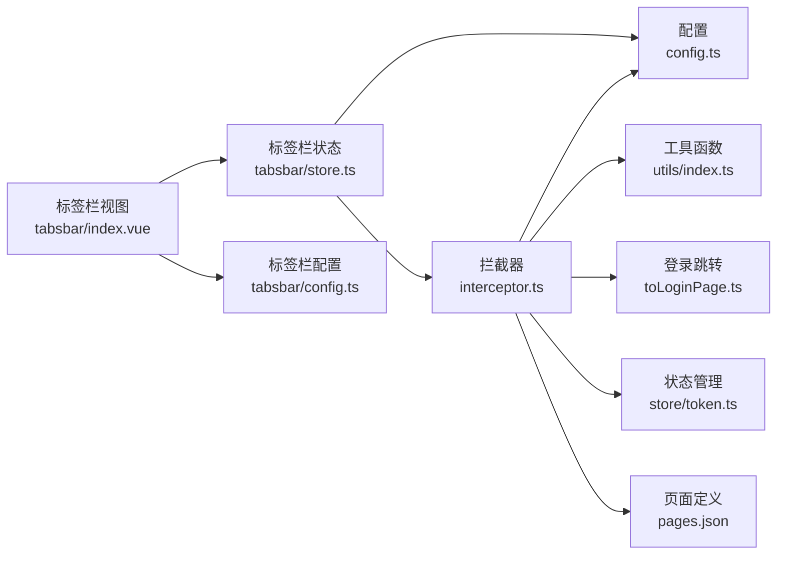

# 路由与导航系统

<cite>
**本文引用的文件**
- [frontend/admin-uniapp/src/router/config.ts](file://frontend/admin-uniapp/src/router/config.ts)
- [frontend/admin-uniapp/src/router/interceptor.ts](file://frontend/admin-uniapp/src/router/interceptor.ts)
- [frontend/admin-uniapp/src/pages.json](file://frontend/admin-uniapp/src/pages.json)
- [frontend/admin-uniapp/src/main.ts](file://frontend/admin-uniapp/src/main.ts)
- [frontend/admin-uniapp/src/utils/index.ts](file://frontend/admin-uniapp/src/utils/index.ts)
- [frontend/admin-uniapp/src/utils/toLoginPage.ts](file://frontend/admin-uniapp/src/utils/toLoginPage.ts)
- [frontend/admin-uniapp/src/tabsbar/store.ts](file://frontend/admin-uniapp/src/tabsbar/store.ts)
- [frontend/admin-uniapp/src/tabsbar/config.ts](file://frontend/admin-uniapp/src/tabsbar/config.ts)
- [frontend/admin-uniapp/src/tabsbar/index.vue](file://frontend/admin-uniapp/src/tabsbar/index.vue)
- [frontend/admin-uniapp/src/store/token.ts](file://frontend/admin-uniapp/src/store/token.ts)
- [frontend/admin-uniapp/src/store/index.ts](file://frontend/admin-uniapp/src/store/index.ts)
- [frontend/admin-uniapp/src/pages/contact/components/breadcrumb.vue](file://frontend/admin-uniapp/src/pages/contact/components/breadcrumb.vue)
</cite>

## 目录
1. [简介](#简介)
2. [项目结构](#项目结构)
3. [核心组件](#核心组件)
4. [架构总览](#架构总览)
5. [详细组件分析](#详细组件分析)
6. [依赖关系分析](#依赖关系分析)
7. [性能考量](#性能考量)
8. [故障排查指南](#故障排查指南)
9. [结论](#结论)
10. [附录](#附录)

## 简介
本文件面向 AgenticCPS 管理后台的 UniApp 路由与导航系统，系统性梳理路由配置策略、页面路由定义、动态路由生成、路由拦截器与权限验证、登录状态检查、导航守卫、路由元信息管理、面包屑导航、页面跳转与参数传递、路由缓存策略，并提供优化技巧与用户体验提升方案。文档以实际源码为依据，辅以图示帮助不同技术背景的读者理解。

## 项目结构
管理后台前端采用多包分包结构，路由与导航相关的关键文件集中在以下模块：
- 路由配置与拦截：router/config.ts、router/interceptor.ts
- 页面路由定义：pages.json
- 应用入口与拦截器挂载：main.ts
- 工具函数：utils/index.ts、utils/toLoginPage.ts
- 标签栏与导航：tabsbar/config.ts、tabsbar/store.ts、tabsbar/index.vue
- 状态管理：store/token.ts、store/index.ts
- 面包屑组件：pages/contact/components/breadcrumb.vue

图表来源
- [frontend/admin-uniapp/src/main.ts:1-20](file://frontend/admin-uniapp/src/main.ts#L1-L20)
- [frontend/admin-uniapp/src/router/interceptor.ts:1-146](file://frontend/admin-uniapp/src/router/interceptor.ts#L1-L146)
- [frontend/admin-uniapp/src/router/config.ts:1-46](file://frontend/admin-uniapp/src/router/config.ts#L1-L46)
- [frontend/admin-uniapp/src/utils/index.ts:1-244](file://frontend/admin-uniapp/src/utils/index.ts#L1-L244)
- [frontend/admin-uniapp/src/utils/toLoginPage.ts:1-49](file://frontend/admin-uniapp/src/utils/toLoginPage.ts#L1-L49)
- [frontend/admin-uniapp/src/tabsbar/store.ts:1-88](file://frontend/admin-uniapp/src/tabsbar/store.ts#L1-L88)
- [frontend/admin-uniapp/src/tabsbar/config.ts:1-170](file://frontend/admin-uniapp/src/tabsbar/config.ts#L1-L170)
- [frontend/admin-uniapp/src/tabsbar/index.vue:1-175](file://frontend/admin-uniapp/src/tabsbar/index.vue#L1-L175)
- [frontend/admin-uniapp/src/pages.json:1-1042](file://frontend/admin-uniapp/src/pages.json#L1-L1042)
- [frontend/admin-uniapp/src/store/token.ts:1-342](file://frontend/admin-uniapp/src/store/token.ts#L1-L342)
- [frontend/admin-uniapp/src/pages/contact/components/breadcrumb.vue:1-85](file://frontend/admin-uniapp/src/pages/contact/components/breadcrumb.vue#L1-L85)

章节来源
- [frontend/admin-uniapp/src/pages.json:1-1042](file://frontend/admin-uniapp/src/pages.json#L1-L1042)
- [frontend/admin-uniapp/src/router/config.ts:1-46](file://frontend/admin-uniapp/src/router/config.ts#L1-L46)
- [frontend/admin-uniapp/src/router/interceptor.ts:1-146](file://frontend/admin-uniapp/src/router/interceptor.ts#L1-L146)
- [frontend/admin-uniapp/src/main.ts:1-20](file://frontend/admin-uniapp/src/main.ts#L1-L20)

## 核心组件
- 路由配置策略与常量
  - 登录策略（白名单/黑名单）、登录页与错误页路径、排除登录路径列表、小程序登录页启用策略等集中于路由配置文件，便于全局控制。
- 路由拦截器
  - 统一处理 navigateTo/redirectTo/reLaunch/switchTab 等路由行为，实现登录态校验、白/黑名单判定、相对路径解析、插件页面处理、tabbar 自动索引、重定向参数拼装等。
- 页面路由定义
  - pages.json 管理主包与分包页面，支持 excludeLoginPath 元信息，用于声明无需登录的页面。
- 工具函数
  - getAllPages 动态聚合主包与分包页面；parseUrlToObj 解析 URL 与查询参数；getLastPage 获取当前页面；toLoginPage 统一跳转登录页并带防抖。
- 标签栏与导航
  - tabsbar/config.ts 定义标签栏策略与列表；tabsbar/store.ts 管理当前选中项与自动索引；tabsbar/index.vue 渲染自定义标签栏。
- 状态管理
  - store/token.ts 提供登录态判断、token 过期检测、刷新与登出；store/index.ts 配置 Pinia 持久化。
- 面包屑导航
  - pages/contact/components/breadcrumb.vue 提供层级导航与点击回退能力。

章节来源
- [frontend/admin-uniapp/src/router/config.ts:1-46](file://frontend/admin-uniapp/src/router/config.ts#L1-L46)
- [frontend/admin-uniapp/src/router/interceptor.ts:1-146](file://frontend/admin-uniapp/src/router/interceptor.ts#L1-L146)
- [frontend/admin-uniapp/src/pages.json:1-1042](file://frontend/admin-uniapp/src/pages.json#L1-L1042)
- [frontend/admin-uniapp/src/utils/index.ts:1-244](file://frontend/admin-uniapp/src/utils/index.ts#L1-L244)
- [frontend/admin-uniapp/src/utils/toLoginPage.ts:1-49](file://frontend/admin-uniapp/src/utils/toLoginPage.ts#L1-L49)
- [frontend/admin-uniapp/src/tabsbar/config.ts:1-170](file://frontend/admin-uniapp/src/tabsbar/config.ts#L1-L170)
- [frontend/admin-uniapp/src/tabsbar/store.ts:1-88](file://frontend/admin-uniapp/src/tabsbar/store.ts#L1-L88)
- [frontend/admin-uniapp/src/tabsbar/index.vue:1-175](file://frontend/admin-uniapp/src/tabsbar/index.vue#L1-L175)
- [frontend/admin-uniapp/src/store/token.ts:1-342](file://frontend/admin-uniapp/src/store/token.ts#L1-L342)
- [frontend/admin-uniapp/src/store/index.ts:1-23](file://frontend/admin-uniapp/src/store/index.ts#L1-L23)
- [frontend/admin-uniapp/src/pages/contact/components/breadcrumb.vue:1-85](file://frontend/admin-uniapp/src/pages/contact/components/breadcrumb.vue#L1-L85)

## 架构总览
路由与导航系统围绕“统一拦截 + 元信息 + 状态管理 + 视图组件”的模式构建，形成闭环：
- 应用启动时在入口挂载路由拦截器；
- 拦截器基于 pages.json 的元信息与配置策略进行权限判定；
- 登录态由 token store 提供，结合 toLoginPage 实现统一跳转；
- 标签栏与面包屑组件分别承担底部导航与层级导航职责。

图表来源
- [frontend/admin-uniapp/src/main.ts:1-20](file://frontend/admin-uniapp/src/main.ts#L1-L20)
- [frontend/admin-uniapp/src/router/interceptor.ts:1-146](file://frontend/admin-uniapp/src/router/interceptor.ts#L1-L146)
- [frontend/admin-uniapp/src/router/config.ts:1-46](file://frontend/admin-uniapp/src/router/config.ts#L1-L46)
- [frontend/admin-uniapp/src/utils/index.ts:1-244](file://frontend/admin-uniapp/src/utils/index.ts#L1-L244)
- [frontend/admin-uniapp/src/store/token.ts:1-342](file://frontend/admin-uniapp/src/store/token.ts#L1-L342)
- [frontend/admin-uniapp/src/pages.json:1-1042](file://frontend/admin-uniapp/src/pages.json#L1-L1042)

## 详细组件分析

### 路由配置策略与页面路由定义
- 登录策略
  - 支持“默认无需登录”和“默认需要登录（白名单）”两种策略，通过常量映射与布尔标志位控制。
  - 登录页、注册页、短信登录页、忘记密码页、404 页、仅 PC 页路径集中配置。
  - 排除登录路径列表支持静态配置与动态注入（开发/生产环境差异）。
- 页面路由定义
  - pages.json 管理主包与分包页面，支持 navigationStyle、type 等元信息。
  - 分包内可通过 excludeLoginPath 标记无需登录的页面，拦截器据此判断白/黑名单。

章节来源
- [frontend/admin-uniapp/src/router/config.ts:1-46](file://frontend/admin-uniapp/src/router/config.ts#L1-L46)
- [frontend/admin-uniapp/src/pages.json:1-1042](file://frontend/admin-uniapp/src/pages.json#L1-L1042)

### 路由拦截器实现与权限验证
- 拦截范围
  - 统一拦截 navigateTo、redirectTo、reLaunch、switchTab，确保所有页面跳转均受控。
- 关键流程
  - URL 解析与相对路径处理：支持相对路径转换为绝对路径，适配多端。
  - 页面存在性校验：若目标路由不存在，跳转至 404。
  - 小程序平台登录页策略：可按配置决定是否复用 H5 登录页。
  - 登录态优先：已登录用户直接放行（除已在登录页时按重定向参数处理）。
  - 白/黑名单策略：
    - 白名单（默认需要登录）：排除列表放行，其余重定向登录。
    - 黑名单（默认无需登录）：排除列表重定向登录，其余放行。
  - 重定向参数：将完整目标 URL 作为 redirect 参数传递给登录页，登录成功后回跳。
  - tabbar 自动索引：根据目标路径自动设置标签栏当前索引，避免索引错乱。
- 动态排除列表
  - 非开发环境仅初始化一次，避免重复扫描；开发环境每次重新获取以支持热更新。

图表来源
- [frontend/admin-uniapp/src/router/interceptor.ts:1-146](file://frontend/admin-uniapp/src/router/interceptor.ts#L1-L146)
- [frontend/admin-uniapp/src/router/config.ts:1-46](file://frontend/admin-uniapp/src/router/config.ts#L1-L46)
- [frontend/admin-uniapp/src/utils/index.ts:1-244](file://frontend/admin-uniapp/src/utils/index.ts#L1-L244)
- [frontend/admin-uniapp/src/utils/toLoginPage.ts:1-49](file://frontend/admin-uniapp/src/utils/toLoginPage.ts#L1-L49)

章节来源
- [frontend/admin-uniapp/src/router/interceptor.ts:1-146](file://frontend/admin-uniapp/src/router/interceptor.ts#L1-L146)
- [frontend/admin-uniapp/src/router/config.ts:1-46](file://frontend/admin-uniapp/src/router/config.ts#L1-L46)
- [frontend/admin-uniapp/src/utils/index.ts:1-244](file://frontend/admin-uniapp/src/utils/index.ts#L1-L244)
- [frontend/admin-uniapp/src/utils/toLoginPage.ts:1-49](file://frontend/admin-uniapp/src/utils/toLoginPage.ts#L1-L49)

### 登录状态检查与统一跳转
- 登录态判断
  - token store 提供 hasLogin 计算属性，综合登录信息与过期状态；双 token 模式下以刷新令牌过期为准。
- 登录成功回跳
  - 工具函数 redirectAfterLogin 根据是否为 tabbar 页面选择 switchTab 或 navigateBack。
- 登录页跳转
  - toLoginPage 对跳转进行防抖处理；携带 redirect 参数时强制 reLaunch，确保登录后数据刷新。

章节来源
- [frontend/admin-uniapp/src/store/token.ts:1-342](file://frontend/admin-uniapp/src/store/token.ts#L1-L342)
- [frontend/admin-uniapp/src/utils/index.ts:1-244](file://frontend/admin-uniapp/src/utils/index.ts#L1-L244)
- [frontend/admin-uniapp/src/utils/toLoginPage.ts:1-49](file://frontend/admin-uniapp/src/utils/toLoginPage.ts#L1-L49)

### 导航守卫与路由元信息管理
- 元信息
  - pages.json 的 excludeLoginPath 作为“无需登录”元信息，拦截器据此纳入白/黑名单判定。
- 守卫实现
  - 拦截器在 invoke 中完成守卫逻辑，无需额外的页面级守卫，降低复杂度。
- 动态页面聚合
  - getAllPages 支持按元信息过滤，统一生成页面清单，供拦截器与标签栏使用。

章节来源
- [frontend/admin-uniapp/src/pages.json:1-1042](file://frontend/admin-uniapp/src/pages.json#L1-L1042)
- [frontend/admin-uniapp/src/utils/index.ts:1-244](file://frontend/admin-uniapp/src/utils/index.ts#L1-L244)
- [frontend/admin-uniapp/src/router/interceptor.ts:1-146](file://frontend/admin-uniapp/src/router/interceptor.ts#L1-L146)

### 面包屑导航实现
- 组件职责
  - 提供层级展示与点击回退，支持“全部”回到顶层、点击中间层级回退到该层、进入子层级追加。
- 交互逻辑
  - 通过 emit 更新父组件绑定值，enter/back 暴露给父组件驱动数据流。
- 与页面路由的关系
  - 面包屑名称来源于页面元信息（如 navigationBarTitleText），与页面定义联动。

章节来源
- [frontend/admin-uniapp/src/pages/contact/components/breadcrumb.vue:1-85](file://frontend/admin-uniapp/src/pages/contact/components/breadcrumb.vue#L1-L85)
- [frontend/admin-uniapp/src/utils/index.ts:105-115](file://frontend/admin-uniapp/src/utils/index.ts#L105-L115)
- [frontend/admin-uniapp/src/pages.json:1-1042](file://frontend/admin-uniapp/src/pages.json#L1-L1042)

### 页面跳转处理、参数传递与路由缓存策略
- 页面跳转
  - 拦截器统一处理跳转，支持 navigateTo/redirectTo/reLaunch/switchTab。
- 参数传递
  - parseUrlToObj 统一解析查询参数，toLoginPage 将 redirect 参数拼接到登录页 URL。
- 路由缓存
  - 标签栏缓存策略由 tabsbar/config.ts 控制，支持原生与自定义标签栏缓存；tabsbar/store.ts 在切换时根据策略决定 switchTab 或 navigateTo。

章节来源
- [frontend/admin-uniapp/src/router/interceptor.ts:1-146](file://frontend/admin-uniapp/src/router/interceptor.ts#L1-L146)
- [frontend/admin-uniapp/src/utils/index.ts:53-70](file://frontend/admin-uniapp/src/utils/index.ts#L53-L70)
- [frontend/admin-uniapp/src/utils/toLoginPage.ts:1-49](file://frontend/admin-uniapp/src/utils/toLoginPage.ts#L1-L49)
- [frontend/admin-uniapp/src/tabsbar/config.ts:126-127](file://frontend/admin-uniapp/src/tabsbar/config.ts#L126-L127)
- [frontend/admin-uniapp/src/tabsbar/store.ts:36-41](file://frontend/admin-uniapp/src/tabsbar/store.ts#L36-L41)

## 依赖关系分析
- 组件耦合
  - 拦截器依赖配置、工具函数、状态管理与页面定义；标签栏依赖配置与拦截器中的排除判断；登录页跳转工具被拦截器调用。
- 外部依赖
  - uni API（navigateTo/switchTab/reLaunch 等）、@uni-helper/uni-env（平台判断）、Pinia（状态持久化）。
- 潜在循环依赖
  - 当前模块边界清晰，未发现循环依赖迹象。

图表来源
- [frontend/admin-uniapp/src/router/interceptor.ts:1-146](file://frontend/admin-uniapp/src/router/interceptor.ts#L1-L146)
- [frontend/admin-uniapp/src/router/config.ts:1-46](file://frontend/admin-uniapp/src/router/config.ts#L1-L46)
- [frontend/admin-uniapp/src/utils/index.ts:1-244](file://frontend/admin-uniapp/src/utils/index.ts#L1-L244)
- [frontend/admin-uniapp/src/utils/toLoginPage.ts:1-49](file://frontend/admin-uniapp/src/utils/toLoginPage.ts#L1-L49)
- [frontend/admin-uniapp/src/store/token.ts:1-342](file://frontend/admin-uniapp/src/store/token.ts#L1-L342)
- [frontend/admin-uniapp/src/pages.json:1-1042](file://frontend/admin-uniapp/src/pages.json#L1-L1042)
- [frontend/admin-uniapp/src/tabsbar/store.ts:1-88](file://frontend/admin-uniapp/src/tabsbar/store.ts#L1-L88)
- [frontend/admin-uniapp/src/tabsbar/config.ts:1-170](file://frontend/admin-uniapp/src/tabsbar/config.ts#L1-L170)
- [frontend/admin-uniapp/src/tabsbar/index.vue:1-175](file://frontend/admin-uniapp/src/tabsbar/index.vue#L1-L175)

章节来源
- [frontend/admin-uniapp/src/router/interceptor.ts:1-146](file://frontend/admin-uniapp/src/router/interceptor.ts#L1-L146)
- [frontend/admin-uniapp/src/tabsbar/store.ts:1-88](file://frontend/admin-uniapp/src/tabsbar/store.ts#L1-L88)
- [frontend/admin-uniapp/src/tabsbar/index.vue:1-175](file://frontend/admin-uniapp/src/tabsbar/index.vue#L1-L175)
- [frontend/admin-uniapp/src/tabsbar/config.ts:1-170](file://frontend/admin-uniapp/src/tabsbar/config.ts#L1-L170)

## 性能考量
- 拦截器初始化
  - 非开发环境仅一次性补充排除列表，减少重复扫描开销。
- 页面清单聚合
  - getAllPages 按需过滤，避免在每次拦截时重复构建。
- 登录跳转防抖
  - toLoginPage 使用防抖，避免频繁跳转造成的页面栈压力。
- 标签栏缓存
  - 合理开启缓存可减少重复渲染与数据拉取成本，但需注意切换时机与数据一致性。
- 建议
  - 对高频页面可结合缓存策略与懒加载；对长列表页面建议分页与虚拟滚动；对网络请求配合节流/去抖。

## 故障排查指南
- 登录后仍停留在登录页
  - 检查 redirect 参数是否正确拼接与传递；确认 token 是否有效且未过期。
- 路由不存在跳转 404
  - 确认 pages.json 中是否存在该页面；拦截器已对不存在路由进行保护。
- 白名单/黑名单策略误判
  - 核对 pages.json 的 excludeLoginPath 元信息与 config.ts 的策略配置；确认 judgeIsExcludePath 的结果。
- 标签栏索引异常
  - 检查 tabbarStore.setAutoCurIdx 的调用时机与路径匹配；确认 isPageTabbar 的判断逻辑。
- 小程序登录页策略
  - 若小程序端登录页不一致，检查 LOGIN_PAGE_ENABLE_IN_MP 配置。

章节来源
- [frontend/admin-uniapp/src/router/interceptor.ts:1-146](file://frontend/admin-uniapp/src/router/interceptor.ts#L1-L146)
- [frontend/admin-uniapp/src/router/config.ts:1-46](file://frontend/admin-uniapp/src/router/config.ts#L1-L46)
- [frontend/admin-uniapp/src/utils/toLoginPage.ts:1-49](file://frontend/admin-uniapp/src/utils/toLoginPage.ts#L1-L49)
- [frontend/admin-uniapp/src/tabsbar/store.ts:57-78](file://frontend/admin-uniapp/src/tabsbar/store.ts#L57-L78)
- [frontend/admin-uniapp/src/pages.json:1-1042](file://frontend/admin-uniapp/src/pages.json#L1-L1042)

## 结论
本路由与导航系统通过“统一拦截 + 元信息 + 状态管理 + 视图组件”的架构，实现了灵活的登录策略、完善的权限控制、稳定的页面跳转与良好的用户体验。建议在实际业务中持续完善页面元信息、优化拦截器性能、加强缓存与懒加载策略，并结合监控与日志进一步提升稳定性与可观测性。

## 附录
- 快速定位
  - 路由配置：[frontend/admin-uniapp/src/router/config.ts:1-46](file://frontend/admin-uniapp/src/router/config.ts#L1-L46)
  - 拦截器：[frontend/admin-uniapp/src/router/interceptor.ts:1-146](file://frontend/admin-uniapp/src/router/interceptor.ts#L1-L146)
  - 页面定义：[frontend/admin-uniapp/src/pages.json:1-1042](file://frontend/admin-uniapp/src/pages.json#L1-L1042)
  - 登录跳转：[frontend/admin-uniapp/src/utils/toLoginPage.ts:1-49](file://frontend/admin-uniapp/src/utils/toLoginPage.ts#L1-L49)
  - 标签栏：[frontend/admin-uniapp/src/tabsbar/config.ts:1-170](file://frontend/admin-uniapp/src/tabsbar/config.ts#L1-L170)、[frontend/admin-uniapp/src/tabsbar/store.ts:1-88](file://frontend/admin-uniapp/src/tabsbar/store.ts#L1-L88)、[frontend/admin-uniapp/src/tabsbar/index.vue:1-175](file://frontend/admin-uniapp/src/tabsbar/index.vue#L1-L175)
  - 状态管理：[frontend/admin-uniapp/src/store/token.ts:1-342](file://frontend/admin-uniapp/src/store/token.ts#L1-L342)、[frontend/admin-uniapp/src/store/index.ts:1-23](file://frontend/admin-uniapp/src/store/index.ts#L1-L23)
  - 面包屑：[frontend/admin-uniapp/src/pages/contact/components/breadcrumb.vue:1-85](file://frontend/admin-uniapp/src/pages/contact/components/breadcrumb.vue#L1-L85)