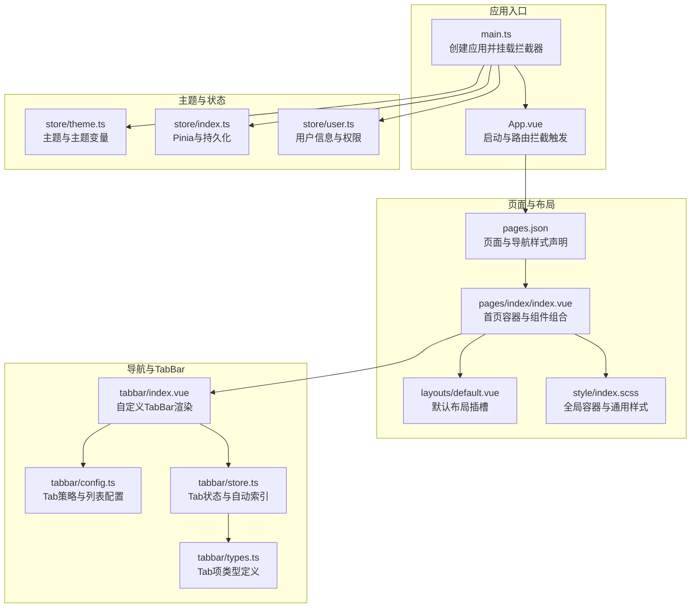
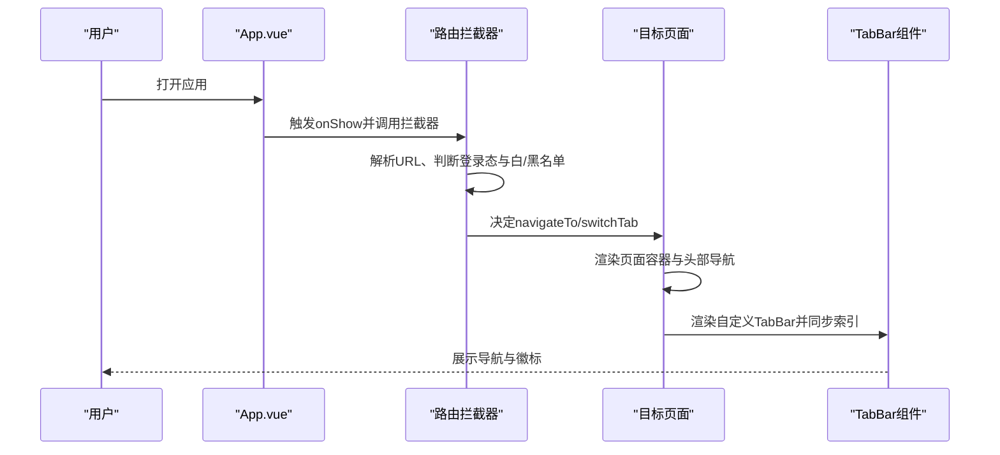
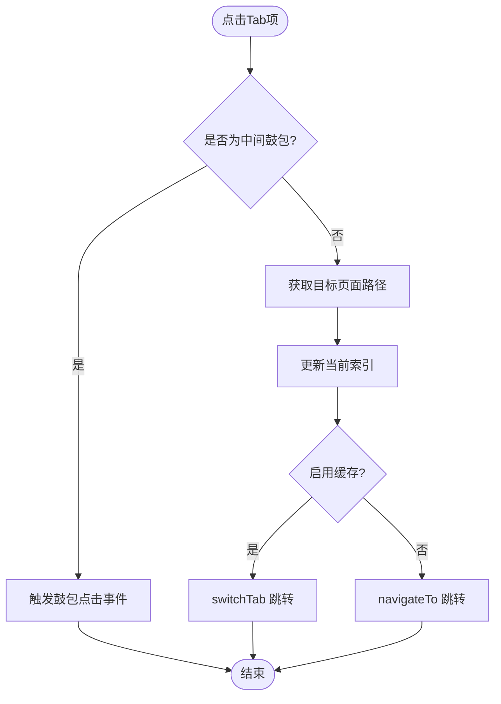
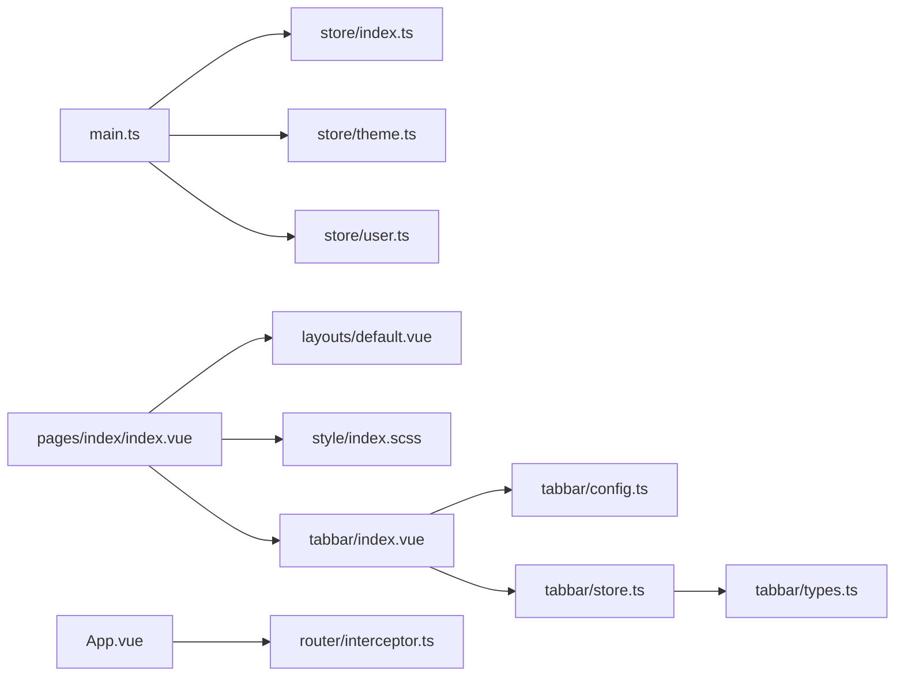

# 页面布局设计

<cite>
**本文引用的文件**
- [default.vue](file://frontend/admin-uniapp/src/layouts/default.vue)
- [index.vue](file://frontend/admin-uniapp/src/pages/index/index.vue)
- [index.scss](file://frontend/admin-uniapp/src/style/index.scss)
- [index.vue](file://frontend/admin-uniapp/src/tabbar/index.vue)
- [config.ts](file://frontend/admin-uniapp/src/tabbar/config.ts)
- [store.ts](file://frontend/admin-uniapp/src/tabbar/store.ts)
- [types.ts](file://frontend/admin-uniapp/src/tabbar/types.ts)
- [theme.ts](file://frontend/admin-uniapp/src/store/theme.ts)
- [index.ts](file://frontend/admin-uniapp/src/store/index.ts)
- [main.ts](file://frontend/admin-uniapp/src/main.ts)
- [pages.json](file://frontend/admin-uniapp/src/pages.json)
- [interceptor.ts](file://frontend/admin-uniapp/src/router/interceptor.ts)
- [uni.scss](file://frontend/admin-uniapp/src/uni.scss)
- [user.ts](file://frontend/admin-uniapp/src/store/user.ts)
</cite>

## 目录
1. [引言](#引言)
2. [项目结构](#项目结构)
3. [核心组件](#核心组件)
4. [架构总览](#架构总览)
5. [详细组件分析](#详细组件分析)
6. [依赖关系分析](#依赖关系分析)
7. [性能考量](#性能考量)
8. [故障排查指南](#故障排查指南)
9. [结论](#结论)
10. [附录](#附录)

## 引言
本文件面向AgenticCPS管理后台的UniApp页面布局设计，聚焦默认布局组件、页面容器、响应式布局、头部导航、侧边菜单替代方案、内容区域划分、布局适配策略、屏幕尺寸处理、移动端优化、布局组件复用、样式主题切换与动画效果实现，并提供最佳实践与用户体验优化建议。文档基于仓库中的实际代码进行分析，确保可落地与可验证。

## 项目结构
管理后台采用分包+多页面的组织方式，页面通过pages.json声明，导航与TabBar通过自定义组件实现，主题与全局样式通过Pinia与SCSS注入，路由拦截保障登录态与Tab索引一致性。

图表来源
- [main.ts:1-20](file://frontend/admin-uniapp/src/main.ts#L1-L20)
- [App.vue:1-27](file://frontend/admin-uniapp/src/App.vue#L1-L27)
- [pages.json:1-120](file://frontend/admin-uniapp/src/pages.json#L1-L120)
- [default.vue:1-4](file://frontend/admin-uniapp/src/layouts/default.vue#L1-L4)
- [index.vue:1-33](file://frontend/admin-uniapp/src/pages/index/index.vue#L1-L33)
- [index.scss:40-44](file://frontend/admin-uniapp/src/style/index.scss#L40-L44)
- [config.ts:13-170](file://frontend/admin-uniapp/src/tabbar/config.ts#L13-L170)
- [store.ts:1-88](file://frontend/admin-uniapp/src/tabbar/store.ts#L1-L88)
- [index.vue:88-141](file://frontend/admin-uniapp/src/tabbar/index.vue#L88-L141)
- [types.ts:1-35](file://frontend/admin-uniapp/src/tabbar/types.ts#L1-L35)
- [theme.ts:1-43](file://frontend/admin-uniapp/src/store/theme.ts#L1-L43)
- [index.ts:1-23](file://frontend/admin-uniapp/src/store/index.ts#L1-L23)
- [user.ts:1-90](file://frontend/admin-uniapp/src/store/user.ts#L1-L90)

章节来源
- [main.ts:1-20](file://frontend/admin-uniapp/src/main.ts#L1-L20)
- [pages.json:1-120](file://frontend/admin-uniapp/src/pages.json#L1-L120)

## 核心组件
- 默认布局组件：提供全局插槽，便于在各页面复用统一布局骨架。
- 页面容器：通过yd-page-container类实现最小全屏高度与背景色，作为页面主体容器。
- 自定义TabBar：支持策略化配置（原生/自定义、缓存/无缓存），统一处理图标类型、徽标与中间鼓包。
- 主题系统：Pinia主题存储，支持主题切换与主题变量动态合并。
- 路由拦截：统一处理登录态、Tab索引同步与页面跳转策略。

章节来源
- [default.vue:1-4](file://frontend/admin-uniapp/src/layouts/default.vue#L1-L4)
- [index.scss:40-44](file://frontend/admin-uniapp/src/style/index.scss#L40-L44)
- [config.ts:13-170](file://frontend/admin-uniapp/src/tabbar/config.ts#L13-L170)
- [store.ts:1-88](file://frontend/admin-uniapp/src/tabbar/store.ts#L1-L88)
- [theme.ts:1-43](file://frontend/admin-uniapp/src/store/theme.ts#L1-L43)
- [interceptor.ts:1-146](file://frontend/admin-uniapp/src/router/interceptor.ts#L1-L146)

## 架构总览
管理后台布局围绕“页面容器 + 导航策略 + TabBar + 主题系统”展开，页面通过pages.json声明导航样式，首页示例展示如何组合头部导航、用户信息、轮播与菜单区块；TabBar通过配置与状态管理实现跨端一致体验；主题系统通过Pinia与SCSS变量联动，支持主题切换与持久化。

图表来源
- [App.vue:5-21](file://frontend/admin-uniapp/src/App.vue#L5-L21)
- [interceptor.ts:36-136](file://frontend/admin-uniapp/src/router/interceptor.ts#L36-L136)
- [index.vue:1-33](file://frontend/admin-uniapp/src/pages/index/index.vue#L1-L33)
- [index.vue:88-141](file://frontend/admin-uniapp/src/tabbar/index.vue#L88-L141)

## 详细组件分析

### 默认布局组件
- 设计要点：最简插槽布局，便于在各页面复用统一骨架。
- 使用建议：在页面模板中包裹插槽，集中处理全局样式与容器。

章节来源
- [default.vue:1-4](file://frontend/admin-uniapp/src/layouts/default.vue#L1-L4)

### 页面容器与内容区域划分
- 页面容器：yd-page-container提供最小全屏高度与背景色，适合后台管理页面的视觉一致性。
- 内容区域：首页示例将页面划分为头部导航、用户信息、轮播与菜单四个主要区块，便于模块化扩展。
- 响应式与安全区：页面样式与组件结合，注意在不同平台的安全区与导航高度差异。

章节来源
- [index.scss:40-44](file://frontend/admin-uniapp/src/style/index.scss#L40-L44)
- [index.vue:1-33](file://frontend/admin-uniapp/src/pages/index/index.vue#L1-L33)

### 头部导航设计
- 导航样式：通过pages.json为页面设置navigationStyle为custom，配合wot-design-uni的navbar组件实现自定义头部。
- 适配策略：头部占位与安全区处理，确保在刘海屏与胶囊屏上的显示一致性。

章节来源
- [pages.json:22-24](file://frontend/admin-uniapp/src/pages.json#L22-L24)
- [index.vue:4-7](file://frontend/admin-uniapp/src/pages/index/index.vue#L4-L7)

### 侧边菜单布局替代方案
- 替代策略：管理后台采用自定义TabBar替代传统侧边菜单，减少层级复杂度，提升移动端交互效率。
- 配置与类型：通过config.ts定义Tab策略与列表，types.ts约束图标类型与徽标，store.ts负责索引与徽标状态管理。

章节来源
- [config.ts:13-170](file://frontend/admin-uniapp/src/tabbar/config.ts#L13-L170)
- [types.ts:14-35](file://frontend/admin-uniapp/src/tabbar/types.ts#L14-L35)
- [store.ts:1-88](file://frontend/admin-uniapp/src/tabbar/store.ts#L1-L88)

### 自定义TabBar组件
- 渲染逻辑：根据图标类型渲染UI库图标、UnoCSS类名或图片；支持徽标与中间鼓包。
- 平台适配：针对微信/支付宝等平台差异，通过条件编译隐藏原生TabBar并处理点击行为。
- 状态同步：Tab索引与页面栈保持一致，支持缓存与无缓存两种模式。

图表来源
- [index.vue:25-42](file://frontend/admin-uniapp/src/tabbar/index.vue#L25-L42)
- [config.ts:126-128](file://frontend/admin-uniapp/src/tabbar/config.ts#L126-L128)

章节来源
- [index.vue:1-175](file://frontend/admin-uniapp/src/tabbar/index.vue#L1-L175)
- [config.ts:13-170](file://frontend/admin-uniapp/src/tabbar/config.ts#L13-L170)
- [store.ts:1-88](file://frontend/admin-uniapp/src/tabbar/store.ts#L1-L88)

### 布局适配策略与屏幕尺寸处理
- 导航样式：页面级navigationStyle设为custom，避免系统导航遮挡内容。
- TabBar定位：固定定位至底部，结合安全区类名保证在不同机型下的显示稳定。
- 图标与徽标：支持多种图标类型，徽标支持数字与小红点，满足信息密度与可读性平衡。

章节来源
- [pages.json:22-24](file://frontend/admin-uniapp/src/pages.json#L22-L24)
- [index.vue:88-141](file://frontend/admin-uniapp/src/tabbar/index.vue#L88-L141)
- [config.ts:155-170](file://frontend/admin-uniapp/src/tabbar/config.ts#L155-L170)

### 移动端优化
- 平台差异：通过条件编译隐藏原生TabBar，避免重复导航；在特定平台（如支付宝）于mounted阶段隐藏。
- 点击反馈：TabBar项支持点击事件与触摸阻止，默认阻止穿透，提升交互稳定性。
- 性能考虑：TabBar缓存模式与无缓存模式通过配置切换，兼顾首屏速度与页面状态一致性。

章节来源
- [index.vue:43-72](file://frontend/admin-uniapp/src/tabbar/index.vue#L43-L72)
- [config.ts:126-128](file://frontend/admin-uniapp/src/tabbar/config.ts#L126-L128)

### 布局组件复用与样式主题切换
- 组件复用：默认布局插槽与页面容器类名统一，便于在多页面复用。
- 主题系统：通过Pinia主题存储与SCSS变量联动，支持主题切换与持久化；主题变量可动态合并。
- 样式基线：uni.scss提供常用颜色、字体、尺寸与透明度变量，便于统一风格。

章节来源
- [default.vue:1-4](file://frontend/admin-uniapp/src/layouts/default.vue#L1-L4)
- [index.scss:40-44](file://frontend/admin-uniapp/src/style/index.scss#L40-L44)
- [theme.ts:1-43](file://frontend/admin-uniapp/src/store/theme.ts#L1-L43)
- [uni.scss:16-78](file://frontend/admin-uniapp/src/uni.scss#L16-L78)

### 动画效果实现
- 图标与徽标：TabBar中图标与徽标通过类名控制，可结合过渡类名实现基础显隐与状态变化。
- 页面切换：通过navigateTo/switchTab实现页面切换，结合缓存策略减少白屏与重渲染。
- 交互反馈：TabBar点击事件与触摸阻止，提供即时反馈。

章节来源
- [index.vue:88-141](file://frontend/admin-uniapp/src/tabbar/index.vue#L88-L141)
- [config.ts:126-128](file://frontend/admin-uniapp/src/tabbar/config.ts#L126-L128)

## 依赖关系分析
- 应用入口依赖：main.ts注册Pinia、路由拦截与请求拦截，统一注入全局样式与UnoCSS。
- 页面依赖：首页示例依赖默认布局、页面容器样式、TabBar组件与头部导航。
- TabBar依赖：配置文件决定策略与列表，状态文件负责索引与徽标，类型文件约束字段。
- 主题依赖：主题存储与Pinia持久化结合，SCSS变量与Wot Design Uni主题变量协同。

图表来源
- [main.ts:1-20](file://frontend/admin-uniapp/src/main.ts#L1-L20)
- [index.ts:1-23](file://frontend/admin-uniapp/src/store/index.ts#L1-L23)
- [theme.ts:1-43](file://frontend/admin-uniapp/src/store/theme.ts#L1-L43)
- [user.ts:1-90](file://frontend/admin-uniapp/src/store/user.ts#L1-L90)
- [index.vue:1-33](file://frontend/admin-uniapp/src/pages/index/index.vue#L1-L33)
- [default.vue:1-4](file://frontend/admin-uniapp/src/layouts/default.vue#L1-L4)
- [index.scss:40-44](file://frontend/admin-uniapp/src/style/index.scss#L40-L44)
- [index.vue:88-141](file://frontend/admin-uniapp/src/tabbar/index.vue#L88-L141)
- [config.ts:13-170](file://frontend/admin-uniapp/src/tabbar/config.ts#L13-L170)
- [store.ts:1-88](file://frontend/admin-uniapp/src/tabbar/store.ts#L1-L88)
- [types.ts:1-35](file://frontend/admin-uniapp/src/tabbar/types.ts#L1-L35)
- [App.vue:1-27](file://frontend/admin-uniapp/src/App.vue#L1-L27)
- [interceptor.ts:1-146](file://frontend/admin-uniapp/src/router/interceptor.ts#L1-L146)

章节来源
- [main.ts:1-20](file://frontend/admin-uniapp/src/main.ts#L1-L20)
- [index.ts:1-23](file://frontend/admin-uniapp/src/store/index.ts#L1-L23)
- [index.vue:1-33](file://frontend/admin-uniapp/src/pages/index/index.vue#L1-L33)

## 性能考量
- 页面缓存：TabBar缓存模式与无缓存模式按需选择，平衡首屏速度与状态一致性。
- 样式体积：全局样式与UnoCSS按需引入，避免冗余样式；主题变量集中管理，减少重复计算。
- 交互成本：TabBar点击事件与触摸阻止，减少不必要的重排与回流。
- 资源加载：图标类型多样化，优先使用类名或UI库图标，降低图片资源体积。

## 故障排查指南
- TabBar重复显示：检查是否启用自定义TabBar且在非微信平台正确隐藏原生TabBar。
- 点击无效或跳转异常：确认目标页面路径与pages.json配置一致，检查缓存模式与跳转方法。
- 登录态异常：检查路由拦截器的白/黑名单配置与toLoginPage跳转逻辑。
- 主题切换失效：确认主题存储已持久化，主题变量合并逻辑未被覆盖。

章节来源
- [index.vue:43-72](file://frontend/admin-uniapp/src/tabbar/index.vue#L43-L72)
- [interceptor.ts:106-134](file://frontend/admin-uniapp/src/router/interceptor.ts#L106-L134)
- [theme.ts:39-42](file://frontend/admin-uniapp/src/store/theme.ts#L39-L42)

## 结论
该布局体系以“页面容器 + 自定义TabBar + 主题系统”为核心，结合路由拦截与平台适配，实现了在多端的一致体验与良好的可维护性。通过策略化的Tab配置、状态管理与样式基线，既能满足后台管理的高效交互，又能在移动端获得稳定的视觉与交互表现。

## 附录
- 最佳实践
  - 使用yd-page-container作为页面主体容器，统一背景与最小高度。
  - 头部导航采用custom样式并结合组件库实现，确保跨端一致性。
  - TabBar优先使用UI库图标或UnoCSS类名，减少图片资源依赖。
  - 主题切换通过Pinia与SCSS变量联动，确保持久化与即时生效。
- 用户体验优化
  - 提供TabBar点击反馈与触摸阻止，增强交互感知。
  - 合理使用徽标与中间鼓包，突出关键入口但不过度干扰信息密度。
  - 在不同平台差异点（如支付宝）进行针对性处理，避免重复导航。