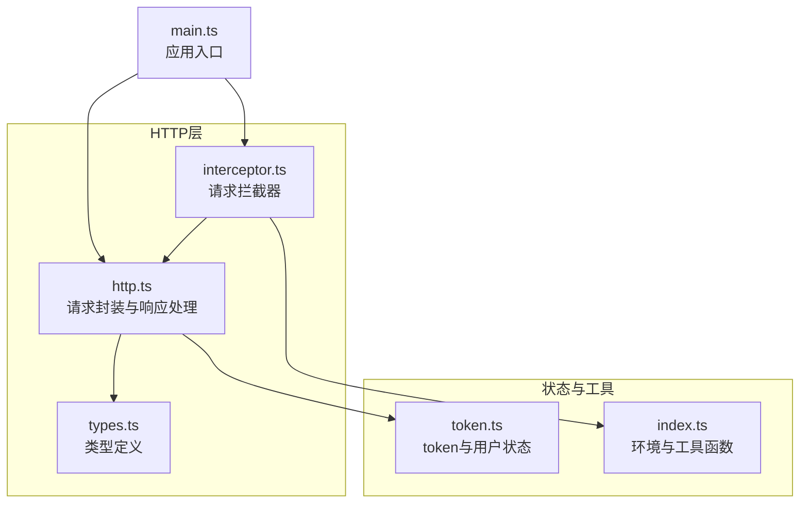
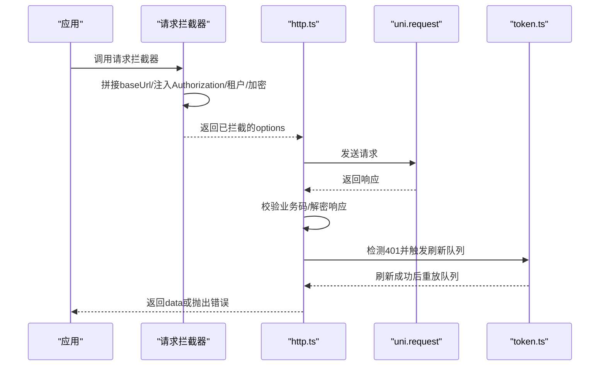
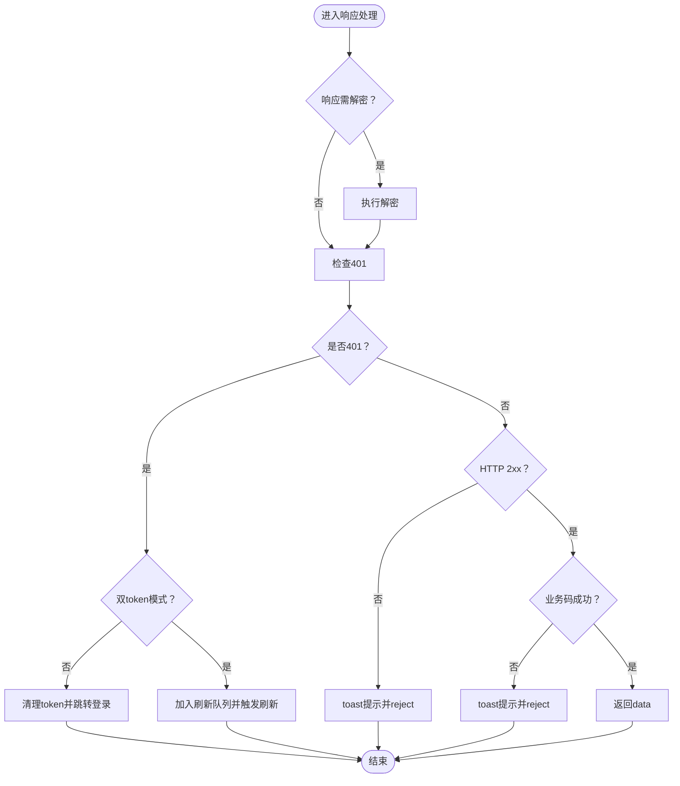
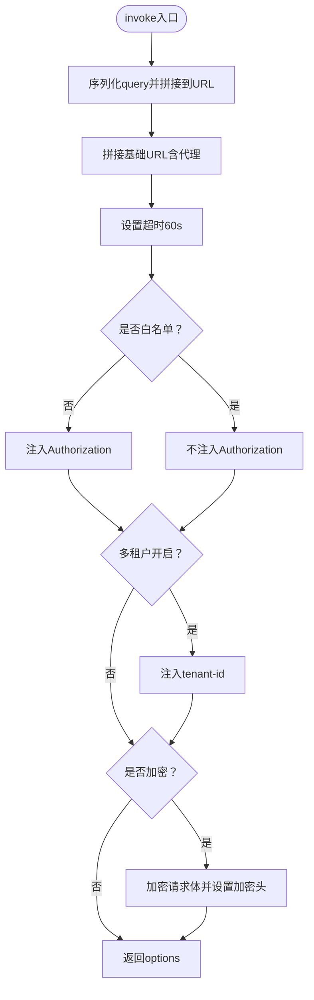
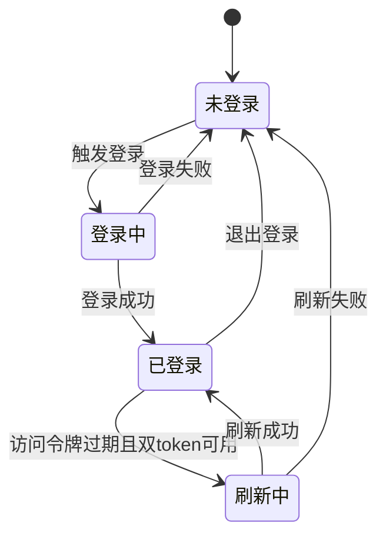
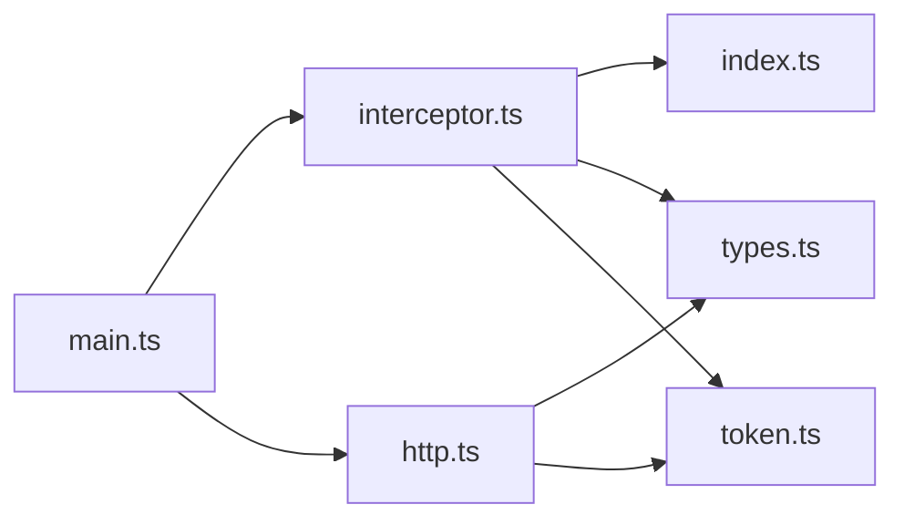

# API接口集成

<cite>
**本文引用的文件**
- [http.ts](file://frontend/admin-uniapp/src/http/http.ts)
- [interceptor.ts](file://frontend/admin-uniapp/src/http/interceptor.ts)
- [types.ts](file://frontend/admin-uniapp/src/http/types.ts)
- [token.ts](file://frontend/admin-uniapp/src/store/token.ts)
- [index.ts](file://frontend/admin-uniapp/src/utils/index.ts)
- [main.ts](file://frontend/admin-uniapp/src/main.ts)
</cite>

## 目录
1. [简介](#简介)
2. [项目结构](#项目结构)
3. [核心组件](#核心组件)
4. [架构总览](#架构总览)
5. [详细组件分析](#详细组件分析)
6. [依赖关系分析](#依赖关系分析)
7. [性能考量](#性能考量)
8. [故障排查指南](#故障排查指南)
9. [结论](#结论)
10. [附录](#附录)

## 简介
本技术文档面向AgenticCPS管理后台的前端API集成，聚焦于基于uni-app的HTTP请求封装与拦截器体系，涵盖以下主题：
- Axios风格的请求封装与方法族
- 请求拦截器与响应拦截器的职责划分
- API模块化组织与接口封装方法
- 错误处理机制与业务码校验
- 认证token管理与双token刷新策略
- 请求超时与加密开关配置
- 接口调用最佳实践、数据格式处理与缓存策略
- 开发规范、接口测试方法与性能优化建议

## 项目结构
本项目的API集成位于前端admin-uniapp工程中，关键文件分布如下：
- HTTP封装与拦截器：src/http/http.ts、src/http/interceptor.ts、src/http/types.ts
- 认证与token管理：src/store/token.ts
- 工具函数与环境配置：src/utils/index.ts
- 应用入口与插件安装：src/main.ts

图表来源
- [http.ts:1-224](file://frontend/admin-uniapp/src/http/http.ts#L1-L224)
- [interceptor.ts:1-105](file://frontend/admin-uniapp/src/http/interceptor.ts#L1-L105)
- [types.ts:1-42](file://frontend/admin-uniapp/src/http/types.ts#L1-L42)
- [token.ts:1-342](file://frontend/admin-uniapp/src/store/token.ts#L1-L342)
- [index.ts:1-244](file://frontend/admin-uniapp/src/utils/index.ts#L1-L244)
- [main.ts:1-20](file://frontend/admin-uniapp/src/main.ts#L1-L20)

章节来源
- [http.ts:1-224](file://frontend/admin-uniapp/src/http/http.ts#L1-L224)
- [interceptor.ts:1-105](file://frontend/admin-uniapp/src/http/interceptor.ts#L1-L105)
- [types.ts:1-42](file://frontend/admin-uniapp/src/http/types.ts#L1-L42)
- [token.ts:1-342](file://frontend/admin-uniapp/src/store/token.ts#L1-L342)
- [index.ts:1-244](file://frontend/admin-uniapp/src/utils/index.ts#L1-L244)
- [main.ts:1-20](file://frontend/admin-uniapp/src/main.ts#L1-L20)

## 核心组件
- 请求封装与响应处理：提供统一的http函数及GET/POST/PUT/DELETE方法族，并内置业务码校验、错误提示、解密处理、原始数据透传等能力。
- 请求拦截器：负责拼接baseUrl、注入Authorization、租户标识、查询参数序列化、API加密、超时设置等。
- 类型系统：定义通用响应格式、分页参数与结果、请求扩展字段等。
- 认证与token管理：集中管理登录、登出、刷新token、token有效期判断、白名单豁免等。
- 工具与环境：提供环境基地址获取、双token模式判断、页面跳转辅助等。

章节来源
- [http.ts:14-224](file://frontend/admin-uniapp/src/http/http.ts#L14-L224)
- [interceptor.ts:18-95](file://frontend/admin-uniapp/src/http/interceptor.ts#L18-L95)
- [types.ts:14-42](file://frontend/admin-uniapp/src/http/types.ts#L14-L42)
- [token.ts:40-342](file://frontend/admin-uniapp/src/store/token.ts#L40-L342)
- [index.ts:120-176](file://frontend/admin-uniapp/src/utils/index.ts#L120-L176)

## 架构总览
整体调用链路如下：
- 应用启动时安装请求拦截器与路由拦截器
- 业务层通过http函数或方法族发起请求
- 请求拦截器在invoke阶段完成URL拼接、头部注入、查询参数拼接、加密开关等
- uni.request发送请求，响应进入响应处理流程
- 响应处理根据HTTP状态码与业务码进行分支处理，包含token过期检测与双token刷新队列
- 成功时提取data，失败时统一toast提示并reject

图表来源
- [main.ts:3-14](file://frontend/admin-uniapp/src/main.ts#L3-L14)
- [interceptor.ts:19-95](file://frontend/admin-uniapp/src/http/interceptor.ts#L19-L95)
- [http.ts:14-152](file://frontend/admin-uniapp/src/http/http.ts#L14-L152)
- [token.ts:228-250](file://frontend/admin-uniapp/src/store/token.ts#L228-L250)

## 详细组件分析

### 请求封装与响应处理（http.ts）
- 统一Promise封装：对外暴露http函数与方法族（get/post/put/delete），支持query、header、hideErrorToast、original、isEncrypt等扩展字段。
- 响应处理：
  - 解密响应：若响应头标记加密且数据为字符串，则进行解密。
  - 401判定：同时考虑HTTP状态码401与业务码401。
  - 双token无感刷新：在存在refreshToken时，将重试任务加入队列，刷新完成后批量重放。
  - 业务码校验：非成功码时统一toast提示并reject；成功码时返回data。
  - 原始数据透传：当original为true时，直接返回原始响应数据。
  - 网络错误：fail回调统一提示网络错误。
- 方法族映射：通过http.get/http.post等挂载到http对象，提供类axios风格调用。

图表来源
- [http.ts:24-152](file://frontend/admin-uniapp/src/http/http.ts#L24-L152)

章节来源
- [http.ts:14-224](file://frontend/admin-uniapp/src/http/http.ts#L14-L224)

### 请求拦截器（interceptor.ts）
- 基准地址与代理：根据环境变量自动拼接代理前缀或基础URL；非H5平台始终拼接基础URL。
- 查询参数：将options.query序列化并拼接到URL中。
- 超时设置：统一设置timeout为60秒。
- Authorization注入：优先从options.header.isToken判断是否注入；白名单接口自动豁免。
- 租户标识：当开启多租户时，从用户状态读取tenant-id注入到请求头。
- API加密：当isEncrypt为true时，对请求体进行加密并设置加密头。
- 拦截范围：安装request与uploadFile拦截器。

图表来源
- [interceptor.ts:21-95](file://frontend/admin-uniapp/src/http/interceptor.ts#L21-L95)

章节来源
- [interceptor.ts:18-95](file://frontend/admin-uniapp/src/http/interceptor.ts#L18-L95)

### 类型系统（types.ts）
- IResponse：统一响应格式，兼容message与msg字段，支持泛型data。
- CustomRequestOptions：在UniApp.RequestOptions基础上扩展query、hideErrorToast、original、isEncrypt等字段。
- PageParam/PageResult：分页参数与结果模型。
- LoadMoreState：加载状态枚举类型导出。

章节来源
- [types.ts:14-42](file://frontend/admin-uniapp/src/http/types.ts#L14-L42)

### 认证与token管理（token.ts）
- 状态初始化：根据是否双token模式初始化不同字段结构。
- 登录流程：支持多种登录方式，登录成功后拉取用户信息与字典缓存。
- token有效性：提供过期判断与有效token计算，双token模式下以刷新token过期为准。
- 刷新策略：双token模式下在访问令牌过期时尝试刷新；刷新成功后重放队列中的请求。
- 退出登录：清理本地存储与用户状态，清空字典缓存。
- 持久化：Pinia持久化配置，保证刷新后token不丢失。

图表来源
- [token.ts:104-161](file://frontend/admin-uniapp/src/store/token.ts#L104-L161)
- [token.ts:228-250](file://frontend/admin-uniapp/src/store/token.ts#L228-L250)
- [token.ts:200-222](file://frontend/admin-uniapp/src/store/token.ts#L200-L222)

章节来源
- [token.ts:40-342](file://frontend/admin-uniapp/src/store/token.ts#L40-L342)

### 工具与环境（index.ts）
- 环境基地址：根据运行环境与VITE_SERVER_BASEURL动态选择基础URL，支持微信小程序多版本分支。
- 双token模式：通过VITE_AUTH_MODE判断是否启用双token。
- 页面与重定向：提供获取当前页面、解析URL、登录后跳转、增强返回等工具方法。

章节来源
- [index.ts:120-176](file://frontend/admin-uniapp/src/utils/index.ts#L120-L176)
- [index.ts:1-244](file://frontend/admin-uniapp/src/utils/index.ts#L1-L244)

### 应用入口（main.ts）
- 安装拦截器：在应用启动时安装请求拦截器与路由拦截器。
- 插件注册：将store、路由拦截器、请求拦截器注册到应用实例。

章节来源
- [main.ts:1-20](file://frontend/admin-uniapp/src/main.ts#L1-L20)

## 依赖关系分析
- 入口依赖：main.ts依赖interceptor.ts与token.ts，确保拦截器与token状态在应用启动时就绪。
- 拦截器依赖：interceptor.ts依赖token.ts（读取有效token）、utils/index.ts（获取基础URL与多租户开关）、types.ts（扩展请求选项）。
- 响应处理依赖：http.ts依赖token.ts（401时触发刷新队列）、utils/index.ts（双token模式判断）、types.ts（IResponse）。
- 类型依赖：types.ts被http.ts与interceptor.ts共同引用，形成稳定的契约层。

图表来源
- [main.ts:3-14](file://frontend/admin-uniapp/src/main.ts#L3-L14)
- [interceptor.ts:18-95](file://frontend/admin-uniapp/src/http/interceptor.ts#L18-L95)
- [http.ts:14-224](file://frontend/admin-uniapp/src/http/http.ts#L14-L224)
- [token.ts:40-342](file://frontend/admin-uniapp/src/store/token.ts#L40-L342)
- [index.ts:120-176](file://frontend/admin-uniapp/src/utils/index.ts#L120-L176)
- [types.ts:14-42](file://frontend/admin-uniapp/src/http/types.ts#L14-L42)

章节来源
- [main.ts:1-20](file://frontend/admin-uniapp/src/main.ts#L1-L20)
- [interceptor.ts:18-95](file://frontend/admin-uniapp/src/http/interceptor.ts#L18-L95)
- [http.ts:14-224](file://frontend/admin-uniapp/src/http/http.ts#L14-L224)
- [token.ts:40-342](file://frontend/admin-uniapp/src/store/token.ts#L40-L342)
- [index.ts:120-176](file://frontend/admin-uniapp/src/utils/index.ts#L120-L176)
- [types.ts:14-42](file://frontend/admin-uniapp/src/http/types.ts#L14-L42)

## 性能考量
- 请求超时：统一设置60秒超时，平衡稳定性与用户体验。
- 双token无感刷新：通过队列重放减少重复请求与UI抖动。
- 解密与加密：仅在isEncrypt为true时进行，避免不必要的CPU开销。
- 头部注入与序列化：拦截器阶段完成，避免在业务层重复处理。
- 缓存策略：token过期时间通过本地存储记录，减少频繁刷新；字典缓存按需加载。

## 故障排查指南
- 401未登录/过期
  - 现象：出现登录过期提示并跳转登录页。
  - 排查：确认是否启用双token模式；检查refreshToken是否存在；查看刷新队列是否被正确重放。
  - 参考：[http.ts:40-112](file://frontend/admin-uniapp/src/http/http.ts#L40-L112)、[token.ts:228-250](file://frontend/admin-uniapp/src/store/token.ts#L228-L250)
- 业务码错误
  - 现象：toast提示业务错误，请求被reject。
  - 排查：核对后端返回code与消息；确认hideErrorToast是否为true。
  - 参考：[http.ts:120-140](file://frontend/admin-uniapp/src/http/http.ts#L120-L140)
- 网络错误
  - 现象：toast提示网络错误。
  - 排查：检查网络连通性、代理配置、超时设置。
  - 参考：[http.ts:142-149](file://frontend/admin-uniapp/src/http/http.ts#L142-L149)
- 加密相关问题
  - 现象：请求加密失败或响应解密异常。
  - 排查：确认isEncrypt开关；检查加密头是否正确设置；验证加密算法与密钥。
  - 参考：[interceptor.ts:78-91](file://frontend/admin-uniapp/src/http/interceptor.ts#L78-L91)、[http.ts:26-37](file://frontend/admin-uniapp/src/http/http.ts#L26-L37)
- 租户标识缺失
  - 现象：多租户场景下请求未带tenant-id。
  - 排查：确认VITE_APP_TENANT_ENABLE与用户状态tenantId。
  - 参考：[interceptor.ts:70-76](file://frontend/admin-uniapp/src/http/interceptor.ts#L70-L76)

章节来源
- [http.ts:24-152](file://frontend/admin-uniapp/src/http/http.ts#L24-L152)
- [interceptor.ts:70-91](file://frontend/admin-uniapp/src/http/interceptor.ts#L70-L91)
- [token.ts:228-250](file://frontend/admin-uniapp/src/store/token.ts#L228-L250)

## 结论
本方案通过统一的HTTP封装与拦截器体系，实现了：
- 易用的请求方法族与类型安全
- 完整的认证与双token刷新机制
- 可配置的加密与解密能力
- 统一的错误处理与提示策略
- 良好的可维护性与扩展性

建议在后续迭代中持续完善：
- 增加请求重试策略（指数退避）
- 引入请求去重与并发控制
- 补充接口缓存策略（如ETag/Last-Modified）
- 完善接口测试用例与Mock方案

## 附录

### API模块化组织与接口封装方法
- 模块化：按功能域拆分API文件，统一导出方法族，便于复用与测试。
- 封装方法：在http.ts中提供get/post/put/delete等方法族，统一处理query、header、加密等通用逻辑。
- 类型约束：通过CustomRequestOptions与IResponse约束请求与响应格式，提升开发体验。

章节来源
- [http.ts:162-224](file://frontend/admin-uniapp/src/http/http.ts#L162-L224)
- [types.ts:4-25](file://frontend/admin-uniapp/src/http/types.ts#L4-L25)

### 认证token管理与双token刷新策略
- 双token模式：在访问令牌过期时，使用refreshToken静默刷新，避免用户感知。
- 刷新队列：将等待中的请求加入队列，在刷新成功后统一重放。
- 退出登录：清理本地存储与用户状态，确保安全。

章节来源
- [token.ts:228-250](file://frontend/admin-uniapp/src/store/token.ts#L228-L250)
- [http.ts:52-112](file://frontend/admin-uniapp/src/http/http.ts#L52-L112)

### 请求超时与加密配置
- 超时：统一设置60秒，兼顾稳定性与响应速度。
- 加密：通过isEncrypt开关控制，加密头自动注入，响应侧自动解密。

章节来源
- [interceptor.ts:50](file://frontend/admin-uniapp/src/http/interceptor.ts#L50)
- [interceptor.ts:78-91](file://frontend/admin-uniapp/src/http/interceptor.ts#L78-L91)
- [http.ts:26-37](file://frontend/admin-uniapp/src/http/http.ts#L26-L37)

### 接口调用最佳实践
- 使用http.get/http.post等方法族，避免直接调用底层uni.request。
- 对需要鉴权的接口，确保未在白名单内；对敏感接口开启isEncrypt。
- 对分页接口使用PageParam/PageResult模型，统一处理list与total。
- 对业务错误统一处理，避免在业务层重复判断。

章节来源
- [http.ts:162-224](file://frontend/admin-uniapp/src/http/http.ts#L162-L224)
- [types.ts:27-38](file://frontend/admin-uniapp/src/http/types.ts#L27-L38)

### 数据格式处理与缓存策略
- 响应格式：统一IResponse，兼容message/msg字段，便于前端展示。
- 缓存：token过期时间本地存储；字典缓存按需加载；可引入ETag实现接口缓存。

章节来源
- [types.ts:14-25](file://frontend/admin-uniapp/src/http/types.ts#L14-L25)
- [token.ts:50-64](file://frontend/admin-uniapp/src/store/token.ts#L50-L64)

### 开发规范与测试方法
- 开发规范：统一使用http方法族；严格区分业务码与HTTP状态码；错误提示统一通过hideErrorToast控制。
- 测试方法：编写单元测试覆盖拦截器、响应处理、token刷新等关键路径；使用Mock数据验证边界条件。

章节来源
- [http.ts:120-140](file://frontend/admin-uniapp/src/http/http.ts#L120-L140)
- [interceptor.ts:18-95](file://frontend/admin-uniapp/src/http/interceptor.ts#L18-L95)