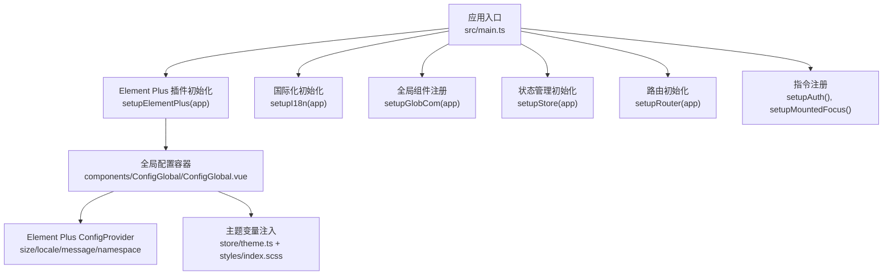
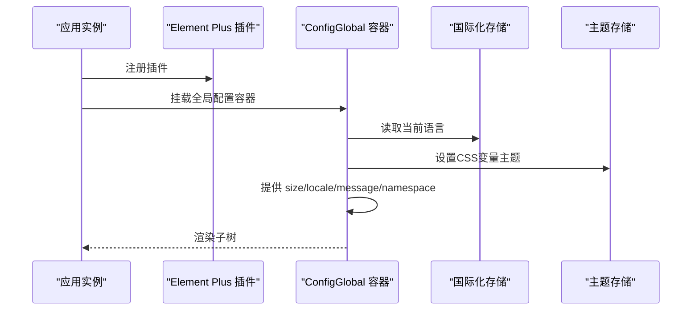
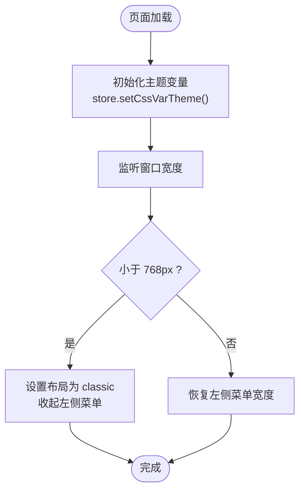
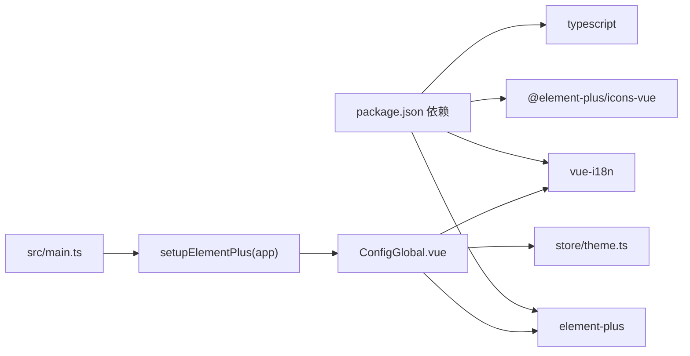

# Element Plus组件集成

<cite>
**本文档引用的文件**
- [package.json](file://frontend/admin-vue3/package.json)
- [main.ts](file://frontend/admin-vue3/src/main.ts)
- [ConfigGlobal.vue](file://frontend/admin-vue3/src/components/ConfigGlobal/src/ConfigGlobal.vue)
- [index.ts](file://frontend/admin-vue3/src/components/ConfigGlobal/index.ts)
- [configGlobal.d.ts](file://frontend/admin-vue3/src/types/configGlobal.d.ts)
- [index.ts](file://frontend/admin-vue3/src/plugins/formCreate/index.ts)
- [theme.ts](file://frontend/admin-vue3/src/store/theme.ts)
- [index.scss](file://frontend/admin-vue3/src/styles/index.scss)
- [uno.config.ts](file://frontend/admin-vue3/src/uno.config.ts)
- [vite.config.ts](file://frontend/admin-vue3/src/vite.config.ts)
</cite>

## 目录
1. [简介](#简介)
2. [项目结构](#项目结构)
3. [核心组件](#核心组件)
4. [架构总览](#架构总览)
5. [详细组件分析](#详细组件分析)
6. [依赖关系分析](#依赖关系分析)
7. [性能考虑](#性能考虑)
8. [故障排除指南](#故障排除指南)
9. [结论](#结论)
10. [附录](#附录)

## 简介
本文件面向AgenticCPS管理后台的Element Plus组件集成，提供从插件配置、主题定制、国际化设置到常用组件使用、表单与表格定制、弹窗与按钮扩展、消息提示配置的完整技术指南。同时涵盖组件样式定制、主题切换、响应式适配的最佳实践与性能优化建议，并给出常见问题的排查思路。

## 项目结构
前端采用Vue 3 + Vite + TypeScript + UnoCSS + Element Plus的现代化架构。Element Plus通过插件方式在应用入口集中初始化，配合全局配置组件统一注入主题、尺寸、国际化等上下文。

图表来源
- [main.ts:51-81](file://frontend/admin-vue3/src/main.ts#L51-L81)
- [ConfigGlobal.vue:53-62](file://frontend/admin-vue3/src/components/ConfigGlobal/src/ConfigGlobal.vue#L53-L62)

章节来源
- [main.ts:1-86](file://frontend/admin-vue3/src/main.ts#L1-L86)
- [package.json:27-83](file://frontend/admin-vue3/package.json#L27-L83)

## 核心组件
- 全局配置容器：通过ConfigGlobal组件向Element Plus提供统一的命名空间、语言环境、消息提示上限、组件尺寸等配置，确保全站风格一致。
- 主题系统：结合store中的主题状态与CSS变量，动态切换主题色与布局模式。
- 国际化：基于vue-i18n，将当前语言传递给Element Plus的消息与组件展示。
- 表单设计器：集成form-create与@form-create/element-ui，按需引入Element Plus组件以支持可视化表单生成。

章节来源
- [ConfigGlobal.vue:1-62](file://frontend/admin-vue3/src/components/ConfigGlobal/src/ConfigGlobal.vue#L1-L62)
- [index.ts:1-3](file://frontend/admin-vue3/src/components/ConfigGlobal/index.ts#L1-L3)
- [configGlobal.d.ts:1-4](file://frontend/admin-vue3/src/types/configGlobal.d.ts#L1-L4)
- [index.ts:1-66](file://frontend/admin-vue3/src/plugins/formCreate/index.ts#L1-L66)

## 架构总览
Element Plus在应用启动阶段完成初始化，随后通过ConfigGlobal作为根级配置容器，向下提供size、locale、message、namespace等配置。主题与国际化分别由store与i18n模块提供数据源，最终渲染到具体组件上。

图表来源
- [main.ts:51-81](file://frontend/admin-vue3/src/main.ts#L51-L81)
- [ConfigGlobal.vue:47-61](file://frontend/admin-vue3/src/components/ConfigGlobal/src/ConfigGlobal.vue#L47-L61)

## 详细组件分析

### Element Plus插件配置
- 在应用入口集中调用setupElementPlus(app)，确保Element Plus在应用启动时完成注册。
- 通过ConfigGlobal组件包裹整个应用树，向Element Plus提供统一的命名空间、语言环境、消息提示上限与组件尺寸。
- 支持按需调整全局size，以满足不同场景下的交互密度需求。

章节来源
- [main.ts:51-81](file://frontend/admin-vue3/src/main.ts#L51-L81)
- [ConfigGlobal.vue:53-62](file://frontend/admin-vue3/src/components/ConfigGlobal/src/ConfigGlobal.vue#L53-L62)
- [configGlobal.d.ts:1-4](file://frontend/admin-vue3/src/types/configGlobal.d.ts#L1-L4)

### 主题定制与切换
- 主题变量通过store中的主题状态与CSS变量联动，实现动态切换。
- 在ConfigGlobal挂载时触发setCssVarTheme，确保主题变量在页面加载即生效。
- 响应式适配：监听窗口宽度，在移动端自动切换经典布局并收起菜单，保证在小屏设备上的可用性。

图表来源
- [ConfigGlobal.vue:21-45](file://frontend/admin-vue3/src/components/ConfigGlobal/src/ConfigGlobal.vue#L21-L45)

章节来源
- [ConfigGlobal.vue:21-45](file://frontend/admin-vue3/src/components/ConfigGlobal/src/ConfigGlobal.vue#L21-L45)

### 国际化设置
- 使用vue-i18n初始化多语言，并将当前语言传递给Element Plus的ConfigProvider，使消息提示、占位符等文本随语言切换。
- ConfigGlobal计算当前语言，确保全局组件继承该语言配置。

章节来源
- [ConfigGlobal.vue:47-61](file://frontend/admin-vue3/src/components/ConfigGlobal/src/ConfigGlobal.vue#L47-L61)

### 常用组件使用方法
- 尺寸控制：通过ConfigGlobal的size属性统一设置组件尺寸（default/small/large），避免在各处重复声明。
- 命名空间：ConfigProvider提供namespace配置，便于与现有样式体系解耦。
- 消息提示上限：通过message.max限制同时显示的消息数量，防止密集操作导致界面拥挤。

章节来源
- [ConfigGlobal.vue:53-62](file://frontend/admin-vue3/src/components/ConfigGlobal/src/ConfigGlobal.vue#L53-L62)

### 表单组件封装与表单设计器
- form-create集成：通过@form-create/designer与@form-create/element-ui实现可视化表单设计，按需引入Element Plus组件以支持拖拽生成。
- 自动导入：使用auto-import减少手动引入的样板代码，提升开发效率。
- 可视化表单：结合ElForm、ElFormItem等Element Plus表单组件，实现复杂业务表单的快速搭建。

章节来源
- [index.ts:1-66](file://frontend/admin-vue3/src/plugins/formCreate/index.ts#L1-L66)

### 表格组件定制
- 基于ElTable与ElTableColumn构建数据表格，结合ConfigGlobal提供的size与locale，确保在不同语言与尺寸下的一致体验。
- 建议在表格外层封装通用的分页、排序、筛选逻辑，减少重复代码。

（本节为概念性说明，不直接分析具体文件）

### 弹窗组件实现
- 使用ElDialog实现弹窗容器，结合ElForm进行表单类弹窗的数据收集与校验。
- 建议统一弹窗的尺寸策略与关闭行为，保证用户体验一致性。

（本节为概念性说明，不直接分析具体文件）

### 按钮组件扩展
- 基于ElButton扩展业务按钮，如批量操作、危险操作等，统一颜色与禁用状态处理。
- 结合指令系统实现权限控制与焦点管理。

（本节为概念性说明，不直接分析具体文件）

### 消息提示配置
- 通过ConfigProvider的message配置设置全局消息提示上限，避免短时间内大量消息堆积。
- 建议在业务关键路径增加消息反馈，提升用户感知。

章节来源
- [ConfigGlobal.vue:57-58](file://frontend/admin-vue3/src/components/ConfigGlobal/src/ConfigGlobal.vue#L57-L58)

### 组件样式定制与响应式适配
- UnoCSS与Element Plus的命名空间协同工作，避免样式冲突。
- 通过CSS变量与store联动，实现主题色与布局的动态切换。
- 响应式：在ConfigGlobal中根据窗口宽度自动调整菜单宽度与布局模式。

章节来源
- [ConfigGlobal.vue:26-45](file://frontend/admin-vue3/src/components/ConfigGlobal/src/ConfigGlobal.vue#L26-L45)
- [index.scss:1-200](file://frontend/admin-vue3/src/styles/index.scss#L1-L200)
- [uno.config.ts:1-200](file://frontend/admin-vue3/src/uno.config.ts#L1-L200)

## 依赖关系分析
Element Plus在项目中的依赖与集成关系如下：

图表来源
- [package.json:27-83](file://frontend/admin-vue3/package.json#L27-L83)
- [main.ts:51-81](file://frontend/admin-vue3/src/main.ts#L51-L81)
- [ConfigGlobal.vue:53-62](file://frontend/admin-vue3/src/components/ConfigGlobal/src/ConfigGlobal.vue#L53-L62)

章节来源
- [package.json:27-83](file://frontend/admin-vue3/package.json#L27-L83)
- [main.ts:51-81](file://frontend/admin-vue3/src/main.ts#L51-L81)

## 性能考虑
- 按需引入：仅引入实际使用的Element Plus组件，减少打包体积。
- 插件化初始化：在应用入口集中初始化Element Plus，避免重复注册。
- 主题变量缓存：通过CSS变量与store联动，减少重复计算与DOM更新。
- 消息提示上限：合理设置message.max，避免大量消息同时渲染造成性能抖动。
- 响应式监听：对窗口宽度的监听应节流或防抖，避免频繁重排。

（本节提供一般性指导，不直接分析具体文件）

## 故障排除指南
- Element Plus组件不生效
  - 检查是否在main.ts中正确调用setupElementPlus(app)。
  - 确认ConfigGlobal已包裹应用根节点且未被其他容器覆盖。
- 国际化文本未切换
  - 检查locale store中的currentLocale是否正确更新。
  - 确认ConfigGlobal的currentLocale计算值指向正确的语言对象。
- 主题切换无效
  - 检查store中的主题状态是否更新。
  - 确认CSS变量是否正确设置，且未被局部样式覆盖。
- 消息提示过多导致界面拥挤
  - 调整ConfigProvider的message.max配置。
  - 在业务层控制消息触发频率与类型。

章节来源
- [main.ts:51-81](file://frontend/admin-vue3/src/main.ts#L51-L81)
- [ConfigGlobal.vue:47-61](file://frontend/admin-vue3/src/components/ConfigGlobal/src/ConfigGlobal.vue#L47-L61)

## 结论
通过在应用入口集中初始化Element Plus，并以ConfigGlobal作为全局配置容器，AgenticCPS实现了主题、国际化、尺寸与消息提示的统一管理。结合store的主题系统与响应式适配逻辑，能够灵活应对多端场景。配合form-create的可视化表单能力，进一步提升了业务开发效率。建议在后续迭代中持续优化按需引入策略与性能监控，确保在复杂业务场景下的稳定运行。

## 附录
- 开发环境与构建：项目使用Vite与TypeScript，UnoCSS提供原子化样式能力。
- 插件生态：除Element Plus外，还集成了多种第三方插件，建议遵循统一的初始化顺序与配置规范。

章节来源
- [vite.config.ts:1-200](file://frontend/admin-vue3/src/vite.config.ts#L1-L200)
- [uno.config.ts:1-200](file://frontend/admin-vue3/src/uno.config.ts#L1-L200)