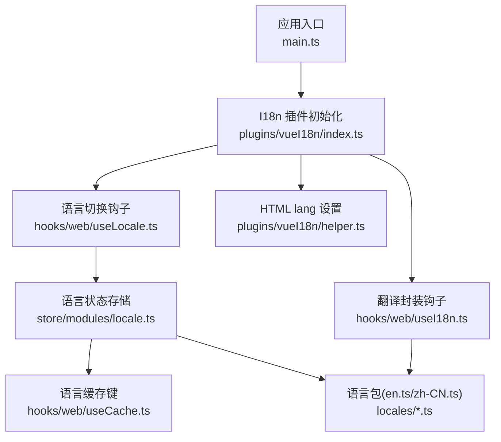
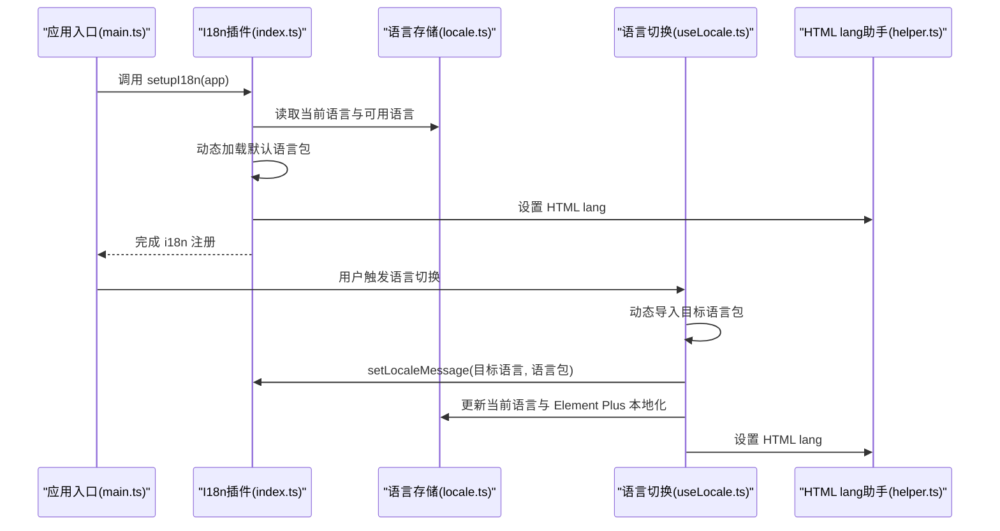
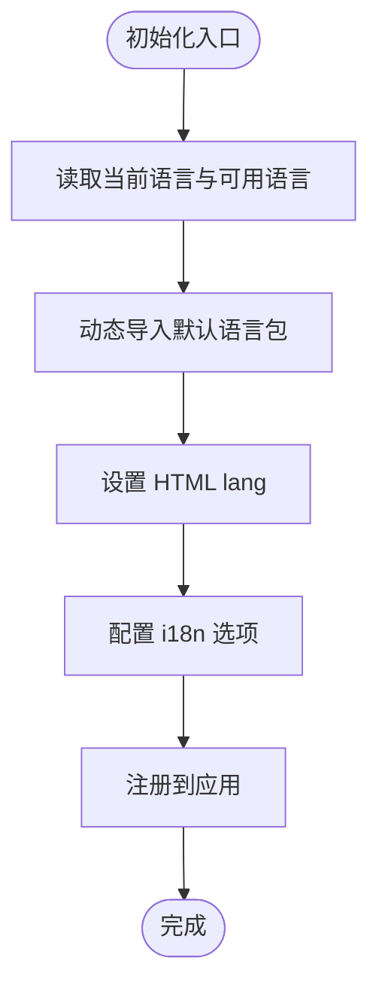
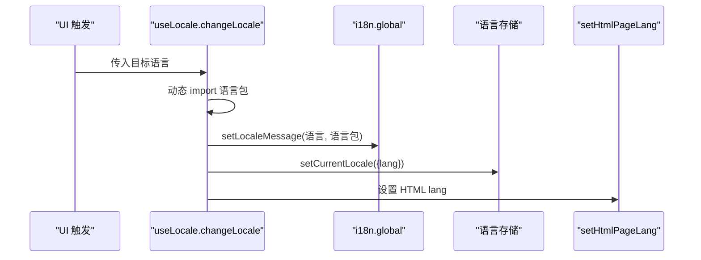
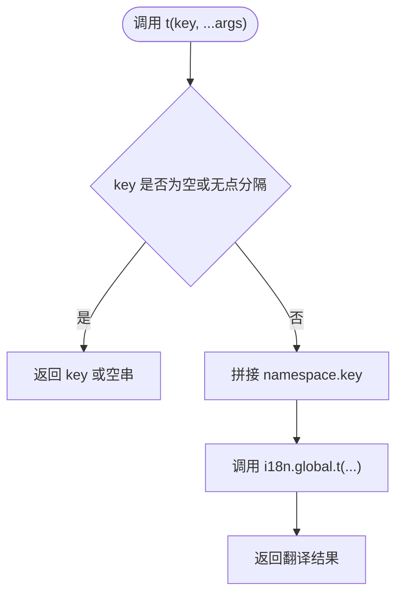
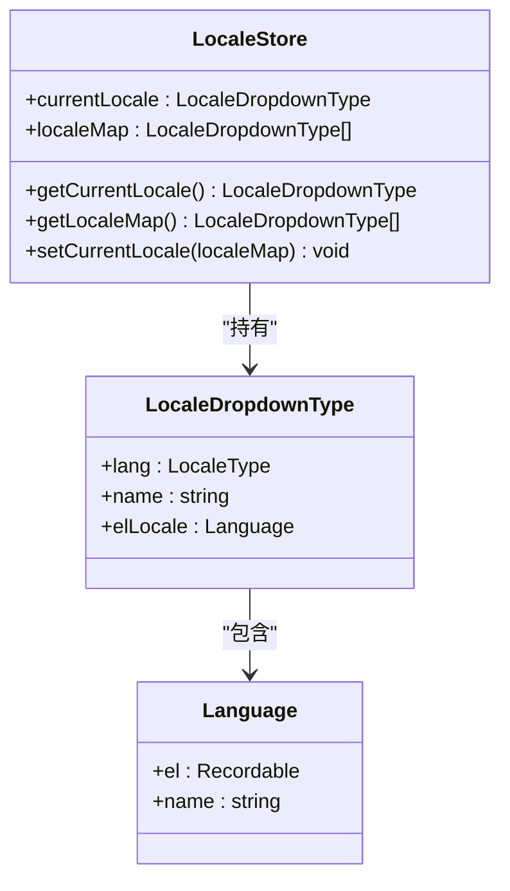

# 国际化与本地化

<cite>
**本文档引用的文件**
- [main.ts](file://frontend/admin-vue3/src/main.ts)
- [index.ts](file://frontend/admin-vue3/src/plugins/vueI18n/index.ts)
- [helper.ts](file://frontend/admin-vue3/src/plugins/vueI18n/helper.ts)
- [useLocale.ts](file://frontend/admin-vue3/src/hooks/web/useLocale.ts)
- [useI18n.ts](file://frontend/admin-vue3/src/hooks/web/useI18n.ts)
- [locale.ts](file://frontend/admin-vue3/src/store/modules/locale.ts)
- [localeDropdown.d.ts](file://frontend/admin-vue3/src/types/localeDropdown.d.ts)
- [en.ts](file://frontend/admin-vue3/src/locales/en.ts)
- [zh-CN.ts](file://frontend/admin-vue3/src/locales/zh-CN.ts)
- [formatter.ts](file://frontend/admin-vue3/src/utils/formatter.ts)
- [index.ts](file://frontend/admin-vue3/src/utils/index.ts)
- [useCache.ts](file://frontend/admin-vue3/src/hooks/web/useCache.ts)
</cite>

## 目录
1. [引言](#引言)
2. [项目结构](#项目结构)
3. [核心组件](#核心组件)
4. [架构总览](#架构总览)
5. [详细组件分析](#详细组件分析)
6. [依赖关系分析](#依赖关系分析)
7. [性能考量](#性能考量)
8. [故障排查指南](#故障排查指南)
9. [结论](#结论)
10. [附录](#附录)

## 引言
本文件面向 AgenticCPS 管理后台的国际化与本地化实现，聚焦于前端 Vue3 管理端（admin-vue3）。内容涵盖 vue-i18n 配置、语言包组织、动态语言切换流程、多语言资源管理与翻译键值设计、语言文件结构、日期时间/数字/货币格式化处理、最佳实践与维护策略、语言检测机制、开发规范与性能优化建议等，帮助开发者快速理解并扩展多语言能力。

## 项目结构
管理端国际化相关的关键目录与文件如下：
- 插件层：vue-i18n 初始化与 HTML lang 设置
- 钩子层：语言切换与翻译封装
- 存储层：语言状态与 Element Plus 本地化映射
- 资源层：语言包（JSON/TS 结构）
- 工具层：格式化（金额、数字、日期）



**图表来源**
- [main.ts:1-86](file://frontend/admin-vue3/src/main.ts#L1-L86)
- [index.ts:1-43](file://frontend/admin-vue3/src/plugins/vueI18n/index.ts#L1-L43)
- [useLocale.ts:1-35](file://frontend/admin-vue3/src/hooks/web/useLocale.ts#L1-L35)
- [useI18n.ts:1-53](file://frontend/admin-vue3/src/hooks/web/useI18n.ts#L1-L53)
- [helper.ts:1-4](file://frontend/admin-vue3/src/plugins/vueI18n/helper.ts#L1-L4)
- [locale.ts:1-60](file://frontend/admin-vue3/src/store/modules/locale.ts#L1-L60)
- [useCache.ts:1-41](file://frontend/admin-vue3/src/hooks/web/useCache.ts#L1-L41)
- [en.ts:1-462](file://frontend/admin-vue3/src/locales/en.ts#L1-L462)
- [zh-CN.ts:1-458](file://frontend/admin-vue3/src/locales/zh-CN.ts#L1-L458)

**章节来源**
- [main.ts:1-86](file://frontend/admin-vue3/src/main.ts#L1-L86)
- [index.ts:1-43](file://frontend/admin-vue3/src/plugins/vueI18n/index.ts#L1-L43)

## 核心组件
- I18n 插件初始化：负责创建 i18n 实例、加载默认语言包、设置可用语言、HTML lang 属性同步。
- 语言切换钩子：按需动态加载目标语言包并更新 i18n 与本地状态。
- 翻译封装钩子：提供带命名空间的 t 函数，简化调用。
- 语言状态存储：维护当前语言与 Element Plus 本地化映射，并持久化到缓存。
- 语言包：按模块划分的键值对集合，便于维护与扩展。
- 格式化工具：提供金额、数字、日期等格式化函数，配合国际化展示。

**章节来源**
- [index.ts:1-43](file://frontend/admin-vue3/src/plugins/vueI18n/index.ts#L1-L43)
- [useLocale.ts:1-35](file://frontend/admin-vue3/src/hooks/web/useLocale.ts#L1-L35)
- [useI18n.ts:1-53](file://frontend/admin-vue3/src/hooks/web/useI18n.ts#L1-L53)
- [locale.ts:1-60](file://frontend/admin-vue3/src/store/modules/locale.ts#L1-L60)
- [en.ts:1-462](file://frontend/admin-vue3/src/locales/en.ts#L1-L462)
- [zh-CN.ts:1-458](file://frontend/admin-vue3/src/locales/zh-CN.ts#L1-L458)
- [formatter.ts:1-7](file://frontend/admin-vue3/src/utils/formatter.ts#L1-L7)
- [index.ts:340-452](file://frontend/admin-vue3/src/utils/index.ts#L340-L452)

## 架构总览
整体流程：应用启动时初始化 i18n，从缓存读取语言，加载对应语言包，设置 HTML lang；用户切换语言时，动态导入目标语言包并更新状态与 DOM lang。



**图表来源**
- [main.ts:51-81](file://frontend/admin-vue3/src/main.ts#L51-L81)
- [index.ts:38-42](file://frontend/admin-vue3/src/plugins/vueI18n/index.ts#L38-L42)
- [index.ts:9-36](file://frontend/admin-vue3/src/plugins/vueI18n/index.ts#L9-L36)
- [locale.ts:47-54](file://frontend/admin-vue3/src/store/modules/locale.ts#L47-L54)
- [useLocale.ts:19-35](file://frontend/admin-vue3/src/hooks/web/useLocale.ts#L19-L35)
- [helper.ts:1-4](file://frontend/admin-vue3/src/plugins/vueI18n/helper.ts#L1-L4)

## 详细组件分析

### I18n 插件初始化（plugins/vueI18n/index.ts）
- 功能要点
  - 从语言存储读取当前语言与可用语言列表
  - 动态导入默认语言包并作为初始 messages
  - 设置 HTML lang 属性
  - 配置 i18n 选项（非兼容模式、回退语言、可用语言、静默警告等）
- 关键行为
  - 使用异步 import 加载语言包，支持运行时按需加载
  - 将当前语言写入语言存储，供后续切换使用



**图表来源**
- [index.ts:9-36](file://frontend/admin-vue3/src/plugins/vueI18n/index.ts#L9-L36)
- [index.ts:38-42](file://frontend/admin-vue3/src/plugins/vueI18n/index.ts#L38-L42)
- [helper.ts:1-4](file://frontend/admin-vue3/src/plugins/vueI18n/helper.ts#L1-L4)

**章节来源**
- [index.ts:1-43](file://frontend/admin-vue3/src/plugins/vueI18n/index.ts#L1-L43)

### 语言切换钩子（hooks/web/useLocale.ts）
- 功能要点
  - 接收目标语言标识
  - 动态导入对应语言包并 setLocaleMessage
  - 更新语言存储与 HTML lang
- 特性
  - 支持 Vue 3 Composition API 模式下的语言切换
  - 通过 i18n.global.locale 或其响应式包装进行语言设置



**图表来源**
- [useLocale.ts:19-35](file://frontend/admin-vue3/src/hooks/web/useLocale.ts#L19-L35)
- [helper.ts:1-4](file://frontend/admin-vue3/src/plugins/vueI18n/helper.ts#L1-L4)
- [locale.ts:47-54](file://frontend/admin-vue3/src/store/modules/locale.ts#L47-L54)

**章节来源**
- [useLocale.ts:1-35](file://frontend/admin-vue3/src/hooks/web/useLocale.ts#L1-L35)

### 翻译封装钩子（hooks/web/useI18n.ts）
- 功能要点
  - 提供带命名空间的 t 函数
  - 自动拼接 namespace.key，避免重复键名
  - 在无 i18n 实例时返回占位逻辑
- 使用建议
  - 为不同模块（如系统、业务）提供独立命名空间，提升可维护性



**图表来源**
- [useI18n.ts:14-51](file://frontend/admin-vue3/src/hooks/web/useI18n.ts#L14-L51)

**章节来源**
- [useI18n.ts:1-53](file://frontend/admin-vue3/src/hooks/web/useI18n.ts#L1-L53)

### 语言状态存储（store/modules/locale.ts）
- 功能要点
  - 维护当前语言与 Element Plus 本地化映射
  - 从缓存读取语言，默认 zh-CN
  - 提供 setter 更新语言并持久化
- 与 Element Plus 的集成
  - 通过映射表将语言标识映射到 Element Plus 本地化对象



**图表来源**
- [locale.ts:14-54](file://frontend/admin-vue3/src/store/modules/locale.ts#L14-L54)
- [localeDropdown.d.ts:1-11](file://frontend/admin-vue3/src/types/localeDropdown.d.ts#L1-L11)

**章节来源**
- [locale.ts:1-60](file://frontend/admin-vue3/src/store/modules/locale.ts#L1-L60)
- [localeDropdown.d.ts:1-11](file://frontend/admin-vue3/src/types/localeDropdown.d.ts#L1-L11)

### 语言包组织与结构（locales/*.ts）
- 文件结构
  - 每个语言一个 TS 文件，导出根对象
  - 键名采用层级结构（如 common、sys、form 等），便于分类与查找
- 示例
  - 英文包与中文包均包含 common、sys、form、table、action 等模块键
- 设计建议
  - 保持键名一致性，避免重复与歧义
  - 模块化拆分，便于多人协作与维护

**章节来源**
- [en.ts:1-462](file://frontend/admin-vue3/src/locales/en.ts#L1-L462)
- [zh-CN.ts:1-458](file://frontend/admin-vue3/src/locales/zh-CN.ts#L1-L458)

### HTML lang 设置（plugins/vueI18n/helper.ts）
- 功能要点
  - 在切换语言时同步设置 <html lang="...">，利于 SEO 与辅助技术识别

**章节来源**
- [helper.ts:1-4](file://frontend/admin-vue3/src/plugins/vueI18n/helper.ts#L1-L4)

### 应用入口集成（main.ts）
- 功能要点
  - 启动阶段调用 setupI18n(app)，确保 i18n 在其他插件之前就绪
  - 顺序：i18n → store → 全局组件 → Element Plus → 路由 → 指令 → 挂载

**章节来源**
- [main.ts:51-81](file://frontend/admin-vue3/src/main.ts#L51-L81)

### 日期时间/数字/货币格式化
- 日期时间
  - 提供通用格式化函数，支持自定义格式字符串
- 数字/金额
  - 提供分转元、元转分、保留小数位等工具函数
  - 表格列格式化示例：提供金额列格式化回调
- 建议
  - 在国际化场景下结合 Intl.NumberFormat 与日期格式化 API，实现更贴近用户的本地化展示
  - 对于复杂格式需求，可在组件内按语言环境动态选择格式化策略

**章节来源**
- [index.ts:75-105](file://frontend/admin-vue3/src/utils/index.ts#L75-L105)
- [index.ts:340-452](file://frontend/admin-vue3/src/utils/index.ts#L340-L452)
- [formatter.ts:1-7](file://frontend/admin-vue3/src/utils/formatter.ts#L1-L7)

## 依赖关系分析
- 组件耦合
  - 插件层与存储层松耦合，通过接口暴露当前语言与可用语言
  - 钩子层仅依赖插件层提供的 i18n 实例与存储层的状态
- 外部依赖
  - vue-i18n：核心国际化库
  - Element Plus：提供 UI 组件本地化
  - web-storage-cache：本地缓存语言偏好

```mermaid
graph LR
I18n["vue-i18n"] <- --> Plugin["I18n插件"]
ElementPlus["Element Plus"] <- --> Store["语言存储"]
WSCache["web-storage-cache"] <- --> Store
Plugin --> HookLocale["useLocale"]
Plugin --> HookI18n["useI18n"]
HookLocale --> Store
HookI18n --> Plugin
```

**图表来源**
- [index.ts:1-43](file://frontend/admin-vue3/src/plugins/vueI18n/index.ts#L1-L43)
- [locale.ts:1-60](file://frontend/admin-vue3/src/store/modules/locale.ts#L1-L60)
- [useCache.ts:1-41](file://frontend/admin-vue3/src/hooks/web/useCache.ts#L1-L41)

**章节来源**
- [index.ts:1-43](file://frontend/admin-vue3/src/plugins/vueI18n/index.ts#L1-L43)
- [locale.ts:1-60](file://frontend/admin-vue3/src/store/modules/locale.ts#L1-L60)
- [useCache.ts:1-41](file://frontend/admin-vue3/src/hooks/web/useCache.ts#L1-L41)

## 性能考量
- 按需加载语言包：通过动态 import，仅加载当前语言与用户切换的目标语言，减少首屏体积
- 静默警告：关闭缺失键与回退警告，降低控制台噪音
- 同步与回退：启用 sync 并设置回退语言，提升切换稳定性
- 缓存语言偏好：使用本地缓存避免每次刷新重设语言

**章节来源**
- [index.ts:23-35](file://frontend/admin-vue3/src/plugins/vueI18n/index.ts#L23-L35)
- [useCache.ts:9-23](file://frontend/admin-vue3/src/hooks/web/useCache.ts#L9-L23)

## 故障排查指南
- 语言切换无效
  - 检查动态导入路径是否正确，语言包文件是否存在
  - 确认 setLocaleMessage 是否执行以及 i18n.global.locale 是否更新
- HTML lang 未更新
  - 确认 setHtmlPageLang 被调用且 DOM 中 <html> 标签存在
- Element Plus 本地化未生效
  - 检查语言存储中的 elLocale 映射是否正确
- 键名找不到翻译
  - 确认命名空间拼接逻辑与语言包键名一致
  - 检查语言包是否包含对应键

**章节来源**
- [useLocale.ts:19-35](file://frontend/admin-vue3/src/hooks/web/useLocale.ts#L19-L35)
- [helper.ts:1-4](file://frontend/admin-vue3/src/plugins/vueI18n/helper.ts#L1-L4)
- [locale.ts:47-54](file://frontend/admin-vue3/src/store/modules/locale.ts#L47-L54)
- [useI18n.ts:14-51](file://frontend/admin-vue3/src/hooks/web/useI18n.ts#L14-L51)

## 结论
本方案基于 vue-i18n 实现了灵活的多语言支持：通过插件初始化、动态语言包加载、状态存储与缓存、HTML lang 同步，构建了可扩展、可维护的国际化体系。结合模块化的语言包与翻译封装钩子，开发者可以高效地扩展新语言与新模块。建议在后续迭代中引入更完善的语言检测机制与更丰富的格式化策略，持续提升用户体验与可维护性。

## 附录
- 开发规范
  - 语言包键名采用小驼峰或层级命名，避免重复
  - 按模块拆分语言包，统一命名空间
  - 使用 useI18n 提供的命名空间参数，避免键冲突
- 翻译质量保证
  - 建立翻译评审流程，确保术语一致
  - 使用占位符与复数规则，避免硬编码
- 性能优化
  - 优先使用动态 import，按需加载语言包
  - 合理设置回退语言与可用语言列表
  - 对高频格式化逻辑进行缓存或节流