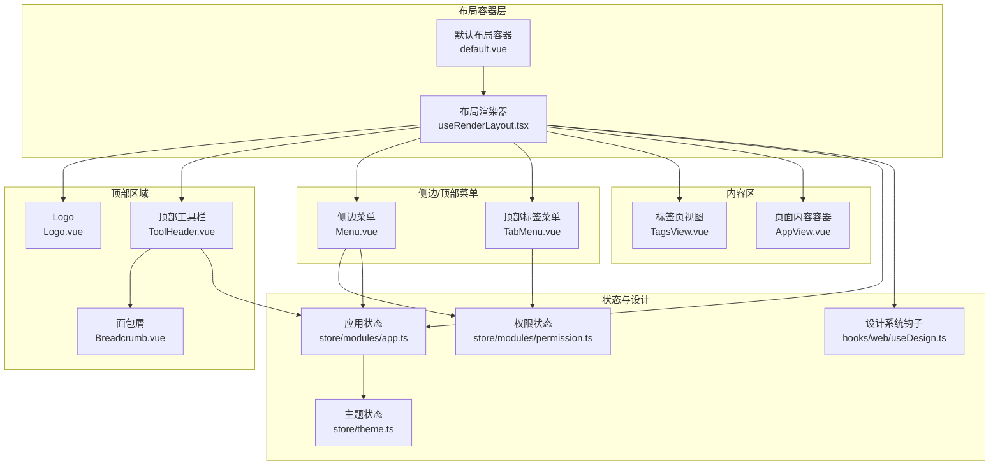
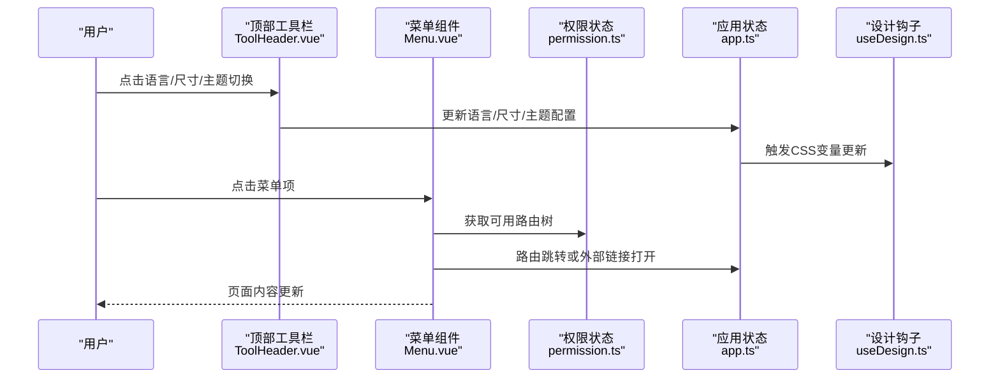
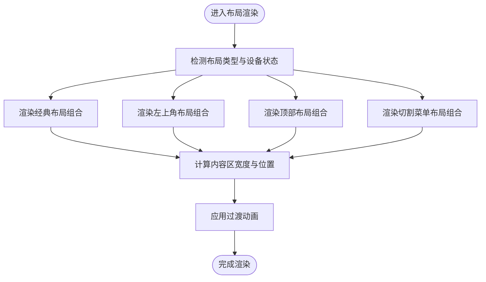
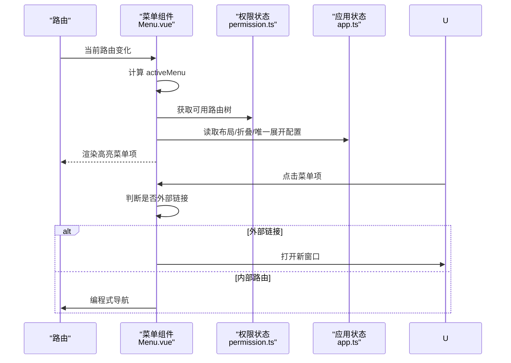
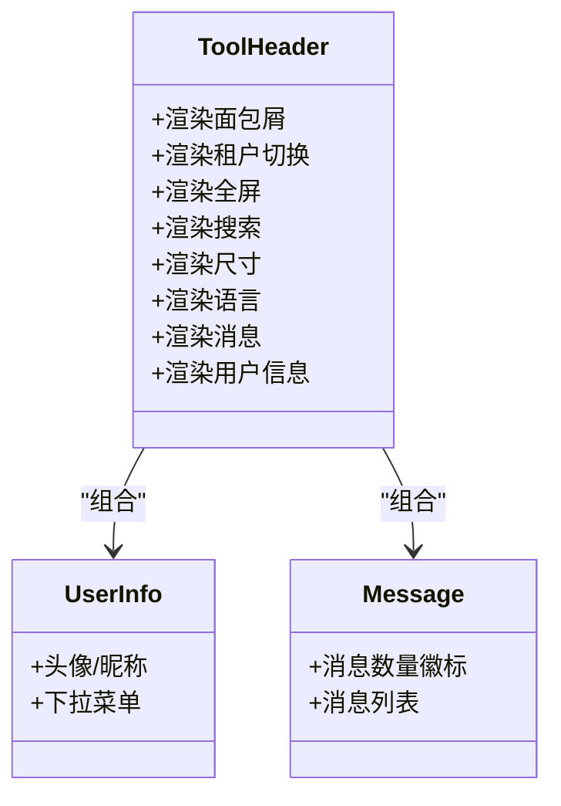
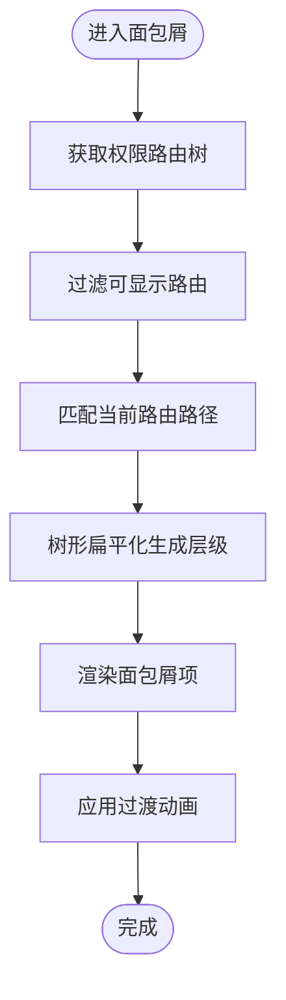
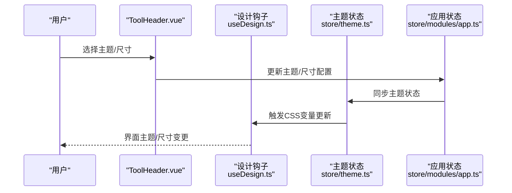
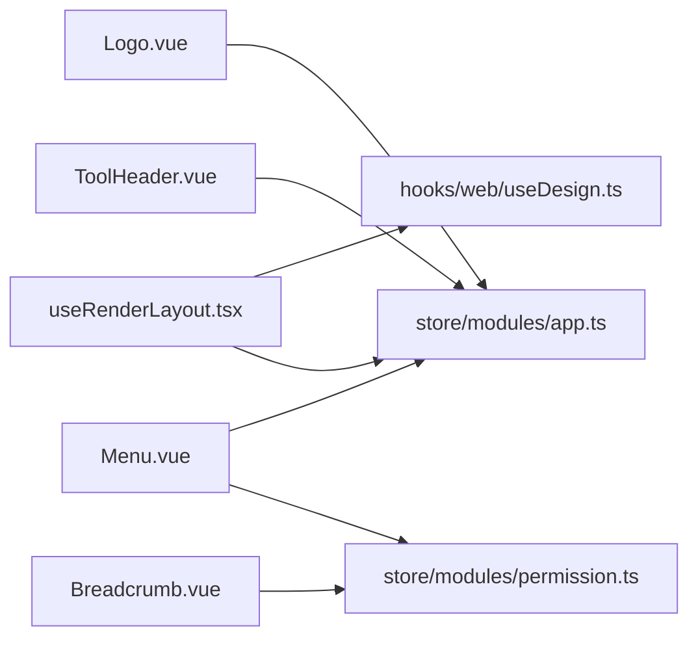

# 布局组件系统

<cite>
**本文档引用的文件**
- [default.vue](file://frontend/admin-uniapp/src/layouts/default.vue)
- [index.ts](file://frontend/admin-vue3/src/layout/components/Breadcrumb/index.ts)
- [Breadcrumb.vue](file://frontend/admin-vue3/src/layout/components/Breadcrumb/src/Breadcrumb.vue)
- [useRenderLayout.tsx](file://frontend/admin-vue3/src/layout/components/useRenderLayout.tsx)
- [Logo.vue](file://frontend/admin-vue3/src/layout/components/Logo/src/Logo.vue)
- [ToolHeader.vue](file://frontend/admin-vue3/src/layout/components/ToolHeader.vue)
- [Menu.vue](file://frontend/admin-vue3/src/layout/components/Menu/src/Menu.vue)
- [index.ts](file://frontend/admin-vue3/src/layout/components/Menu/index.ts)
- [theme.ts](file://frontend/admin-vue3/src/store/theme.ts)
- [app.ts](file://frontend/admin-vue3/src/store/modules/app.ts)
- [permission.ts](file://frontend/admin-vue3/src/store/modules/permission.ts)
- [design.ts](file://frontend/admin-vue3/src/hooks/web/useDesign.ts)
- [Collapse.vue](file://frontend/admin-vue3/src/layout/components/Collapse/index.vue)
- [UserInfo.vue](file://frontend/admin-vue3/src/layout/components/UserInfo/index.vue)
- [Screenfull.vue](file://frontend/admin-vue3/src/layout/components/Screenfull/index.vue)
- [LocaleDropdown.vue](file://frontend/admin-vue3/src/layout/components/LocaleDropdown/index.vue)
- [SizeDropdown.vue](file://frontend/admin-vue3/src/layout/components/SizeDropdown/index.vue)
- [RouterSearch.vue](file://frontend/admin-vue3/src/components/RouterSearch/index.vue)
- [TenantVisit.vue](file://frontend/admin-vue3/src/layout/components/TenantVisit/index.vue)
- [AppView.vue](file://frontend/admin-vue3/src/layout/AppView.vue)
- [TagsView.vue](file://frontend/admin-vue3/src/layout/components/TagsView/index.vue)
- [TabMenu.vue](file://frontend/admin-vue3/src/layout/components/TabMenu/index.vue)
</cite>

## 目录
1. [简介](#简介)
2. [项目结构](#项目结构)
3. [核心组件](#核心组件)
4. [架构总览](#架构总览)
5. [详细组件分析](#详细组件分析)
6. [依赖关系分析](#依赖关系分析)
7. [性能考虑](#性能考虑)
8. [故障排除指南](#故障排除指南)
9. [结论](#结论)
10. [附录](#附录)

## 简介
本文件面向AgenticCPS管理后台的布局组件系统，聚焦于Vue3版本的布局实现，涵盖主布局容器、侧边栏菜单、顶部工具栏、面包屑导航、用户信息面板、主题与尺寸切换等模块。文档将从架构、数据流、处理逻辑、集成点、错误处理与性能特性等方面进行深入解析，并提供定制化方法、组件复用策略与样式覆盖技巧，帮助开发者快速理解并高效扩展布局系统。

## 项目结构
管理后台采用多布局模式，支持经典布局、顶部布局、左上角布局、切割菜单布局等多种风格。整体结构以布局容器为核心，围绕其组织菜单、面包屑、工具栏、内容区等子模块；同时通过状态管理与设计系统钩子实现主题、尺寸、布局模式的统一控制。

图表来源
- [default.vue:1-4](file://frontend/admin-uniapp/src/layouts/default.vue#L1-L4)
- [useRenderLayout.tsx:45-294](file://frontend/admin-vue3/src/layout/components/useRenderLayout.tsx#L45-L294)
- [Logo.vue:58-88](file://frontend/admin-vue3/src/layout/components/Logo/src/Logo.vue#L58-L88)
- [ToolHeader.vue:51-94](file://frontend/admin-vue3/src/layout/components/ToolHeader.vue#L51-L94)
- [Breadcrumb.vue:23-88](file://frontend/admin-vue3/src/layout/components/Breadcrumb/src/Breadcrumb.vue#L23-L88)
- [Menu.vue:15-126](file://frontend/admin-vue3/src/layout/components/Menu/src/Menu.vue#L15-L126)
- [TabMenu.vue](file://frontend/admin-vue3/src/layout/components/TabMenu/index.vue)
- [TagsView.vue](file://frontend/admin-vue3/src/layout/components/TagsView/index.vue)
- [AppView.vue](file://frontend/admin-vue3/src/layout/AppView.vue)
- [app.ts](file://frontend/admin-vue3/src/store/modules/app.ts)
- [permission.ts](file://frontend/admin-vue3/src/store/modules/permission.ts)
- [theme.ts](file://frontend/admin-vue3/src/store/theme.ts)
- [design.ts](file://frontend/admin-vue3/src/hooks/web/useDesign.ts)

章节来源
- [default.vue:1-4](file://frontend/admin-uniapp/src/layouts/default.vue#L1-L4)
- [useRenderLayout.tsx:45-294](file://frontend/admin-vue3/src/layout/components/useRenderLayout.tsx#L45-L294)

## 核心组件
- 布局容器：提供全局插槽，承载所有布局子组件。
- Logo：根据布局类型动态调整样式与文本显示。
- 顶部工具栏：聚合面包屑、租户切换、全屏、搜索、尺寸、语言、消息、用户信息等工具。
- 侧边/顶部菜单：根据当前布局模式渲染垂直或水平菜单，支持路由高亮与折叠。
- 面包屑：基于权限路由树生成层级路径，支持图标与国际化标题。
- 内容区：滚动容器包裹标签页视图与页面内容，支持加载态与固定头部。
- 状态与设计：通过应用状态、权限状态、主题状态与设计钩子实现统一配置与主题切换。

章节来源
- [Logo.vue:58-88](file://frontend/admin-vue3/src/layout/components/Logo/src/Logo.vue#L58-L88)
- [ToolHeader.vue:51-94](file://frontend/admin-vue3/src/layout/components/ToolHeader.vue#L51-L94)
- [Menu.vue:15-126](file://frontend/admin-vue3/src/layout/components/Menu/src/Menu.vue#L15-L126)
- [Breadcrumb.vue:23-88](file://frontend/admin-vue3/src/layout/components/Breadcrumb/src/Breadcrumb.vue#L23-L88)
- [useRenderLayout.tsx:45-294](file://frontend/admin-vue3/src/layout/components/useRenderLayout.tsx#L45-L294)

## 架构总览
布局系统采用“容器-渲染器-子组件”分层架构。容器负责全局插槽，渲染器根据布局模式与设备状态选择性渲染不同组合，子组件通过状态管理与设计系统钩子实现主题与尺寸的统一控制。

图表来源
- [ToolHeader.vue:51-94](file://frontend/admin-vue3/src/layout/components/ToolHeader.vue#L51-L94)
- [Menu.vue:15-126](file://frontend/admin-vue3/src/layout/components/Menu/src/Menu.vue#L15-L126)
- [permission.ts](file://frontend/admin-vue3/src/store/modules/permission.ts)
- [app.ts](file://frontend/admin-vue3/src/store/modules/app.ts)
- [design.ts](file://frontend/admin-vue3/src/hooks/web/useDesign.ts)

## 详细组件分析

### 主布局容器与渲染器
- default.vue提供全局插槽，作为布局系统的根容器。
- useRenderLayout.tsx根据布局类型（classic/topLeft/top/cutMenu）与设备状态（移动端/非移动端）、菜单折叠状态、标签页开关等条件，动态渲染Logo、菜单、工具栏、标签页与内容区，并计算各区域的宽度与位置，确保过渡动画与响应式布局一致。

图表来源
- [default.vue:1-4](file://frontend/admin-uniapp/src/layouts/default.vue#L1-L4)
- [useRenderLayout.tsx:45-294](file://frontend/admin-vue3/src/layout/components/useRenderLayout.tsx#L45-L294)

章节来源
- [default.vue:1-4](file://frontend/admin-uniapp/src/layouts/default.vue#L1-L4)
- [useRenderLayout.tsx:45-294](file://frontend/admin-vue3/src/layout/components/useRenderLayout.tsx#L45-L294)

### 侧边栏菜单实现
- 菜单根据布局模式自动切换垂直/水平模式，支持折叠与唯一展开。
- 路由高亮通过activeMenu计算属性实现，优先使用路由meta中的activeMenu，否则使用当前路由路径。
- 支持自定义菜单选择事件与外部链接打开，内部路由通过编程式导航跳转。

图表来源
- [Menu.vue:15-126](file://frontend/admin-vue3/src/layout/components/Menu/src/Menu.vue#L15-L126)
- [permission.ts](file://frontend/admin-vue3/src/store/modules/permission.ts)
- [app.ts](file://frontend/admin-vue3/src/store/modules/app.ts)

章节来源
- [Menu.vue:15-126](file://frontend/admin-vue3/src/layout/components/Menu/src/Menu.vue#L15-L126)

### 顶部导航栏与用户信息面板
- ToolHeader.vue聚合多种工具组件：面包屑、租户切换、全屏、搜索、尺寸、语言、消息、用户信息。
- 通过应用状态控制各工具的显示/隐藏，支持权限判断（如租户访问权限）。
- 用户信息面板提供账户操作入口，结合消息中心与通知能力。

图表来源
- [ToolHeader.vue:51-94](file://frontend/admin-vue3/src/layout/components/ToolHeader.vue#L51-L94)
- [UserInfo.vue](file://frontend/admin-vue3/src/layout/components/UserInfo/index.vue)
- [Screenfull.vue](file://frontend/admin-vue3/src/layout/components/Screenfull/index.vue)
- [LocaleDropdown.vue](file://frontend/admin-vue3/src/layout/components/LocaleDropdown/index.vue)
- [SizeDropdown.vue](file://frontend/admin-vue3/src/layout/components/SizeDropdown/index.vue)
- [RouterSearch.vue](file://frontend/admin-vue3/src/components/RouterSearch/index.vue)
- [TenantVisit.vue](file://frontend/admin-vue3/src/layout/components/TenantVisit/index.vue)

章节来源
- [ToolHeader.vue:51-94](file://frontend/admin-vue3/src/layout/components/ToolHeader.vue#L51-L94)

### 面包屑导航设计
- 基于权限路由树过滤生成面包屑层级，支持图标与国际化标题。
- 监听路由变化动态更新层级，避免重定向路径影响展示。
- 使用过渡动画增强交互体验，最终渲染Element Plus的面包屑组件。

图表来源
- [Breadcrumb.vue:23-88](file://frontend/admin-vue3/src/layout/components/Breadcrumb/src/Breadcrumb.vue#L23-L88)
- [index.ts:1-3](file://frontend/admin-vue3/src/layout/components/Breadcrumb/index.ts#L1-L3)

章节来源
- [Breadcrumb.vue:23-88](file://frontend/admin-vue3/src/layout/components/Breadcrumb/src/Breadcrumb.vue#L23-L88)
- [index.ts:1-3](file://frontend/admin-vue3/src/layout/components/Breadcrumb/index.ts#L1-L3)

### Logo与主题切换
- Logo根据布局类型动态调整样式类名与文本颜色，确保在不同布局下的视觉一致性。
- 主题切换通过应用状态与设计钩子驱动CSS变量更新，实现全局主题与尺寸的即时生效。

图表来源
- [Logo.vue:58-88](file://frontend/admin-vue3/src/layout/components/Logo/src/Logo.vue#L58-L88)
- [ToolHeader.vue:51-94](file://frontend/admin-vue3/src/layout/components/ToolHeader.vue#L51-L94)
- [theme.ts](file://frontend/admin-vue3/src/store/theme.ts)
- [app.ts](file://frontend/admin-vue3/src/store/modules/app.ts)
- [design.ts](file://frontend/admin-vue3/src/hooks/web/useDesign.ts)

章节来源
- [Logo.vue:58-88](file://frontend/admin-vue3/src/layout/components/Logo/src/Logo.vue#L58-L88)
- [theme.ts](file://frontend/admin-vue3/src/store/theme.ts)
- [app.ts](file://frontend/admin-vue3/src/store/modules/app.ts)

### 响应式布局与菜单折叠
- 渲染器根据设备状态与布局类型动态计算内容区宽度与左侧偏移，确保在移动端与桌面端的一致体验。
- 菜单折叠状态由应用状态控制，折叠时最小宽度生效，展开时最大宽度生效，配合过渡动画提升交互流畅度。
- 顶部布局与左上角布局在菜单折叠时对内容区宽度与位置进行差异化适配。

章节来源
- [useRenderLayout.tsx:45-294](file://frontend/admin-vue3/src/layout/components/useRenderLayout.tsx#L45-L294)
- [Menu.vue:15-126](file://frontend/admin-vue3/src/layout/components/Menu/src/Menu.vue#L15-L126)

### 路由高亮显示机制
- activeMenu计算属性优先使用路由meta中的activeMenu，否则回退到当前路由路径，确保复杂路由场景下的高亮准确性。
- 菜单在渲染时传入defaultActive，Element Plus菜单组件据此进行高亮状态管理。

章节来源
- [Menu.vue:52-59](file://frontend/admin-vue3/src/layout/components/Menu/src/Menu.vue#L52-L59)

### 布局组件通信、状态传递与事件处理
- 组件间通过应用状态与权限状态进行解耦通信，避免直接依赖导致的紧耦合。
- 工具栏组件通过应用状态控制显示/隐藏与行为，菜单组件通过权限状态获取路由树并进行路由跳转。
- 事件处理集中在菜单组件与工具栏组件内，遵循单一职责原则，便于维护与扩展。

章节来源
- [ToolHeader.vue:51-94](file://frontend/admin-vue3/src/layout/components/ToolHeader.vue#L51-L94)
- [Menu.vue:15-126](file://frontend/admin-vue3/src/layout/components/Menu/src/Menu.vue#L15-L126)
- [permission.ts](file://frontend/admin-vue3/src/store/modules/permission.ts)
- [app.ts](file://frontend/admin-vue3/src/store/modules/app.ts)

## 依赖关系分析
- 布局渲染器依赖应用状态与设计钩子，用于布局模式、尺寸、主题与过渡动画的统一控制。
- 菜单组件依赖权限状态与应用状态，用于路由树获取与布局/折叠配置。
- 顶部工具栏依赖应用状态与权限判断，用于工具显示与权限控制。
- 面包屑依赖权限状态与路由系统，用于层级生成与国际化标题。

图表来源
- [useRenderLayout.tsx:45-294](file://frontend/admin-vue3/src/layout/components/useRenderLayout.tsx#L45-L294)
- [Menu.vue:15-126](file://frontend/admin-vue3/src/layout/components/Menu/src/Menu.vue#L15-L126)
- [ToolHeader.vue:51-94](file://frontend/admin-vue3/src/layout/components/ToolHeader.vue#L51-L94)
- [Breadcrumb.vue:23-88](file://frontend/admin-vue3/src/layout/components/Breadcrumb/src/Breadcrumb.vue#L23-L88)
- [Logo.vue:58-88](file://frontend/admin-vue3/src/layout/components/Logo/src/Logo.vue#L58-L88)
- [app.ts](file://frontend/admin-vue3/src/store/modules/app.ts)
- [permission.ts](file://frontend/admin-vue3/src/store/modules/permission.ts)
- [design.ts](file://frontend/admin-vue3/src/hooks/web/useDesign.ts)

章节来源
- [useRenderLayout.tsx:45-294](file://frontend/admin-vue3/src/layout/components/useRenderLayout.tsx#L45-L294)
- [Menu.vue:15-126](file://frontend/admin-vue3/src/layout/components/Menu/src/Menu.vue#L15-L126)
- [ToolHeader.vue:51-94](file://frontend/admin-vue3/src/layout/components/ToolHeader.vue#L51-L94)
- [Breadcrumb.vue:23-88](file://frontend/admin-vue3/src/layout/components/Breadcrumb/src/Breadcrumb.vue#L23-L88)
- [Logo.vue:58-88](file://frontend/admin-vue3/src/layout/components/Logo/src/Logo.vue#L58-L88)

## 性能考虑
- 路由监听与面包屑生成采用惰性计算与缓存策略，仅在路由变化时触发重建，减少不必要的渲染。
- 菜单高亮通过计算属性与Element Plus内置高亮机制实现，避免手动DOM操作带来的性能损耗。
- 过渡动画使用CSS变量与轻量级动画类，保证在低端设备上的流畅度。
- 滚动容器按需启用，避免在不需要时引入额外的滚动开销。

## 故障排除指南
- 面包屑不显示或层级错误：检查权限状态中的路由树是否正确过滤，确认当前路由路径与菜单路由匹配。
- 菜单高亮异常：确认路由meta中是否设置了activeMenu，或当前路由路径是否正确。
- 主题切换无效：检查主题状态是否同步到应用状态，以及设计钩子是否正确更新CSS变量。
- 菜单折叠宽度异常：检查应用状态中的折叠标志与布局类型，确认渲染器的宽度计算逻辑。

章节来源
- [Breadcrumb.vue:23-88](file://frontend/admin-vue3/src/layout/components/Breadcrumb/src/Breadcrumb.vue#L23-L88)
- [Menu.vue:52-59](file://frontend/admin-vue3/src/layout/components/Menu/src/Menu.vue#L52-L59)
- [theme.ts](file://frontend/admin-vue3/src/store/theme.ts)
- [app.ts](file://frontend/admin-vue3/src/store/modules/app.ts)

## 结论
AgenticCPS管理后台的布局组件系统通过容器-渲染器-子组件的分层设计，实现了多布局模式、响应式布局与主题切换的统一管理。借助状态管理与设计钩子，系统在保持高度可定制的同时，确保了良好的性能与可维护性。开发者可基于现有组件体系进行扩展与定制，快速构建符合业务需求的管理界面。

## 附录
- 布局定制方法
  - 新增布局模式：在渲染器中新增分支逻辑，结合应用状态与设计钩子控制样式与尺寸。
  - 自定义菜单：通过权限状态扩展路由树，利用菜单组件的高亮与折叠配置实现个性化展示。
  - 主题与尺寸：通过主题状态与设计钩子更新CSS变量，实现全局主题与尺寸切换。
- 组件复用策略
  - 工具栏组件通过应用状态控制显示/隐藏，便于在不同布局中复用。
  - 菜单组件通过权限状态与布局模式自动适配，减少重复代码。
- 样式覆盖技巧
  - 使用CSS变量覆盖布局相关样式，确保主题切换时的统一性。
  - 通过深度选择器与作用域样式结合，避免样式冲突。