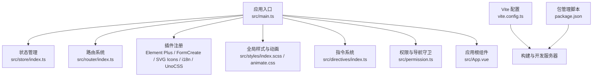
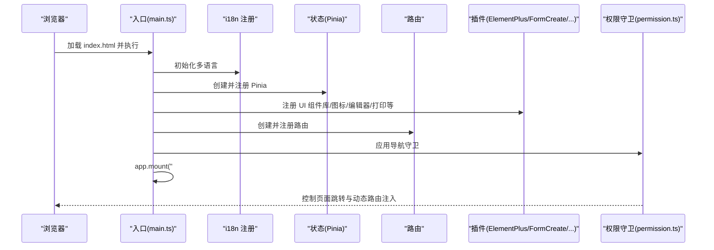
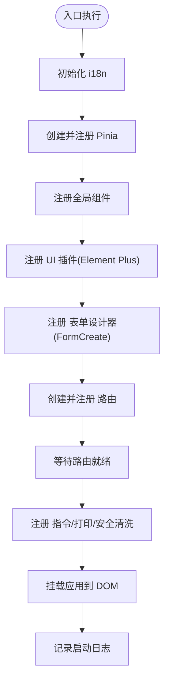
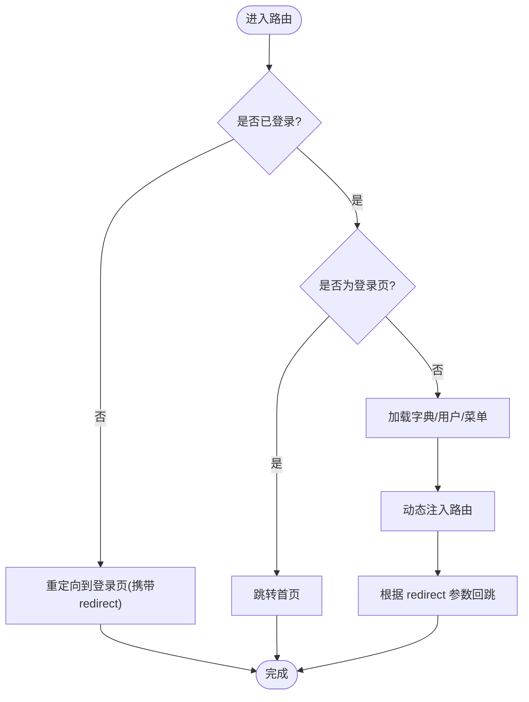
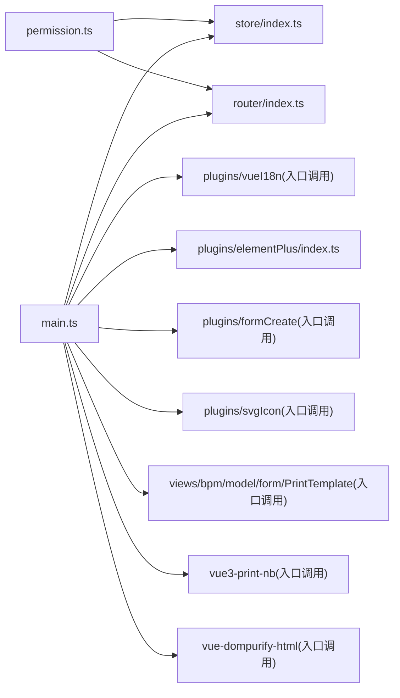

# 应用架构设计

<cite>
**本文引用的文件**
- [package.json](file://frontend/admin-vue3/package.json)
- [vite.config.ts](file://frontend/admin-vue3/vite.config.ts)
- [main.ts](file://frontend/admin-vue3/src/main.ts)
- [App.vue](file://frontend/admin-vue3/src/App.vue)
- [permission.ts](file://frontend/admin-vue3/src/permission.ts)
- [router/index.ts](file://frontend/admin-vue3/src/router/index.ts)
- [store/index.ts](file://frontend/admin-vue3/src/store/index.ts)
- [plugins/elementPlus/index.ts](file://frontend/admin-vue3/src/plugins/elementPlus/index.ts)
- [utils/auth.ts](file://frontend/admin-vue3/src/utils/auth.ts)
- [hooks/web/useTitle.ts](file://frontend/admin-vue3/src/hooks/web/useTitle.ts)
- [directives/index.ts](file://frontend/admin-vue3/src/directives/index.ts)
</cite>

## 目录
1. [引言](#引言)
2. [项目结构](#项目结构)
3. [核心组件](#核心组件)
4. [架构总览](#架构总览)
5. [详细组件分析](#详细组件分析)
6. [依赖关系分析](#依赖关系分析)
7. [性能考虑](#性能考虑)
8. [故障排查指南](#故障排查指南)
9. [结论](#结论)
10. [附录](#附录)

## 引言
本文件面向开发者，系统性梳理 AgenticCPS 管理后台 Vue3 应用的架构与实现细节，覆盖应用入口配置、初始化流程、插件注册机制、Vite 构建与开发服务器设置、环境变量管理、应用生命周期与全局配置、插件加载顺序、项目结构设计原则与模块化组织、依赖管理策略、启动流程分析、性能优化与开发调试技巧。目标是帮助团队快速理解并高效维护该 Vue3 应用。

## 项目结构
- 技术栈：Vue 3、Vite 5、TypeScript、Element Plus、Pinia、Vue Router、UnoCSS、Axios、wangEditor、ECharts 等。
- 关键目录与职责概览：
  - src：源代码根目录，包含入口、路由、状态、插件、组件、工具、国际化、样式等。
  - vite.config.ts：Vite 构建与开发服务器配置中心。
  - package.json：脚本、依赖与引擎版本声明。
- 设计原则：
  - 分层清晰：入口负责装配；路由、状态、插件、指令分别独立注册。
  - 模块化：按功能域拆分目录，插件与工具函数集中管理。
  - 可配置：通过环境变量控制端口、代理、输出目录、压缩与调试开关等。
  - 可扩展：插件注册与路由守卫可按需扩展。

图示来源
- [main.ts:1-86](file://frontend/admin-vue3/src/main.ts#L1-L86)
- [store/index.ts:1-13](file://frontend/admin-vue3/src/store/index.ts#L1-L13)
- [router/index.ts:1-37](file://frontend/admin-vue3/src/router/index.ts#L1-L37)
- [vite.config.ts:1-89](file://frontend/admin-vue3/vite.config.ts#L1-L89)
- [package.json:1-160](file://frontend/admin-vue3/package.json#L1-L160)

章节来源
- [package.json:1-160](file://frontend/admin-vue3/package.json#L1-L160)
- [vite.config.ts:1-89](file://frontend/admin-vue3/vite.config.ts#L1-L89)
- [main.ts:1-86](file://frontend/admin-vue3/src/main.ts#L1-L86)

## 核心组件
- 应用入口与初始化
  - 入口文件负责创建应用实例、注册插件、挂载路由与状态，并在最后挂载到 DOM。
  - 初始化顺序强调 i18n、store、全局组件、UI 组件库、表单设计器、路由、指令、富文本插件、打印插件等。
- 路由系统
  - 基于 History 模式，支持滚动行为与动态路由注入。
- 状态管理
  - Pinia + 持久化插件，确保刷新后状态不丢失。
- 权限与导航守卫
  - 登录态判断、白名单放行、用户信息与菜单异步加载、动态注入路由、标题与进度条联动。
- 插件体系
  - Element Plus 全局组件与插件注册；SVG 图标；i18n；UnoCSS；wangEditor；打印；安全 HTML 清洗。
- 指令系统
  - 权限指令与挂载焦点指令，统一在入口注册。

章节来源
- [main.ts:1-86](file://frontend/admin-vue3/src/main.ts#L1-L86)
- [router/index.ts:1-37](file://frontend/admin-vue3/src/router/index.ts#L1-L37)
- [store/index.ts:1-13](file://frontend/admin-vue3/src/store/index.ts#L1-L13)
- [permission.ts:1-108](file://frontend/admin-vue3/src/permission.ts#L1-L108)
- [plugins/elementPlus/index.ts:1-18](file://frontend/admin-vue3/src/plugins/elementPlus/index.ts#L1-L18)
- [directives/index.ts:1-25](file://frontend/admin-vue3/src/directives/index.ts#L1-L25)

## 架构总览
下图展示应用启动的关键调用链与模块交互：

图示来源
- [main.ts:50-86](file://frontend/admin-vue3/src/main.ts#L50-L86)
- [permission.ts:59-101](file://frontend/admin-vue3/src/permission.ts#L59-L101)

## 详细组件分析

### 应用入口与初始化流程
- 初始化步骤要点
  - 引入全局样式与动画。
  - 初始化 i18n、Pinia、全局组件、Element Plus、FormCreate、wangEditor 插件。
  - 创建并注册路由，等待路由就绪。
  - 注册指令与打印插件，启用安全 HTML 清洗。
  - 挂载应用。
- 生命周期与挂载
  - 在入口末尾记录应用启动日志，便于开发调试。

图示来源
- [main.ts:50-86](file://frontend/admin-vue3/src/main.ts#L50-L86)

章节来源
- [main.ts:1-86](file://frontend/admin-vue3/src/main.ts#L1-L86)

### Vite 构建与开发服务器配置
- 环境变量加载
  - 开发模式与构建模式均通过 loadEnv 读取对应 .env 文件，支持 --mode 指定模式。
- 服务器配置
  - 端口、主机、自动打开浏览器等可通过环境变量控制。
- 插件体系
  - 插件统一由 createVitePlugins 工厂函数创建，便于集中管理与扩展。
- CSS 预处理
  - SCSS 全局注入变量，关闭弃用警告。
- 路径别名
  - @ 指向 src，i18n 指向 CJS 版本以适配运行时。
- 构建优化
  - Terser 压缩、SourceMap、条件移除 debugger/console。
  - Rollup 分包策略：将大体积库单独打包，减少重复依赖。
- 依赖预构建
  - optimizeDeps.include/exclude 控制预构建范围。

章节来源
- [vite.config.ts:15-89](file://frontend/admin-vue3/vite.config.ts#L15-L89)
- [package.json:7-26](file://frontend/admin-vue3/package.json#L7-L26)

### 路由与权限守卫
- 路由
  - History 模式，严格模式，滚动行为重置至顶部。
  - 提供重置路由能力，用于登出或切换租户场景。
- 权限守卫
  - 白名单直接放行；无 Token 时统一重定向登录页。
  - 登录后异步加载字典、用户信息与菜单，动态注入路由。
  - 标题与进度条在 beforeEach/afterEach 中联动更新。

图示来源
- [permission.ts:59-101](file://frontend/admin-vue3/src/permission.ts#L59-L101)
- [router/index.ts:22-30](file://frontend/admin-vue3/src/router/index.ts#L22-L30)

章节来源
- [router/index.ts:1-37](file://frontend/admin-vue3/src/router/index.ts#L1-L37)
- [permission.ts:1-108](file://frontend/admin-vue3/src/permission.ts#L1-L108)

### 状态管理与持久化
- Pinia 创建与注册
  - 在入口中创建并注册 Pinia 实例。
- 持久化
  - 使用 pinia-plugin-persistedstate，结合本地缓存实现刷新后状态恢复。

章节来源
- [store/index.ts:1-13](file://frontend/admin-vue3/src/store/index.ts#L1-L13)

### 插件注册机制
- Element Plus
  - 全局注册 Loading 插件与常用组件，保证下拉等组件样式正常。
- 其他插件
  - SVG 图标、i18n、UnoCSS、wangEditor、打印、安全 HTML 清洗等在入口统一注册。
- 指令系统
  - 权限指令与挂载焦点指令集中导出并在入口注册。

章节来源
- [plugins/elementPlus/index.ts:1-18](file://frontend/admin-vue3/src/plugins/elementPlus/index.ts#L1-L18)
- [directives/index.ts:1-25](file://frontend/admin-vue3/src/directives/index.ts#L1-L25)
- [main.ts:10-48](file://frontend/admin-vue3/src/main.ts#L10-L48)

### 应用根组件与主题
- 根组件负责主题尺寸、灰度模式、路由视图包裹与全局搜索等。
- 默认根据系统深色偏好设置主题开关。

章节来源
- [App.vue:1-58](file://frontend/admin-vue3/src/App.vue#L1-L58)

### 环境变量与脚本
- 环境变量
  - 通过 VITE_ 前缀控制基础路径、端口、自动打开、输出目录、SourceMap、调试器/控制台剔除等。
- 脚本
  - 开发、构建、预览、类型检查、代码规范与风格检查等脚本统一管理。

章节来源
- [vite.config.ts:24-26](file://frontend/admin-vue3/vite.config.ts#L24-L26)
- [vite.config.ts:28-31](file://frontend/admin-vue3/vite.config.ts#L28-L31)
- [vite.config.ts:65-86](file://frontend/admin-vue3/vite.config.ts#L65-L86)
- [package.json:7-26](file://frontend/admin-vue3/package.json#L7-L26)

## 依赖关系分析
- 入口对各模块的依赖
  - main.ts 依赖 store、router、i18n、elementPlus、formCreate、svgIcon、wangEditor、print、VueDOMPurifyHTML 等。
- 运行期耦合
  - 路由守卫依赖用户、字典、权限状态；标题与进度条依赖路由元信息。
- 第三方库
  - UI：Element Plus、wangEditor、ECharts、视频播放器等。
  - 状态：Pinia、持久化插件。
  - 工具：Axios、dayjs、lodash-es、crypto-js、mitt、nprogress 等。

图示来源
- [main.ts:10-48](file://frontend/admin-vue3/src/main.ts#L10-L48)
- [permission.ts:1-11](file://frontend/admin-vue3/src/permission.ts#L1-L11)

章节来源
- [main.ts:1-86](file://frontend/admin-vue3/src/main.ts#L1-L86)
- [permission.ts:1-108](file://frontend/admin-vue3/src/permission.ts#L1-L108)

## 性能考虑
- 构建优化
  - 使用 Terser 条件剔除 debugger 与 console。
  - 按需开启 SourceMap。
  - Rollup 分包策略将大库独立打包，降低重复依赖。
- 依赖预构建
  - 通过 optimizeDeps 控制预构建范围，缩短冷启动时间。
- 运行期优化
  - 按需引入组件与插件，避免一次性注册过多。
  - 使用持久化状态减少重复请求。
  - 路由守卫中仅在必要时加载数据，避免阻塞首屏。

章节来源
- [vite.config.ts:65-86](file://frontend/admin-vue3/vite.config.ts#L65-L86)
- [store/index.ts:1-13](file://frontend/admin-vue3/src/store/index.ts#L1-L13)

## 故障排查指南
- 登录态问题
  - 检查 Token 获取逻辑与存储键值一致性。
  - 确认白名单与重定向逻辑。
- 路由无法访问
  - 检查权限守卫中的动态路由注入是否成功。
  - 确认菜单与路由映射关系。
- 样式或图标异常
  - 确认 @ 别名与 SCSS 全局变量注入。
  - 检查 SVG 图标与 Element Plus 版本匹配。
- 构建失败或体积过大
  - 检查 Terser 选项与分包策略。
  - 确认 optimizeDeps.include/exclude 是否合理。
- 开发服务器无法访问
  - 检查 host 与端口配置，确认防火墙与网络策略。

章节来源
- [utils/auth.ts:1-81](file://frontend/admin-vue3/src/utils/auth.ts#L1-L81)
- [permission.ts:49-57](file://frontend/admin-vue3/src/permission.ts#L49-L57)
- [vite.config.ts:27-40](file://frontend/admin-vue3/vite.config.ts#L27-L40)

## 结论
该 Vue3 管理后台应用采用清晰的分层与模块化设计，入口集中装配、路由与权限守卫解耦、插件与指令统一注册，配合 Vite 的灵活配置与 Pinia 的状态持久化，形成高可维护、易扩展的前端架构。建议在后续迭代中持续完善插件工厂化、路由与权限的抽象封装、以及构建产物的可观测性与缓存策略。

## 附录
- 最佳实践
  - 将第三方插件收敛到统一的 setupXXX 函数中，保持入口整洁。
  - 路由守卫中尽量减少同步阻塞操作，优先使用异步加载。
  - 使用环境变量集中管理运行时配置，避免硬编码。
  - 对大体积依赖进行分包与懒加载，提升首屏性能。
  - 保持依赖升级与安全扫描的节奏，定期清理未使用依赖。