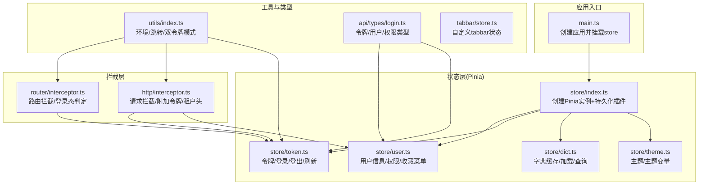
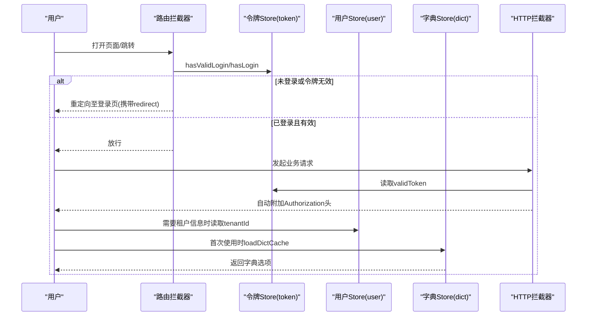
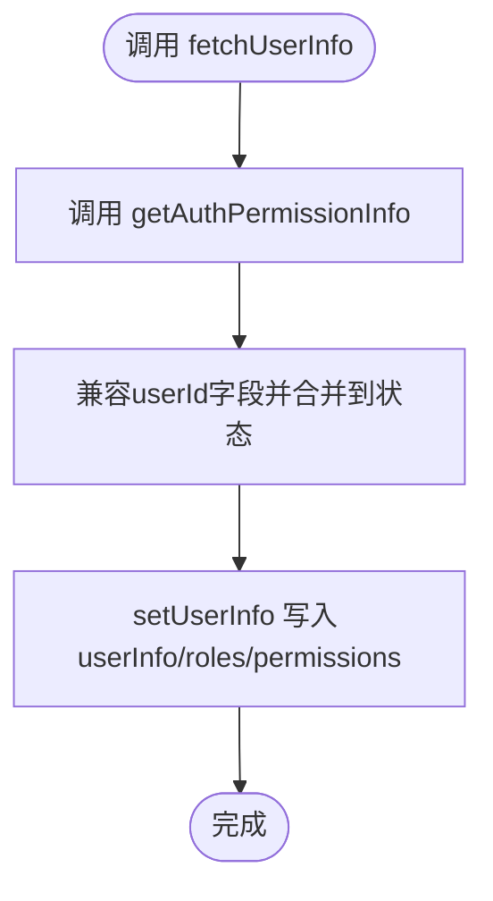
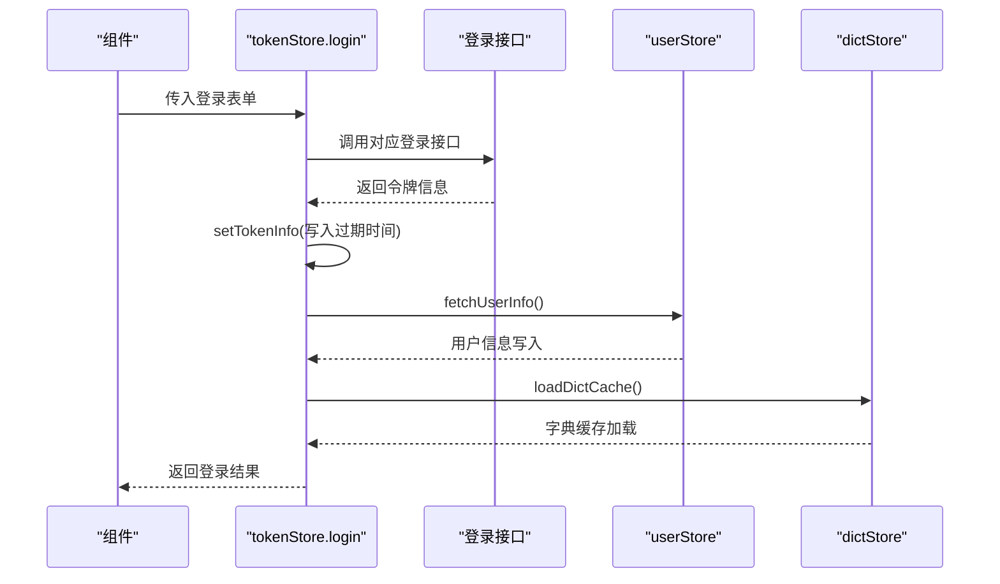
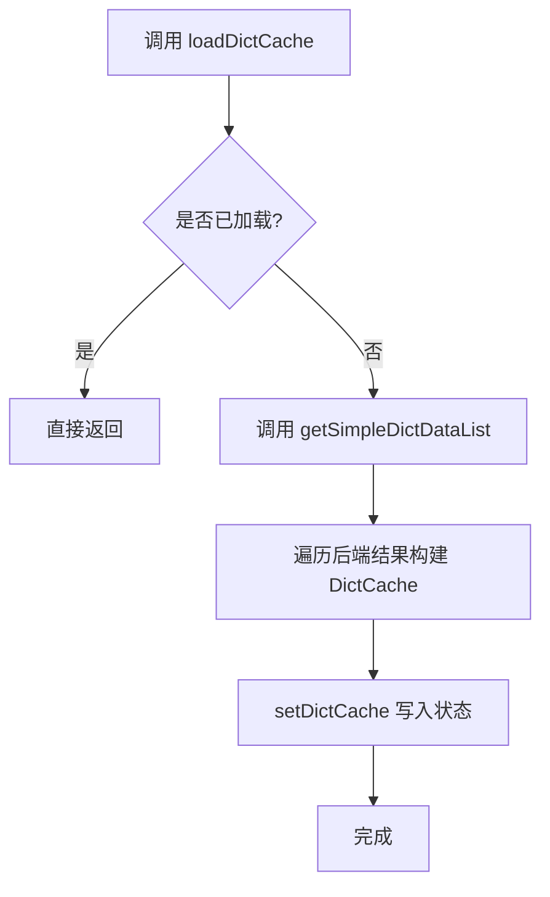
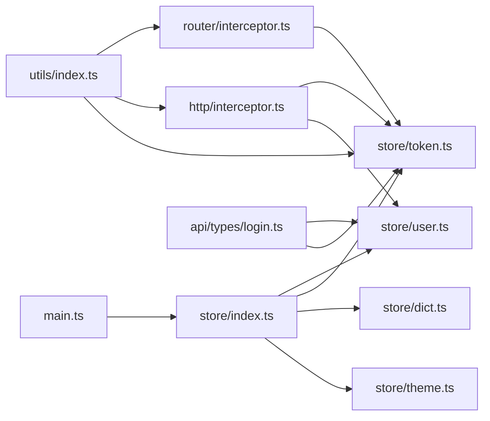

# 状态管理架构

<cite>
**本文引用的文件**
- [frontend/admin-uniapp/src/store/index.ts](file://frontend/admin-uniapp/src/store/index.ts)
- [frontend/admin-uniapp/src/store/user.ts](file://frontend/admin-uniapp/src/store/user.ts)
- [frontend/admin-uniapp/src/store/token.ts](file://frontend/admin-uniapp/src/store/token.ts)
- [frontend/admin-uniapp/src/store/dict.ts](file://frontend/admin-uniapp/src/store/dict.ts)
- [frontend/admin-uniapp/src/store/theme.ts](file://frontend/admin-uniapp/src/store/theme.ts)
- [frontend/admin-uniapp/src/main.ts](file://frontend/admin-uniapp/src/main.ts)
- [frontend/admin-uniapp/src/api/types/login.ts](file://frontend/admin-uniapp/src/api/types/login.ts)
- [frontend/admin-uniapp/src/utils/index.ts](file://frontend/admin-uniapp/src/utils/index.ts)
- [frontend/admin-uniapp/src/router/interceptor.ts](file://frontend/admin-uniapp/src/router/interceptor.ts)
- [frontend/admin-uniapp/src/http/interceptor.ts](file://frontend/admin-uniapp/src/http/interceptor.ts)
- [frontend/admin-uniapp/src/tabbar/store.ts](file://frontend/admin-uniapp/src/tabbar/store.ts)
</cite>

## 目录
1. [引言](#引言)
2. [项目结构](#项目结构)
3. [核心组件](#核心组件)
4. [架构总览](#架构总览)
5. [详细组件分析](#详细组件分析)
6. [依赖关系分析](#依赖关系分析)
7. [性能考量](#性能考量)
8. [故障排查指南](#故障排查指南)
9. [结论](#结论)
10. [附录](#附录)

## 引言
本文件面向AgenticCPS管理后台的前端状态管理，系统性梳理基于Pinia的Store配置、模块化状态设计与状态树结构，重点覆盖以下方面：
- Vuex Store配置与Pinia替代方案：采用Pinia + 持久化插件实现状态持久化与跨页面共享
- 模块化状态设计：按领域拆分用户、令牌、字典、主题等模块，职责清晰、边界明确
- 状态树结构：用户信息、权限集合、令牌状态、字典缓存、主题配置的树形组织
- 应用状态管理：登录态、租户切换、字典加载、主题切换
- 权限状态维护：角色与权限标识的集中管理与路由拦截联动
- 状态持久化：基于本地存储的令牌与用户信息持久化，支持刷新后恢复
- 状态同步：路由拦截与HTTP拦截器对状态变更的联动
- 异步状态处理：登录、刷新令牌、获取用户信息、加载字典的异步流程
- 状态模块划分原则：单一职责、最小耦合、可测试性
- 状态更新机制：响应式ref/computed + 动作函数（actions）
- 状态订阅模式：组件内通过store实例直接访问与监听
- 最佳实践、性能优化策略与调试技巧

## 项目结构
管理后台前端采用UniApp多端运行，状态管理位于frontend/admin-uniapp/src/store目录，配合全局入口、HTTP拦截器、路由拦截器与工具函数共同构成完整的状态与数据流体系。

图表来源
- [frontend/admin-uniapp/src/main.ts:1-20](file://frontend/admin-uniapp/src/main.ts#L1-L20)
- [frontend/admin-uniapp/src/store/index.ts:1-23](file://frontend/admin-uniapp/src/store/index.ts#L1-L23)
- [frontend/admin-uniapp/src/store/user.ts:1-90](file://frontend/admin-uniapp/src/store/user.ts#L1-L90)
- [frontend/admin-uniapp/src/store/token.ts:1-342](file://frontend/admin-uniapp/src/store/token.ts#L1-L342)
- [frontend/admin-uniapp/src/store/dict.ts:1-87](file://frontend/admin-uniapp/src/store/dict.ts#L1-L87)
- [frontend/admin-uniapp/src/store/theme.ts:1-43](file://frontend/admin-uniapp/src/store/theme.ts#L1-L43)
- [frontend/admin-uniapp/src/router/interceptor.ts:1-146](file://frontend/admin-uniapp/src/router/interceptor.ts#L1-L146)
- [frontend/admin-uniapp/src/http/interceptor.ts:1-105](file://frontend/admin-uniapp/src/http/interceptor.ts#L1-L105)
- [frontend/admin-uniapp/src/utils/index.ts:1-244](file://frontend/admin-uniapp/src/utils/index.ts#L1-L244)
- [frontend/admin-uniapp/src/api/types/login.ts:1-110](file://frontend/admin-uniapp/src/api/types/login.ts#L1-L110)
- [frontend/admin-uniapp/src/tabbar/store.ts:1-88](file://frontend/admin-uniapp/src/tabbar/store.ts#L1-L88)

章节来源
- [frontend/admin-uniapp/src/main.ts:1-20](file://frontend/admin-uniapp/src/main.ts#L1-L20)
- [frontend/admin-uniapp/src/store/index.ts:1-23](file://frontend/admin-uniapp/src/store/index.ts#L1-L23)

## 核心组件
- Pinia根实例与持久化：在store/index.ts中创建Pinia实例并启用持久化插件，使用uni的本地存储API进行序列化读写，确保刷新后状态不丢失
- 用户模块（user）：集中管理用户信息、角色、权限、租户ID与常用菜单；提供设置、清理、拉取用户信息的动作，并开启持久化
- 令牌模块（token）：统一处理登录、登出、刷新令牌、令牌有效性判断；根据双令牌/单令牌模式动态适配；提供hasValidLogin等常用判断
- 字典模块（dict）：按类型缓存字典项，提供加载、查询、清空动作；用于UI渲染与表单选择
- 主题模块（theme）：管理明暗主题与主题变量，支持切换与局部覆盖

章节来源
- [frontend/admin-uniapp/src/store/user.ts:1-90](file://frontend/admin-uniapp/src/store/user.ts#L1-L90)
- [frontend/admin-uniapp/src/store/token.ts:1-342](file://frontend/admin-uniapp/src/store/token.ts#L1-L342)
- [frontend/admin-uniapp/src/store/dict.ts:1-87](file://frontend/admin-uniapp/src/store/dict.ts#L1-L87)
- [frontend/admin-uniapp/src/store/theme.ts:1-43](file://frontend/admin-uniapp/src/store/theme.ts#L1-L43)

## 架构总览
状态管理围绕“登录态—用户信息—权限—字典—主题”的主干展开，通过路由拦截与HTTP拦截器实现状态驱动的导航与请求行为。

图表来源
- [frontend/admin-uniapp/src/router/interceptor.ts:1-146](file://frontend/admin-uniapp/src/router/interceptor.ts#L1-L146)
- [frontend/admin-uniapp/src/store/token.ts:1-342](file://frontend/admin-uniapp/src/store/token.ts#L1-L342)
- [frontend/admin-uniapp/src/store/user.ts:1-90](file://frontend/admin-uniapp/src/store/user.ts#L1-L90)
- [frontend/admin-uniapp/src/store/dict.ts:1-87](file://frontend/admin-uniapp/src/store/dict.ts#L1-L87)
- [frontend/admin-uniapp/src/http/interceptor.ts:1-105](file://frontend/admin-uniapp/src/http/interceptor.ts#L1-L105)

## 详细组件分析

### 用户状态模块（user）
- 状态结构
  - userInfo：用户基本信息
  - roles：角色标识数组
  - permissions：权限标识数组
  - tenantId：当前租户ID
  - favoriteMenus：常用菜单键列表
- 关键动作
  - setUserInfo：合并后端返回的用户、角色、权限
  - setUserAvatar：更新头像并持久化
  - clearUserInfo：重置用户状态并清理本地存储
  - setTenantId：设置租户ID
  - setFavoriteMenus：设置常用菜单
  - fetchUserInfo：调用后端接口获取权限信息并写入状态
- 持久化策略：开启persist，自动同步到本地存储

图表来源
- [frontend/admin-uniapp/src/store/user.ts:64-70](file://frontend/admin-uniapp/src/store/user.ts#L64-L70)

章节来源
- [frontend/admin-uniapp/src/store/user.ts:1-90](file://frontend/admin-uniapp/src/store/user.ts#L1-L90)
- [frontend/admin-uniapp/src/api/types/login.ts:27-43](file://frontend/admin-uniapp/src/api/types/login.ts#L27-L43)

### 令牌状态模块（token）
- 状态结构
  - tokenInfo：单令牌或双令牌信息
  - 计算属性：isTokenExpired、isRefreshTokenExpired、hasLogin、hasValidLogin、getValidToken
- 关键动作
  - login：根据登录类型调用不同接口，登录成功后写入令牌并拉取用户信息
  - wxLogin：微信授权登录流程
  - logout：调用后端登出，清理本地存储与用户/字典缓存
  - refreshToken：双令牌模式下的刷新
  - tryGetValidToken：在过期且可刷新时自动刷新并返回有效令牌
- 持久化策略：开启persist，结合本地存储的过期时间实现跨会话恢复

图表来源
- [frontend/admin-uniapp/src/store/token.ts:122-161](file://frontend/admin-uniapp/src/store/token.ts#L122-L161)
- [frontend/admin-uniapp/src/store/token.ts:104-113](file://frontend/admin-uniapp/src/store/token.ts#L104-L113)
- [frontend/admin-uniapp/src/store/user.ts:64-70](file://frontend/admin-uniapp/src/store/user.ts#L64-L70)
- [frontend/admin-uniapp/src/store/dict.ts:30-52](file://frontend/admin-uniapp/src/store/dict.ts#L30-L52)

章节来源
- [frontend/admin-uniapp/src/store/token.ts:1-342](file://frontend/admin-uniapp/src/store/token.ts#L1-L342)
- [frontend/admin-uniapp/src/api/types/login.ts:1-110](file://frontend/admin-uniapp/src/api/types/login.ts#L1-L110)
- [frontend/admin-uniapp/src/utils/index.ts:168-169](file://frontend/admin-uniapp/src/utils/index.ts#L168-L169)

### 字典状态模块（dict）
- 状态结构
  - dictCache：按类型缓存字典项数组
  - isLoaded：是否已加载
- 关键动作
  - loadDictCache：首次加载后端字典列表并归类缓存
  - getDictOptions：按类型返回选项
  - getDictData：按类型与值查找字典项
  - clearDictCache：清空缓存

图表来源
- [frontend/admin-uniapp/src/store/dict.ts:30-52](file://frontend/admin-uniapp/src/store/dict.ts#L30-L52)

章节来源
- [frontend/admin-uniapp/src/store/dict.ts:1-87](file://frontend/admin-uniapp/src/store/dict.ts#L1-L87)

### 主题状态模块（theme）
- 状态结构
  - theme：light/dark
  - themeVars：主题变量对象
- 关键动作
  - setThemeVars：部分覆盖主题变量
  - toggleTheme：切换明暗主题

章节来源
- [frontend/admin-uniapp/src/store/theme.ts:1-43](file://frontend/admin-uniapp/src/store/theme.ts#L1-L43)

### 状态树与模块划分原则
- 模块划分
  - user：用户域（信息、权限、租户、收藏）
  - token：认证域（登录、登出、刷新、有效性）
  - dict：展示域（字典缓存与查询）
  - theme：外观域（主题与变量）
  - store/index.ts：根实例与持久化插件
- 划分原则
  - 单一职责：每个模块专注一个业务域
  - 最小耦合：模块间通过store实例互相调用，避免直接依赖
  - 可测试性：动作函数与计算属性便于单元测试
  - 可扩展性：新增模块遵循相同结构（状态+动作+持久化）

章节来源
- [frontend/admin-uniapp/src/store/index.ts:1-23](file://frontend/admin-uniapp/src/store/index.ts#L1-L23)
- [frontend/admin-uniapp/src/store/user.ts:1-90](file://frontend/admin-uniapp/src/store/user.ts#L1-L90)
- [frontend/admin-uniapp/src/store/token.ts:1-342](file://frontend/admin-uniapp/src/store/token.ts#L1-L342)
- [frontend/admin-uniapp/src/store/dict.ts:1-87](file://frontend/admin-uniapp/src/store/dict.ts#L1-L87)
- [frontend/admin-uniapp/src/store/theme.ts:1-43](file://frontend/admin-uniapp/src/store/theme.ts#L1-L43)

## 依赖关系分析
- 入口依赖：main.ts挂载store，确保全局可用
- 拦截器依赖：路由拦截器依赖token.hasLogin/hasValidLogin；HTTP拦截器依赖token.validToken与user.tenantId
- 类型与工具：api/types/login.ts提供令牌/用户/权限类型；utils/index.ts提供双令牌模式判断与环境基地址

图表来源
- [frontend/admin-uniapp/src/main.ts:1-20](file://frontend/admin-uniapp/src/main.ts#L1-L20)
- [frontend/admin-uniapp/src/store/index.ts:1-23](file://frontend/admin-uniapp/src/store/index.ts#L1-L23)
- [frontend/admin-uniapp/src/router/interceptor.ts:1-146](file://frontend/admin-uniapp/src/router/interceptor.ts#L1-L146)
- [frontend/admin-uniapp/src/http/interceptor.ts:1-105](file://frontend/admin-uniapp/src/http/interceptor.ts#L1-L105)
- [frontend/admin-uniapp/src/utils/index.ts:1-244](file://frontend/admin-uniapp/src/utils/index.ts#L1-L244)
- [frontend/admin-uniapp/src/api/types/login.ts:1-110](file://frontend/admin-uniapp/src/api/types/login.ts#L1-L110)

章节来源
- [frontend/admin-uniapp/src/main.ts:1-20](file://frontend/admin-uniapp/src/main.ts#L1-L20)
- [frontend/admin-uniapp/src/router/interceptor.ts:1-146](file://frontend/admin-uniapp/src/router/interceptor.ts#L1-L146)
- [frontend/admin-uniapp/src/http/interceptor.ts:1-105](file://frontend/admin-uniapp/src/http/interceptor.ts#L1-L105)
- [frontend/admin-uniapp/src/utils/index.ts:168-169](file://frontend/admin-uniapp/src/utils/index.ts#L168-L169)

## 性能考量
- 状态持久化
  - 仅对必要模块开启persist，避免过度序列化造成I/O压力
  - 对大对象（如字典缓存）建议按需加载，避免首屏阻塞
- 计算属性与响应式
  - 使用computed封装状态判断，减少重复计算
  - 将大型数据结构（如字典）拆分为独立模块，降低全局响应式开销
- 异步加载
  - 字典与用户信息采用懒加载策略，仅在需要时触发
  - 令牌刷新采用条件触发，避免频繁刷新
- 缓存策略
  - 本地存储键名规范化，避免冲突
  - 过期时间与刷新策略结合，平衡安全性与体验

## 故障排查指南
- 登录后仍被重定向到登录页
  - 检查路由拦截器中的hasValidLogin与白/黑名单配置
  - 确认token.hasLogin是否为true
- 请求无Authorization头
  - 检查HTTP拦截器是否命中白名单
  - 确认token.validToken是否为空
- 令牌过期但无法刷新
  - 单令牌模式不支持刷新，需重新登录
  - 双令牌模式下确认refreshToken是否存在
- 字典不显示或为空
  - 确认dict.isLoaded状态与loadDictCache是否执行
  - 检查后端接口返回格式与类型匹配
- 主题切换无效
  - 检查themeVars是否被正确覆盖
  - 确认主题切换逻辑是否被其他样式覆盖

章节来源
- [frontend/admin-uniapp/src/router/interceptor.ts:106-134](file://frontend/admin-uniapp/src/router/interceptor.ts#L106-L134)
- [frontend/admin-uniapp/src/http/interceptor.ts:55-68](file://frontend/admin-uniapp/src/http/interceptor.ts#L55-L68)
- [frontend/admin-uniapp/src/store/token.ts:228-250](file://frontend/admin-uniapp/src/store/token.ts#L228-L250)
- [frontend/admin-uniapp/src/store/dict.ts:29-52](file://frontend/admin-uniapp/src/store/dict.ts#L29-L52)
- [frontend/admin-uniapp/src/store/theme.ts:18-26](file://frontend/admin-uniapp/src/store/theme.ts#L18-L26)

## 结论
本状态管理架构以Pinia为核心，结合持久化插件、路由与HTTP拦截器，实现了登录态驱动的导航与请求行为。模块化设计使用户、令牌、字典、主题等状态清晰隔离，易于维护与扩展。通过计算属性与懒加载策略，兼顾性能与用户体验。建议在实际开发中遵循模块划分原则，严格控制持久化范围，并完善异常处理与日志记录，持续优化状态更新与订阅模式。

## 附录
- 状态订阅模式
  - 组件内直接引入store实例，通过响应式状态与计算属性进行订阅
  - 在setup中解构store暴露的响应式数据与动作，实现声明式更新
- 最佳实践
  - 动作函数内部保持幂等与可重试
  - 对外部可见的计算属性命名语义化，便于调试
  - 对大体量数据采用分页或延迟加载
  - 对关键状态变更添加日志与埋点
- 调试技巧
  - 使用浏览器/开发者工具观察本地存储中的持久化键值
  - 在路由与HTTP拦截器中打印关键决策分支，定位拦截逻辑问题
  - 对异步动作使用try/catch包裹并记录错误上下文