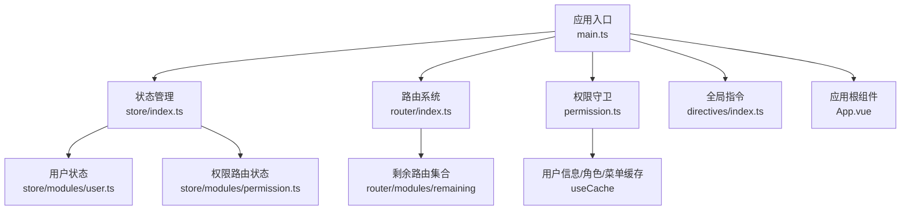
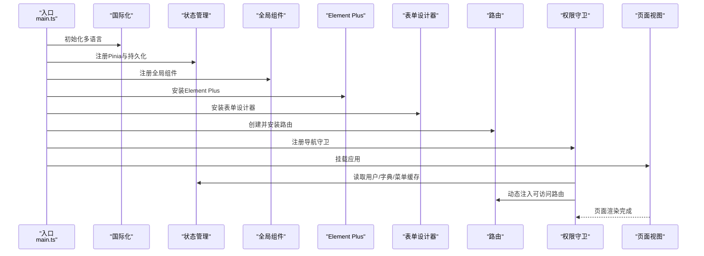
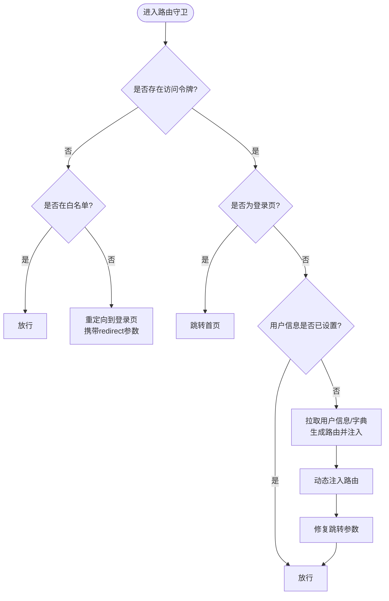
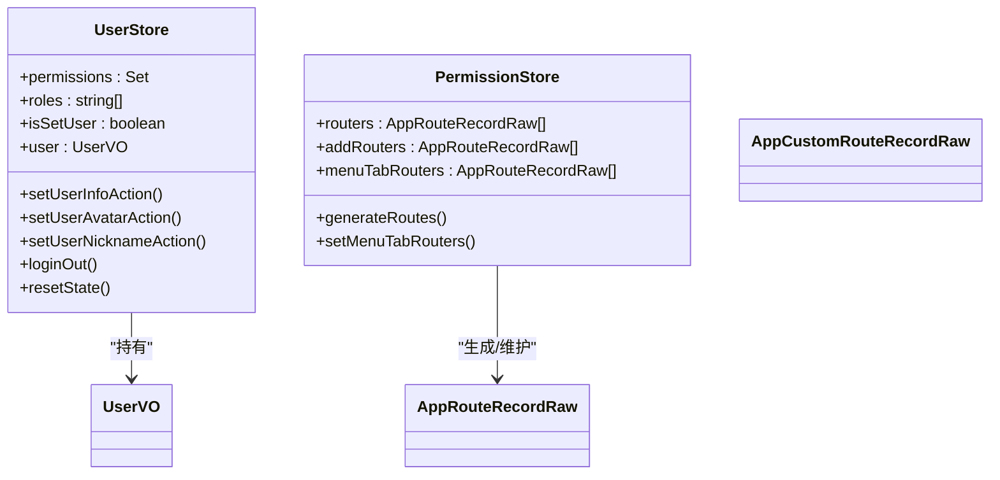
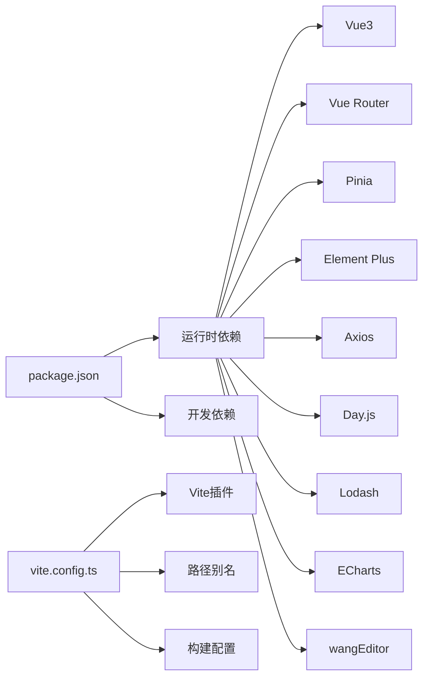

# 管理后台Vue3系统

<cite>
**本文引用的文件**
- [package.json](file://frontend/admin-vue3/package.json)
- [vite.config.ts](file://frontend/admin-vue3/vite.config.ts)
- [main.ts](file://frontend/admin-vue3/src/main.ts)
- [App.vue](file://frontend/admin-vue3/src/App.vue)
- [permission.ts](file://frontend/admin-vue3/src/permission.ts)
- [router/index.ts](file://frontend/admin-vue3/src/router/index.ts)
- [store/index.ts](file://frontend/admin-vue3/src/store/index.ts)
- [store/modules/user.ts](file://frontend/admin-vue3/src/store/modules/user.ts)
- [store/modules/permission.ts](file://frontend/admin-vue3/src/store/modules/permission.ts)
- [directives/index.ts](file://frontend/admin-vue3/src/directives/index.ts)
</cite>

## 目录
1. [简介](#简介)
2. [项目结构](#项目结构)
3. [核心组件](#核心组件)
4. [架构总览](#架构总览)
5. [详细组件分析](#详细组件分析)
6. [依赖关系分析](#依赖关系分析)
7. [性能考虑](#性能考虑)
8. [故障排查指南](#故障排查指南)
9. [结论](#结论)
10. [附录](#附录)

## 简介
本技术文档面向AgenticCPS管理后台的Vue3系统，围绕基于Vue 3 + Element Plus的管理后台架构展开，系统性梳理应用入口配置、路由系统设计、状态管理架构、布局组件实现，并结合权限控制与菜单动态生成、用户认证流程给出完整方案。同时总结Element Plus组件库在表格、表单、弹窗等场景的最佳实践，提供组件开发指南、UI样式定制与响应式布局实现思路，以及构建配置、开发环境设置与生产部署流程建议，帮助开发者高效完成二次开发与性能优化。

## 项目结构
该管理后台采用前后端分离架构，前端以Vue3为核心，配合Vite构建工具、Pinia状态管理、Element Plus UI库与国际化、指令扩展等生态模块。项目通过统一入口初始化插件、状态、路由与全局组件，形成清晰的启动流程与模块化组织。

图表来源
- [main.ts:1-86](file://frontend/admin-vue3/src/main.ts#L1-L86)
- [store/index.ts:1-13](file://frontend/admin-vue3/src/store/index.ts#L1-L13)
- [router/index.ts:1-37](file://frontend/admin-vue3/src/router/index.ts#L1-L37)
- [permission.ts:1-108](file://frontend/admin-vue3/src/permission.ts#L1-L108)
- [directives/index.ts:1-25](file://frontend/admin-vue3/src/directives/index.ts#L1-L25)
- [App.vue:1-58](file://frontend/admin-vue3/src/App.vue#L1-L58)

章节来源
- [main.ts:1-86](file://frontend/admin-vue3/src/main.ts#L1-L86)
- [vite.config.ts:1-89](file://frontend/admin-vue3/vite.config.ts#L1-L89)
- [package.json:1-160](file://frontend/admin-vue3/package.json#L1-L160)

## 核心组件
- 应用入口与初始化
  - 在入口文件中按序初始化：国际化、状态管理、全局组件、Element Plus、表单设计器、路由、指令、wangEditor插件、打印插件等，随后挂载应用并输出启动日志。
- 应用根组件
  - 根组件负责主题尺寸与灰度模式的全局配置，结合路由视图渲染页面内容，并集成全局搜索组件。
- 权限守卫与导航
  - 基于beforeEach钩子实现登录态校验、字典预加载、用户信息拉取、后端动态菜单生成与路由注入、标题与进度条处理。
- 状态管理
  - Pinia作为全局状态容器，结合持久化插件；用户状态与权限路由状态分别维护用户信息、角色权限、菜单路由映射等。
- 路由系统
  - 基于history模式的路由实例，提供动态路由重置能力，滚动行为统一处理，确保新标签页与返回时滚动位置正确。
- 指令系统
  - 提供按钮级权限指令与挂载焦点指令，简化模板层的权限控制与交互体验。

章节来源
- [main.ts:1-86](file://frontend/admin-vue3/src/main.ts#L1-L86)
- [App.vue:1-58](file://frontend/admin-vue3/src/App.vue#L1-L58)
- [permission.ts:1-108](file://frontend/admin-vue3/src/permission.ts#L1-L108)
- [store/index.ts:1-13](file://frontend/admin-vue3/src/store/index.ts#L1-L13)
- [store/modules/user.ts:1-109](file://frontend/admin-vue3/src/store/modules/user.ts#L1-L109)
- [store/modules/permission.ts:1-72](file://frontend/admin-vue3/src/store/modules/permission.ts#L1-L72)
- [router/index.ts:1-37](file://frontend/admin-vue3/src/router/index.ts#L1-L37)
- [directives/index.ts:1-25](file://frontend/admin-vue3/src/directives/index.ts#L1-L25)

## 架构总览
下图展示从应用启动到页面渲染的关键调用链，体现插件初始化、状态注入、路由守卫与视图渲染的协作关系。

图表来源
- [main.ts:1-86](file://frontend/admin-vue3/src/main.ts#L1-L86)
- [permission.ts:1-108](file://frontend/admin-vue3/src/permission.ts#L1-L108)
- [router/index.ts:1-37](file://frontend/admin-vue3/src/router/index.ts#L1-L37)
- [store/index.ts:1-13](file://frontend/admin-vue3/src/store/index.ts#L1-L13)

## 详细组件分析

### 应用入口与初始化流程
- 初始化顺序
  - 国际化、状态管理、全局组件、Element Plus、表单设计器、路由、指令、wangEditor插件、打印插件、安全净化插件等。
  - 路由需等待就绪后再挂载，确保导航守卫与动态路由生效。
- 启动日志与环境变量
  - 通过环境变量控制应用标题等信息，便于区分不同环境。

章节来源
- [main.ts:1-86](file://frontend/admin-vue3/src/main.ts#L1-L86)

### 权限控制与菜单动态生成
- 登录态校验
  - 若存在访问令牌且目标路由非登录页，则优先拉取用户信息与字典；若用户信息未设置则触发重新登录标记并拉取用户详情，随后生成路由并注入。
- 动态路由注入
  - 将后端返回的菜单映射转换为路由表，合并剩余静态路由后注入；同时保留404兜底路由。
- 白名单与重定向
  - 登录、社交登录、授权回调、绑定、注册等路由无需登录即可访问；未登录访问受保护路由将被重定向至登录页并携带redirect参数。
- 标题与进度条
  - 每次路由切换后更新页面标题，结束进度条与页面加载状态。

图表来源
- [permission.ts:1-108](file://frontend/admin-vue3/src/permission.ts#L1-L108)
- [store/modules/user.ts:1-109](file://frontend/admin-vue3/src/store/modules/user.ts#L1-L109)
- [store/modules/permission.ts:1-72](file://frontend/admin-vue3/src/store/modules/permission.ts#L1-L72)

章节来源
- [permission.ts:1-108](file://frontend/admin-vue3/src/permission.ts#L1-L108)
- [store/modules/user.ts:1-109](file://frontend/admin-vue3/src/store/modules/user.ts#L1-L109)
- [store/modules/permission.ts:1-72](file://frontend/admin-vue3/src/store/modules/permission.ts#L1-L72)

### 路由系统设计
- 历史模式与滚动行为
  - 使用history模式，滚动行为统一归位，避免标签页间滚动状态残留。
- 动态路由重置
  - 提供重置白名单路由的能力，便于登出或角色切换后清理旧路由。
- 路由注入与回退
  - 动态路由注入后根据来源或目标路由参数决定next跳转路径，修复参数丢失问题。

章节来源
- [router/index.ts:1-37](file://frontend/admin-vue3/src/router/index.ts#L1-L37)

### 状态管理架构
- Pinia与持久化
  - 创建Pinia实例并启用持久化插件，确保用户偏好、菜单等状态在刷新后仍可用。
- 用户状态模块
  - 维护权限集合、角色数组、用户信息与缓存键值；提供头像与昵称更新方法；提供登出与重置状态方法。
- 权限路由模块
  - 维护可访问路由集合与菜单标签路由集合；提供路由映射生成与扁平化处理，支持多级路由平铺。

图表来源
- [store/modules/user.ts:1-109](file://frontend/admin-vue3/src/store/modules/user.ts#L1-L109)
- [store/modules/permission.ts:1-72](file://frontend/admin-vue3/src/store/modules/permission.ts#L1-L72)

章节来源
- [store/index.ts:1-13](file://frontend/admin-vue3/src/store/index.ts#L1-L13)
- [store/modules/user.ts:1-109](file://frontend/admin-vue3/src/store/modules/user.ts#L1-L109)
- [store/modules/permission.ts:1-72](file://frontend/admin-vue3/src/store/modules/permission.ts#L1-L72)

### 布局组件实现
- 根组件职责
  - 读取缓存的主题与尺寸配置，设置全局ConfigProvider尺寸；支持灰度模式滤镜；集成全局搜索组件。
- 视图容器
  - RouterView作为页面容器，承载各业务页面；全局样式统一管理，确保页面尺寸与溢出控制一致。

章节来源
- [App.vue:1-58](file://frontend/admin-vue3/src/App.vue#L1-L58)

### Element Plus组件库使用模式
- 表格
  - 使用分页与排序能力，结合后端字段映射与本地格式化，实现可筛选、可排序、可导出的表格。
- 表单
  - 结合校验规则与联动逻辑，使用表单项组件与布局栅格，提升表单可读性与一致性。
- 弹窗
  - 使用抽屉或对话框承载复杂编辑与详情展示，结合表单与表格实现“增删改查”闭环。
- 最佳实践
  - 统一尺寸与主题风格；对敏感内容使用安全净化；对大列表使用虚拟滚动；对高频操作使用防抖/节流。

（本节为通用实践说明，不直接分析具体代码文件）

### 指令系统
- 按钮级权限指令
  - 通过v-hasPermi与v-hasRole在模板层快速屏蔽无权限按钮，减少重复逻辑。
- 挂载焦点指令
  - v-mountedFocus在元素挂载后自动聚焦，改善首屏交互体验。

章节来源
- [directives/index.ts:1-25](file://frontend/admin-vue3/src/directives/index.ts#L1-L25)

## 依赖关系分析
- 构建与运行
  - Vite作为构建工具，支持插件体系与别名解析；SCSS全局注入；依赖优化与手动分包策略。
- 运行时依赖
  - Vue3、Vue Router、Pinia、Element Plus、Axios、Day.js、Lodash、ECharts、wangEditor等。
- 开发依赖
  - ESLint、Stylelint、Prettier、UnoCSS、TypeScript、Vite插件等。

图表来源
- [package.json:1-160](file://frontend/admin-vue3/package.json#L1-L160)
- [vite.config.ts:1-89](file://frontend/admin-vue3/vite.config.ts#L1-L89)

章节来源
- [package.json:1-160](file://frontend/admin-vue3/package.json#L1-L160)
- [vite.config.ts:1-89](file://frontend/admin-vue3/vite.config.ts#L1-L89)

## 性能考虑
- 依赖优化与分包
  - 通过optimizeDeps与manualChunks将ECharts、表单设计器等大体积依赖单独打包，降低首屏依赖体积。
- 构建压缩与调试开关
  - Terser压缩、条件剔除console与debugger，按需开启SourceMap。
- 路由与状态
  - 动态路由仅注入必要项；Pinia持久化仅缓存必要键值；避免不必要的全局刷新。
- 图标与样式
  - SVG图标按需引入；SCSS全局变量复用，减少重复计算。
- 请求与缓存
  - 合理利用缓存键值与降级策略，避免频繁请求；对长列表使用虚拟滚动与懒加载。

章节来源
- [vite.config.ts:65-86](file://frontend/admin-vue3/vite.config.ts#L65-L86)
- [store/modules/user.ts:56-71](file://frontend/admin-vue3/src/store/modules/user.ts#L56-L71)

## 故障排查指南
- 登录后无法进入系统
  - 检查访问令牌是否存在；确认用户信息拉取成功；核对动态路由生成与注入是否完成。
- 路由跳转丢失参数
  - 检查权限守卫中的redirect解析与next传参逻辑。
- 页面空白或样式异常
  - 检查全局样式与主题尺寸配置；确认Element Plus与图标资源加载正常。
- 构建失败或内存不足
  - 调整Node内存限制参数；检查Terser与依赖版本兼容性；确认手动分包策略有效。

章节来源
- [permission.ts:60-100](file://frontend/admin-vue3/src/permission.ts#L60-L100)
- [router/index.ts:22-30](file://frontend/admin-vue3/src/router/index.ts#L22-L30)
- [vite.config.ts:15-22](file://frontend/admin-vue3/vite.config.ts#L15-L22)

## 结论
该Vue3管理后台以模块化方式组织应用启动、状态管理、路由与权限控制，结合Element Plus与丰富的生态插件，形成可扩展、可维护的中后台解决方案。通过动态路由与权限指令实现灵活的菜单与按钮级权限控制；借助Pinia持久化与缓存策略保障用户体验；通过Vite优化与构建配置提升性能与稳定性。开发者可在现有架构上快速扩展业务功能并持续优化性能。

## 附录
- 开发环境设置
  - 使用Node与pnpm版本要求；安装依赖后可通过脚本启动开发服务器与预览。
- 生产构建与部署
  - 支持多环境构建脚本；产物可预览或部署至静态服务器；注意路径与代理配置。

章节来源
- [package.json:7-26](file://frontend/admin-vue3/package.json#L7-L26)
- [vite.config.ts:23-86](file://frontend/admin-vue3/vite.config.ts#L23-L86)