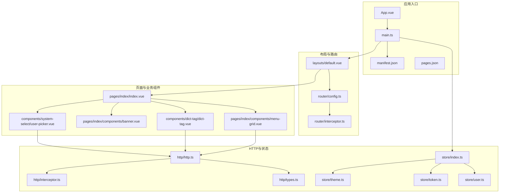
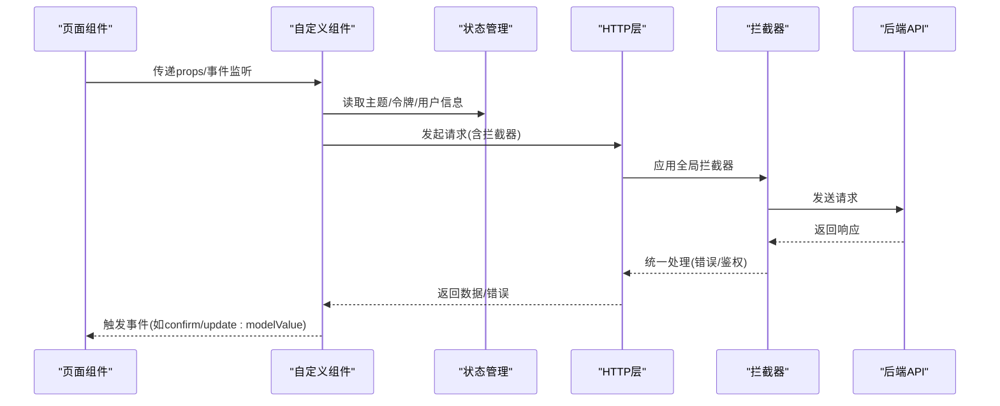
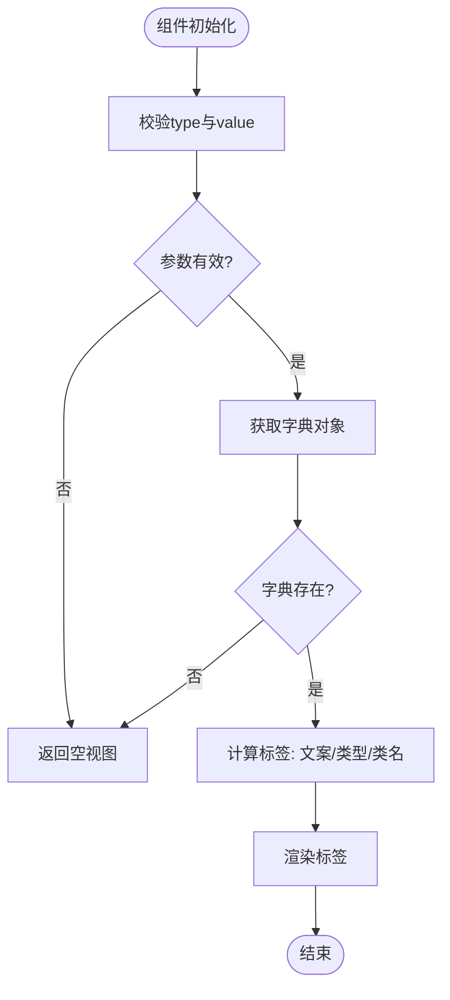
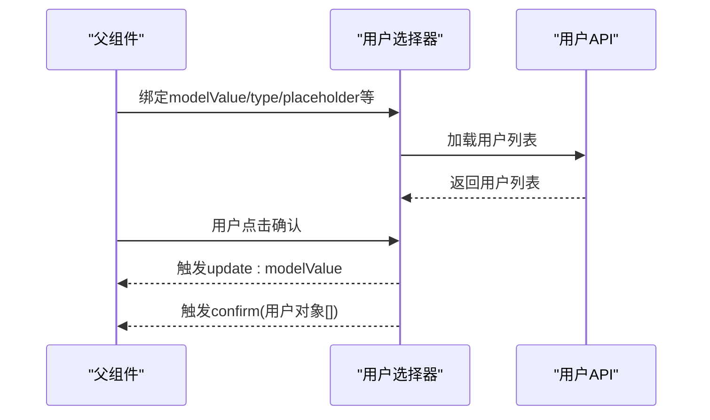
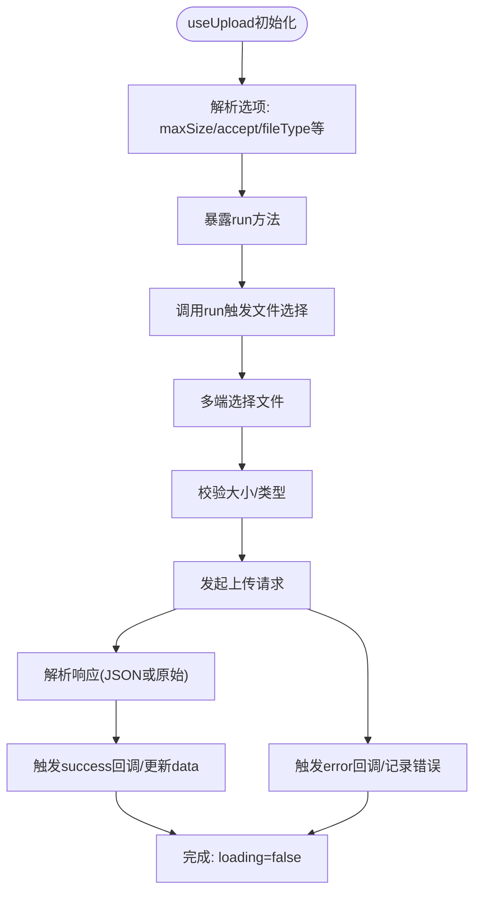
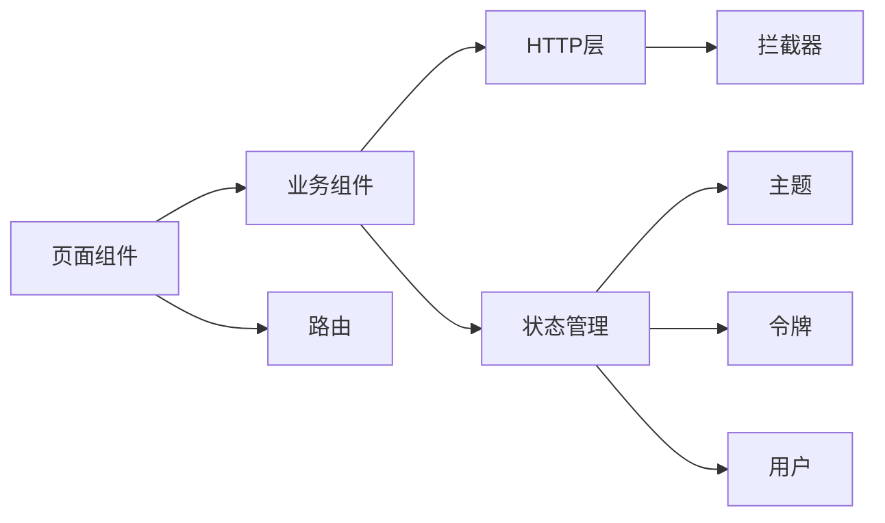

# 自定义组件开发

<cite>
**本文引用的文件**
- [dict-tag.vue](file://frontend/admin-uniapp/src/components/dict-tag/dict-tag.vue)
- [user-picker.vue](file://frontend/admin-uniapp/src/components/system-select/user-picker.vue)
- [useUpload.ts](file://frontend/admin-uniapp/src/hooks/useUpload.ts)
- [menu-grid.vue](file://frontend/admin-uniapp/src/pages/index/components/menu-grid.vue)
- [banner.vue](file://frontend/admin-uniapp/src/pages/index/components/banner.vue)
- [index.vue](file://frontend/admin-uniapp/src/pages/index/index.vue)
- [default.vue](file://frontend/admin-uniapp/src/layouts/default.vue)
- [http.ts](file://frontend/admin-uniapp/src/http/http.ts)
- [interceptor.ts](file://frontend/admin-uniapp/src/http/interceptor.ts)
- [types.ts](file://frontend/admin-uniapp/src/http/types.ts)
- [store.ts](file://frontend/admin-uniapp/src/store/index.ts)
- [theme.ts](file://frontend/admin-uniapp/src/store/theme.ts)
- [token.ts](file://frontend/admin-uniapp/src/store/token.ts)
- [user.ts](file://frontend/admin-uniapp/src/store/user.ts)
- [uni.scss](file://frontend/admin-uniapp/src/uni.scss)
- [index.scss](file://frontend/admin-uniapp/src/style/index.scss)
- [App.vue](file://frontend/admin-uniapp/src/App.vue)
- [main.ts](file://frontend/admin-uniapp/src/main.ts)
- [manifest.json](file://frontend/admin-uniapp/src/manifest.json)
- [pages.json](file://frontend/admin-uniapp/src/pages.json)
- [router-config.ts](file://frontend/admin-uniapp/src/router/config.ts)
- [router-interceptor.ts](file://frontend/admin-uniapp/src/router/interceptor.ts)
- [README.md](file://frontend/admin-uniapp/README.md)
</cite>

## 目录
1. [简介](#简介)
2. [项目结构](#项目结构)
3. [核心组件](#核心组件)
4. [架构总览](#架构总览)
5. [详细组件分析](#详细组件分析)
6. [依赖关系分析](#依赖关系分析)
7. [性能考虑](#性能考虑)
8. [故障排查指南](#故障排查指南)
9. [结论](#结论)
10. [附录](#附录)

## 简介
本技术文档面向AgenticCPS管理后台的自定义组件开发，聚焦于通用组件设计原则、组件接口规范与属性传递机制，系统讲解表单组件封装、表格组件定制、弹窗组件实现，以及上传组件开发、富文本编辑器集成、图表组件封装等主题。文档同时提供组件复用策略、事件处理机制、样式定制方法，并给出开发最佳实践、性能优化技巧与测试方法，帮助团队构建高质量、可维护的组件库。

## 项目结构
前端采用UniApp多端统一开发框架，组件主要位于admin-uniapp工程中，按功能域划分页面与组件，结合HTTP请求、状态管理与路由拦截形成完整的应用骨架。

**图表来源**
- [App.vue:1-200](file://frontend/admin-uniapp/src/App.vue#L1-L200)
- [main.ts:1-200](file://frontend/admin-uniapp/src/main.ts#L1-L200)
- [manifest.json:1-200](file://frontend/admin-uniapp/src/manifest.json#L1-L200)
- [pages.json:1-200](file://frontend/admin-uniapp/src/pages.json#L1-L200)
- [default.vue:1-200](file://frontend/admin-uniapp/src/layouts/default.vue#L1-L200)
- [router-config.ts:1-200](file://frontend/admin-uniapp/src/router/config.ts#L1-L200)
- [router-interceptor.ts:1-200](file://frontend/admin-uniapp/src/router/interceptor.ts#L1-L200)
- [index.vue:1-200](file://frontend/admin-uniapp/src/pages/index/index.vue#L1-L200)
- [menu-grid.vue:1-90](file://frontend/admin-uniapp/src/pages/index/components/menu-grid.vue#L1-L90)
- [banner.vue:1-36](file://frontend/admin-uniapp/src/pages/index/components/banner.vue#L1-L36)
- [user-picker.vue:1-117](file://frontend/admin-uniapp/src/components/system-select/user-picker.vue#L1-L117)
- [dict-tag.vue:1-63](file://frontend/admin-uniapp/src/components/dict-tag/dict-tag.vue#L1-L63)
- [http.ts:1-200](file://frontend/admin-uniapp/src/http/http.ts#L1-L200)
- [interceptor.ts:1-200](file://frontend/admin-uniapp/src/http/interceptor.ts#L1-L200)
- [types.ts:1-200](file://frontend/admin-uniapp/src/http/types.ts#L1-L200)
- [store.ts:1-200](file://frontend/admin-uniapp/src/store/index.ts#L1-L200)
- [theme.ts:1-200](file://frontend/admin-uniapp/src/store/theme.ts#L1-L200)
- [token.ts:1-200](file://frontend/admin-uniapp/src/store/token.ts#L1-L200)
- [user.ts:1-200](file://frontend/admin-uniapp/src/store/user.ts#L1-L200)

**章节来源**
- [App.vue:1-200](file://frontend/admin-uniapp/src/App.vue#L1-L200)
- [main.ts:1-200](file://frontend/admin-uniapp/src/main.ts#L1-L200)
- [manifest.json:1-200](file://frontend/admin-uniapp/src/manifest.json#L1-L200)
- [pages.json:1-200](file://frontend/admin-uniapp/src/pages.json#L1-L200)
- [default.vue:1-200](file://frontend/admin-uniapp/src/layouts/default.vue#L1-L200)
- [router-config.ts:1-200](file://frontend/admin-uniapp/src/router/config.ts#L1-L200)
- [router-interceptor.ts:1-200](file://frontend/admin-uniapp/src/router/interceptor.ts#L1-L200)

## 核心组件
本节梳理与自定义组件开发密切相关的现有组件，总结其设计原则与接口规范，为后续扩展提供参考。

- 字典标签组件（dict-tag）
  - 设计目标：基于后端字典类型与值渲染带颜色与样式的标签，支持镂空风格切换。
  - 关键特性：类型映射、空值保护、动态类名注入。
  - 接口要点：接收type与value作为必要参数；plain为可选布尔值；内部计算输出标签类型、文案与CSS类。
  - 适用场景：状态展示、标签分类、权限标识等。

- 用户选择器组件（user-picker）
  - 设计目标：封装用户列表选择，支持单选/多选、默认插槽、远程加载与确认事件。
  - 关键特性：双向绑定modelValue、确认回调携带完整用户对象、懒加载用户列表。
  - 接口要点：modelValue、type、label、placeholder、prop、useDefaultSlot；事件update:modelValue与confirm。
  - 适用场景：审批人选择、操作员指派、角色授权等。

- 上传Hook（useUpload）
  - 设计目标：抽象上传流程，适配多端差异，统一错误提示与结果解析。
  - 关键特性：多端兼容、文件类型与大小限制、成功/失败回调、loading/error/data状态暴露。
  - 接口要点：formData、maxSize、accept、fileType(image或file)、success、error；run触发选择与上传。
  - 适用场景：头像上传、附件上传、批量导入等。

- 首页菜单网格（menu-grid）
  - 设计目标：首页快捷入口网格，支持图标、颜色与跳转逻辑。
  - 关键特性：点击处理、tabBar页面与普通页面区分跳转、图标样式生成。
  - 接口要点：menus数组；内部处理URL解析与跳转。
  - 适用场景：功能导航、快捷入口。

- 首页轮播图（banner）
  - 设计目标：首页横幅轮播，支持自动播放与点击事件。
  - 关键特性：静态资源拼接、点击日志。
  - 接口要点：banners为图片地址数组；点击事件预留扩展。
  - 适用场景：活动推广、公告展示。

**章节来源**
- [dict-tag.vue:1-63](file://frontend/admin-uniapp/src/components/dict-tag/dict-tag.vue#L1-L63)
- [user-picker.vue:1-117](file://frontend/admin-uniapp/src/components/system-select/user-picker.vue#L1-L117)
- [useUpload.ts:1-173](file://frontend/admin-uniapp/src/hooks/useUpload.ts#L1-L173)
- [menu-grid.vue:1-90](file://frontend/admin-uniapp/src/pages/index/components/menu-grid.vue#L1-L90)
- [banner.vue:1-36](file://frontend/admin-uniapp/src/pages/index/components/banner.vue#L1-L36)

## 架构总览
下图展示组件开发与运行时的关键交互：页面组件通过props与events与子组件通信，子组件通过HTTP层访问后端服务，状态管理负责全局主题、令牌与用户信息，路由层控制页面跳转与拦截。

**图表来源**
- [index.vue:1-200](file://frontend/admin-uniapp/src/pages/index/index.vue#L1-L200)
- [user-picker.vue:1-117](file://frontend/admin-uniapp/src/components/system-select/user-picker.vue#L1-L117)
- [store.ts:1-200](file://frontend/admin-uniapp/src/store/index.ts#L1-L200)
- [http.ts:1-200](file://frontend/admin-uniapp/src/http/http.ts#L1-L200)
- [interceptor.ts:1-200](file://frontend/admin-uniapp/src/http/interceptor.ts#L1-L200)

## 详细组件分析

### 字典标签组件（dict-tag）分析
- 设计模式：函数式组件+计算属性，纯展示型组件，无副作用。
- 属性传递机制：通过withDefaults设置默认值；computed根据type/value计算标签信息。
- 样式定制：支持注入自定义CSS类，颜色类型映射到UI库类型。
- 错误处理：对无效参数直接返回空，避免异常传播。

**图表来源**
- [dict-tag.vue:1-63](file://frontend/admin-uniapp/src/components/dict-tag/dict-tag.vue#L1-L63)

**章节来源**
- [dict-tag.vue:1-63](file://frontend/admin-uniapp/src/components/dict-tag/dict-tag.vue#L1-L63)

### 用户选择器组件（user-picker）分析
- 设计模式：组合式API + 双向绑定 + 事件发射，支持默认插槽扩展。
- 属性传递机制：modelValue驱动选中态；type决定单选/多选；useDefaultSlot控制插槽渲染。
- 事件处理机制：update:modelValue用于v-model同步；confirm事件携带选中用户列表。
- 数据加载：onMounted时异步加载用户列表；watch监听外部modelValue变化以保持一致。
- 错误处理：选择确认时过滤无效值并发出空数组兜底。

**图表来源**
- [user-picker.vue:1-117](file://frontend/admin-uniapp/src/components/system-select/user-picker.vue#L1-L117)

**章节来源**
- [user-picker.vue:1-117](file://frontend/admin-uniapp/src/components/system-select/user-picker.vue#L1-L117)

### 上传组件开发（基于useUpload Hook）
- 设计原则：将上传流程抽象为可复用Hook，屏蔽多端差异与错误处理细节。
- 属性传递机制：通过选项对象配置表单数据、最大尺寸、接受类型、文件类型与回调。
- 事件处理机制：run触发文件选择；内部统一处理成功/失败/完成回调；对外暴露loading/error/data。
- 多端适配：针对微信小程序与非小程序分别调用不同API；统一解析后端返回数据。
- 错误处理：文件过大提示、选择失败记录、上传失败回调。

**图表来源**
- [useUpload.ts:1-173](file://frontend/admin-uniapp/src/hooks/useUpload.ts#L1-L173)

**章节来源**
- [useUpload.ts:1-173](file://frontend/admin-uniapp/src/hooks/useUpload.ts#L1-L173)

### 表单组件封装与表格组件定制
- 表单组件封装建议
  - 统一表单项接口：必填/禁用/只读/占位符/校验规则/错误提示。
  - 事件规范：change/input/blur等标准事件，支持v-model双向绑定。
  - 样式一致性：基于全局主题变量，支持暗色/明亮模式切换。
  - 可复用性：将校验、格式化、远程数据源抽取为可注入的Hook。
- 表格组件定制建议
  - 列定义：列宽、排序、筛选、固定列、合计行。
  - 数据加载：分页、懒加载、骨架屏、空态。
  - 交互：行选择、批量操作、行内编辑、导出。
  - 性能：虚拟滚动、列渲染优化、缓存策略。

[本节为概念性指导，不直接分析具体文件，故无“章节来源”]

### 弹窗组件实现
- 结构设计：容器组件承载标题、内容区、底部按钮；支持插槽扩展。
- 交互设计：open/close事件、确认/取消回调、遮罩点击关闭策略。
- 动画与过渡：基于CSS动画或UI库内置过渡，保证流畅体验。
- 可访问性：焦点管理、键盘导航、屏幕阅读器友好。

[本节为概念性指导，不直接分析具体文件，故无“章节来源”]

### 富文本编辑器集成
- 选型建议：基于wangeditor或Tiptap，结合Vue3 Composition API。
- 接口设计：value/v-model、工具栏配置、图片/视频上传钩子、内容校验。
- 安全与合规：内容过滤、XSS防护、敏感词检测。
- 性能优化：延迟加载、增量渲染、内容压缩。

[本节为概念性指导，不直接分析具体文件，故无“章节来源”]

### 图表组件封装
- 组件职责：接收数据与配置，渲染图表；支持主题、尺寸、交互。
- 抽象层次：底层使用ECharts或Chart.js；上层提供声明式配置。
- 性能优化：数据更新diff、懒加载、缩放与交互节流。
- 可复用性：主题变量、单位转换、国际化支持。

[本节为概念性指导，不直接分析具体文件，故无“章节来源”]

## 依赖关系分析
- 组件间耦合
  - 页面组件依赖业务组件（如menu-grid、user-picker），通过props与events解耦。
  - 业务组件依赖HTTP层与状态管理，避免直接耦合后端接口。
- 外部依赖
  - UI库：wot-design-uni提供基础组件（如grid、tag、select-picker等）。
  - 多端能力：uni-app提供跨平台API，useUpload中体现多端差异处理。
- 状态与路由
  - 全局状态：store模块化管理主题、令牌与用户信息。
  - 路由拦截：统一处理登录态与权限控制。

**图表来源**
- [index.vue:1-200](file://frontend/admin-uniapp/src/pages/index/index.vue#L1-L200)
- [user-picker.vue:1-117](file://frontend/admin-uniapp/src/components/system-select/user-picker.vue#L1-L117)
- [menu-grid.vue:1-90](file://frontend/admin-uniapp/src/pages/index/components/menu-grid.vue#L1-L90)
- [http.ts:1-200](file://frontend/admin-uniapp/src/http/http.ts#L1-L200)
- [interceptor.ts:1-200](file://frontend/admin-uniapp/src/http/interceptor.ts#L1-L200)
- [store.ts:1-200](file://frontend/admin-uniapp/src/store/index.ts#L1-L200)
- [theme.ts:1-200](file://frontend/admin-uniapp/src/store/theme.ts#L1-L200)
- [token.ts:1-200](file://frontend/admin-uniapp/src/store/token.ts#L1-L200)
- [user.ts:1-200](file://frontend/admin-uniapp/src/store/user.ts#L1-L200)

**章节来源**
- [store.ts:1-200](file://frontend/admin-uniapp/src/store/index.ts#L1-L200)
- [http.ts:1-200](file://frontend/admin-uniapp/src/http/http.ts#L1-L200)
- [interceptor.ts:1-200](file://frontend/admin-uniapp/src/http/interceptor.ts#L1-L200)

## 性能考虑
- 渲染优化
  - 使用computed与watch减少重复计算；合理拆分组件，避免不必要的重渲染。
  - 列表渲染使用key，避免列表错位与重复挂载。
- 请求优化
  - 合并请求、缓存响应、防抖/节流高频请求。
  - 在拦截器中统一处理错误与超时，避免组件内重复逻辑。
- 上传优化
  - useUpload中已实现文件大小限制与多端适配，建议在业务侧增加进度反馈与断点续传策略。
- 主题与样式
  - 使用SCSS变量与主题模块，减少样式重复与重绘。
  - 避免深层作用域选择器，降低样式复杂度。

[本节提供通用指导，不直接分析具体文件，故无“章节来源”]

## 故障排查指南
- 组件无显示或空白
  - 检查props是否正确传递；确认计算属性依赖的外部数据是否就绪。
  - 对照字典标签组件的参数校验逻辑，确保type与value有效。
- 事件未触发
  - 确认事件名称与参数是否与子组件一致；检查父组件是否正确绑定v-model与事件。
  - 对照用户选择器的事件发射逻辑，核对confirm事件的参数结构。
- 上传失败
  - 查看useUpload中的错误回调与loading状态；检查后端上传接口与跨域配置。
  - 确认文件大小与类型限制是否符合预期。
- 路由跳转异常
  - 检查路由拦截器与页面配置；确认tabBar页面与普通页面的跳转方式。
- 样式异常
  - 检查SCSS变量与主题模块；确认作用域选择器与样式优先级。

**章节来源**
- [dict-tag.vue:1-63](file://frontend/admin-uniapp/src/components/dict-tag/dict-tag.vue#L1-L63)
- [user-picker.vue:1-117](file://frontend/admin-uniapp/src/components/system-select/user-picker.vue#L1-L117)
- [useUpload.ts:1-173](file://frontend/admin-uniapp/src/hooks/useUpload.ts#L1-L173)
- [router-interceptor.ts:1-200](file://frontend/admin-uniapp/src/router/interceptor.ts#L1-L200)

## 结论
通过以上分析可知，AgenticCPS管理后台的组件体系以页面组件为中心，围绕业务组件、HTTP层与状态管理形成清晰的职责边界。现有组件展示了良好的接口规范与事件处理机制，为自定义组件开发提供了可复用的模式与最佳实践。建议在新组件开发中遵循统一的接口设计、事件规范与样式约定，结合useUpload等Hook提升可维护性与跨平台兼容性。

## 附录
- 开发最佳实践
  - 组件命名与目录结构：按功能域组织，组件文件与样式同目录。
  - 接口设计：明确必填/可选属性，提供合理的默认值与类型约束。
  - 事件命名：统一使用update:xxx与业务事件（如confirm），便于调试与维护。
  - 样式定制：基于主题变量与SCSS，避免硬编码颜色与尺寸。
- 测试方法
  - 单元测试：针对计算属性与事件处理逻辑编写测试用例。
  - 集成测试：模拟HTTP请求与路由拦截，验证组件在真实环境的行为。
  - 多端测试：在H5、App与小程序环境下验证组件表现与性能。
- 组件库建设方案
  - 规范化：制定组件开发规范、命名规范与提交规范。
  - 文档化：为每个组件提供使用示例、API文档与变更日志。
  - 可视化：建立组件演示站点，支持在线预览与交互调试。

[本节为概念性指导，不直接分析具体文件，故无“章节来源”]