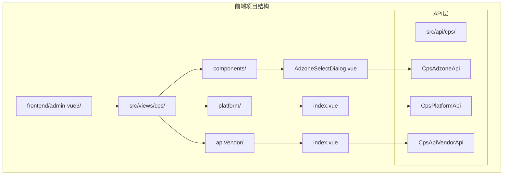
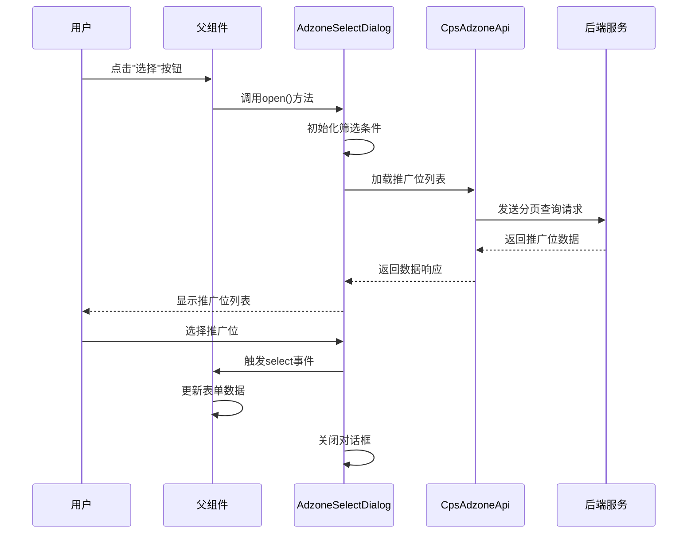
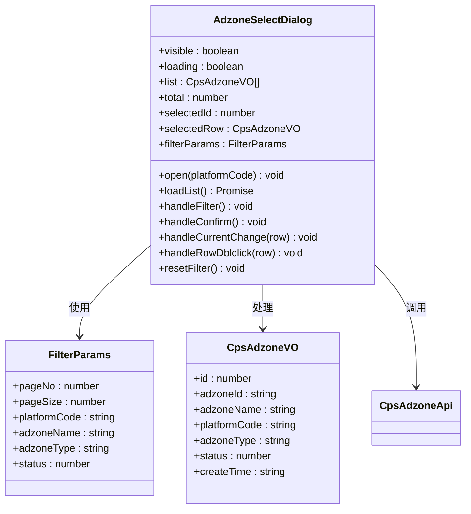
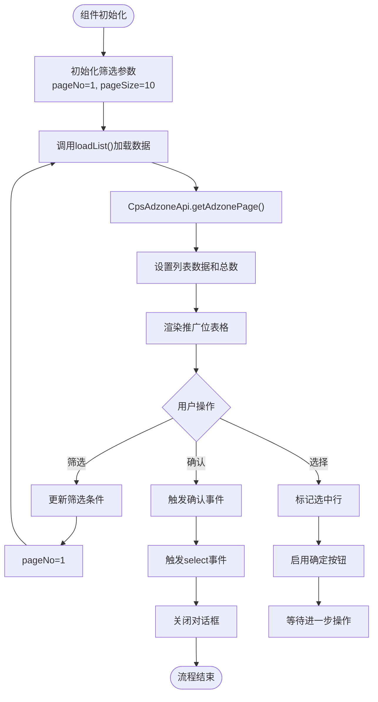
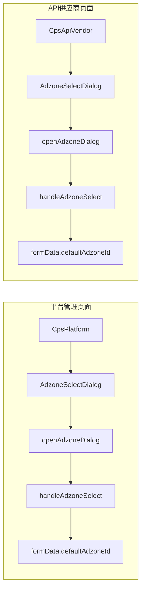
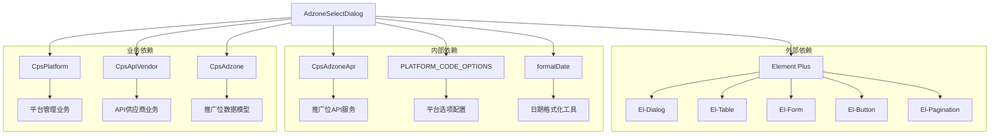
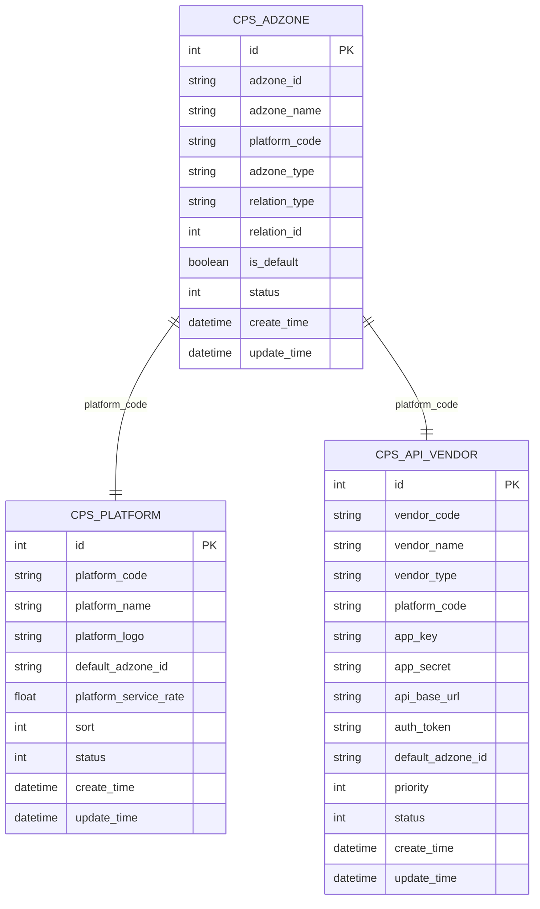

# 广告位选择对话框组件

<cite>
**本文档引用的文件**
- [AdzoneSelectDialog.vue](file://frontend/admin-vue3/src/views/cps/components/AdzoneSelectDialog.vue)
- [index.vue](file://frontend/admin-vue3/src/views/cps/platform/index.vue)
- [index.vue](file://frontend/admin-vue3/src/views/cps/apiVendor/index.vue)
- [init_cps_test_data.py](file://script/test/init_cps_test_data.py)
</cite>

## 目录
1. [简介](#简介)
2. [项目结构](#项目结构)
3. [核心组件](#核心组件)
4. [架构概览](#架构概览)
5. [详细组件分析](#详细组件分析)
6. [依赖关系分析](#依赖关系分析)
7. [性能考虑](#性能考虑)
8. [故障排除指南](#故障排除指南)
9. [结论](#结论)

## 简介

广告位选择对话框组件是CPS（佣金代理销售）系统中的关键UI组件，用于在平台管理和API供应商管理界面中选择合适的推广位（广告位）。该组件提供了完整的推广位选择功能，包括多条件筛选、分页加载、实时预览和确认选择等特性。

该组件采用Vue 3 Composition API开发，集成了Element Plus UI库，实现了响应式的用户交互体验。组件支持多种推广位类型（通用、渠道、会员专属），并提供直观的视觉反馈和操作指导。

## 项目结构

广告位选择对话框组件位于前端项目的CPS模块中，具体位置如下：



**图表来源**
- [AdzoneSelectDialog.vue:1-282](file://frontend/admin-vue3/src/views/cps/components/AdzoneSelectDialog.vue#L1-L282)
- [index.vue:1-334](file://frontend/admin-vue3/src/views/cps/platform/index.vue#L1-L334)

**章节来源**
- [AdzoneSelectDialog.vue:1-282](file://frontend/admin-vue3/src/views/cps/components/AdzoneSelectDialog.vue#L1-L282)
- [index.vue:1-334](file://frontend/admin-vue3/src/views/cps/platform/index.vue#L1-L334)

## 核心组件

### AdzoneSelectDialog 组件

AdzoneSelectDialog是整个广告位选择系统的核心组件，具有以下主要特性：

#### 主要功能
- **推广位筛选**：支持按平台编码、推广位名称、推广位类型、状态进行多条件筛选
- **分页加载**：支持大数据量的分页展示和懒加载
- **选择确认**：提供单选和双击确认两种选择方式
- **实时预览**：显示当前选中的推广位信息

#### 技术特性
- 基于Vue 3 Composition API开发
- 集成Element Plus UI组件库
- 支持响应式设计和移动端适配
- 内置完整的错误处理和状态管理

**章节来源**
- [AdzoneSelectDialog.vue:154-282](file://frontend/admin-vue3/src/views/cps/components/AdzoneSelectDialog.vue#L154-L282)

## 架构概览

广告位选择对话框组件在整个系统中的架构位置如下：



**图表来源**
- [AdzoneSelectDialog.vue:177-191](file://frontend/admin-vue3/src/views/cps/components/AdzoneSelectDialog.vue#L177-L191)
- [index.vue:283-291](file://frontend/admin-vue3/src/views/cps/platform/index.vue#L283-L291)

## 详细组件分析

### 组件结构分析



**图表来源**
- [AdzoneSelectDialog.vue:162-282](file://frontend/admin-vue3/src/views/cps/components/AdzoneSelectDialog.vue#L162-L282)

### 数据流分析



**图表来源**
- [AdzoneSelectDialog.vue:209-257](file://frontend/admin-vue3/src/views/cps/components/AdzoneSelectDialog.vue#L209-L257)

### 父组件集成分析

AdzoneSelectDialog组件在两个主要页面中被集成使用：

#### 平台管理页面集成



**图表来源**
- [index.vue:283-291](file://frontend/admin-vue3/src/views/cps/platform/index.vue#L283-L291)
- [index.vue:346-354](file://frontend/admin-vue3/src/views/cps/apiVendor/index.vue#L346-L354)

**章节来源**
- [AdzoneSelectDialog.vue:1-282](file://frontend/admin-vue3/src/views/cps/components/AdzoneSelectDialog.vue#L1-L282)
- [index.vue:283-291](file://frontend/admin-vue3/src/views/cps/platform/index.vue#L283-L291)
- [index.vue:346-354](file://frontend/admin-vue3/src/views/cps/apiVendor/index.vue#L346-L354)

## 依赖关系分析

### 组件依赖图



**图表来源**
- [AdzoneSelectDialog.vue:155-157](file://frontend/admin-vue3/src/views/cps/components/AdzoneSelectDialog.vue#L155-L157)
- [index.vue:236-240](file://frontend/admin-vue3/src/views/cps/platform/index.vue#L236-L240)

### 数据模型关系



**图表来源**
- [init_cps_test_data.py:144-168](file://script/test/init_cps_test_data.py#L144-L168)

**章节来源**
- [AdzoneSelectDialog.vue:155-157](file://frontend/admin-vue3/src/views/cps/components/AdzoneSelectDialog.vue#L155-L157)
- [index.vue:236-240](file://frontend/admin-vue3/src/views/cps/platform/index.vue#L236-L240)
- [init_cps_test_data.py:144-168](file://script/test/init_cps_test_data.py#L144-L168)

## 性能考虑

### 性能优化策略

1. **分页加载**：默认每页10条记录，支持10、20、50条切换，避免一次性加载大量数据
2. **懒加载机制**：只有在用户打开对话框时才发起API请求
3. **状态缓存**：组件内部维护筛选状态，避免重复请求相同条件的数据
4. **虚拟滚动**：Element Plus表格组件内置虚拟滚动，提升大数据量展示性能

### 内存管理

- 组件销毁时自动清理事件监听器和定时器
- 使用`destroy-on-close`属性确保对话框关闭时完全销毁DOM节点
- 及时清理响应式数据引用，防止内存泄漏

## 故障排除指南

### 常见问题及解决方案

#### 1. 对话框无法打开
**症状**：点击"选择"按钮后对话框不显示
**可能原因**：
- 父组件ref未正确获取
- 平台编码参数为空
- API请求失败

**解决方法**：
```typescript
// 确保正确获取组件ref
const adzoneDialogRef = ref<InstanceType<typeof AdzoneSelectDialog>>()

// 检查平台编码参数
const openAdzoneDialog = () => {
  const platformCode = formData.platformCode || undefined
  adzoneDialogRef.value?.open(platformCode)
}
```

#### 2. 推广位列表为空
**症状**：对话框显示"暂无推广位数据"
**可能原因**：
- 数据库中没有推广位数据
- 筛选条件过于严格
- API接口异常

**解决方法**：
```typescript
// 检查API响应
const loadList = async () => {
  try {
    const data = await CpsAdzoneApi.getAdzonePage(filterParams)
    console.log('API响应:', data)
    // ... 处理数据
  } catch (error) {
    console.error('API请求失败:', error)
  }
}
```

#### 3. 选择功能异常
**症状**：无法选择推广位或选择后无反应
**可能原因**：
- 事件监听器绑定错误
- 选中状态管理问题
- 父组件事件处理函数缺失

**解决方法**：
```typescript
// 确保正确绑定事件
<AdzoneSelectDialog ref="adzoneDialogRef" @select="handleAdzoneSelect" />

// 实现事件处理函数
const handleAdzoneSelect = (adzoneId: string) => {
  formData.defaultAdzoneId = adzoneId
  console.log('选中的推广位ID:', adzoneId)
}
```

**章节来源**
- [AdzoneSelectDialog.vue:177-191](file://frontend/admin-vue3/src/views/cps/components/AdzoneSelectDialog.vue#L177-L191)
- [index.vue:283-291](file://frontend/admin-vue3/src/views/cps/platform/index.vue#L283-L291)

## 结论

广告位选择对话框组件是CPS系统中实现推广位管理的关键UI组件。该组件通过以下特点实现了高效的推广位选择功能：

1. **完整的功能覆盖**：支持多条件筛选、分页加载、实时预览和确认选择
2. **良好的用户体验**：提供直观的操作界面和及时的反馈机制
3. **可靠的架构设计**：采用清晰的组件分离和事件通信机制
4. **完善的错误处理**：包含全面的异常处理和故障恢复机制

该组件的成功实现为CPS系统的推广位管理提供了坚实的技术基础，能够有效提升运营效率和用户体验。通过合理的性能优化和故障排除机制，确保了组件在生产环境中的稳定运行。