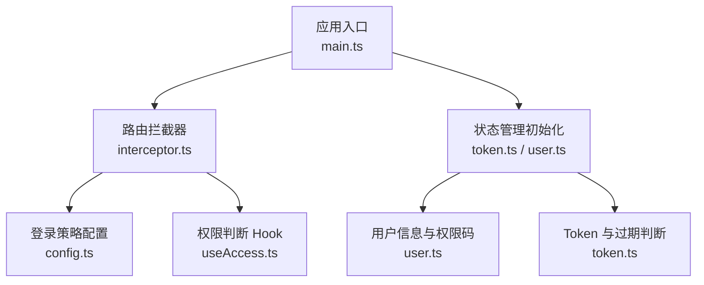
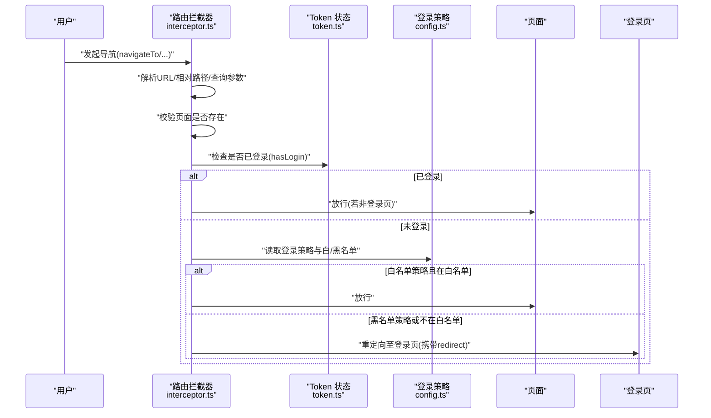
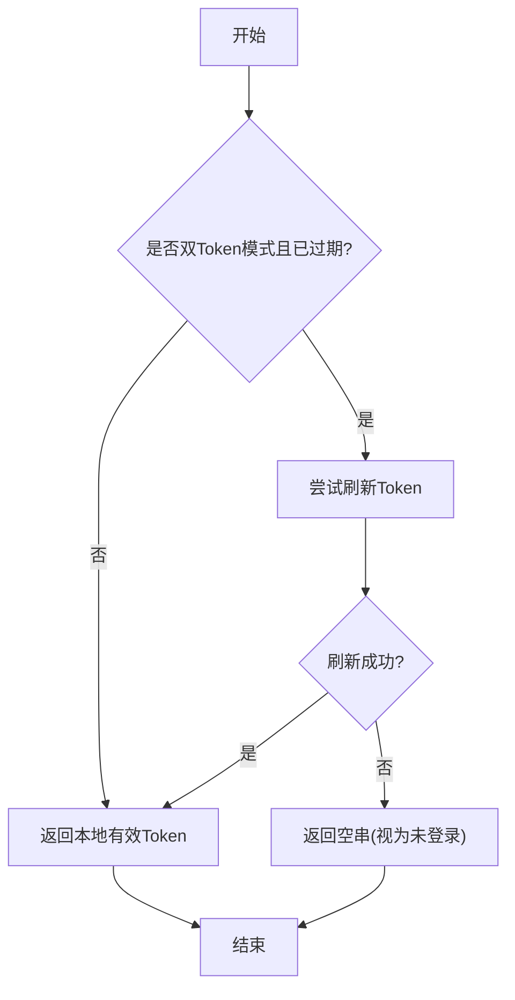
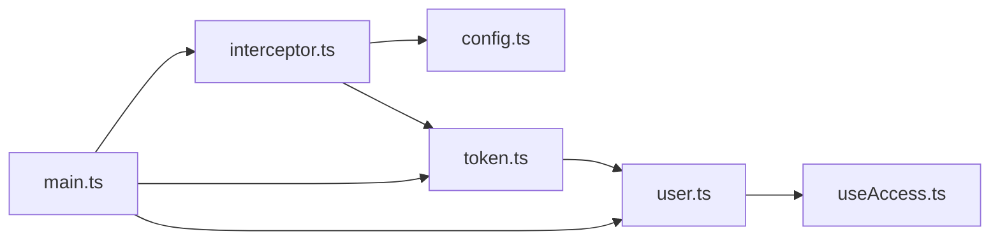

# 路由与权限系统

<cite>
**本文引用的文件**
- [frontend/admin-uniapp/src/router/config.ts](file://frontend/admin-uniapp/src/router/config.ts)
- [frontend/admin-uniapp/src/router/interceptor.ts](file://frontend/admin-uniapp/src/router/interceptor.ts)
- [frontend/admin-uniapp/src/store/token.ts](file://frontend/admin-uniapp/src/store/token.ts)
- [frontend/admin-uniapp/src/store/user.ts](file://frontend/admin-uniapp/src/store/user.ts)
- [frontend/admin-uniapp/src/hooks/useAccess.ts](file://frontend/admin-uniapp/src/hooks/useAccess.ts)
- [frontend/admin-uniapp/src/main.ts](file://frontend/admin-uniapp/src/main.ts)
</cite>

## 目录
1. [简介](#简介)
2. [项目结构](#项目结构)
3. [核心组件](#核心组件)
4. [架构总览](#架构总览)
5. [详细组件分析](#详细组件分析)
6. [依赖关系分析](#依赖关系分析)
7. [性能考量](#性能考量)
8. [故障排查指南](#故障排查指南)
9. [结论](#结论)
10. [附录](#附录)

## 简介
本文件面向 AgenticCPS 管理后台的前端路由与权限系统，聚焦于：
- 路由拦截与登录状态检查
- 白名单/黑名单两种登录策略
- 动态路由生成与菜单渲染思路
- 权限指令与按钮级权限控制
- 页面访问控制与嵌套路由处理
- 权限缓存与 Token 生命周期管理
- 路由懒加载与权限配置方法

目标是为开发者提供一套完整、可落地的权限控制解决方案与安全访问管理指导。

## 项目结构
管理后台采用 UniApp 技术栈，路由与权限相关的关键位置如下：
- 路由配置与拦截：frontend/admin-uniapp/src/router
- 状态管理（Token/用户）：frontend/admin-uniapp/src/store
- 权限 Hook：frontend/admin-uniapp/src/hooks/useAccess.ts
- 应用入口与初始化：frontend/admin-uniapp/src/main.ts

图表来源
- [frontend/admin-uniapp/src/main.ts:1-86](file://frontend/admin-uniapp/src/main.ts#L1-L86)
- [frontend/admin-uniapp/src/router/interceptor.ts:1-146](file://frontend/admin-uniapp/src/router/interceptor.ts#L1-L146)
- [frontend/admin-uniapp/src/router/config.ts:1-46](file://frontend/admin-uniapp/src/router/config.ts#L1-L46)
- [frontend/admin-uniapp/src/store/token.ts:1-342](file://frontend/admin-uniapp/src/store/token.ts#L1-L342)
- [frontend/admin-uniapp/src/store/user.ts:1-90](file://frontend/admin-uniapp/src/store/user.ts#L1-L90)
- [frontend/admin-uniapp/src/hooks/useAccess.ts:1-42](file://frontend/admin-uniapp/src/hooks/useAccess.ts#L1-L42)

章节来源
- [frontend/admin-uniapp/src/main.ts:1-86](file://frontend/admin-uniapp/src/main.ts#L1-L86)
- [frontend/admin-uniapp/src/router/config.ts:1-46](file://frontend/admin-uniapp/src/router/config.ts#L1-L46)
- [frontend/admin-uniapp/src/router/interceptor.ts:1-146](file://frontend/admin-uniapp/src/router/interceptor.ts#L1-L146)
- [frontend/admin-uniapp/src/store/token.ts:1-342](file://frontend/admin-uniapp/src/store/token.ts#L1-L342)
- [frontend/admin-uniapp/src/store/user.ts:1-90](file://frontend/admin-uniapp/src/store/user.ts#L1-L90)
- [frontend/admin-uniapp/src/hooks/useAccess.ts:1-42](file://frontend/admin-uniapp/src/hooks/useAccess.ts#L1-L42)

## 核心组件
- 登录策略与页面白/黑名单配置：用于决定“默认需要登录”还是“默认不需要登录”，以及哪些页面属于例外。
- 路由拦截器：统一处理 navigateTo/reLaunch/redirectTo/switchTab 等路由行为，完成登录态校验、重定向、Tabbar 自动索引修正等。
- Token 状态管理：负责登录、登出、Token 过期判断、刷新 Token、有效 Token 获取等。
- 用户信息与权限状态：保存用户角色与权限码，并提供持久化能力。
- 权限 Hook：提供基于角色与权限码的快速判断能力，便于在模板中进行按钮级权限控制。

章节来源
- [frontend/admin-uniapp/src/router/config.ts:1-46](file://frontend/admin-uniapp/src/router/config.ts#L1-L46)
- [frontend/admin-uniapp/src/router/interceptor.ts:1-146](file://frontend/admin-uniapp/src/router/interceptor.ts#L1-L146)
- [frontend/admin-uniapp/src/store/token.ts:1-342](file://frontend/admin-uniapp/src/store/token.ts#L1-L342)
- [frontend/admin-uniapp/src/store/user.ts:1-90](file://frontend/admin-uniapp/src/store/user.ts#L1-L90)
- [frontend/admin-uniapp/src/hooks/useAccess.ts:1-42](file://frontend/admin-uniapp/src/hooks/useAccess.ts#L1-L42)

## 架构总览
下图展示了从用户触发导航到最终路由放行或重定向的整体流程，包括登录策略、Token 校验、白/黑名单判定与 Tabbar 处理。

图表来源
- [frontend/admin-uniapp/src/router/interceptor.ts:36-136](file://frontend/admin-uniapp/src/router/interceptor.ts#L36-L136)
- [frontend/admin-uniapp/src/router/config.ts:3-46](file://frontend/admin-uniapp/src/router/config.ts#L3-L46)
- [frontend/admin-uniapp/src/store/token.ts:274-298](file://frontend/admin-uniapp/src/store/token.ts#L274-L298)

章节来源
- [frontend/admin-uniapp/src/router/interceptor.ts:1-146](file://frontend/admin-uniapp/src/router/interceptor.ts#L1-L146)
- [frontend/admin-uniapp/src/router/config.ts:1-46](file://frontend/admin-uniapp/src/router/config.ts#L1-L46)
- [frontend/admin-uniapp/src/store/token.ts:1-342](file://frontend/admin-uniapp/src/store/token.ts#L1-L342)

## 详细组件分析

### 组件一：登录策略与页面白/黑名单
- 登录策略枚举：提供“默认无需登录”和“默认需要登录”两种策略，便于切换白/黑名单模式。
- 登录页与异常页：集中定义登录页、注册页、短信登录页、忘记密码页、404 页、仅 PC 页等路径。
- 白/黑名单列表：在“默认需要登录”模式下，该列表为白名单；在“默认无需登录”模式下，该列表为黑名单。
- 开发环境动态补充：非开发环境仅一次性补充，生产环境按需更新，保证稳定性与性能。

章节来源
- [frontend/admin-uniapp/src/router/config.ts:3-46](file://frontend/admin-uniapp/src/router/config.ts#L3-L46)

### 组件二：路由拦截器与登录拦截
- 拦截范围：统一拦截 navigateTo/reLaunch/redirectTo/switchTab，确保所有页面跳转均受控。
- 相对路径处理：自动将相对路径转换为绝对路径，避免跳转异常。
- 页面存在性校验：若目标页面不存在，统一跳转至 404 页面。
- Tabbar 自动索引：根据目标路径修正 Tabbar 当前索引，提升 Tab 场景体验。
- 登录态优先：已登录用户直接放行（除登录页本身），避免重复跳转。
- 白/黑名单策略：
  - 白名单策略：白名单内直接放行，其余跳转登录页。
  - 黑名单策略：黑名单内强制跳转登录页，其余放行。
- 登录页例外：若目标即为登录页，直接放行。
- 重定向参数：携带 redirect 参数，登录成功后回到原页面。

章节来源
- [frontend/admin-uniapp/src/router/interceptor.ts:36-136](file://frontend/admin-uniapp/src/router/interceptor.ts#L36-L136)

### 组件三：Token 状态管理与登录生命周期
- 登录流程：支持账号/注册/短信/微信等多种登录方式，登录成功后写入 Token 并拉取用户信息与字典缓存。
- 登出流程：调用后端登出接口，清理本地存储的 Token 与过期时间、用户信息与字典缓存。
- Token 过期判断：基于本地存储的过期时间戳判断，单/双 Token 模式分别处理。
- 双 Token 刷新：在双 Token 模式下，当访问令牌过期且刷新令牌有效时尝试刷新。
- 有效 Token 获取：提供 tryGetValidToken 与 getValidToken，便于网络层统一注入。

图表来源
- [frontend/admin-uniapp/src/store/token.ts:257-316](file://frontend/admin-uniapp/src/store/token.ts#L257-L316)

章节来源
- [frontend/admin-uniapp/src/store/token.ts:104-161](file://frontend/admin-uniapp/src/store/token.ts#L104-L161)
- [frontend/admin-uniapp/src/store/token.ts:200-222](file://frontend/admin-uniapp/src/store/token.ts#L200-L222)
- [frontend/admin-uniapp/src/store/token.ts:228-250](file://frontend/admin-uniapp/src/store/token.ts#L228-L250)
- [frontend/admin-uniapp/src/store/token.ts:257-316](file://frontend/admin-uniapp/src/store/token.ts#L257-L316)

### 组件四：用户信息与权限状态
- 用户信息：保存用户基础资料、角色列表、权限码列表、常用菜单等。
- 权限数据来源：通过获取权限信息接口填充，兼容后端字段差异。
- 持久化：Pinia Store 配置持久化，刷新页面后仍保持登录态与权限信息。

章节来源
- [frontend/admin-uniapp/src/store/user.ts:17-89](file://frontend/admin-uniapp/src/store/user.ts#L17-L89)

### 组件五：权限 Hook（按钮级权限）
- 角色权限：基于用户角色集合与目标角色列表求交集，任一匹配即通过。
- 权限码：基于用户权限码集合与目标权限码列表求交集，任一匹配即通过。
- 使用建议：在模板中通过 v-if 或条件渲染结合 Hook 返回值实现按钮级权限控制。

章节来源
- [frontend/admin-uniapp/src/hooks/useAccess.ts:7-38](file://frontend/admin-uniapp/src/hooks/useAccess.ts#L7-L38)

### 组件六：动态路由与菜单生成（设计建议）
- 动态路由生成思路：后端返回用户可访问的菜单树，前端根据菜单树动态生成路由配置，结合 keep-alive 与懒加载实现高性能渲染。
- 菜单动态生成：将后端菜单树映射为路由表，支持隐藏/显示、图标、权限码等属性，结合权限 Hook 控制菜单项展示。
- 路由懒加载：使用动态 import 实现按需加载，减少首屏体积。
- 嵌套路由：根据菜单层级生成父子关系路由，支持多级菜单与面包屑联动。
- 权限缓存：将用户权限码与菜单树缓存至本地，首次加载后可直接渲染，后续刷新保持一致。

（本节为概念性说明，不直接分析具体文件）

## 依赖关系分析
- 应用入口 main.ts 负责初始化路由与状态管理，并挂载应用。
- 路由拦截器依赖登录策略配置、Token 状态与工具函数，实现统一拦截。
- Token 状态依赖用户状态与字典状态，形成认证链路闭环。
- 权限 Hook 依赖用户状态，提供模板层权限判断能力。

图表来源
- [frontend/admin-uniapp/src/main.ts:28-32](file://frontend/admin-uniapp/src/main.ts#L28-L32)
- [frontend/admin-uniapp/src/router/interceptor.ts:8-12](file://frontend/admin-uniapp/src/router/interceptor.ts#L8-L12)
- [frontend/admin-uniapp/src/store/token.ts:24-25](file://frontend/admin-uniapp/src/store/token.ts#L24-L25)
- [frontend/admin-uniapp/src/store/user.ts:1-7](file://frontend/admin-uniapp/src/store/user.ts#L1-L7)
- [frontend/admin-uniapp/src/hooks/useAccess.ts:1](file://frontend/admin-uniapp/src/hooks/useAccess.ts#L1)

章节来源
- [frontend/admin-uniapp/src/main.ts:1-86](file://frontend/admin-uniapp/src/main.ts#L1-L86)
- [frontend/admin-uniapp/src/router/interceptor.ts:1-146](file://frontend/admin-uniapp/src/router/interceptor.ts#L1-L146)
- [frontend/admin-uniapp/src/store/token.ts:1-342](file://frontend/admin-uniapp/src/store/token.ts#L1-L342)
- [frontend/admin-uniapp/src/store/user.ts:1-90](file://frontend/admin-uniapp/src/store/user.ts#L1-L90)
- [frontend/admin-uniapp/src/hooks/useAccess.ts:1-42](file://frontend/admin-uniapp/src/hooks/useAccess.ts#L1-L42)

## 性能考量
- 路由拦截器仅在非开发环境一次性补充白/黑名单，避免频繁扫描页面配置。
- Token 过期判断基于本地时间戳，减少额外请求。
- 双 Token 刷新仅在访问令牌过期且刷新令牌有效时触发，降低刷新频率。
- 建议：动态路由与菜单生成采用懒加载与缓存策略，结合 keep-alive 优化页面切换性能。

（本节为通用性能建议，不直接分析具体文件）

## 故障排查指南
- 登录后仍被重定向到登录页
  - 检查登录策略配置与白/黑名单列表是否正确。
  - 确认 Token 是否成功写入与过期时间是否正确。
- 页面不存在跳转 404
  - 检查路由拦截器对页面存在性校验逻辑与 pages.json 配置。
- Tabbar 索引不正确
  - 检查拦截器中自动索引修正逻辑与目标路径格式。
- 权限按钮不显示
  - 检查用户权限码与角色集合，确认权限 Hook 返回值。
- Token 刷新失败
  - 检查双 Token 模式与刷新接口返回，确认刷新令牌有效性。

章节来源
- [frontend/admin-uniapp/src/router/interceptor.ts:52-65](file://frontend/admin-uniapp/src/router/interceptor.ts#L52-L65)
- [frontend/admin-uniapp/src/router/interceptor.ts:73-75](file://frontend/admin-uniapp/src/router/interceptor.ts#L73-L75)
- [frontend/admin-uniapp/src/store/token.ts:228-250](file://frontend/admin-uniapp/src/store/token.ts#L228-L250)

## 结论
本方案通过“登录策略 + 路由拦截器 + Token 状态管理 + 权限 Hook”的组合，实现了统一、可控、可扩展的权限与路由体系。配合动态路由与菜单生成、懒加载与缓存策略，可在保证安全的前提下获得良好的用户体验。建议在实际项目中结合业务场景完善权限模型与异常处理流程。

## 附录

### 权限配置方法
- 登录策略
  - 在登录策略配置中选择“默认需要登录”或“默认不需要登录”，并维护对应的白/黑名单列表。
- 页面白/黑名单
  - 在对应模式下，将无需登录或必须登录的页面加入白/黑名单。
- 权限码与角色
  - 在用户状态中维护权限码与角色集合，供权限 Hook 使用。

章节来源
- [frontend/admin-uniapp/src/router/config.ts:3-46](file://frontend/admin-uniapp/src/router/config.ts#L3-L46)
- [frontend/admin-uniapp/src/store/user.ts:23-37](file://frontend/admin-uniapp/src/store/user.ts#L23-L37)

### 路由白名单设置
- 白名单策略：白名单内页面无需登录即可访问。
- 黑名单策略：黑名单内页面必须登录才可访问。
- 动态补充：非开发环境仅一次性补充，开发环境每次读取最新配置。

章节来源
- [frontend/admin-uniapp/src/router/interceptor.ts:16-34](file://frontend/admin-uniapp/src/router/interceptor.ts#L16-L34)
- [frontend/admin-uniapp/src/router/config.ts:35-40](file://frontend/admin-uniapp/src/router/config.ts#L35-L40)

### 嵌套路由处理
- 建议：根据菜单层级生成父子关系路由，支持多级菜单与面包屑联动。
- Keep-alive：对需要保留状态的页面启用缓存，提升切换性能。
- 懒加载：使用动态 import 实现按需加载，减少首屏体积。

（本节为通用实践建议，不直接分析具体文件）

### 登录状态检查与权限验证流程
- 登录状态检查：优先判断是否已登录，已登录则直接放行。
- 权限验证：根据登录策略与白/黑名单列表决定是否重定向登录页。
- 重定向回跳：携带 redirect 参数，登录成功后回到原页面。

章节来源
- [frontend/admin-uniapp/src/router/interceptor.ts:84-98](file://frontend/admin-uniapp/src/router/interceptor.ts#L84-L98)
- [frontend/admin-uniapp/src/router/interceptor.ts:106-133](file://frontend/admin-uniapp/src/router/interceptor.ts#L106-L133)