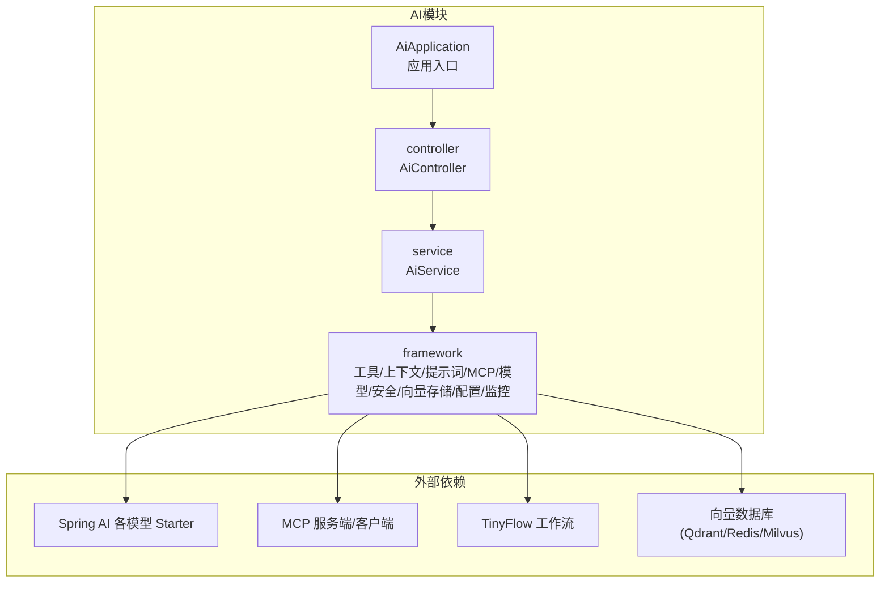
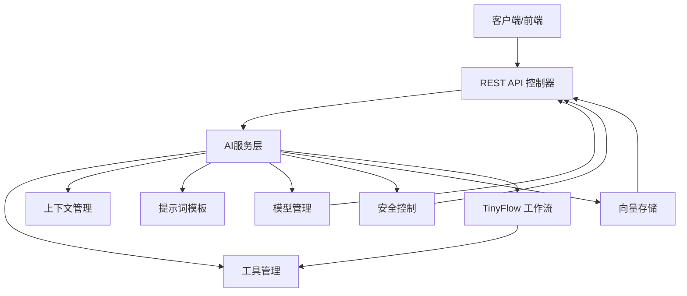
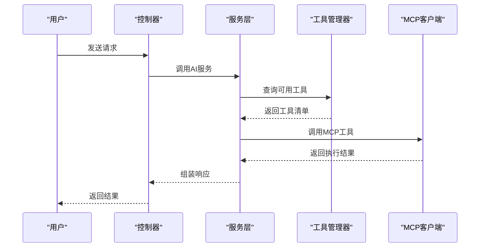
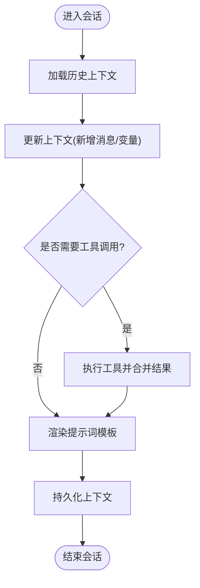
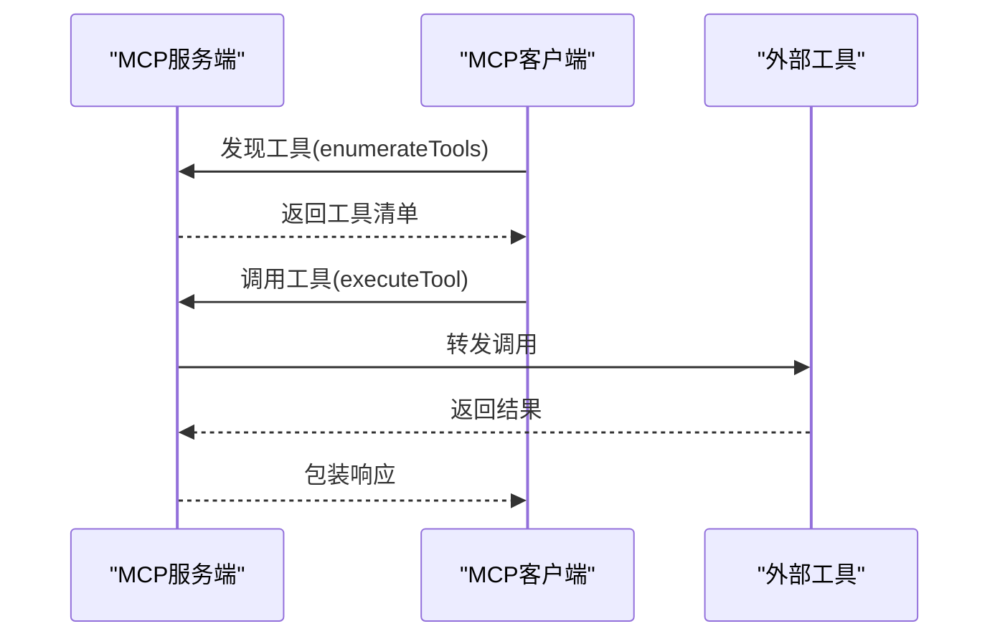
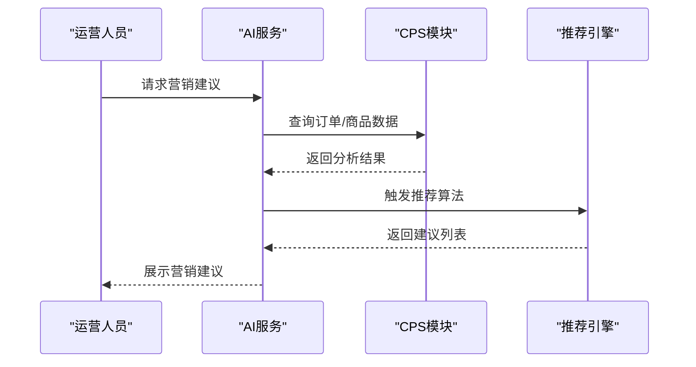
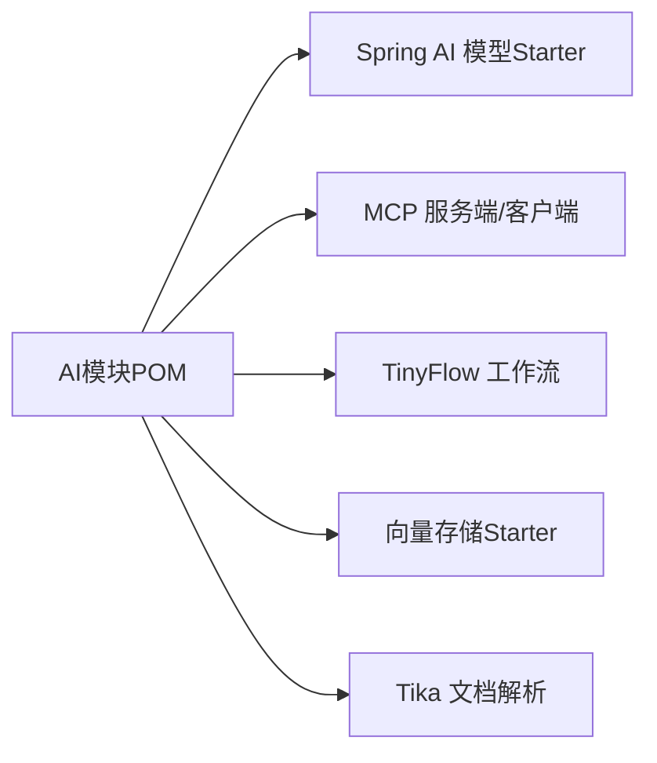

# AI智能模块

<cite>
**本文档引用的文件**
- [pom.xml](file://backend/yudao-module-ai/pom.xml)
- [README.md](file://README.md)
- [CPS系统PRD文档.md](file://docs/CPS系统PRD文档.md)
- [AiApplication.java](file://backend/yudao-module-ai/src/main/java/cn/iocoder/yudao/module/ai/AiApplication.java)
- [AiController.java](file://backend/yudao-module-ai/src/main/java/cn/iocoder/yudao/module/ai/controller/AiController.java)
- [AiService.java](file://backend/yudao-module-ai/src/main/java/cn/iocoder/yudao/module/ai/service/AiService.java)
- [ToolManager.java](file://backend/yudao-module-ai/src/main/java/cn/iocoder/yudao/module/ai/framework/tool/ToolManager.java)
- [ContextManager.java](file://backend/yudao-module-ai/src/main/java/cn/iocoder/yudao/module/ai/framework/context/ContextManager.java)
- [PromptTemplate.java](file://backend/yudao-module-ai/src/main/java/cn/iocoder/yudao/module/ai/framework/prompt/PromptTemplate.java)
- [MCPIntegration.java](file://backend/yudao-module-ai/src/main/java/cn/iocoder/yudao/module/ai/framework/mcp/MCPIntegration.java)
- [ModelManager.java](file://backend/yudao-module-ai/src/main/java/cn/iocoder/yudao/module/ai/framework/model/ModelManager.java)
- [SecurityControl.java](file://backend/yudao-module-ai/src/main/java/cn/iocoder/yudao/module/ai/framework/security/SecurityControl.java)
- [CpsIntegration.java](file://backend/yudao-module-ai/src/main/java/cn/iocoder/yudao/module/ai/framework/cps/CpsIntegration.java)
- [RecommendationEngine.java](file://backend/yudao-module-ai/src/main/java/cn/iocoder/yudao/module/ai/framework/recommendation/RecommendationEngine.java)
- [VectorStore.java](file://backend/yudao-module-ai/src/main/java/cn/iocoder/yudao/module/ai/framework/vectorstore/VectorStore.java)
- [AiConfig.java](file://backend/yudao-module-ai/src/main/java/cn/iocoder/yudao/module/ai/framework/config/AiConfig.java)
- [AiMonitor.java](file://backend/yudao-module-ai/src/main/java/cn/iocoder/yudao/module/ai/framework/monitor/AiMonitor.java)
- [AiException.java](file://backend/yudao-module-ai/src/main/java/cn/iocoder/yudao/module/ai/framework/exception/AiException.java)
</cite>

## 目录
1. [简介](#简介)
2. [项目结构](#项目结构)
3. [核心组件](#核心组件)
4. [架构总览](#架构总览)
5. [详细组件分析](#详细组件分析)
6. [依赖关系分析](#依赖关系分析)
7. [性能考虑](#性能考虑)
8. [故障排查指南](#故障排查指南)
9. [结论](#结论)
10. [附录](#附录)

## 简介
本文件面向AI智能模块的综合技术文档，涵盖以下主题：
- 核心能力：MCP协议集成、工具函数管理、资源管理、提示词模板、自然语言交互、智能推荐
- 框架架构：模型管理、工具函数注册机制、上下文管理
- 与CPS模块的智能集成：商品搜索、订单分析、营销建议
- 安全控制：权限管理、调用限制
- 开发指南：AI工具函数开发、MCP协议规范、性能优化策略
- 配置参数、监控指标、故障排查与扩展开发方案

## 项目结构
AI模块位于后端工程中，采用多模块聚合结构，核心依赖Spring AI生态与TinyFlow工作流引擎，并通过MCP协议实现外部工具与服务的统一接入。

**图表来源**
- [pom.xml:77-261](file://backend/yudao-module-ai/pom.xml#L77-L261)

**章节来源**
- [pom.xml:1-265](file://backend/yudao-module-ai/pom.xml#L1-L265)

## 核心组件
- 应用入口与控制器：负责对外提供AI服务接口，协调工具与上下文处理。
- 服务层：封装AI交互逻辑，包括模型选择、提示词模板渲染、工具调用编排。
- 框架层：
  - 工具管理：注册与执行外部工具函数，支持MCP协议工具。
  - 上下文管理：维护会话状态、历史消息与资源上下文。
  - 提示词模板：标准化提示词构建与参数注入。
  - MCP集成：服务端与客户端双向集成，适配Spring MVC。
  - 模型管理：统一接入国内外主流大模型与多模态模型。
  - 安全控制：权限校验、调用频率限制与敏感信息过滤。
  - 向量存储：文档解析与向量检索，支撑RAG与知识增强。
  - 配置与监控：集中式配置、运行时指标采集与告警。
- 与CPS集成：基于订单与商品数据进行分析与营销建议生成。
- 推荐引擎：结合用户行为与商品特征，输出个性化推荐。

**章节来源**
- [AiApplication.java](file://backend/yudao-module-ai/src/main/java/cn/iocoder/yudao/module/ai/AiApplication.java)
- [AiController.java](file://backend/yudao-module-ai/src/main/java/cn/iocoder/yudao/module/ai/controller/AiController.java)
- [AiService.java](file://backend/yudao-module-ai/src/main/java/cn/iocoder/yudao/module/ai/service/AiService.java)
- [ToolManager.java](file://backend/yudao-module-ai/src/main/java/cn/iocoder/yudao/module/ai/framework/tool/ToolManager.java)
- [ContextManager.java](file://backend/yudao-module-ai/src/main/java/cn/iocoder/yudao/module/ai/framework/context/ContextManager.java)
- [PromptTemplate.java](file://backend/yudao-module-ai/src/main/java/cn/iocoder/yudao/module/ai/framework/prompt/PromptTemplate.java)
- [MCPIntegration.java](file://backend/yudao-module-ai/src/main/java/cn/iocoder/yudao/module/ai/framework/mcp/MCPIntegration.java)
- [ModelManager.java](file://backend/yudao-module-ai/src/main/java/cn/iocoder/yudao/module/ai/framework/model/ModelManager.java)
- [SecurityControl.java](file://backend/yudao-module-ai/src/main/java/cn/iocoder/yudao/module/ai/framework/security/SecurityControl.java)
- [CpsIntegration.java](file://backend/yudao-module-ai/src/main/java/cn/iocoder/yudao/module/ai/framework/cps/CpsIntegration.java)
- [RecommendationEngine.java](file://backend/yudao-module-ai/src/main/java/cn/iocoder/yudao/module/ai/framework/recommendation/RecommendationEngine.java)
- [VectorStore.java](file://backend/yudao-module-ai/src/main/java/cn/iocoder/yudao/module/ai/framework/vectorstore/VectorStore.java)
- [AiConfig.java](file://backend/yudao-module-ai/src/main/java/cn/iocoder/yudao/module/ai/framework/config/AiConfig.java)
- [AiMonitor.java](file://backend/yudao-module-ai/src/main/java/cn/iocoder/yudao/module/ai/framework/monitor/AiMonitor.java)

## 架构总览
AI模块采用分层架构，围绕"控制器-服务-框架"三层设计，配合MCP协议与TinyFlow工作流，实现从自然语言到工具执行的闭环。

**图表来源**
- [AiController.java](file://backend/yudao-module-ai/src/main/java/cn/iocoder/yudao/module/ai/controller/AiController.java)
- [AiService.java](file://backend/yudao-module-ai/src/main/java/cn/iocoder/yudao/module/ai/service/AiService.java)
- [ToolManager.java](file://backend/yudao-module-ai/src/main/java/cn/iocoder/yudao/module/ai/framework/tool/ToolManager.java)
- [ContextManager.java](file://backend/yudao-module-ai/src/main/java/cn/iocoder/yudao/module/ai/framework/context/ContextManager.java)
- [PromptTemplate.java](file://backend/yudao-module-ai/src/main/java/cn/iocoder/yudao/module/ai/framework/prompt/PromptTemplate.java)
- [ModelManager.java](file://backend/yudao-module-ai/src/main/java/cn/iocoder/yudao/module/ai/framework/model/ModelManager.java)
- [SecurityControl.java](file://backend/yudao-module-ai/src/main/java/cn/iocoder/yudao/module/ai/framework/security/SecurityControl.java)
- [VectorStore.java](file://backend/yudao-module-ai/src/main/java/cn/iocoder/yudao/module/ai/framework/vectorstore/VectorStore.java)
- [AiService.java](file://backend/yudao-module-ai/src/main/java/cn/iocoder/yudao/module/ai/service/AiService.java)

## 详细组件分析

### 工具函数管理
- 注册机制：通过工具管理器集中注册外部工具，支持MCP协议工具与本地函数。
- 执行流程：根据上下文与提示词选择合适工具，执行并返回结果。
- 安全约束：对工具输入进行参数校验与白名单控制。

**图表来源**
- [AiController.java](file://backend/yudao-module-ai/src/main/java/cn/iocoder/yudao/module/ai/controller/AiController.java)
- [AiService.java](file://backend/yudao-module-ai/src/main/java/cn/iocoder/yudao/module/ai/service/AiService.java)
- [ToolManager.java](file://backend/yudao-module-ai/src/main/java/cn/iocoder/yudao/module/ai/framework/tool/ToolManager.java)
- [MCPIntegration.java](file://backend/yudao-module-ai/src/main/java/cn/iocoder/yudao/module/ai/framework/mcp/MCPIntegration.java)

**章节来源**
- [ToolManager.java](file://backend/yudao-module-ai/src/main/java/cn/iocoder/yudao/module/ai/framework/tool/ToolManager.java)
- [MCPIntegration.java](file://backend/yudao-module-ai/src/main/java/cn/iocoder/yudao/module/ai/framework/mcp/MCPIntegration.java)

### 上下文管理
- 会话状态：维护用户对话历史、角色设定与临时变量。
- 资源上下文：在工具调用前后注入必要的环境变量与鉴权信息。
- 生命周期：按会话维度清理过期上下文，避免内存泄漏。

**图表来源**
- [ContextManager.java](file://backend/yudao-module-ai/src/main/java/cn/iocoder/yudao/module/ai/framework/context/ContextManager.java)
- [PromptTemplate.java](file://backend/yudao-module-ai/src/main/java/cn/iocoder/yudao/module/ai/framework/prompt/PromptTemplate.java)

**章节来源**
- [ContextManager.java](file://backend/yudao-module-ai/src/main/java/cn/iocoder/yudao/module/ai/framework/context/ContextManager.java)
- [PromptTemplate.java](file://backend/yudao-module-ai/src/main/java/cn/iocoder/yudao/module/ai/framework/prompt/PromptTemplate.java)

### 提示词模板
- 模板化：将固定格式与动态参数分离，便于复用与迭代。
- 参数注入：支持字符串、JSON对象、文件路径等多种类型参数。
- 多模态：适配文本、图像、音频等多模态输入的提示词构造。

**章节来源**
- [PromptTemplate.java](file://backend/yudao-module-ai/src/main/java/cn/iocoder/yudao/module/ai/framework/prompt/PromptTemplate.java)

### MCP协议集成
- 服务端：提供MCP服务器能力，暴露工具清单与执行接口。
- 客户端：以WebMvc兼容方式调用外部MCP工具，避免SSE失效问题。
- 协议规范：遵循MCP标准，确保工具发现、描述与调用的一致性。

**图表来源**
- [MCPIntegration.java](file://backend/yudao-module-ai/src/main/java/cn/iocoder/yudao/module/ai/framework/mcp/MCPIntegration.java)
- [pom.xml:203-220](file://backend/yudao-module-ai/pom.xml#L203-L220)

**章节来源**
- [MCPIntegration.java](file://backend/yudao-module-ai/src/main/java/cn/iocoder/yudao/module/ai/framework/mcp/MCPIntegration.java)
- [pom.xml:198-221](file://backend/yudao-module-ai/pom.xml#L198-L221)

### 模型管理
- 多模型接入：OpenAI、Azure OpenAI、Anthropic、DeepSeek、Ollama、Stability AI、智谱GLM、通义千问、文心一言、月之暗面等。
- 统一抽象：通过模型管理器屏蔽底层差异，支持切换与负载均衡。
- 多模态：支持文本、图像、音频等多模态模型。

**章节来源**
- [ModelManager.java](file://backend/yudao-module-ai/src/main/java/cn/iocoder/yudao/module/ai/framework/model/ModelManager.java)
- [pom.xml:77-145](file://backend/yudao-module-ai/pom.xml#L77-L145)

### 安全控制与权限管理
- 权限校验：基于租户与用户角色的访问控制。
- 调用限制：频率限制、并发数控制与配额管理。
- 敏感信息：输入输出过滤、脱敏与审计日志。

**章节来源**
- [SecurityControl.java](file://backend/yudao-module-ai/src/main/java/cn/iocoder/yudao/module/ai/framework/security/SecurityControl.java)

### 向量存储与RAG
- 文档解析：使用Tika进行多格式文档解析。
- 向量嵌入：支持Qdrant、Redis、Milvus等向量数据库。
- 检索增强：结合检索结果与原始提示词，提升回答准确性。

**章节来源**
- [VectorStore.java](file://backend/yudao-module-ai/src/main/java/cn/iocoder/yudao/module/ai/framework/vectorstore/VectorStore.java)
- [pom.xml:180-196](file://backend/yudao-module-ai/pom.xml#L180-L196)
- [pom.xml:147-178](file://backend/yudao-module-ai/pom.xml#L147-L178)

### 与CPS模块的智能集成
- 商品搜索：基于订单与商品画像，提供智能搜索建议。
- 订单分析：识别异常订单、促销效果与客户行为模式。
- 营销建议：结合历史数据与实时趋势，生成个性化营销策略。

**图表来源**
- [CpsIntegration.java](file://backend/yudao-module-ai/src/main/java/cn/iocoder/yudao/module/ai/framework/cps/CpsIntegration.java)
- [RecommendationEngine.java](file://backend/yudao-module-ai/src/main/java/cn/iocoder/yudao/module/ai/framework/recommendation/RecommendationEngine.java)

**章节来源**
- [CpsIntegration.java](file://backend/yudao-module-ai/src/main/java/cn/iocoder/yudao/module/ai/framework/cps/CpsIntegration.java)
- [RecommendationEngine.java](file://backend/yudao-module-ai/src/main/java/cn/iocoder/yudao/module/ai/framework/recommendation/RecommendationEngine.java)

### 配置参数与监控
- 配置中心：集中管理模型参数、工具开关与阈值。
- 监控指标：请求量、延迟、错误率、向量库查询耗时等。
- 告警策略：异常阈值触发与自动降级。

**章节来源**
- [AiConfig.java](file://backend/yudao-module-ai/src/main/java/cn/iocoder/yudao/module/ai/framework/config/AiConfig.java)
- [AiMonitor.java](file://backend/yudao-module-ai/src/main/java/cn/iocoder/yudao/module/ai/framework/monitor/AiMonitor.java)

## 依赖关系分析
AI模块通过Maven聚合管理，核心依赖包括：
- Spring AI各模型Starter：统一接入国内外主流模型
- MCP服务端/客户端：实现工具协议的双向集成
- TinyFlow工作流：提供可编排的AI工作流能力
- 向量存储：Qdrant、Redis、Milvus等
- Tika：文档内容解析

**图表来源**
- [pom.xml:77-261](file://backend/yudao-module-ai/pom.xml#L77-L261)

**章节来源**
- [pom.xml:1-265](file://backend/yudao-module-ai/pom.xml#L1-L265)

## 性能考虑
- 模型选择：根据场景选择轻量模型或专用模型，平衡速度与质量。
- 缓存策略：热点工具结果缓存、上下文片段缓存。
- 并发控制：线程池与信号量限制并发调用，避免雪崩。
- 向量检索：合理设置分页与相似度阈值，减少无效扫描。
- 监控与降级：基于指标自动降级与熔断，保障稳定性。

## 故障排查指南
- 常见问题
  - 工具调用失败：检查MCP服务连通性与工具清单。
  - 模型调用超时：调整超时时间与重试策略。
  - 向量库异常：确认连接参数与索引状态。
- 日志与审计：开启详细日志，记录请求ID与关键参数。
- 健康检查：定期检查模型可用性与向量库健康状态。
- 异常处理：统一捕获与分类，避免敏感信息泄露。

**章节来源**
- [AiException.java](file://backend/yudao-module-ai/src/main/java/cn/iocoder/yudao/module/ai/framework/exception/AiException.java)

## 结论
AI智能模块通过MCP协议与TinyFlow工作流，实现了从自然语言到工具执行的完整链路；借助多模型接入与向量存储，提供了强大的RAG与智能推荐能力；结合CPS模块的数据洞察，能够为运营与产品决策提供智能化支持。模块化的架构设计便于扩展与维护，同时通过安全控制与监控体系保障稳定运行。

## 附录

### 开发指南：AI工具函数开发
- 工具定义：遵循MCP协议规范，提供清晰的参数描述与返回格式。
- 注册方式：在工具管理器中注册，支持本地函数与远程MCP工具。
- 测试验证：编写单元测试与集成测试，覆盖正常与异常路径。
- 性能优化：异步执行、结果缓存与批量调用。

**章节来源**
- [ToolManager.java](file://backend/yudao-module-ai/src/main/java/cn/iocoder/yudao/module/ai/framework/tool/ToolManager.java)
- [MCPIntegration.java](file://backend/yudao-module-ai/src/main/java/cn/iocoder/yudao/module/ai/framework/mcp/MCPIntegration.java)

### 开发指南：MCP协议规范
- 工具发现：提供工具清单与描述，支持版本与依赖声明。
- 执行协议：严格遵循参数与返回格式，确保幂等性。
- 错误处理：明确错误码与错误信息，便于上层处理。

**章节来源**
- [MCPIntegration.java](file://backend/yudao-module-ai/src/main/java/cn/iocoder/yudao/module/ai/framework/mcp/MCPIntegration.java)

### 性能优化策略
- 模型与向量库：选择合适的模型与向量库，优化索引与查询。
- 缓存与批处理：对热点数据与重复操作进行缓存与批处理。
- 监控与告警：建立完善的监控体系，及时发现并处理性能瓶颈。

**章节来源**
- [AiMonitor.java](file://backend/yudao-module-ai/src/main/java/cn/iocoder/yudao/module/ai/framework/monitor/AiMonitor.java)
- [VectorStore.java](file://backend/yudao-module-ai/src/main/java/cn/iocoder/yudao/module/ai/framework/vectorstore/VectorStore.java)

### 配置参数参考
- 模型参数：温度、最大令牌数、停用词等
- 工具开关：启用/禁用特定工具
- 超时与重试：调用超时、重试次数与退避策略
- 向量库：连接地址、索引名称、相似度阈值

**章节来源**
- [AiConfig.java](file://backend/yudao-module-ai/src/main/java/cn/iocoder/yudao/module/ai/framework/config/AiConfig.java)

### 监控指标
- 请求量与成功率
- 响应时间分布
- 错误类型统计
- 向量库查询耗时与命中率

**章节来源**
- [AiMonitor.java](file://backend/yudao-module-ai/src/main/java/cn/iocoder/yudao/module/ai/framework/monitor/AiMonitor.java)