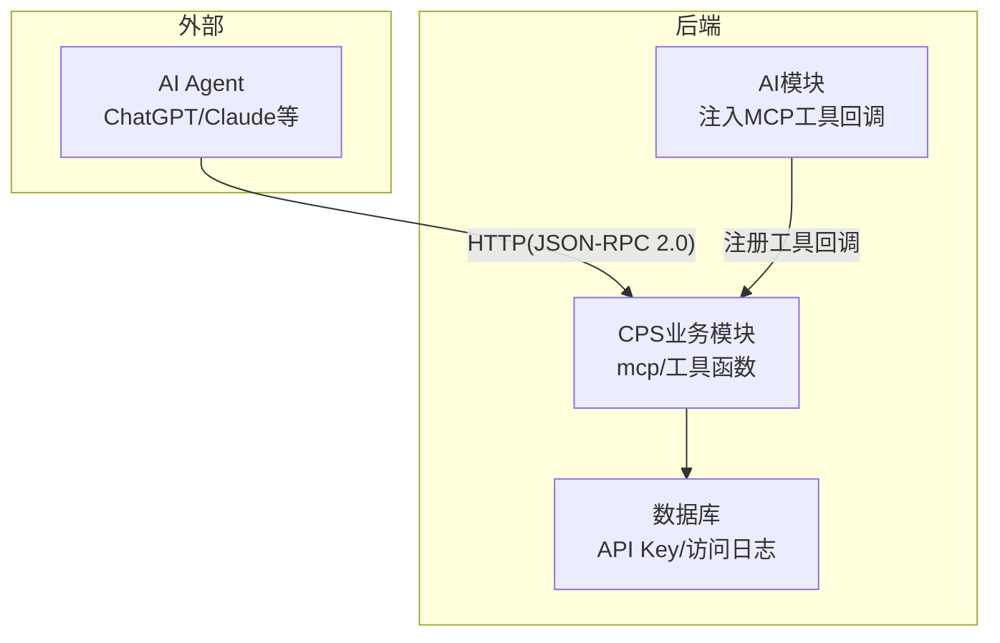
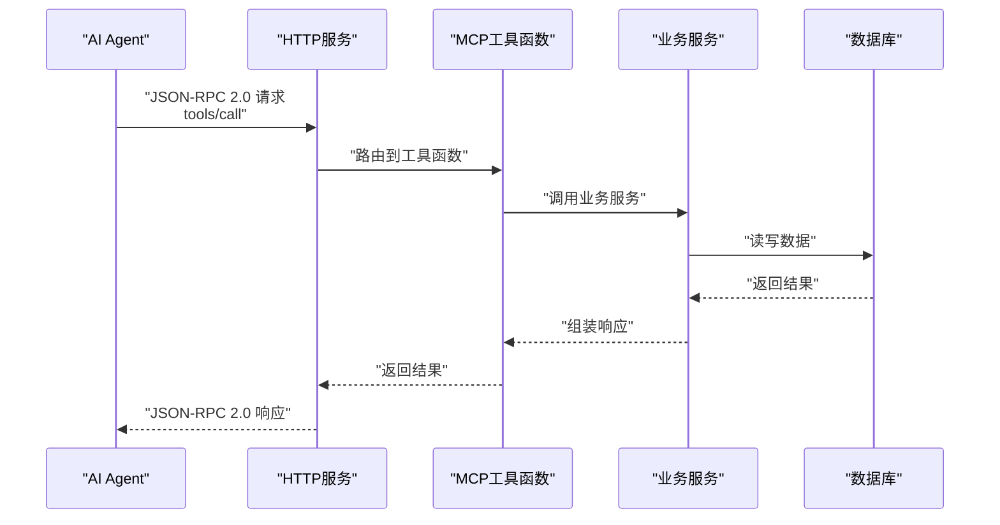
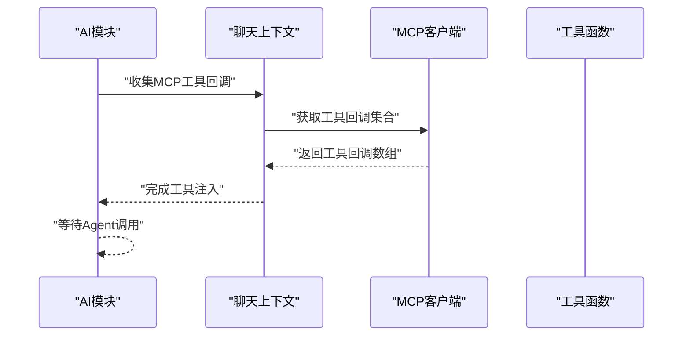
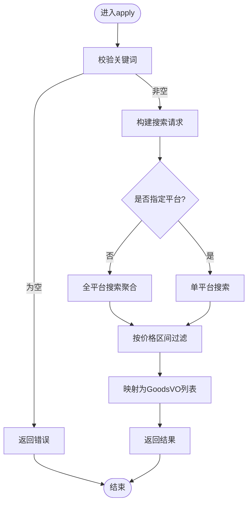
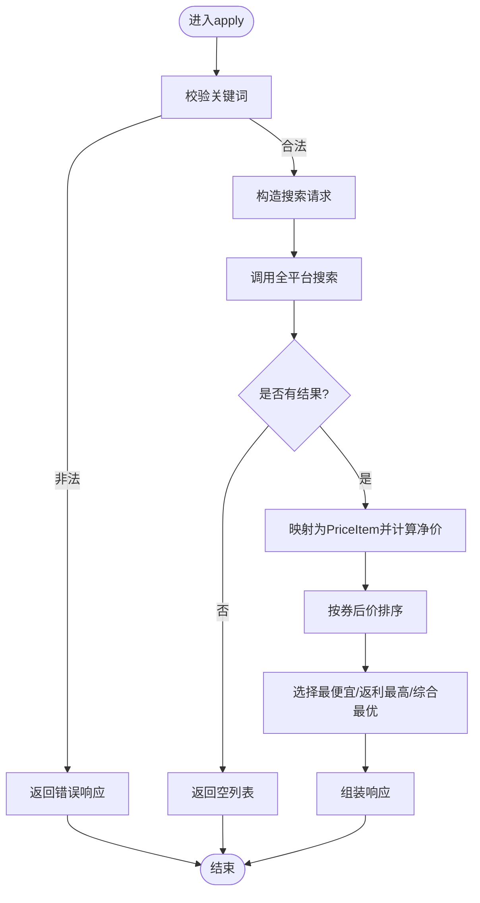
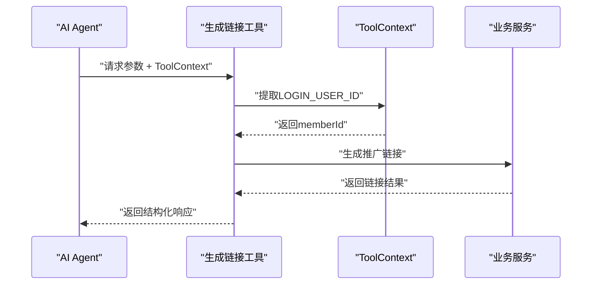
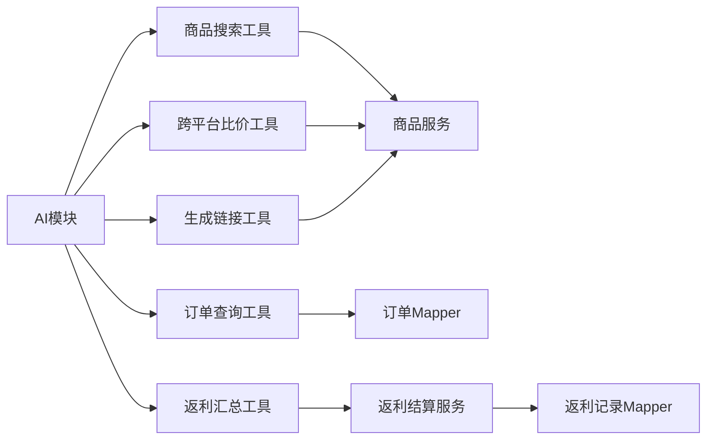

# MCP协议集成

<cite>
**本文引用的文件**
- [AGENTS.md](file://AGENTS.md)
- [README.md](file://README.md)
- [CpsSearchGoodsToolFunction.java](file://backend/yudao-module-cps/yudao-module-cps-biz/src/main/java/cn/iocoder/yudao/module/cps/mcp/tool/CpsSearchGoodsToolFunction.java)
- [CpsComparePricesToolFunction.java](file://backend/yudao-module-cps/yudao-module-cps-biz/src/main/java/cn/iocoder/yudao/module/cps/mcp/tool/CpsComparePricesToolFunction.java)
- [CpsGenerateLinkToolFunction.java](file://backend/yudao-module-cps/yudao-module-cps-biz/src/main/java/cn/iocoder/yudao/module/cps/mcp/tool/CpsGenerateLinkToolFunction.java)
- [CpsQueryOrdersToolFunction.java](file://backend/yudao-module-cps/yudao-module-cps-biz/src/main/java/cn/iocoder/yudao/module/cps/mcp/tool/CpsQueryOrdersToolFunction.java)
- [CpsGetRebateSummaryToolFunction.java](file://backend/yudao-module-cps/yudao-module-cps-biz/src/main/java/cn/iocoder/yudao/module/cps/mcp/tool/CpsGetRebateSummaryToolFunction.java)
- [CpsMcpApiKeyDO.java](file://backend/yudao-module-cps/yudao-module-cps-biz/src/main/java/cn/iocoder/yudao/module/cps/dal/dataobject/mcp/CpsMcpApiKeyDO.java)
- [CpsMcpAccessLogDO.java](file://backend/yudao-module-cps/yudao-module-cps-biz/src/main/java/cn/iocoder/yudao/module/cps/dal/dataobject/mcp/CpsMcpAccessLogDO.java)
- [CpsMcpApiKeyMapper.java](file://backend/yudao-module-cps/yudao-module-cps-biz/src/main/java/cn/iocoder/yudao/module/cps/dal/mysql/mcp/CpsMcpApiKeyMapper.java)
- [CpsMcpAccessLogMapper.java](file://backend/yudao-module-cps/yudao-module-cps-biz/src/main/java/cn/iocoder/yudao/module/cps/dal/mysql/mcp/CpsMcpAccessLogMapper.java)
- [AiChatMessageServiceImpl.java](file://backend/yudao-module-ai/src/main/java/cn/iocoder/yudao/module/ai/service/chat/AiChatMessageServiceImpl.java)
- [DouBaoMcpTests.java](file://backend/yudao-module-ai/src/test/java/cn/iocoder/yudao/module/ai/framework/ai/core/model/mcp/DouBaoMcpTests.java)
- [CPS系统PRD文档.md](file://docs/CPS系统PRD文档.md)
</cite>

## 目录
1. [简介](#简介)
2. [项目结构](#项目结构)
3. [核心组件](#核心组件)
4. [架构总览](#架构总览)
5. [详细组件分析](#详细组件分析)
6. [依赖关系分析](#依赖关系分析)
7. [性能考虑](#性能考虑)
8. [故障排查指南](#故障排查指南)
9. [结论](#结论)
10. [附录](#附录)

## 简介
本文件系统性阐述 AgenticCPS 中基于 Model Context Protocol（MCP）的AI工具函数集成方案。MCP 以 JSON-RPC 2.0 over Streamable HTTP 的形式在后端提供标准化接口，使外部 AI Agent（如 ChatGPT、Claude 等）能够直接调用系统内的工具函数，实现“零代码接入”。本文将从架构设计、握手与认证、消息格式与错误处理、工具函数注册与调用流程、开发与最佳实践等方面进行深入说明，并提供可视化图示与参考路径。

## 项目结构
- 后端采用多模块架构，MCP 接口层位于 CPS 业务模块的 mcp 目录下，工具函数均以 Spring Bean 形式注册，供 AI Agent 调用。
- AI 模块负责将 MCP 工具回调注入到聊天上下文中，实现与 AI Agent 的无缝衔接。
- 管理后台提供 MCP API Key 管理、Tools 配置与访问日志等功能。

**图示来源**
- [AGENTS.md:161-169](file://AGENTS.md#L161-L169)
- [AiChatMessageServiceImpl.java:414-425](file://backend/yudao-module-ai/src/main/java/cn/iocoder/yudao/module/ai/service/chat/AiChatMessageServiceImpl.java#L414-L425)

**章节来源**
- [AGENTS.md:161-169](file://AGENTS.md#L161-L169)
- [README.md:185-209](file://README.md#L185-L209)

## 核心组件
- MCP 工具函数：提供商品搜索、跨平台比价、推广链接生成、订单查询、返利汇总等能力，均以 Spring Bean 注册，名称即为工具名。
- API Key 管理：用于鉴权与限流控制，支持状态、过期时间、使用统计等字段。
- 访问日志：记录每次工具调用的请求参数、响应摘要、耗时、错误信息等，便于审计与排障。
- AI 回调注入：AI 模块在聊天上下文中收集 MCP 工具回调，供 Agent 调用。

**章节来源**
- [CpsSearchGoodsToolFunction.java:28-32](file://backend/yudao-module-cps/yudao-module-cps-biz/src/main/java/cn/iocoder/yudao/module/cps/mcp/tool/CpsSearchGoodsToolFunction.java#L28-L32)
- [CpsMcpApiKeyDO.java:24-60](file://backend/yudao-module-cps/yudao-module-cps-biz/src/main/java/cn/iocoder/yudao/module/cps/dal/dataobject/mcp/CpsMcpApiKeyDO.java#L24-L60)
- [CpsMcpAccessLogDO.java:22-62](file://backend/yudao-module-cps/yudao-module-cps-biz/src/main/java/cn/iocoder/yudao/module/cps/dal/dataobject/mcp/CpsMcpAccessLogDO.java#L22-L62)
- [AiChatMessageServiceImpl.java:414-425](file://backend/yudao-module-ai/src/main/java/cn/iocoder/yudao/module/ai/service/chat/AiChatMessageServiceImpl.java#L414-L425)

## 架构总览
MCP 协议在后端通过 HTTP Endpoint 暴露，使用 JSON-RPC 2.0 over Streamable HTTP。AI Agent 通过工具名调用对应工具函数；AI 模块负责将这些工具回调注入到聊天上下文中，形成“工具函数即服务”的统一入口。

**图示来源**
- [AGENTS.md:167-169](file://AGENTS.md#L167-L169)
- [CpsSearchGoodsToolFunction.java:120-174](file://backend/yudao-module-cps/yudao-module-cps-biz/src/main/java/cn/iocoder/yudao/module/cps/mcp/tool/CpsSearchGoodsToolFunction.java#L120-L174)

## 详细组件分析

### 工具函数注册与调用流程
- 工具函数以 Spring Bean 形式注册，名称即工具名（如 cps_search_goods、cps_compare_prices 等）。
- AI 模块在构建聊天上下文时，扫描已注册的 MCP 客户端，收集工具回调并注入到聊天上下文中，供 Agent 调用。
- 工具函数接收请求对象与可选的 ToolContext（用于提取登录用户ID等上下文信息），执行业务逻辑并返回结构化响应。

**图示来源**
- [AiChatMessageServiceImpl.java:414-425](file://backend/yudao-module-ai/src/main/java/cn/iocoder/yudao/module/ai/service/chat/AiChatMessageServiceImpl.java#L414-L425)

**章节来源**
- [AiChatMessageServiceImpl.java:414-425](file://backend/yudao-module-ai/src/main/java/cn/iocoder/yudao/module/ai/service/chat/AiChatMessageServiceImpl.java#L414-L425)

### 商品搜索工具（cps_search_goods）
- 输入参数：关键词、平台编码、分页大小、价格区间等。
- 输出：商品总数与商品列表，包含平台编码、标题、主图、原价、券后价、佣金、销量等。
- 过滤逻辑：支持按券后价进行价格区间过滤；分页大小上限控制。

**图示来源**
- [CpsSearchGoodsToolFunction.java:120-174](file://backend/yudao-module-cps/yudao-module-cps-biz/src/main/java/cn/iocoder/yudao/module/cps/mcp/tool/CpsSearchGoodsToolFunction.java#L120-L174)

**章节来源**
- [CpsSearchGoodsToolFunction.java:28-32](file://backend/yudao-module-cps/yudao-module-cps-biz/src/main/java/cn/iocoder/yudao/module/cps/mcp/tool/CpsSearchGoodsToolFunction.java#L28-L32)
- [CpsSearchGoodsToolFunction.java:120-174](file://backend/yudao-module-cps/yudao-module-cps-biz/src/main/java/cn/iocoder/yudao/module/cps/mcp/tool/CpsSearchGoodsToolFunction.java#L120-L174)

### 跨平台比价工具（cps_compare_prices）
- 输入参数：关键词、topN（默认5，最大10）。
- 输出：总商品数、最便宜商品、返利最高商品、综合最优商品、完整比价列表（按券后价升序）。
- 计算逻辑：基于券后价与预估佣金计算“净价”，并据此排序与选择最优项。

**图示来源**
- [CpsComparePricesToolFunction.java:113-173](file://backend/yudao-module-cps/yudao-module-cps-biz/src/main/java/cn/iocoder/yudao/module/cps/mcp/tool/CpsComparePricesToolFunction.java#L113-L173)

**章节来源**
- [CpsComparePricesToolFunction.java:22-32](file://backend/yudao-module-cps/yudao-module-cps-biz/src/main/java/cn/iocoder/yudao/module/cps/mcp/tool/CpsComparePricesToolFunction.java#L22-L32)
- [CpsComparePricesToolFunction.java:113-173](file://backend/yudao-module-cps/yudao-module-cps-biz/src/main/java/cn/iocoder/yudao/module/cps/mcp/tool/CpsComparePricesToolFunction.java#L113-L173)

### 推广链接生成工具（cps_generate_link）
- 输入参数：平台编码、商品ID、商品goodsSign（拼多多必填）、会员ID（可选，可从ToolContext获取）、推广位ID。
- 输出：短链、长链、淘口令（淘宝）、移动端链接（拼多多）、券后价、佣金比例、预估佣金、券信息。
- 上下文：支持从 ToolContext 提取当前登录用户ID，实现订单归因。

**图示来源**
- [CpsGenerateLinkToolFunction.java:97-139](file://backend/yudao-module-cps/yudao-module-cps-biz/src/main/java/cn/iocoder/yudao/module/cps/mcp/tool/CpsGenerateLinkToolFunction.java#L97-L139)

**章节来源**
- [CpsGenerateLinkToolFunction.java:19-29](file://backend/yudao-module-cps/yudao-module-cps-biz/src/main/java/cn/iocoder/yudao/module/cps/mcp/tool/CpsGenerateLinkToolFunction.java#L19-L29)
- [CpsGenerateLinkToolFunction.java:97-139](file://backend/yudao-module-cps/yudao-module-cps-biz/src/main/java/cn/iocoder/yudao/module/cps/mcp/tool/CpsGenerateLinkToolFunction.java#L97-L139)

### 订单查询工具（cps_query_orders）
- 输入参数：平台编码、订单状态、页码、分页大小。
- 输出：总记录数与订单列表，包含平台订单号、商品信息、最终价格、预估/实际返利、状态、时间等。
- 上下文：从 ToolContext 提取当前登录会员ID，避免在请求中显式传参。

**章节来源**
- [CpsQueryOrdersToolFunction.java:25-35](file://backend/yudao-module-cps/yudao-module-cps-biz/src/main/java/cn/iocoder/yudao/module/cps/mcp/tool/CpsQueryOrdersToolFunction.java#L25-L35)
- [CpsQueryOrdersToolFunction.java:120-157](file://backend/yudao-module-cps/yudao-module-cps-biz/src/main/java/cn/iocoder/yudao/module/cps/mcp/tool/CpsQueryOrdersToolFunction.java#L120-L157)

### 返利汇总工具（cps_get_rebate_summary）
- 输入参数：最近记录条数（默认5，最大20）。
- 输出：可用余额、冻结余额、累计返利总额、已提现金额、账户状态、最近返利记录。
- 上下文：从 ToolContext 提取当前登录会员ID，查询账户并分页获取最近返利记录。

**章节来源**
- [CpsGetRebateSummaryToolFunction.java:24-34](file://backend/yudao-module-cps/yudao-module-cps-biz/src/main/java/cn/iocoder/yudao/module/cps/mcp/tool/CpsGetRebateSummaryToolFunction.java#L24-L34)
- [CpsGetRebateSummaryToolFunction.java:107-149](file://backend/yudao-module-cps/yudao-module-cps-biz/src/main/java/cn/iocoder/yudao/module/cps/mcp/tool/CpsGetRebateSummaryToolFunction.java#L107-L149)

### 认证与授权（API Key）
- API Key 管理实体包含名称、值、描述、状态、过期时间、最后使用时间、累计调用次数等字段。
- 支持按值查询 API Key，配合限流与权限控制，确保 MCP 接口安全稳定。

**章节来源**
- [CpsMcpApiKeyDO.java:24-60](file://backend/yudao-module-cps/yudao-module-cps-biz/src/main/java/cn/iocoder/yudao/module/cps/dal/dataobject/mcp/CpsMcpApiKeyDO.java#L24-L60)
- [CpsMcpApiKeyMapper.java:15-17](file://backend/yudao-module-cps/yudao-module-cps-biz/src/main/java/cn/iocoder/yudao/module/cps/dal/mysql/mcp/CpsMcpApiKeyMapper.java#L15-L17)

### 访问日志与审计
- 访问日志记录工具名、请求参数、响应摘要、状态、错误信息、耗时、客户端IP等，便于问题定位与性能分析。

**章节来源**
- [CpsMcpAccessLogDO.java:22-62](file://backend/yudao-module-cps/yudao-module-cps-biz/src/main/java/cn/iocoder/yudao/module/cps/dal/dataobject/mcp/CpsMcpAccessLogDO.java#L22-L62)
- [CpsMcpAccessLogMapper.java:12-15](file://backend/yudao-module-cps/yudao-module-cps-biz/src/main/java/cn/iocoder/yudao/module/cps/dal/mysql/mcp/CpsMcpAccessLogMapper.java#L12-L15)

## 依赖关系分析
- 工具函数依赖业务服务（如商品搜索、推广链接生成、订单查询、返利结算）完成具体业务逻辑。
- AI 模块通过工具回调提供统一的工具注册入口，减少 Agent 侧的适配成本。
- 数据访问层通过 MyBatis Plus 访问数据库，记录 API Key 与访问日志。

**图示来源**
- [CpsSearchGoodsToolFunction.java:32-35](file://backend/yudao-module-cps/yudao-module-cps-biz/src/main/java/cn/iocoder/yudao/module/cps/mcp/tool/CpsSearchGoodsToolFunction.java#L32-L35)
- [CpsComparePricesToolFunction.java:34-35](file://backend/yudao-module-cps/yudao-module-cps-biz/src/main/java/cn/iocoder/yudao/module/cps/mcp/tool/CpsComparePricesToolFunction.java#L34-L35)
- [CpsGenerateLinkToolFunction.java:34-35](file://backend/yudao-module-cps/yudao-module-cps-biz/src/main/java/cn/iocoder/yudao/module/cps/mcp/tool/CpsGenerateLinkToolFunction.java#L34-L35)
- [CpsQueryOrdersToolFunction.java:39-40](file://backend/yudao-module-cps/yudao-module-cps-biz/src/main/java/cn/iocoder/yudao/module/cps/mcp/tool/CpsQueryOrdersToolFunction.java#L39-L40)
- [CpsGetRebateSummaryToolFunction.java:38-42](file://backend/yudao-module-cps/yudao-module-cps-biz/src/main/java/cn/iocoder/yudao/module/cps/mcp/tool/CpsGetRebateSummaryToolFunction.java#L38-L42)

**章节来源**
- [AiChatMessageServiceImpl.java:414-425](file://backend/yudao-module-ai/src/main/java/cn/iocoder/yudao/module/ai/service/chat/AiChatMessageServiceImpl.java#L414-L425)

## 性能考虑
- 工具调用性能目标：搜索类<3秒（P99）、查询类<1秒（P99）。
- 优化建议：
  - 控制分页大小与topN，避免一次性返回过多数据。
  - 对跨平台搜索结果进行必要的价格区间过滤，减少后续处理开销。
  - 对高频查询引入缓存（如商品详情、平台配置），降低数据库压力。
  - 对 API Key 进行限流与熔断，防止突发流量冲击。

**章节来源**
- [README.md:332-341](file://README.md#L332-L341)

## 故障排查指南
- 常见错误类型：
  - 参数缺失：如关键词为空、平台编码与商品ID为空。
  - 未登录：订单查询与返利汇总依赖登录上下文。
  - 转链失败：商品ID不正确或平台接口异常。
- 排查步骤：
  - 检查 API Key 状态与权限级别，确认是否过期或被禁用。
  - 查看访问日志，定位错误信息与耗时。
  - 核对 ToolContext 是否正确传递登录用户ID。
  - 验证工具函数的输入参数与业务服务的返回值。

**章节来源**
- [CpsSearchGoodsToolFunction.java:115-117](file://backend/yudao-module-cps/yudao-module-cps-biz/src/main/java/cn/iocoder/yudao/module/cps/mcp/tool/CpsSearchGoodsToolFunction.java#L115-L117)
- [CpsQueryOrdersToolFunction.java:121-126](file://backend/yudao-module-cps/yudao-module-cps-biz/src/main/java/cn/iocoder/yudao/module/cps/mcp/tool/CpsQueryOrdersToolFunction.java#L121-L126)
- [CpsGetRebateSummaryToolFunction.java:108-112](file://backend/yudao-module-cps/yudao-module-cps-biz/src/main/java/cn/iocoder/yudao/module/cps/mcp/tool/CpsGetRebateSummaryToolFunction.java#L108-L112)
- [CpsMcpAccessLogDO.java:40-52](file://backend/yudao-module-cps/yudao-module-cps-biz/src/main/java/cn/iocoder/yudao/module/cps/dal/dataobject/mcp/CpsMcpAccessLogDO.java#L40-L52)

## 结论
AgenticCPS 通过 MCP 协议实现了 AI Agent 的零代码接入，将复杂的业务能力以标准化工具函数暴露出来。借助 Spring Bean 注册、工具回调注入、API Key 管理与访问日志审计，系统在保证安全性与可观测性的同时，提供了高性能、易扩展的工具函数调用体验。未来可在缓存、限流与可观测性方面进一步优化，以支撑更大规模的并发与更丰富的业务场景。

## 附录

### MCP 协议要点
- 传输协议：JSON-RPC 2.0 over Streamable HTTP
- 端点：/mcp/cps
- 工具调用：tools/call + 工具名 + 参数
- 认证：API Key（可匿名访问，但受限）

**章节来源**
- [AGENTS.md:167-169](file://AGENTS.md#L167-L169)
- [README.md:185-198](file://README.md#L185-L198)

### 工具函数一览
- cps_search_goods：多平台商品搜索
- cps_compare_prices：跨平台比价
- cps_generate_link：推广链接生成
- cps_query_orders：订单查询
- cps_get_rebate_summary：返利汇总

**章节来源**
- [README.md:200-209](file://README.md#L200-L209)

### 开发与最佳实践
- 使用 ToolContext 传递登录上下文，避免在请求中重复传参。
- 对输入参数进行严格校验与默认值处理，确保工具函数健壮性。
- 对高频工具引入缓存与限流策略，保障系统稳定性。
- 通过访问日志与错误信息进行问题定位与性能分析。

**章节来源**
- [CpsGenerateLinkToolFunction.java:97-139](file://backend/yudao-module-cps/yudao-module-cps-biz/src/main/java/cn/iocoder/yudao/module/cps/mcp/tool/CpsGenerateLinkToolFunction.java#L97-L139)
- [CpsQueryOrdersToolFunction.java:120-157](file://backend/yudao-module-cps/yudao-module-cps-biz/src/main/java/cn/iocoder/yudao/module/cps/mcp/tool/CpsQueryOrdersToolFunction.java#L120-L157)
- [CpsGetRebateSummaryToolFunction.java:107-149](file://backend/yudao-module-cps/yudao-module-cps-biz/src/main/java/cn/iocoder/yudao/module/cps/mcp/tool/CpsGetRebateSummaryToolFunction.java#L107-L149)

### 示例与集成步骤
- 在 AI 模块中注册 MCP 工具回调，确保 Agent 可见工具列表。
- 通过 HTTP 客户端向 /mcp/cps 发送 JSON-RPC 2.0 请求，携带 API Key 与工具参数。
- 使用测试用例验证工具函数行为，确保参数传递、返回值处理与异常分支覆盖。

**章节来源**
- [AiChatMessageServiceImpl.java:414-425](file://backend/yudao-module-ai/src/main/java/cn/iocoder/yudao/module/ai/service/chat/AiChatMessageServiceImpl.java#L414-L425)
- [DouBaoMcpTests.java:13](file://backend/yudao-module-ai/src/test/java/cn/iocoder/yudao/module/ai/framework/ai/core/model/mcp/DouBaoMcpTests.java#L13)