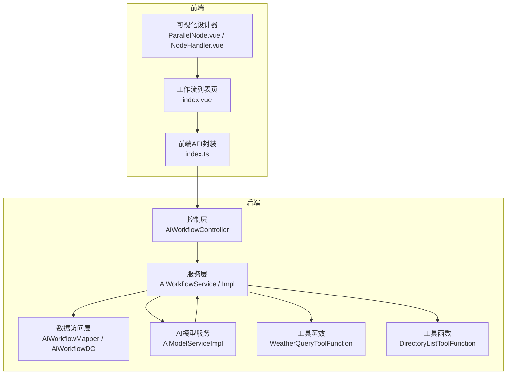
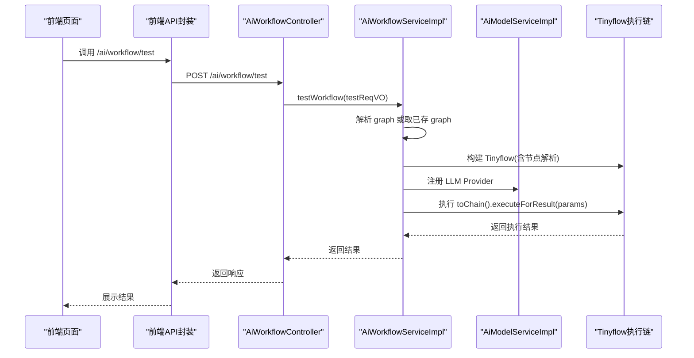
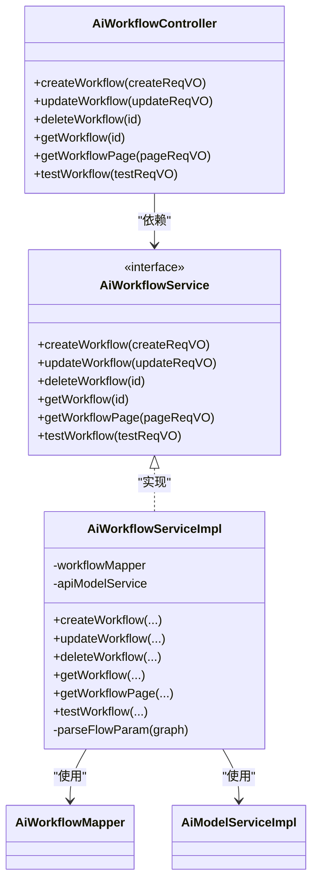
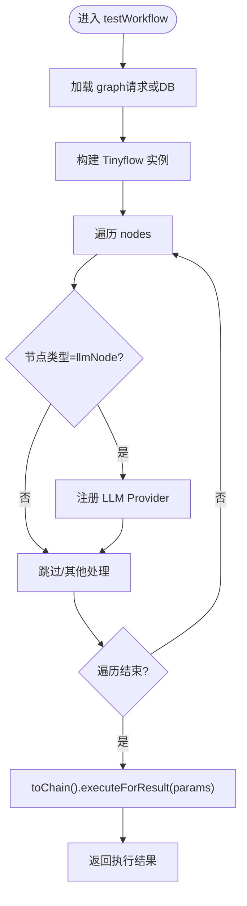
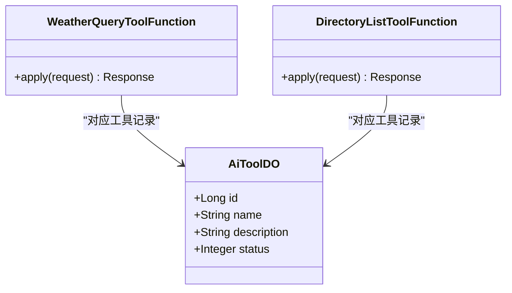
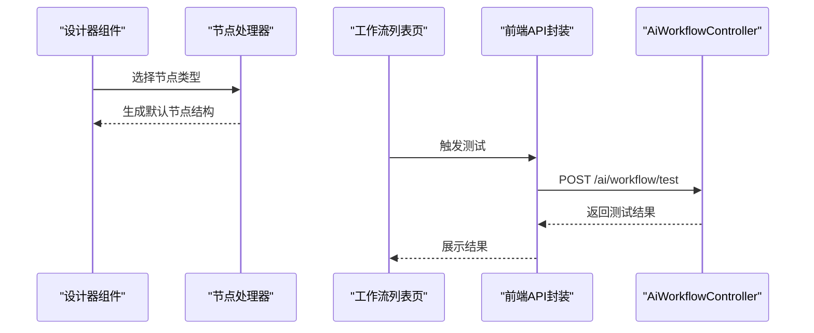
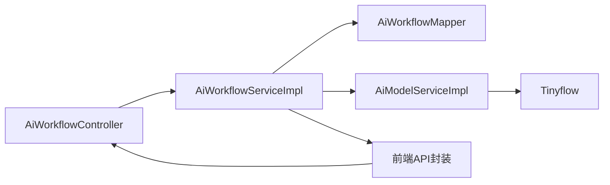

# 工作流系统

<cite>
**本文引用的文件**
- [AiWorkflowServiceImpl.java](file://backend/yudao-module-ai/src/main/java/cn/iocoder/yudao/module/ai/service/workflow/AiWorkflowServiceImpl.java)
- [AiWorkflowService.java](file://backend/yudao-module-ai/src/main/java/cn/iocoder/yudao/module/ai/service/workflow/AiWorkflowService.java)
- [AiWorkflowController.java](file://backend/yudao-module-ai/src/main/java/cn/iocoder/yudao/module/ai/controller/admin/workflow/AiWorkflowController.java)
- [AiWorkflowDO.java](file://backend/yudao-module-ai/src/main/java/cn/iocoder/yudao/module/ai/dal/dataobject/workflow/AiWorkflowDO.java)
- [AiWorkflowMapper.java](file://backend/yudao-module-ai/src/main/java/cn/iocoder/yudao/module/ai/dal/mysql/workflow/AiWorkflowMapper.java)
- [AiWorkflowTestReqVO.java](file://backend/yudao-module-ai/src/main/java/cn/iocoder/yudao/module/ai/controller/admin/workflow/vo/AiWorkflowTestReqVO.java)
- [AiWorkflowRespVO.java](file://backend/yudao-module-ai/src/main/java/cn/iocoder/yudao/module/ai/controller/admin/workflow/vo/AiWorkflowRespVO.java)
- [AiModelServiceImpl.java](file://backend/yudao-module-ai/src/main/java/cn/iocoder/yudao/module/ai/service/model/AiModelServiceImpl.java)
- [WeatherQueryToolFunction.java](file://backend/yudao-module-ai/src/main/java/cn/iocoder/yudao/module/ai/tool/function/WeatherQueryToolFunction.java)
- [DirectoryListToolFunction.java](file://backend/yudao-module-ai/src/main/java/cn/iocoder/yudao/module/ai/tool/function/DirectoryListToolFunction.java)
- [AiToolDO.java](file://backend/yudao-module-ai/src/main/java/cn/iocoder/yudao/module/ai/dal/dataobject/model/AiToolDO.java)
- [index.ts](file://frontend/admin-vue3/src/api/ai/workflow/index.ts)
- [index.vue](file://frontend/admin-vue3/src/views/ai/workflow/index.vue)
- [ParallelNode.vue](file://frontend/admin-vue3/src/components/SimpleProcessDesignerV2/src/nodes/ParallelNode.vue)
- [NodeHandler.vue](file://frontend/admin-vue3/src/components/SimpleProcessDesignerV2/src/NodeHandler.vue)
</cite>

## 目录
1. [简介](#简介)
2. [项目结构](#项目结构)
3. [核心组件](#核心组件)
4. [架构总览](#架构总览)
5. [详细组件分析](#详细组件分析)
6. [依赖分析](#依赖分析)
7. [性能考虑](#性能考虑)
8. [故障排查指南](#故障排查指南)
9. [结论](#结论)
10. [附录](#附录)

## 简介
本文件面向“工作流系统”的综合文档，聚焦于TinyFlow工作流引擎在AI模块中的应用与配置。内容涵盖：
- 工作流设计模式与节点类型（顺序、并行、条件）
- 执行流程与状态管理
- 编排方式、并行处理、条件分支与异常处理
- 与AI工具函数的集成、数据传递与结果聚合
- 可视化编辑、调试与性能监控
- 扩展开发、自定义节点与复杂业务场景实现

## 项目结构
AI工作流能力主要位于后端模块“yudao-module-ai”中，前端提供可视化设计器与工作流管理页面。关键文件分布如下：
- 后端控制层：AiWorkflowController
- 服务层：AiWorkflowService 及其实现 AiWorkflowServiceImpl
- 数据访问层：AiWorkflowMapper 与实体 AiWorkflowDO
- AI模型服务：AiModelServiceImpl，负责TinyFlow LLM Provider注册
- 工具函数：WeatherQueryToolFunction、DirectoryListToolFunction
- 前端API：/ai/workflow/* 接口封装
- 前端页面与设计器：工作流列表页、并行节点组件、节点处理器

图表来源
- [AiWorkflowController.java:1-78](file://backend/yudao-module-ai/src/main/java/cn/iocoder/yudao/module/ai/controller/admin/workflow/AiWorkflowController.java#L1-L78)
- [AiWorkflowServiceImpl.java:1-145](file://backend/yudao-module-ai/src/main/java/cn/iocoder/yudao/module/ai/service/workflow/AiWorkflowServiceImpl.java#L1-L145)
- [AiWorkflowMapper.java:1-30](file://backend/yudao-module-ai/src/main/java/cn/iocoder/yudao/module/ai/dal/mysql/workflow/AiWorkflowMapper.java#L1-L30)
- [AiWorkflowDO.java:1-52](file://backend/yudao-module-ai/src/main/java/cn/iocoder/yudao/module/ai/dal/dataobject/workflow/AiWorkflowDO.java#L1-L52)
- [AiModelServiceImpl.java:167-201](file://backend/yudao-module-ai/src/main/java/cn/iocoder/yudao/module/ai/service/model/AiModelServiceImpl.java#L167-L201)
- [WeatherQueryToolFunction.java:1-118](file://backend/yudao-module-ai/src/main/java/cn/iocoder/yudao/module/ai/tool/function/WeatherQueryToolFunction.java#L1-L118)
- [DirectoryListToolFunction.java:1-99](file://backend/yudao-module-ai/src/main/java/cn/iocoder/yudao/module/ai/tool/function/DirectoryListToolFunction.java#L1-L99)
- [index.ts:1-25](file://frontend/admin-vue3/src/api/ai/workflow/index.ts#L1-L25)
- [index.vue:115-170](file://frontend/admin-vue3/src/views/ai/workflow/index.vue#L115-L170)
- [ParallelNode.vue:1-35](file://frontend/admin-vue3/src/components/SimpleProcessDesignerV2/src/nodes/ParallelNode.vue#L1-L35)
- [NodeHandler.vue:183-230](file://frontend/admin-vue3/src/components/SimpleProcessDesignerV2/src/NodeHandler.vue#L183-L230)

章节来源
- [AiWorkflowController.java:1-78](file://backend/yudao-module-ai/src/main/java/cn/iocoder/yudao/module/ai/controller/admin/workflow/AiWorkflowController.java#L1-L78)
- [AiWorkflowServiceImpl.java:1-145](file://backend/yudao-module-ai/src/main/java/cn/iocoder/yudao/module/ai/service/workflow/AiWorkflowServiceImpl.java#L1-L145)
- [AiWorkflowMapper.java:1-30](file://backend/yudao-module-ai/src/main/java/cn/iocoder/yudao/module/ai/dal/mysql/workflow/AiWorkflowMapper.java#L1-L30)
- [AiWorkflowDO.java:1-52](file://backend/yudao-module-ai/src/main/java/cn/iocoder/yudao/module/ai/dal/dataobject/workflow/AiWorkflowDO.java#L1-L52)
- [index.ts:1-25](file://frontend/admin-vue3/src/api/ai/workflow/index.ts#L1-L25)
- [index.vue:115-170](file://frontend/admin-vue3/src/views/ai/workflow/index.vue#L115-L170)
- [ParallelNode.vue:1-35](file://frontend/admin-vue3/src/components/SimpleProcessDesignerV2/src/nodes/ParallelNode.vue#L1-L35)
- [NodeHandler.vue:183-230](file://frontend/admin-vue3/src/components/SimpleProcessDesignerV2/src/NodeHandler.vue#L183-L230)

## 核心组件
- 控制器：提供工作流的创建、更新、删除、查询、分页与测试接口
- 服务层：负责工作流持久化、唯一性校验、测试执行与TinyFlow链构建
- 数据访问层：基于MyBatis-Plus的Mapper与DO，支持按条件分页查询
- 模型服务：将具体模型平台（如通义千问、Ollama）注册为TinyFlow LLM Provider
- 工具函数：面向工具函数的函数式实现，供工作流节点调用
- 前端API与页面：封装REST请求、展示列表、触发测试

章节来源
- [AiWorkflowController.java:20-78](file://backend/yudao-module-ai/src/main/java/cn/iocoder/yudao/module/ai/controller/admin/workflow/AiWorkflowController.java#L20-L78)
- [AiWorkflowService.java:1-62](file://backend/yudao-module-ai/src/main/java/cn/iocoder/yudao/module/ai/service/workflow/AiWorkflowService.java#L1-L62)
- [AiWorkflowServiceImpl.java:33-145](file://backend/yudao-module-ai/src/main/java/cn/iocoder/yudao/module/ai/service/workflow/AiWorkflowServiceImpl.java#L33-L145)
- [AiWorkflowMapper.java:15-30](file://backend/yudao-module-ai/src/main/java/cn/iocoder/yudao/module/ai/dal/mysql/workflow/AiWorkflowMapper.java#L15-L30)
- [AiWorkflowDO.java:15-52](file://backend/yudao-module-ai/src/main/java/cn/iocoder/yudao/module/ai/dal/dataobject/workflow/AiWorkflowDO.java#L15-L52)
- [AiModelServiceImpl.java:176-201](file://backend/yudao-module-ai/src/main/java/cn/iocoder/yudao/module/ai/service/model/AiModelServiceImpl.java#L176-L201)
- [WeatherQueryToolFunction.java:24-118](file://backend/yudao-module-ai/src/main/java/cn/iocoder/yudao/module/ai/tool/function/WeatherQueryToolFunction.java#L24-L118)
- [DirectoryListToolFunction.java:29-99](file://backend/yudao-module-ai/src/main/java/cn/iocoder/yudao/module/ai/tool/function/DirectoryListToolFunction.java#L29-L99)
- [index.ts:1-25](file://frontend/admin-vue3/src/api/ai/workflow/index.ts#L1-L25)
- [index.vue:115-170](file://frontend/admin-vue3/src/views/ai/workflow/index.vue#L115-L170)

## 架构总览
TinyFlow在AI工作流中的角色是作为“执行引擎”，将前端设计器输出的JSON图模型转换为可执行链，并通过模型服务注入LLM Provider，最终在测试执行阶段以变量驱动的方式运行。

图表来源
- [AiWorkflowController.java:70-75](file://backend/yudao-module-ai/src/main/java/cn/iocoder/yudao/module/ai/controller/admin/workflow/AiWorkflowController.java#L70-L75)
- [AiWorkflowServiceImpl.java:109-121](file://backend/yudao-module-ai/src/main/java/cn/iocoder/yudao/module/ai/service/workflow/AiWorkflowServiceImpl.java#L109-L121)
- [AiModelServiceImpl.java:176-201](file://backend/yudao-module-ai/src/main/java/cn/iocoder/yudao/module/ai/service/model/AiModelServiceImpl.java#L176-L201)
- [index.ts:23-25](file://frontend/admin-vue3/src/api/ai/workflow/index.ts#L23-L25)

## 详细组件分析

### 组件A：工作流服务与控制器
- 职责
  - 控制器暴露REST接口，完成权限校验与参数封装
  - 服务层完成业务逻辑：唯一性校验、持久化、测试执行、TinyFlow链构建
- 关键流程
  - 创建/更新/删除：参数校验后持久化
  - 查询/分页：基于Mapper的条件查询
  - 测试：从请求或数据库取graph，解析节点类型，注入LLM Provider，执行并返回结果

图表来源
- [AiWorkflowController.java:20-78](file://backend/yudao-module-ai/src/main/java/cn/iocoder/yudao/module/ai/controller/admin/workflow/AiWorkflowController.java#L20-L78)
- [AiWorkflowService.java:10-62](file://backend/yudao-module-ai/src/main/java/cn/iocoder/yudao/module/ai/service/workflow/AiWorkflowService.java#L10-L62)
- [AiWorkflowServiceImpl.java:33-145](file://backend/yudao-module-ai/src/main/java/cn/iocoder/yudao/module/ai/service/workflow/AiWorkflowServiceImpl.java#L33-L145)

章节来源
- [AiWorkflowController.java:20-78](file://backend/yudao-module-ai/src/main/java/cn/iocoder/yudao/module/ai/controller/admin/workflow/AiWorkflowController.java#L20-L78)
- [AiWorkflowService.java:10-62](file://backend/yudao-module-ai/src/main/java/cn/iocoder/yudao/module/ai/service/workflow/AiWorkflowService.java#L10-L62)
- [AiWorkflowServiceImpl.java:33-145](file://backend/yudao-module-ai/src/main/java/cn/iocoder/yudao/module/ai/service/workflow/AiWorkflowServiceImpl.java#L33-L145)

### 组件B：TinyFlow执行与节点解析
- 设计要点
  - 将JSON图模型转为Tinyflow实例
  - 遍历节点，识别类型（如llmNode），动态注入对应LLM Provider
  - 使用变量驱动执行，返回最终结果
- 并行与条件
  - 前端设计器提供并行节点与条件节点UI
  - 服务端解析graph时区分节点类型，按需注册Provider

图表来源
- [AiWorkflowServiceImpl.java:109-142](file://backend/yudao-module-ai/src/main/java/cn/iocoder/yudao/module/ai/service/workflow/AiWorkflowServiceImpl.java#L109-L142)
- [AiModelServiceImpl.java:176-201](file://backend/yudao-module-ai/src/main/java/cn/iocoder/yudao/module/ai/service/model/AiModelServiceImpl.java#L176-L201)

章节来源
- [AiWorkflowServiceImpl.java:109-142](file://backend/yudao-module-ai/src/main/java/cn/iocoder/yudao/module/ai/service/workflow/AiWorkflowServiceImpl.java#L109-L142)
- [AiModelServiceImpl.java:176-201](file://backend/yudao-module-ai/src/main/java/cn/iocoder/yudao/module/ai/service/model/AiModelServiceImpl.java#L176-L201)

### 组件C：AI工具函数与数据传递
- 工具函数
  - WeatherQueryToolFunction：按城市查询天气（模拟）
  - DirectoryListToolFunction：列出目录文件
- 集成方式
  - 服务层通过TinyFlow注册Provider后，可在工作流中调用工具函数
  - 请求/响应对象遵循Jackson注解，便于序列化与参数传递
- 数据与结果聚合
  - 工具函数返回值作为节点输出，可被后续节点消费
  - 建议在工作流中通过变量名约定进行数据传递与聚合

图表来源
- [WeatherQueryToolFunction.java:24-118](file://backend/yudao-module-ai/src/main/java/cn/iocoder/yudao/module/ai/tool/function/WeatherQueryToolFunction.java#L24-L118)
- [DirectoryListToolFunction.java:29-99](file://backend/yudao-module-ai/src/main/java/cn/iocoder/yudao/module/ai/tool/function/DirectoryListToolFunction.java#L29-L99)
- [AiToolDO.java:16-48](file://backend/yudao-module-ai/src/main/java/cn/iocoder/yudao/module/ai/dal/dataobject/model/AiToolDO.java#L16-L48)

章节来源
- [WeatherQueryToolFunction.java:24-118](file://backend/yudao-module-ai/src/main/java/cn/iocoder/yudao/module/ai/tool/function/WeatherQueryToolFunction.java#L24-L118)
- [DirectoryListToolFunction.java:29-99](file://backend/yudao-module-ai/src/main/java/cn/iocoder/yudao/module/ai/tool/function/DirectoryListToolFunction.java#L29-L99)
- [AiToolDO.java:16-48](file://backend/yudao-module-ai/src/main/java/cn/iocoder/yudao/module/ai/dal/dataobject/model/AiToolDO.java#L16-L48)

### 组件D：可视化编辑与调试
- 可视化设计器
  - 并行节点组件：支持添加分支、显示状态样式
  - 节点处理器：根据节点类型生成默认结构（并行分支、包容分支等）
- 调试与测试
  - 前端提供工作流列表页，支持分页查询
  - 提供测试接口，可直接传入graph或选择已有工作流，配合参数进行调试

图表来源
- [ParallelNode.vue:1-35](file://frontend/admin-vue3/src/components/SimpleProcessDesignerV2/src/nodes/ParallelNode.vue#L1-L35)
- [NodeHandler.vue:183-230](file://frontend/admin-vue3/src/components/SimpleProcessDesignerV2/src/NodeHandler.vue#L183-L230)
- [index.vue:115-170](file://frontend/admin-vue3/src/views/ai/workflow/index.vue#L115-L170)
- [index.ts:23-25](file://frontend/admin-vue3/src/api/ai/workflow/index.ts#L23-L25)
- [AiWorkflowController.java:70-75](file://backend/yudao-module-ai/src/main/java/cn/iocoder/yudao/module/ai/controller/admin/workflow/AiWorkflowController.java#L70-L75)

章节来源
- [ParallelNode.vue:1-35](file://frontend/admin-vue3/src/components/SimpleProcessDesignerV2/src/nodes/ParallelNode.vue#L1-L35)
- [NodeHandler.vue:183-230](file://frontend/admin-vue3/src/components/SimpleProcessDesignerV2/src/NodeHandler.vue#L183-L230)
- [index.vue:115-170](file://frontend/admin-vue3/src/views/ai/workflow/index.vue#L115-L170)
- [index.ts:23-25](file://frontend/admin-vue3/src/api/ai/workflow/index.ts#L23-L25)
- [AiWorkflowController.java:70-75](file://backend/yudao-module-ai/src/main/java/cn/iocoder/yudao/module/ai/controller/admin/workflow/AiWorkflowController.java#L70-L75)

## 依赖分析
- 组件耦合
  - 控制器仅依赖服务接口，职责清晰
  - 服务实现依赖Mapper与模型服务，模型服务再与TinyFlow交互
  - 前端通过API封装与控制器交互，页面与设计器组件相对独立
- 外部依赖
  - TinyFlow：工作流执行引擎
  - FastJSON：JSON解析graph
  - Spring Bean：工具函数以函数式组件形式注册

图表来源
- [AiWorkflowController.java:20-78](file://backend/yudao-module-ai/src/main/java/cn/iocoder/yudao/module/ai/controller/admin/workflow/AiWorkflowController.java#L20-L78)
- [AiWorkflowServiceImpl.java:33-145](file://backend/yudao-module-ai/src/main/java/cn/iocoder/yudao/module/ai/service/workflow/AiWorkflowServiceImpl.java#L33-L145)
- [AiModelServiceImpl.java:176-201](file://backend/yudao-module-ai/src/main/java/cn/iocoder/yudao/module/ai/service/model/AiModelServiceImpl.java#L176-L201)
- [index.ts:1-25](file://frontend/admin-vue3/src/api/ai/workflow/index.ts#L1-L25)

章节来源
- [AiWorkflowServiceImpl.java:33-145](file://backend/yudao-module-ai/src/main/java/cn/iocoder/yudao/module/ai/service/workflow/AiWorkflowServiceImpl.java#L33-L145)
- [AiModelServiceImpl.java:176-201](file://backend/yudao-module-ai/src/main/java/cn/iocoder/yudao/module/ai/service/model/AiModelServiceImpl.java#L176-L201)

## 性能考虑
- 图模型解析
  - graph解析采用JSON数组遍历，建议在设计器侧尽量减少节点数量与嵌套深度
- 执行链构建
  - LLM Provider注册为一次性配置，避免重复注册带来的开销
- 并行分支
  - 并行节点在TinyFlow层面可并发执行，注意下游节点的资源竞争与幂等性
- IO与工具函数
  - 目录列举等IO操作建议增加缓存与超时控制，避免阻塞执行链

## 故障排查指南
- 常见错误
  - 工作流不存在：在查询或测试时若ID无效会抛出异常
  - 工作流标识冲突：创建/更新时若code重复会抛出异常
  - 参数校验失败：测试请求需满足“工作流或模型至少提供其一”的约束
- 排查步骤
  - 确认graph结构正确且节点类型匹配
  - 检查LLM Provider是否成功注册
  - 校验工具函数Bean名称与graph中引用一致
  - 查看服务端日志定位异常节点

章节来源
- [AiWorkflowServiceImpl.java:72-97](file://backend/yudao-module-ai/src/main/java/cn/iocoder/yudao/module/ai/service/workflow/AiWorkflowServiceImpl.java#L72-L97)
- [AiWorkflowTestReqVO.java:23-26](file://backend/yudao-module-ai/src/main/java/cn/iocoder/yudao/module/ai/controller/admin/workflow/vo/AiWorkflowTestReqVO.java#L23-L26)

## 结论
本工作流系统以TinyFlow为核心，结合AI模型服务与工具函数，实现了从可视化设计到执行测试的完整闭环。通过清晰的分层与接口设计，既保证了扩展性，也为复杂业务场景提供了良好的支撑。建议在生产环境中进一步完善监控、限流与重试策略，并持续优化节点解析与执行链构建的性能。

## 附录
- 扩展开发建议
  - 自定义节点：在前端设计器中新增节点类型，并在服务端parseFlowParam中识别与处理
  - 自定义工具函数：实现Function接口并以Spring Bean注册，确保名称与graph一致
  - 复杂业务场景：利用并行节点与条件节点组合，结合变量传递与结果聚合，实现多分支与动态路由