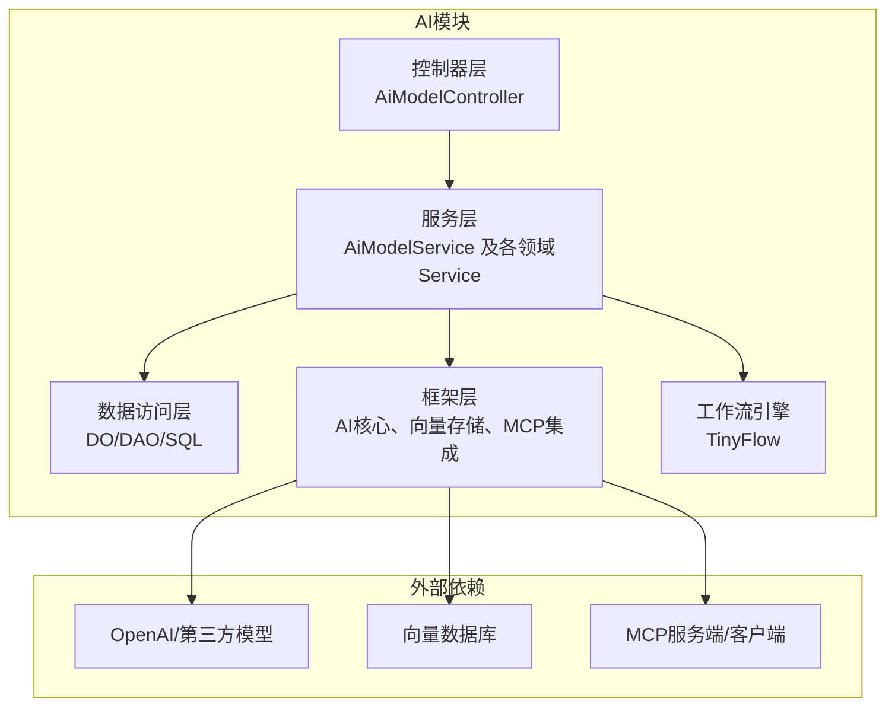
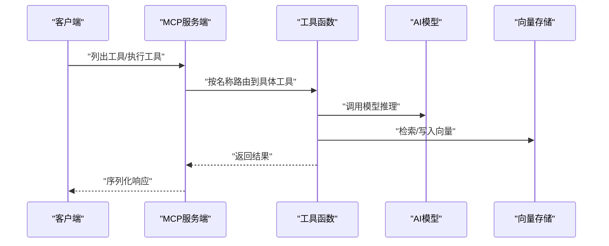
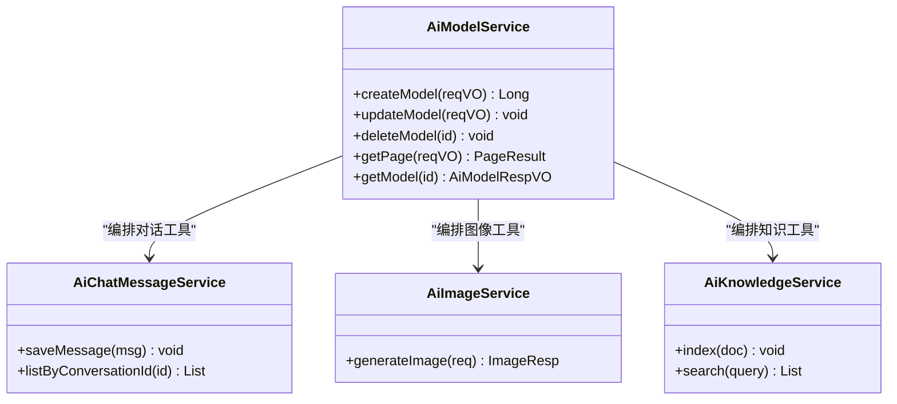
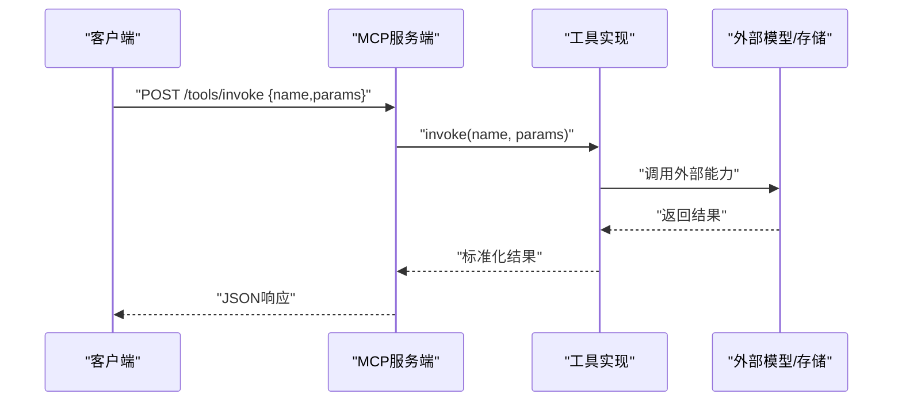
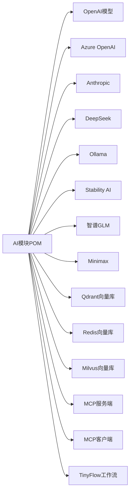

# 工具函数管理

<cite>
**本文引用的文件**
- [pom.xml](file://backend/yudao-module-ai/pom.xml)
- [AiModelController.java](file://backend/yudao-module-ai/src/main/java/cn/iocoder/yudao/module/ai/controller/admin/model/AiModelController.java)
- [AiModelService.java](file://backend/yudao-module-ai/src/main/java/cn/iocoder/yudao/module/ai/service/model/AiModelService.java)
- [AiChatConversationServiceImpl.java](file://backend/yudao-module-ai/src/main/java/cn/iocoder/yudao/module/ai/service/chat/AiChatConversationServiceImpl.java)
- [AiChatMessageService.java](file://backend/yudao-module-ai/src/main/java/cn/iocoder/yudao/module/ai/service/chat/AiChatMessageService.java)
- [AiChatMessageServiceImpl.java](file://backend/yudao-module-ai/src/main/java/cn/iocoder/yudao/module/ai/service/chat/AiChatMessageServiceImpl.java)
- [AiImageService.java](file://backend/yudao-module-ai/src/main/java/cn/iocoder/yudao/module/ai/service/image/AiImageService.java)
- [AiImageServiceImpl.java](file://backend/yudao-module-ai/src/main/java/cn/iocoder/yudao/module/ai/service/image/AiImageServiceImpl.java)
- [AiKnowledgeDocumentService.java](file://backend/yudao-module-ai/src/main/java/cn/iocoder/yudao/module/ai/service/knowledge/AiKnowledgeDocumentService.java)
- [AiKnowledgeDocumentServiceImpl.java](file://backend/yudao-module-ai/src/main/java/cn/iocoder/yudao/module/ai/service/knowledge/AiKnowledgeDocumentServiceImpl.java)
- [AiKnowledgeSegmentService.java](file://backend/yudao-module-ai/src/main/java/cn/iocoder/yudao/module/ai/service/knowledge/AiKnowledgeSegmentService.java)
- [AiKnowledgeSegmentServiceImpl.java](file://backend/yudao-module-ai/src/main/java/cn/iocoder/yudao/module/ai/service/knowledge/AiKnowledgeSegmentServiceImpl.java)
- [AiKnowledgeService.java](file://backend/yudao-module-ai/src/main/java/cn/iocoder/yudao/module/ai/service/knowledge/AiKnowledgeService.java)
- [AiKnowledgeServiceImpl.java](file://backend/yudao-module-ai/src/main/java/cn/iocoder/yudao/module/ai/service/knowledge/AiKnowledgeServiceImpl.java)
</cite>

## 目录
1. [简介](#简介)
2. [项目结构](#项目结构)
3. [核心组件](#核心组件)
4. [架构总览](#架构总览)
5. [详细组件分析](#详细组件分析)
6. [依赖分析](#依赖分析)
7. [性能考虑](#性能考虑)
8. [故障排查指南](#故障排查指南)
9. [结论](#结论)
10. [附录](#附录)

## 简介
本文件面向“工具函数管理系统”的设计与实现，聚焦以下目标：
- 明确AI工具函数的分类与职责边界（CPS工具、通用工具、业务工具）
- 规范参数定义、返回值与异常处理
- 给出注册机制、生命周期管理与调用流程
- 解释与MCP协议的集成方式、方法调用的序列化与反序列化
- 提供测试策略、性能监控与故障排查方法
- 总结开发规范、命名约定、版本管理与兼容性保障

本系统以AI模块为核心，围绕模型管理、对话、图像生成、知识库等能力展开，并通过MCP协议实现工具函数的服务化与可扩展。

## 项目结构
AI模块采用分层架构：控制层(Controller)、服务层(Service)、数据访问层(DAL)、框架层(Framework)，并引入Spring AI与TinyFlow工作流引擎，支撑多模型接入与工具编排。

图表来源
- [pom.xml:198-221](file://backend/yudao-module-ai/pom.xml#L198-L221)
- [AiModelController.java:1-31](file://backend/yudao-module-ai/src/main/java/cn/iocoder/yudao/module/ai/controller/admin/model/AiModelController.java#L1-L31)
- [AiModelService.java:19-49](file://backend/yudao-module-ai/src/main/java/cn/iocoder/yudao/module/ai/service/model/AiModelService.java#L19-L49)

章节来源
- [pom.xml:1-265](file://backend/yudao-module-ai/pom.xml#L1-L265)
- [AiModelController.java:1-31](file://backend/yudao-module-ai/src/main/java/cn/iocoder/yudao/module/ai/controller/admin/model/AiModelController.java#L1-L31)
- [AiModelService.java:19-49](file://backend/yudao-module-ai/src/main/java/cn/iocoder/yudao/module/ai/service/model/AiModelService.java#L19-L49)

## 核心组件
- 控制器层：提供REST接口，封装请求参数与响应结果，统一鉴权与权限控制
- 服务层：定义领域服务接口与实现，承载业务逻辑与工具函数编排
- 框架层：集成Spring AI模型、向量存储、MCP协议，提供跨模型抽象与工具注册
- 工作流引擎：TinyFlow用于复杂工具链与状态流转编排

章节来源
- [AiModelController.java:26-31](file://backend/yudao-module-ai/src/main/java/cn/iocoder/yudao/module/ai/controller/admin/model/AiModelController.java#L26-L31)
- [AiModelService.java:25-49](file://backend/yudao-module-ai/src/main/java/cn/iocoder/yudao/module/ai/service/model/AiModelService.java#L25-L49)

## 架构总览
系统通过MCP协议将工具函数暴露为服务端，客户端可动态发现与调用；同时结合Spring AI的模型抽象与TinyFlow工作流，实现从“工具函数”到“智能体行为”的闭环。

图表来源
- [pom.xml:203-220](file://backend/yudao-module-ai/pom.xml#L203-L220)

## 详细组件分析

### 模型管理服务（AiModelService）
- 职责：提供模型的增删改查、分页查询等能力，作为工具函数注册与使用的入口之一
- 关键点：
  - 使用Spring AI的模型抽象（如ChatModel、ImageModel），屏蔽底层模型差异
  - 与TinyFlow协作，将模型能力编排进工作流
  - 与向量存储集成，支持RAG场景下的工具检索

图表来源
- [AiModelService.java:25-49](file://backend/yudao-module-ai/src/main/java/cn/iocoder/yudao/module/ai/service/model/AiModelService.java#L25-L49)
- [AiChatMessageService.java:1-200](file://backend/yudao-module-ai/src/main/java/cn/iocoder/yudao/module/ai/service/chat/AiChatMessageService.java#L1-L200)
- [AiImageService.java:1-200](file://backend/yudao-module-ai/src/main/java/cn/iocoder/yudao/module/ai/service/image/AiImageService.java#L1-L200)
- [AiKnowledgeService.java:1-200](file://backend/yudao-module-ai/src/main/java/cn/iocoder/yudao/module/ai/service/knowledge/AiKnowledgeService.java#L1-L200)

章节来源
- [AiModelService.java:19-49](file://backend/yudao-module-ai/src/main/java/cn/iocoder/yudao/module/ai/service/model/AiModelService.java#L19-L49)

### 对话与消息服务（AiChatMessageService/AiChatConversationServiceImpl）
- 职责：维护会话上下文、消息持久化与检索，为工具函数提供历史上下文
- 生命周期：会话创建、消息追加、分页查询、清理过期会话
- 与工具函数的关系：在工具调用前后注入上下文，确保多轮对话连贯性

章节来源
- [AiChatMessageService.java:1-200](file://backend/yudao-module-ai/src/main/java/cn/iocoder/yudao/module/ai/service/chat/AiChatMessageService.java#L1-L200)
- [AiChatConversationServiceImpl.java:1-200](file://backend/yudao-module-ai/src/main/java/cn/iocoder/yudao/module/ai/service/chat/AiChatConversationServiceImpl.java#L1-L200)

### 图像生成服务（AiImageService/AiImageServiceImpl）
- 职责：封装图像生成工具函数，支持提示词、风格、尺寸等参数
- 返回值规范：统一返回图像URL或二进制数据的标准化结构
- 与MCP集成：通过MCP服务端暴露图像生成工具，客户端可直接调用

章节来源
- [AiImageService.java:1-200](file://backend/yudao-module-ai/src/main/java/cn/iocoder/yudao/module/ai/service/image/AiImageService.java#L1-L200)
- [AiImageServiceImpl.java:1-200](file://backend/yudao-module-ai/src/main/java/cn/iocoder/yudao/module/ai/service/image/AiImageServiceImpl.java#L1-L200)

### 知识库服务族（AiKnowledgeService/AiKnowledgeDocumentService/AiKnowledgeSegmentService）
- 职责：文档入库、分段、索引、检索，支撑RAG工具函数
- 参数定义：文档ID、分段大小、嵌入维度、相似度阈值
- 返回值规范：标准化的检索结果列表，包含片段、得分、元数据

章节来源
- [AiKnowledgeService.java:1-200](file://backend/yudao-module-ai/src/main/java/cn/iocoder/yudao/module/ai/service/knowledge/AiKnowledgeService.java#L1-L200)
- [AiKnowledgeDocumentService.java:1-200](file://backend/yudao-module-ai/src/main/java/cn/iocoder/yudao/module/ai/service/knowledge/AiKnowledgeDocumentService.java#L1-L200)
- [AiKnowledgeSegmentService.java:1-200](file://backend/yudao-module-ai/src/main/java/cn/iocoder/yudao/module/ai/service/knowledge/AiKnowledgeSegmentService.java#L1-L200)
- [AiKnowledgeServiceImpl.java:1-200](file://backend/yudao-module-ai/src/main/java/cn/iocoder/yudao/module/ai/service/knowledge/AiKnowledgeServiceImpl.java#L1-L200)
- [AiKnowledgeDocumentServiceImpl.java:1-200](file://backend/yudao-module-ai/src/main/java/cn/iocoder/yudao/module/ai/service/knowledge/AiKnowledgeDocumentServiceImpl.java#L1-L200)
- [AiKnowledgeSegmentServiceImpl.java:1-200](file://backend/yudao-module-ai/src/main/java/cn/iocoder/yudao/module/ai/service/knowledge/AiKnowledgeSegmentServiceImpl.java#L1-L200)

### 工具函数分类与职责
- CPS工具：面向CPS平台的广告、订单、风控等业务工具，强调合规与审计
- 通用工具：模型推理、图像生成、文本转语音等基础能力
- 业务工具：基于通用工具组合的业务编排，如“根据用户画像推荐商品并生成海报”

章节来源
- [AiModelService.java:19-49](file://backend/yudao-module-ai/src/main/java/cn/iocoder/yudao/module/ai/service/model/AiModelService.java#L19-L49)

### 参数定义与返回值规范
- 参数定义
  - 必填字段：明确标识必填项，提供默认值与取值范围
  - 可选字段：提供合理默认值，避免空指针
  - 校验规则：长度、格式、枚举值、数值区间
- 返回值规范
  - 成功：统一包装结构，包含业务码、消息与数据体
  - 失败：统一错误码与错误消息，便于前端与网关处理
- 异常处理
  - 业务异常：抛出受检异常，由全局异常处理器捕获并转换为标准响应
  - 系统异常：记录堆栈日志，返回通用错误码

章节来源
- [AiModelController.java:1-31](file://backend/yudao-module-ai/src/main/java/cn/iocoder/yudao/module/ai/controller/admin/model/AiModelController.java#L1-L31)

### 注册机制与生命周期管理
- 注册机制
  - 通过MCP服务端注册工具函数，声明名称、描述、参数Schema与返回Schema
  - 工具函数实现类需遵循统一接口，确保可替换性与可测试性
- 生命周期
  - 初始化：加载配置、建立连接、预热缓存
  - 运行期：接收请求、执行工具、更新指标
  - 清理：释放资源、关闭连接、清理临时文件

章节来源
- [pom.xml:203-220](file://backend/yudao-module-ai/pom.xml#L203-L220)

### 调用流程与MCP集成
- 方法调用序列化/反序列化
  - 请求：客户端发送JSON对象，包含工具名、参数、上下文
  - 服务端：MCP服务端解析请求，路由到对应工具实现
  - 响应：工具实现返回结构化结果，MCP服务端序列化后返回
- 错误传播：工具函数内部异常需被标准化，确保客户端可感知

图表来源
- [pom.xml:203-220](file://backend/yudao-module-ai/pom.xml#L203-L220)

## 依赖分析
- Spring AI模型：OpenAI、Azure OpenAI、Anthropic、DeepSeek、Ollama、Stability AI、智谱GLM、Minimax等
- 向量存储：Qdrant、Redis、Milvus
- MCP：服务端与客户端依赖，注意WebFlux与SpringMVC的兼容性
- TinyFlow：工作流编排与状态管理

图表来源
- [pom.xml:77-179](file://backend/yudao-module-ai/pom.xml#L77-L179)
- [pom.xml:198-221](file://backend/yudao-module-ai/pom.xml#L198-L221)
- [pom.xml:222-261](file://backend/yudao-module-ai/pom.xml#L222-L261)

章节来源
- [pom.xml:77-179](file://backend/yudao-module-ai/pom.xml#L77-L179)
- [pom.xml:198-221](file://backend/yudao-module-ai/pom.xml#L198-L221)
- [pom.xml:222-261](file://backend/yudao-module-ai/pom.xml#L222-L261)

## 性能考虑
- 并发与限流：对工具函数设置QPS与并发上限，避免下游模型或存储被打爆
- 缓存策略：热点参数与中间结果缓存，减少重复计算
- 批量化：对批量请求进行批处理，提升吞吐
- 超时与重试：为外部调用设置合理超时与指数退避重试
- 监控指标：请求耗时、错误率、队列长度、缓存命中率、向量库延迟

## 故障排查指南
- 常见问题
  - 工具不可用：检查MCP服务端是否正确注册、网络连通性
  - 结果异常：核对参数Schema、模型输出格式、向量库索引状态
  - 性能抖动：查看限流配置、缓存命中率、外部依赖延迟
- 排查步骤
  - 日志定位：开启DEBUG级别，收集请求ID与调用链
  - 降级验证：临时禁用部分工具，确认瓶颈所在
  - 压测验证：使用压测工具模拟峰值流量，观察系统表现
- 修复建议
  - 参数校验前置：在控制器层尽早拦截非法输入
  - 结果归一化：统一异常与返回结构，降低客户端适配成本
  - 版本灰度：通过版本号与特性开关，平滑发布新工具

## 结论
本工具函数管理系统以AI模块为核心，通过MCP协议实现工具函数的服务化与可扩展，结合Spring AI与TinyFlow完成从“工具函数”到“智能体行为”的演进。通过规范化的参数与返回值、完善的异常处理与生命周期管理，以及清晰的分类与职责边界，系统具备良好的可维护性与可扩展性。

## 附录

### 开发规范与最佳实践
- 命名约定
  - 工具函数：动宾短语，如“生成图像”、“检索知识”
  - 参数：驼峰命名，明确单位与取值范围
  - 返回值：统一包装，包含code、message、data
- 版本管理与兼容性
  - 工具函数版本号：语义化版本，破坏性变更大版本递增
  - 兼容性：新增可选参数，不改变默认行为；旧参数保留过渡期
- 测试策略
  - 单元测试：覆盖正常路径、边界条件、异常分支
  - 集成测试：MCP服务端/客户端联调，验证序列化与反序列化
  - 压测：评估高并发下的稳定性与延迟
- 性能监控
  - 关键指标：P95/P99延迟、错误率、缓存命中率、外部依赖SLA达成率
  - 告警阈值：基于历史基线与业务峰值设定