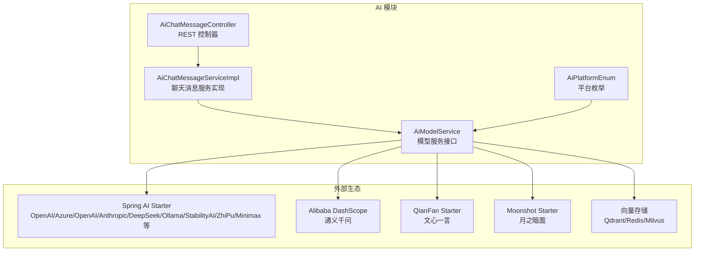
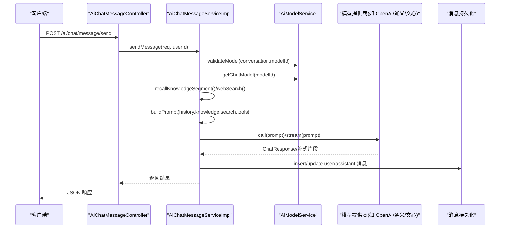
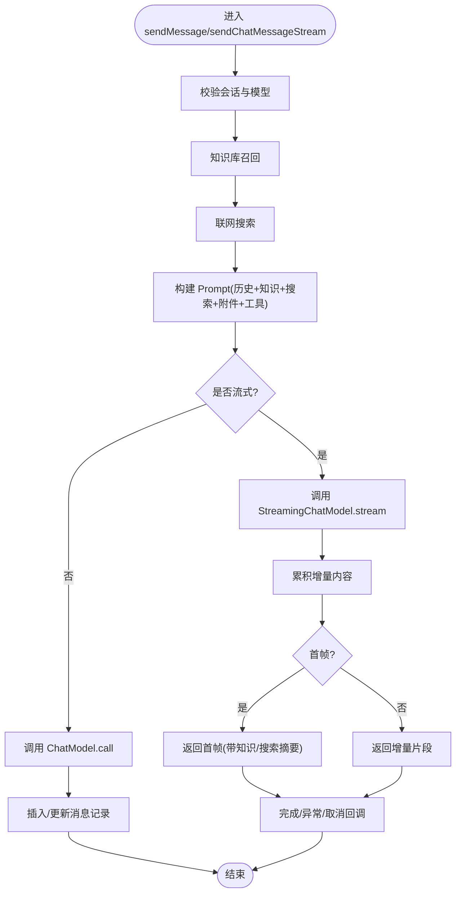
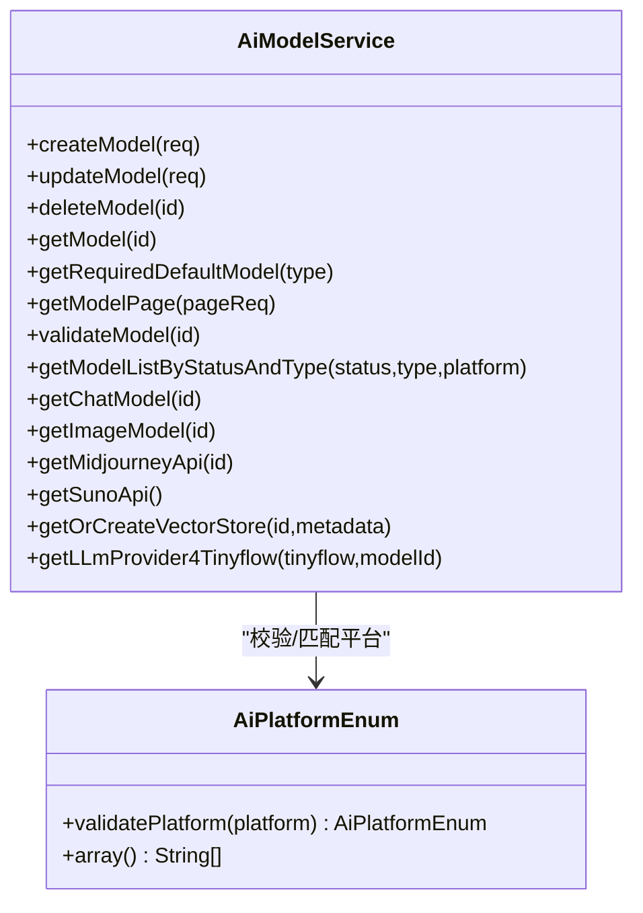
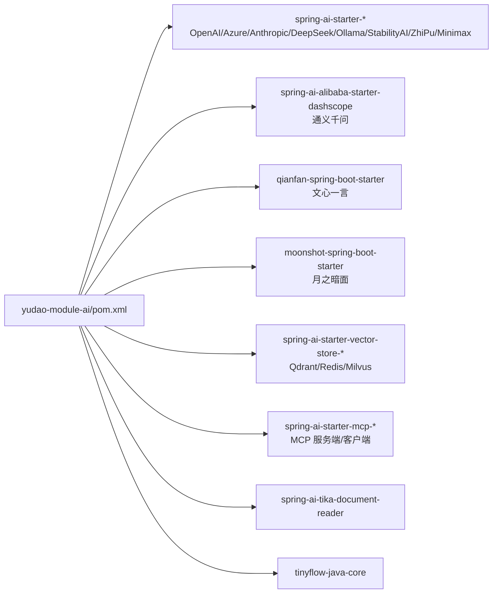

# 模型集成

<cite>
**本文引用的文件**
- [pom.xml](file://backend/yudao-module-ai/pom.xml)
- [AiChatMessageController.java](file://backend/yudao-module-ai/src/main/java/cn/iocoder/yudao/module/ai/controller/admin/chat/AiChatMessageController.java)
- [AiChatMessageService.java](file://backend/yudao-module-ai/src/main/java/cn/iocoder/yudao/module/ai/service/chat/AiChatMessageService.java)
- [AiChatMessageServiceImpl.java](file://backend/yudao-module-ai/src/main/java/cn/iocoder/yudao/module/ai/service/chat/AiChatMessageServiceImpl.java)
- [AiModelService.java](file://backend/yudao-module-ai/src/main/java/cn/iocoder/yudao/module/ai/service/model/AiModelService.java)
- [AiPlatformEnum.java](file://backend/yudao-module-ai/src/main/java/cn/iocoder/yudao/module/ai/enums/model/AiPlatformEnum.java)
</cite>

## 目录
1. [简介](#简介)
2. [项目结构](#项目结构)
3. [核心组件](#核心组件)
4. [架构总览](#架构总览)
5. [详细组件分析](#详细组件分析)
6. [依赖分析](#依赖分析)
7. [性能考虑](#性能考虑)
8. [故障排查指南](#故障排查指南)
9. [结论](#结论)
10. [附录](#附录)

## 简介
本文件面向“AI模型集成”主题，系统化梳理后端 yudao-module-ai 模块对多模型提供商的支持方式、配置方法、切换与负载均衡策略、故障转移方案、参数与认证管理、以及扩展开发与版本升级路径。该模块基于 Spring AI 生态，统一抽象 ChatModel/ImageModel 等能力，覆盖国内外主流大模型与图像/音乐/向量化存储等能力。

## 项目结构
AI 模块位于 backend/yudao-module-ai，主要由以下层次构成：
- 控制器层：对外暴露聊天消息、绘图等接口
- 服务层：封装对话流程、提示词构建、工具回调、流式输出、知识库/联网搜索融合
- 模型服务：统一管理模型实例、平台枚举、向量库、工作流适配
- 依赖声明：集中引入 Spring AI 与多家模型提供商的 starter

图表来源
- [pom.xml:77-146](file://backend/yudao-module-ai/pom.xml#L77-L146)
- [AiChatMessageController.java:42-46](file://backend/yudao-module-ai/src/main/java/cn/iocoder/yudao/module/ai/controller/admin/chat/AiChatMessageController.java#L42-L46)
- [AiChatMessageServiceImpl.java:109-138](file://backend/yudao-module-ai/src/main/java/cn/iocoder/yudao/module/ai/service/chat/AiChatMessageServiceImpl.java#L109-L138)
- [AiModelService.java:19-143](file://backend/yudao-module-ai/src/main/java/cn/iocoder/yudao/module/ai/service/model/AiModelService.java#L19-L143)
- [AiPlatformEnum.java:16-45](file://backend/yudao-module-ai/src/main/java/cn/iocoder/yudao/module/ai/enums/model/AiPlatformEnum.java#L16-L45)

章节来源
- [pom.xml:14-26](file://backend/yudao-module-ai/pom.xml#L14-L26)
- [AiChatMessageController.java:42-46](file://backend/yudao-module-ai/src/main/java/cn/iocoder/yudao/module/ai/controller/admin/chat/AiChatMessageController.java#L42-L46)

## 核心组件
- 控制器：提供发送消息（一次性/流式）、按会话查询消息、分页查询、删除消息等接口
- 服务实现：完成对话校验、历史上下文过滤、知识库/联网搜索召回、提示词构建、工具回调、流式/非流式调用、结果持久化与错误处理
- 模型服务：提供 ChatModel/ImageModel/MidjourneyApi/SunoApi/VectorStore 获取，以及 TinyFlow 适配
- 平台枚举：统一管理国内外模型平台标识，便于校验与路由

章节来源
- [AiChatMessageController.java:59-69](file://backend/yudao-module-ai/src/main/java/cn/iocoder/yudao/module/ai/controller/admin/chat/AiChatMessageController.java#L59-L69)
- [AiChatMessageService.java:20-87](file://backend/yudao-module-ai/src/main/java/cn/iocoder/yudao/module/ai/service/chat/AiChatMessageService.java#L20-L87)
- [AiChatMessageServiceImpl.java:140-303](file://backend/yudao-module-ai/src/main/java/cn/iocoder/yudao/module/ai/service/chat/AiChatMessageServiceImpl.java#L140-L303)
- [AiModelService.java:25-143](file://backend/yudao-module-ai/src/main/java/cn/iocoder/yudao/module/ai/service/model/AiModelService.java#L25-L143)
- [AiPlatformEnum.java:16-72](file://backend/yudao-module-ai/src/main/java/cn/iocoder/yudao/module/ai/enums/model/AiPlatformEnum.java#L16-L72)

## 架构总览
AI 模块通过统一的模型服务接口对接多种模型提供商，结合平台枚举与配置，实现模型选择、参数传递、工具回调、向量存储与工作流集成。

图表来源
- [AiChatMessageController.java:60-63](file://backend/yudao-module-ai/src/main/java/cn/iocoder/yudao/module/ai/controller/admin/chat/AiChatMessageController.java#L60-L63)
- [AiChatMessageServiceImpl.java:140-194](file://backend/yudao-module-ai/src/main/java/cn/iocoder/yudao/module/ai/service/chat/AiChatMessageServiceImpl.java#L140-L194)
- [AiModelService.java:93-101](file://backend/yudao-module-ai/src/main/java/cn/iocoder/yudao/module/ai/service/model/AiModelService.java#L93-L101)

## 详细组件分析

### 组件A：聊天消息服务（一次性/流式）
- 功能要点
  - 校验会话归属与模型可用性
  - 历史上下文过滤（按组倒序取 N 组）
  - 知识库召回与联网搜索融合到提示词
  - 附件读取与编码（图片 Base64、其他文本读取）
  - 工具回调与 MCP 客户端工具注入
  - 非流式一次性返回与流式 SSE 返回
  - 错误/取消时的清理或内容回写
- 关键流程（流式）
  - 构建 Prompt 后调用 StreamingChatModel.stream
  - 使用缓冲区累积增量内容，首帧返回知识库/搜索摘要
  - 完成/异常/取消时分别回写数据库

图表来源
- [AiChatMessageServiceImpl.java:140-303](file://backend/yudao-module-ai/src/main/java/cn/iocoder/yudao/module/ai/service/chat/AiChatMessageServiceImpl.java#L140-L303)

章节来源
- [AiChatMessageController.java:59-69](file://backend/yudao-module-ai/src/main/java/cn/iocoder/yudao/module/ai/controller/admin/chat/AiChatMessageController.java#L59-L69)
- [AiChatMessageService.java:20-87](file://backend/yudao-module-ai/src/main/java/cn/iocoder/yudao/module/ai/service/chat/AiChatMessageService.java#L20-L87)
- [AiChatMessageServiceImpl.java:140-303](file://backend/yudao-module-ai/src/main/java/cn/iocoder/yudao/module/ai/service/chat/AiChatMessageServiceImpl.java#L140-L303)

### 组件B：模型服务与平台枚举
- 模型服务接口职责
  - 提供 ChatModel/ImageModel/MidjourneyApi/SunoApi/VectorStore 获取
  - 支持按状态/类型/平台筛选模型列表
  - TinyFlow LLM Provider 注入
- 平台枚举
  - 覆盖国内（通义千问、文心一言、智谱、DeepSeek、星火、豆包、混元、硅基流动、MiniMax、月之暗面、百川智能）与国外（OpenAI、AzureOpenAI、Anthropic、Gemini、Ollama、StableDiffusion、Midjourney、Suno、Grok）
  - 提供平台校验与数组值提取

图表来源
- [AiModelService.java:25-143](file://backend/yudao-module-ai/src/main/java/cn/iocoder/yudao/module/ai/service/model/AiModelService.java#L25-L143)
- [AiPlatformEnum.java:16-72](file://backend/yudao-module-ai/src/main/java/cn/iocoder/yudao/module/ai/enums/model/AiPlatformEnum.java#L16-L72)

章节来源
- [AiModelService.java:25-143](file://backend/yudao-module-ai/src/main/java/cn/iocoder/yudao/module/ai/service/model/AiModelService.java#L25-L143)
- [AiPlatformEnum.java:16-72](file://backend/yudao-module-ai/src/main/java/cn/iocoder/yudao/module/ai/enums/model/AiPlatformEnum.java#L16-L72)

### 组件C：控制器与前端交互
- 提供发送消息（一次性/流式）、按会话查询、分页查询、删除消息等接口
- 流式接口采用 TEXT_EVENT_STREAM，便于前端实时渲染

章节来源
- [AiChatMessageController.java:59-156](file://backend/yudao-module-ai/src/main/java/cn/iocoder/yudao/module/ai/controller/admin/chat/AiChatMessageController.java#L59-L156)

## 依赖分析
AI 模块通过 Maven 集成 Spring AI 与多家模型提供商的 starter，形成统一的模型接入层。

图表来源
- [pom.xml:77-261](file://backend/yudao-module-ai/pom.xml#L77-L261)

章节来源
- [pom.xml:77-261](file://backend/yudao-module-ai/pom.xml#L77-L261)

## 性能考虑
- 流式输出
  - 优先使用流式接口，降低首字节延迟，提升用户体验
  - 首帧返回知识库/联网搜索摘要，减少用户等待
- 上下文控制
  - 通过 maxContexts 控制历史消息组数，避免上下文过长导致的延迟与成本上升
- 知识库与搜索
  - 精准召回与摘要展示，避免冗余内容进入提示词
- 向量存储
  - 选择合适的向量库（Qdrant/Redis/Milvus），并合理设置维度与索引策略
- 工具回调
  - 仅在需要时启用工具回调，避免额外网络开销

## 故障排查指南
- 流式异常/取消
  - 若发生异常或取消，服务会在完成后或取消时回写已累积的内容；若无内容则删除对应消息
- 权限与会话
  - 会话归属校验失败将抛出业务异常；消息不存在也会触发相应异常
- 知识库/搜索不可用
  - 当配置关闭或网络异常时，相关功能会被安全地跳过

章节来源
- [AiChatMessageServiceImpl.java:271-302](file://backend/yudao-module-ai/src/main/java/cn/iocoder/yudao/module/ai/service/chat/AiChatMessageServiceImpl.java#L271-L302)
- [AiChatMessageServiceImpl.java:527-558](file://backend/yudao-module-ai/src/main/java/cn/iocoder/yudao/module/ai/service/chat/AiChatMessageServiceImpl.java#L527-L558)

## 结论
该模块以 Spring AI 为核心，统一抽象多模型提供商的接入方式，结合平台枚举、模型服务与向量存储，实现了从提示词构建、工具回调、知识库/联网搜索融合到流式输出的完整链路。通过合理的上下文控制、向量库选型与工具回调策略，可在性能与成本之间取得平衡。同时，模块提供了清晰的扩展点，便于新增模型与版本升级。

## 附录

### 模型提供商与特性概览
- 国内
  - 通义千问（DashScope）：阿里云大模型，适合中文场景
  - 文心一言（QianFan）：百度大模型，中文理解与生成能力强
  - 智谱（ZhiPu）：支持多种模型，适合多语言与多任务
  - DeepSeek：开源大模型，性价比高
  - 星火（XingHuo）：科大讯飞，语音与对话能力突出
  - 豆包（DouBao）：字节跳动，适合短视频与社交场景
  - 混元（HunYuan）：腾讯，多模态与企业级应用
  - 硅基流动（SiliconFlow）：云端推理平台
  - MiniMax（MiniMax）：稀宇科技，适合创意与文案
  - 月之暗面（Moonshot）：KIMI，长文本与多轮对话
  - 百川智能（BaiChuan）：多模态与对话能力
- 国外
  - OpenAI：GPT 系列，通用性强
  - AzureOpenAI：微软托管，合规与企业级
  - Anthropic：Claude 系列，推理与安全性
  - Gemini：Google，多模态与搜索整合
  - Ollama：本地/私有部署，可控性强
  - StableDiffusion：图像生成
  - Midjourney：高质量图像生成
  - Suno：音乐生成
  - Grok：马斯克的推理模型

说明：以上为各提供商的通用定位与典型应用场景，具体性能与价格请以官方最新发布为准。

### 配置与认证
- 通过 Maven 引入对应 starter，即可自动装配模型客户端
- 平台与模型参数通过 AiModelService 获取 ChatModel/ImageModel 等对象
- 平台枚举 AiPlatformEnum 用于校验与路由

章节来源
- [pom.xml:77-146](file://backend/yudao-module-ai/pom.xml#L77-L146)
- [AiPlatformEnum.java:16-72](file://backend/yudao-module-ai/src/main/java/cn/iocoder/yudao/module/ai/enums/model/AiPlatformEnum.java#L16-L72)
- [AiModelService.java:93-101](file://backend/yudao-module-ai/src/main/java/cn/iocoder/yudao/module/ai/service/model/AiModelService.java#L93-L101)

### 切换机制、负载均衡与故障转移
- 切换机制
  - 通过 AiModelService.validateModel 与 getChatModel 获取目标模型实例
  - 平台枚举 AiPlatformEnum 校验平台合法性
- 负载均衡
  - 可在上层按模型权重/健康状态选择模型实例
- 故障转移
  - 当某模型实例异常时，可回退至备用模型或降级策略（如关闭联网搜索/知识库）

章节来源
- [AiChatMessageServiceImpl.java:140-194](file://backend/yudao-module-ai/src/main/java/cn/iocoder/yudao/module/ai/service/chat/AiChatMessageServiceImpl.java#L140-L194)
- [AiModelService.java:74-91](file://backend/yudao-module-ai/src/main/java/cn/iocoder/yudao/module/ai/service/model/AiModelService.java#L74-L91)
- [AiPlatformEnum.java:58-65](file://backend/yudao-module-ai/src/main/java/cn/iocoder/yudao/module/ai/enums/model/AiPlatformEnum.java#L58-L65)

### 参数设置与最佳实践
- 温度、最大令牌、工具回调、MCP 客户端名称等通过 ChatOptions 传递
- 建议根据任务类型调整温度与最大令牌
- 工具回调仅在需要时启用，避免不必要的网络往返

章节来源
- [AiChatMessageServiceImpl.java:382-387](file://backend/yudao-module-ai/src/main/java/cn/iocoder/yudao/module/ai/service/chat/AiChatMessageServiceImpl.java#L382-L387)
- [AiChatMessageServiceImpl.java:390-425](file://backend/yudao-module-ai/src/main/java/cn/iocoder/yudao/module/ai/service/chat/AiChatMessageServiceImpl.java#L390-L425)

### 扩展开发与版本升级
- 新增模型
  - 在 pom.xml 中引入对应 starter
  - 在 AiPlatformEnum 中注册平台标识
  - 在 AiModelService 中补充模型获取逻辑
- 版本升级
  - 统一维护 spring-ai 与第三方 starter 的版本属性
  - 注意兼容性变更与排除冲突依赖（如日志相关）

章节来源
- [pom.xml:21-26](file://backend/yudao-module-ai/pom.xml#L21-L26)
- [pom.xml:77-261](file://backend/yudao-module-ai/pom.xml#L77-L261)
- [AiPlatformEnum.java:16-45](file://backend/yudao-module-ai/src/main/java/cn/iocoder/yudao/module/ai/enums/model/AiPlatformEnum.java#L16-L45)
- [AiModelService.java:93-143](file://backend/yudao-module-ai/src/main/java/cn/iocoder/yudao/module/ai/service/model/AiModelService.java#L93-L143)