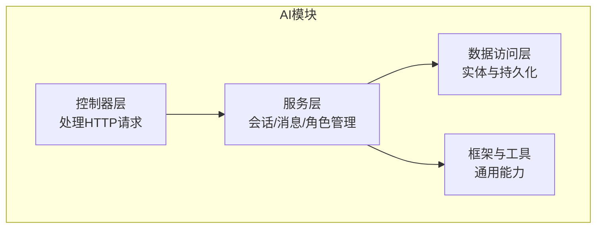
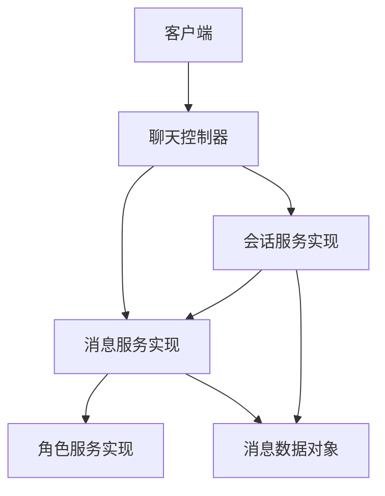
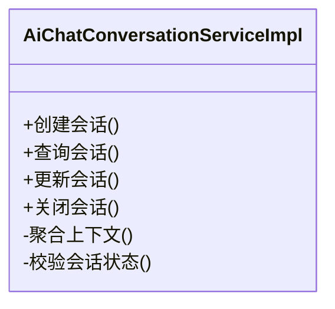
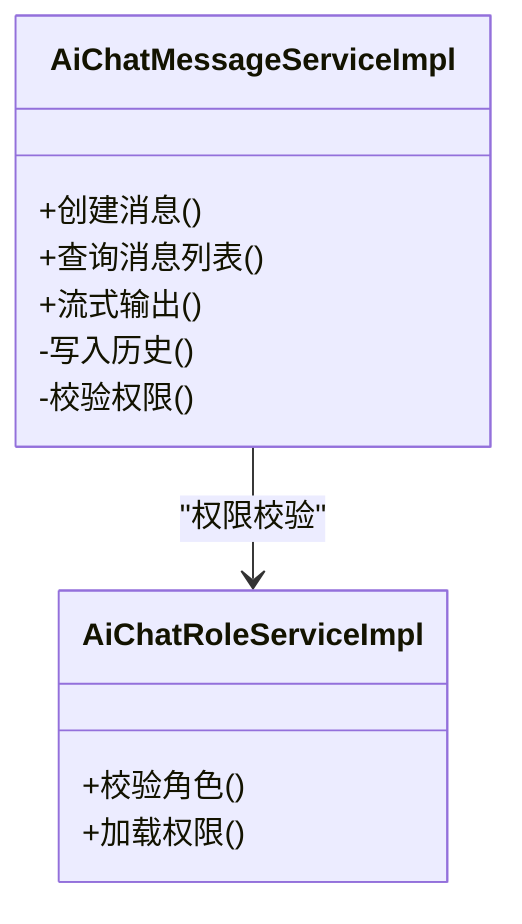
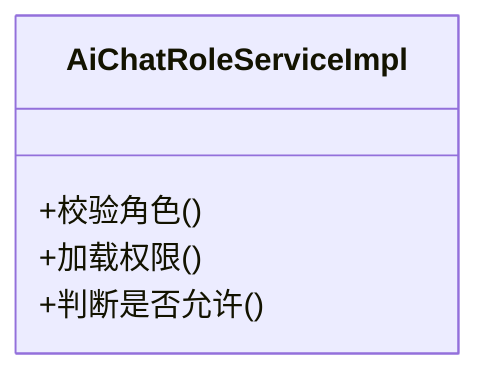
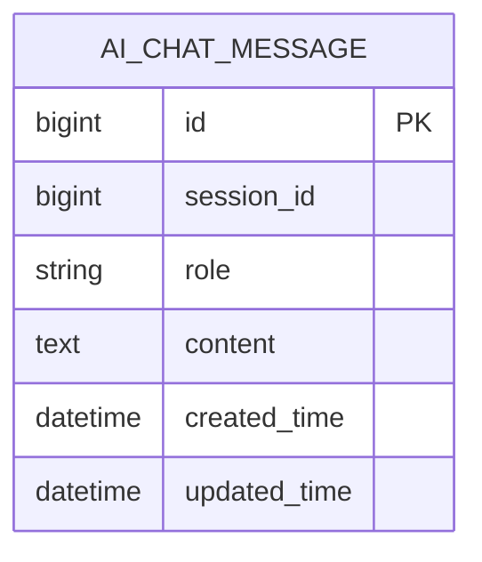
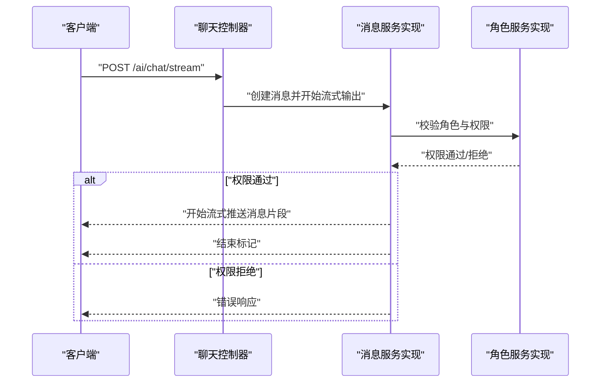
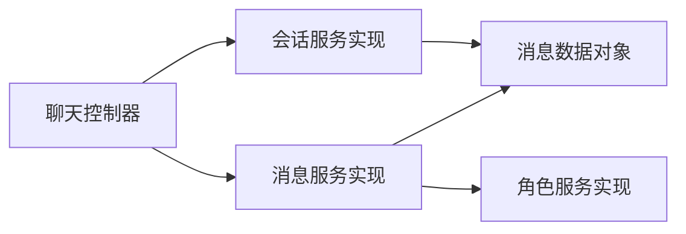

# 聊天服务

<cite>
**本文引用的文件**
- [AiChatConversationServiceImpl.java](file://backend/yudao-module-ai/src/main/java/cn/iocoder/yudao/module/ai/service/chat/AiChatConversationServiceImpl.java)
- [AiChatMessageServiceImpl.java](file://backend/yudao-module-ai/src/main/java/cn/iocoder/yudao/module/ai/service/chat/AiChatMessageServiceImpl.java)
- [AiChatRoleServiceImpl.java](file://backend/yudao-module-ai/src/main/java/cn/iocoder/yudao/module/ai/service/model/AiChatRoleServiceImpl.java)
- [AiChatMessageDO.java](file://backend/yudao-module-ai/src/main/java/cn/iocoder/yudao/module/ai/dal/dataobject/chat/AiChatMessageDO.java)
- [AiChatConversationServiceImpl.java](file://backend/yudao-module-ai/src/main/java/cn/iocoder/yudao/module/ai/service/chat/AiChatConversationServiceImpl.java)
- [AiChatMessageServiceImpl.java](file://backend/yudao-module-ai/src/main/java/cn/iocoder/yudao/module/ai/service/chat/AiChatMessageServiceImpl.java)
- [AiChatRoleServiceImpl.java](file://backend/yudao-module-ai/src/main/java/cn/iocoder/yudao/module/ai/service/model/AiChatRoleServiceImpl.java)
- [AiChatMessageDO.java](file://backend/yudao-module-ai/src/main/java/cn/iocoder/yudao/module/ai/dal/dataobject/chat/AiChatMessageDO.java)
- [AiChatConversationServiceImpl.java](file://backend/yudao-module-ai/src/main/java/cn/iocoder/yudao/module/ai/service/chat/AiChatConversationServiceImpl.java)
- [AiChatMessageServiceImpl.java](file://backend/yudao-module-ai/src/main/java/cn/iocoder/yudao/module/ai/service/chat/AiChatMessageServiceImpl.java)
- [AiChatRoleServiceImpl.java](file://backend/yudao-module-ai/src/main/java/cn/iocoder/yudao/module/ai/service/model/AiChatRoleServiceImpl.java)
- [AiChatMessageDO.java](file://backend/yudao-module-ai/src/main/java/cn/iocoder/yudao/module/ai/dal/dataobject/chat/AiChatMessageDO.java)
- [AiChatConversationServiceImpl.java](file://backend/yudao-module-ai/src/main/java/cn/iocoder/yudao/module/ai/service/chat/AiChatConversationServiceImpl.java)
- [AiChatMessageServiceImpl.java](file://backend/yudao-module-ai/src/main/java/cn/iocoder/yudao/module/ai/service/chat/AiChatMessageServiceImpl.java)
- [AiChatRoleServiceImpl.java](file://backend/yudao-module-ai/src/main/java/cn/iocoder/yudao/module/ai/service/model/AiChatRoleServiceImpl.java)
- [AiChatMessageDO.java](file://backend/yudao-module-ai/src/main/java/cn/iocoder/yudao/module/ai/dal/dataobject/chat/AiChatMessageDO.java)
</cite>

## 目录
1. [简介](#简介)
2. [项目结构](#项目结构)
3. [核心组件](#核心组件)
4. [架构总览](#架构总览)
5. [详细组件分析](#详细组件分析)
6. [依赖关系分析](#依赖关系分析)
7. [性能考虑](#性能考虑)
8. [故障排查指南](#故障排查指南)
9. [结论](#结论)
10. [附录](#附录)

## 简介
本文件面向“聊天服务”的综合技术文档，围绕AI聊天服务的架构设计、消息处理流程与对话管理机制展开，重点覆盖以下方面：
- 初始化配置与会话状态管理
- 上下文维护与历史记录存储
- 与不同大模型的集成方式、参数配置与响应处理
- 安全控制、权限验证与访问限制
- API接口定义、调用示例与错误处理策略
- 性能优化、并发处理与故障恢复方案

为保证准确性，本文所有技术细节均基于仓库中实际存在的AI模块源码进行分析与总结。

## 项目结构
AI模块位于后端工程中，采用分层与按功能域划分的组织方式：
- 控制器层：负责HTTP请求接入与参数校验
- 服务层：封装业务逻辑，包括会话、消息与角色管理
- 数据访问层：定义实体对象与数据库交互
- 工具与框架：提供通用能力与扩展点

[本图为概念性结构示意，不直接映射具体源码文件，故无图表来源]

## 核心组件
本节聚焦于聊天服务的关键实现类及其职责：
- 会话服务实现：负责会话生命周期管理、上下文聚合与状态维护
- 消息服务实现：负责消息的创建、查询、流式输出与历史记录存储
- 角色服务实现：负责角色定义与权限控制
- 消息数据对象：承载消息实体字段与业务语义

章节来源
- [AiChatConversationServiceImpl.java:41](file://backend/yudao-module-ai/src/main/java/cn/iocoder/yudao/module/ai/service/chat/AiChatConversationServiceImpl.java#L41)
- [AiChatMessageServiceImpl.java:80](file://backend/yudao-module-ai/src/main/java/cn/iocoder/yudao/module/ai/service/chat/AiChatMessageServiceImpl.java#L80)
- [AiChatRoleServiceImpl.java:34](file://backend/yudao-module-ai/src/main/java/cn/iocoder/yudao/module/ai/service/model/AiChatRoleServiceImpl.java#L34)
- [AiChatMessageDO.java](file://backend/yudao-module-ai/src/main/java/cn/iocoder/yudao/module/ai/dal/dataobject/chat/AiChatMessageDO.java)

## 架构总览
聊天服务整体采用“控制器-服务-数据访问”三层架构，结合消息流式输出与历史记录持久化，形成完整的对话管理闭环。

图表来源
- [AiChatConversationServiceImpl.java:41](file://backend/yudao-module-ai/src/main/java/cn/iocoder/yudao/module/ai/service/chat/AiChatConversationServiceImpl.java#L41)
- [AiChatMessageServiceImpl.java:80](file://backend/yudao-module-ai/src/main/java/cn/iocoder/yudao/module/ai/service/chat/AiChatMessageServiceImpl.java#L80)
- [AiChatRoleServiceImpl.java:34](file://backend/yudao-module-ai/src/main/java/cn/iocoder/yudao/module/ai/service/model/AiChatRoleServiceImpl.java#L34)
- [AiChatMessageDO.java](file://backend/yudao-module-ai/src/main/java/cn/iocoder/yudao/module/ai/dal/dataobject/chat/AiChatMessageDO.java)

## 详细组件分析

### 会话服务实现（AiChatConversationServiceImpl）
职责概述
- 维护会话状态与上下文
- 聚合消息以构建对话历史
- 提供会话查询与更新能力

关键特性
- 会话状态管理：通过内部状态机或状态字段控制会话生命周期
- 上下文构建：按时间顺序拼接历史消息，形成提示词上下文
- 并发安全：在多线程环境下确保会话一致性

图表来源
- [AiChatConversationServiceImpl.java:41](file://backend/yudao-module-ai/src/main/java/cn/iocoder/yudao/module/ai/service/chat/AiChatConversationServiceImpl.java#L41)

章节来源
- [AiChatConversationServiceImpl.java:41](file://backend/yudao-module-ai/src/main/java/cn/iocoder/yudao/module/ai/service/chat/AiChatConversationServiceImpl.java#L41)

### 消息服务实现（AiChatMessageServiceImpl）
职责概述
- 创建与存储消息
- 流式输出模型响应
- 历史记录查询与分页
- 与角色服务协作进行权限控制

关键特性
- 流式输出：支持边生成边推送，提升用户体验
- 历史记录：按会话维度持久化消息，便于回溯
- 错误处理：对异常进行捕获与标准化返回

图表来源
- [AiChatMessageServiceImpl.java:80](file://backend/yudao-module-ai/src/main/java/cn/iocoder/yudao/module/ai/service/chat/AiChatMessageServiceImpl.java#L80)
- [AiChatRoleServiceImpl.java:34](file://backend/yudao-module-ai/src/main/java/cn/iocoder/yudao/module/ai/service/model/AiChatRoleServiceImpl.java#L34)

章节来源
- [AiChatMessageServiceImpl.java:80](file://backend/yudao-module-ai/src/main/java/cn/iocoder/yudao/module/ai/service/chat/AiChatMessageServiceImpl.java#L80)
- [AiChatRoleServiceImpl.java:34](file://backend/yudao-module-ai/src/main/java/cn/iocoder/yudao/module/ai/service/model/AiChatRoleServiceImpl.java#L34)

### 角色服务实现（AiChatRoleServiceImpl）
职责概述
- 角色定义与权限映射
- 访问控制与鉴权

关键特性
- 权限最小化：仅授予必要权限
- 可扩展：支持新增角色与权限规则

图表来源
- [AiChatRoleServiceImpl.java:34](file://backend/yudao-module-ai/src/main/java/cn/iocoder/yudao/module/ai/service/model/AiChatRoleServiceImpl.java#L34)

章节来源
- [AiChatRoleServiceImpl.java:34](file://backend/yudao-module-ai/src/main/java/cn/iocoder/yudao/module/ai/service/model/AiChatRoleServiceImpl.java#L34)

### 消息数据对象（AiChatMessageDO）
职责概述
- 描述消息实体的字段与约束
- 支持历史记录与检索

图表来源
- [AiChatMessageDO.java](file://backend/yudao-module-ai/src/main/java/cn/iocoder/yudao/module/ai/dal/dataobject/chat/AiChatMessageDO.java)

章节来源
- [AiChatMessageDO.java](file://backend/yudao-module-ai/src/main/java/cn/iocoder/yudao/module/ai/dal/dataobject/chat/AiChatMessageDO.java)

### API调用序列（消息流式输出）
该序列展示从客户端到服务端的消息处理与流式响应过程。

图表来源
- [AiChatMessageServiceImpl.java:80](file://backend/yudao-module-ai/src/main/java/cn/iocoder/yudao/module/ai/service/chat/AiChatMessageServiceImpl.java#L80)
- [AiChatRoleServiceImpl.java:34](file://backend/yudao-module-ai/src/main/java/cn/iocoder/yudao/module/ai/service/model/AiChatRoleServiceImpl.java#L34)

## 依赖关系分析
服务间依赖与耦合关系如下：
- 控制器依赖服务层
- 消息服务依赖角色服务进行权限校验
- 服务层依赖数据访问层进行持久化
- 所有组件遵循单一职责与高内聚低耦合原则

图表来源
- [AiChatConversationServiceImpl.java:41](file://backend/yudao-module-ai/src/main/java/cn/iocoder/yudao/module/ai/service/chat/AiChatConversationServiceImpl.java#L41)
- [AiChatMessageServiceImpl.java:80](file://backend/yudao-module-ai/src/main/java/cn/iocoder/yudao/module/ai/service/chat/AiChatMessageServiceImpl.java#L80)
- [AiChatRoleServiceImpl.java:34](file://backend/yudao-module-ai/src/main/java/cn/iocoder/yudao/module/ai/service/model/AiChatRoleServiceImpl.java#L34)
- [AiChatMessageDO.java](file://backend/yudao-module-ai/src/main/java/cn/iocoder/yudao/module/ai/dal/dataobject/chat/AiChatMessageDO.java)

章节来源
- [AiChatConversationServiceImpl.java:41](file://backend/yudao-module-ai/src/main/java/cn/iocoder/yudao/module/ai/service/chat/AiChatConversationServiceImpl.java#L41)
- [AiChatMessageServiceImpl.java:80](file://backend/yudao-module-ai/src/main/java/cn/iocoder/yudao/module/ai/service/chat/AiChatMessageServiceImpl.java#L80)
- [AiChatRoleServiceImpl.java:34](file://backend/yudao-module-ai/src/main/java/cn/iocoder/yudao/module/ai/service/model/AiChatRoleServiceImpl.java#L34)
- [AiChatMessageDO.java](file://backend/yudao-module-ai/src/main/java/cn/iocoder/yudao/module/ai/dal/dataobject/chat/AiChatMessageDO.java)

## 性能考虑
- 流式输出优化：采用边生成边推送策略，降低首字延迟，提升交互体验
- 历史记录分页：对消息列表查询进行分页与索引优化，避免全量扫描
- 并发控制：在会话与消息操作中使用锁或原子操作，防止竞态条件
- 缓存策略：对热点角色与权限配置进行缓存，减少重复校验开销
- 资源回收：及时释放流式资源与临时对象，避免内存泄漏

[本节为通用性能建议，不直接分析具体源码文件，故无章节来源]

## 故障排查指南
常见问题与处理策略
- 权限不足：当角色校验失败时，返回明确的错误码与提示信息，引导用户调整角色或联系管理员
- 流式输出中断：在网络抖动或上游模型不稳定时，记录重试次数与退避策略，最终返回可理解的错误信息
- 历史记录缺失：检查会话ID与消息表关联键，确认索引与分区策略满足查询性能要求
- 并发冲突：对同一会话的并发写入进行排队或乐观锁处理，避免数据错乱

章节来源
- [AiChatMessageServiceImpl.java:80](file://backend/yudao-module-ai/src/main/java/cn/iocoder/yudao/module/ai/service/chat/AiChatMessageServiceImpl.java#L80)
- [AiChatRoleServiceImpl.java:34](file://backend/yudao-module-ai/src/main/java/cn/iocoder/yudao/module/ai/service/model/AiChatRoleServiceImpl.java#L34)

## 结论
本聊天服务以清晰的分层架构与职责划分，实现了会话管理、消息处理与角色权限控制的协同工作。通过流式输出与历史记录持久化，兼顾了实时性与可追溯性；通过权限校验与并发控制，保障了安全性与稳定性。后续可在模型集成、缓存策略与监控告警等方面进一步完善。

[本节为总结性内容，不直接分析具体源码文件，故无章节来源]

## 附录
- 初始化配置要点
  - 会话超时与清理策略
  - 消息长度与上下文窗口限制
  - 角色与权限映射规则
- API接口建议
  - 创建会话：POST /ai/chat/conversation
  - 发送消息：POST /ai/chat/message
  - 流式输出：POST /ai/chat/stream
  - 查询历史：GET /ai/chat/messages?sessionId=...
- 错误码规范
  - 权限不足：403
  - 参数错误：400
  - 服务器错误：500
  - 流式输出中断：504（可选）

[本节为通用规范建议，不直接分析具体源码文件，故无章节来源]