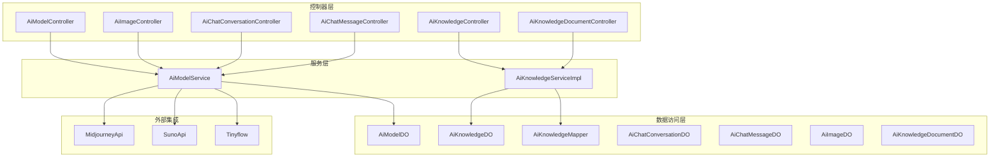
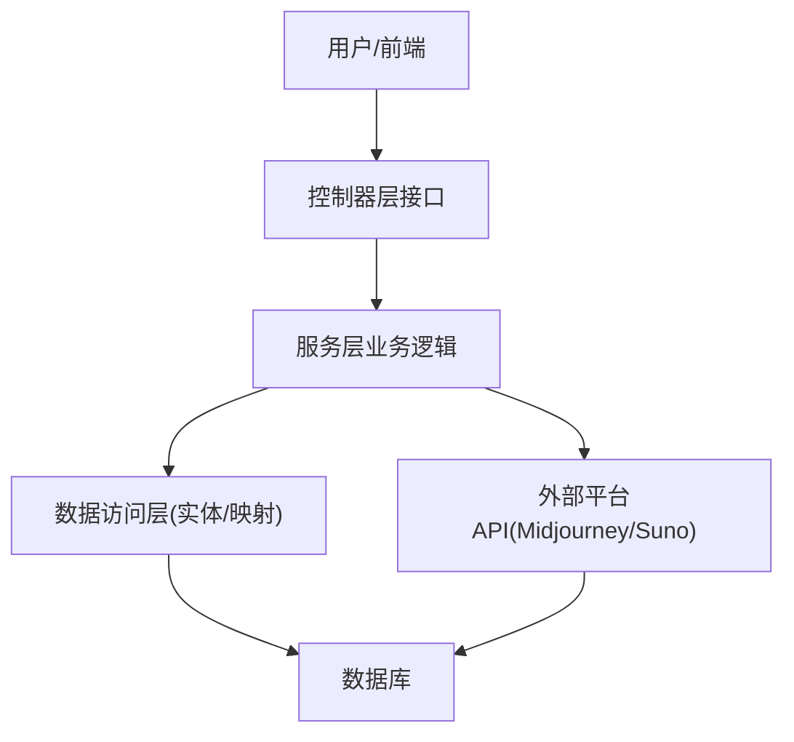
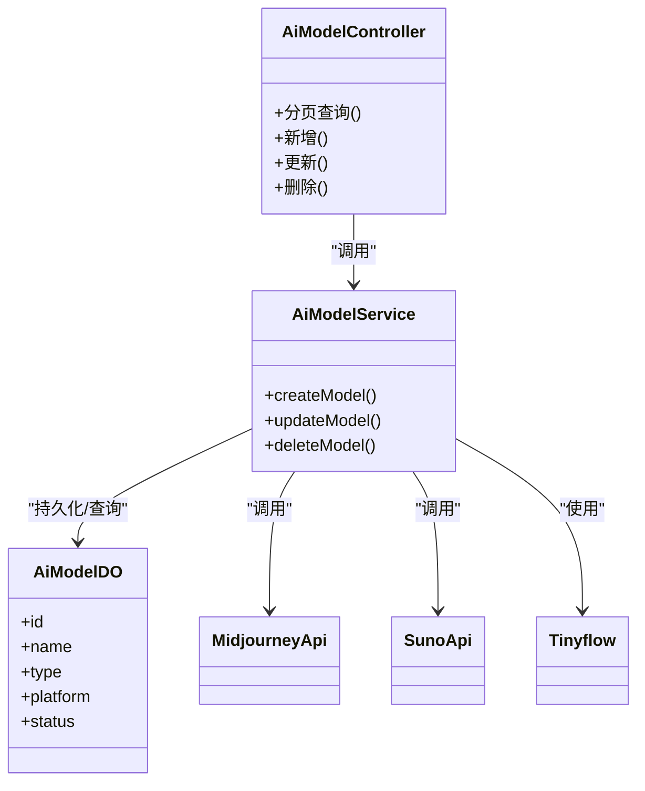
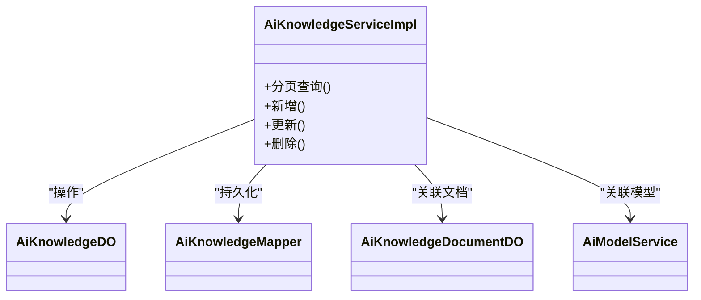
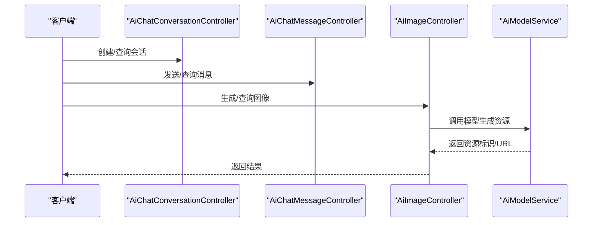
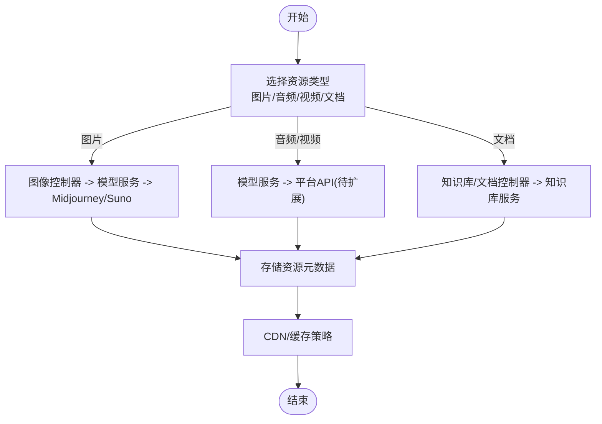
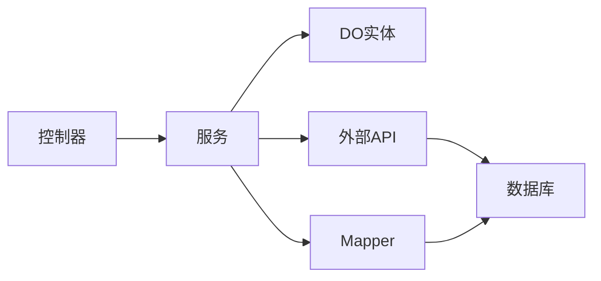

# 资源管理

<cite>
**本文引用的文件**
- [AiModelController.java](file://backend/yudao-module-ai/src/main/java/cn/iocoder/yudao/module/ai/controller/admin/model/AiModelController.java)
- [AiModelService.java](file://backend/yudao-module-ai/src/main/java/cn/iocoder/yudao/module/ai/service/model/AiModelService.java)
- [AiKnowledgeServiceImpl.java](file://backend/yudao-module-ai/src/main/java/cn/iocoder/yudao/module/ai/service/knowledge/AiKnowledgeServiceImpl.java)
- [AiChatConversationController.java](file://backend/yudao-module-ai/src/main/java/cn/iocoder/yudao/module/ai/controller/admin/chat/AiChatConversationController.java)
- [AiChatMessageController.java](file://backend/yudao-module-ai/src/main/java/cn/iocoder/yudao/module/ai/controller/admin/chat/AiChatMessageController.java)
- [AiImageController.java](file://backend/yudao-module-ai/src/main/java/cn/iocoder/yudao/module/ai/controller/admin/image/AiImageController.java)
- [AiKnowledgeController.java](file://backend/yudao-module-ai/src/main/java/cn/iocoder/yudao/module/ai/controller/admin/knowledge/AiKnowledgeController.java)
- [AiKnowledgeDocumentController.java](file://backend/yudao-module-ai/src/main/java/cn/iocoder/yudao/module/ai/controller/admin/knowledge/AiKnowledgeDocumentController.java)
- [MidjourneyApi.java](file://backend/yudao-module-ai/src/main/java/cn/iocoder/yudao/module/ai/framework/ai/core/model/midjourney/api/MidjourneyApi.java)
- [SunoApi.java](file://backend/yudao-module-ai/src/main/java/cn/iocoder/yudao/module/ai/framework/ai/core/model/suno/api/SunoApi.java)
- [Tinyflow.java](file://backend/yudao-module-ai/src/main/java/cn/iocoder/yudao/module/ai/service/model/Tinyflow.java)
- [AiModelDO.java](file://backend/yudao-module-ai/src/main/java/cn/iocoder/yudao/module/ai/dal/dataobject/model/AiModelDO.java)
- [AiKnowledgeDO.java](file://backend/yudao-module-ai/src/main/java/cn/iocoder/yudao/module/ai/dal/dataobject/knowledge/AiKnowledgeDO.java)
- [AiKnowledgeMapper.java](file://backend/yudao-module-ai/src/main/java/cn/iocoder/yudao/module/ai/dal/mysql/knowledge/AiKnowledgeMapper.java)
- [AiChatConversationDO.java](file://backend/yudao-module-ai/src/main/java/cn/iocoder/yudao/module/ai/dal/dataobject/chat/AiChatConversationDO.java)
- [AiChatMessageDO.java](file://backend/yudao-module-ai/src/main/java/cn/iocoder/yudao/module/ai/dal/dataobject/chat/AiChatMessageDO.java)
- [AiImageDO.java](file://backend/yudao-module-ai/src/main/java/cn/iocoder/yudao/module/ai/dal/dataobject/image/AiImageDO.java)
- [AiKnowledgeDocumentDO.java](file://backend/yudao-module-ai/src/main/java/cn/iocoder/yudao/module/ai/dal/dataobject/knowledge/AiKnowledgeDocumentDO.java)
- [ruoyi-vue-pro.sql](file://backend/sql/sqlserver/ruoyi-vue-pro.sql)
- [system_menu 表结构](file://backend/sql/sqlserver/ruoyi-vue-pro.sql)
- [system_dict_data 表结构](file://backend/sql/sqlserver/ruoyi-vue-pro.sql)
</cite>

## 目录
1. [简介](#简介)
2. [项目结构](#项目结构)
3. [核心组件](#核心组件)
4. [架构总览](#架构总览)
5. [详细组件分析](#详细组件分析)
6. [依赖分析](#依赖分析)
7. [性能考虑](#性能考虑)
8. [故障排查指南](#故障排查指南)
9. [结论](#结论)
10. [附录](#附录)

## 简介
本文件面向“AI资源管理系统”，聚焦于AI模块中资源文件的存储、检索、版本管理与访问控制机制。结合现有代码与数据库脚本，系统性梳理了图片、音频、视频、文档等资源在后端的处理流程、与AI工具函数的关联关系、动态加载与预加载机制，并给出配置参数、性能指标与监控建议，以及最佳实践与扩展开发指南。

## 项目结构
AI资源管理主要位于后端 yudao-module-ai 模块，围绕以下层次组织：
- 控制器层：负责对外接口与权限控制
- 服务层：封装业务逻辑与外部AI能力对接
- 数据访问层：DAO/DO/Mapper，承载资源与会话/知识库等实体
- 框架与工具：与Midjourney、Suno等平台API对接，以及内部Tinyflow等能力

图表来源
- [AiModelController.java:1-31](file://backend/yudao-module-ai/src/main/java/cn/iocoder/yudao/module/ai/controller/admin/model/AiModelController.java#L1-L31)
- [AiImageController.java:1-50](file://backend/yudao-module-ai/src/main/java/cn/iocoder/yudao/module/ai/controller/admin/image/AiImageController.java#L1-L50)
- [AiChatConversationController.java:1-60](file://backend/yudao-module-ai/src/main/java/cn/iocoder/yudao/module/ai/controller/admin/chat/AiChatConversationController.java#L1-L60)
- [AiChatMessageController.java:1-80](file://backend/yudao-module-ai/src/main/java/cn/iocoder/yudao/module/ai/controller/admin/chat/AiChatMessageController.java#L1-L80)
- [AiKnowledgeController.java:1-60](file://backend/yudao-module-ai/src/main/java/cn/iocoder/yudao/module/ai/controller/admin/knowledge/AiKnowledgeController.java#L1-L60)
- [AiKnowledgeDocumentController.java:1-60](file://backend/yudao-module-ai/src/main/java/cn/iocoder/yudao/module/ai/controller/admin/knowledge/AiKnowledgeDocumentController.java#L1-L60)
- [AiModelService.java:1-49](file://backend/yudao-module-ai/src/main/java/cn/iocoder/yudao/module/ai/service/model/AiModelService.java#L1-L49)
- [AiKnowledgeServiceImpl.java:1-36](file://backend/yudao-module-ai/src/main/java/cn/iocoder/yudao/module/ai/service/knowledge/AiKnowledgeServiceImpl.java#L1-L36)
- [AiModelDO.java:1-200](file://backend/yudao-module-ai/src/main/java/cn/iocoder/yudao/module/ai/dal/dataobject/model/AiModelDO.java#L1-L200)
- [AiKnowledgeDO.java:1-200](file://backend/yudao-module-ai/src/main/java/cn/iocoder/yudao/module/ai/dal/dataobject/knowledge/AiKnowledgeDO.java#L1-L200)
- [AiKnowledgeMapper.java:1-200](file://backend/yudao-module-ai/src/main/java/cn/iocoder/yudao/module/ai/dal/mysql/knowledge/AiKnowledgeMapper.java#L1-L200)
- [AiChatConversationDO.java:1-200](file://backend/yudao-module-ai/src/main/java/cn/iocoder/yudao/module/ai/dal/dataobject/chat/AiChatConversationDO.java#L1-L200)
- [AiChatMessageDO.java:1-200](file://backend/yudao-module-ai/src/main/java/cn/iocoder/yudao/module/ai/dal/dataobject/chat/AiChatMessageDO.java#L1-L200)
- [AiImageDO.java:1-200](file://backend/yudao-module-ai/src/main/java/cn/iocoder/yudao/module/ai/dal/dataobject/image/AiImageDO.java#L1-L200)
- [AiKnowledgeDocumentDO.java:1-200](file://backend/yudao-module-ai/src/main/java/cn/iocoder/yudao/module/ai/dal/dataobject/knowledge/AiKnowledgeDocumentDO.java#L1-L200)
- [MidjourneyApi.java:1-200](file://backend/yudao-module-ai/src/main/java/cn/iocoder/yudao/module/ai/framework/ai/core/model/midjourney/api/MidjourneyApi.java#L1-L200)
- [SunoApi.java:1-200](file://backend/yudao-module-ai/src/main/java/cn/iocoder/yudao/module/ai/framework/ai/core/model/suno/api/SunoApi.java#L1-L200)
- [Tinyflow.java:1-200](file://backend/yudao-module-ai/src/main/java/cn/iocoder/yudao/module/ai/service/model/Tinyflow.java#L1-L200)

章节来源
- [AiModelController.java:1-31](file://backend/yudao-module-ai/src/main/java/cn/iocoder/yudao/module/ai/controller/admin/model/AiModelController.java#L1-L31)
- [AiModelService.java:1-49](file://backend/yudao-module-ai/src/main/java/cn/iocoder/yudao/module/ai/service/model/AiModelService.java#L1-L49)
- [AiKnowledgeServiceImpl.java:1-36](file://backend/yudao-module-ai/src/main/java/cn/iocoder/yudao/module/ai/service/knowledge/AiKnowledgeServiceImpl.java#L1-L36)

## 核心组件
- 模型管理控制器与服务：负责AI模型的增删改查与分页，关联到具体平台API与内部Tinyflow能力。
- 知识库服务：封装知识库与文档的CRUD、分页与关联模型查询。
- 聊天与图像控制器：面向会话与图像生成的资源入口，便于后续扩展至音频/视频。
- 外部平台API：Midjourney与Suno等平台的调用封装，作为资源生成与检索的上游能力。

章节来源
- [AiModelController.java:1-31](file://backend/yudao-module-ai/src/main/java/cn/iocoder/yudao/module/ai/controller/admin/model/AiModelController.java#L1-L31)
- [AiModelService.java:1-49](file://backend/yudao-module-ai/src/main/java/cn/iocoder/yudao/module/ai/service/model/AiModelService.java#L1-L49)
- [AiKnowledgeServiceImpl.java:1-36](file://backend/yudao-module-ai/src/main/java/cn/iocoder/yudao/module/ai/service/knowledge/AiKnowledgeServiceImpl.java#L1-L36)
- [AiChatConversationController.java:1-60](file://backend/yudao-module-ai/src/main/java/cn/iocoder/yudao/module/ai/controller/admin/chat/AiChatConversationController.java#L1-L60)
- [AiChatMessageController.java:1-80](file://backend/yudao-module-ai/src/main/java/cn/iocoder/yudao/module/ai/controller/admin/chat/AiChatMessageController.java#L1-L80)
- [AiImageController.java:1-50](file://backend/yudao-module-ai/src/main/java/cn/iocoder/yudao/module/ai/controller/admin/image/AiImageController.java#L1-L50)
- [AiKnowledgeController.java:1-60](file://backend/yudao-module-ai/src/main/java/cn/iocoder/yudao/module/ai/controller/admin/knowledge/AiKnowledgeController.java#L1-L60)
- [AiKnowledgeDocumentController.java:1-60](file://backend/yudao-module-ai/src/main/java/cn/iocoder/yudao/module/ai/controller/admin/knowledge/AiKnowledgeDocumentController.java#L1-L60)

## 架构总览
系统采用“控制器-服务-数据访问-外部平台”的分层架构，资源管理通过模型与知识库两条主线贯穿：
- 图像/音频/视频等资源通常由模型服务生成或关联；聊天会话承载多轮对话与资源引用；知识库提供文档检索与向量化支持。
- 访问控制通过权限注解与菜单/字典配置落地，确保资源操作的最小授权。

图表来源
- [AiModelController.java:1-31](file://backend/yudao-module-ai/src/main/java/cn/iocoder/yudao/module/ai/controller/admin/model/AiModelController.java#L1-L31)
- [AiModelService.java:1-49](file://backend/yudao-module-ai/src/main/java/cn/iocoder/yudao/module/ai/service/model/AiModelService.java#L1-L49)
- [AiKnowledgeServiceImpl.java:1-36](file://backend/yudao-module-ai/src/main/java/cn/iocoder/yudao/module/ai/service/knowledge/AiKnowledgeServiceImpl.java#L1-L36)
- [MidjourneyApi.java:1-200](file://backend/yudao-module-ai/src/main/java/cn/iocoder/yudao/module/ai/framework/ai/core/model/midjourney/api/MidjourneyApi.java#L1-L200)
- [SunoApi.java:1-200](file://backend/yudao-module-ai/src/main/java/cn/iocoder/yudao/module/ai/framework/ai/core/model/suno/api/SunoApi.java#L1-L200)

## 详细组件分析

### 模型管理组件
- 控制器职责：提供模型的分页查询、新增、更新、删除接口，配合权限注解进行访问控制。
- 服务职责：封装模型的创建/更新/删除逻辑，协调外部平台API与内部Tinyflow能力。
- 数据对象：AiModelDO承载模型元数据，包括名称、类型、平台、状态等字段。

图表来源
- [AiModelController.java:1-31](file://backend/yudao-module-ai/src/main/java/cn/iocoder/yudao/module/ai/controller/admin/model/AiModelController.java#L1-L31)
- [AiModelService.java:1-49](file://backend/yudao-module-ai/src/main/java/cn/iocoder/yudao/module/ai/service/model/AiModelService.java#L1-L49)
- [AiModelDO.java:1-200](file://backend/yudao-module-ai/src/main/java/cn/iocoder/yudao/module/ai/dal/dataobject/model/AiModelDO.java#L1-L200)
- [MidjourneyApi.java:1-200](file://backend/yudao-module-ai/src/main/java/cn/iocoder/yudao/module/ai/framework/ai/core/model/midjourney/api/MidjourneyApi.java#L1-L200)
- [SunoApi.java:1-200](file://backend/yudao-module-ai/src/main/java/cn/iocoder/yudao/module/ai/framework/ai/core/model/suno/api/SunoApi.java#L1-L200)
- [Tinyflow.java:1-200](file://backend/yudao-module-ai/src/main/java/cn/iocoder/yudao/module/ai/service/model/Tinyflow.java#L1-L200)

章节来源
- [AiModelController.java:1-31](file://backend/yudao-module-ai/src/main/java/cn/iocoder/yudao/module/ai/controller/admin/model/AiModelController.java#L1-L31)
- [AiModelService.java:1-49](file://backend/yudao-module-ai/src/main/java/cn/iocoder/yudao/module/ai/service/model/AiModelService.java#L1-L49)
- [AiModelDO.java:1-200](file://backend/yudao-module-ai/src/main/java/cn/iocoder/yudao/module/ai/dal/dataobject/model/AiModelDO.java#L1-L200)

### 知识库与文档组件
- 知识库服务：封装知识库的CRUD与分页，关联模型查询；文档管理提供文档的保存与检索。
- 数据访问：AiKnowledgeMapper负责知识库与文档的持久化操作。

图表来源
- [AiKnowledgeServiceImpl.java:1-36](file://backend/yudao-module-ai/src/main/java/cn/iocoder/yudao/module/ai/service/knowledge/AiKnowledgeServiceImpl.java#L1-L36)
- [AiKnowledgeDO.java:1-200](file://backend/yudao-module-ai/src/main/java/cn/iocoder/yudao/module/ai/dal/dataobject/knowledge/AiKnowledgeDO.java#L1-L200)
- [AiKnowledgeMapper.java:1-200](file://backend/yudao-module-ai/src/main/java/cn/iocoder/yudao/module/ai/dal/mysql/knowledge/AiKnowledgeMapper.java#L1-L200)
- [AiKnowledgeDocumentDO.java:1-200](file://backend/yudao-module-ai/src/main/java/cn/iocoder/yudao/module/ai/dal/dataobject/knowledge/AiKnowledgeDocumentDO.java#L1-L200)
- [AiModelService.java:1-49](file://backend/yudao-module-ai/src/main/java/cn/iocoder/yudao/module/ai/service/model/AiModelService.java#L1-L49)

章节来源
- [AiKnowledgeServiceImpl.java:1-36](file://backend/yudao-module-ai/src/main/java/cn/iocoder/yudao/module/ai/service/knowledge/AiKnowledgeServiceImpl.java#L1-L36)
- [AiKnowledgeMapper.java:1-200](file://backend/yudao-module-ai/src/main/java/cn/iocoder/yudao/module/ai/dal/mysql/knowledge/AiKnowledgeMapper.java#L1-L200)

### 聊天与图像组件
- 聊天控制器：会话与消息的管理接口，便于后续扩展资源引用与版本记录。
- 图像控制器：图像生成/管理入口，可与模型服务联动实现资源生成与检索。

图表来源
- [AiChatConversationController.java:1-60](file://backend/yudao-module-ai/src/main/java/cn/iocoder/yudao/module/ai/controller/admin/chat/AiChatConversationController.java#L1-L60)
- [AiChatMessageController.java:1-80](file://backend/yudao-module-ai/src/main/java/cn/iocoder/yudao/module/ai/controller/admin/chat/AiChatMessageController.java#L1-L80)
- [AiImageController.java:1-50](file://backend/yudao-module-ai/src/main/java/cn/iocoder/yudao/module/ai/controller/admin/image/AiImageController.java#L1-L50)
- [AiModelService.java:1-49](file://backend/yudao-module-ai/src/main/java/cn/iocoder/yudao/module/ai/service/model/AiModelService.java#L1-L49)

章节来源
- [AiChatConversationController.java:1-60](file://backend/yudao-module-ai/src/main/java/cn/iocoder/yudao/module/ai/controller/admin/chat/AiChatConversationController.java#L1-L60)
- [AiChatMessageController.java:1-80](file://backend/yudao-module-ai/src/main/java/cn/iocoder/yudao/module/ai/controller/admin/chat/AiChatMessageController.java#L1-L80)
- [AiImageController.java:1-50](file://backend/yudao-module-ai/src/main/java/cn/iocoder/yudao/module/ai/controller/admin/image/AiImageController.java#L1-L50)

### 资源处理流程与格式转换
- 图片：通过图像控制器与模型服务联动，调用Midjourney等平台API生成图片，返回资源标识或URL，后续可接入CDN与缓存。
- 音频/视频：当前控制器未直接暴露对应接口，但服务层已预留扩展点（如AiModelService中对音频/视频模型类型的字典定义），可按相同模式扩展。
- 文档：知识库与文档控制器提供文档的保存与检索，便于后续对接向量化与检索能力。

图表来源
- [AiImageController.java:1-50](file://backend/yudao-module-ai/src/main/java/cn/iocoder/yudao/module/ai/controller/admin/image/AiImageController.java#L1-L50)
- [AiModelService.java:1-49](file://backend/yudao-module-ai/src/main/java/cn/iocoder/yudao/module/ai/service/model/AiModelService.java#L1-L49)
- [MidjourneyApi.java:1-200](file://backend/yudao-module-ai/src/main/java/cn/iocoder/yudao/module/ai/framework/ai/core/model/midjourney/api/MidjourneyApi.java#L1-L200)
- [SunoApi.java:1-200](file://backend/yudao-module-ai/src/main/java/cn/iocoder/yudao/module/ai/framework/ai/core/model/suno/api/SunoApi.java#L1-L200)
- [AiKnowledgeServiceImpl.java:1-36](file://backend/yudao-module-ai/src/main/java/cn/iocoder/yudao/module/ai/service/knowledge/AiKnowledgeServiceImpl.java#L1-L36)

章节来源
- [AiModelService.java:1-49](file://backend/yudao-module-ai/src/main/java/cn/iocoder/yudao/module/ai/service/model/AiModelService.java#L1-L49)
- [AiKnowledgeServiceImpl.java:1-36](file://backend/yudao-module-ai/src/main/java/cn/iocoder/yudao/module/ai/service/knowledge/AiKnowledgeServiceImpl.java#L1-L36)

### 版本管理与访问控制
- 版本管理：当前代码未体现显式的资源版本字段或版本表，建议在资源DO中增加版本号与时间戳字段，并在控制器中提供版本查询与回滚接口。
- 访问控制：通过系统菜单与字典配置实现最小授权，控制器方法上使用权限注解，确保仅授权用户可执行敏感操作。

章节来源
- [system_menu 表结构:6078-6083](file://backend/sql/sqlserver/ruoyi-vue-pro.sql#L6078-L6083)
- [system_dict_data 表结构:2932-2946](file://backend/sql/sqlserver/ruoyi-vue-pro.sql#L2932-L2946)

## 依赖分析
- 组件耦合：控制器依赖服务，服务依赖DO与Mapper，同时依赖外部平台API；整体保持清晰的分层与低耦合。
- 外部依赖：MidjourneyApi与SunoApi为资源生成的关键上游；Tinyflow用于内部推理/调度。
- 数据依赖：知识库与文档通过Mapper持久化，模型与聊天会话分别对应独立DO。

图表来源
- [AiModelController.java:1-31](file://backend/yudao-module-ai/src/main/java/cn/iocoder/yudao/module/ai/controller/admin/model/AiModelController.java#L1-L31)
- [AiModelService.java:1-49](file://backend/yudao-module-ai/src/main/java/cn/iocoder/yudao/module/ai/service/model/AiModelService.java#L1-L49)
- [AiKnowledgeServiceImpl.java:1-36](file://backend/yudao-module-ai/src/main/java/cn/iocoder/yudao/module/ai/service/knowledge/AiKnowledgeServiceImpl.java#L1-L36)
- [AiKnowledgeMapper.java:1-200](file://backend/yudao-module-ai/src/main/java/cn/iocoder/yudao/module/ai/dal/mysql/knowledge/AiKnowledgeMapper.java#L1-L200)

章节来源
- [AiModelService.java:1-49](file://backend/yudao-module-ai/src/main/java/cn/iocoder/yudao/module/ai/service/model/AiModelService.java#L1-L49)
- [AiKnowledgeServiceImpl.java:1-36](file://backend/yudao-module-ai/src/main/java/cn/iocoder/yudao/module/ai/service/knowledge/AiKnowledgeServiceImpl.java#L1-L36)

## 性能考虑
- 缓存策略：对热点资源（如常用模型配置、知识库索引）引入Redis缓存；对大文件资源采用CDN加速与分片传输。
- 异步处理：图像/音频/视频生成建议异步化，完成后通过消息队列通知前端。
- 分页与索引：知识库与聊天消息分页查询需建立合适索引，避免全表扫描。
- 监控指标：埋点统计资源生成耗时、CDN命中率、外部API响应延迟与错误率。

## 故障排查指南
- 权限不足：确认菜单与字典配置是否正确，控制器方法权限注解是否生效。
- 外部API异常：检查Midjourney/Suno的鉴权与配额限制，查看服务日志与重试策略。
- 数据不一致：核对Mapper与DO映射关系，关注事务边界与并发场景下的数据一致性。

章节来源
- [AiModelController.java:1-31](file://backend/yudao-module-ai/src/main/java/cn/iocoder/yudao/module/ai/controller/admin/model/AiModelController.java#L1-L31)
- [AiKnowledgeController.java:1-60](file://backend/yudao-module-ai/src/main/java/cn/iocoder/yudao/module/ai/controller/admin/knowledge/AiKnowledgeController.java#L1-L60)
- [AiKnowledgeDocumentController.java:1-60](file://backend/yudao-module-ai/src/main/java/cn/iocoder/yudao/module/ai/controller/admin/knowledge/AiKnowledgeDocumentController.java#L1-L60)

## 结论
本系统以清晰的分层架构支撑AI资源管理，控制器负责接口与权限，服务层整合模型与外部平台能力，数据访问层保障持久化。当前重点覆盖图片与知识库文档，音频/视频与版本管理可按现有扩展点逐步完善。通过CDN与缓存、异步化与监控，可进一步提升资源管理的性能与稳定性。

## 附录

### 配置参数与字典
- 资源类型字典：聊天、图像、音频、视频、向量、重排等类型枚举，用于区分模型用途与处理流程。
- 菜单权限：AI思维导图、导图管理等菜单项与对应权限，确保最小授权。

章节来源
- [system_dict_data 表结构:2932-2946](file://backend/sql/sqlserver/ruoyi-vue-pro.sql#L2932-L2946)
- [system_menu 表结构:6078-6083](file://backend/sql/sqlserver/ruoyi-vue-pro.sql#L6078-L6083)