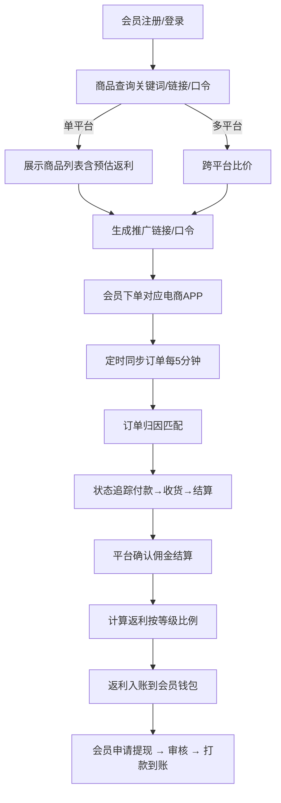
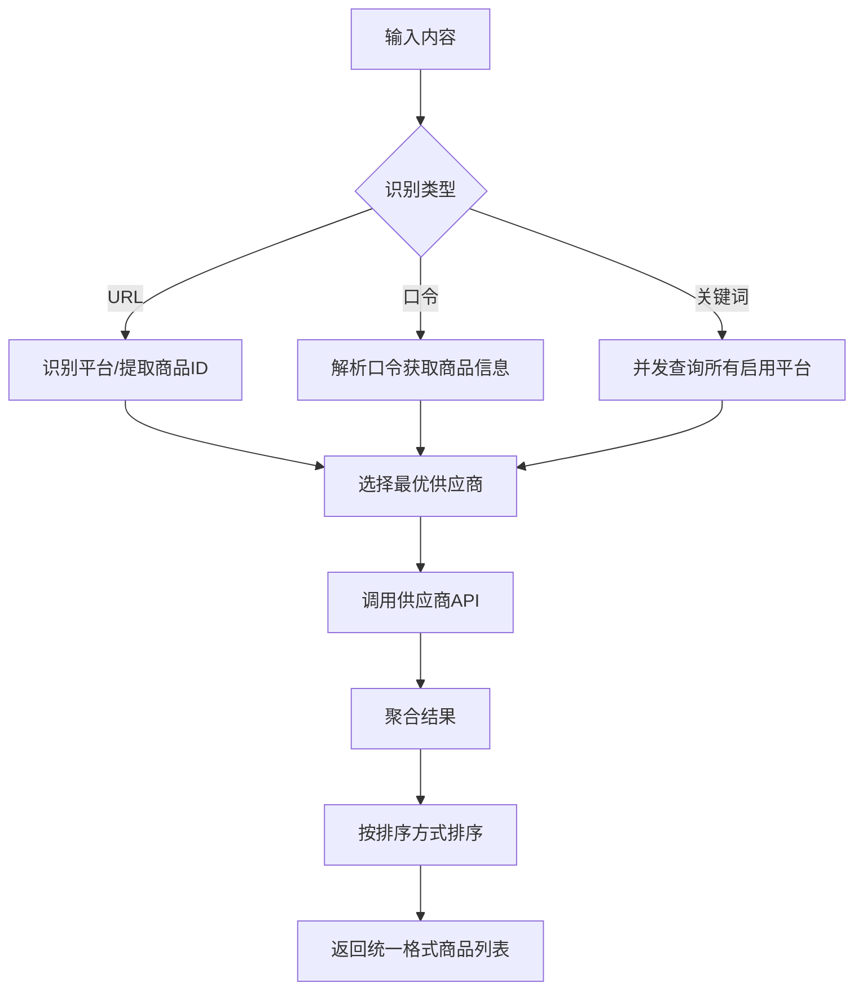
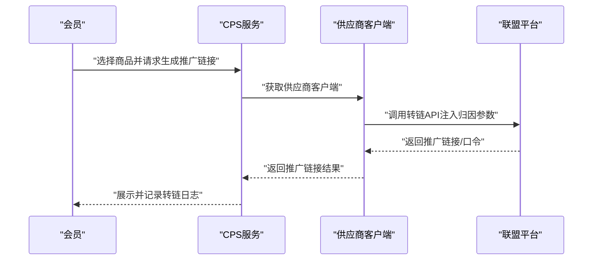
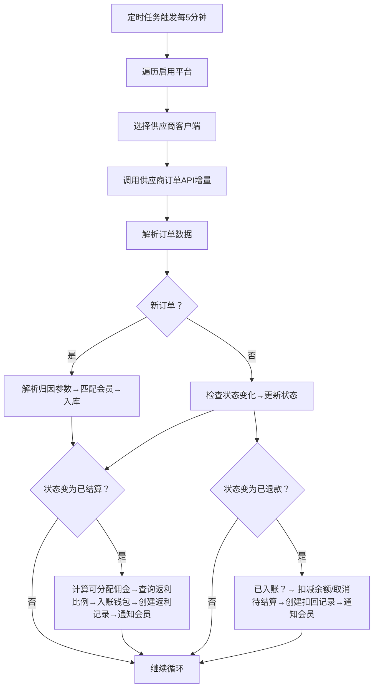
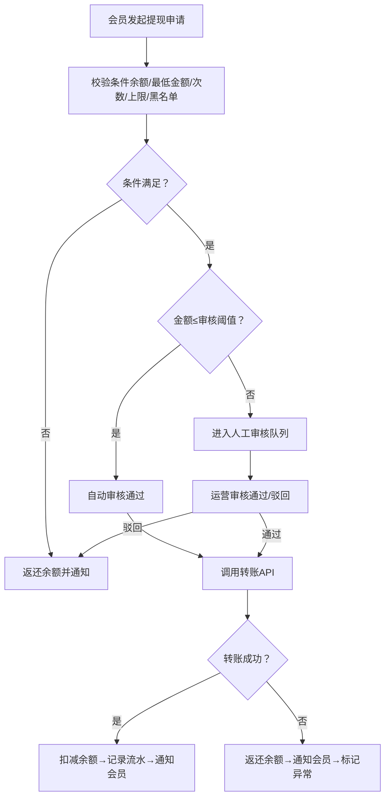
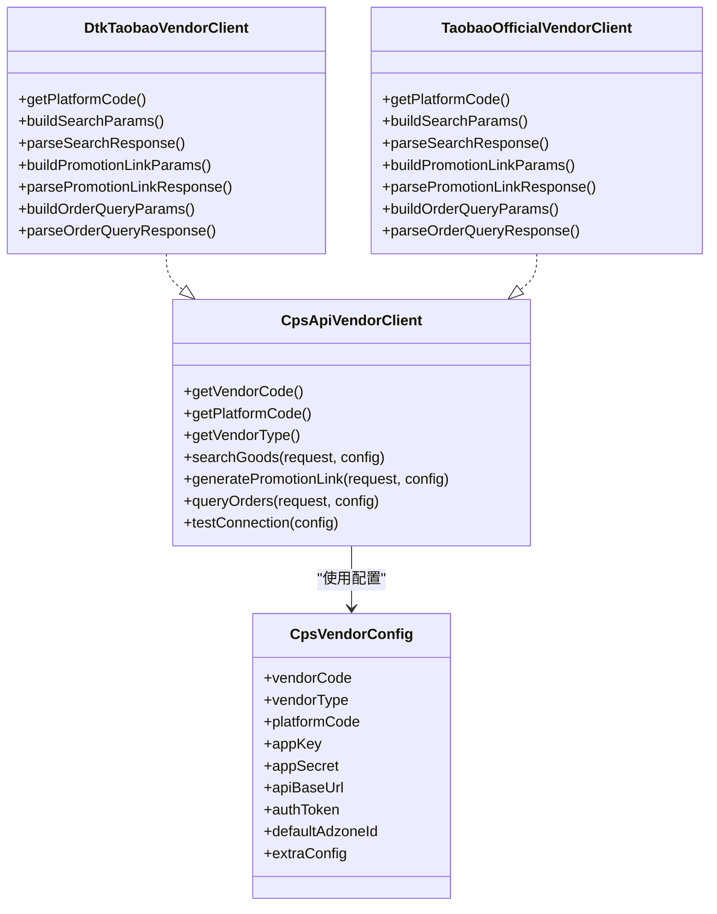
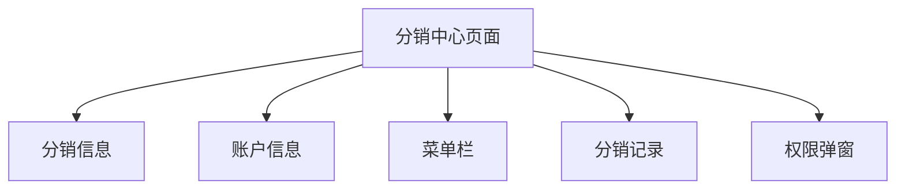
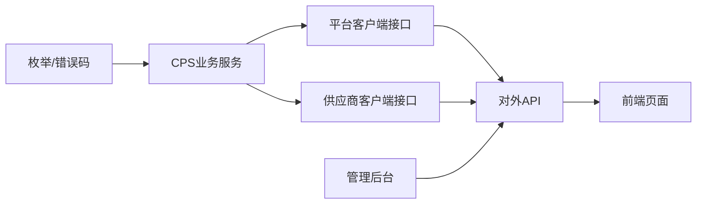

# CPS业务概述

<cite>
**本文引用的文件**
- [yudao-module-cps/pom.xml](file://backend/yudao-module-cps/pom.xml)
- [yudao-module-cps-api/pom.xml](file://backend/yudao-module-cps/yudao-module-cps-api/pom.xml)
- [CpsPlatformCodeEnum.java](file://backend/yudao-module-cps/yudao-module-cps-api/src/main/java/cn/iocoder/yudao/module/cps/enums/CpsPlatformCodeEnum.java)
- [CpsAdzoneTypeEnum.java](file://backend/yudao-module-cps/yudao-module-cps-api/src/main/java/cn/iocoder/yudao/module/cps/enums/CpsAdzoneTypeEnum.java)
- [CpsOrderStatusEnum.java](file://backend/yudao-module-cps/yudao-module-cps-api/src/main/java/cn/iocoder/yudao/module/cps/enums/CpsOrderStatusEnum.java)
- [CpsRebateStatusEnum.java](file://backend/yudao-module-cps/yudao-module-cps-api/src/main/java/cn/iocoder/yudao/module/cps/enums/CpsRebateStatusEnum.java)
- [CpsRebateTypeEnum.java](file://backend/yudao-module-cps/yudao-module-cps-api/src/main/java/cn/iocoder/yudao/module/cps/enums/CpsRebateTypeEnum.java)
- [CpsWithdrawStatusEnum.java](file://backend/yudao-module-cps/yudao-module-cps-api/src/main/java/cn/iocoder/yudao/module/cps/enums/CpsWithdrawStatusEnum.java)
- [CpsRiskRuleTypeEnum.java](file://backend/yudao-module-cps/yudao-module-cps-api/src/main/java/cn/iocoder/yudao/module/cps/enums/CpsRiskRuleTypeEnum.java)
- [CpsErrorCodeConstants.java](file://backend/yudao-module-cps/yudao-module-cps-api/src/main/java/cn/iocoder/yudao/module/cps/enums/CpsErrorCodeConstants.java)
- [CpsFreezeStatusEnum.java](file://backend/yudao-module-cps/yudao-module-cps-api/src/main/java/cn/iocoder/yudao/module/cps/enums/CpsFreezeStatusEnum.java)
- [CpsVendorCodeEnum.java](file://backend/yudao-module-cps/yudao-module-cps-api/src/main/java/cn/iocoder/yudao/module/cps/enums/CpsVendorCodeEnum.java)
- [CpsVendorConfig.java](file://backend/yudao-module-cps/yudao-module-cps-biz/src/main/java/cn/iocoder/yudao/module/cps/client/dto/CpsVendorConfig.java)
- [CpsApiVendorClient.java](file://backend/yudao-module-cps/yudao-module-cps-biz/src/main/java/cn/iocoder/yudao/module/cps/client/CpsApiVendorClient.java)
- [CpsPlatformClient.java](file://backend/yudao-module-cps/yudao-module-cps-biz/src/main/java/cn/iocoder/yudao/module/cps/client/CpsPlatformClient.java)
- [DtkTaobaoVendorClient.java](file://backend/yudao-module-cps/yudao-module-cps-biz/src/main/java/cn/iocoder/yudao/module/cps/client/dataoke/DtkTaobaoVendorClient.java)
- [TaobaoOfficialVendorClient.java](file://backend/yudao-module-cps/yudao-module-cps-biz/src/main/java/cn/iocoder/yudao/module/cps/client/official/taobao/TaobaoOfficialVendorClient.java)
- [CPS系统PRD文档.md](file://docs/CPS系统PRD文档.md)
- [index.vue](file://frontend/mall-uniapp/pages/commission/index.vue)
- [CpsOrderController.java](file://backend/yudao-module-cps/yudao-module-cps-biz/src/main/java/cn/iocoder/yudao/module/cps/controller/admin/order/CpsOrderController.java)
- [CpsStatisticsController.java](file://backend/yudao-module-cps/yudao-module-cps-biz/src/main/java/cn/iocoder/yudao/module/cps/controller/admin/statistics/CpsStatisticsController.java)
- [CpsWithdrawController.java](file://backend/yudao-module-cps/yudao-module-cps-biz/src/main/java/cn/iocoder/yudao/module/cps/controller/admin/withdraw/CpsWithdrawController.java)
</cite>

## 更新摘要
**所做更改**
- 新增多供应商、多平台架构的业务描述，支持同一电商平台对接多个API供应商
- 新增供应商管理、配置管理、路由选择等新功能模块
- 更新平台配置、推广位管理、订单处理、返利计算、提现结算、风险控制等核心业务流程
- 增强系统架构图以反映新的多供应商架构
- 新增供应商客户端接口和具体实现的详细说明

## 目录
1. [引言](#引言)
2. [项目结构](#项目结构)
3. [核心组件](#核心组件)
4. [架构总览](#架构总览)
5. [详细组件分析](#详细组件分析)
6. [管理后台功能模块](#管理后台功能模块)
7. [供应商架构设计](#供应商架构设计)
8. [依赖关系分析](#依赖关系分析)
9. [性能考量](#性能考量)
10. [故障排查指南](#故障排查指南)
11. [结论](#结论)
12. [附录](#附录)

## 引言
本文件面向CPS（Cost Per Sale）联盟营销业务，系统性阐述其核心概念、业务流程与价值主张，并结合仓库中的PRD与代码实现，给出系统架构、模块划分、技术选型、关键指标、收益分配与风控策略、以及可视化流程图与时序图。CPS模式通过聚合主流电商联盟平台能力，为消费者提供返利查询、跨平台比价与推广链接生成，为推广者提供佣金收益，为平台运营方提供可持续的佣金分成与数据洞察。

**更新** 本版本反映了CPS业务模块现已扩展为多供应商、多平台架构，支持同一电商平台对接多个API供应商，包括大淘客、好单库等聚合平台和官方API两种供应商类型。新增了供应商管理、配置管理、路由选择等新功能模块，为系统的可扩展性和稳定性提供了更强的技术支撑。

## 项目结构
该仓库采用前后端分离与多模块分层的工程组织方式：
- 后端采用多模块划分，其中 yudao-module-cps 为核心业务模块，包含 API 枚举、业务服务与数据访问层；
- 前端包含 H5/小程序/APP 的用户端页面与管理后台；
- 文档目录包含完整的 PRD，覆盖业务流程、功能清单、数据看板与AI Agent集成规划；
- 新增供应商架构支持多供应商、多平台对接。

```mermaid
graph TB
subgraph "前端"
FE_Mall["小程序/H5<br/>mall-uniapp"]
FE_Admin["管理后台<br/>admin-uniapp"]
end
subgraph "后端"
API["CPS API 模块<br/>yudao-module-cps-api"]
BIZ["CPS 业务模块<br/>yudao-module-cps-biz"]
FRAME["框架与基础设施<br/>yudao-framework/*"]
end
subgraph "供应商架构"
AGGREGATOR["聚合平台供应商<br/>大淘客/好单库"]
OFFICIAL["官方API供应商<br/>淘宝联盟官方API"]
end
subgraph "外部平台"
TB["淘宝联盟"]
JD["京东联盟"]
PDD["拼多多联盟"]
DY["抖音联盟"]
MCP["MCP协议适配器"]
END
FE_Mall --> API
FE_Admin --> API
API --> BIZ
BIZ --> FRAME
BIZ --> AGGREGATOR
BIZ --> OFFICIAL
AGGREGATOR --> TB
AGGREGATOR --> JD
AGGREGATOR --> PDD
OFFICIAL --> TB
OFFICIAL --> JD
OFFICIAL --> PDD
BIZ --> MCP
```

**章节来源**
- [yudao-module-cps/pom.xml: 17-20:17-20](file://backend/yudao-module-cps/pom.xml#L17-L20)
- [CpsPlatformCodeEnum.java: 18-22:18-22](file://backend/yudao-module-cps/yudao-module-cps-api/src/main/java/cn/iocoder/yudao/module/cps/enums/CpsPlatformCodeEnum.java#L18-L22)
- [CpsVendorCodeEnum.java: 18-25:18-25](file://backend/yudao-module-cps/yudao-module-cps-api/src/main/java/cn/iocoder/yudao/module/cps/enums/CpsVendorCodeEnum.java#L18-L25)

## 核心组件
- 平台与推广位
  - 平台编码枚举涵盖淘宝、京东、拼多多、抖音等主流联盟平台，用于统一接入与配置。
  - 推广位类型枚举区分通用、渠道专属与用户专属，支撑精细化收益分配与风控。
- 供应商架构
  - 供应商编码枚举支持大淘客、好单库、喵有券、实惠猪等聚合平台和官方API类型。
  - 供应商配置DTO封装了API Key、Secret、基础URL、授权令牌等配置信息。
  - 供应商客户端接口定义了统一的商品搜索、转链、订单查询和连接测试能力。
- 订单与返利
  - 订单状态枚举覆盖下单、付款、收货、结算、返利到账、退款、失效等关键节点。
  - 返利状态与类型枚举分别刻画"待结算/已到账/已扣回"与"返利入账/返利扣回/系统调整"的生命周期。
- 提现与风控
  - 提现状态枚举覆盖申请、审核、通过、驳回、成功、失败、退回等环节。
  - 风控规则类型包含频率限制与黑名单两类，支撑自动化风控与人工干预。
- 错误码体系
  - 以段式编号规范定义平台配置、推广位、订单、返利、账户、提现、统计、MCP、转链、冻结、风控等模块的错误码，便于统一异常处理与排障。

**更新** 新增多供应商架构支持，包括供应商编码管理、配置管理、客户端接口设计等新组件。

**章节来源**
- [CpsPlatformCodeEnum.java: 1-45:1-45](file://backend/yudao-module-cps/yudao-module-cps-api/src/main/java/cn/iocoder/yudao/module/cps/enums/CpsPlatformCodeEnum.java#L1-L45)
- [CpsAdzoneTypeEnum.java: 1-40:1-40](file://backend/yudao-module-cps/yudao-module-cps-api/src/main/java/cn/iocoder/yudao/module/cps/enums/CpsAdzoneTypeEnum.java#L1-L40)
- [CpsOrderStatusEnum.java: 1-48:1-48](file://backend/yudao-module-cps/yudao-module-cps-api/src/main/java/cn/iocoder/yudao/module/cps/enums/CpsOrderStatusEnum.java#L1-L48)
- [CpsRebateStatusEnum.java: 1-40:1-40](file://backend/yudao-module-cps/yudao-module-cps-api/src/main/java/cn/iocoder/yudao/module/cps/enums/CpsRebateStatusEnum.java#L1-L40)
- [CpsRebateTypeEnum.java: 1-40:1-40](file://backend/yudao-module-cps/yudao-module-cps-api/src/main/java/cn/iocoder/yudao/module/cps/enums/CpsRebateTypeEnum.java#L1-L40)
- [CpsWithdrawStatusEnum.java: 1-44:1-44](file://backend/yudao-module-cps/yudao-module-cps-api/src/main/java/cn/iocoder/yudao/module/cps/enums/CpsWithdrawStatusEnum.java#L1-L44)
- [CpsRiskRuleTypeEnum.java: 1-39:1-39](file://backend/yudao-module-cps/yudao-module-cps-api/src/main/java/cn/iocoder/yudao/module/cps/enums/CpsRiskRuleTypeEnum.java#L1-L39)
- [CpsErrorCodeConstants.java: 1-65:1-65](file://backend/yudao-module-cps/yudao-module-cps-api/src/main/java/cn/iocoder/yudao/module/cps/enums/CpsErrorCodeConstants.java#L1-L65)
- [CpsFreezeStatusEnum.java: 1-41:1-41](file://backend/yudao-module-cps/yudao-module-cps-api/src/main/java/cn/iocoder/yudao/module/cps/enums/CpsFreezeStatusEnum.java#L1-L41)
- [CpsVendorCodeEnum.java: 1-52:1-52](file://backend/yudao-module-cps/yudao-module-cps-api/src/main/java/cn/iocoder/yudao/module/cps/enums/CpsVendorCodeEnum.java#L1-L52)
- [CpsVendorConfig.java: 1-66:1-66](file://backend/yudao-module-cps/yudao-module-cps-biz/src/main/java/cn/iocoder/yudao/module/cps/client/dto/CpsVendorConfig.java#L1-L66)
- [CpsApiVendorClient.java: 1-84:1-84](file://backend/yudao-module-cps/yudao-module-cps-biz/src/main/java/cn/iocoder/yudao/module/cps/client/CpsApiVendorClient.java#L1-L84)

## 架构总览
系统围绕"会员—平台—运营"三方协作展开，采用多平台API接入与统一订单同步机制，配合返利结算与提现流程，形成闭环。新增多供应商架构支持同一电商平台对接多个API供应商，包括聚合平台和官方API两种类型，同时配合MCP协议适配器支持AI智能推荐和Agent集成。

```mermaid
graph TB
subgraph "用户侧"
U["会员用户<br/>H5/小程序/APP"]
end
subgraph "运营侧"
OP["运营管理员<br/>管理后台"]
SUPER["超级管理员<br/>系统配置/风控"]
END
subgraph "业务核心"
SVC["CPS 业务服务<br/>订单/返利/提现/风控"]
ENUM["枚举与错误码<br/>状态/类型/规则"]
VENDOR["供应商客户端<br/>聚合平台/官方API"]
MCP["MCP协议适配器<br/>AI智能推荐"]
END
subgraph "供应商架构"
AGGREGATOR["聚合平台供应商<br/>大淘客/好单库"]
OFFICIAL["官方API供应商<br/>淘宝联盟官方API"]
END
subgraph "平台对接"
PTB["淘宝联盟"]
PJD["京东联盟"]
PPDD["拼多多联盟"]
PDY["抖音联盟"]
END
U --> |"搜索/比价/生成推广链接"| SVC
OP --> |"配置/审核/统计"| SVC
SUPER --> |"系统配置/风控"| SVC
SVC --> ENUM
SVC --> VENDOR
SVC --> MCP
VENDOR --> AGGREGATOR
VENDOR --> OFFICIAL
AGGREGATOR --> PTB
AGGREGATOR --> PJD
AGGREGATOR --> PPDD
OFFICIAL --> PTB
OFFICIAL --> PJD
OFFICIAL --> PPDD
```

**更新** 新增多供应商架构支持，包括聚合平台供应商和官方API供应商两大类，为系统提供了更强的扩展性和稳定性。

**图表来源**
- [yudao-module-cps/pom.xml: 17-20:17-20](file://backend/yudao-module-cps/pom.xml#L17-L20)
- [CpsPlatformCodeEnum.java: 18-22:18-22](file://backend/yudao-module-cps/yudao-module-cps-api/src/main/java/cn/iocoder/yudao/module/cps/enums/CpsPlatformCodeEnum.java#L18-L22)
- [CpsVendorCodeEnum.java: 18-25:18-25](file://backend/yudao-module-cps/yudao-module-cps-api/src/main/java/cn/iocoder/yudao/module/cps/enums/CpsVendorCodeEnum.java#L18-L25)

**章节来源**
- [yudao-module-cps/pom.xml: 17-20:17-20](file://backend/yudao-module-cps/pom.xml#L17-L20)
- [CpsPlatformCodeEnum.java: 18-22:18-22](file://backend/yudao-module-cps/yudao-module-cps-api/src/main/java/cn/iocoder/yudao/module/cps/enums/CpsPlatformCodeEnum.java#L18-L22)
- [CpsVendorCodeEnum.java: 18-25:18-25](file://backend/yudao-module-cps/yudao-module-cps-api/src/main/java/cn/iocoder/yudao/module/cps/enums/CpsVendorCodeEnum.java#L18-L25)

## 详细组件分析

### 业务流程总览（核心流程）


**图表来源**
- [CPS系统PRD文档.md: 82-119:82-119](file://docs/CPS系统PRD文档.md#L82-L119)

**章节来源**
- [CPS系统PRD文档.md: 80-119:80-L119)

### 商品查询与比价流程
- 输入识别：URL/口令/关键词，自动识别平台并提取商品ID，或并发查询所有启用平台。
- 结果聚合：统一格式返回商品列表，按指定排序（价格/返利/销量）。
- 预估返利：根据会员等级计算预估返利金额，展示在搜索与详情页。



**更新** 新增供应商选择逻辑，支持根据配置和策略选择最优供应商进行API调用。

**图表来源**
- [CPS系统PRD文档.md: 121-150:121-150](file://docs/CPS系统PRD文档.md#L121-L150)
- [CpsApiVendorClient.java: 13-18:13-18](file://backend/yudao-module-cps/yudao-module-cps-biz/src/main/java/cn/iocoder/yudao/module/cps/client/CpsApiVendorClient.java#L13-L18)

**章节来源**
- [CPS系统PRD文档.md: 121-150:121-150](file://docs/CPS系统PRD文档.md#L121-L150)
- [CpsApiVendorClient.java: 13-18:13-18](file://backend/yudao-module-cps/yudao-module-cps-biz/src/main/java/cn/iocoder/yudao/module/cps/client/CpsApiVendorClient.java#L13-L18)

### 推广链接生成流程
- 选择商品后，确定平台与商品ID，获取会员推广位（PID），注入归因参数（不同平台参数不同），调用平台转链API，返回推广链接与口令，记录转链日志。



**更新** 新增供应商客户端参与转链流程，支持多供应商架构下的链接生成。

**图表来源**
- [CPS系统PRD文档.md: 152-181:152-181](file://docs/CPS系统PRD文档.md#L152-L181)
- [CpsApiVendorClient.java: 58-64:58-64](file://backend/yudao-module-cps/yudao-module-cps-biz/src/main/java/cn/iocoder/yudao/module/cps/client/CpsApiVendorClient.java#L58-L64)

**章节来源**
- [CPS系统PRD文档.md: 152-181:152-181](file://docs/CPS系统PRD文档.md#L152-L181)
- [CpsApiVendorClient.java: 58-64:58-64](file://backend/yudao-module-cps/yudao-module-cps-biz/src/main/java/cn/iocoder/yudao/module/cps/client/CpsApiVendorClient.java#L58-L64)

### 订单同步与结算流程
- 定时任务每5分钟触发，遍历启用平台，增量查询订单；解析新订单进行归因匹配入库，更新已有订单状态；当订单变为"已结算"，触发返利结算流程（计算可分配佣金、查询返利比例、入账钱包、创建返利记录并通知会员）；若变为"已退款"，触发返利扣回流程（已入账则扣减余额，未入账则取消待结算记录）。



**更新** 新增供应商客户端参与订单查询流程，支持多供应商架构下的订单同步。

**图表来源**
- [CPS系统PRD文档.md: 183-223:183-223](file://docs/CPS系统PRD文档.md#L183-L223)
- [CpsApiVendorClient.java: 67-73:67-73](file://backend/yudao-module-cps/yudao-module-cps-biz/src/main/java/cn/iocoder/yudao/module/cps/client/CpsApiVendorClient.java#L67-L73)

**章节来源**
- [CPS系统PRD文档.md: 183-223:183-223](file://docs/CPS系统PRD文档.md#L183-L223)
- [CpsApiVendorClient.java: 67-73:67-73](file://backend/yudao-module-cps/yudao-module-cps-biz/src/main/java/cn/iocoder/yudao/module/cps/client/CpsApiVendorClient.java#L67-L73)
- [CpsOrderStatusEnum.java: 18-25:18-25](file://backend/yudao-module-cps/yudao-module-cps-api/src/main/java/cn/iocoder/yudao/module/cps/enums/CpsOrderStatusEnum.java#L18-L25)
- [CpsRebateStatusEnum.java: 18-21:18-21](file://backend/yudao-module-cps/yudao-module-cps-api/src/main/java/cn/iocoder/yudao/module/cps/enums/CpsRebateStatusEnum.java#L18-L21)

### 提现流程
- 会员提交提现申请，校验余额、最低金额、每日次数、单次上限与黑名单；根据金额阈值决定自动审核或人工审核；调用转账API打款，成功则扣减余额并记录流水，失败则返还余额并标记异常，通知会员。



**图表来源**
- [CPS系统PRD文档.md: 225-261:225-261](file://docs/CPS系统PRD文档.md#L225-L261)

**章节来源**
- [CPS系统PRD文档.md: 225-261:225-261](file://docs/CPS系统PRD文档.md#L225-L261)
- [CpsWithdrawStatusEnum.java: 18-25:18-25](file://backend/yudao-module-cps/yudao-module-cps-api/src/main/java/cn/iocoder/yudao/module/cps/enums/CpsWithdrawStatusEnum.java#L18-L25)

### 供应商客户端实现要点（代码级）
- 供应商客户端接口定义了统一的API调用规范，支持商品搜索、转链、订单查询和连接测试功能。
- 不同供应商类型（聚合平台 vs 官方API）有不同的实现策略和配置要求。
- 通过供应商配置DTO传递运行时配置，实现配置与逻辑分离，便于测试和多租户支持。



**更新** 新增供应商客户端接口和具体实现类的代码级分析。

**图表来源**
- [CpsApiVendorClient.java: 25-83:25-83](file://backend/yudao-module-cps/yudao-module-cps-biz/src/main/java/cn/iocoder/yudao/module/cps/client/CpsApiVendorClient.java#L25-L83)
- [CpsVendorConfig.java: 18-65:18-65](file://backend/yudao-module-cps/yudao-module-cps-biz/src/main/java/cn/iocoder/yudao/module/cps/client/dto/CpsVendorConfig.java#L18-L65)
- [DtkTaobaoVendorClient.java: 21-216:21-216](file://backend/yudao-module-cps/yudao-module-cps-biz/src/main/java/cn/iocoder/yudao/module/cps/client/dataoke/DtkTaobaoVendorClient.java#L21-L216)
- [TaobaoOfficialVendorClient.java: 25-126:25-126](file://backend/yudao-module-cps/yudao-module-cps-biz/src/main/java/cn/iocoder/yudao/module/cps/client/official/taobao/TaobaoOfficialVendorClient.java#L25-L126)

**章节来源**
- [CpsApiVendorClient.java: 25-83:25-83](file://backend/yudao-module-cps/yudao-module-cps-biz/src/main/java/cn/iocoder/yudao/module/cps/client/CpsApiVendorClient.java#L25-L83)
- [CpsVendorConfig.java: 18-65:18-65](file://backend/yudao-module-cps/yudao-module-cps-biz/src/main/java/cn/iocoder/yudao/module/cps/client/dto/CpsVendorConfig.java#L18-L65)
- [DtkTaobaoVendorClient.java: 21-216:21-216](file://backend/yudao-module-cps/yudao-module-cps-biz/src/main/java/cn/iocoder/yudao/module/cps/client/dataoke/DtkTaobaoVendorClient.java#L21-L216)
- [TaobaoOfficialVendorClient.java: 25-126:25-126](file://backend/yudao-module-cps/yudao-module-cps-biz/src/main/java/cn/iocoder/yudao/module/cps/client/official/taobao/TaobaoOfficialVendorClient.java#L25-L126)

### 用户端界面概览（分销中心）
- 页面包含分销信息、账户信息、菜单栏与分销记录模块，支持分享邀请与权限弹窗，体现CPS推广与收益展示的前端承载。



**图表来源**
- [index.vue: 1-58:1-58](file://frontend/mall-uniapp/pages/commission/index.vue#L1-L58)

**章节来源**
- [index.vue: 1-58:1-58](file://frontend/mall-uniapp/pages/commission/index.vue#L1-L58)

## 管理后台功能模块

### 平台管理模块
管理后台提供完整的平台配置管理功能，支持多平台接入与配置：

- **平台配置管理**
  - 平台列表展示：平台图标、名称、编码、服务费率、默认推广位、状态、排序
  - 平台编辑功能：名称、编码、图标、AppKey/Secret、API地址、默认推广位、服务费率、排序、扩展配置
  - 平台状态控制：启用/禁用切换，测试连接功能验证配置正确性
  - 推广位管理：为每个平台配置默认推广位，支持推广位的创建、编辑、删除

- **平台对接特性**
  - 支持淘宝、京东、拼多多、抖音等主流电商平台
  - 统一的平台客户端工厂，支持动态扩展新平台
  - 平台配置的版本管理和变更历史记录

**章节来源**
- [CPS系统PRD文档.md: 553-585:553-585](file://docs/CPS系统PRD文档.md#L553-L585)

### 供应商管理模块
新增的供应商管理功能，支持多供应商架构下的供应商配置和管理：

- **供应商配置管理**
  - 供应商列表展示：供应商编码、名称、类型、状态、API调用次数
  - 供应商编辑功能：编码、名称、类型、AppKey/Secret、API基础URL、默认推广位、状态、扩展配置
  - 供应商类型分类：aggregator（聚合平台）和 official（官方API）两类
  - 供应商状态控制：启用/禁用切换，连接测试功能验证配置正确性

- **供应商对接特性**
  - 支持大淘客、好单库、喵有券、实惠猪等聚合平台
  - 支持淘宝联盟官方API等官方API供应商
  - 动态扩展新供应商类型，无需修改核心代码

**章节来源**
- [CpsVendorCodeEnum.java: 18-25:18-25](file://backend/yudao-module-cps/yudao-module-cps-api/src/main/java/cn/iocoder/yudao/module/cps/enums/CpsVendorCodeEnum.java#L18-L25)
- [CpsVendorConfig.java: 18-65:18-65](file://backend/yudao-module-cps/yudao-module-cps-biz/src/main/java/cn/iocoder/yudao/module/cps/client/dto/CpsVendorConfig.java#L18-L65)

### 订单管理模块
提供全面的订单监控与管理功能：

- **订单分页查询**
  - 支持按平台、订单号、会员ID、状态等多维度查询
  - 订单列表展示：平台、商品信息、会员信息、订单金额、状态、创建时间
  - 订单详情查看：订单详情、返利信息、状态变更历史

- **订单状态管理**
  - 手动同步功能：支持按平台或时间段手动触发订单同步
  - 状态批量更新：支持批量标记订单状态
  - 订单异常处理：支持订单重新匹配、状态修正等操作

- **订单数据分析**
  - 订单量趋势统计
  - 各平台订单分布
  - 订单状态分布统计

**章节来源**
- [CpsOrderController.java: 1-36:1-36](file://backend/yudao-module-cps/yudao-module-cps-biz/src/main/java/cn/iocoder/yudao/module/cps/controller/admin/order/CpsOrderController.java#L1-L36)

### 返利管理模块
管理返利计算与分配的全流程：

- **返利规则配置**
  - 会员等级返利配置：普通会员到钻石会员的返利比例设置
  - 会员专属配置：针对特定会员的个性化返利比例
  - 返利比例优先级：系统自动按优先级匹配返利比例
  - 平台差异化配置：支持不同平台的差异化返利设置

- **返利计算与监控**
  - 返利计算规则：基于订单金额和返利比例的计算逻辑
  - 返利入账管理：返利到账、扣回、调整的全流程管理
  - 返利统计分析：各平台、各等级的返利统计和趋势分析

**章节来源**
- [CPS系统PRD文档.md: 586-619:586-619](file://docs/CPS系统PRD文档.md#L586-L619)

### 提现管理模块
提供完整的提现审核与管理功能：

- **提现申请管理**
  - 提现申请列表：按状态、时间、会员等条件筛选
  - 提现详情查看：申请人信息、提现金额、银行账户、状态、处理记录
  - 提现审核流程：自动审核和人工审核的双轨制审核机制

- **提现规则配置**
  - 提现金额限制：最低提现金额、单次提现上限、每日提现次数
  - 提现方式管理：支持支付宝、微信等多种提现方式
  - 提现手续费配置：可配置提现手续费策略
  - 提现时间控制：预计到账时间的配置和管理

**章节来源**
- [CpsWithdrawController.java: 1-35:1-35](file://backend/yudao-module-cps/yudao-module-cps-biz/src/main/java/cn/iocoder/yudao/module/cps/controller/admin/withdraw/CpsWithdrawController.java#L1-L35)

### 数据统计模块
提供全面的数据统计与分析功能：

- **运营数据看板**
  - 今日指标：今日订单、今日佣金、今日返利、今日利润
  - 累计指标：待结算佣金、已结算佣金、总返利支出、活跃会员
  - 趋势分析：订单量、佣金、返利、利润的趋势图
  - 平台分布：各平台的订单量和返利占比

- **高级统计功能**
  - 会员返利排行：TOP会员返利统计
  - 平台对比分析：各平台的业绩对比
  - 时间维度分析：按日、周、月的时间序列分析

**章节来源**
- [CpsStatisticsController.java: 1-31:1-31](file://backend/yudao-module-cps/yudao-module-cps-biz/src/main/java/cn/iocoder/yudao/module/cps/controller/admin/statistics/CpsStatisticsController.java#L1-L31)

### 风控管理模块
建立完善的风险控制体系：

- **风控规则配置**
  - 频率限制：请求频率、提现频率等限制规则
  - 黑名单管理：违规会员、异常IP的黑名单管理
  - 风控策略：基于业务场景的风控策略配置

- **风险监控与预警**
  - 实时监控：异常交易、异常行为的实时监控
  - 预警机制：风险事件的预警和告警
  - 处置流程：风险事件的处置和处理流程

**章节来源**
- [CpsRiskRuleTypeEnum.java: 1-39:1-39](file://backend/yudao-module-cps/yudao-module-cps-api/src/main/java/cn/iocoder/yudao/module/cps/enums/CpsRiskRuleTypeEnum.java#L1-L39)

### MCP服务管理模块
支持AI Agent集成的MCP协议管理：

- **MCP服务状态**
  - MCP Server运行状态监控
  - 连接的AI Agent数量统计
  - 服务健康状态检查

- **API Key管理**
  - API Key列表展示：名称、权限级别、状态、使用统计
  - API Key生命周期管理：创建、更新、删除、禁用
  - 权限级别控制：public/member/admin三级权限
  - 限流配置：每分钟/小时/天的请求限制

- **MCP Tools配置**
  - Tools列表：cps_search、cps_compare、cps_generate_link、cps_get_order_status
  - 权限控制：不同Tools的访问权限配置
  - 使用统计：Tools调用次数和性能指标
  - 参数配置：Tools参数的默认值和限制

- **访问日志管理**
  - 请求日志记录：时间、API Key、方法名、参数、状态
  - 筛选功能：按时间、API Key、状态等条件筛选
  - 日志分析：使用情况分析和性能监控

**章节来源**
- [CPS系统PRD文档.md: 694-757:694-757](file://docs/CPS系统PRD文档.md#L694-L757)

### 推广位管理模块
专门的推广位配置与管理功能：

- **推广位配置**
  - 推广位列表：平台、推广位ID、类型、状态、创建时间
  - 推广位类型：通用、渠道专属、用户专属的分类管理
  - 推广位分配：为不同渠道和用户分配专属推广位

- **推广位统计**
  - 推广位使用统计：各推广位的订单量、返利额
  - 效率分析：推广位的转化效果分析
  - 性能监控：推广位的活跃度和效果监控

**章节来源**
- [CPS系统PRD文档.md: 569-585:569-585](file://docs/CPS系统PRD文档.md#L569-L585)

### 冻结账户管理模块
账户安全与合规管理：

- **账户冻结管理**
  - 冻结状态监控：正常、冻结、解冻状态的管理
  - 冻结原因记录：违规行为、异常交易等冻结原因
  - 解冻流程：冻结账户的解冻申请和审批流程

- **账户合规检查**
  - 合规性检查：账户行为的合规性审查
  - 风险评估：账户的风险等级评估
  - 合规报告：合规检查的报告和记录

**章节来源**
- [CpsFreezeStatusEnum.java: 1-41:1-41](file://backend/yudao-module-cps/yudao-module-cps-api/src/main/java/cn/iocoder/yudao/module/cps/enums/CpsFreezeStatusEnum.java#L1-L41)

## 供应商架构设计

### 供应商架构总览
系统采用多供应商架构，支持同一电商平台对接多个API供应商，包括聚合平台和官方API两大类型：

```mermaid
graph TB
subgraph "供应商架构"
VENDOR_CLIENT["CpsApiVendorClient<br/>供应商客户端接口"]
VENDOR_CONFIG["CpsVendorConfig<br/>供应商配置DTO"]
END
subgraph "聚合平台供应商"
DTK["DtkTaobaoVendorClient<br/>大淘客-淘宝"]
HDK["HdkJdVendorClient<br/>好单库-京东"]
MYQ["MiaoYouQuanVendorClient<br/>喵有券"]
SZZ["ShiHuiZhuVendorClient<br/>实惠猪"]
END
subgraph "官方API供应商"
OFFICIAL_TB["TaobaoOfficialVendorClient<br/>淘宝联盟官方API"]
OFFICIAL_JD["JdOfficialVendorClient<br/>京东联盟官方API"]
OFFICIAL_PDD["PddOfficialVendorClient<br/>拼多多官方API"]
OFFICIAL_DY["DouyinOfficialVendorClient<br/>抖音联盟官方API"]
END
subgraph "平台客户端"
PLATFORM_CLIENT["CpsPlatformClient<br/>平台客户端接口"]
END
VENDOR_CLIENT --> VENDOR_CONFIG
DTK --> VENDOR_CLIENT
HDK --> VENDOR_CLIENT
MYQ --> VENDOR_CLIENT
SZZ --> VENDOR_CLIENT
OFFICIAL_TB --> VENDOR_CLIENT
OFFICIAL_JD --> VENDOR_CLIENT
OFFICIAL_PDD --> VENDOR_CLIENT
OFFICIAL_DY --> VENDOR_CLIENT
PLATFORM_CLIENT --> VENDOR_CLIENT
```

**更新** 新增完整的供应商架构设计，包括供应商客户端接口、配置管理、具体实现类等。

**图表来源**
- [CpsApiVendorClient.java: 25-83:25-83](file://backend/yudao-module-cps/yudao-module-cps-biz/src/main/java/cn/iocoder/yudao/module/cps/client/CpsApiVendorClient.java#L25-L83)
- [CpsVendorConfig.java: 18-65:18-65](file://backend/yudao-module-cps/yudao-module-cps-biz/src/main/java/cn/iocoder/yudao/module/cps/client/dto/CpsVendorConfig.java#L18-L65)
- [CpsPlatformClient.java: 14-54:14-54](file://backend/yudao-module-cps/yudao-module-cps-biz/src/main/java/cn/iocoder/yudao/module/cps/client/CpsPlatformClient.java#L14-L54)

### 供应商类型与特点

#### 聚合平台供应商
- **特点**：通过第三方聚合平台API对接多个电商平台，提供统一的接口规范
- **优势**：接口标准化程度高，支持多平台统一管理，开发成本低
- **劣势**：可能存在接口限制和数据延迟问题
- **示例**：大淘客、好单库、喵有券、实惠猪等

#### 官方API供应商
- **特点**：直接对接电商平台官方API，数据准确性和实时性更好
- **优势**：数据质量高，功能完整，支持更多平台特性
- **劣势**：需要处理不同的API签名和认证方式，开发复杂度较高
- **示例**：淘宝联盟官方API、京东联盟官方API等

**章节来源**
- [CpsVendorCodeEnum.java: 18-25:18-25](file://backend/yudao-module-cps/yudao-module-cps-api/src/main/java/cn/iocoder/yudao/module/cps/enums/CpsVendorCodeEnum.java#L18-L25)
- [DtkTaobaoVendorClient.java: 13-18:13-18](file://backend/yudao-module-cps/yudao-module-cps-biz/src/main/java/cn/iocoder/yudao/module/cps/client/dataoke/DtkTaobaoVendorClient.java#L13-L18)
- [TaobaoOfficialVendorClient.java: 13-22:13-22](file://backend/yudao-module-cps/yudao-module-cps-biz/src/main/java/cn/iocoder/yudao/module/cps/client/official/taobao/TaobaoOfficialVendorClient.java#L13-L22)

### 供应商配置管理
供应商配置通过CpsVendorConfig DTO统一管理，包含以下关键配置项：

- **基础配置**：供应商编码、类型、平台编码、API Key/Secret、基础URL
- **认证配置**：授权令牌（OAuth2 token/unionId等）
- **推广位配置**：默认推广位ID
- **扩展配置**：供应商特有参数（JSON解析后的Map）

**章节来源**
- [CpsVendorConfig.java: 18-65:18-65](file://backend/yudao-module-cps/yudao-module-cps-biz/src/main/java/cn/iocoder/yudao/module/cps/client/dto/CpsVendorConfig.java#L18-L65)

### 供应商客户端接口设计
CpsApiVendorClient接口定义了统一的供应商客户端规范：

- **标识信息**：供应商编码、平台编码、供应商类型
- **核心功能**：商品搜索、推广链接生成、订单查询、连接测试
- **设计原则**：配置与逻辑分离，便于测试和多租户支持

**章节来源**
- [CpsApiVendorClient.java: 25-83:25-83](file://backend/yudao-module-cps/yudao-module-cps-biz/src/main/java/cn/iocoder/yudao/module/cps/client/CpsApiVendorClient.java#L25-L83)

## 依赖关系分析
- 枚举与错误码作为领域契约，贯穿业务服务与控制层，保证状态流转与异常处理的一致性。
- 业务服务依赖平台客户端工厂，实现多平台接入的统一抽象。
- 供应商客户端接口定义了统一的供应商接入规范，支持多供应商架构。
- 前端页面与后端API通过标准接口交互，管理后台负责配置、审核与统计。



**更新** 新增供应商客户端接口依赖关系，反映多供应商架构的设计。

**图表来源**
- [CpsErrorCodeConstants.java: 10-64:10-64](file://backend/yudao-module-cps/yudao-module-cps-api/src/main/java/cn/iocoder/yudao/module/cps/enums/CpsErrorCodeConstants.java#L10-L64)
- [CpsPlatformClient.java: 14-54:14-54](file://backend/yudao-module-cps/yudao-module-cps-biz/src/main/java/cn/iocoder/yudao/module/cps/client/CpsPlatformClient.java#L14-L54)
- [CpsApiVendorClient.java: 25-83:25-83](file://backend/yudao-module-cps/yudao-module-cps-biz/src/main/java/cn/iocoder/yudao/module/cps/client/CpsApiVendorClient.java#L25-L83)

**章节来源**
- [CpsErrorCodeConstants.java: 10-64:10-64](file://backend/yudao-module-cps/yudao-module-cps-api/src/main/java/cn/iocoder/yudao/module/cps/enums/CpsErrorCodeConstants.java#L10-L64)
- [CpsPlatformClient.java: 14-54:14-54](file://backend/yudao-module-cps/yudao-module-cps-biz/src/main/java/cn/iocoder/yudao/module/cps/client/CpsPlatformClient.java#L14-L54)
- [CpsApiVendorClient.java: 25-83:25-83](file://backend/yudao-module-cps/yudao-module-cps-biz/src/main/java/cn/iocoder/yudao/module/cps/client/CpsApiVendorClient.java#L25-L83)

## 性能考量
- 订单同步策略：每5分钟增量拉取，避免频繁全量扫描；批量处理与异常容错减少抖动。
- 并发查询：多平台比价采用并发查询，提升用户体验；需注意平台限流与重试策略。
- 缓存与索引：建议对热门关键词、商品ID与PID建立缓存与数据库索引，降低查询延迟。
- 日志与监控：记录同步耗时、新增/更新/跳过数量，便于容量与性能评估。
- 供应商负载均衡：支持多供应商架构下的负载均衡和故障转移，提升系统可用性。

**更新** 新增供应商架构下的性能考量，包括负载均衡和故障转移策略。

## 故障排查指南
- 平台配置异常
  - 现象：平台配置不存在、编码重复、平台禁用。
  - 排查：核对平台编码与状态，确认AppKey/Secret与API地址正确。
- 供应商配置异常
  - 现象：供应商配置不存在、供应商类型不匹配、API密钥错误。
  - 排查：核对供应商编码与类型，确认AppKey/Secret与API基础URL正确。
- 推广位异常
  - 现象：推广位不存在、默认推广位重复。
  - 排查：检查推广位类型与归属，确保唯一性与有效性。
- 订单异常
  - 现象：订单不存在、状态不合法、重复订单。
  - 排查：核对平台订单号唯一性、状态映射与字段变更；必要时使用手动同步补偿。
- 返利与账户异常
  - 现象：返利账户不存在、余额不足、账户冻结。
  - 排查：检查账户状态与冻结记录，确认返利计算与入账流程。
- 提现异常
  - 现象：提现不存在、状态不合法、金额低于最低限额、当日次数超限。
  - 排查：核对提现规则与风控阈值，检查转账API返回与回调。
- 风控异常
  - 现象：转链请求被风控拦截。
  - 排查：检查频率限制与黑名单配置，必要时临时放行与人工审核。
- 供应商异常
  - 现象：供应商API调用失败、响应超时、认证失败。
  - 排查：检查供应商配置、网络连接、API限流状态，必要时切换到备用供应商。

**更新** 新增供应商架构相关的故障排查指南。

**章节来源**
- [CpsErrorCodeConstants.java: 12-64:12-64](file://backend/yudao-module-cps/yudao-module-cps-api/src/main/java/cn/iocoder/yudao/module/cps/enums/CpsErrorCodeConstants.java#L12-L64)
- [CpsRiskRuleTypeEnum.java: 18-20:18-20](file://backend/yudao-module-cps/yudao-module-cps-api/src/main/java/cn/iocoder/yudao/module/cps/enums/CpsRiskRuleTypeEnum.java#L18-L20)

## 结论
本CPS系统通过标准化的多平台接入、清晰的订单与返利状态机、完善的提现与风控机制，构建了从"搜索/比价/推广—订单同步—返利结算—提现到账"的完整闭环。配合管理后台的配置、审核与数据看板，既能满足运营效率，也能保障用户体验与平台收益的可持续增长。

**更新** 新版本通过引入多供应商、多平台架构，显著增强了系统的扩展性、稳定性和灵活性。新增的供应商管理、配置管理、路由选择等功能模块，为CPS业务的长期发展奠定了坚实的技术基础。系统现在能够支持同一电商平台对接多个API供应商，包括聚合平台和官方API，为业务发展提供了更多的选择和更好的性能保障。

## 附录
- 关键指标建议
  - 用户获取：注册会员数、日活/月活用户数
  - 用户转化：查询到下单的转化率
  - 用户留存：次日留存率、7日留存率、30日留存率
  - 营收增长：月度佣金收入、平台净利润
  - 用户满意度：提现成功率、返利到账时效
  - 供应商指标：供应商API调用成功率、响应时间、可用性
- 商业模式解读
  - 平台通过佣金分成与广告位收益获益，CPS系统作为流量入口与转化通道，持续优化ROI与用户体验是关键。
  - 多供应商架构降低了单一供应商依赖风险，提升了系统的整体稳定性。
- 技术演进方向
  - 支持更多电商平台接入，包括抖音等新兴平台
  - 集成MCP协议实现AI智能推荐和Agent自动化
  - 优化多平台适配器架构，提升系统扩展性和维护性
  - 增强管理后台功能，提供更完善的业务管理能力
  - 完善供应商架构，支持更多供应商类型和更灵活的路由策略