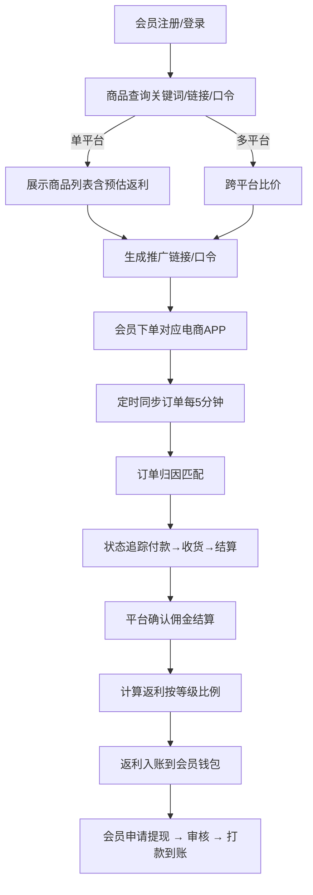
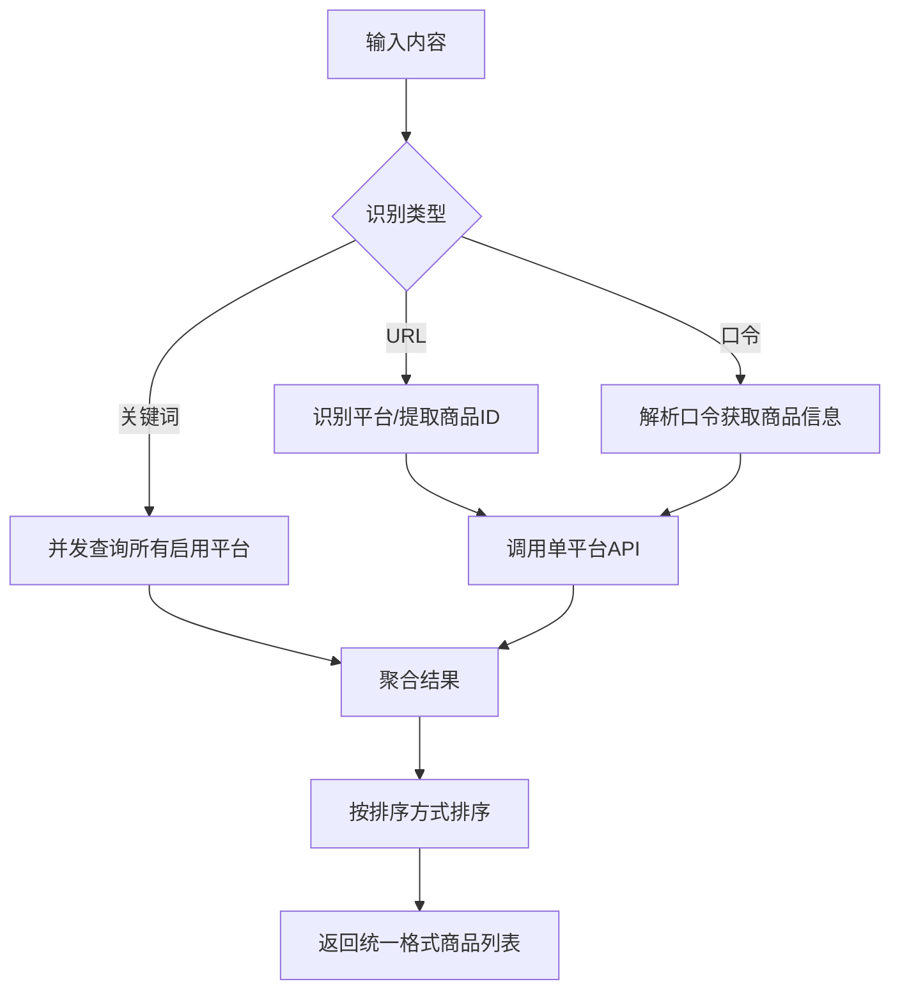
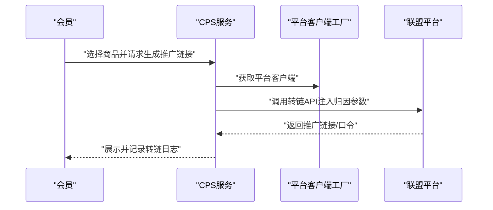
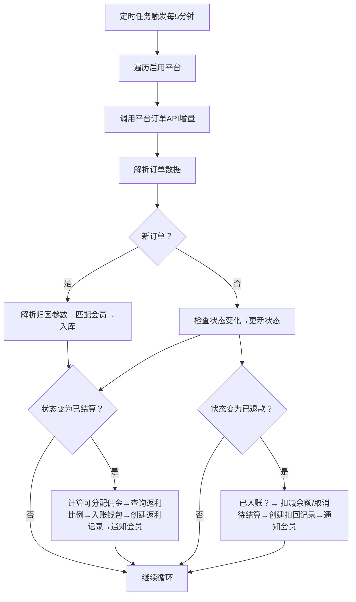
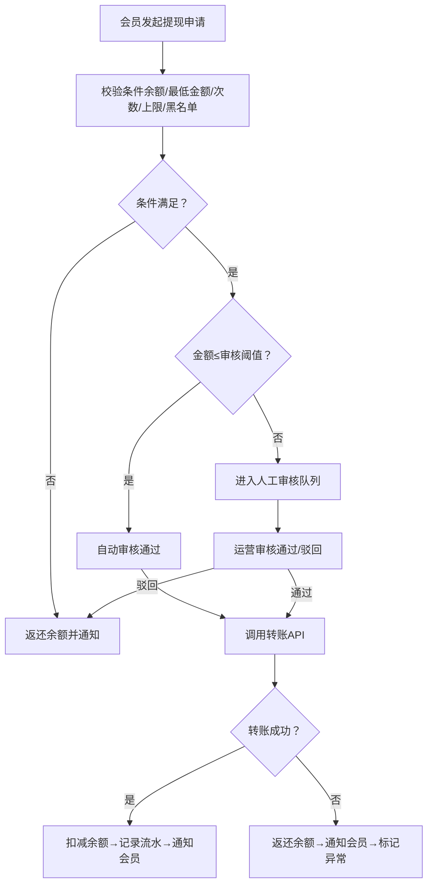
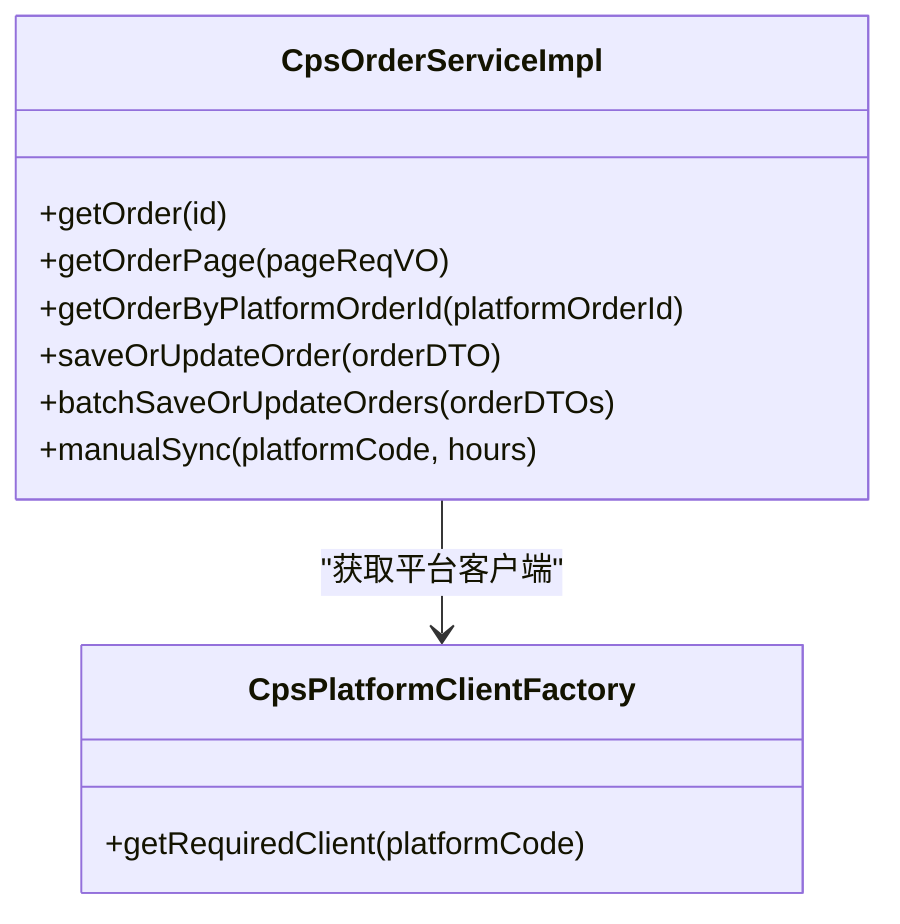
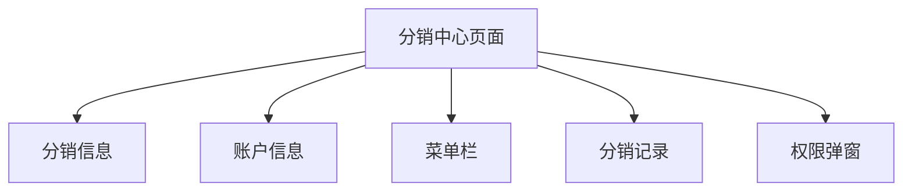
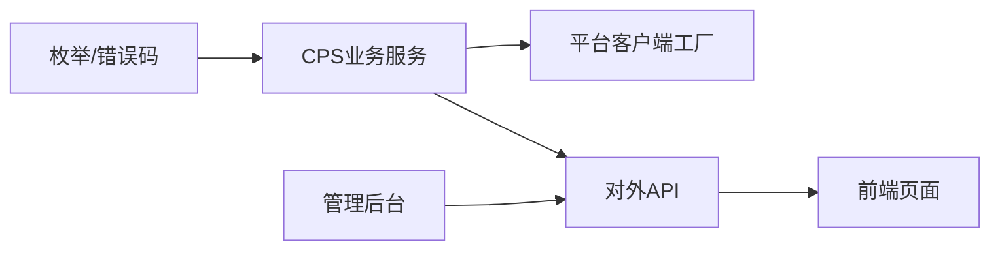

# CPS业务概述

<cite>
**本文引用的文件**
- [yudao-module-cps/pom.xml](file://backend/yudao-module-cps/pom.xml)
- [yudao-module-cps-api/pom.xml](file://backend/yudao-module-cps/yudao-module-cps-api/pom.xml)
- [CpsPlatformCodeEnum.java](file://backend/yudao-module-cps/yudao-module-cps-api/src/main/java/cn/iocoder/yudao/module/cps/enums/CpsPlatformCodeEnum.java)
- [CpsAdzoneTypeEnum.java](file://backend/yudao-module-cps/yudao-module-cps-api/src/main/java/cn/iocoder/yudao/module/cps/enums/CpsAdzoneTypeEnum.java)
- [CpsOrderStatusEnum.java](file://backend/yudao-module-cps/yudao-module-cps-api/src/main/java/cn/iocoder/yudao/module/cps/enums/CpsOrderStatusEnum.java)
- [CpsRebateStatusEnum.java](file://backend/yudao-module-cps/yudao-module-cps-api/src/main/java/cn/iocoder/yudao/module/cps/enums/CpsRebateStatusEnum.java)
- [CpsRebateTypeEnum.java](file://backend/yudao-module-cps/yudao-module-cps-api/src/main/java/cn/iocoder/yudao/module/cps/enums/CpsRebateTypeEnum.java)
- [CpsWithdrawStatusEnum.java](file://backend/yudao-module-cps/yudao-module-cps-api/src/main/java/cn/iocoder/yudao/module/cps/enums/CpsWithdrawStatusEnum.java)
- [CpsRiskRuleTypeEnum.java](file://backend/yudao-module-cps/yudao-module-cps-api/src/main/java/cn/iocoder/yudao/module/cps/enums/CpsRiskRuleTypeEnum.java)
- [CpsErrorCodeConstants.java](file://backend/yudao-module-cps/yudao-module-cps-api/src/main/java/cn/iocoder/yudao/module/cps/enums/CpsErrorCodeConstants.java)
- [CpsFreezeStatusEnum.java](file://backend/yudao-module-cps/yudao-module-cps-api/src/main/java/cn/iocoder/yudao/module/cps/enums/CpsFreezeStatusEnum.java)
- [CPS系统PRD文档.md](file://docs/CPS系统PRD文档.md)
- [index.vue](file://frontend/mall-uniapp/pages/commission/index.vue)
</cite>

## 更新摘要
**所做更改**
- 新增多平台适配器集成和MCP协议支持的业务描述
- 补充完整的CPS管理功能模块说明
- 更新平台配置、推广位管理、订单处理、返利计算、提现结算、风险控制等核心业务流程
- 增强系统架构图以反映新的技术特性

## 目录
1. [引言](#引言)
2. [项目结构](#项目结构)
3. [核心组件](#核心组件)
4. [架构总览](#架构总览)
5. [详细组件分析](#详细组件分析)
6. [依赖关系分析](#依赖关系分析)
7. [性能考量](#性能考量)
8. [故障排查指南](#故障排查指南)
9. [结论](#结论)
10. [附录](#附录)

## 引言
本文件面向CPS（Cost Per Sale）联盟营销业务，系统性阐述其核心概念、业务流程与价值主张，并结合仓库中的PRD与代码实现，给出系统架构、模块划分、技术选型、关键指标、收益分配与风控策略、以及可视化流程图与时序图。CPS模式通过聚合主流电商联盟平台能力，为消费者提供返利查询、跨平台比价与推广链接生成，为推广者提供佣金收益，为平台运营方提供可持续的佣金分成与数据洞察。

**更新** 本版本反映了CPS业务模块现已包含完整的CPS管理功能，涵盖平台配置、推广位管理、订单处理、返利计算、提现结算、风险控制等核心业务流程，支持多平台适配器集成和MCP协议。

## 项目结构
该仓库采用前后端分离与多模块分层的工程组织方式：
- 后端采用多模块划分，其中 yudao-module-cps 为核心业务模块，包含 API 枚举、业务服务与数据访问层；
- 前端包含 H5/小程序/APP 的用户端页面与管理后台；
- 文档目录包含完整的 PRD，覆盖业务流程、功能清单、数据看板与AI Agent集成规划。

```mermaid
graph TB
subgraph "前端"
FE_Mall["小程序/H5<br/>mall-uniapp"]
FE_Admin["管理后台<br/>admin-uniapp"]
end
subgraph "后端"
API["CPS API 模块<br/>yudao-module-cps-api"]
BIZ["CPS 业务模块<br/>yudao-module-cps-biz"]
FRAME["框架与基础设施<br/>yudao-framework/*"]
end
subgraph "外部平台"
TB["淘宝联盟"]
JD["京东联盟"]
PDD["拼多多联盟"]
DY["抖音联盟"]
MCP["MCP协议适配器"]
END
FE_Mall --> API
FE_Admin --> API
API --> BIZ
BIZ --> FRAME
BIZ --> TB
BIZ --> JD
BIZ --> PDD
BIZ --> DY
BIZ --> MCP
```

**章节来源**
- [yudao-module-cps/pom.xml: 17-20:17-20](file://backend/yudao-module-cps/pom.xml#L17-L20)
- [CpsPlatformCodeEnum.java: 18-22:18-22](file://backend/yudao-module-cps/yudao-module-cps-api/src/main/java/cn/iocoder/yudao/module/cps/enums/CpsPlatformCodeEnum.java#L18-L22)

## 核心组件
- 平台与推广位
  - 平台编码枚举涵盖淘宝、京东、拼多多、抖音等主流联盟平台，用于统一接入与配置。
  - 推广位类型枚举区分通用、渠道专属与用户专属，支撑精细化收益分配与风控。
- 订单与返利
  - 订单状态枚举覆盖下单、付款、收货、结算、返利到账、退款、失效等关键节点。
  - 返利状态与类型枚举分别刻画"待结算/已到账/已扣回"与"返利入账/返利扣回/系统调整"的生命周期。
- 提现与风控
  - 提现状态枚举覆盖申请、审核、通过、驳回、成功、失败、退回等环节。
  - 风控规则类型包含频率限制与黑名单两类，支撑自动化风控与人工干预。
- 错误码体系
  - 以段式编号规范定义平台配置、推广位、订单、返利、账户、提现、统计、MCP、转链、冻结、风控等模块的错误码，便于统一异常处理与排障。

**更新** 新增MCP协议支持和更多平台适配器集成能力。

**章节来源**
- [CpsPlatformCodeEnum.java: 1-45:1-45](file://backend/yudao-module-cps/yudao-module-cps-api/src/main/java/cn/iocoder/yudao/module/cps/enums/CpsPlatformCodeEnum.java#L1-L45)
- [CpsAdzoneTypeEnum.java: 1-40:1-40](file://backend/yudao-module-cps/yudao-module-cps-api/src/main/java/cn/iocoder/yudao/module/cps/enums/CpsAdzoneTypeEnum.java#L1-L40)
- [CpsOrderStatusEnum.java: 1-48:1-48](file://backend/yudao-module-cps/yudao-module-cps-api/src/main/java/cn/iocoder/yudao/module/cps/enums/CpsOrderStatusEnum.java#L1-L48)
- [CpsRebateStatusEnum.java: 1-40:1-40](file://backend/yudao-module-cps/yudao-module-cps-api/src/main/java/cn/iocoder/yudao/module/cps/enums/CpsRebateStatusEnum.java#L1-L40)
- [CpsRebateTypeEnum.java: 1-40:1-40](file://backend/yudao-module-cps/yudao-module-cps-api/src/main/java/cn/iocoder/yudao/module/cps/enums/CpsRebateTypeEnum.java#L1-L40)
- [CpsWithdrawStatusEnum.java: 1-44:1-44](file://backend/yudao-module-cps/yudao-module-cps-api/src/main/java/cn/iocoder/yudao/module/cps/enums/CpsWithdrawStatusEnum.java#L1-L44)
- [CpsRiskRuleTypeEnum.java: 1-39:1-39](file://backend/yudao-module-cps/yudao-module-cps-api/src/main/java/cn/iocoder/yudao/module/cps/enums/CpsRiskRuleTypeEnum.java#L1-L39)
- [CpsErrorCodeConstants.java: 1-65:1-65](file://backend/yudao-module-cps/yudao-module-cps-api/src/main/java/cn/iocoder/yudao/module/cps/enums/CpsErrorCodeConstants.java#L1-L65)
- [CpsFreezeStatusEnum.java: 1-41:1-41](file://backend/yudao-module-cps/yudao-module-cps-api/src/main/java/cn/iocoder/yudao/module/cps/enums/CpsFreezeStatusEnum.java#L1-L41)

## 架构总览
系统围绕"会员—平台—运营"三方协作展开，采用多平台API接入与统一订单同步机制，配合返利结算与提现流程，形成闭环。新增MCP协议适配器支持AI智能推荐和Agent集成。

```mermaid
graph TB
subgraph "用户侧"
U["会员用户<br/>H5/小程序/APP"]
end
subgraph "运营侧"
OP["运营管理员<br/>管理后台"]
SUPER["超级管理员<br/>系统配置/风控"]
end
subgraph "业务核心"
SVC["CPS 业务服务<br/>订单/返利/提现/风控"]
ENUM["枚举与错误码<br/>状态/类型/规则"]
MCP["MCP协议适配器<br/>AI智能推荐"]
END
subgraph "平台对接"
PTB["淘宝联盟"]
PJD["京东联盟"]
PPDD["拼多多联盟"]
PDY["抖音联盟"]
END
U --> |"搜索/比价/生成推广链接"| SVC
OP --> |"配置/审核/统计"| SVC
SUPER --> |"系统配置/风控"| SVC
SVC --> ENUM
SVC --> MCP
SVC --> PTB
SVC --> PJD
SVC --> PPDD
SVC --> PDY
```

**更新** 新增MCP协议适配器和更多电商平台支持。

**图表来源**
- [yudao-module-cps/pom.xml: 17-20:17-20](file://backend/yudao-module-cps/pom.xml#L17-L20)
- [CpsPlatformCodeEnum.java: 18-22:18-22](file://backend/yudao-module-cps/yudao-module-cps-api/src/main/java/cn/iocoder/yudao/module/cps/enums/CpsPlatformCodeEnum.java#L18-L22)

**章节来源**
- [yudao-module-cps/pom.xml: 17-20:17-20](file://backend/yudao-module-cps/pom.xml#L17-L20)
- [CpsPlatformCodeEnum.java: 18-22:18-22](file://backend/yudao-module-cps/yudao-module-cps-api/src/main/java/cn/iocoder/yudao/module/cps/enums/CpsPlatformCodeEnum.java#L18-L22)

## 详细组件分析

### 业务流程总览（核心流程）


**图表来源**
- [CPS系统PRD文档.md: 82-119:82-119](file://docs/CPS系统PRD文档.md#L82-L119)

**章节来源**
- [CPS系统PRD文档.md: 80-119:80-119](file://docs/CPS系统PRD文档.md#L80-L119)

### 商品查询与比价流程
- 输入识别：URL/口令/关键词，自动识别平台并提取商品ID，或并发查询所有启用平台。
- 结果聚合：统一格式返回商品列表，按指定排序（价格/返利/销量）。
- 预估返利：根据会员等级计算预估返利金额，展示在搜索与详情页。



**图表来源**
- [CPS系统PRD文档.md: 121-150:121-150](file://docs/CPS系统PRD文档.md#L121-L150)

**章节来源**
- [CPS系统PRD文档.md: 121-150:121-150](file://docs/CPS系统PRD文档.md#L121-L150)

### 推广链接生成流程
- 选择商品后，确定平台与商品ID，获取会员推广位（PID），注入归因参数（不同平台参数不同），调用平台转链API，返回推广链接与口令，记录转链日志。



**图表来源**
- [CPS系统PRD文档.md: 152-181:152-181](file://docs/CPS系统PRD文档.md#L152-L181)

**章节来源**
- [CPS系统PRD文档.md: 152-181:152-181](file://docs/CPS系统PRD文档.md#L152-L181)

### 订单同步与结算流程
- 定时任务每5分钟触发，遍历启用平台，增量查询订单；解析新订单进行归因匹配入库，更新已有订单状态；当订单变为"已结算"，触发返利结算流程（计算可分配佣金、查询返利比例、入账钱包、创建返利记录并通知会员）；若变为"已退款"，触发返利扣回流程（已入账则扣减余额，未入账则取消待结算记录）。



**图表来源**
- [CPS系统PRD文档.md: 183-223:183-223](file://docs/CPS系统PRD文档.md#L183-L223)

**章节来源**
- [CPS系统PRD文档.md: 183-223:183-223](file://docs/CPS系统PRD文档.md#L183-L223)
- [CpsOrderStatusEnum.java: 18-25:18-25](file://backend/yudao-module-cps/yudao-module-cps-api/src/main/java/cn/iocoder/yudao/module/cps/enums/CpsOrderStatusEnum.java#L18-L25)
- [CpsRebateStatusEnum.java: 18-21:18-21](file://backend/yudao-module-cps/yudao-module-cps-api/src/main/java/cn/iocoder/yudao/module/cps/enums/CpsRebateStatusEnum.java#L18-L21)

### 提现流程
- 会员提交提现申请，校验余额、最低金额、每日次数、单次上限与黑名单；根据金额阈值决定自动审核或人工审核；调用转账API打款，成功则扣减余额并记录流水，失败则返还余额并标记异常，通知会员。



**图表来源**
- [CPS系统PRD文档.md: 225-261:225-261](file://docs/CPS系统PRD文档.md#L225-L261)

**章节来源**
- [CPS系统PRD文档.md: 225-261:225-261](file://docs/CPS系统PRD文档.md#L225-L261)
- [CpsWithdrawStatusEnum.java: 18-25:18-25](file://backend/yudao-module-cps/yudao-module-cps-api/src/main/java/cn/iocoder/yudao/module/cps/enums/CpsWithdrawStatusEnum.java#L18-L25)

### 订单服务实现要点（代码级）
- 订单查询与分页、按平台订单号唯一性约束、幂等保存/更新、状态映射与字段变更检测、退款标签触发状态变更、批量处理与异常容错、手动同步与日志记录。
- 通过平台客户端工厂统一调度各平台API，确保扩展性与一致性。



**图表来源**
- [CpsOrderServiceImpl.java: 35-197:35-197](file://backend/yudao-module-cps/yudao-module-cps-biz/src/main/java/cn/iocoder/yudao/module/cps/service/order/CpsOrderServiceImpl.java#L35-L197)

**章节来源**
- [CpsOrderServiceImpl.java: 35-197:35-197](file://backend/yudao-module-cps/yudao-module-cps-biz/src/main/java/cn/iocoder/yudao/module/cps/service/order/CpsOrderServiceImpl.java#L35-L197)

### 用户端界面概览（分销中心）
- 页面包含分销信息、账户信息、菜单栏与分销记录模块，支持分享邀请与权限弹窗，体现CPS推广与收益展示的前端承载。



**图表来源**
- [index.vue: 1-58:1-58](file://frontend/mall-uniapp/pages/commission/index.vue#L1-L58)

**章节来源**
- [index.vue: 1-58:1-58](file://frontend/mall-uniapp/pages/commission/index.vue#L1-L58)

## 依赖关系分析
- 枚举与错误码作为领域契约，贯穿业务服务与控制层，保证状态流转与异常处理的一致性。
- 业务服务依赖平台客户端工厂，实现多平台接入的统一抽象。
- 前端页面与后端API通过标准接口交互，管理后台负责配置、审核与统计。



**图表来源**
- [CpsErrorCodeConstants.java: 10-64:10-64](file://backend/yudao-module-cps/yudao-module-cps-api/src/main/java/cn/iocoder/yudao/module/cps/enums/CpsErrorCodeConstants.java#L10-L64)
- [CpsOrderServiceImpl.java: 42-49:42-49](file://backend/yudao-module-cps/yudao-module-cps-biz/src/main/java/cn/iocoder/yudao/module/cps/service/order/CpsOrderServiceImpl.java#L42-L49)

**章节来源**
- [CpsErrorCodeConstants.java: 10-64:10-64](file://backend/yudao-module-cps/yudao-module-cps-api/src/main/java/cn/iocoder/yudao/module/cps/enums/CpsErrorCodeConstants.java#L10-L64)
- [CpsOrderServiceImpl.java: 42-49:42-49](file://backend/yudao-module-cps/yudao-module-cps-biz/src/main/java/cn/iocoder/yudao/module/cps/service/order/CpsOrderServiceImpl.java#L42-L49)

## 性能考量
- 订单同步策略：每5分钟增量拉取，避免频繁全量扫描；批量处理与异常容错减少抖动。
- 并发查询：多平台比价采用并发查询，提升用户体验；需注意平台限流与重试策略。
- 缓存与索引：建议对热门关键词、商品ID与PID建立缓存与数据库索引，降低查询延迟。
- 日志与监控：记录同步耗时、新增/更新/跳过数量，便于容量与性能评估。

## 故障排查指南
- 平台配置异常
  - 现象：平台配置不存在、编码重复、平台禁用。
  - 排查：核对平台编码与状态，确认AppKey/Secret与API地址正确。
- 推广位异常
  - 现象：推广位不存在、默认推广位重复。
  - 排查：检查推广位类型与归属，确保唯一性与有效性。
- 订单异常
  - 现象：订单不存在、状态不合法、重复订单。
  - 排查：核对平台订单号唯一性、状态映射与字段变更；必要时使用手动同步补偿。
- 返利与账户异常
  - 现象：返利账户不存在、余额不足、账户冻结。
  - 排查：检查账户状态与冻结记录，确认返利计算与入账流程。
- 提现异常
  - 现象：提现不存在、状态不合法、金额低于最低限额、当日次数超限。
  - 排查：核对提现规则与风控阈值，检查转账API返回与回调。
- 风控异常
  - 现象：转链请求被风控拦截。
  - 排查：检查频率限制与黑名单配置，必要时临时放行与人工审核。

**章节来源**
- [CpsErrorCodeConstants.java: 12-64:12-64](file://backend/yudao-module-cps/yudao-module-cps-api/src/main/java/cn/iocoder/yudao/module/cps/enums/CpsErrorCodeConstants.java#L12-L64)
- [CpsRiskRuleTypeEnum.java: 18-20:18-20](file://backend/yudao-module-cps/yudao-module-cps-api/src/main/java/cn/iocoder/yudao/module/cps/enums/CpsRiskRuleTypeEnum.java#L18-L20)

## 结论
本CPS系统通过标准化的多平台接入、清晰的订单与返利状态机、完善的提现与风控机制，构建了从"搜索/比价/推广—订单同步—返利结算—提现到账"的完整闭环。配合管理后台的配置、审核与数据看板，既能满足运营效率，也能保障用户体验与平台收益的可持续增长。

**更新** 新版本增强了多平台适配器集成能力和MCP协议支持，为未来的AI智能推荐和Agent集成奠定了基础。

## 附录
- 关键指标建议
  - 用户获取：注册会员数、日活/月活用户数
  - 用户转化：查询到下单的转化率
  - 用户留存：次日留存率、7日留存率、30日留存率
  - 营收增长：月度佣金收入、平台净利润
  - 用户满意度：提现成功率、返利到账时效
- 商业模式解读
  - 平台通过佣金分成与广告位收益获益，CPS系统作为流量入口与转化通道，持续优化ROI与用户体验是关键。
- 技术演进方向
  - 支持更多电商平台接入，包括抖音等新兴平台
  - 集成MCP协议实现AI智能推荐和Agent自动化
  - 优化多平台适配器架构，提升系统扩展性和维护性