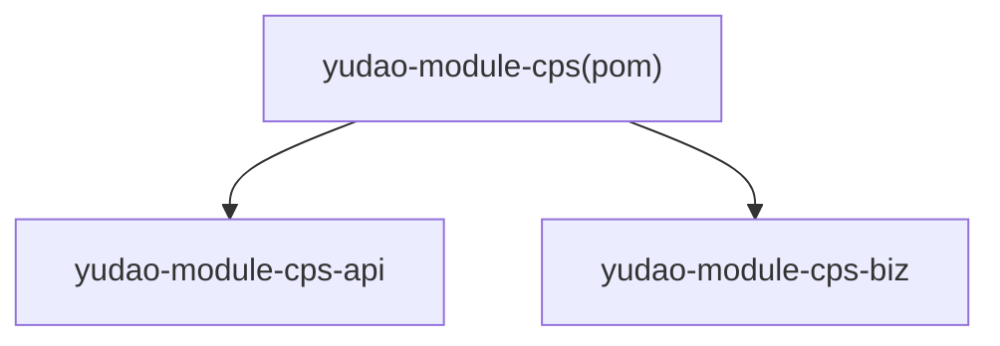
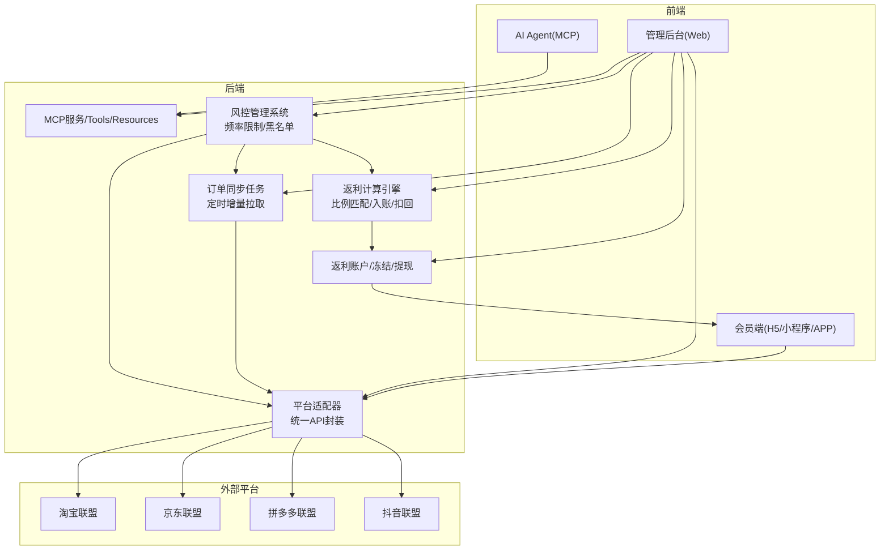
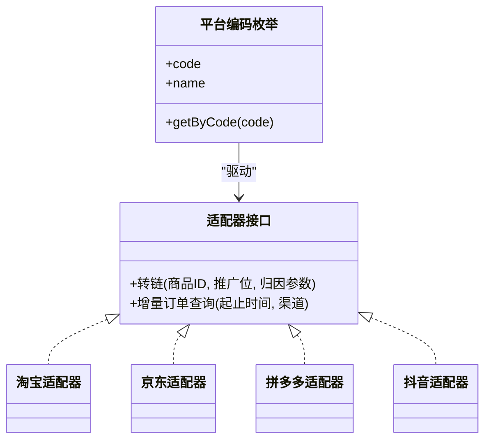
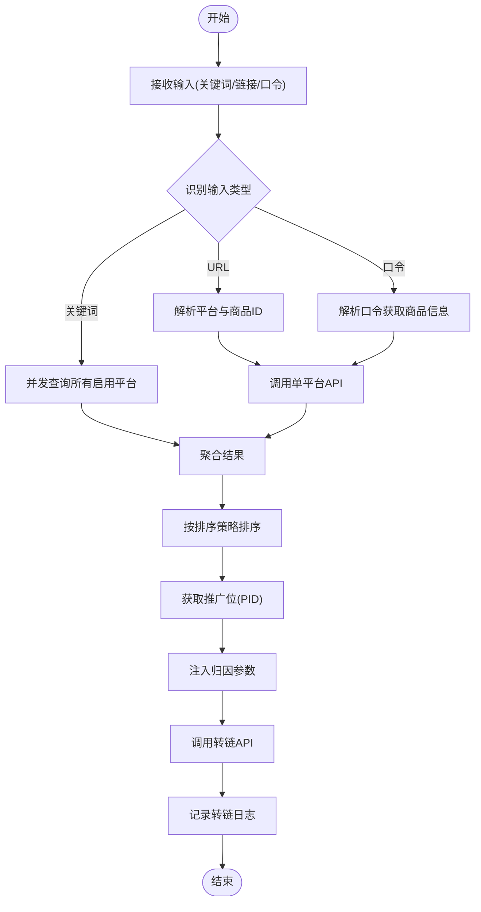
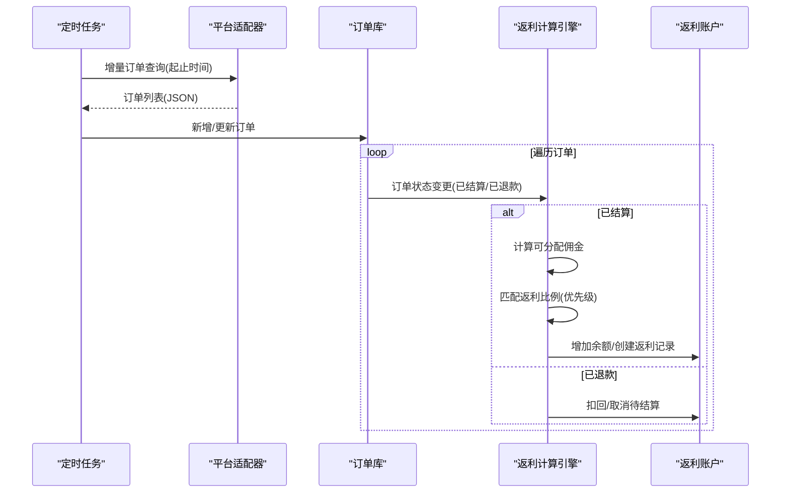
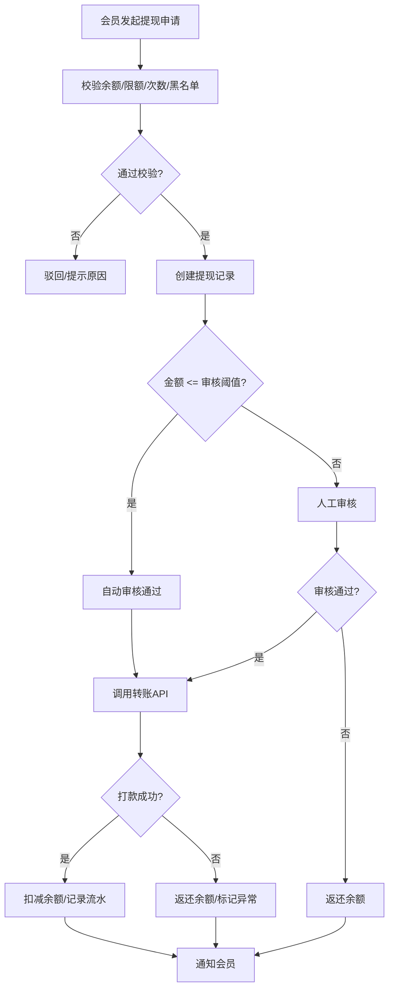
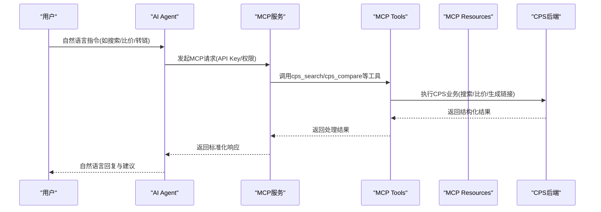
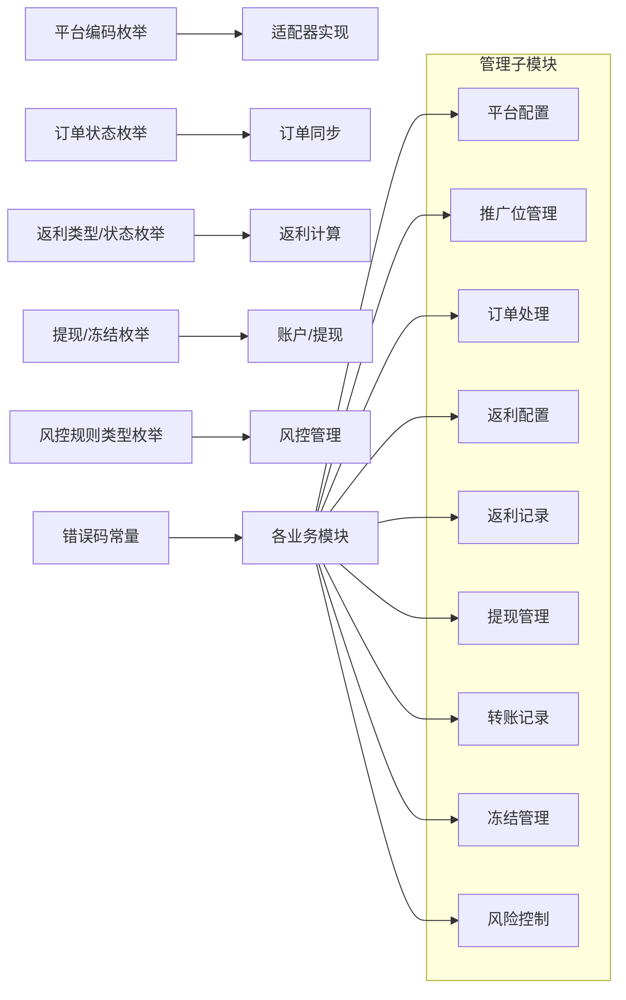

# CPS业务模块

<cite>
**本文引用的文件**
- [CPS系统PRD文档.md](file://docs/CPS系统PRD文档.md)
- [CpsAdzoneTypeEnum.java](file://backend/yudao-module-cps/yudao-module-cps-api/src/main/java/cn/iocoder/yudao/module/cps/enums/CpsAdzoneTypeEnum.java)
- [CpsOrderStatusEnum.java](file://backend/yudao-module-cps/yudao-module-cps-api/src/main/java/cn/iocoder/yudao/module/cps/enums/CpsOrderStatusEnum.java)
- [CpsRebateStatusEnum.java](file://backend/yudao-module-cps/yudao-module-cps-api/src/main/java/cn/iocoder/yudao/module/cps/enums/CpsRebateStatusEnum.java)
- [CpsPlatformCodeEnum.java](file://backend/yudao-module-cps/yudao-module-cps-api/src/main/java/cn/iocoder/yudao/module/cps/enums/CpsPlatformCodeEnum.java)
- [CpsRebateTypeEnum.java](file://backend/yudao-module-cps/yudao-module-cps-api/src/main/java/cn/iocoder/yudao/module/cps/enums/CpsRebateTypeEnum.java)
- [CpsWithdrawStatusEnum.java](file://backend/yudao-module-cps/yudao-module-cps-api/src/main/java/cn/iocoder/yudao/module/cps/enums/CpsWithdrawStatusEnum.java)
- [CpsFreezeStatusEnum.java](file://backend/yudao-module-cps/yudao-module-cps-api/src/main/java/cn/iocoder/yudao/module/cps/enums/CpsFreezeStatusEnum.java)
- [CpsRiskRuleTypeEnum.java](file://backend/yudao-module-cps/yudao-module-cps-api/src/main/java/cn/iocoder/yudao/module/cps/enums/CpsRiskRuleTypeEnum.java)
- [CpsErrorCodeConstants.java](file://backend/yudao-module-cps/yudao-module-cps-api/src/main/java/cn/iocoder/yudao/module/cps/enums/CpsErrorCodeConstants.java)
- [yudao-module-cps/pom.xml](file://backend/yudao-module-cps/pom.xml)
</cite>

## 更新摘要
**所做更改**
- 新增CPS管理功能九个子模块的详细说明
- 更新平台配置、推广位管理、订单处理、返利配置、返利记录、提现管理、转账记录、冻结管理、风险控制等模块
- 增加超过40个新菜单项和权限配置的说明
- 扩展管理后台功能清单和权限矩阵
- 更新业务流程和功能详细设计

## 目录
1. [引言](#引言)
2. [项目结构](#项目结构)
3. [核心组件](#核心组件)
4. [架构总览](#架构总览)
5. [详细组件分析](#详细组件分析)
6. [CPS管理功能九个子模块](#cps管理功能九个子模块)
7. [管理后台功能详解](#管理后台功能详解)
8. [依赖分析](#依赖分析)
9. [性能考虑](#性能考虑)
10. [故障排查指南](#故障排查指南)
11. [结论](#结论)
12. [附录](#附录)

## 引言
本文件面向CPS业务模块，系统化阐述联盟营销、商品采集、订单管理、返利计算、推广位管理、平台适配器与MCP协议集成等核心能力。经过全面扩展后，CPS系统现已包含完整的CPS管理功能，涵盖平台配置、推广位管理、订单处理、返利配置、返利记录、提现管理、转账记录、冻结管理、风险控制等九个子模块，以及超过40个新的菜单项和权限配置。文档基于PRD梳理业务流程与规则，结合枚举与错误码定义，给出可落地的实现与运维建议，并提供扩展新平台的开发指南与风险控制、合规管理最佳实践。

## 项目结构
CPS模块采用"API + 业务"双子模块划分，API层提供领域枚举、错误码与公共契约；业务层承载具体业务逻辑与适配器实现。模块整体通过Maven聚合管理，便于扩展与维护。

**图表来源**
- [yudao-module-cps/pom.xml:21-24](file://backend/yudao-module-cps/pom.xml#L21-L24)

**章节来源**
- [yudao-module-cps/pom.xml:17-24](file://backend/yudao-module-cps/pom.xml#L17-L24)

## 核心组件
- 平台适配器与API封装
  - 通过平台编码枚举统一接入多平台（淘宝、京东、拼多多、抖音），支持默认推广位、平台服务费率、API基础地址等配置。
- 推广位管理
  - 支持通用、渠道专属、用户专属三种推广位类型，确保不同层级的归因与收益分配。
- 订单生命周期与状态机
  - 订单状态覆盖已下单、已付款、已收货、已结算、已到账、已退款、已失效，支撑从下单到返利入账的完整闭环。
- 返利计算与账户
  - 返利类型包括返利入账、返利扣回、系统调整；返利账户支持余额、冻结与解冻；提现状态涵盖申请、审核、通过、驳回、成功、失败、退回。
- MCP协议与AI集成
  - 通过MCP服务管理、API Key、Tools与Resources配置，实现AI Agent对CPS能力的自然语言调用与增强。
- 风险控制体系
  - 包含频率限制和黑名单两种风控规则类型，支持转链请求拦截和异常行为检测。

**章节来源**
- [CpsPlatformCodeEnum.java:16-22](file://backend/yudao-module-cps/yudao-module-cps-api/src/main/java/cn/iocoder/yudao/module/cps/enums/CpsPlatformCodeEnum.java#L16-L22)
- [CpsAdzoneTypeEnum.java:16-21](file://backend/yudao-module-cps/yudao-module-cps-api/src/main/java/cn/iocoder/yudao/module/cps/enums/CpsAdzoneTypeEnum.java#L16-L21)
- [CpsOrderStatusEnum.java:16-25](file://backend/yudao-module-cps/yudao-module-cps-api/src/main/java/cn/iocoder/yudao/module/cps/enums/CpsOrderStatusEnum.java#L16-L25)
- [CpsRebateTypeEnum.java:16-21](file://backend/yudao-module-cps/yudao-module-cps-api/src/main/java/cn/iocoder/yudao/module/cps/enums/CpsRebateTypeEnum.java#L16-L21)
- [CpsRebateStatusEnum.java:16-21](file://backend/yudao-module-cps/yudao-module-cps-api/src/main/java/cn/iocoder/yudao/module/cps/enums/CpsRebateStatusEnum.java#L16-L21)
- [CpsWithdrawStatusEnum.java:16-25](file://backend/yudao-module-cps/yudao-module-cps-api/src/main/java/cn/iocoder/yudao/module/cps/enums/CpsWithdrawStatusEnum.java#L16-L25)
- [CpsFreezeStatusEnum.java:16-22](file://backend/yudao-module-cps/yudao-module-cps-api/src/main/java/cn/iocoder/yudao/module/cps/enums/CpsFreezeStatusEnum.java#L16-L22)
- [CpsRiskRuleTypeEnum.java:16-20](file://backend/yudao-module-cps/yudao-module-cps-api/src/main/java/cn/iocoder/yudao/module/cps/enums/CpsRiskRuleTypeEnum.java#L16-L20)

## 架构总览
CPS系统围绕"平台适配器 + 订单同步 + 返利计算 + 提现结算 + MCP集成 + 风控管理"的主干展开，形成从商品采集、推广链接生成、订单归因、返利入账到提现的全链路闭环，新增的风险控制模块确保系统安全稳定运行。

**图表来源**
- [CpsPlatformCodeEnum.java:16-22](file://backend/yudao-module-cps/yudao-module-cps-api/src/main/java/cn/iocoder/yudao/module/cps/enums/CpsPlatformCodeEnum.java#L16-L22)
- [CpsOrderStatusEnum.java:16-25](file://backend/yudao-module-cps/yudao-module-cps-api/src/main/java/cn/iocoder/yudao/module/cps/enums/CpsOrderStatusEnum.java#L16-L25)
- [CpsRebateStatusEnum.java:16-21](file://backend/yudao-module-cps/yudao-module-cps-api/src/main/java/cn/iocoder/yudao/module/cps/enums/CpsRebateStatusEnum.java#L16-L21)
- [CpsWithdrawStatusEnum.java:16-25](file://backend/yudao-module-cps/yudao-module-cps-api/src/main/java/cn/iocoder/yudao/module/cps/enums/CpsWithdrawStatusEnum.java#L16-L25)
- [CpsRiskRuleTypeEnum.java:16-20](file://backend/yudao-module-cps/yudao-module-cps-api/src/main/java/cn/iocoder/yudao/module/cps/enums/CpsRiskRuleTypeEnum.java#L16-L20)

## 详细组件分析

### 1) 平台适配器与API封装策略
- 设计要点
  - 以平台编码枚举驱动，统一配置AppKey/Secret、API基础地址、默认推广位、平台服务费率等。
  - 通过适配器抽象不同平台的"转链/订单查询"差异，屏蔽平台差异，保证上层调用一致性。
- 数据映射规则
  - 归因参数注入：淘宝adzone_id+external_info、京东subUnionId、拼多多custom_parameters(uid)。
  - 订单字段映射：平台订单号、买家ID、实付金额、佣金、结算状态、结算时间等映射至统一订单模型。
- 扩展新平台指南
  - 在平台枚举中新增平台编码，补充默认推广位与服务费率。
  - 实现适配器的转链与订单查询方法，遵循统一返回格式。
  - 配置平台连通性测试与限额策略，纳入管理后台配置项。

**图表来源**
- [CpsPlatformCodeEnum.java:16-22](file://backend/yudao-module-cps/yudao-module-cps-api/src/main/java/cn/iocoder/yudao/module/cps/enums/CpsPlatformCodeEnum.java#L16-L22)

**章节来源**
- [CpsPlatformCodeEnum.java:16-22](file://backend/yudao-module-cps/yudao-module-cps-api/src/main/java/cn/iocoder/yudao/module/cps/enums/CpsPlatformCodeEnum.java#L16-L22)

### 2) 商品采集与推广位管理
- 商品采集
  - 支持URL识别、口令解析、关键词搜索三种入口，多平台并发查询，聚合结果并按排序策略展示。
- 推广位类型
  - 通用、渠道专属、用户专属三类推广位，满足不同层级的归因与收益分配。
- 推广链接生成
  - 根据会员推广位与平台差异注入归因参数，调用平台转链API生成推广链接/口令/短链，记录转链日志。

**图表来源**
- [CpsAdzoneTypeEnum.java:16-21](file://backend/yudao-module-cps/yudao-module-cps-api/src/main/java/cn/iocoder/yudao/module/cps/enums/CpsAdzoneTypeEnum.java#L16-L21)
- [CpsPlatformCodeEnum.java:16-22](file://backend/yudao-module-cps/yudao-module-cps-api/src/main/java/cn/iocoder/yudao/module/cps/enums/CpsPlatformCodeEnum.java#L16-L22)

**章节来源**
- [CpsAdzoneTypeEnum.java:16-21](file://backend/yudao-module-cps/yudao-module-cps-api/src/main/java/cn/iocoder/yudao/module/cps/enums/CpsAdzoneTypeEnum.java#L16-L21)
- [CpsPlatformCodeEnum.java:16-22](file://backend/yudao-module-cps/yudao-module-cps-api/src/main/java/cn/iocoder/yudao/module/cps/enums/CpsPlatformCodeEnum.java#L16-L22)

### 3) 订单同步与结算流程
- 同步机制
  - 定时任务每5分钟触发，遍历启用平台，增量查询订单，解析归因参数匹配会员，入库或更新状态。
- 结算规则
  - 佣金 = 实付金额 × 佣金比例；平台服务费 = 佣金 × 平台费率；可分配佣金 = 佣金 − 平台服务费。
  - 返利比例优先级：个人专属(平台) > 个人专属(全平台) > 等级+平台 > 等级 > 平台默认 > 全局默认。
  - 已结算触发返利入账；已退款触发返利扣回（已入账则扣减余额，未入账则取消待结算）。

**图表来源**
- [CpsOrderStatusEnum.java:16-25](file://backend/yudao-module-cps/yudao-module-cps-api/src/main/java/cn/iocoder/yudao/module/cps/enums/CpsOrderStatusEnum.java#L16-L25)
- [CpsRebateStatusEnum.java:16-21](file://backend/yudao-module-cps/yudao-module-cps-api/src/main/java/cn/iocoder/yudao/module/cps/enums/CpsRebateStatusEnum.java#L16-L21)

**章节来源**
- [CpsOrderStatusEnum.java:16-25](file://backend/yudao-module-cps/yudao-module-cps-api/src/main/java/cn/iocoder/yudao/module/cps/enums/CpsOrderStatusEnum.java#L16-L25)
- [CpsRebateStatusEnum.java:16-21](file://backend/yudao-module-cps/yudao-module-cps-api/src/main/java/cn/iocoder/yudao/module/cps/enums/CpsRebateStatusEnum.java#L16-L21)

### 4) 返利计算与账户管理
- 返利类型
  - 返利入账、返利扣回、系统调整，用于记录不同来源的变动。
- 账户与冻结
  - 返利账户支持余额、冻结/解冻流程，提现前需确保账户非冻结且余额充足。
- 提现流程
  - 余额校验、金额与次数限制、单次上限、黑名单校验；小额自动审核，大额人工审核；打款成功/失败后进行余额与流水处理。

**图表来源**
- [CpsWithdrawStatusEnum.java:16-25](file://backend/yudao-module-cps/yudao-module-cps-api/src/main/java/cn/iocoder/yudao/module/cps/enums/CpsWithdrawStatusEnum.java#L16-L25)
- [CpsFreezeStatusEnum.java:16-22](file://backend/yudao-module-cps/yudao-module-cps-api/src/main/java/cn/iocoder/yudao/module/cps/enums/CpsFreezeStatusEnum.java#L16-L22)

**章节来源**
- [CpsRebateTypeEnum.java:16-21](file://backend/yudao-module-cps/yudao-module-cps-api/src/main/java/cn/iocoder/yudao/module/cps/enums/CpsRebateTypeEnum.java#L16-L21)
- [CpsFreezeStatusEnum.java:16-22](file://backend/yudao-module-cps/yudao-module-cps-api/src/main/java/cn/iocoder/yudao/module/cps/enums/CpsFreezeStatusEnum.java#L16-L22)
- [CpsWithdrawStatusEnum.java:16-25](file://backend/yudao-module-cps/yudao-module-cps-api/src/main/java/cn/iocoder/yudao/module/cps/enums/CpsWithdrawStatusEnum.java#L16-L25)

### 5) MCP协议与AI集成
- MCP服务管理
  - 管理MCP Server运行状态、API Key、Tools与Resources，配置权限级别与限流规则，查看访问日志与统计。
- AI Agent能力
  - 自然语言商品搜索、跨平台比价、推广建议、订单追踪、返利咨询与个性化推荐等，通过MCP Tools与Resources调用CPS能力。
- 配置与治理
  - 通过管理后台配置MCP工具的默认参数、权限与使用统计，保障AI Agent稳定、安全地调用CPS能力。

**图表来源**
- [CpsErrorCodeConstants.java:47-50](file://backend/yudao-module-cps/yudao-module-cps-api/src/main/java/cn/iocoder/yudao/module/cps/enums/CpsErrorCodeConstants.java#L47-L50)

**章节来源**
- [CpsErrorCodeConstants.java:47-50](file://backend/yudao-module-cps/yudao-module-cps-api/src/main/java/cn/iocoder/yudao/module/cps/enums/CpsErrorCodeConstants.java#L47-L50)

## CPS管理功能九个子模块

### 1) 平台配置模块
- 功能概述
  - 管理CPS平台的基本配置信息，包括平台名称、编码、API密钥、默认推广位、服务费率等。
- 核心功能
  - 平台添加/编辑/删除/启用/禁用
  - API密钥安全管理和轮换
  - 默认推广位配置和管理
  - 平台服务费率设置
  - 平台连通性测试
- 权限矩阵
  - 超级管理员：完全权限
  - 运营管理员：查看、创建、更新、删除
  - 会员用户：只读权限

**章节来源**
- [CpsPlatformCodeEnum.java:16-22](file://backend/yudao-module-cps/yudao-module-cps-api/src/main/java/cn/iocoder/yudao/module/cps/enums/CpsPlatformCodeEnum.java#L16-L22)

### 2) 推广位管理模块
- 功能概述
  - 管理各平台的推广位(PID)，支持通用、渠道专属、用户专属三种类型。
- 核心功能
  - 推广位创建和分配
  - 推广位类型管理
  - 推广位批量导入导出
  - 推广位使用统计
- 权限矩阵
  - 超级管理员：完全权限
  - 运营管理员：查看、创建、更新
  - 会员用户：只读权限

**章节来源**
- [CpsAdzoneTypeEnum.java:16-21](file://backend/yudao-module-cps/yudao-module-cps-api/src/main/java/cn/iocoder/yudao/module/cps/enums/CpsAdzoneTypeEnum.java#L16-L21)

### 3) 订单处理模块
- 功能概述
  - 管理CPS订单的全生命周期，包括订单查询、状态跟踪、异常处理等。
- 核心功能
  - 订单列表查询和筛选
  - 订单详情查看和编辑
  - 手动订单同步
  - 异常订单处理
  - 订单状态批量更新
- 权限矩阵
  - 超级管理员：完全权限
  - 运营管理员：查看、更新、处理
  - 会员用户：只读权限

**章节来源**
- [CpsOrderStatusEnum.java:16-25](file://backend/yudao-module-cps/yudao-module-cps-api/src/main/java/cn/iocoder/yudao/module/cps/enums/CpsOrderStatusEnum.java#L16-L25)

### 4) 返利配置模块
- 功能概述
  - 配置会员返利规则，支持按等级、平台、个人设置不同的返利比例。
- 核心功能
  - 会员等级返利配置
  - 个人专属返利设置
  - 返利比例优先级管理
  - 返利上限设置
- 权限矩阵
  - 超级管理员：完全权限
  - 运营管理员：查看、创建、更新
  - 会员用户：只读权限

**章节来源**
- [CpsRebateTypeEnum.java:16-21](file://backend/yudao-module-cps/yudao-module-cps-api/src/main/java/cn/iocoder/yudao/module/cps/enums/CpsRebateTypeEnum.java#L16-L21)

### 5) 返利记录模块
- 功能概述
  - 记录和管理所有返利交易，包括入账、扣回、调整等操作。
- 核心功能
  - 返利记录查询和筛选
  - 返利明细查看
  - 手动返利调整
  - 返利统计分析
- 权限矩阵
  - 超级管理员：完全权限
  - 运营管理员：查看、调整
  - 会员用户：只读权限

**章节来源**
- [CpsRebateStatusEnum.java:16-21](file://backend/yudao-module-cps/yudao-module-cps-api/src/main/java/cn/iocoder/yudao/module/cps/enums/CpsRebateStatusEnum.java#L16-L21)

### 6) 提现管理模块
- 功能概述
  - 管理会员提现申请，包括申请、审核、处理等全流程。
- 核心功能
  - 提现申请审核
  - 提现规则配置
  - 提现记录管理
  - 提现统计分析
- 权限矩阵
  - 超级管理员：完全权限
  - 运营管理员：查看、审核、处理
  - 会员用户：只读权限

**章节来源**
- [CpsWithdrawStatusEnum.java:16-25](file://backend/yudao-module-cps/yudao-module-cps-api/src/main/java/cn/iocoder/yudao/module/cps/enums/CpsWithdrawStatusEnum.java#L16-L25)

### 7) 转账记录模块
- 功能概述
  - 记录所有资金转账操作，包括提现打款、退款等。
- 核心功能
  - 转账记录查询
  - 转账状态跟踪
  - 转账异常处理
  - 转账统计报表
- 权限矩阵
  - 超级管理员：完全权限
  - 运营管理员：查看、处理
  - 会员用户：只读权限

**章节来源**
- [CpsErrorCodeConstants.java:52-53](file://backend/yudao-module-cps/yudao-module-cps-api/src/main/java/cn/iocoder/yudao/module/cps/enums/CpsErrorCodeConstants.java#L52-L53)

### 8) 冻结管理模块
- 功能概述
  - 管理账户冻结和解冻操作，包括冻结配置、记录管理等。
- 核心功能
  - 冻结配置管理
  - 冻结记录查询
  - 解冻申请处理
  - 冻结状态监控
- 权限矩阵
  - 超级管理员：完全权限
  - 运营管理员：查看、处理
  - 会员用户：只读权限

**章节来源**
- [CpsFreezeStatusEnum.java:16-22](file://backend/yudao-module-cps/yudao-module-cps-api/src/main/java/cn/iocoder/yudao/module/cps/enums/CpsFreezeStatusEnum.java#L16-L22)

### 9) 风控模块
- 功能概述
  - 管理风险控制规则，包括频率限制和黑名单管理。
- 核心功能
  - 风控规则配置
  - 黑名单管理
  - 风控规则执行
  - 风控统计分析
- 权限矩阵
  - 超级管理员：完全权限
  - 运营管理员：查看、配置
  - 会员用户：只读权限

**章节来源**
- [CpsRiskRuleTypeEnum.java:16-20](file://backend/yudao-module-cps/yudao-module-cps-api/src/main/java/cn/iocoder/yudao/module/cps/enums/CpsRiskRuleTypeEnum.java#L16-L20)

## 管理后台功能详解

### 1) 用户角色与权限矩阵
- 会员用户
  - 核心职责：查询返利、生成推广链接、查看订单、申请提现
  - 权限范围：R（查看）
- 运营管理员
  - 核心职责：配置CPS平台、管理返利规则、审核提现、查看统计
  - 权限范围：R（查看）、C（创建）、U（更新）、D（删除）
- 超级管理员
  - 核心职责：全部管理权限 + 系统配置 + 风控管理
  - 权限范围：完全权限

**章节来源**
- [CPS系统PRD文档.md:51-76](file://docs/CPS系统PRD文档.md#L51-L76)

### 2) 会员端功能清单
- P0核心功能（必须上线）
  - 商品搜索、链接/口令解析、多平台比价、商品详情
  - 生成推广链接、我的订单、返利汇总、返利明细
  - 提现申请、提现记录
- P1重要功能（优先开发）
  - 搜索历史、热门搜索、商品推荐、等级权益、返利到账通知
- P2增强功能（后续迭代）
  - 商品收藏、降价提醒、邀请好友、分享海报、历史价格

**章节来源**
- [CPS系统PRD文档.md:265-303](file://docs/CPS系统PRD文档.md#L265-L303)

### 3) 管理后台功能清单
- P0核心功能
  - CPS平台管理、推广位管理、平台连通测试
  - 返利规则配置、会员返利设置
  - CPS订单管理、手动订单同步、异常订单处理
  - 提现审核、运营数据看板
- P1重要功能
  - 返利展示控制、平台统计、会员统计、收益报表
  - 返利记录管理、提现规则配置
- P2增强功能
  - 风控规则配置、消息通知配置、查询日志
  - 系统全局配置、AI Agent增强功能

**章节来源**
- [CPS系统PRD文档.md:306-353](file://docs/CPS系统PRD文档.md#L306-L353)

### 4) AI Agent功能清单
- P0核心AI功能
  - AI商品搜索、AI多平台比价、AI推广建议
  - AI订单追踪、AI返利咨询
- P1增强AI功能
  - AI个性化推荐、AI价格趋势分析
  - AI返利优化建议、AI购物助手

**章节来源**
- [CPS系统PRD文档.md:356-373](file://docs/CPS系统PRD文档.md#L356-L373)

### 5) MCP服务管理功能
- MCP服务状态管理
  - 显示MCP Server运行状态、连接的AI Agent数量
- API Key管理
  - 列表展示、创建/更新/删除、权限级别配置
  - 请求限流规则、使用统计信息
- MCP Tools配置
  - 查看可用Tool列表、配置访问权限
  - Tool使用统计和性能指标
- MCP访问日志
  - 请求时间、API Key、Tool/Resource
  - 输入参数、响应状态、响应耗时

**章节来源**
- [CPS系统PRD文档.md:694-757](file://docs/CPS系统PRD文档.md#L694-L757)

## 依赖分析
- 枚举与错误码
  - 平台编码、推广位类型、订单状态、返利类型/状态、提现/冻结状态、风控规则类型、错误码常量构成CPS域的"事实与约束"，贯穿适配器、同步、计算、账户、MCP与风控各环节。
- 模块耦合
  - API层提供稳定的契约与枚举，Biz层实现具体业务，二者通过清晰的边界解耦，便于独立演进与测试。
- 子模块关系
  - 九个管理子模块相互关联，共同构成完整的CPS管理体系
  - 风控模块作为安全屏障，保护其他模块正常运行

**图表来源**
- [CpsPlatformCodeEnum.java:16-22](file://backend/yudao-module-cps/yudao-module-cps-api/src/main/java/cn/iocoder/yudao/module/cps/enums/CpsPlatformCodeEnum.java#L16-L22)
- [CpsOrderStatusEnum.java:16-25](file://backend/yudao-module-cps/yudao-module-cps-api/src/main/java/cn/iocoder/yudao/module/cps/enums/CpsOrderStatusEnum.java#L16-L25)
- [CpsRebateTypeEnum.java:16-21](file://backend/yudao-module-cps/yudao-module-cps-api/src/main/java/cn/iocoder/yudao/module/cps/enums/CpsRebateTypeEnum.java#L16-L21)
- [CpsRebateStatusEnum.java:16-21](file://backend/yudao-module-cps/yudao-module-cps-api/src/main/java/cn/iocoder/yudao/module/cps/enums/CpsRebateStatusEnum.java#L16-L21)
- [CpsWithdrawStatusEnum.java:16-25](file://backend/yudao-module-cps/yudao-module-cps-api/src/main/java/cn/iocoder/yudao/module/cps/enums/CpsWithdrawStatusEnum.java#L16-L25)
- [CpsFreezeStatusEnum.java:16-22](file://backend/yudao-module-cps/yudao-module-cps-api/src/main/java/cn/iocoder/yudao/module/cps/enums/CpsFreezeStatusEnum.java#L16-L22)
- [CpsRiskRuleTypeEnum.java:16-20](file://backend/yudao-module-cps/yudao-module-cps-api/src/main/java/cn/iocoder/yudao/module/cps/enums/CpsRiskRuleTypeEnum.java#L16-L20)
- [CpsErrorCodeConstants.java:10-64](file://backend/yudao-module-cps/yudao-module-cps-api/src/main/java/cn/iocoder/yudao/module/cps/enums/CpsErrorCodeConstants.java#L10-L64)

**章节来源**
- [CpsPlatformCodeEnum.java:16-22](file://backend/yudao-module-cps/yudao-module-cps-api/src/main/java/cn/iocoder/yudao/module/cps/enums/CpsPlatformCodeEnum.java#L16-L22)
- [CpsOrderStatusEnum.java:16-25](file://backend/yudao-module-cps/yudao-module-cps-api/src/main/java/cn/iocoder/yudao/module/cps/enums/CpsOrderStatusEnum.java#L16-L25)
- [CpsRebateTypeEnum.java:16-21](file://backend/yudao-module-cps/yudao-module-cps-api/src/main/java/cn/iocoder/yudao/module/cps/enums/CpsRebateTypeEnum.java#L16-L21)
- [CpsRebateStatusEnum.java:16-21](file://backend/yudao-module-cps/yudao-module-cps-api/src/main/java/cn/iocoder/yudao/module/cps/enums/CpsRebateStatusEnum.java#L16-L21)
- [CpsWithdrawStatusEnum.java:16-25](file://backend/yudao-module-cps/yudao-module-cps-api/src/main/java/cn/iocoder/yudao/module/cps/enums/CpsWithdrawStatusEnum.java#L16-L25)
- [CpsFreezeStatusEnum.java:16-22](file://backend/yudao-module-cps/yudao-module-cps-api/src/main/java/cn/iocoder/yudao/module/cps/enums/CpsFreezeStatusEnum.java#L16-L22)
- [CpsRiskRuleTypeEnum.java:16-20](file://backend/yudao-module-cps/yudao-module-cps-api/src/main/java/cn/iocoder/yudao/module/cps/enums/CpsRiskRuleTypeEnum.java#L16-L20)
- [CpsErrorCodeConstants.java:10-64](file://backend/yudao-module-cps/yudao-module-cps-api/src/main/java/cn/iocoder/yudao/module/cps/enums/CpsErrorCodeConstants.java#L10-L64)

## 性能考虑
- 订单同步
  - 增量查询与分页拉取，避免全量扫描；合理设置定时周期与并发度，防止平台限流。
- 计算与存储
  - 返利比例匹配采用优先级判定树，建议缓存常用配置；账户余额与冻结状态采用乐观锁或分布式锁，避免并发冲突。
- MCP调用
  - 对高频工具设置限流与熔断，引入调用链追踪与日志审计，保障AI Agent稳定性。
- 前端体验
  - 商品搜索与比价采用骨架屏与渐进式渲染，提升感知速度；对超时平台采用降级提示。
- 风控性能
  - 频率限制采用滑动窗口算法，黑名单查询使用缓存加速，避免影响正常业务。

## 故障排查指南
- 平台配置
  - 平台不存在/重复/禁用：检查平台编码唯一性与启用状态；核对AppKey/Secret与API基础地址。
- 推广位
  - 推广位不存在/默认已存在：确认平台默认推广位与用户专属推广位的唯一性与归属。
- 订单
  - 订单不存在/已存在/状态不合法：核对平台订单号唯一性与状态流转；排查归因参数注入是否正确。
- 返利
  - 返利账户不存在/余额不足/账户冻结：检查账户初始化与冻结流程；确认提现前余额与状态。
- 提现
  - 提现不存在/状态不合法/金额超限/次数超限：核对提现规则与限额；检查人工审核阈值。
- MCP
  - API Key不存在/过期/禁用：检查凭证有效期与权限级别；核对限流配置与使用统计。
- 风控
  - 风控规则不存在/拦截异常：检查风控配置有效性；核对拦截阈值与白名单设置。

**章节来源**
- [CpsErrorCodeConstants.java:12-64](file://backend/yudao-module-cps/yudao-module-cps-api/src/main/java/cn/iocoder/yudao/module/cps/enums/CpsErrorCodeConstants.java#L12-L64)

## 结论
CPS业务模块通过统一的平台适配器、清晰的订单状态机与严格的返利计算规则，构建了从商品采集、推广链接生成到订单结算与提现的完整闭环。经过全面扩展后，新增的九个管理子模块进一步完善了CPS系统的管理能力，包括平台配置、推广位管理、订单处理、返利配置、返利记录、提现管理、转账记录、冻结管理、风险控制等，配合MCP协议与AI能力，进一步提升了用户体验与运营效率。建议在扩展新平台时严格遵循API封装与数据映射规范，在上线前完善灰度与压测策略，并持续完善风控与合规体系。

## 附录
- 业务指标监控
  - 订单量/佣金/返利/利润趋势；活跃会员、TOP返利排行；提现成功率与时效；MCP调用量与成功率。
- 风险控制
  - 黑名单管理、异常行为检测阈值、限额与限流策略、退款与扣回自动化。
- 合规管理
  - 平台授权与API合规、用户隐私保护、资金与反洗钱流程、审计日志与数据留存。
- 管理后台导航
  - CPS管理：平台配置、推广位管理、订单管理、返利管理、提现管理
  - MCP管理：服务管理、API Key管理、Tools配置、访问日志
  - 数据统计：运营数据看板、平台统计、会员统计、收益报表
  - 系统配置：全局配置、风控规则配置、消息通知配置