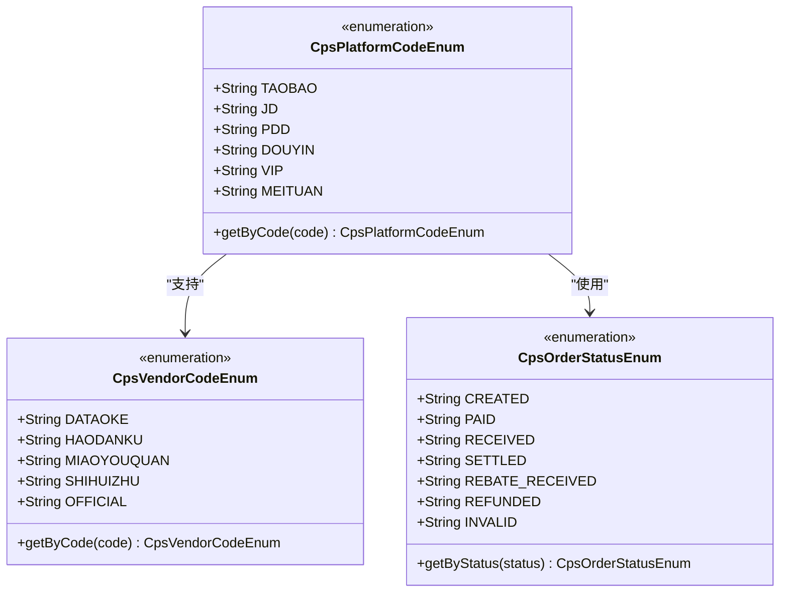
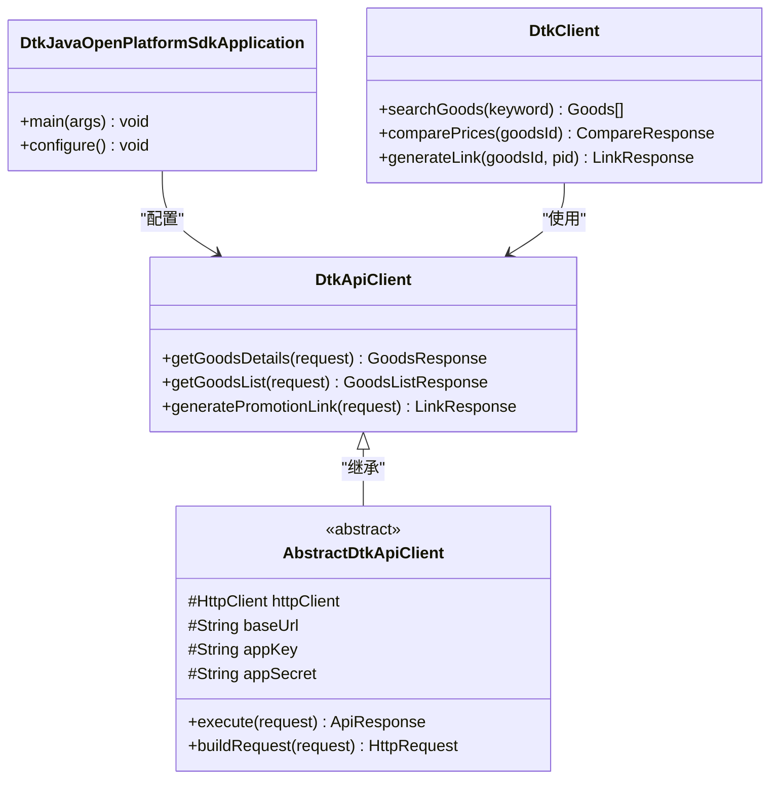
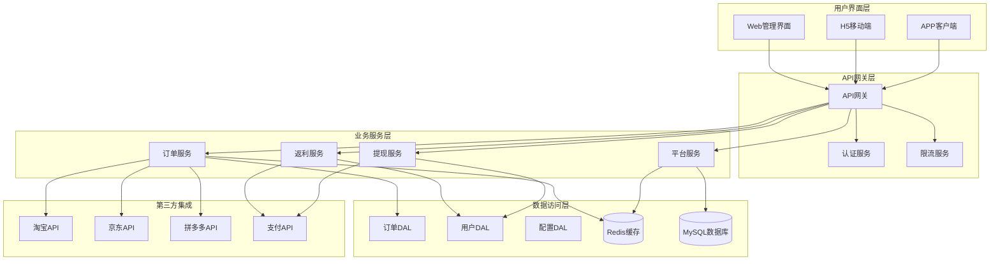
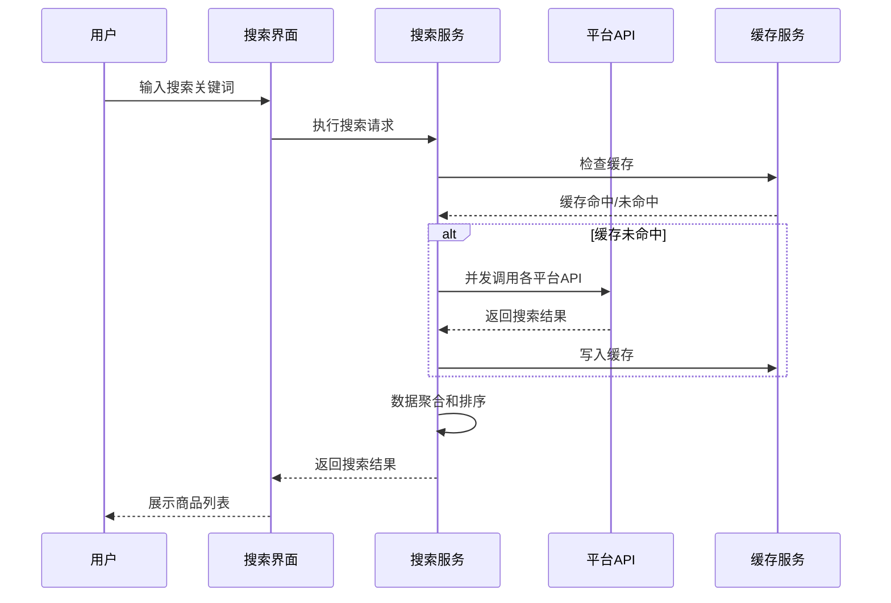
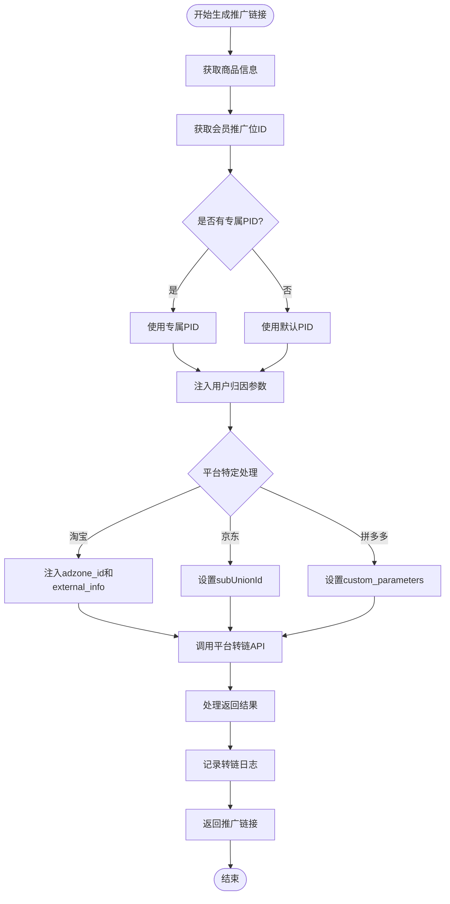
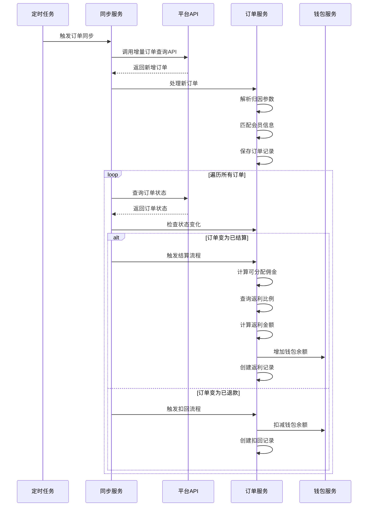
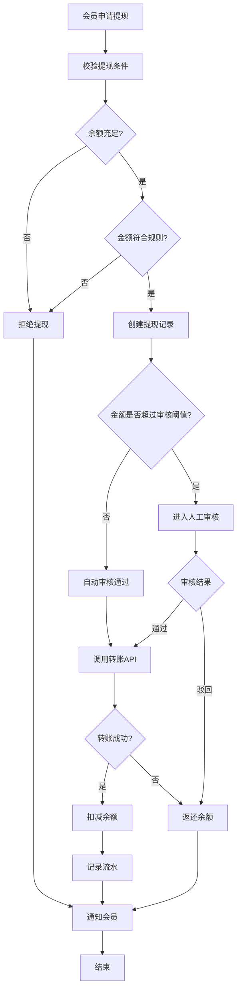
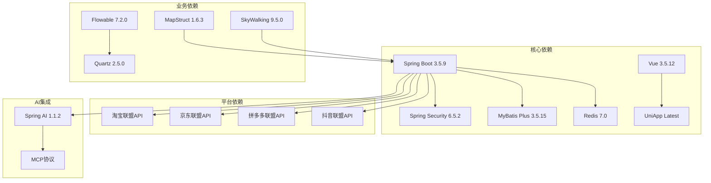

# CPS供应商客户端

<cite>
**本文档引用的文件**
- [README.md](file://README.md)
- [CPS系统PRD文档.md](file://docs/CPS系统PRD文档.md)
- [CpsPlatformCodeEnum.java](file://backend/yudao-module-cps/yudao-module-cps-api/src/main/java/cn/iocoder/yudao/module/cps/enums/CpsPlatformCodeEnum.java)
- [CpsOrderStatusEnum.java](file://backend/yudao-module-cps/yudao-module-cps-api/src/main/java/cn/iocoder/yudao/module/cps/enums/CpsOrderStatusEnum.java)
- [CpsVendorCodeEnum.java](file://backend/yudao-module-cps/yudao-module-cps-api/src/main/java/cn/iocoder/yudao/module/cps/enums/CpsVendorCodeEnum.java)
- [DtkJavaOpenPlatformSdkApplication.java](file://agent_improvement/sdk_demo/dataoke-sdk-java/src/main/java/com/dtk/api/DtkJavaOpenPlatformSdkApplication.java)
- [AbstractDtkApiClient.java](file://agent_improvement/sdk_demo/dataoke-sdk-java/src/main/java/com/dtk/api/client/AbstractDtkApiClient.java)
- [DtkApiClient.java](file://agent_improvement/sdk_demo/dataoke-sdk-java/src/main/java/com/dtk/api/client/DtkApiClient.java)
- [DtkClient.java](file://agent_improvement/sdk_demo/dataoke-sdk-java/src/main/java/com/dtk/api/client/DtkClient.java)
- [CpsActivityLinkRequest.java](file://agent_improvement/sdk_demo/dataoke-sdk-java/src/main/java/com/dtk/api/request/mastertool/DtkActivityLinkRequest.java)
- [CpsCommodityMaterialsRequest.java](file://agent_improvement/sdk_demo/dataoke-sdk-java/src/main/java/com/dtk/api/request/mastertool/DtkCommodityMaterialsRequest.java)
- [CpsCouponQueryRequest.java](file://agent_improvement/sdk_demo/dataoke-sdk-java/src/main/java/com/dtk/api/request/mastertool/DtkCouponQueryRequest.java)
</cite>

## 目录
1. [简介](#简介)
2. [项目结构](#项目结构)
3. [核心组件](#核心组件)
4. [架构概览](#架构概览)
5. [详细组件分析](#详细组件分析)
6. [依赖关系分析](#依赖关系分析)
7. [性能考虑](#性能考虑)
8. [故障排除指南](#故障排除指南)
9. [结论](#结论)

## 简介

CPS供应商客户端是一个基于AgenticCPS平台的智能返利赚钱系统。该项目采用Vibe Coding + 低代码 + AI自主编程的理念，为用户提供一站式多平台CPS返利查询与导购服务。

AgenticCPS平台深度融合了以下核心技术：
- **Vibe Coding氛围编程**：用户只需描述需求，AI自动完成代码编写、测试和部署
- **低代码开发**：通过代码生成器和可视化工具实现零代码开发
- **AI自主编程**：100%由AI自主编写的20,000+行核心代码

该系统支持淘宝、京东、拼多多、抖音等多个主流电商平台的CPS联盟接入，为用户提供从商品搜索到返利提现的完整服务闭环。

## 项目结构

```mermaid
graph TB
subgraph "前端应用"
FE_Admin_Vue3[管理后台(Vue3)]
FE_Admin_UniApp[管理后台(UniApp)]
FE_Mall_UniApp[商城(UniApp)]
end
subgraph "后端服务"
Backend_Server[后端服务(Yudao Server)]
subgraph "核心模块"
CPS_Module[CPS模块]
System_Module[系统模块]
Member_Module[会员模块]
Pay_Module[支付模块]
end
subgraph "基础设施"
Framework_Framework[框架扩展]
Infra_Module[基础设施模块]
Report_Module[报表模块]
AI_Module[AI模块]
end
end
subgraph "外部平台"
Taobao_API[淘宝联盟API]
JD_API[京东联盟API]
PDD_API[拼多多联盟API]
DY_API[抖音联盟API]
end
FE_Admin_Vue3 --> Backend_Server
FE_Admin_UniApp --> Backend_Server
FE_Mall_UniApp --> Backend_Server
Backend_Server --> CPS_Module
Backend_Server --> System_Module
Backend_Server --> Member_Module
Backend_Server --> Pay_Module
CPS_Module --> Taobao_API
CPS_Module --> JD_API
CPS_Module --> PDD_API
CPS_Module --> DY_API
```

**图表来源**
- [README.md: 229-249:229-249](file://README.md#L229-L249)
- [README.md: 267-284:267-284](file://README.md#L267-L284)

**章节来源**
- [README.md: 229-249:229-249](file://README.md#L229-L249)
- [README.md: 267-284:267-284](file://README.md#L267-L284)

## 核心组件

### 平台枚举系统

系统通过枚举类管理支持的CPS平台，确保平台配置的一致性和可扩展性：



**图表来源**
- [CpsPlatformCodeEnum.java: 14-46:14-46](file://backend/yudao-module-cps/yudao-module-cps-api/src/main/java/cn/iocoder/yudao/module/cps/enums/CpsPlatformCodeEnum.java#L14-L46)
- [CpsVendorCodeEnum.java: 16-51:16-51](file://backend/yudao-module-cps/yudao-module-cps-api/src/main/java/cn/iocoder/yudao/module/cps/enums/CpsVendorCodeEnum.java#L16-L51)
- [CpsOrderStatusEnum.java: 14-47:14-47](file://backend/yudao-module-cps/yudao-module-cps-api/src/main/java/cn/iocoder/yudao/module/cps/enums/CpsOrderStatusEnum.java#L14-L47)

### 大淘客SDK集成

系统集成了大淘客Java SDK，提供统一的第三方平台API访问能力：



**图表来源**
- [DtkJavaOpenPlatformSdkApplication.java: 1-50:1-50](file://agent_improvement/sdk_demo/dataoke-sdk-java/src/main/java/com/dtk/api/DtkJavaOpenPlatformSdkApplication.java#L1-L50)
- [AbstractDtkApiClient.java: 1-80:1-80](file://agent_improvement/sdk_demo/dataoke-sdk-java/src/main/java/com/dtk/api/client/AbstractDtkApiClient.java#L1-L80)
- [DtkApiClient.java: 1-60:1-60](file://agent_improvement/sdk_demo/dataoke-sdk-java/src/main/java/com/dtk/api/client/DtkApiClient.java#L1-L60)
- [DtkClient.java: 1-80:1-80](file://agent_improvement/sdk_demo/dataoke-sdk-java/src/main/java/com/dtk/api/client/DtkClient.java#L1-L80)

**章节来源**
- [CpsPlatformCodeEnum.java: 14-46:14-46](file://backend/yudao-module-cps/yudao-module-cps-api/src/main/java/cn/iocoder/yudao/module/cps/enums/CpsPlatformCodeEnum.java#L14-L46)
- [CpsVendorCodeEnum.java: 16-51:16-51](file://backend/yudao-module-cps/yudao-module-cps-api/src/main/java/cn/iocoder/yudao/module/cps/enums/CpsVendorCodeEnum.java#L16-L51)
- [CpsOrderStatusEnum.java: 14-47:14-47](file://backend/yudao-module-cps/yudao-module-cps-api/src/main/java/cn/iocoder/yudao/module/cps/enums/CpsOrderStatusEnum.java#L14-L47)

## 架构概览



**图表来源**
- [README.md: 229-249:229-249](file://README.md#L229-L249)
- [README.md: 286-302:286-302](file://README.md#L286-L302)

## 详细组件分析

### 商品搜索组件

商品搜索是CPS系统的核心功能之一，支持多种搜索方式：



**图表来源**
- [CPS系统PRD文档.md: 121-150:121-150](file://docs/CPS系统PRD文档.md#L121-L150)

### 推广链接生成组件

推广链接生成功能支持多平台链接转换：



**图表来源**
- [CPS系统PRD文档.md: 152-181:152-181](file://docs/CPS系统PRD文档.md#L152-L181)

### 订单同步与结算组件

订单同步是CPS系统的核心业务流程：



**图表来源**
- [CPS系统PRD文档.md: 183-223:183-223](file://docs/CPS系统PRD文档.md#L183-L223)

### 提现管理组件

提现管理提供完整的提现流程控制：



**图表来源**
- [CPS系统PRD文档.md: 225-261:225-261](file://docs/CPS系统PRD文档.md#L225-L261)

**章节来源**
- [CPS系统PRD文档.md: 80-261:80-261](file://docs/CPS系统PRD文档.md#L80-L261)

## 依赖关系分析



**图表来源**
- [README.md: 286-302:286-302](file://README.md#L286-L302)

**章节来源**
- [README.md: 286-302:286-302](file://README.md#L286-L302)

## 性能考虑

### 性能指标要求

系统针对关键业务场景制定了严格的性能指标：

| 指标类型 | 性能要求 | 说明 |
|---------|---------|------|
| 单平台搜索 | < 2 秒 (P99) | 搜索响应时间 |
| 多平台比价 | < 5 秒 (P99) | 并发查询响应时间 |
| 转链生成 | < 1 秒 | 推广链接生成时间 |
| 订单同步延迟 | < 30 分钟 | 订单状态更新延迟 |
| 返利入账 | 平台结算后 24 小时内 | 返利到账时效 |
| MCP Tool调用 | < 3 秒 (搜索类)/< 1 秒 (查询类) | AI工具调用响应时间 |

### 缓存策略

系统采用多层次缓存策略优化性能：

1. **Redis缓存层**：存储热点数据和临时状态
2. **本地缓存层**：减少重复计算和网络请求
3. **数据库缓存层**：利用数据库自身的查询缓存

### 异步处理

对于耗时操作采用异步处理机制：
- 订单同步任务
- 数据统计计算
- 通知发送
- 文件上传处理

## 故障排除指南

### 常见问题诊断

#### 订单同步异常
**症状**：订单状态长时间不更新
**排查步骤**：
1. 检查平台API连接状态
2. 验证API密钥配置
3. 查看定时任务执行日志
4. 检查网络连接状况

#### 返利计算错误
**症状**：返利金额与预期不符
**排查步骤**：
1. 检查会员等级配置
2. 验证返利规则设置
3. 确认平台服务费率
4. 核对订单状态流程

#### 提现失败
**症状**：提现申请无法完成
**排查步骤**：
1. 检查账户余额
2. 验证提现条件
3. 确认银行账户信息
4. 查看支付API状态

### 日志分析

系统提供了完善的日志记录机制：
- **业务日志**：记录关键业务操作
- **错误日志**：捕获异常和错误信息
- **性能日志**：监控系统性能指标
- **审计日志**：记录用户操作轨迹

**章节来源**
- [README.md: 369-378:369-378](file://README.md#L369-L378)

## 结论

CPS供应商客户端是一个功能完整、架构清晰的智能返利系统。通过采用Vibe Coding + 低代码 + AI自主编程的技术路线，该系统实现了：

1. **高度自动化**：AI自主完成代码编写、测试和部署
2. **多平台支持**：统一接入淘宝、京东、拼多多、抖音等主流平台
3. **高性能架构**：满足电商场景的性能要求
4. **易扩展性**：模块化设计支持功能快速扩展
5. **低代码开发**：大幅降低开发成本和门槛

该系统为个人创业者和小型工作室提供了完整的CPS解决方案，通过智能化的技术手段实现了"一个人 = 一个技术团队"的目标。随着AI技术的不断发展，该系统将继续演进，为用户提供更加智能化的服务体验。