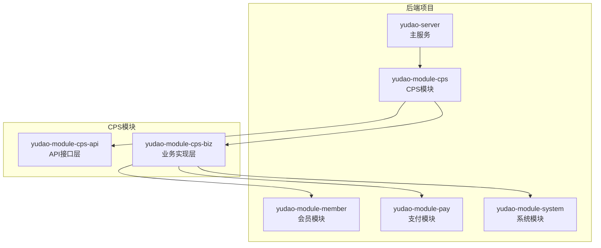
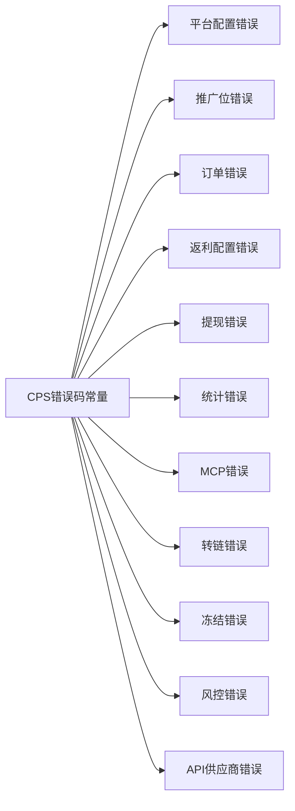
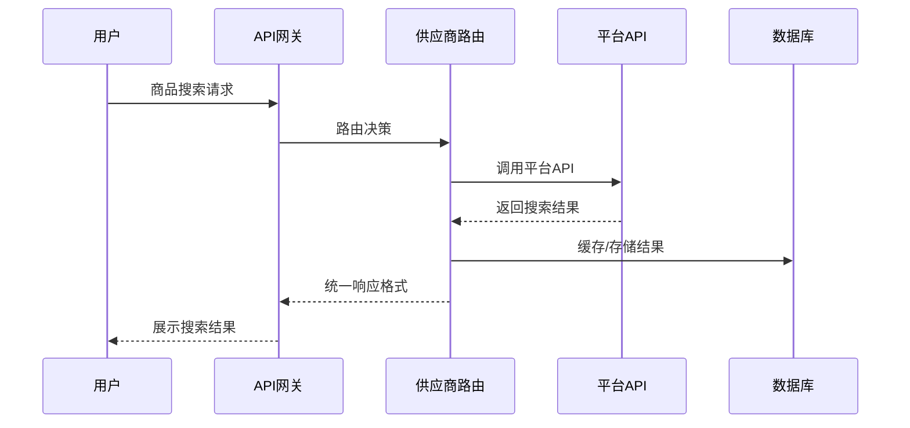
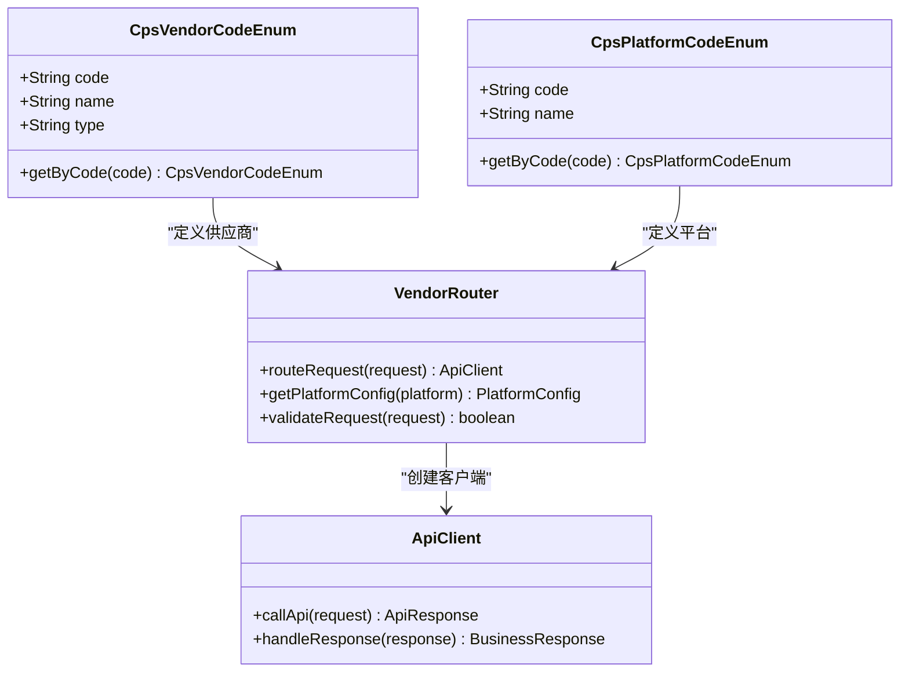
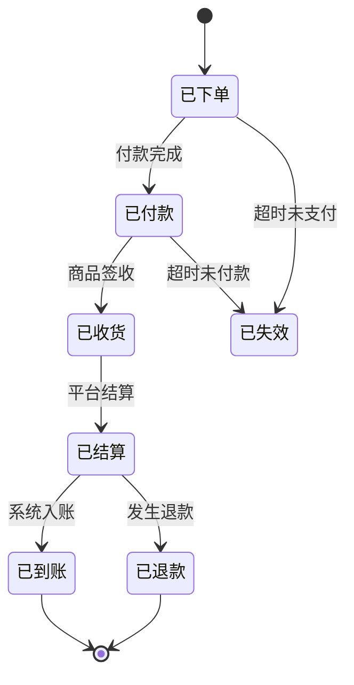
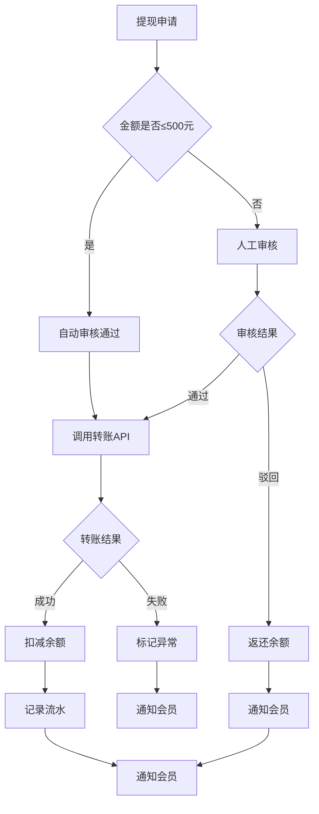
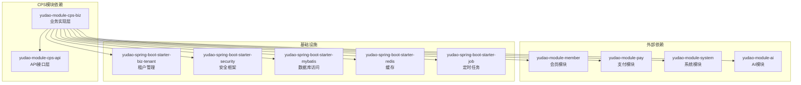

# CPS供应商路由系统

<cite>
**本文档引用的文件**
- [CPS系统PRD文档.md](file://docs/CPS系统PRD文档.md)
- [CpsVendorCodeEnum.java](file://backend/yudao-module-cps/yudao-module-cps-api/src/main/java/cn/iocoder/yudao/module/cps/enums/CpsVendorCodeEnum.java)
- [CpsPlatformCodeEnum.java](file://backend/yudao-module-cps/yudao-module-cps-api/src/main/java/cn/iocoder/yudao/module/cps/enums/CpsPlatformCodeEnum.java)
- [CpsAdzoneTypeEnum.java](file://backend/yudao-module-cps/yudao-module-cps-api/src/main/java/cn/iocoder/yudao/module/cps/enums/CpsAdzoneTypeEnum.java)
- [CpsErrorCodeConstants.java](file://backend/yudao-module-cps/yudao-module-cps-api/src/main/java/cn/iocoder/yudao/module/cps/enums/CpsErrorCodeConstants.java)
- [CpsOrderStatusEnum.java](file://backend/yudao-module-cps/yudao-module-cps-api/src/main/java/cn/iocoder/yudao/module/cps/enums/CpsOrderStatusEnum.java)
- [CpsRebateStatusEnum.java](file://backend/yudao-module-cps/yudao-module-cps-api/src/main/java/cn/iocoder/yudao/module/cps/enums/CpsRebateStatusEnum.java)
- [CpsWithdrawStatusEnum.java](file://backend/yudao-module-cps/yudao-module-cps-api/src/main/java/cn/iocoder/yudao/module/cps/enums/CpsWithdrawStatusEnum.java)
- [pom.xml](file://backend/pom.xml)
- [yudao-module-cps-biz/pom.xml](file://backend/yudao-module-cps/yudao-module-cps-biz/pom.xml)
</cite>

## 目录
1. [简介](#简介)
2. [项目结构](#项目结构)
3. [核心组件](#核心组件)
4. [架构概览](#架构概览)
5. [详细组件分析](#详细组件分析)
6. [依赖关系分析](#依赖关系分析)
7. [性能考虑](#性能考虑)
8. [故障排除指南](#故障排除指南)
9. [结论](#结论)

## 简介

CPS供应商路由系统是一个基于芋道框架构建的一站式多平台CPS返利查询与导购系统。该系统聚合了淘宝、京东、拼多多等多个主流电商平台的CPS联盟能力，为消费者提供返利查询、跨平台比价、推广链接生成和返利提现等服务。

系统采用模块化架构设计，通过供应商路由机制实现对不同CPS平台API的统一管理和调度。核心功能包括商品搜索与比价、推广链接生成、订单同步与结算、返利计算与提现管理等。

## 项目结构

基于芋道微服务架构的整体项目结构，CPS模块位于后端项目的yudao-module-cps目录下，采用标准的Maven多模块结构：

**图表来源**
- [pom.xml:10-25](file://backend/pom.xml#L10-L25)
- [yudao-module-cps-biz/pom.xml:1-103](file://backend/yudao-module-cps/yudao-module-cps-biz/pom.xml#L1-L103)

**章节来源**
- [pom.xml:10-25](file://backend/pom.xml#L10-L25)
- [yudao-module-cps-biz/pom.xml:1-103](file://backend/yudao-module-cps/yudao-module-cps-biz/pom.xml#L1-L103)

## 核心组件

### 枚举系统

系统通过强类型的枚举系统确保业务逻辑的正确性和一致性：

#### 供应商枚举
系统支持多种API供应商，包括聚合平台和官方API：
- **聚合平台**：大淘客、好单库、喵有卷、实惠猪
- **官方API**：淘宝联盟、京东联盟、拼多多联盟、抖音联盟、唯品会联盟、美团联盟

#### 平台枚举
定义了支持的电商平台：
- 淘宝联盟 (taobao)
- 京东联盟 (jd)  
- 拼多多联盟 (pdd)
- 抖音联盟 (douyin)
- 唯品会联盟 (vip)
- 美团联盟 (meituan)

#### 推广位类型枚举
- 通用推广位 (general)
- 渠道专属推广位 (channel)
- 用户专属推广位 (member)

**章节来源**
- [CpsVendorCodeEnum.java:18-51](file://backend/yudao-module-cps/yudao-module-cps-api/src/main/java/cn/iocoder/yudao/module/cps/enums/CpsVendorCodeEnum.java#L18-L51)
- [CpsPlatformCodeEnum.java:16-46](file://backend/yudao-module-cps/yudao-module-cps-api/src/main/java/cn/iocoder/yudao/module/cps/enums/CpsPlatformCodeEnum.java#L16-L46)
- [CpsAdzoneTypeEnum.java:16-39](file://backend/yudao-module-cps/yudao-module-cps-api/src/main/java/cn/iocoder/yudao/module/cps/enums/CpsAdzoneTypeEnum.java#L16-L39)

### 错误码系统

系统采用统一的错误码管理机制，按照业务模块进行分类：

**图表来源**
- [CpsErrorCodeConstants.java:10-68](file://backend/yudao-module-cps/yudao-module-cps-api/src/main/java/cn/iocoder/yudao/module/cps/enums/CpsErrorCodeConstants.java#L10-L68)

**章节来源**
- [CpsErrorCodeConstants.java:10-68](file://backend/yudao-module-cps/yudao-module-cps-api/src/main/java/cn/iocoder/yudao/module/cps/enums/CpsErrorCodeConstants.java#L10-L68)

## 架构概览

系统采用分层架构设计，通过供应商路由机制实现对多平台API的统一管理：

**图表来源**
- [CPS系统PRD文档.md:121-150](file://docs/CPS系统PRD文档.md#L121-L150)

系统的核心业务流程包括：

1. **商品查询流程**：智能识别输入类型，支持URL解析、口令解析和关键词搜索
2. **推广链接生成流程**：根据会员推广位生成带归因参数的推广链接
3. **订单同步与结算流程**：定时任务同步订单状态，计算返利并入账
4. **提现流程**：会员申请提现，运营审核后打款到账

**章节来源**
- [CPS系统PRD文档.md:82-261](file://docs/CPS系统PRD文档.md#L82-L261)

## 详细组件分析

### 供应商路由组件

供应商路由组件是系统的核心，负责将业务请求路由到合适的API供应商：

**图表来源**
- [CpsVendorCodeEnum.java:18-51](file://backend/yudao-module-cps/yudao-module-cps-api/src/main/java/cn/iocoder/yudao/module/cps/enums/CpsVendorCodeEnum.java#L18-L51)
- [CpsPlatformCodeEnum.java:16-46](file://backend/yudao-module-cps/yudao-module-cps-api/src/main/java/cn/iocoder/yudao/module/cps/enums/CpsPlatformCodeEnum.java#L16-L46)

### 订单状态管理系统

系统通过完整的订单生命周期管理确保交易的准确性：

**图表来源**
- [CpsOrderStatusEnum.java:18-25](file://backend/yudao-module-cps/yudao-module-cps-api/src/main/java/cn/iocoder/yudao/module/cps/enums/CpsOrderStatusEnum.java#L18-L25)

**章节来源**
- [CpsOrderStatusEnum.java:18-47](file://backend/yudao-module-cps/yudao-module-cps-api/src/main/java/cn/iocoder/yudao/module/cps/enums/CpsOrderStatusEnum.java#L18-L47)

### 提现流程管理

提现流程采用双层审核机制，确保资金安全：

**图表来源**
- [CpsWithdrawStatusEnum.java:18-25](file://backend/yudao-module-cps/yudao-module-cps-api/src/main/java/cn/iocoder/yudao/module/cps/enums/CpsWithdrawStatusEnum.java#L18-L25)

**章节来源**
- [CpsWithdrawStatusEnum.java:18-43](file://backend/yudao-module-cps/yudao-module-cps-api/src/main/java/cn/iocoder/yudao/module/cps/enums/CpsWithdrawStatusEnum.java#L18-L43)

## 依赖关系分析

CPS模块的依赖关系体现了清晰的分层架构：

**图表来源**
- [yudao-module-cps-biz/pom.xml:20-99](file://backend/yudao-module-cps/yudao-module-cps-biz/pom.xml#L20-L99)

**章节来源**
- [yudao-module-cps-biz/pom.xml:20-99](file://backend/yudao-module-cps/yudao-module-cps-biz/pom.xml#L20-L99)

## 性能考虑

### 缓存策略
- 使用Redis缓存热门商品信息和搜索结果
- 推广位配置和返利规则进行本地缓存
- 订单状态变更采用异步更新机制

### 并发处理
- 商品搜索支持多平台并发查询
- 订单同步采用分布式锁避免重复处理
- 提现请求进行幂等性保证

### 监控与告警
- 关键业务指标实时监控
- API调用延迟和错误率统计
- 系统健康状态检查

## 故障排除指南

### 常见问题诊断

**订单同步异常**
- 检查平台API配置是否正确
- 验证签名算法和时间戳
- 确认网络连接和防火墙设置

**推广链接生成失败**
- 核对推广位ID的有效性
- 检查平台授权状态
- 验证商品ID格式

**提现审核问题**
- 确认会员账户状态
- 检查银行账户信息
- 验证提现金额限制

### 错误码对照表

| 错误码 | 业务模块 | 错误描述 | 处理建议 |
|--------|----------|----------|----------|
| 1_100_001_000 | 平台配置 | 平台配置不存在 | 检查平台配置是否存在 |
| 1_100_003_001 | 订单 | 订单已存在 | 检查订单去重逻辑 |
| 1_100_006_001 | 返利账户 | 余额不足 | 检查账户余额 |
| 1_100_007_002 | 提现 | 金额低于最低限额 | 调整提现金额 |

**章节来源**
- [CpsErrorCodeConstants.java:13-67](file://backend/yudao-module-cps/yudao-module-cps-api/src/main/java/cn/iocoder/yudao/module/cps/enums/CpsErrorCodeConstants.java#L13-L67)

## 结论

CPS供应商路由系统通过模块化的架构设计和完善的业务流程管理，为用户提供了一站式的CPS返利服务。系统的主要优势包括：

1. **多平台聚合**：统一管理多个CPS平台API，提供一致的用户体验
2. **强类型设计**：通过枚举系统确保业务逻辑的正确性
3. **完善的错误处理**：统一的错误码管理和异常处理机制
4. **可扩展性**：模块化设计便于功能扩展和维护
5. **安全性保障**：多层次的权限控制和数据保护机制

该系统为电商CPS联盟返利业务提供了坚实的技术基础，能够满足不同规模业务的发展需求。