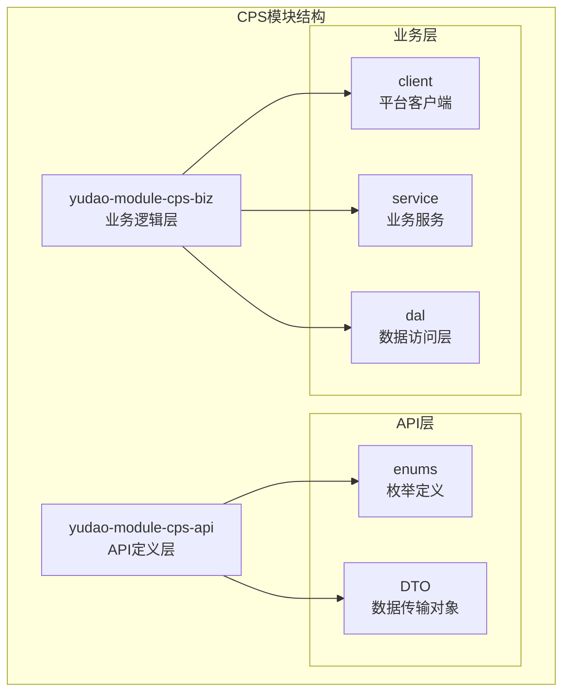
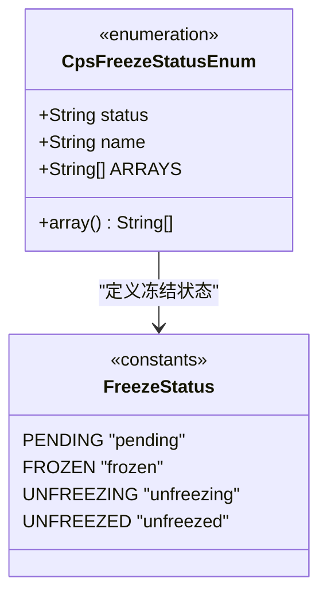
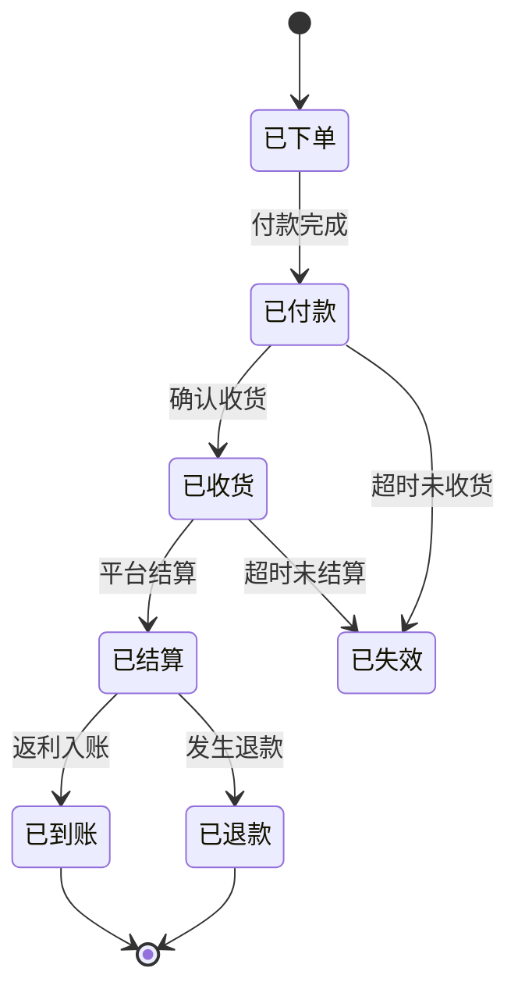
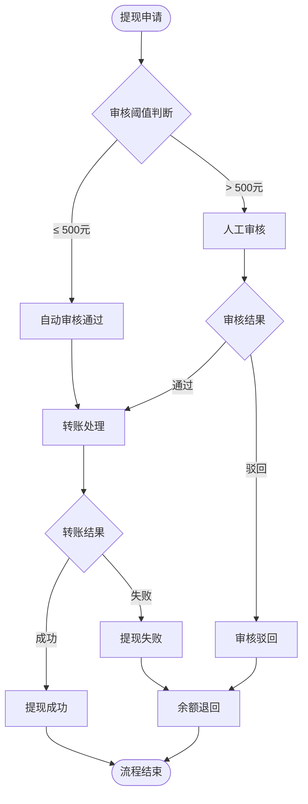
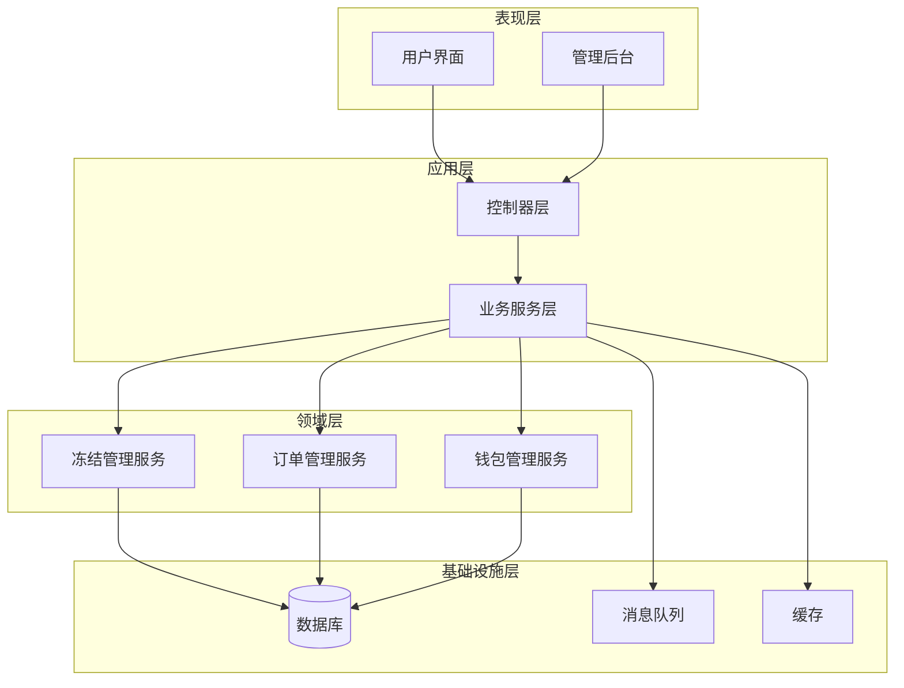
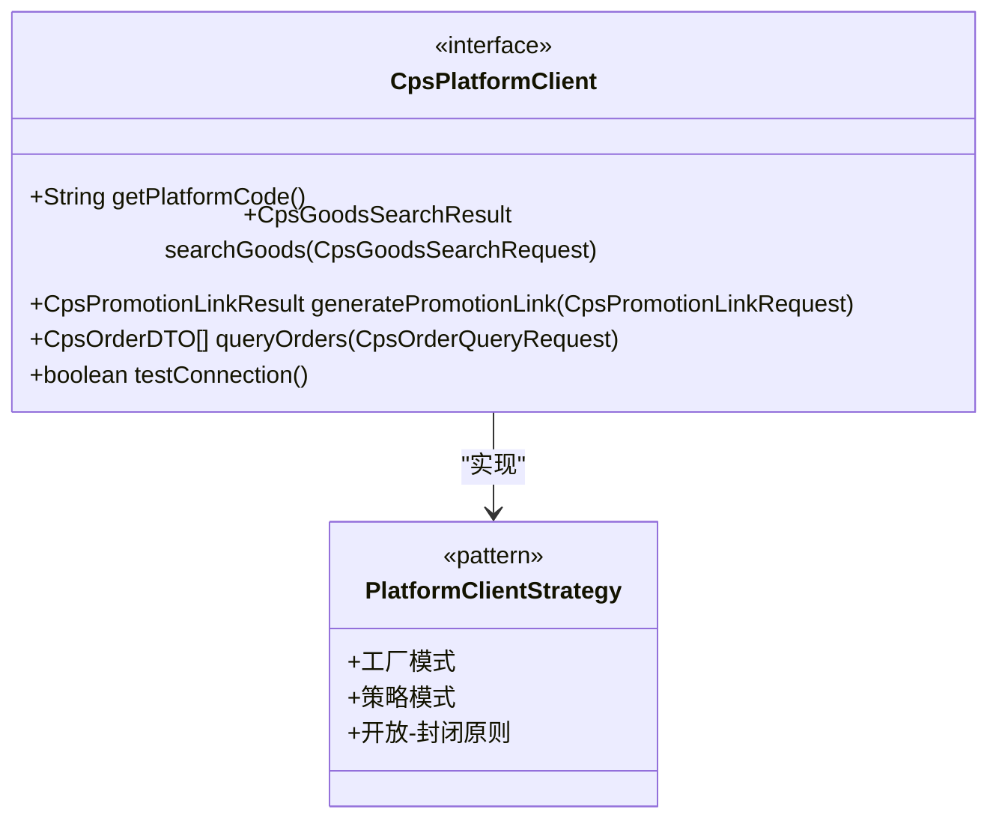
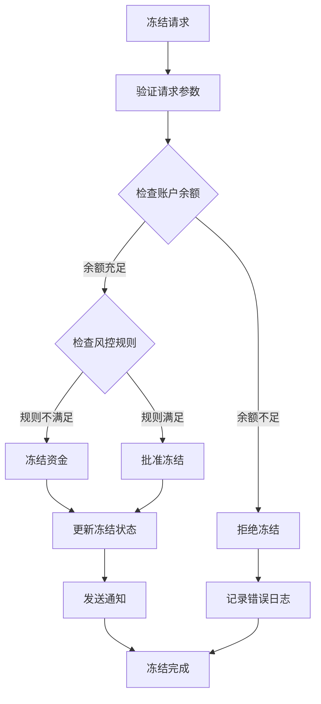
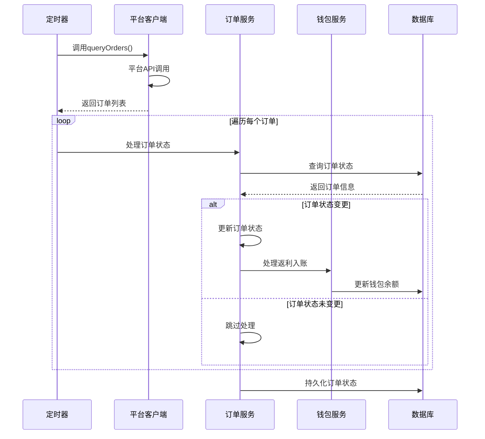
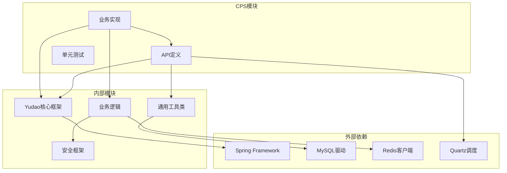

# CPS冻结管理模块

<cite>
**本文档引用的文件**
- [CpsFreezeStatusEnum.java](file://backend/yudao-module-cps/yudao-module-cps-api/src/main/java/cn/iocoder/yudao/module/cps/enums/CpsFreezeStatusEnum.java)
- [CpsOrderStatusEnum.java](file://backend/yudao-module-cps/yudao-module-cps-api/src/main/java/cn/iocoder/yudao/module/cps/enums/CpsOrderStatusEnum.java)
- [CpsRebateStatusEnum.java](file://backend/yudao-module-cps/yudao-module-cps-api/src/main/java/cn/iocoder/yudao/module/cps/enums/CpsRebateStatusEnum.java)
- [CpsWithdrawStatusEnum.java](file://backend/yudao-module-cps/yudao-module-cps-api/src/main/java/cn/iocoder/yudao/module/cps/enums/CpsWithdrawStatusEnum.java)
- [CpsPlatformClient.java](file://backend/yudao-module-cps/yudao-module-cps-biz/src/main/java/cn/iocoder/yudao/module/cps/client/CpsPlatformClient.java)
- [CPS系统PRD文档.md](file://docs/CPS系统PRD文档.md)
</cite>

## 目录
1. [简介](#简介)
2. [项目结构](#项目结构)
3. [核心组件](#核心组件)
4. [架构概览](#架构概览)
5. [详细组件分析](#详细组件分析)
6. [依赖关系分析](#依赖关系分析)
7. [性能考虑](#性能考虑)
8. [故障排除指南](#故障排除指南)
9. [结论](#结论)

## 简介

CPS冻结管理模块是AgenticCPS系统中的一个关键子系统，负责管理CPS（Cost Per Sale）联盟返利系统的资金冻结和解冻流程。该模块基于芋道框架构建，采用模块化设计，支持多平台CPS联盟接入，包括淘宝、京东、拼多多等主流电商平台。

该模块的核心功能包括：
- 冻结状态管理（待冻结、已冻结、解冻中、已解冻）
- 订单状态追踪（已下单、已付款、已收货、已结算、已到账、已退款、已失效）
- 返利状态管理（待结算、已到账、已扣回）
- 提现状态控制（已申请、审核中、审核通过、审核驳回、提现成功、提现失败、已退回）

## 项目结构

CPS冻结管理模块位于后端项目的yudao-module-cps目录下，采用标准的Maven模块化结构：

**图表来源**
- [CpsFreezeStatusEnum.java:1-41](file://backend/yudao-module-cps/yudao-module-cps-api/src/main/java/cn/iocoder/yudao/module/cps/enums/CpsFreezeStatusEnum.java#L1-L41)
- [CpsPlatformClient.java:1-55](file://backend/yudao-module-cps/yudao-module-cps-biz/src/main/java/cn/iocoder/yudao/module/cps/client/CpsPlatformClient.java#L1-L55)

**章节来源**
- [CpsFreezeStatusEnum.java:1-41](file://backend/yudao-module-cps/yudao-module-cps-api/src/main/java/cn/iocoder/yudao/module/cps/enums/CpsFreezeStatusEnum.java#L1-L41)
- [CpsPlatformClient.java:1-55](file://backend/yudao-module-cps/yudao-module-cps-biz/src/main/java/cn/iocoder/yudao/module/cps/client/CpsPlatformClient.java#L1-L55)

## 核心组件

### 冻结状态枚举系统

冻结状态枚举是整个CPS冻结管理模块的核心数据结构，定义了资金冻结的完整生命周期：

**图表来源**
- [CpsFreezeStatusEnum.java:16-40](file://backend/yudao-module-cps/yudao-module-cps-api/src/main/java/cn/iocoder/yudao/module/cps/enums/CpsFreezeStatusEnum.java#L16-L40)

冻结状态的四个核心阶段：
1. **待冻结（PENDING）**：资金处于冻结准备状态
2. **已冻结（FROZEN）**：资金已被正式冻结
3. **解冻中（UNFREEZING）**：资金正在解冻过程中
4. **已解冻（UNFREEZED）**：资金解冻完成

### 订单状态管理系统

订单状态管理涵盖了从下单到结算的完整业务流程：

**图表来源**
- [CpsOrderStatusEnum.java:16-47](file://backend/yudao-module-cps/yudao-module-cps-api/src/main/java/cn/iocoder/yudao/module/cps/enums/CpsOrderStatusEnum.java#L16-L47)

### 返利状态跟踪

返利状态管理确保返利资金的准确追踪和处理：

| 状态 | 编码 | 描述 | 业务含义 |
|------|------|------|----------|
| 待结算 | pending | PENDING | 返利等待结算 |
| 已到账 | received | RECEIVED | 返利已入账 |
| 已扣回 | refunded | REFUNDED | 返利被扣回 |

### 提现状态控制

提现流程的状态管理确保资金提取的安全性和可追溯性：

**图表来源**
- [CpsWithdrawStatusEnum.java:16-25](file://backend/yudao-module-cps/yudao-module-cps-api/src/main/java/cn/iocoder/yudao/module/cps/enums/CpsWithdrawStatusEnum.java#L16-L25)

**章节来源**
- [CpsFreezeStatusEnum.java:1-41](file://backend/yudao-module-cps/yudao-module-cps-api/src/main/java/cn/iocoder/yudao/module/cps/enums/CpsFreezeStatusEnum.java#L1-L41)
- [CpsOrderStatusEnum.java:1-48](file://backend/yudao-module-cps/yudao-module-cps-api/src/main/java/cn/iocoder/yudao/module/cps/enums/CpsOrderStatusEnum.java#L1-L48)
- [CpsRebateStatusEnum.java:1-40](file://backend/yudao-module-cps/yudao-module-cps-api/src/main/java/cn/iocoder/yudao/module/cps/enums/CpsRebateStatusEnum.java#L1-L40)
- [CpsWithdrawStatusEnum.java:1-44](file://backend/yudao-module-cps/yudao-module-cps-api/src/main/java/cn/iocoder/yudao/module/cps/enums/CpsWithdrawStatusEnum.java#L1-L44)

## 架构概览

CPS冻结管理模块采用分层架构设计，确保系统的可扩展性和可维护性：

**图表来源**
- [CpsPlatformClient.java:14-54](file://backend/yudao-module-cps/yudao-module-cps-biz/src/main/java/cn/iocoder/yudao/module/cps/client/CpsPlatformClient.java#L14-L54)

## 详细组件分析

### 平台客户端接口

平台客户端接口定义了CPS平台集成的标准规范，支持多平台无缝接入：

**图表来源**
- [CpsPlatformClient.java:14-54](file://backend/yudao-module-cps/yudao-module-cps-biz/src/main/java/cn/iocoder/yudao/module/cps/client/CpsPlatformClient.java#L14-L54)

### 冻结管理算法

冻结管理的核心算法确保资金安全和业务合规：

**图表来源**
- [CpsFreezeStatusEnum.java:18-21](file://backend/yudao-module-cps/yudao-module-cps-api/src/main/java/cn/iocoder/yudao/module/cps/enums/CpsFreezeStatusEnum.java#L18-L21)

### 订单同步机制

订单同步机制确保CPS订单数据的实时性和准确性：

**图表来源**
- [CpsOrderStatusEnum.java:18-24](file://backend/yudao-module-cps/yudao-module-cps-api/src/main/java/cn/iocoder/yudao/module/cps/enums/CpsOrderStatusEnum.java#L18-L24)

**章节来源**
- [CpsPlatformClient.java:1-55](file://backend/yudao-module-cps/yudao-module-cps-biz/src/main/java/cn/iocoder/yudao/module/cps/client/CpsPlatformClient.java#L1-L55)
- [CpsFreezeStatusEnum.java:1-41](file://backend/yudao-module-cps/yudao-module-cps-api/src/main/java/cn/iocoder/yudao/module/cps/enums/CpsFreezeStatusEnum.java#L1-L41)
- [CpsOrderStatusEnum.java:1-48](file://backend/yudao-module-cps/yudao-module-cps-api/src/main/java/cn/iocoder/yudao/module/cps/enums/CpsOrderStatusEnum.java#L1-L48)

## 依赖关系分析

CPS冻结管理模块的依赖关系体现了清晰的分层架构：

**图表来源**
- [CpsFreezeStatusEnum.java:1-41](file://backend/yudao-module-cps/yudao-module-cps-api/src/main/java/cn/iocoder/yudao/module/cps/enums/CpsFreezeStatusEnum.java#L1-L41)
- [CpsPlatformClient.java:1-55](file://backend/yudao-module-cps/yudao-module-cps-biz/src/main/java/cn/iocoder/yudao/module/cps/client/CpsPlatformClient.java#L1-L55)

**章节来源**
- [CpsFreezeStatusEnum.java:1-41](file://backend/yudao-module-cps/yudao-module-cps-api/src/main/java/cn/iocoder/yudao/module/cps/enums/CpsFreezeStatusEnum.java#L1-L41)
- [CpsPlatformClient.java:1-55](file://backend/yudao-module-cps/yudao-module-cps-biz/src/main/java/cn/iocoder/yudao/module/cps/client/CpsPlatformClient.java#L1-L55)

## 性能考虑

### 缓存策略

系统采用多层缓存策略优化性能：
- **Redis缓存**：热点数据缓存，减少数据库压力
- **本地缓存**：高频访问数据的快速响应
- **数据库连接池**：优化数据库连接复用

### 异步处理

通过消息队列实现异步处理：
- 订单同步任务异步执行
- 冻结解冻操作异步处理
- 通知消息异步发送

### 批处理优化

- 订单批量查询和处理
- 冻结状态批量更新
- 统计数据批量计算

## 故障排除指南

### 常见问题诊断

1. **冻结状态异常**
   - 检查冻结状态转换逻辑
   - 验证账户余额充足性
   - 确认风控规则配置

2. **订单同步失败**
   - 检查平台API连接状态
   - 验证订单查询参数
   - 确认网络连接稳定性

3. **提现处理异常**
   - 检查银行转账接口状态
   - 验证用户账户信息
   - 确认提现限额规则

### 监控指标

- **冻结成功率**：成功冻结/总冻结请求
- **订单同步延迟**：平均同步时间
- **提现处理时间**：从申请到完成的时间
- **系统可用性**：服务正常运行时间百分比

**章节来源**
- [CpsFreezeStatusEnum.java:1-41](file://backend/yudao-module-cps/yudao-module-cps-api/src/main/java/cn/iocoder/yudao/module/cps/enums/CpsFreezeStatusEnum.java#L1-L41)
- [CpsOrderStatusEnum.java:1-48](file://backend/yudao-module-cps/yudao-module-cps-api/src/main/java/cn/iocoder/yudao/module/cps/enums/CpsOrderStatusEnum.java#L1-L48)
- [CpsWithdrawStatusEnum.java:1-44](file://backend/yudao-module-cps/yudao-module-cps-api/src/main/java/cn/iocoder/yudao/module/cps/enums/CpsWithdrawStatusEnum.java#L1-L44)

## 结论

CPS冻结管理模块通过其精心设计的架构和完善的业务逻辑，为CPS联盟返利系统提供了可靠的资金管理保障。模块采用的分层设计、枚举化管理和策略模式，确保了系统的可扩展性和可维护性。

该模块的主要优势包括：
- **状态管理完善**：全面覆盖资金冻结的各个生命周期阶段
- **多平台支持**：标准化接口支持多家CPS平台接入
- **业务流程清晰**：从冻结到解冻的完整业务闭环
- **技术架构先进**：基于Spring框架的现代化企业级应用

未来可以考虑的改进方向：
- 增强风控能力，支持更复杂的冻结规则
- 优化性能，支持更高的并发处理能力
- 扩展支持更多CPS平台
- 完善监控告警机制