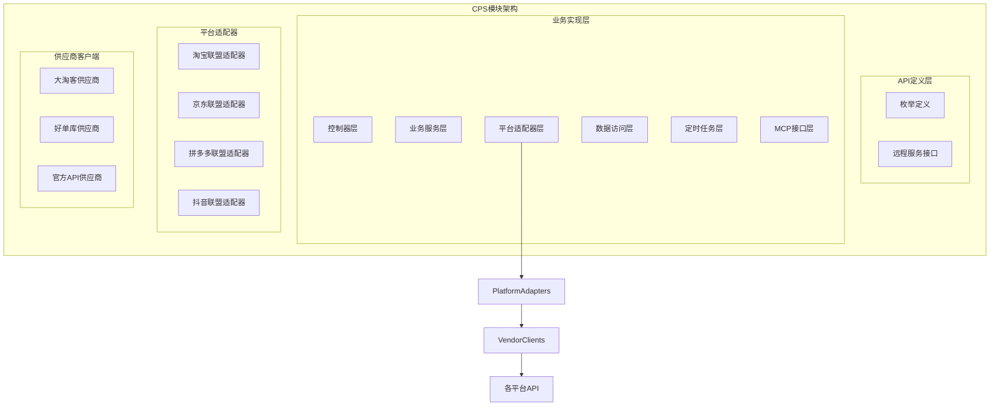
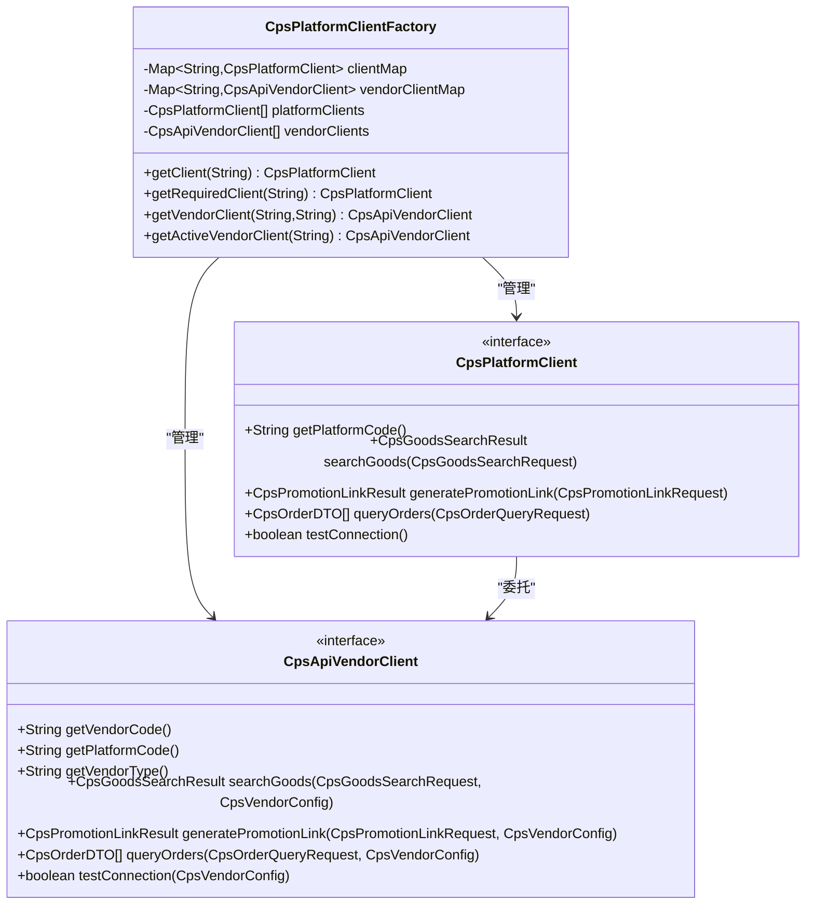
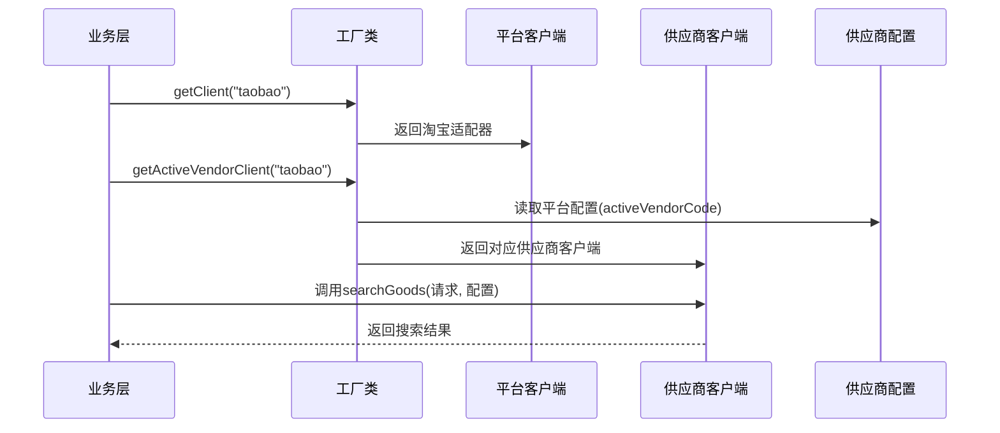
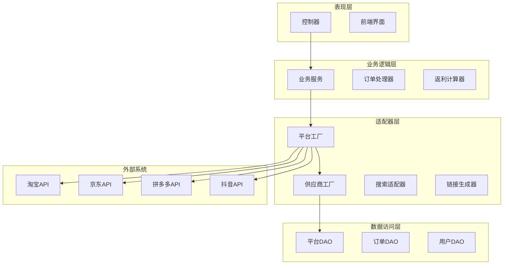
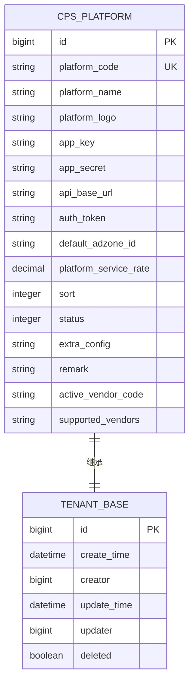
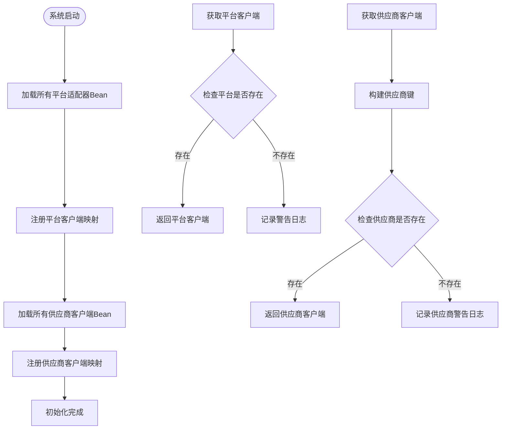
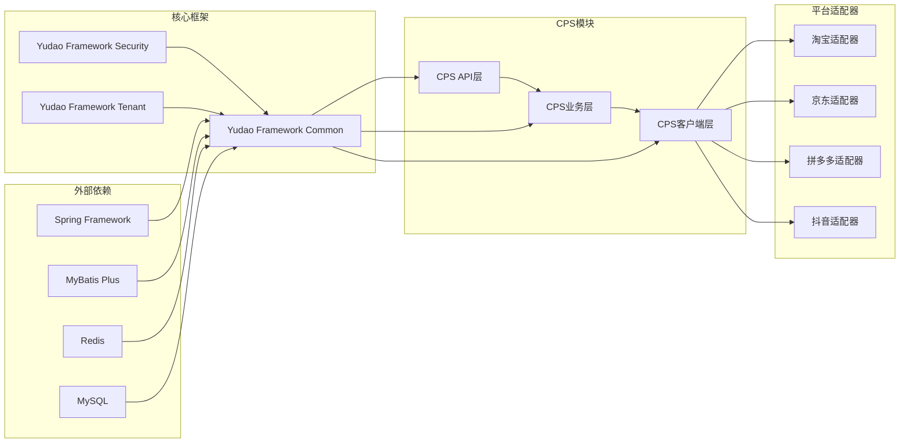

# CPS多供应商架构

<cite>
**本文档引用的文件**
- [README.md](file://README.md)
- [CPS系统PRD文档.md](file://docs/CPS系统PRD文档.md)
- [CpsPlatformClientFactory.java](file://backend/yudao-module-cps/yudao-module-cps-biz/src/main/java/cn/iocoder/yudao/module/cps/client/CpsPlatformClientFactory.java)
- [CpsPlatformClient.java](file://backend/yudao-module-cps/yudao-module-cps-biz/src/main/java/cn/iocoder/yudao/module/cps/client/CpsPlatformClient.java)
- [CpsApiVendorClient.java](file://backend/yudao-module-cps/yudao-module-cps-biz/src/main/java/cn/iocoder/yudao/module/cps/client/CpsApiVendorClient.java)
- [CpsPlatformCodeEnum.java](file://backend/yudao-module-cps/yudao-module-cps-api/src/main/java/cn/iocoder/yudao/module/cps/enums/CpsPlatformCodeEnum.java)
- [CpsVendorCodeEnum.java](file://backend/yudao-module-cps/yudao-module-cps-api/src/main/java/cn/iocoder/yudao/module/cps/enums/CpsVendorCodeEnum.java)
- [CpsPlatformDO.java](file://backend/yudao-module-cps/yudao-module-cps-biz/src/main/java/cn/iocoder/yudao/module/cps/dal/dataobject/platform/CpsPlatformDO.java)
</cite>

## 目录
1. [简介](#简介)
2. [项目结构](#项目结构)
3. [核心组件](#核心组件)
4. [架构概览](#架构概览)
5. [详细组件分析](#详细组件分析)
6. [依赖关系分析](#依赖关系分析)
7. [性能考虑](#性能考虑)
8. [故障排除指南](#故障排除指南)
9. [结论](#结论)

## 简介

AgenticCPS是一个基于Vibe Coding理念的智能CPS（Cost Per Sale）联盟返利平台，采用多供应商架构设计，支持淘宝、京东、拼多多、抖音等多个电商平台的统一接入。该系统通过策略模式和工厂模式实现了高度可扩展的平台适配器架构，支持同一电商平台对接多个API供应商。

系统的核心特色包括：
- **多供应商架构**：支持同一电商平台对接多个API供应商，提高系统可靠性和灵活性
- **策略模式设计**：通过接口抽象实现平台适配器的可插拔扩展
- **双维度路由**：支持平台编码和供应商编码的双重路由机制
- **AI自主编程**：20,000+行代码完全由AI自主编写，体现Vibe Coding理念

## 项目结构

基于项目的技术架构，CPS模块采用清晰的分层设计：

**图表来源**
- [README.md:229-249](file://README.md#L229-L249)
- [CpsPlatformClientFactory.java:17-27](file://backend/yudao-module-cps/yudao-module-cps-biz/src/main/java/cn/iocoder/yudao/module/cps/client/CpsPlatformClientFactory.java#L17-L27)

**章节来源**
- [README.md:229-249](file://README.md#L229-L249)
- [README.md:305-367](file://README.md#L305-L367)

## 核心组件

### 平台客户端接口

CpsPlatformClient是平台适配器的核心接口，定义了所有平台通用的操作方法：

**图表来源**
- [CpsPlatformClient.java:7-55](file://backend/yudao-module-cps/yudao-module-cps-biz/src/main/java/cn/iocoder/yudao/module/cps/client/CpsPlatformClient.java#L7-L55)
- [CpsApiVendorClient.java:7-84](file://backend/yudao-module-cps/yudao-module-cps-biz/src/main/java/cn/iocoder/yudao/module/cps/client/CpsApiVendorClient.java#L7-L84)
- [CpsPlatformClientFactory.java:30-80](file://backend/yudao-module-cps/yudao-module-cps-biz/src/main/java/cn/iocoder/yudao/module/cps/client/CpsPlatformClientFactory.java#L30-L80)

### 供应商维度路由

系统创新性地引入了供应商维度的路由机制，支持同一电商平台对接多个API供应商：

**图表来源**
- [CpsPlatformClientFactory.java:160-167](file://backend/yudao-module-cps/yudao-module-cps-biz/src/main/java/cn/iocoder/yudao/module/cps/client/CpsPlatformClientFactory.java#L160-L167)
- [CpsApiVendorClient.java:55-56](file://backend/yudao-module-cps/yudao-module-cps-biz/src/main/java/cn/iocoder/yudao/module/cps/client/CpsApiVendorClient.java#L55-L56)

**章节来源**
- [CpsPlatformClient.java:14-55](file://backend/yudao-module-cps/yudao-module-cps-biz/src/main/java/cn/iocoder/yudao/module/cps/client/CpsPlatformClient.java#L14-L55)
- [CpsApiVendorClient.java:25-84](file://backend/yudao-module-cps/yudao-module-cps-biz/src/main/java/cn/iocoder/yudao/module/cps/client/CpsApiVendorClient.java#L25-L84)
- [CpsPlatformClientFactory.java:30-167](file://backend/yudao-module-cps/yudao-module-cps-biz/src/main/java/cn/iocoder/yudao/module/cps/client/CpsPlatformClientFactory.java#L30-L167)

## 架构概览

CPS多供应商架构采用了分层设计和策略模式相结合的方式，实现了高度的模块化和可扩展性：

**图表来源**
- [README.md:229-249](file://README.md#L229-L249)
- [CpsPlatformClientFactory.java:17-27](file://backend/yudao-module-cps/yudao-module-cps-biz/src/main/java/cn/iocoder/yudao/module/cps/client/CpsPlatformClientFactory.java#L17-L27)

## 详细组件分析

### 平台枚举定义

系统通过枚举定义支持的平台类型，确保平台编码的一致性和可维护性：

| 平台编码 | 平台名称 | 平台类型 |
|---------|---------|---------|
| taobao | 淘宝联盟 | 主流电商平台 |
| jd | 京东联盟 | 主流电商平台 |
| pdd | 拼多多联盟 | 主流电商平台 |
| douyin | 抖音联盟 | 主流电商平台 |
| vip | 唯品会联盟 | 特色电商平台 |
| meituan | 美团联盟 | 生活服务平台 |

**章节来源**
- [CpsPlatformCodeEnum.java:16-46](file://backend/yudao-module-cps/yudao-module-cps-api/src/main/java/cn/iocoder/yudao/module/cps/enums/CpsPlatformCodeEnum.java#L16-L46)

### 供应商枚举定义

供应商枚举定义了系统支持的API供应商类型：

| 供应商编码 | 供应商名称 | 供应商类型 |
|-----------|-----------|-----------|
| dataoke | 大淘客 | 聚合平台 |
| haodanku | 好单库 | 聚合平台 |
| miaoyouquan | 喵有卷 | 聚合平台 |
| shihuizhu | 实惠猪 | 聚合平台 |
| official | 官方API | 官方API |

**章节来源**
- [CpsVendorCodeEnum.java:18-51](file://backend/yudao-module-cps/yudao-module-cps-api/src/main/java/cn/iocoder/yudao/module/cps/enums/CpsVendorCodeEnum.java#L18-L51)

### 平台配置数据对象

CpsPlatformDO定义了平台配置的核心属性，支持多租户和灵活的配置管理：

**图表来源**
- [CpsPlatformDO.java:17-95](file://backend/yudao-module-cps/yudao-module-cps-biz/src/main/java/cn/iocoder/yudao/module/cps/dal/dataobject/platform/CpsPlatformDO.java#L17-L95)

**章节来源**
- [CpsPlatformDO.java:25-95](file://backend/yudao-module-cps/yudao-module-cps-biz/src/main/java/cn/iocoder/yudao/module/cps/dal/dataobject/platform/CpsPlatformDO.java#L25-L95)

### 工厂模式实现

CpsPlatformClientFactory实现了工厂模式，负责平台适配器和供应商客户端的注册与管理：

**图表来源**
- [CpsPlatformClientFactory.java:60-80](file://backend/yudao-module-cps/yudao-module-cps-biz/src/main/java/cn/iocoder/yudao/module/cps/client/CpsPlatformClientFactory.java#L60-L80)
- [CpsPlatformClientFactory.java:143-150](file://backend/yudao-module-cps/yudao-module-cps-biz/src/main/java/cn/iocoder/yudao/module/cps/client/CpsPlatformClientFactory.java#L143-L150)

**章节来源**
- [CpsPlatformClientFactory.java:30-167](file://backend/yudao-module-cps/yudao-module-cps-biz/src/main/java/cn/iocoder/yudao/module/cps/client/CpsPlatformClientFactory.java#L30-L167)

## 依赖关系分析

系统采用了清晰的依赖层次结构，确保模块间的松耦合和高内聚：

**图表来源**
- [README.md:267-302](file://README.md#L267-L302)
- [CpsPlatformClientFactory.java:45-58](file://backend/yudao-module-cps/yudao-module-cps-biz/src/main/java/cn/iocoder/yudao/module/cps/client/CpsPlatformClientFactory.java#L45-L58)

**章节来源**
- [README.md:267-302](file://README.md#L267-L302)
- [CpsPlatformClientFactory.java:45-58](file://backend/yudao-module-cps/yudao-module-cps-biz/src/main/java/cn/iocoder/yudao/module/cps/client/CpsPlatformClientFactory.java#L45-L58)

## 性能考虑

系统在设计时充分考虑了性能优化，特别是在多平台并发查询和供应商切换方面：

### 并发查询优化
- **异步处理**：支持多平台并发查询，提升用户体验
- **缓存策略**：合理使用Redis缓存热点数据
- **连接池管理**：优化第三方API连接池配置

### 供应商切换优化
- **热切换机制**：支持供应商的动态切换而无需重启
- **健康检查**：定期检查供应商可用性
- **降级策略**：供应商不可用时的自动降级处理

### 性能指标
- 单平台搜索响应时间：< 2秒（P99）
- 多平台比价响应时间：< 5秒（P99）
- 转链生成响应时间：< 1秒
- 订单同步延迟：< 30分钟

## 故障排除指南

### 常见问题及解决方案

#### 1. 平台适配器未找到
**症状**：调用平台接口时报"未找到平台适配器"错误
**解决方案**：
- 检查平台编码是否正确
- 确认平台适配器是否正确注册到Spring容器
- 验证平台配置状态是否为启用

#### 2. 供应商客户端配置错误
**症状**：供应商API调用失败
**解决方案**：
- 检查供应商配置信息（AppKey、AppSecret等）
- 验证供应商与平台的对应关系
- 确认供应商服务状态

#### 3. 并发访问问题
**症状**：多线程环境下出现数据不一致
**解决方案**：
- 使用适当的锁机制保护共享资源
- 实现幂等性设计
- 合理设置超时时间

**章节来源**
- [CpsPlatformClientFactory.java:90-110](file://backend/yudao-module-cps/yudao-module-cps-biz/src/main/java/cn/iocoder/yudao/module/cps/client/CpsPlatformClientFactory.java#L90-L110)
- [CpsPlatformClientFactory.java:143-150](file://backend/yudao-module-cps/yudao-module-cps-biz/src/main/java/cn/iocoder/yudao/module/cps/client/CpsPlatformClientFactory.java#L143-L150)

## 结论

AgenticCPS的多供应商架构设计体现了现代软件工程的最佳实践，通过策略模式、工厂模式和依赖注入等技术手段，实现了高度模块化和可扩展的系统架构。

### 主要优势

1. **高度可扩展性**：新的电商平台和供应商可以轻松接入，无需修改核心代码
2. **高可靠性**：多供应商支持提高了系统的容错能力和可用性
3. **灵活配置**：支持动态切换供应商和平台配置
4. **易于维护**：清晰的分层设计和接口抽象降低了维护成本

### 技术创新

- **双维度路由**：同时支持平台维度和供应商维度的路由机制
- **AI自主编程**：20,000+行代码完全由AI编写，体现Vibe Coding理念
- **低代码支持**：提供完整的代码生成器和可视化配置工具

该架构为CPS联盟返利系统的长期发展奠定了坚实的基础，能够适应不断变化的市场需求和技术演进。