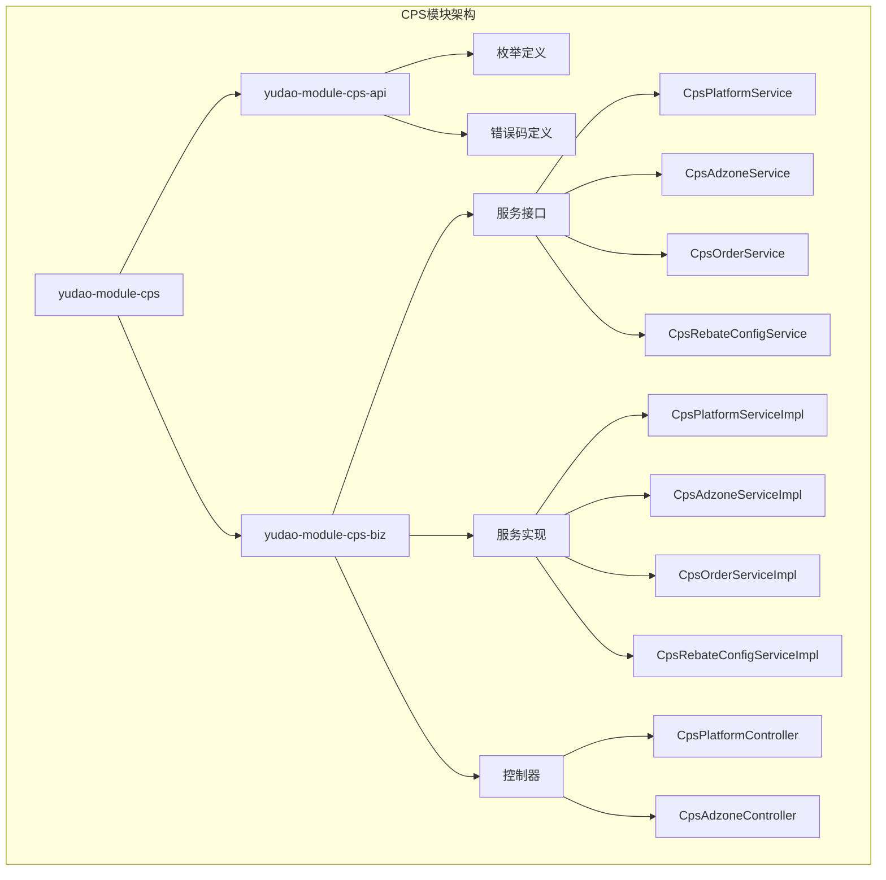
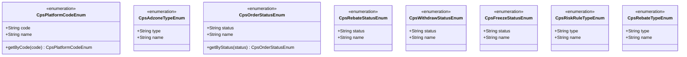
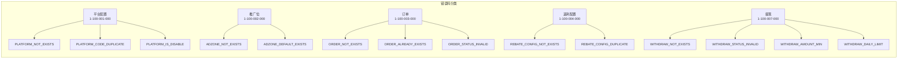
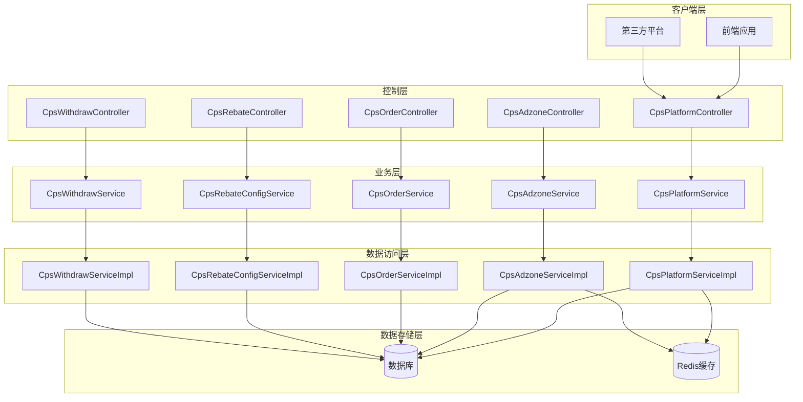
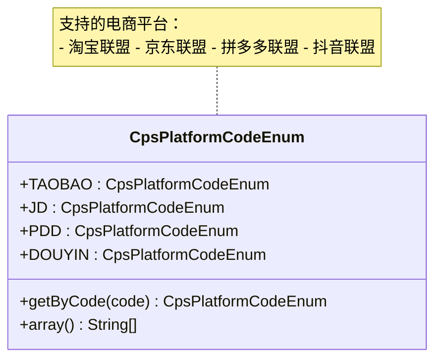
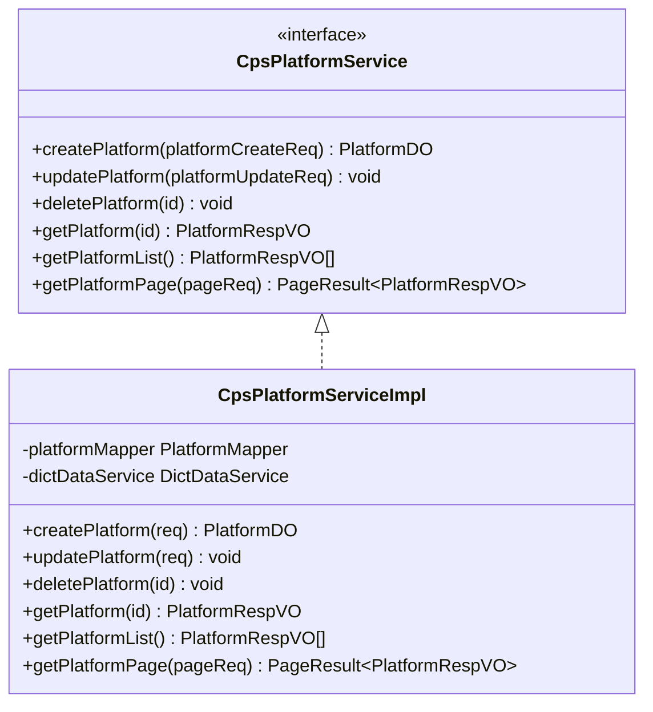
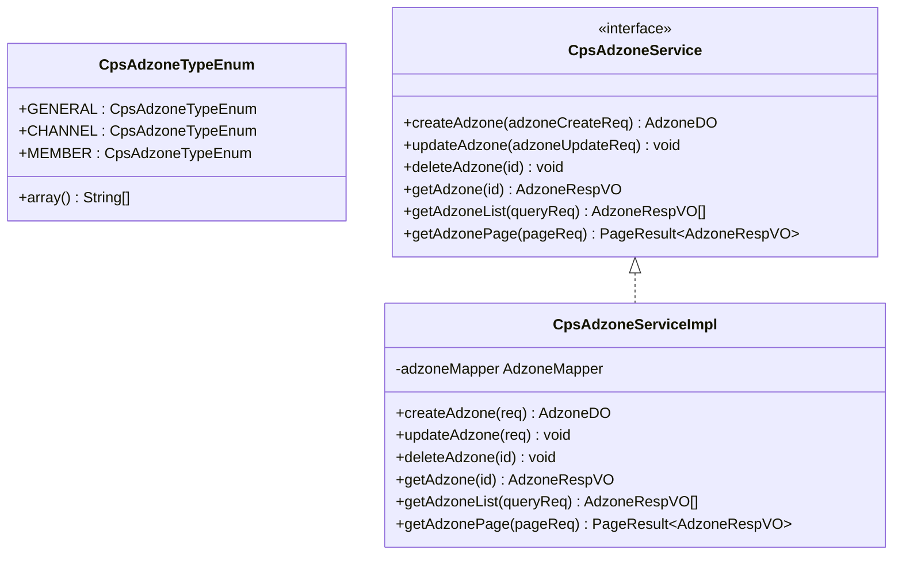
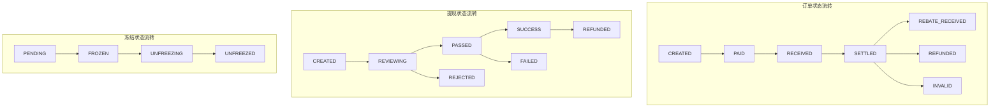
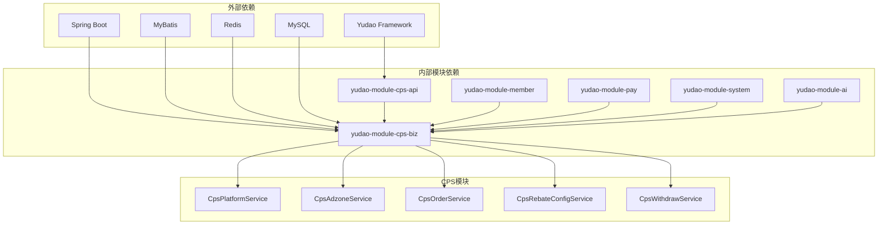
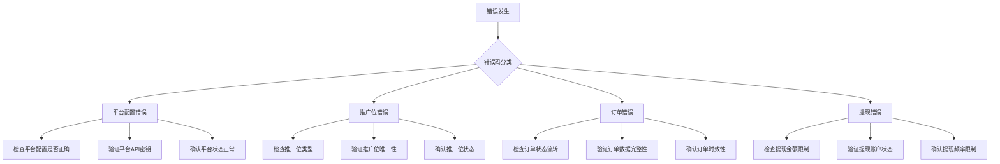

# CPS平台配置管理模块

<cite>
**本文档引用的文件**
- [CpsAdzoneTypeEnum.java](file://backend/yudao-module-cps/yudao-module-cps-api/src/main/java/cn/iocoder/yudao/module/cps/enums/CpsAdzoneTypeEnum.java)
- [CpsErrorCodeConstants.java](file://backend/yudao-module-cps/yudao-module-cps-api/src/main/java/cn/iocoder/yudao/module/cps/enums/CpsErrorCodeConstants.java)
- [CpsFreezeStatusEnum.java](file://backend/yudao-module-cps/yudao-module-cps-api/src/main/java/cn/iocoder/yudao/module/cps/enums/CpsFreezeStatusEnum.java)
- [CpsOrderStatusEnum.java](file://backend/yudao-module-cps/yudao-module-cps-api/src/main/java/cn/iocoder/yudao/module/cps/enums/CpsOrderStatusEnum.java)
- [CpsPlatformCodeEnum.java](file://backend/yudao-module-cps/yudao-module-cps-api/src/main/java/cn/iocoder/yudao/module/cps/enums/CpsPlatformCodeEnum.java)
- [CpsRebateStatusEnum.java](file://backend/yudao-module-cps/yudao-module-cps-api/src/main/java/cn/iocoder/yudao/module/cps/enums/CpsRebateStatusEnum.java)
- [CpsRebateTypeEnum.java](file://backend/yudao-module-cps/yudao-module-cps-api/src/main/java/cn/iocoder/yudao/module/cps/enums/CpsRebateTypeEnum.java)
- [CpsRiskRuleTypeEnum.java](file://backend/yudao-module-cps/yudao-module-cps-api/src/main/java/cn/iocoder/yudao/module/cps/enums/CpsRiskRuleTypeEnum.java)
- [CpsWithdrawStatusEnum.java](file://backend/yudao-module-cps/yudao-module-cps-api/src/main/java/cn/iocoder/yudao/module/cps/enums/CpsWithdrawStatusEnum.java)
- [yudao-module-cps/pom.xml](file://backend/yudao-module-cps/pom.xml)
- [yudao-module-cps-api/pom.xml](file://backend/yudao-module-cps/yudao-module-cps-api/pom.xml)
- [yudao-module-cps-biz/pom.xml](file://backend/yudao-module-cps/yudao-module-cps-biz/pom.xml)
- [CpsPlatformService.java](file://backend/yudao-module-cps/yudao-module-cps-biz/src/main/java/cn/iocoder/yudao/module/cps/service/platform/CpsPlatformService.java)
- [CpsPlatformServiceImpl.java](file://backend/yudao-module-cps/yudao-module-cps-biz/src/main/java/cn/iocoder/yudao/module/cps/service/platform/CpsPlatformServiceImpl.java)
- [CpsAdzoneService.java](file://backend/yudao-module-cps/yudao-module-cps-biz/src/main/java/cn/iocoder/yudao/module/cps/service/adzone/CpsAdzoneService.java)
- [CpsAdzoneServiceImpl.java](file://backend/yudao-module-cps/yudao-module-cps-biz/src/main/java/cn/iocoder/yudao/module/cps/service/adzone/CpsAdzoneServiceImpl.java)
- [CpsPlatformController.java](file://backend/yudao-module-cps/yudao-module-cps-biz/src/main/java/cn/iocoder/yudao/module/cps/controller/admin/platform/CpsPlatformController.java)
- [CpsAdzoneController.java](file://backend/yudao-module-cps/yudao-module-cps-biz/src/main/java/cn/iocoder/yudao/module/cps/controller/admin/adzone/CpsAdzoneController.java)
</cite>

## 目录
1. [简介](#简介)
2. [项目结构](#项目结构)
3. [核心组件](#核心组件)
4. [架构概览](#架构概览)
5. [详细组件分析](#详细组件分析)
6. [依赖关系分析](#依赖关系分析)
7. [性能考虑](#性能考虑)
8. [故障排除指南](#故障排除指南)
9. [结论](#结论)

## 简介

CPS平台配置管理模块是AgenticCPS系统中的核心业务模块，负责管理CPS联盟返利系统中的各种配置信息。该模块基于Yudao微服务框架构建，采用分层架构设计，包含API定义层、业务实现层和控制层。

本模块主要功能包括：
- 平台配置管理（支持淘宝、京东、拼多多、抖音等主流电商平台）
- 推广位配置管理（通用、渠道专属、用户专属三种类型）
- 订单状态管理
- 返利配置与状态管理
- 提现状态管理
- 冻结状态管理
- 风控规则管理

## 项目结构

CPS模块采用标准的Maven多模块架构，包含API定义模块和业务实现模块：

**图表来源**
- [yudao-module-cps/pom.xml:21-24](file://backend/yudao-module-cps/pom.xml#L21-L24)
- [yudao-module-cps-api/pom.xml:19-31](file://backend/yudao-module-cps/yudao-module-cps-api/pom.xml#L19-L31)
- [yudao-module-cps-biz/pom.xml:20-100](file://backend/yudao-module-cps/yudao-module-cps-biz/pom.xml#L20-L100)

**章节来源**
- [yudao-module-cps/pom.xml:17-20](file://backend/yudao-module-cps/pom.xml#L17-L20)
- [yudao-module-cps-api/pom.xml:14-17](file://backend/yudao-module-cps/yudao-module-cps-api/pom.xml#L14-L17)
- [yudao-module-cps-biz/pom.xml:14-18](file://backend/yudao-module-cps/yudao-module-cps-biz/pom.xml#L14-L18)

## 核心组件

### 枚举管理系统

CPS模块定义了完整的枚举体系，用于统一管理各种状态和类型：

**图表来源**
- [CpsPlatformCodeEnum.java:16-44](file://backend/yudao-module-cps/yudao-module-cps-api/src/main/java/cn/iocoder/yudao/module/cps/enums/CpsPlatformCodeEnum.java#L16-L44)
- [CpsAdzoneTypeEnum.java:16-40](file://backend/yudao-module-cps/yudao-module-cps-api/src/main/java/cn/iocoder/yudao/module/cps/enums/CpsAdzoneTypeEnum.java#L16-L40)
- [CpsOrderStatusEnum.java:16-48](file://backend/yudao-module-cps/yudao-module-cps-api/src/main/java/cn/iocoder/yudao/module/cps/enums/CpsOrderStatusEnum.java#L16-L48)

### 错误码管理体系

模块采用统一的错误码管理机制，按照功能模块进行分类：

**图表来源**
- [CpsErrorCodeConstants.java:12-64](file://backend/yudao-module-cps/yudao-module-cps-api/src/main/java/cn/iocoder/yudao/module/cps/enums/CpsErrorCodeConstants.java#L12-L64)

**章节来源**
- [CpsErrorCodeConstants.java:10-65](file://backend/yudao-module-cps/yudao-module-cps-api/src/main/java/cn/iocoder/yudao/module/cps/enums/CpsErrorCodeConstants.java#L10-L65)

## 架构概览

CPS模块采用经典的三层架构设计，结合微服务架构的最佳实践：

**图表来源**
- [CpsPlatformController.java](file://backend/yudao-module-cps/yudao-module-cps-biz/src/main/java/cn/iocoder/yudao/module/cps/controller/admin/platform/CpsPlatformController.java#L24)
- [CpsAdzoneController.java](file://backend/yudao-module-cps/yudao-module-cps-biz/src/main/java/cn/iocoder/yudao/module/cps/controller/admin/adzone/CpsAdzoneController.java#L24)
- [CpsPlatformService.java](file://backend/yudao-module-cps/yudao-module-cps-biz/src/main/java/cn/iocoder/yudao/module/cps/service/platform/CpsPlatformService.java#L15)
- [CpsAdzoneService.java](file://backend/yudao-module-cps/yudao-module-cps-biz/src/main/java/cn/iocoder/yudao/module/cps/service/adzone/CpsAdzoneService.java#L15)

## 详细组件分析

### 平台配置管理组件

平台配置管理是CPS系统的核心功能之一，负责管理与各电商平台的对接配置。

#### 平台枚举定义

**图表来源**
- [CpsPlatformCodeEnum.java:16-44](file://backend/yudao-module-cps/yudao-module-cps-api/src/main/java/cn/iocoder/yudao/module/cps/enums/CpsPlatformCodeEnum.java#L16-L44)

#### 平台服务接口

**图表来源**
- [CpsPlatformService.java](file://backend/yudao-module-cps/yudao-module-cps-biz/src/main/java/cn/iocoder/yudao/module/cps/service/platform/CpsPlatformService.java#L15)
- [CpsPlatformServiceImpl.java](file://backend/yudao-module-cps/yudao-module-cps-biz/src/main/java/cn/iocoder/yudao/module/cps/service/platform/CpsPlatformServiceImpl.java#L28)

### 推广位配置管理组件

推广位管理负责管理不同类型的推广链接配置，支持多种推广位类型。

#### 推广位枚举定义

**图表来源**
- [CpsAdzoneTypeEnum.java:16-40](file://backend/yudao-module-cps/yudao-module-cps-api/src/main/java/cn/iocoder/yudao/module/cps/enums/CpsAdzoneTypeEnum.java#L16-L40)
- [CpsAdzoneService.java](file://backend/yudao-module-cps/yudao-module-cps-biz/src/main/java/cn/iocoder/yudao/module/cps/service/adzone/CpsAdzoneService.java#L15)
- [CpsAdzoneServiceImpl.java](file://backend/yudao-module-cps/yudao-module-cps-biz/src/main/java/cn/iocoder/yudao/module/cps/service/adzone/CpsAdzoneServiceImpl.java#L24)

### 状态管理流程

CPS系统涉及多个业务状态的流转，以下是关键状态转换流程：

**图表来源**
- [CpsOrderStatusEnum.java:18-25](file://backend/yudao-module-cps/yudao-module-cps-api/src/main/java/cn/iocoder/yudao/module/cps/enums/CpsOrderStatusEnum.java#L18-L25)
- [CpsWithdrawStatusEnum.java:18-25](file://backend/yudao-module-cps/yudao-module-cps-api/src/main/java/cn/iocoder/yudao/module/cps/enums/CpsWithdrawStatusEnum.java#L18-L25)
- [CpsFreezeStatusEnum.java:18-22](file://backend/yudao-module-cps/yudao-module-cps-api/src/main/java/cn/iocoder/yudao/module/cps/enums/CpsFreezeStatusEnum.java#L18-L22)

**章节来源**
- [CpsPlatformServiceImpl.java:28-100](file://backend/yudao-module-cps/yudao-module-cps-biz/src/main/java/cn/iocoder/yudao/module/cps/service/platform/CpsPlatformServiceImpl.java#L28-L100)
- [CpsAdzoneServiceImpl.java:24-120](file://backend/yudao-module-cps/yudao-module-cps-biz/src/main/java/cn/iocoder/yudao/module/cps/service/adzone/CpsAdzoneServiceImpl.java#L24-L120)

## 依赖关系分析

CPS模块的依赖关系体现了清晰的分层架构和模块化设计：

**图表来源**
- [yudao-module-cps-biz/pom.xml:20-100](file://backend/yudao-module-cps/yudao-module-cps-biz/pom.xml#L20-L100)
- [yudao-module-cps-api/pom.xml:19-31](file://backend/yudao-module-cps/yudao-module-cps-api/pom.xml#L19-L31)

### 核心依赖说明

1. **框架依赖**：基于Yudao微服务框架，提供统一的开发规范和基础设施
2. **业务模块依赖**：
   - member模块：获取会员等级和用户信息
   - pay模块：复用钱包和转账功能
   - system模块：菜单权限、数据字典、操作日志
   - ai模块：Spring AI模型支持
3. **技术栈依赖**：
   - MyBatis：数据库持久化
   - Redis：缓存和会话管理
   - Spring Security：安全认证
   - Quartz：定时任务

**章节来源**
- [yudao-module-cps-biz/pom.xml:28-99](file://backend/yudao-module-cps/yudao-module-cps-biz/pom.xml#L28-L99)

## 性能考虑

### 缓存策略

CPS模块采用多层次缓存策略以提升性能：

1. **Redis缓存**：用于热点数据缓存，如平台配置、推广位配置
2. **数据库查询优化**：通过合理的索引设计和查询优化减少数据库压力
3. **批量操作**：支持批量配置更新和查询，减少网络往返

### 并发处理

1. **线程安全**：所有枚举类都是不可变的，天然线程安全
2. **事务管理**：关键业务操作使用事务保证数据一致性
3. **锁机制**：对于并发敏感的操作使用适当的锁机制

### 监控指标

1. **接口响应时间**：监控各个API的响应时间
2. **数据库连接池**：监控数据库连接使用情况
3. **缓存命中率**：监控Redis缓存的命中率

## 故障排除指南

### 常见错误码及解决方案

**图表来源**
- [CpsErrorCodeConstants.java:12-64](file://backend/yudao-module-cps/yudao-module-cps-api/src/main/java/cn/iocoder/yudao/module/cps/enums/CpsErrorCodeConstants.java#L12-L64)

### 调试建议

1. **日志分析**：启用详细的日志记录，便于问题定位
2. **数据库检查**：定期检查数据库连接和查询性能
3. **缓存监控**：监控Redis缓存的使用情况和性能
4. **接口测试**：使用Postman或类似的工具测试API接口

**章节来源**
- [CpsErrorCodeConstants.java:10-65](file://backend/yudao-module-cps/yudao-module-cps-api/src/main/java/cn/iocoder/yudao/module/cps/enums/CpsErrorCodeConstants.java#L10-L65)

## 结论

CPS平台配置管理模块是一个设计合理、架构清晰的微服务模块。通过采用枚举驱动的设计模式、统一的错误码管理和完善的依赖注入机制，该模块为CPS联盟返利系统提供了稳定可靠的基础支撑。

### 主要优势

1. **模块化设计**：清晰的分层架构和模块划分
2. **类型安全**：通过枚举确保数据类型的一致性和安全性
3. **扩展性强**：易于添加新的平台支持和功能特性
4. **维护性好**：统一的代码规范和错误处理机制

### 发展建议

1. **监控完善**：增加更详细的监控指标和告警机制
2. **文档补充**：完善API文档和开发指南
3. **测试覆盖**：提高单元测试和集成测试的覆盖率
4. **性能优化**：持续优化数据库查询和缓存策略

该模块为整个CPS系统的稳定运行奠定了坚实的基础，是值得推荐的优秀微服务实现案例。