# CPS平台配置管理模块

<cite>
**本文档引用的文件**
- [CpsAdzoneTypeEnum.java](file://backend/yudao-module-cps/yudao-module-cps-api/src/main/java/cn/iocoder/yudao/module/cps/enums/CpsAdzoneTypeEnum.java)
- [CpsErrorCodeConstants.java](file://backend/yudao-module-cps/yudao-module-cps-api/src/main/java/cn/iocoder/yudao/module/cps/enums/CpsErrorCodeConstants.java)
- [CpsFreezeStatusEnum.java](file://backend/yudao-module-cps/yudao-module-cps-api/src/main/java/cn/iocoder/yudao/module/cps/enums/CpsFreezeStatusEnum.java)
- [CpsOrderStatusEnum.java](file://backend/yudao-module-cps/yudao-module-cps-api/src/main/java/cn/iocoder/yudao/module/cps/enums/CpsOrderStatusEnum.java)
- [CpsPlatformCodeEnum.java](file://backend/yudao-module-cps/yudao-module-cps-api/src/main/java/cn/iocoder/yudao/module/cps/enums/CpsPlatformCodeEnum.java)
- [CpsRebateStatusEnum.java](file://backend/yudao-module-cps/yudao-module-cps-api/src/main/java/cn/iocoder/yudao/module/cps/enums/CpsRebateStatusEnum.java)
- [CpsRebateTypeEnum.java](file://backend/yudao-module-cps/yudao-module-cps-api/src/main/java/cn/iocoder/yudao/module/cps/enums/CpsRebateTypeEnum.java)
- [CpsRiskRuleTypeEnum.java](file://backend/yudao-module-cps/yudao-module-cps-api/src/main/java/cn/iocoder/yudao/module/cps/enums/CpsRiskRuleTypeEnum.java)
- [CpsWithdrawStatusEnum.java](file://backend/yudao-module-cps/yudao-module-cps-api/src/main/java/cn/iocoder/yudao/module/cps/enums/CpsWithdrawStatusEnum.java)
- [CpsVendorCodeEnum.java](file://backend/yudao-module-cps/yudao-module-cps-api/src/main/java/cn/iocoder/yudao/module/cps/enums/CpsVendorCodeEnum.java)
- [yudao-module-cps/pom.xml](file://backend/yudao-module-cps/pom.xml)
- [yudao-module-cps-api/pom.xml](file://backend/yudao-module-cps/yudao-module-cps-api/pom.xml)
- [yudao-module-cps-biz/pom.xml](file://backend/yudao-module-cps/yudao-module-cps-biz/pom.xml)
- [CpsPlatformService.java](file://backend/yudao-module-cps/yudao-module-cps-biz/src/main/java/cn/iocoder/yudao/module/cps/service/platform/CpsPlatformService.java)
- [CpsPlatformServiceImpl.java](file://backend/yudao-module-cps/yudao-module-cps-biz/src/main/java/cn/iocoder/yudao/module/cps/service/platform/CpsPlatformServiceImpl.java)
- [CpsAdzoneService.java](file://backend/yudao-module-cps/yudao-module-cps-biz/src/main/java/cn/iocoder/yudao/module/cps/service/adzone/CpsAdzoneService.java)
- [CpsAdzoneServiceImpl.java](file://backend/yudao-module-cps/yudao-module-cps-biz/src/main/java/cn/iocoder/yudao/module/cps/service/adzone/CpsAdzoneServiceImpl.java)
- [CpsPlatformController.java](file://backend/yudao-module-cps/yudao-module-cps-biz/src/main/java/cn/iocoder/yudao/module/cps/controller/admin/platform/CpsPlatformController.java)
- [CpsAdzoneController.java](file://backend/yudao-module-cps/yudao-module-cps-biz/src/main/java/cn/iocoder/yudao/module/cps/controller/admin/adzone/CpsAdzoneController.java)
- [CpsPlatformClientFactory.java](file://backend/yudao-module-cps/yudao-module-cps-biz/src/main/java/cn/iocoder/yudao/module/cps/client/CpsPlatformClientFactory.java)
- [CpsPlatformDO.java](file://backend/yudao-module-cps/yudao-module-cps-biz/src/main/java/cn/iocoder/yudao/module/cps/dal/dataobject/platform/CpsPlatformDO.java)
- [CpsApiVendorDO.java](file://backend/yudao-module-cps/yudao-module-cps-biz/src/main/java/cn/iocoder/yudao/module/cps/dal/dataobject/vendor/CpsApiVendorDO.java)
- [CpsApiVendorService.java](file://backend/yudao-module-cps/yudao-module-cps-biz/src/main/java/cn/iocoder/yudao/module/cps/service/vendor/CpsApiVendorService.java)
</cite>

## 更新摘要
**所做更改**
- 新增多供应商配置管理章节，详细介绍供应商维度的配置管理
- 更新平台配置管理章节，反映activeVendorCode和supportedVendors字段的引入
- 新增供应商客户端工厂章节，说明双维度路由机制
- 更新架构概览图，展示多供应商架构
- 新增供应商配置数据模型说明
- 更新故障排除指南，包含供应商相关问题

## 目录
1. [简介](#简介)
2. [项目结构](#项目结构)
3. [核心组件](#核心组件)
4. [架构概览](#架构概览)
5. [详细组件分析](#详细组件分析)
6. [多供应商配置管理](#多供应商配置管理)
7. [供应商客户端工厂](#供应商客户端工厂)
8. [依赖关系分析](#依赖关系分析)
9. [性能考虑](#性能考虑)
10. [故障排除指南](#故障排除指南)
11. [结论](#结论)

## 简介

CPS平台配置管理模块是AgenticCPS系统中的核心业务模块，负责管理CPS联盟返利系统中的各种配置信息。该模块基于Yudao微服务框架构建，采用分层架构设计，包含API定义层、业务实现层和控制层。

**更新** 本模块现已扩展为支持多供应商配置管理，允许同一电商平台对接多个API供应商，实现运行时供应商切换和灵活的配置管理。

主要功能包括：
- 平台配置管理（支持淘宝、京东、拼多多、抖音等主流电商平台）
- 多供应商配置管理（支持聚合平台和官方API）
- 推广位配置管理（通用、渠道专属、用户专属三种类型）
- 订单状态管理
- 返利配置与状态管理
- 提现状态管理
- 冻结状态管理
- 风控规则管理

## 项目结构

CPS模块采用标准的Maven多模块架构，包含API定义模块、业务实现模块和供应商管理模块：

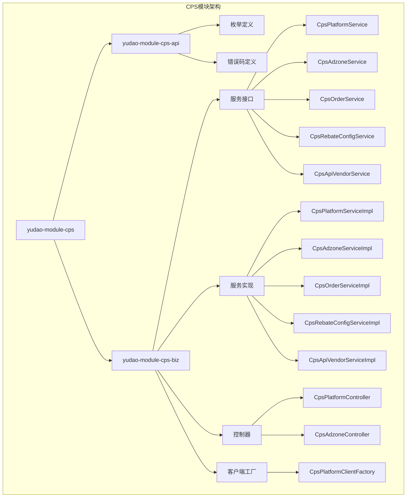

**图表来源**
- [yudao-module-cps/pom.xml:21-24](file://backend/yudao-module-cps/pom.xml#L21-L24)
- [yudao-module-cps-api/pom.xml:19-31](file://backend/yudao-module-cps/yudao-module-cps-api/pom.xml#L19-L31)
- [yudao-module-cps-biz/pom.xml:20-100](file://backend/yudao-module-cps/yudao-module-cps-biz/pom.xml#L20-L100)

**章节来源**
- [yudao-module-cps/pom.xml:17-20](file://backend/yudao-module-cps/pom.xml#L17-L20)
- [yudao-module-cps-api/pom.xml:14-17](file://backend/yudao-module-cps/yudao-module-cps-api/pom.xml#L14-L17)
- [yudao-module-cps-biz/pom.xml:14-18](file://backend/yudao-module-cps/yudao-module-cps-biz/pom.xml#L14-L18)

## 核心组件

### 枚举管理系统

CPS模块定义了完整的枚举体系，用于统一管理各种状态和类型：

```mermaid
classDiagram
class CpsPlatformCodeEnum {
<<enumeration>>
+String code
+String name
+getByCode(code) CpsPlatformCodeEnum
}
class CpsAdzoneTypeEnum {
<<enumeration>>
+String type
+String name
}
class CpsOrderStatusEnum {
<<enumeration>>
+String status
+String name
+getByStatus(status) CpsOrderStatusEnum
}
class CpsRebateStatusEnum {
<<enumeration>>
+String status
+String name
}
class CpsWithdrawStatusEnum {
<<enumeration>>
+String status
+String name
}
class CpsFreezeStatusEnum {
<<enumeration>>
+String status
+String name
}
class CpsRiskRuleTypeEnum {
<<enumeration>>
+String type
+String name
}
class CpsRebateTypeEnum {
<<enumeration>>
+String type
+String name
}
class CpsVendorCodeEnum {
<<enumeration>>
+String code
+String name
+String type
+getByCode(code) CpsVendorCodeEnum
}
```

**图表来源**
- [CpsPlatformCodeEnum.java:16-44](file://backend/yudao-module-cps/yudao-module-cps-api/src/main/java/cn/iocoder/yudao/module/cps/enums/CpsPlatformCodeEnum.java#L16-L44)
- [CpsAdzoneTypeEnum.java:16-40](file://backend/yudao-module-cps/yudao-module-cps-api/src/main/java/cn/iocoder/yudao/module/cps/enums/CpsAdzoneTypeEnum.java#L16-L40)
- [CpsOrderStatusEnum.java:16-48](file://backend/yudao-module-cps/yudao-module-cps-api/src/main/java/cn/iocoder/yudao/module/cps/enums/CpsOrderStatusEnum.java#L16-L48)
- [CpsVendorCodeEnum.java:18-51](file://backend/yudao-module-cps/yudao-module-cps-api/src/main/java/cn/iocoder/yudao/module/cps/enums/CpsVendorCodeEnum.java#L18-51)

### 错误码管理体系

模块采用统一的错误码管理机制，按照功能模块进行分类：

```mermaid
graph LR
subgraph "错误码分类"
A[平台配置<br/>1-100-001-000] --> A1[PLATFORM_NOT_EXISTS]
A --> A2[PLATFORM_CODE_DUPLICATE]
A --> A3[PLATFORM_IS_DISABLE]
B[推广位<br/>1-100-002-000] --> B1[ADZONE_NOT_EXISTS]
B --> B2[ADZONE_DEFAULT_EXISTS]
C[订单<br/>1-100-003-000] --> C1[ORDER_NOT_EXISTS]
C --> C2[ORDER_ALREADY_EXISTS]
C --> C3[ORDER_STATUS_INVALID]
D[返利配置<br/>1-100-004-000] --> D1[REBATE_CONFIG_NOT_EXISTS]
D --> D2[REBATE_CONFIG_DUPLICATE]
E[供应商配置<br/>1-100-005-000] --> E1[VENDOR_NOT_EXISTS]
E --> E2[VENDOR_DUPLICATE]
E --> E3[VENDOR_NOT_SUPPORTED]
F[提现<br/>1-100-007-000] --> F1[WITHDRAW_NOT_EXISTS]
F --> F2[WITHDRAW_STATUS_INVALID]
F --> F3[WITHDRAW_AMOUNT_MIN]
F --> F4[WITHDRAW_DAILY_LIMIT]
end
```

**图表来源**
- [CpsErrorCodeConstants.java:12-64](file://backend/yudao-module-cps/yudao-module-cps-api/src/main/java/cn/iocoder/yudao/module/cps/enums/CpsErrorCodeConstants.java#L12-L64)

**章节来源**
- [CpsErrorCodeConstants.java:10-65](file://backend/yudao-module-cps/yudao-module-cps-api/src/main/java/cn/iocoder/yudao/module/cps/enums/CpsErrorCodeConstants.java#L10-L65)

## 架构概览

CPS模块采用经典的三层架构设计，结合微服务架构的最佳实践，并新增多供应商支持：

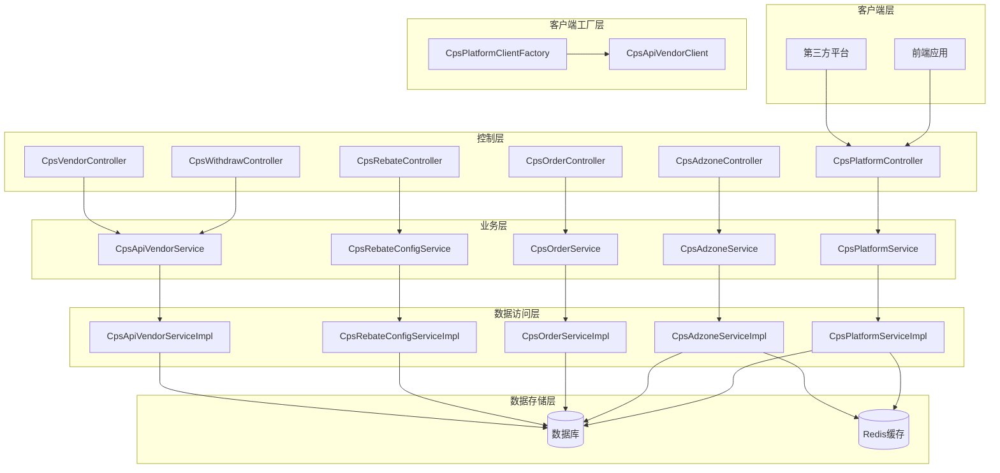

**图表来源**
- [CpsPlatformController.java](file://backend/yudao-module-cps/yudao-module-cps-biz/src/main/java/cn/iocoder/yudao/module/cps/controller/admin/platform/CpsPlatformController.java#L24)
- [CpsAdzoneController.java](file://backend/yudao-module-cps/yudao-module-cps-biz/src/main/java/cn/iocoder/yudao/module/cps/controller/admin/adzone/CpsAdzoneController.java#L24)
- [CpsPlatformService.java](file://backend/yudao-module-cps/yudao-module-cps-biz/src/main/java/cn/iocoder/yudao/module/cps/service/platform/CpsPlatformService.java#L15)
- [CpsAdzoneService.java](file://backend/yudao-module-cps/yudao-module-cps-biz/src/main/java/cn/iocoder/yudao/module/cps/service/adzone/CpsAdzoneService.java#L15)
- [CpsPlatformClientFactory.java](file://backend/yudao-module-cps/yudao-module-cps-biz/src/main/java/cn/iocoder/yudao/module/cps/client/CpsPlatformClientFactory.java#L28)

## 详细组件分析

### 平台配置管理组件

平台配置管理是CPS系统的核心功能之一，负责管理与各电商平台的对接配置。

#### 平台枚举定义

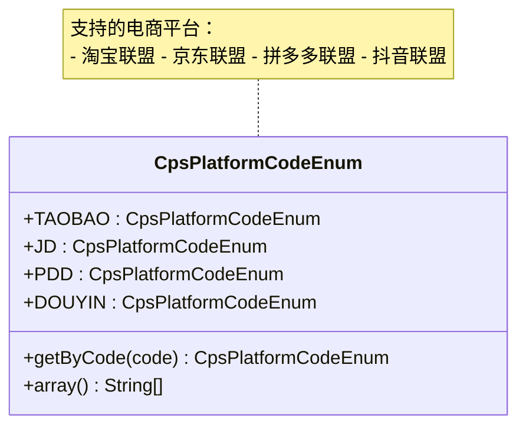

**图表来源**
- [CpsPlatformCodeEnum.java:16-44](file://backend/yudao-module-cps/yudao-module-cps-api/src/main/java/cn/iocoder/yudao/module/cps/enums/CpsPlatformCodeEnum.java#L16-L44)

#### 平台服务接口

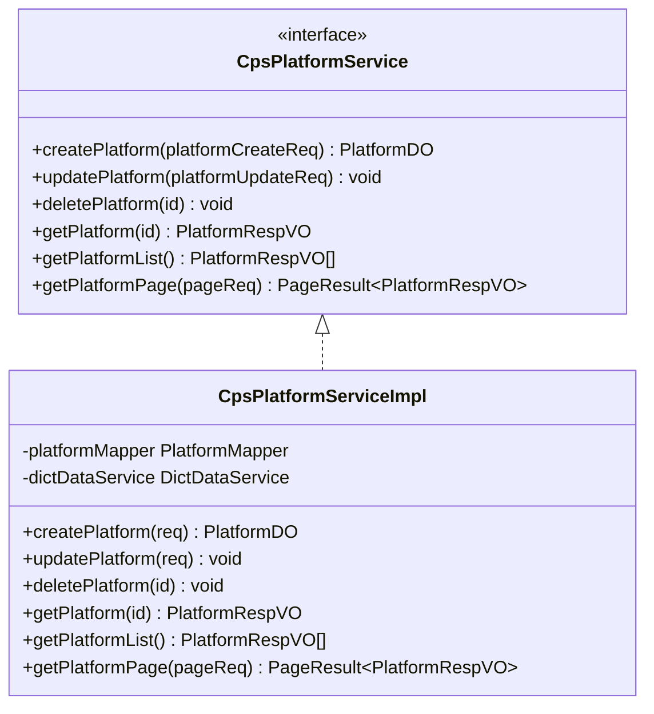

**图表来源**
- [CpsPlatformService.java](file://backend/yudao-module-cps/yudao-module-cps-biz/src/main/java/cn/iocoder/yudao/module/cps/service/platform/CpsPlatformService.java#L15)
- [CpsPlatformServiceImpl.java](file://backend/yudao-module-cps/yudao-module-cps-biz/src/main/java/cn/iocoder/yudao/module/cps/service/platform/CpsPlatformServiceImpl.java#L28)

### 推广位配置管理组件

推广位管理负责管理不同类型的推广链接配置，支持多种推广位类型。

#### 推广位枚举定义

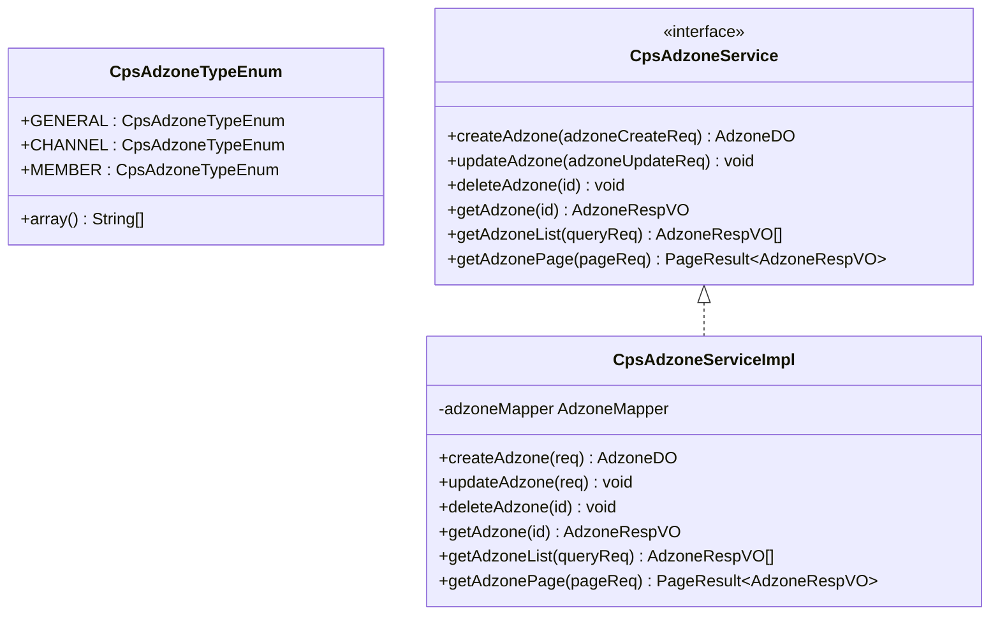

**图表来源**
- [CpsAdzoneTypeEnum.java:16-40](file://backend/yudao-module-cps/yudao-module-cps-api/src/main/java/cn/iocoder/yudao/module/cps/enums/CpsAdzoneTypeEnum.java#L16-40)
- [CpsAdzoneService.java](file://backend/yudao-module-cps/yudao-module-cps-biz/src/main/java/cn/iocoder/yudao/module/cps/service/adzone/CpsAdzoneService.java#L15)
- [CpsAdzoneServiceImpl.java](file://backend/yudao-module-cps/yudao-module-cps-biz/src/main/java/cn/iocoder/yudao/module/cps/service/adzone/CpsAdzoneServiceImpl.java#L24)

### 状态管理流程

CPS系统涉及多个业务状态的流转，以下是关键状态转换流程：

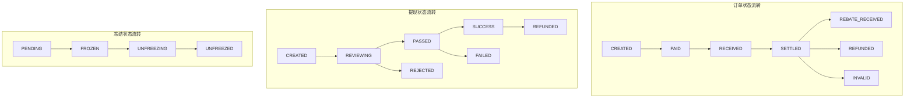

**图表来源**
- [CpsOrderStatusEnum.java:18-25](file://backend/yudao-module-cps/yudao-module-cps-api/src/main/java/cn/iocoder/yudao/module/cps/enums/CpsOrderStatusEnum.java#L18-L25)
- [CpsWithdrawStatusEnum.java:18-25](file://backend/yudao-module-cps/yudao-module-cps-api/src/main/java/cn/iocoder/yudao/module/cps/enums/CpsWithdrawStatusEnum.java#L18-L25)
- [CpsFreezeStatusEnum.java:18-22](file://backend/yudao-module-cps/yudao-module-cps-api/src/main/java/cn/iocoder/yudao/module/cps/enums/CpsFreezeStatusEnum.java#L18-L22)

**章节来源**
- [CpsPlatformServiceImpl.java:28-100](file://backend/yudao-module-cps/yudao-module-cps-biz/src/main/java/cn/iocoder/yudao/module/cps/service/platform/CpsPlatformServiceImpl.java#L28-L100)
- [CpsAdzoneServiceImpl.java:24-120](file://backend/yudao-module-cps/yudao-module-cps-biz/src/main/java/cn/iocoder/yudao/module/cps/service/adzone/CpsAdzoneServiceImpl.java#L24-L120)

## 多供应商配置管理

**新增** CPS平台配置管理模块现已支持多供应商配置管理，允许同一电商平台对接多个API供应商。

### 供应商配置数据模型

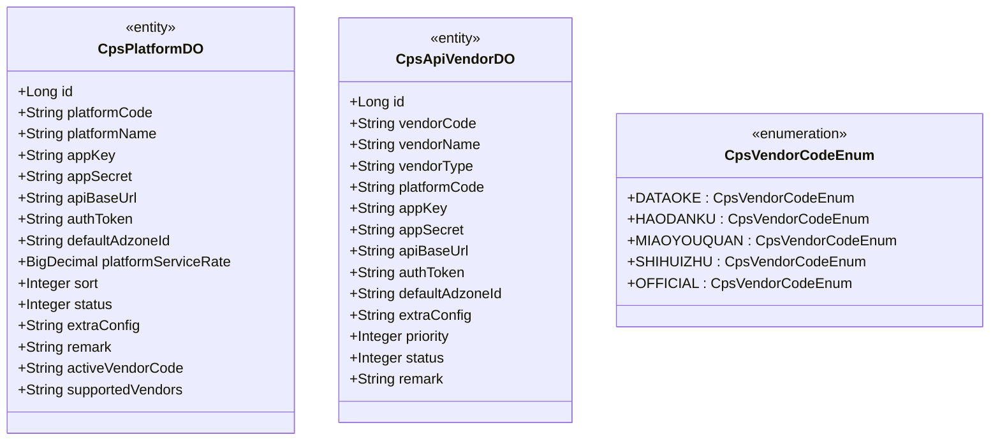

**图表来源**
- [CpsPlatformDO.java:25-95](file://backend/yudao-module-cps/yudao-module-cps-biz/src/main/java/cn/iocoder/yudao/module/cps/dal/dataobject/platform/CpsPlatformDO.java#L25-L95)
- [CpsApiVendorDO.java:23-85](file://backend/yudao-module-cps/yudao-module-cps-biz/src/main/java/cn/iocoder/yudao/module/cps/dal/dataobject/vendor/CpsApiVendorDO.java#L23-L85)
- [CpsVendorCodeEnum.java:18-51](file://backend/yudao-module-cps/yudao-module-cps-api/src/main/java/cn/iocoder/yudao/module/cps/enums/CpsVendorCodeEnum.java#L18-51)

### 供应商配置管理流程

```mermaid
flowchart TD
subgraph "供应商配置管理流程"
A[创建供应商配置] --> B[验证供应商唯一性]
B --> C[插入数据库记录]
C --> D[更新平台支持的供应商列表]
D --> E[缓存供应商配置]
E --> F[返回配置结果]
end
subgraph "供应商切换流程"
G[获取平台配置] --> H{检查activeVendorCode}
H --> |存在| I[使用指定供应商]
H --> |不存在| J[使用默认供应商(dataoke)]
I --> K[返回供应商客户端]
J --> K
end
```

**图表来源**
- [CpsApiVendorService.java:17-69](file://backend/yudao-module-cps/yudao-module-cps-biz/src/main/java/cn/iocoder/yudao/module/cps/service/vendor/CpsApiVendorService.java#L17-L69)
- [CpsPlatformClientFactory.java:160-189](file://backend/yudao-module-cps/yudao-module-cps-biz/src/main/java/cn/iocoder/yudao/module/cps/client/CpsPlatformClientFactory.java#L160-L189)

### 支持的供应商类型

CPS系统支持以下供应商类型：

1. **聚合平台供应商**：
   - 大淘客(Dataoke)：支持商品搜索、优惠券查询等功能
   - 好单库(Haodanku)：提供商品推荐和营销工具
   - 喵有券(Miaoyouquan)：专注于优惠券聚合
   - 实惠猪(Shihuizhu)：提供价格对比和优惠信息

2. **官方API供应商**：
   - 官方API(Official)：直接对接平台官方API，数据最准确但可能有限制

**章节来源**
- [CpsVendorCodeEnum.java:18-51](file://backend/yudao-module-cps/yudao-module-cps-api/src/main/java/cn/iocoder/yudao/module/cps/enums/CpsVendorCodeEnum.java#L18-51)
- [CpsApiVendorDO.java:30-45](file://backend/yudao-module-cps/yudao-module-cps-biz/src/main/java/cn/iocoder/yudao/module/cps/dal/dataobject/vendor/CpsApiVendorDO.java#L30-L45)

## 供应商客户端工厂

**新增** 供应商客户端工厂是多供应商配置管理的核心组件，负责管理供应商客户端的注册和路由。

### 工厂设计模式

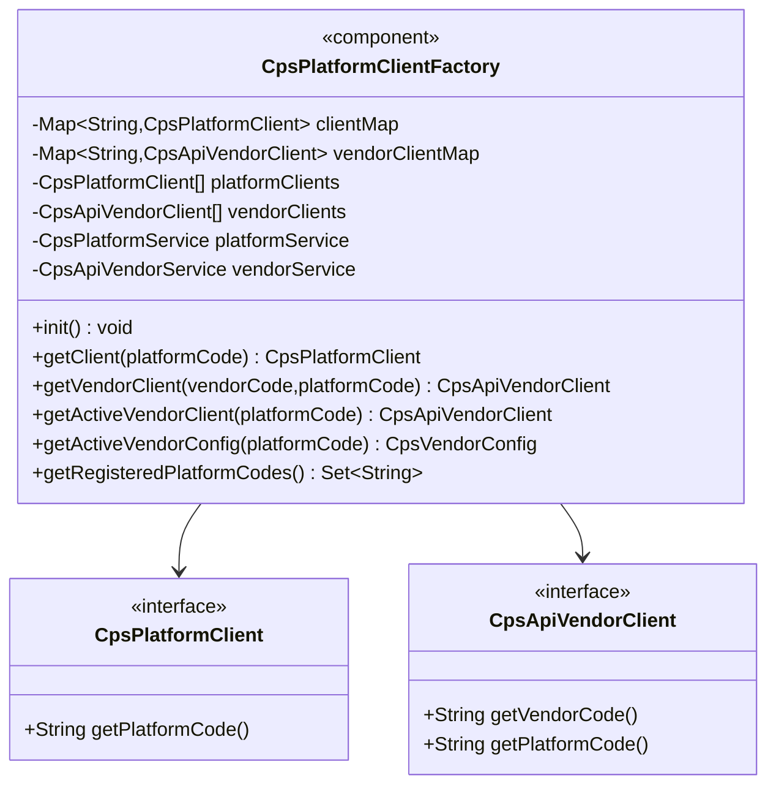

**图表来源**
- [CpsPlatformClientFactory.java:30-197](file://backend/yudao-module-cps/yudao-module-cps-biz/src/main/java/cn/iocoder/yudao/module/cps/client/CpsPlatformClientFactory.java#L30-L197)

### 双维度路由机制

供应商客户端工厂实现了双维度路由机制：

1. **平台维度路由**：通过平台编码获取平台客户端适配器
2. **供应商维度路由**：通过供应商编码和平台编码获取供应商客户端

```mermaid
flowchart LR
subgraph "双维度路由机制"
A[业务请求] --> B{路由类型}
B --> |平台维度| C[getClient(platformCode)]
B --> |供应商维度| D[getActiveVendorClient(platformCode)]
C --> E[平台客户端适配器]
D --> F[供应商客户端适配器]
E --> G[执行平台特定逻辑]
F --> H[执行供应商特定逻辑]
end
```

**图表来源**
- [CpsPlatformClientFactory.java:84-132](file://backend/yudao-module-cps/yudao-module-cps-biz/src/main/java/cn/iocoder/yudao/module/cps/client/CpsPlatformClientFactory.java#L84-L132)
- [CpsPlatformClientFactory.java:137-189](file://backend/yudao-module-cps/yudao-module-cps-biz/src/main/java/cn/iocoder/yudao/module/cps/client/CpsPlatformClientFactory.java#L137-L189)

### 运行时供应商切换

供应商客户端工厂支持运行时供应商切换：

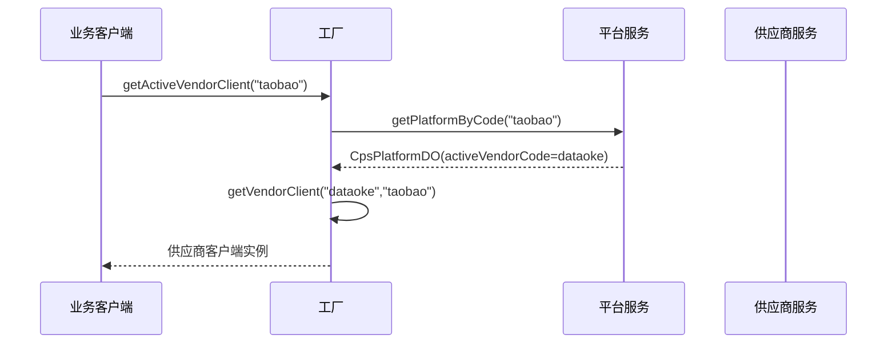

**图表来源**
- [CpsPlatformClientFactory.java:160-171](file://backend/yudao-module-cps/yudao-module-cps-biz/src/main/java/cn/iocoder/yudao/module/cps/client/CpsPlatformClientFactory.java#L160-L171)

**章节来源**
- [CpsPlatformClientFactory.java:30-197](file://backend/yudao-module-cps/yudao-module-cps-biz/src/main/java/cn/iocoder/yudao/module/cps/client/CpsPlatformClientFactory.java#L30-L197)

## 依赖关系分析

CPS模块的依赖关系体现了清晰的分层架构和模块化设计，并新增供应商管理依赖：

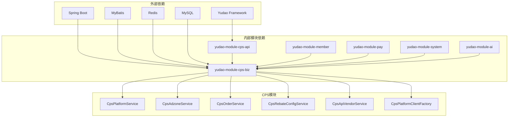

**图表来源**
- [yudao-module-cps-biz/pom.xml:20-100](file://backend/yudao-module-cps/yudao-module-cps-biz/pom.xml#L20-L100)
- [yudao-module-cps-api/pom.xml:19-31](file://backend/yudao-module-cps/yudao-module-cps-api/pom.xml#L19-L31)

### 核心依赖说明

1. **框架依赖**：基于Yudao微服务框架，提供统一的开发规范和基础设施
2. **业务模块依赖**：
   - member模块：获取会员等级和用户信息
   - pay模块：复用钱包和转账功能
   - system模块：菜单权限、数据字典、操作日志
   - ai模块：Spring AI模型支持
3. **技术栈依赖**：
   - MyBatis：数据库持久化
   - Redis：缓存和会话管理
   - Spring Security：安全认证
   - Quartz：定时任务

**章节来源**
- [yudao-module-cps-biz/pom.xml:28-99](file://backend/yudao-module-cps/yudao-module-cps-biz/pom.xml#L28-L99)

## 性能考虑

### 缓存策略

CPS模块采用多层次缓存策略以提升性能：

1. **Redis缓存**：用于热点数据缓存，如平台配置、推广位配置、供应商配置
2. **数据库查询优化**：通过合理的索引设计和查询优化减少数据库压力
3. **批量操作**：支持批量配置更新和查询，减少网络往返
4. **客户端缓存**：供应商客户端工厂缓存已注册的客户端实例

### 并发处理

1. **线程安全**：所有枚举类都是不可变的，天然线程安全
2. **事务管理**：关键业务操作使用事务保证数据一致性
3. **锁机制**：对于并发敏感的操作使用适当的锁机制
4. **并发容器**：使用ConcurrentHashMap确保线程安全

### 监控指标

1. **接口响应时间**：监控各个API的响应时间
2. **数据库连接池**：监控数据库连接使用情况
3. **缓存命中率**：监控Redis缓存的命中率
4. **供应商切换统计**：监控不同供应商的使用情况

## 故障排除指南

### 常见错误码及解决方案

```mermaid
flowchart TD
A[错误发生] --> B{错误码分类}
B --> C[平台配置错误]
B --> D[推广位错误]
B --> E[订单错误]
B --> F[提现错误]
B --> G[供应商配置错误]
C --> C1[检查平台配置是否正确]
C --> C2[验证平台API密钥]
C --> C3[确认平台状态正常]
D --> D1[检查推广位类型]
D --> D2[验证推广位唯一性]
D --> D3[确认推广位状态]
E --> E1[检查订单状态流转]
E --> E2[验证订单数据完整性]
E --> E3[确认订单时效性]
F --> F1[检查提现金额限制]
F --> F2[验证提现账户状态]
F --> F3[确认提现频率限制]
G --> G1[检查供应商配置是否存在]
G --> G2[验证供应商与平台的关联]
G --> G3[确认供应商状态正常]
G --> G4[检查供应商切换配置]
end
```

**图表来源**
- [CpsErrorCodeConstants.java:12-64](file://backend/yudao-module-cps/yudao-module-cps-api/src/main/java/cn/iocoder/yudao/module/cps/enums/CpsErrorCodeConstants.java#L12-L64)

### 供应商相关故障排除

**新增** 多供应商配置相关的常见问题和解决方案：

1. **供应商客户端未找到**：
   - 检查供应商是否正确注册到工厂
   - 验证供应商编码和平台编码的组合是否正确
   - 确认供应商客户端的自动注入是否成功

2. **供应商切换失败**：
   - 检查平台配置中的activeVendorCode字段
   - 验证供应商配置是否已启用
   - 确认供应商客户端工厂的初始化是否完成

3. **供应商配置冲突**：
   - 检查supportedVendors字段中是否包含重复的供应商
   - 验证供应商优先级设置
   - 确认供应商配置的唯一性约束

### 调试建议

1. **日志分析**：启用详细的日志记录，便于问题定位
2. **数据库检查**：定期检查数据库连接和查询性能
3. **缓存监控**：监控Redis缓存的使用情况和性能
4. **接口测试**：使用Postman或类似的工具测试API接口
5. **供应商测试**：单独测试每个供应商的API调用

**章节来源**
- [CpsErrorCodeConstants.java:10-65](file://backend/yudao-module-cps/yudao-module-cps-api/src/main/java/cn/iocoder/yudao/module/cps/enums/CpsErrorCodeConstants.java#L10-L65)
- [CpsPlatformClientFactory.java:160-189](file://backend/yudao-module-cps/yudao-module-cps-biz/src/main/java/cn/iocoder/yudao/module/cps/client/CpsPlatformClientFactory.java#L160-L189)

## 结论

CPS平台配置管理模块经过多供应商配置扩展后，已成为一个功能完整、架构清晰的微服务模块。通过采用枚举驱动的设计模式、统一的错误码管理、完善的依赖注入机制和新增的多供应商支持，该模块为CPS联盟返利系统提供了更加灵活和强大的基础支撑。

### 主要优势

1. **模块化设计**：清晰的分层架构和模块划分
2. **类型安全**：通过枚举确保数据类型的一致性和安全性
3. **扩展性强**：支持多供应商配置，易于添加新的供应商支持
4. **运行时切换**：支持供应商的动态切换和配置管理
5. **维护性好**：统一的代码规范和错误处理机制
6. **性能优化**：多级缓存和并发安全设计

### 发展建议

1. **监控完善**：增加更详细的监控指标和告警机制，特别是供应商使用情况
2. **文档补充**：完善多供应商配置的API文档和开发指南
3. **测试覆盖**：提高多供应商场景下的单元测试和集成测试覆盖率
4. **性能优化**：持续优化数据库查询、缓存策略和供应商客户端工厂的性能
5. **供应商管理**：提供更友好的供应商配置管理界面和工具

该模块为整个CPS系统的稳定运行和未来发展奠定了坚实的基础，是值得推荐的优秀微服务实现案例。