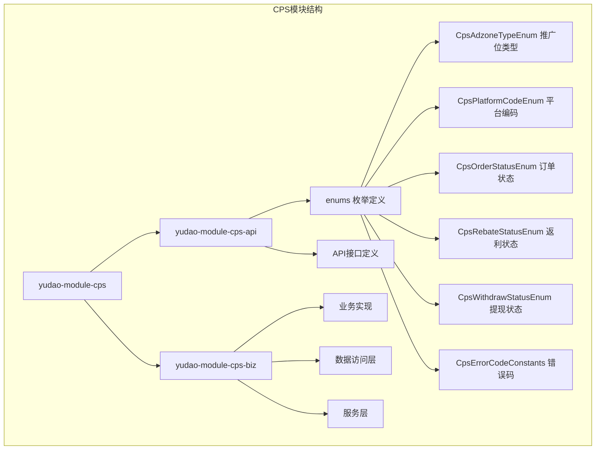
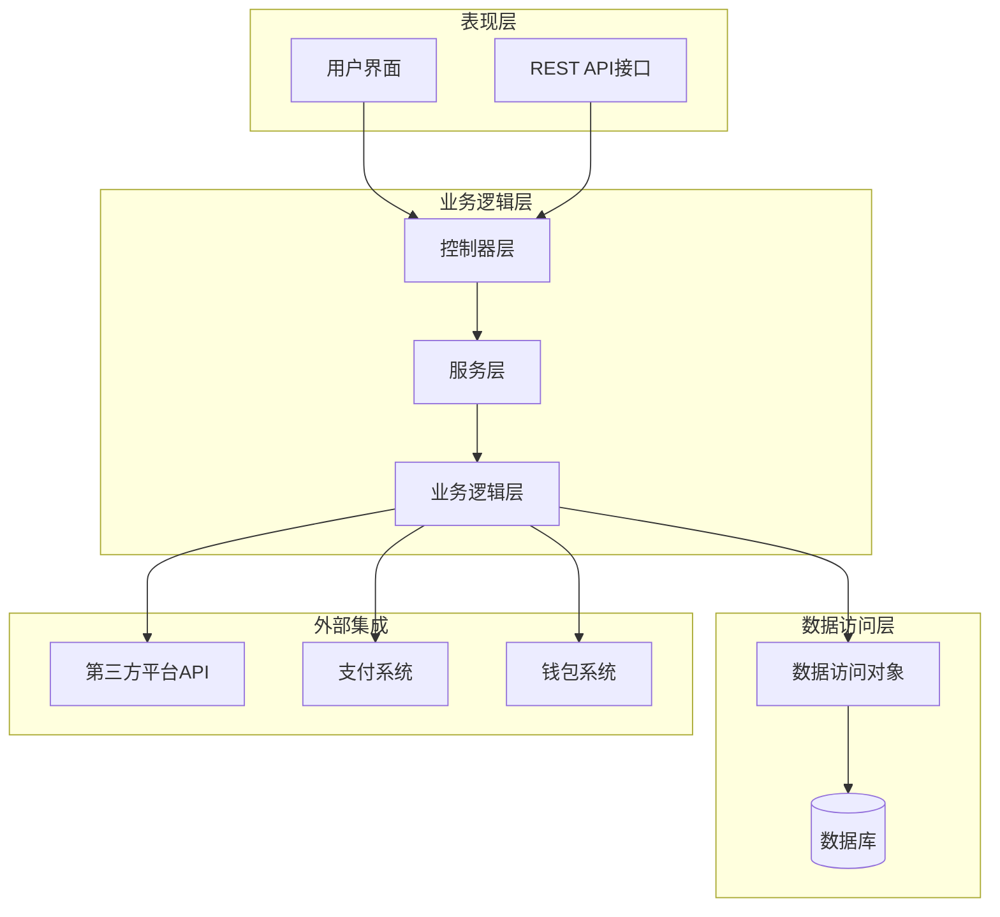
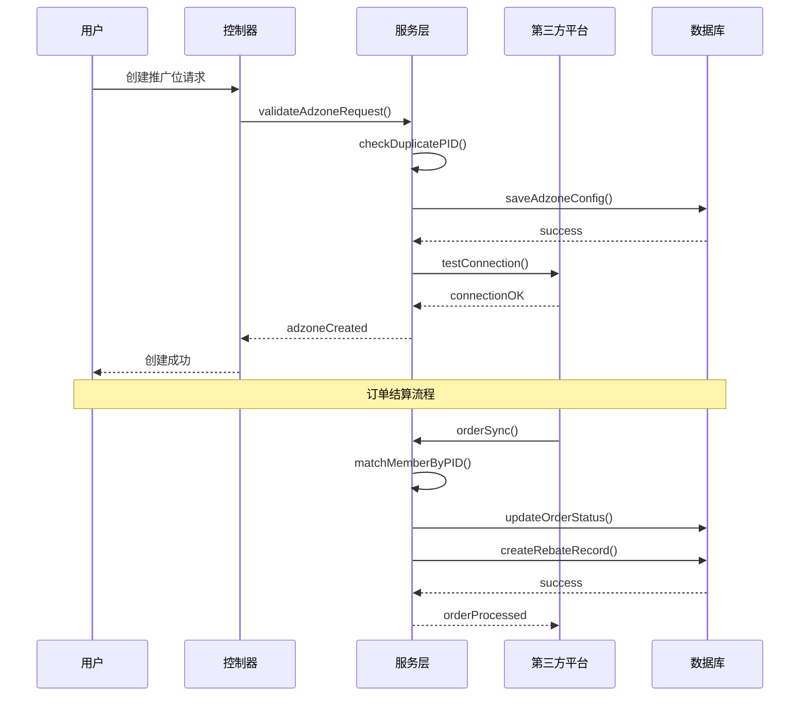
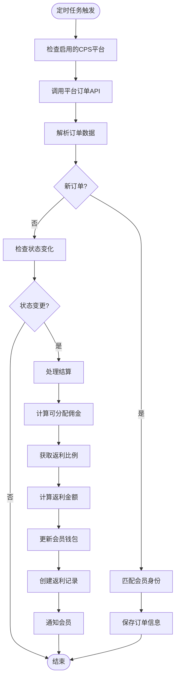
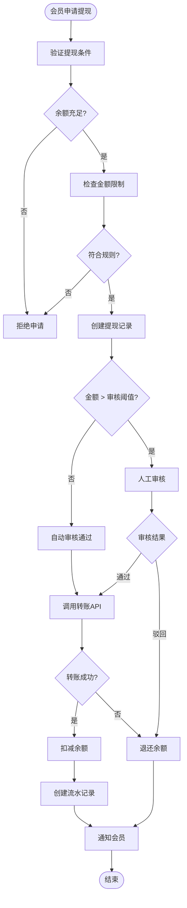
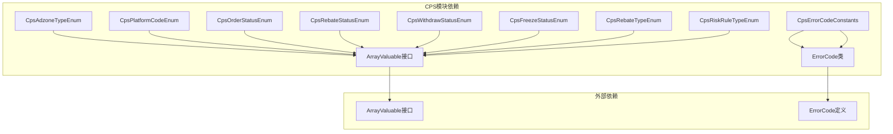

# CPS推广位管理模块

<cite>
**本文档引用的文件**
- [CpsAdzoneTypeEnum.java](file://backend/yudao-module-cps/yudao-module-cps-api/src/main/java/cn/iocoder/yudao/module/cps/enums/CpsAdzoneTypeEnum.java)
- [CpsErrorCodeConstants.java](file://backend/yudao-module-cps/yudao-module-cps-api/src/main/java/cn/iocoder/yudao/module/cps/enums/CpsErrorCodeConstants.java)
- [CpsFreezeStatusEnum.java](file://backend/yudao-module-cps/yudao-module-cps-api/src/main/java/cn/iocoder/yudao/module/cps/enums/CpsFreezeStatusEnum.java)
- [CpsOrderStatusEnum.java](file://backend/yudao-module-cps/yudao-module-cps-api/src/main/java/cn/iocoder/yudao/module/cps/enums/CpsOrderStatusEnum.java)
- [CpsPlatformCodeEnum.java](file://backend/yudao-module-cps/yudao-module-cps-api/src/main/java/cn/iocoder/yudao/module/cps/enums/CpsPlatformCodeEnum.java)
- [CpsRebateStatusEnum.java](file://backend/yudao-module-cps/yudao-module-cps-api/src/main/java/cn/iocoder/yudao/module/cps/enums/CpsRebateStatusEnum.java)
- [CpsRebateTypeEnum.java](file://backend/yudao-module-cps/yudao-module-cps-api/src/main/java/cn/iocoder/yudao/module/cps/enums/CpsRebateTypeEnum.java)
- [CpsRiskRuleTypeEnum.java](file://backend/yudao-module-cps/yudao-module-cps-api/src/main/java/cn/iocoder/yudao/module/cps/enums/CpsRiskRuleTypeEnum.java)
- [CpsWithdrawStatusEnum.java](file://backend/yudao-module-cps/yudao-module-cps-api/src/main/java/cn/iocoder/yudao/module/cps/enums/CpsWithdrawStatusEnum.java)
- [CPS系统PRD文档.md](file://docs/CPS系统PRD文档.md)
</cite>

## 目录
1. [简介](#简介)
2. [项目结构](#项目结构)
3. [核心组件](#核心组件)
4. [架构概览](#架构概览)
5. [详细组件分析](#详细组件分析)
6. [依赖关系分析](#依赖关系分析)
7. [性能考虑](#性能考虑)
8. [故障排除指南](#故障排除指南)
9. [结论](#结论)

## 简介

CPS推广位管理模块是AgenticCPS系统中的核心业务模块，负责管理各个电商平台的推广位（PID）配置和相关业务逻辑。该模块基于芋道框架构建，支持淘宝、京东、拼多多等多个CPS联盟平台的推广位管理，为用户提供便捷的返利查询、商品比价和推广链接生成功能。

该模块采用分层架构设计，包含API定义层、业务逻辑层和数据访问层，确保了系统的可扩展性和可维护性。通过统一的推广位管理机制，实现了对不同平台推广位的标准化管理和灵活配置。

## 项目结构

CPS推广位管理模块位于后端项目的yudao-module-cps目录下，采用标准的Maven多模块结构：

**图表来源**
- [CpsAdzoneTypeEnum.java:1-40](file://backend/yudao-module-cps/yudao-module-cps-api/src/main/java/cn/iocoder/yudao/module/cps/enums/CpsAdzoneTypeEnum.java#L1-L40)
- [CpsPlatformCodeEnum.java:1-45](file://backend/yudao-module-cps/yudao-module-cps-api/src/main/java/cn/iocoder/yudao/module/cps/enums/CpsPlatformCodeEnum.java#L1-L45)

**章节来源**
- [CpsAdzoneTypeEnum.java:1-40](file://backend/yudao-module-cps/yudao-module-cps-api/src/main/java/cn/iocoder/yudao/module/cps/enums/CpsAdzoneTypeEnum.java#L1-L40)
- [CpsPlatformCodeEnum.java:1-45](file://backend/yudao-module-cps/yudao-module-cps-api/src/main/java/cn/iocoder/yudao/module/cps/enums/CpsPlatformCodeEnum.java#L1-L45)

## 核心组件

### 枚举管理系统

CPS模块通过一系列精心设计的枚举类来管理各种业务状态和配置：

#### 推广位类型枚举
推广位类型枚举定义了三种主要的推广位分类：
- **通用推广位（general）**：可在多个平台使用的通用推广位
- **渠道专属推广位（channel）**：特定渠道或合作伙伴专用的推广位
- **用户专属推广位（member）**：针对特定用户的个性化推广位

#### 平台编码枚举
平台编码枚举支持四大主流电商平台：
- **淘宝联盟（taobao）**：阿里巴巴旗下最大的CPS平台
- **京东联盟（jd）**：京东商城的推广联盟平台
- **拼多多联盟（pdd）**：拼多多的推广联盟平台
- **抖音联盟（douyin）**：字节跳动旗下的短视频推广平台

#### 业务状态枚举
系统定义了完整的业务状态管理体系，包括订单状态、返利状态、提现状态等，确保业务流程的规范化管理。

**章节来源**
- [CpsAdzoneTypeEnum.java:14-40](file://backend/yudao-module-cps/yudao-module-cps-api/src/main/java/cn/iocoder/yudao/module/cps/enums/CpsAdzoneTypeEnum.java#L14-L40)
- [CpsPlatformCodeEnum.java:14-45](file://backend/yudao-module-cps/yudao-module-cps-api/src/main/java/cn/iocoder/yudao/module/cps/enums/CpsPlatformCodeEnum.java#L14-L45)

## 架构概览

CPS推广位管理模块采用分层架构设计，确保了系统的清晰分离和良好扩展性：

**图表来源**
- [CPS系统PRD文档.md:80-262](file://docs/CPS系统PRD文档.md#L80-L262)

该架构设计遵循了经典的分层原则：
- **表现层**：处理用户交互和API请求
- **业务逻辑层**：实现核心业务规则和流程控制
- **数据访问层**：封装数据持久化逻辑
- **外部集成层**：与第三方平台和系统进行交互

## 详细组件分析

### 推广位管理核心流程

推广位管理模块的核心业务流程涵盖了从推广位创建到订单结算的完整生命周期：

**图表来源**
- [CPS系统PRD文档.md:152-223](file://docs/CPS系统PRD文档.md#L152-L223)

### 订单同步与结算机制

系统采用定时任务机制实现订单的自动化同步和结算：

**图表来源**
- [CPS系统PRD文档.md:183-223](file://docs/CPS系统PRD文档.md#L183-L223)

### 提现审核流程

提现功能提供了完善的风控和审核机制：

**图表来源**
- [CPS系统PRD文档.md:225-261](file://docs/CPS系统PRD文档.md#L225-L261)

**章节来源**
- [CPS系统PRD文档.md:80-262](file://docs/CPS系统PRD文档.md#L80-L262)

## 依赖关系分析

CPS推广位管理模块的依赖关系体现了清晰的分层架构和模块化设计：

**图表来源**
- [CpsAdzoneTypeEnum.java:3-8](file://backend/yudao-module-cps/yudao-module-cps-api/src/main/java/cn/iocoder/yudao/module/cps/enums/CpsAdzoneTypeEnum.java#L3-L8)
- [CpsErrorCodeConstants.java:3-4](file://backend/yudao-module-cps/yudao-module-cps-api/src/main/java/cn/iocoder/yudao/module/cps/enums/CpsErrorCodeConstants.java#L3-L4)

### 核心依赖特性

1. **接口驱动设计**：所有枚举类都实现了ArrayValuable接口，提供了统一的数组转换能力
2. **错误码集中管理**：通过CpsErrorCodeConstants接口统一管理所有业务错误码
3. **状态枚举标准化**：采用一致的设计模式管理各种业务状态

**章节来源**
- [CpsAdzoneTypeEnum.java:3-38](file://backend/yudao-module-cps/yudao-module-cps-api/src/main/java/cn/iocoder/yudao/module/cps/enums/CpsAdzoneTypeEnum.java#L3-L38)
- [CpsErrorCodeConstants.java:10-65](file://backend/yudao-module-cps/yudao-module-cps-api/src/main/java/cn/iocoder/yudao/module/cps/enums/CpsErrorCodeConstants.java#L10-L65)

## 性能考虑

### 架构性能优化

CPS推广位管理模块在设计时充分考虑了性能优化：

1. **异步处理机制**：订单同步采用定时任务异步处理，避免阻塞主线程
2. **缓存策略**：推广位配置和平台信息采用缓存机制，减少数据库访问
3. **批量操作**：支持批量创建和管理推广位，提高操作效率
4. **连接池管理**：第三方平台API调用使用连接池，优化资源利用率

### 数据库性能优化

- **索引优化**：关键查询字段建立适当索引
- **分页查询**：大数据量场景下采用分页查询
- **批量插入**：订单数据采用批量插入提升性能

## 故障排除指南

### 常见问题诊断

#### 推广位创建失败
- **问题现象**：创建推广位时报错
- **可能原因**：
  - PID重复或格式不正确
  - 平台配置信息缺失
  - 权限不足
- **解决方案**：
  - 检查PID唯一性
  - 验证平台配置
  - 确认用户权限

#### 订单同步异常
- **问题现象**：订单无法正常同步
- **可能原因**：
  - 第三方平台API异常
  - 网络连接问题
  - 凭证过期
- **解决方案**：
  - 检查平台连通性
  - 验证API凭证
  - 查看系统日志

#### 提现审核失败
- **问题现象**：提现申请无法通过审核
- **可能原因**：
  - 余额不足
  - 金额超出限制
  - 黑名单用户
- **解决方案**：
  - 检查用户余额
  - 验证提现规则
  - 解除黑名单状态

**章节来源**
- [CpsErrorCodeConstants.java:10-65](file://backend/yudao-module-cps/yudao-module-cps-api/src/main/java/cn/iocoder/yudao/module/cps/enums/CpsErrorCodeConstants.java#L10-L65)

## 结论

CPS推广位管理模块通过其精心设计的架构和完善的业务逻辑，为CPS联盟返利系统提供了坚实的技术支撑。模块采用标准化的枚举管理、规范化的业务流程和可靠的错误处理机制，确保了系统的稳定性与可维护性。

该模块的主要优势包括：

1. **标准化管理**：通过统一的枚举体系实现了业务状态的标准化管理
2. **灵活配置**：支持多种推广位类型和平台配置，满足不同业务场景需求
3. **完善风控**：内置完善的风控机制和审核流程，保障资金安全
4. **高效性能**：采用异步处理和缓存策略，确保系统高性能运行

未来可以在以下方面进一步优化：
- 增强AI智能推荐功能
- 扩展更多电商平台支持
- 优化用户体验和界面设计
- 加强数据分析和报表功能