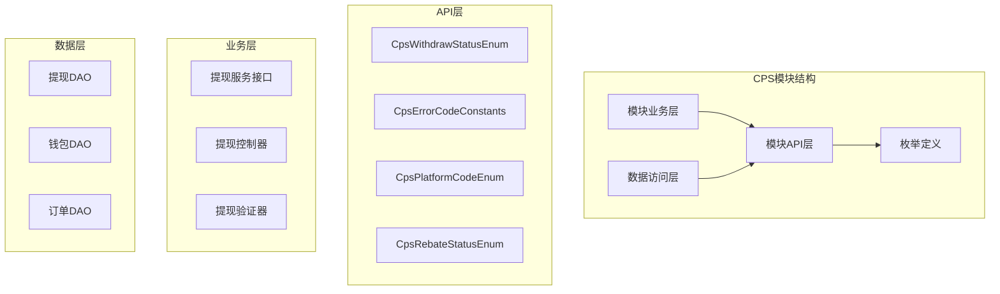
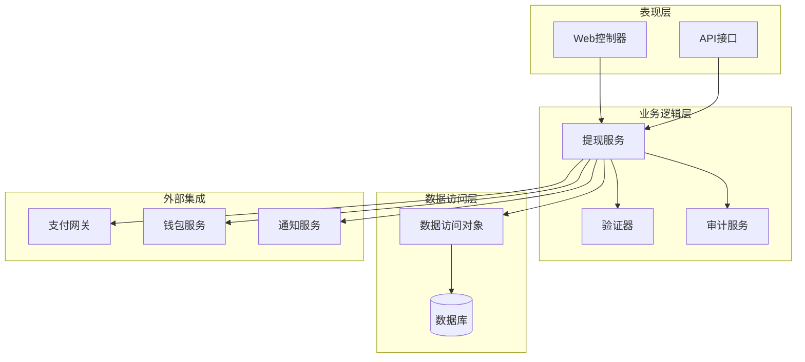
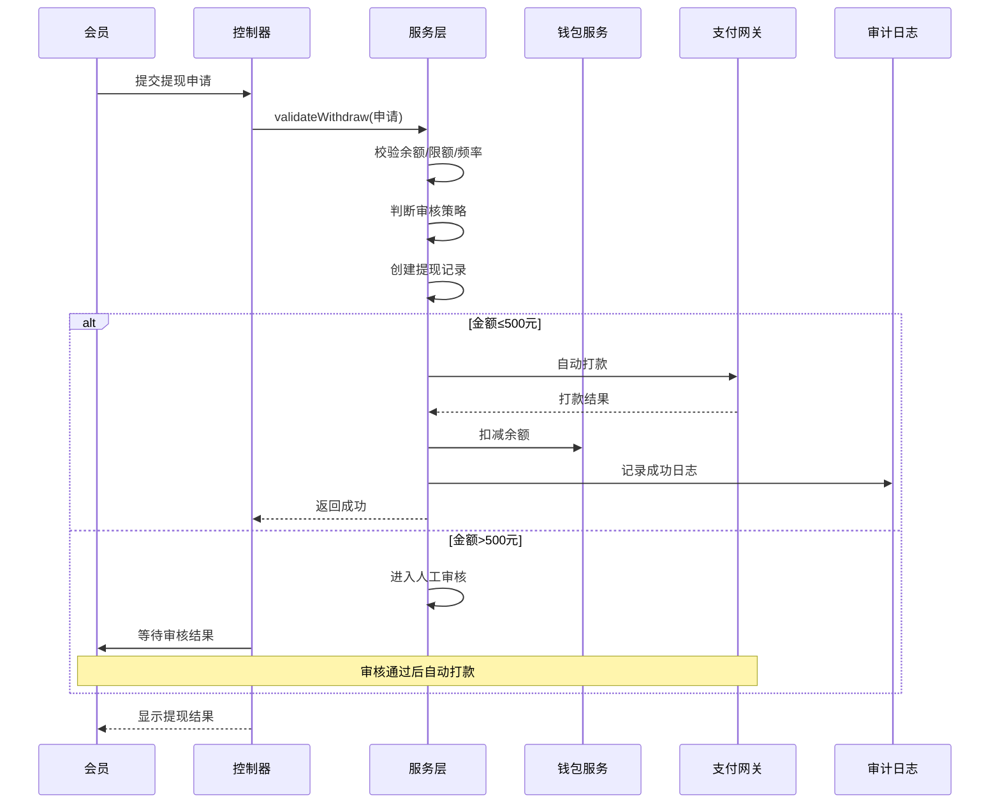
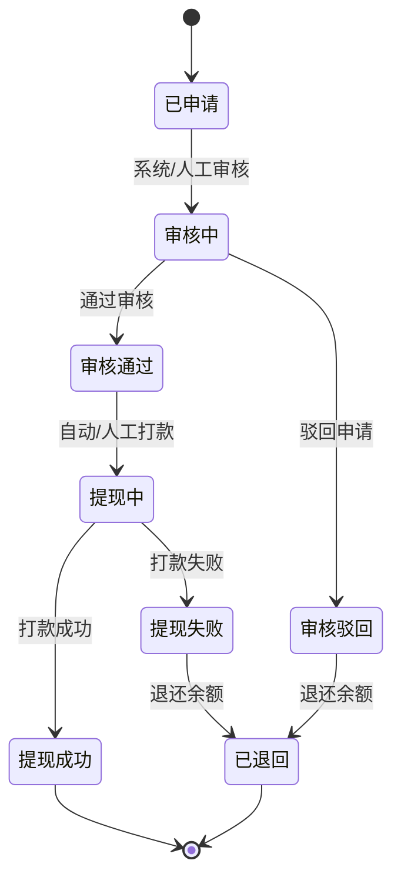
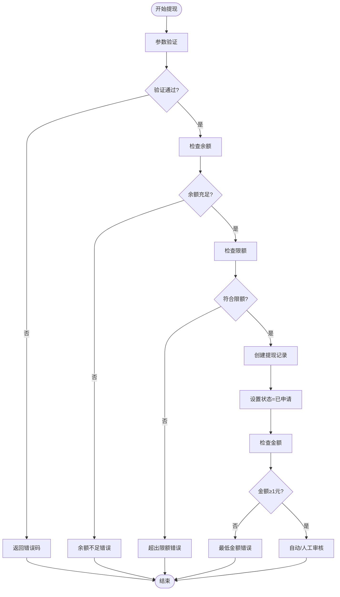
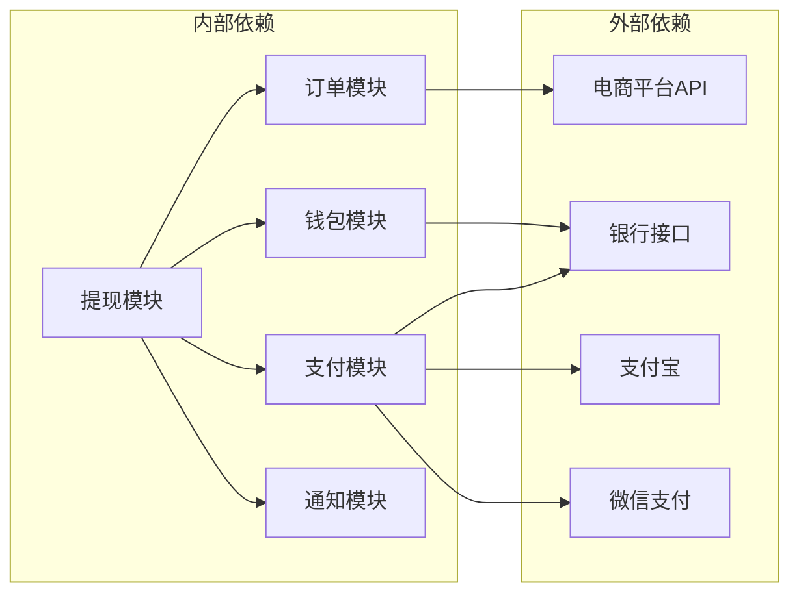
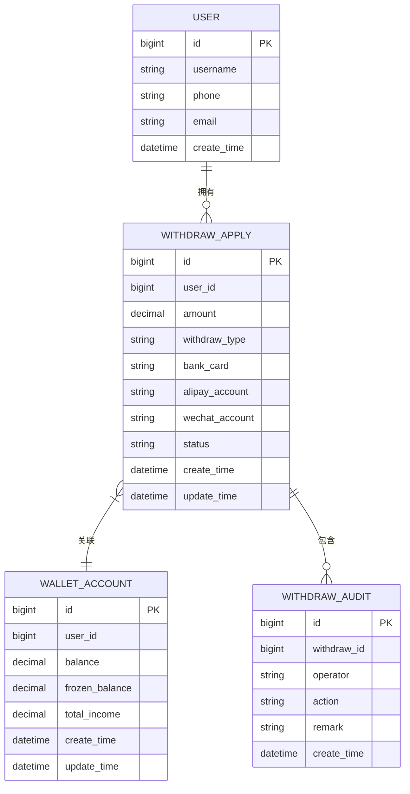

# CPS提现管理模块

<cite>
**本文档引用的文件**
- [CpsWithdrawStatusEnum.java](file://backend/yudao-module-cps/yudao-module-cps-api/src/main/java/cn/iocoder/yudao/module/cps/enums/CpsWithdrawStatusEnum.java)
- [CpsErrorCodeConstants.java](file://backend/yudao-module-cps/yudao-module-cps-api/src/main/java/cn/iocoder/yudao/module/cps/enums/CpsErrorCodeConstants.java)
- [CpsPlatformCodeEnum.java](file://backend/yudao-module-cps/yudao-module-cps-api/src/main/java/cn/iocoder/yudao/module/cps/enums/CpsPlatformCodeEnum.java)
- [CpsRebateStatusEnum.java](file://backend/yudao-module-cps/yudao-module-cps-api/src/main/java/cn/iocoder/yudao/module/cps/enums/CpsRebateStatusEnum.java)
- [CPS系统PRD文档.md](file://docs/CPS系统PRD文档.md)
</cite>

## 目录
1. [简介](#简介)
2. [项目结构](#项目结构)
3. [核心组件](#核心组件)
4. [架构概览](#架构概览)
5. [详细组件分析](#详细组件分析)
6. [依赖关系分析](#依赖关系分析)
7. [性能考虑](#性能考虑)
8. [故障排除指南](#故障排除指南)
9. [结论](#结论)

## 简介

CPS提现管理模块是AgenticCPS系统中的核心功能模块，负责处理会员从返利账户中提取佣金的完整流程。该模块基于芋道框架构建，采用分层架构设计，实现了完整的提现申请、审核、执行和状态跟踪功能。

系统支持多种提现方式（支付宝、微信），具备完善的风控机制和异常处理能力。模块遵循CPS联盟返利系统的业务规则，确保提现流程的安全性和可靠性。

## 项目结构

CPS提现管理模块位于后端项目的yudao-module-cps目录下，采用标准的Maven多模块架构：

**图表来源**
- [CpsWithdrawStatusEnum.java:1-44](file://backend/yudao-module-cps/yudao-module-cps-api/src/main/java/cn/iocoder/yudao/module/cps/enums/CpsWithdrawStatusEnum.java#L1-L44)
- [CpsErrorCodeConstants.java:1-65](file://backend/yudao-module-cps/yudao-module-cps-api/src/main/java/cn/iocoder/yudao/module/cps/enums/CpsErrorCodeConstants.java#L1-L65)

**章节来源**
- [CpsWithdrawStatusEnum.java:1-44](file://backend/yudao-module-cps/yudao-module-cps-api/src/main/java/cn/iocoder/yudao/module/cps/enums/CpsWithdrawStatusEnum.java#L1-L44)
- [CpsErrorCodeConstants.java:1-65](file://backend/yudao-module-cps/yudao-module-cps-api/src/main/java/cn/iocoder/yudao/module/cps/enums/CpsErrorCodeConstants.java#L1-L65)

## 核心组件

### 提现状态枚举

CpsWithdrawStatusEnum定义了提现流程中的所有状态，确保状态转换的完整性和一致性：

| 状态代码 | 状态名称 | 描述 |
|---------|---------|------|
| created | 已申请 | 会员提交提现申请 |
| reviewing | 审核中 | 系统/人工审核进行中 |
| passed | 审核通过 | 审核通过，等待打款 |
| rejected | 审核驳回 | 审核失败，退还余额 |
| success | 提现成功 | 打款成功，余额扣除 |
| failed | 提现失败 | 打款失败，退还余额 |
| refunded | 已退回 | 系统自动退回 |

### 错误码常量

CpsErrorCodeConstants提供了完整的错误码体系，涵盖提现相关的所有异常情况：

- **提现申请错误**: 申请不存在、状态不合法、金额不足、超出限额
- **账户相关错误**: 余额不足、账户冻结
- **风控相关错误**: 黑名单拦截、异常行为检测

### 平台编码枚举

CpsPlatformCodeEnum定义了支持的CPS平台，为提现流程提供平台级别的支持：

- 淘宝联盟 (taobao)
- 京东联盟 (jd)  
- 拼多多联盟 (pdd)
- 抖音联盟 (douyin)

**章节来源**
- [CpsWithdrawStatusEnum.java:16-41](file://backend/yudao-module-cps/yudao-module-cps-api/src/main/java/cn/iocoder/yudao/module/cps/enums/CpsWithdrawStatusEnum.java#L16-L41)
- [CpsErrorCodeConstants.java:38-42](file://backend/yudao-module-cps/yudao-module-cps-api/src/main/java/cn/iocoder/yudao/module/cps/enums/CpsErrorCodeConstants.java#L38-L42)
- [CpsPlatformCodeEnum.java:16-44](file://backend/yudao-module-cps/yudao-module-cps-api/src/main/java/cn/iocoder/yudao/module/cps/enums/CpsPlatformCodeEnum.java#L16-L44)

## 架构概览

CPS提现管理模块采用分层架构设计，确保关注点分离和代码的可维护性：

**图表来源**
- [CPS系统PRD文档.md:225-261](file://docs/CPS系统PRD文档.md#L225-L261)

### 核心业务流程

提现流程遵循严格的业务规则和风控策略：

**图表来源**
- [CPS系统PRD文档.md:225-261](file://docs/CPS系统PRD文档.md#L225-L261)

## 详细组件分析

### 提现状态管理

提现状态管理是整个模块的核心，确保提现流程的可追溯性和安全性：

**图表来源**
- [CpsWithdrawStatusEnum.java:18-24](file://backend/yudao-module-cps/yudao-module-cps-api/src/main/java/cn/iocoder/yudao/module/cps/enums/CpsWithdrawStatusEnum.java#L18-L24)

### 错误处理机制

系统采用统一的错误码机制，确保错误信息的一致性和可维护性：

**图表来源**
- [CpsErrorCodeConstants.java:39-42](file://backend/yudao-module-cps/yudao-module-cps-api/src/main/java/cn/iocoder/yudao/module/cps/enums/CpsErrorCodeConstants.java#L39-L42)

### 风控策略实现

系统内置多重风控策略，确保提现安全：

| 风控维度 | 策略规则 | 阈值设置 |
|---------|---------|---------|
| 金额风控 | 单笔最大提现额度 | 5000元 |
| 频率风控 | 每日最大提现次数 | 3次 |
| 金额门槛 | 自动审核阈值 | 500元 |
| 黑名单 | 异常行为检测 | 系统自动识别 |
| 余额保护 | 最低保留余额 | 0元 |

**章节来源**
- [CpsWithdrawStatusEnum.java:1-44](file://backend/yudao-module-cps/yudao-module-cps-api/src/main/java/cn/iocoder/yudao/module/cps/enums/CpsWithdrawStatusEnum.java#L1-L44)
- [CpsErrorCodeConstants.java:38-42](file://backend/yudao-module-cps/yudao-module-cps-api/src/main/java/cn/iocoder/yudao/module/cps/enums/CpsErrorCodeConstants.java#L38-L42)
- [CPS系统PRD文档.md:225-261](file://docs/CPS系统PRD文档.md#L225-L261)

## 依赖关系分析

CPS提现管理模块与其他系统组件的依赖关系如下：

**图表来源**
- [CPS系统PRD文档.md:225-261](file://docs/CPS系统PRD文档.md#L225-L261)

### 数据模型关系

**图表来源**
- [CpsWithdrawStatusEnum.java:18-24](file://backend/yudao-module-cps/yudao-module-cps-api/src/main/java/cn/iocoder/yudao/module/cps/enums/CpsWithdrawStatusEnum.java#L18-L24)

**章节来源**
- [CPS系统PRD文档.md:225-261](file://docs/CPS系统PRD文档.md#L225-L261)

## 性能考虑

### 并发处理

系统采用乐观锁机制处理并发提现请求，避免重复扣款和状态冲突：

- **分布式锁**: 使用Redis实现提现操作的分布式锁
- **幂等设计**: 每个提现请求具有唯一标识，防止重复处理
- **批量处理**: 对于大量提现请求采用异步批量处理

### 缓存策略

- **状态缓存**: 缓存提现状态和用户余额信息
- **配置缓存**: 缓存提现规则和限额配置
- **平台配置**: 缓存各平台的API配置信息

### 监控指标

系统监控关键业务指标：

- **提现成功率**: 统计提现成功的比率
- **平均处理时间**: 提现申请到完成的平均时长
- **异常率**: 提现失败和异常的比例
- **并发处理能力**: 系统同时处理提现请求的能力

## 故障排除指南

### 常见问题及解决方案

| 问题类型 | 症状描述 | 可能原因 | 解决方案 |
|---------|---------|---------|---------|
| 提现失败 | 余额扣减但打款失败 | 支付网关异常 | 重试打款，检查银行账户信息 |
| 审核超时 | 提现长时间处于审核中 | 人工审核积压 | 系统自动审核，联系客服处理 |
| 余额不足 | 提现申请被拒绝 | 可用余额不足 | 检查返利到账情况 |
| 频率限制 | 超过每日提现次数 | 达到频率限制 | 等待次日或联系客服 |

### 日志分析

系统提供详细的日志记录：

- **操作日志**: 记录所有提现操作的详细信息
- **异常日志**: 记录提现过程中的异常情况
- **审计日志**: 记录提现状态变更的历史

### 性能优化建议

- **数据库优化**: 为提现状态和用户ID建立合适的索引
- **缓存优化**: 合理设置缓存过期时间和容量
- **异步处理**: 对非关键操作采用异步处理方式

**章节来源**
- [CpsErrorCodeConstants.java:38-42](file://backend/yudao-module-cps/yudao-module-cps-api/src/main/java/cn/iocoder/yudao/module/cps/enums/CpsErrorCodeConstants.java#L38-L42)
- [CPS系统PRD文档.md:225-261](file://docs/CPS系统PRD文档.md#L225-L261)

## 结论

CPS提现管理模块是一个功能完善、架构清晰的金融交易模块。通过合理的状态管理和风控策略，确保了提现流程的安全性和可靠性。模块采用分层设计和统一的错误处理机制，为后续的功能扩展和维护奠定了良好的基础。

系统的主要优势包括：

1. **完整的状态管理**: 覆盖提现流程的各个环节
2. **严格的风控机制**: 多层次的风险控制策略
3. **完善的错误处理**: 统一的错误码和异常处理
4. **可扩展的架构**: 清晰的分层设计便于功能扩展
5. **全面的监控**: 详细的日志和监控指标

未来可以在以下方面进行改进：

- 增强AI风控能力，提高异常检测的准确性
- 优化用户体验，简化提现申请流程
- 扩展更多支付方式，满足不同用户需求
- 加强数据分析能力，提供更精准的营销策略