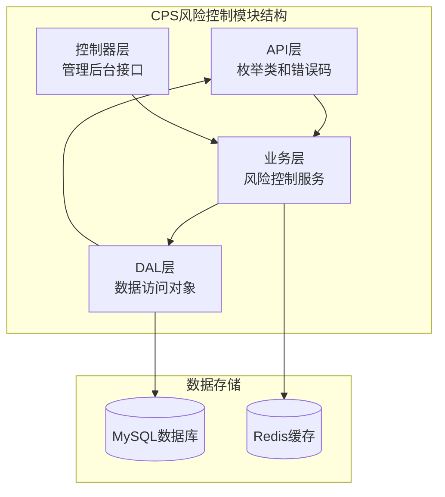
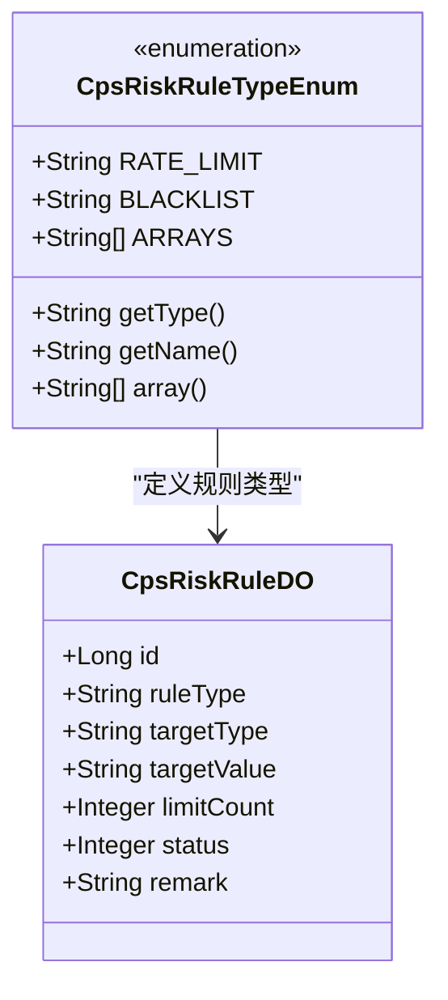
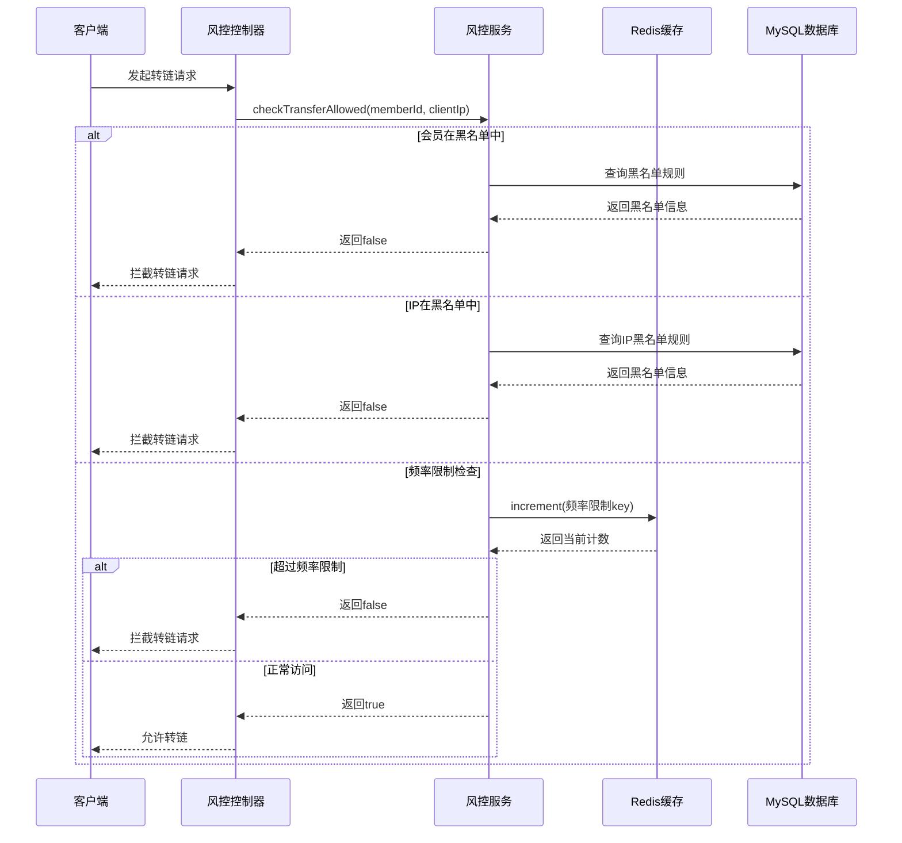
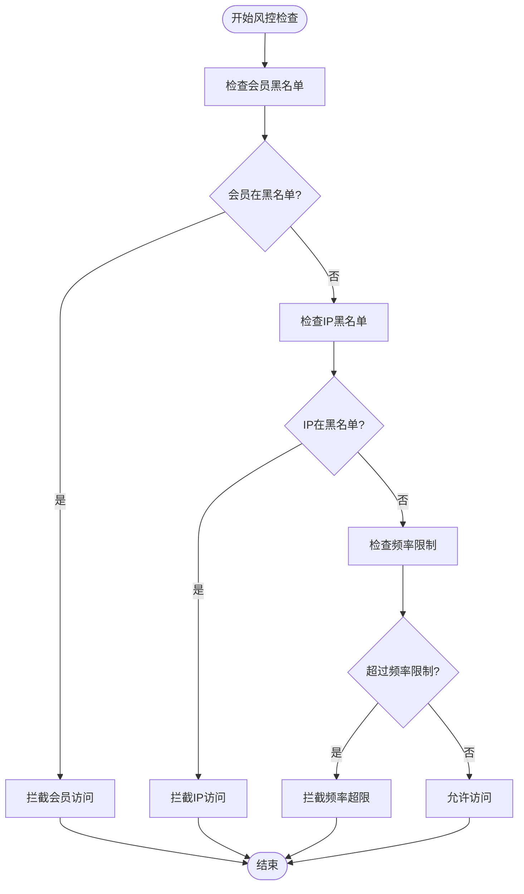
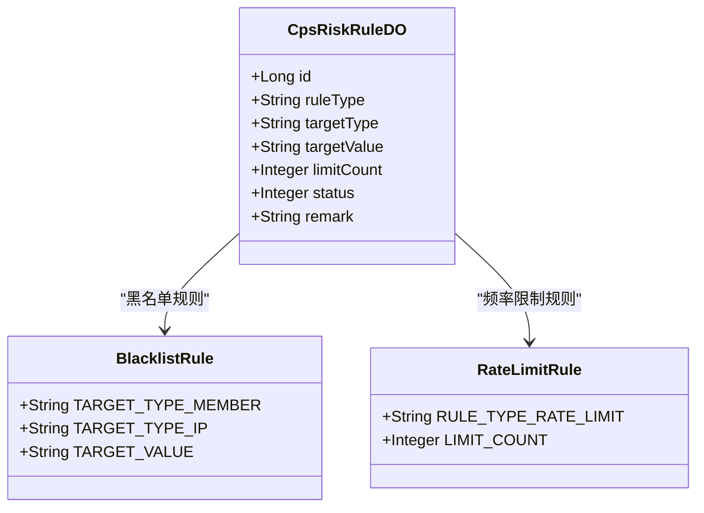
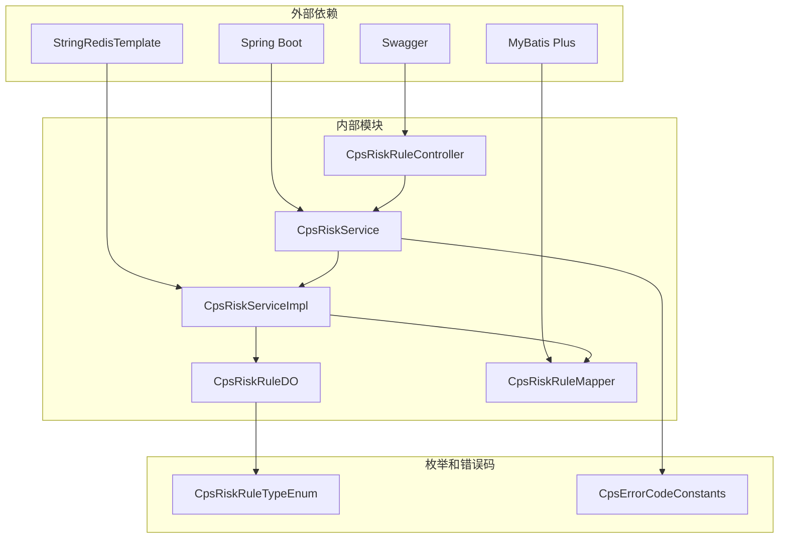

# CPS风险控制框架

<cite>
**本文档引用的文件**
- [CpsRiskRuleTypeEnum.java](file://backend/yudao-module-cps/yudao-module-cps-api/src/main/java/cn/iocoder/yudao/module/cps/enums/CpsRiskRuleTypeEnum.java)
- [CpsErrorCodeConstants.java](file://backend/yudao-module-cps/yudao-module-cps-api/src/main/java/cn/iocoder/yudao/module/cps/enums/CpsErrorCodeConstants.java)
- [CpsRiskService.java](file://backend/yudao-module-cps/yudao-module-cps-biz/src/main/java/cn/iocoder/yudao/module/cps/service/risk/CpsRiskService.java)
- [CpsRiskServiceImpl.java](file://backend/yudao-module-cps/yudao-module-cps-biz/src/main/java/cn/iocoder/yudao/module/cps/service/risk/CpsRiskServiceImpl.java)
- [CpsRiskRuleController.java](file://backend/yudao-module-cps/yudao-module-cps-biz/src/main/java/cn/iocoder/yudao/module/cps/controller/admin/risk/CpsRiskRuleController.java)
- [CpsRiskRuleDO.java](file://backend/yudao-module-cps/yudao-module-cps-biz/src/main/java/cn/iocoder/yudao/module/cps/dal/dataobject/risk/CpsRiskRuleDO.java)
- [CpsRiskRuleSaveReqVO.java](file://backend/yudao-module-cps/yudao-module-cps-biz/src/main/java/cn/iocoder/yudao/module/cps/controller/admin/risk/vo/CpsRiskRuleSaveReqVO.java)
- [CPS系统PRD文档.md](file://docs/CPS系统PRD文档.md)
</cite>

## 目录
1. [简介](#简介)
2. [项目结构](#项目结构)
3. [核心组件](#核心组件)
4. [架构概览](#架构概览)
5. [详细组件分析](#详细组件分析)
6. [依赖关系分析](#依赖关系分析)
7. [性能考虑](#性能考虑)
8. [故障排除指南](#故障排除指南)
9. [结论](#结论)

## 简介

CPS风险控制框架是AgenticCPS项目中的核心安全组件，负责保护CPS（Cost Per Sale）联盟返利系统的稳定运行。该框架实现了多层次的风险控制机制，包括频率限制、黑名单管理和实时监控，确保系统免受恶意攻击和滥用行为的影响。

该框架采用分布式架构设计，结合Redis内存数据库进行高频访问控制，MySQL数据库存储持久化规则配置，为CPS转链服务提供了可靠的安全保障。

## 项目结构

CPS风险控制框架位于后端项目的yudao-module-cps模块中，采用标准的分层架构设计：

**图表来源**
- [CpsRiskService.java:1-68](file://backend/yudao-module-cps/yudao-module-cps-biz/src/main/java/cn/iocoder/yudao/module/cps/service/risk/CpsRiskService.java#L1-L68)
- [CpsRiskServiceImpl.java:1-120](file://backend/yudao-module-cps/yudao-module-cps-biz/src/main/java/cn/iocoder/yudao/module/cps/service/risk/CpsRiskServiceImpl.java#L1-L120)

**章节来源**
- [CpsRiskService.java:1-68](file://backend/yudao-module-cps/yudao-module-cps-biz/src/main/java/cn/iocoder/yudao/module/cps/service/risk/CpsRiskService.java#L1-L68)
- [CpsRiskServiceImpl.java:1-120](file://backend/yudao-module-cps/yudao-module-cps-biz/src/main/java/cn/iocoder/yudao/module/cps/service/risk/CpsRiskServiceImpl.java#L1-L120)

## 核心组件

### 风控规则类型枚举

系统支持两种主要的风控规则类型：

1. **频率限制（RATE_LIMIT）**：限制会员每日转链操作的次数
2. **黑名单（BLACKLIST）**：阻止特定会员或IP地址的访问

**图表来源**
- [CpsRiskRuleTypeEnum.java:14-38](file://backend/yudao-module-cps/yudao-module-cps-api/src/main/java/cn/iocoder/yudao/module/cps/enums/CpsRiskRuleTypeEnum.java#L14-L38)
- [CpsRiskRuleDO.java:31-72](file://backend/yudao-module-cps/yudao-module-cps-biz/src/main/java/cn/iocoder/yudao/module/cps/dal/dataobject/risk/CpsRiskRuleDO.java#L31-L72)

### 风控服务接口

CpsRiskService定义了完整的风险控制接口，包括：

- 转链权限检查
- 风控规则的增删改查
- 分页查询功能

**章节来源**
- [CpsRiskService.java:8-67](file://backend/yudao-module-cps/yudao-module-cps-biz/src/main/java/cn/iocoder/yudao/module/cps/service/risk/CpsRiskService.java#L8-L67)

## 架构概览

CPS风险控制框架采用三层架构设计，实现了逻辑清晰的分层分离：

**图表来源**
- [CpsRiskServiceImpl.java:50-78](file://backend/yudao-module-cps/yudao-module-cps-biz/src/main/java/cn/iocoder/yudao/module/cps/service/risk/CpsRiskServiceImpl.java#L50-L78)
- [CpsRiskRuleController.java:38-69](file://backend/yudao-module-cps/yudao-module-cps-biz/src/main/java/cn/iocoder/yudao/module/cps/controller/admin/risk/CpsRiskRuleController.java#L38-L69)

## 详细组件分析

### 风控检查算法

系统实现了三阶段的风控检查机制：

**图表来源**
- [CpsRiskServiceImpl.java:50-78](file://backend/yudao-module-cps/yudao-module-cps-biz/src/main/java/cn/iocoder/yudao/module/cps/service/risk/CpsRiskServiceImpl.java#L50-L78)

### 频率限制实现

频率限制通过Redis的INCR操作实现，采用每日重置的计数器机制：

| 组件 | 作用 | 配置 |
|------|------|------|
| Redis Key | `cps:risk:rate:{memberId}:{date}` | 每日重置 |
| TTL设置 | 1天 | 自动过期 |
| 计数器 | INCR原子操作 | 线程安全 |
| 规则查询 | MySQL查询活动规则 | 实时生效 |

**章节来源**
- [CpsRiskServiceImpl.java:62-76](file://backend/yudao-module-cps/yudao-module-cps-biz/src/main/java/cn/iocoder/yudao/module/cps/service/risk/CpsRiskServiceImpl.java#L62-L76)

### 黑名单管理

黑名单系统支持两种目标类型：

1. **会员黑名单**：针对特定会员ID的限制
2. **IP黑名单**：针对特定IP地址的限制

**图表来源**
- [CpsRiskRuleDO.java:40-65](file://backend/yudao-module-cps/yudao-module-cps-biz/src/main/java/cn/iocoder/yudao/module/cps/dal/dataobject/risk/CpsRiskRuleDO.java#L40-L65)

**章节来源**
- [CpsRiskRuleDO.java:10-72](file://backend/yudao-module-cps/yudao-module-cps-biz/src/main/java/cn/iocoder/yudao/module/cps/dal/dataobject/risk/CpsRiskRuleDO.java#L10-L72)

### 管理后台接口

系统提供了完整的管理后台接口，支持风控规则的全生命周期管理：

| 接口 | 方法 | 权限 | 功能 |
|------|------|------|------|
| `/admin-api/cps/risk/rule/create` | POST | `cps:risk-rule:create` | 创建风控规则 |
| `/admin-api/cps/risk/rule/update` | PUT | `cps:risk-rule:update` | 更新风控规则 |
| `/admin-api/cps/risk/rule/delete` | DELETE | `cps:risk-rule:delete` | 删除风控规则 |
| `/admin-api/cps/risk/rule/page` | GET | `cps:risk-rule:query` | 分页查询规则 |

**章节来源**
- [CpsRiskRuleController.java:38-69](file://backend/yudao-module-cps/yudao-module-cps-biz/src/main/java/cn/iocoder/yudao/module/cps/controller/admin/risk/CpsRiskRuleController.java#L38-L69)

## 依赖关系分析

CPS风险控制框架的依赖关系体现了清晰的分层架构：

**图表来源**
- [CpsRiskServiceImpl.java:3-18](file://backend/yudao-module-cps/yudao-module-cps-biz/src/main/java/cn/iocoder/yudao/module/cps/service/risk/CpsRiskServiceImpl.java#L3-L18)
- [CpsRiskRuleController.java:3-18](file://backend/yudao-module-cps/yudao-module-cps-biz/src/main/java/cn/iocoder/yudao/module/cps/controller/admin/risk/CpsRiskRuleController.java#L3-L18)

**章节来源**
- [CpsRiskServiceImpl.java:3-18](file://backend/yudao-module-cps/yudao-module-cps-biz/src/main/java/cn/iocoder/yudao/module/cps/service/risk/CpsRiskServiceImpl.java#L3-L18)
- [CpsRiskRuleController.java:3-18](file://backend/yudao-module-cps/yudao-module-cps-biz/src/main/java/cn/iocoder/yudao/module/cps/controller/admin/risk/CpsRiskRuleController.java#L3-L18)

## 性能考虑

### 缓存策略

系统采用Redis作为高性能缓存层，主要考虑：

- **热点数据缓存**：频率限制计数器存储在Redis中
- **TTL管理**：自动过期机制确保内存使用效率
- **原子操作**：INCR操作保证计数准确性

### 数据库优化

- **索引设计**：黑名单规则按目标类型和目标值建立索引
- **分页查询**：支持大数据量的分页浏览
- **事务处理**：确保规则变更的一致性

### 监控指标

系统提供了完善的日志记录和监控能力：

- **风控拦截日志**：记录所有拦截事件
- **访问统计**：跟踪规则执行效果
- **性能监控**：监控Redis和数据库响应时间

## 故障排除指南

### 常见问题及解决方案

| 问题类型 | 症状 | 可能原因 | 解决方案 |
|----------|------|----------|----------|
| 频繁被拦截 | 用户无法转链 | 频率限制过严 | 调整limitCount或临时提高阈值 |
| 黑名单误判 | 正常用户被拦截 | 黑名单配置错误 | 检查targetType和targetValue |
| Redis连接失败 | 频率检查异常 | Redis服务异常 | 检查Redis连接配置 |
| 数据库连接问题 | 规则查询失败 | MySQL连接异常 | 检查数据库连接池配置 |

### 日志分析

系统的关键日志位置：

- **风控拦截日志**：`[RiskCheck] 会员黑名单拦截 memberId={}`
- **频率超限日志**：`[RiskCheck] 频率超限 memberId={} count={} limit={}`
- **异常处理日志**：风控规则不存在等错误信息

**章节来源**
- [CpsRiskServiceImpl.java:54-74](file://backend/yudao-module-cps/yudao-module-cps-biz/src/main/java/cn/iocoder/yudao/module/cps/service/risk/CpsRiskServiceImpl.java#L54-L74)

## 结论

CPS风险控制框架通过多层次的安全防护机制，为CPS联盟返利系统提供了全面的安全保障。框架的设计具有以下特点：

1. **模块化设计**：清晰的分层架构便于维护和扩展
2. **高性能实现**：Redis缓存和数据库优化确保系统响应速度
3. **灵活配置**：支持动态调整风控策略
4. **完整监控**：提供全面的日志记录和监控能力

该框架为CPS系统的稳定运行奠定了坚实的基础，能够有效防范各种风险和攻击行为，确保平台的长期健康发展。