# MCP协议集成

<cite>
**本文档引用的文件**
- [CpsSearchGoodsToolFunction.java](file://backend/yudao-module-cps/yudao-module-cps-biz/src/main/java/cn/iocoder/yudao/module/cps/mcp/tool/CpsSearchGoodsToolFunction.java)
- [CpsComparePricesToolFunction.java](file://backend/yudao-module-cps/yudao-module-cps-biz/src/main/java/cn/iocoder/yudao/module/cps/mcp/tool/CpsComparePricesToolFunction.java)
- [CpsGenerateLinkToolFunction.java](file://backend/yudao-module-cps/yudao-module-cps-biz/src/main/java/cn/iocoder/yudao/module/cps/mcp/tool/CpsGenerateLinkToolFunction.java)
- [CpsQueryOrdersToolFunction.java](file://backend/yudao-module-cps/yudao-module-cps-biz/src/main/java/cn/iocoder/yudao/module/cps/mcp/tool/CpsQueryOrdersToolFunction.java)
- [CpsGetRebateSummaryToolFunction.java](file://backend/yudao-module-cps/yudao-module-cps-biz/src/main/java/cn/iocoder/yudao/module/cps/mcp/tool/CpsGetRebateSummaryToolFunction.java)
- [CpsPlatformClientFactory.java](file://backend/yudao-module-cps/yudao-module-cps-biz/src/main/java/cn/iocoder/yudao/module/cps/client/CpsPlatformClientFactory.java)
- [CpsPlatformCodeEnum.java](file://backend/yudao-module-cps/yudao-module-cps-api/src/main/java/cn/iocoder/yudao/module/cps/enums/CpsPlatformCodeEnum.java)
- [TaobaoPlatformClientAdapter.java](file://backend/yudao-module-cps/yudao-module-cps-biz/src/main/java/cn/iocoder/yudao/module/cps/client/taobao/TaobaoPlatformClientAdapter.java)
- [JdPlatformClientAdapter.java](file://backend/yudao-module-cps/yudao-module-cps-biz/src/main/java/cn/iocoder/yudao/module/cps/client/jd/JdPlatformClientAdapter.java)
- [PddPlatformClientAdapter.java](file://backend/yudao-module-cps/yudao-module-cps-biz/src/main/java/cn/iocoder/yudao/module/cps/client/pdd/PddPlatformClientAdapter.java)
- [CpsMcpApiKeyDO.java](file://backend/yudao-module-cps/yudao-module-cps-biz/src/main/java/cn/iocoder/yudao/module/cps/dal/dataobject/mcp/CpsMcpApiKeyDO.java)
- [CpsMcpAccessLogDO.java](file://backend/yudao-module-cps/yudao-module-cps-biz/src/main/java/cn/iocoder/yudao/module/cps/dal/dataobject/mcp/CpsMcpAccessLogDO.java)
- [CpsMcpApiKeyMapper.java](file://backend/yudao-module-cps/yudao-module-cps-biz/src/main/java/cn/iocoder/yudao/module/cps/dal/mysql/mcp/CpsMcpApiKeyMapper.java)
- [CpsMcpAccessLogMapper.java](file://backend/yudao-module-cps/yudao-module-cps-biz/src/main/java/cn/iocoder/yudao/module/cps/dal/mysql/mcp/CpsMcpAccessLogMapper.java)
- [AiChatMessageServiceImpl.java](file://backend/yudao-module-ai/src/main/java/cn/iocoder/yudao/module/ai/service/chat/AiChatMessageServiceImpl.java)
- [SecurityConfiguration.java](file://backend/yudao-module-ai/src/main/java/cn/iocoder/yudao/module/ai/framework/security/config/SecurityConfiguration.java)
- [CPS系统PRD文档.md](file://docs/CPS系统PRD文档.md)
- [application.yaml](file://backend/yudao-server/src/main/resources/application.yaml)
- [README.md](file://backend/README.md)
- [AGENTS.md](file://backend/AGENTS.md)
</cite>

## 更新摘要
**所做更改**
- 新增AI Agent推荐系统功能模块，支持个性化推荐和智能购物助手
- 扩展多平台协议支持，新增抖音联盟平台适配器
- 完善平台客户端工厂机制，支持动态平台注册与管理
- 增强工具函数的多平台能力，所有工具支持淘宝、京东、拼多多、抖音四平台
- 新增平台枚举和适配器文件，提供完整的平台支持体系

## 目录
1. [简介](#简介)
2. [项目结构](#项目结构)
3. [核心组件](#核心组件)
4. [架构总览](#架构总览)
5. [详细组件分析](#详细组件分析)
6. [AI Agent推荐系统](#ai-agent推荐系统)
7. [多平台协议支持](#多平台协议支持)
8. [依赖分析](#依赖分析)
9. [性能考量](#性能考量)
10. [故障排查指南](#故障排查指南)
11. [结论](#结论)
12. [附录](#附录)

## 简介
本文件面向AgenticCPS项目中的MCP（Model Context Protocol）协议集成，系统性阐述其在CPS系统中的应用方式、工具函数定义、资源管理机制、提示词模板与上下文管理、客户端集成与消息传递、状态同步、安全与性能优化、错误处理，以及与AI Agent的协作模式与智能推荐、业务自动化工作原理。

**更新** 本版本反映了MCP协议集成现已扩展为完整的CPS MCP协议集成，包括AI Agent与CPS系统的无缝集成，提供开箱即用的工具集与完善的资源管理、安全与日志体系。新增AI Agent推荐系统功能，支持个性化推荐、价格趋势分析、返利优化建议等增强AI功能。

## 项目结构
围绕MCP协议的关键模块分布在后端模块中：
- AI模块负责MCP客户端集成、工具回调收集与消息上下文管理
- CPS模块提供MCP工具函数（搜索、比价、转链、订单查询、返利汇总）
- 平台适配器模块支持多平台协议（淘宝、京东、拼多多、抖音）
- 数据层提供MCP API Key与访问日志的DO/Mapper

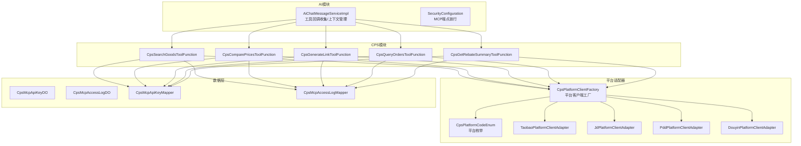

**图表来源**
- [AiChatMessageServiceImpl.java:127-425](file://backend/yudao-module-ai/src/main/java/cn/iocoder/yudao/module/ai/service/chat/AiChatMessageServiceImpl.java#L127-L425)
- [SecurityConfiguration.java:25-40](file://backend/yudao-module-ai/src/main/java/cn/iocoder/yudao/module/ai/framework/security/config/SecurityConfiguration.java#L25-L40)
- [CpsSearchGoodsToolFunction.java:28-37](file://backend/yudao-module-cps/yudao-module-cps-biz/src/main/java/cn/iocoder/yudao/module/cps/mcp/tool/CpsSearchGoodsToolFunction.java#L28-L37)
- [CpsComparePricesToolFunction.java:30-48](file://backend/yudao-module-cps/yudao-module-cps-biz/src/main/java/cn/iocoder/yudao/module/cps/mcp/tool/CpsComparePricesToolFunction.java#L30-L48)
- [CpsGenerateLinkToolFunction.java:27-60](file://backend/yudao-module-cps/yudao-module-cps-biz/src/main/java/cn/iocoder/yudao/module/cps/mcp/tool/CpsGenerateLinkToolFunction.java#L27-L60)
- [CpsQueryOrdersToolFunction.java:33-61](file://backend/yudao-module-cps/yudao-module-cps-biz/src/main/java/cn/iocoder/yudao/module/cps/mcp/tool/CpsQueryOrdersToolFunction.java#L33-L61)
- [CpsGetRebateSummaryToolFunction.java:32-51](file://backend/yudao-module-cps/yudao-module-cps-biz/src/main/java/cn/iocoder/yudao/module/cps/mcp/tool/CpsGetRebateSummaryToolFunction.java#L32-L51)
- [CpsPlatformClientFactory.java:22-102](file://backend/yudao-module-cps/yudao-module-cps-biz/src/main/java/cn/iocoder/yudao/module/cps/client/CpsPlatformClientFactory.java#L22-L102)
- [CpsPlatformCodeEnum.java:14-45](file://backend/yudao-module-cps/yudao-module-cps-api/src/main/java/cn/iocoder/yudao/module/cps/enums/CpsPlatformCodeEnum.java#L14-L45)
- [TaobaoPlatformClientAdapter.java:29-336](file://backend/yudao-module-cps/yudao-module-cps-biz/src/main/java/cn/iocoder/yudao/module/cps/client/taobao/TaobaoPlatformClientAdapter.java#L29-336)
- [JdPlatformClientAdapter.java:26-292](file://backend/yudao-module-cps/yudao-module-cps-biz/src/main/java/cn/iocoder/yudao/module/cps/client/jd/JdPlatformClientAdapter.java#L26-292)
- [PddPlatformClientAdapter.java:25-320](file://backend/yudao-module-cps/yudao-module-cps-biz/src/main/java/cn/iocoder/yudao/module/cps/client/pdd/PddPlatformClientAdapter.java#L25-320)
- [CpsMcpApiKeyDO.java:24-60](file://backend/yudao-module-cps/yudao-module-cps-biz/src/main/java/cn/iocoder/yudao/module/cps/dal/dataobject/mcp/CpsMcpApiKeyDO.java#L24-L60)
- [CpsMcpAccessLogDO.java:22-62](file://backend/yudao-module-cps/yudao-module-cps-biz/src/main/java/cn/iocoder/yudao/module/cps/dal/dataobject/mcp/CpsMcpAccessLogDO.java#L22-L62)

**章节来源**
- [AiChatMessageServiceImpl.java:127-425](file://backend/yudao-module-ai/src/main/java/cn/iocoder/yudao/module/ai/service/chat/AiChatMessageServiceImpl.java#L127-L425)
- [SecurityConfiguration.java:25-40](file://backend/yudao-module-ai/src/main/java/cn/iocoder/yudao/module/ai/framework/security/config/SecurityConfiguration.java#L25-L40)
- [CPS系统PRD文档.md:356-737](file://docs/CPS系统PRD文档.md#L356-L737)

## 核心组件
- MCP工具函数集合
  - 商品搜索：跨平台关键词检索，支持价格区间过滤，支持淘宝、京东、拼多多、抖音四平台
  - 多平台比价：统一关键词在多平台搜索，按券后价、返利、实付价排序
  - 生成推广链接：为指定商品生成带返利追踪的推广链接
  - 订单查询：按平台与状态筛选，分页返回会员返利订单
  - 返利汇总：查询账户余额、冻结余额、累计返利、最近返利记录
- 平台适配器系统
  - 平台客户端工厂：动态注册和管理平台适配器
  - 平台枚举：定义支持的平台编码（taobao、jd、pdd、douyin）
  - 平台适配器：各平台API的统一抽象接口
- MCP资源与凭证
  - API Key管理：名称、值、描述、状态、过期时间、使用统计
  - 访问日志：工具名、请求参数、响应摘要、状态、耗时、客户端IP
- AI Agent推荐系统
  - 个性化推荐：基于用户历史行为的商品推荐
  - 价格趋势分析：商品价格变化趋势分析
  - 返利优化建议：最大化返利的购物建议
  - 智能购物助手：全程协助用户完成购物流程

**更新** 完整的5个AI工具集，包括商品搜索、多平台比价、生成推广链接、订单查询、返利汇总，均为开箱即用的MCP工具。新增AI Agent推荐系统，支持个性化推荐、价格趋势分析、返利优化建议等增强AI功能。

**章节来源**
- [CpsSearchGoodsToolFunction.java:28-177](file://backend/yudao-module-cps/yudao-module-cps-biz/src/main/java/cn/iocoder/yudao/module/cps/mcp/tool/CpsSearchGoodsToolFunction.java#L28-L177)
- [CpsComparePricesToolFunction.java:30-176](file://backend/yudao-module-cps/yudao-module-cps-biz/src/main/java/cn/iocoder/yudao/module/cps/mcp/tool/CpsComparePricesToolFunction.java#L30-L176)
- [CpsGenerateLinkToolFunction.java:27-142](file://backend/yudao-module-cps/yudao-module-cps-biz/src/main/java/cn/iocoder/yudao/module/cps/mcp/tool/CpsGenerateLinkToolFunction.java#L27-L142)
- [CpsQueryOrdersToolFunction.java:33-169](file://backend/yudao-module-cps/yudao-module-cps-biz/src/main/java/cn/iocoder/yudao/module/cps/mcp/tool/CpsQueryOrdersToolFunction.java#L33-L169)
- [CpsGetRebateSummaryToolFunction.java:32-162](file://backend/yudao-module-cps/yudao-module-cps-biz/src/main/java/cn/iocoder/yudao/module/cps/mcp/tool/CpsGetRebateSummaryToolFunction.java#L32-L162)
- [CpsPlatformClientFactory.java:22-102](file://backend/yudao-module-cps/yudao-module-cps-biz/src/main/java/cn/iocoder/yudao/module/cps/client/CpsPlatformClientFactory.java#L22-L102)
- [CpsPlatformCodeEnum.java:14-45](file://backend/yudao-module-cps/yudao-module-cps-api/src/main/java/cn/iocoder/yudao/module/cps/enums/CpsPlatformCodeEnum.java#L14-L45)
- [CPS系统PRD文档.md:356-373](file://docs/CPS系统PRD文档.md#L356-L373)

## 架构总览
MCP协议使AI Agent无需编程即可直接调用CPS工具。AI服务在启动时发现MCP客户端，动态注册工具回调；工具函数通过ToolContext获取登录用户上下文；平台适配器工厂负责管理多平台客户端；所有调用均记录访问日志，API Key用于鉴权与限流。

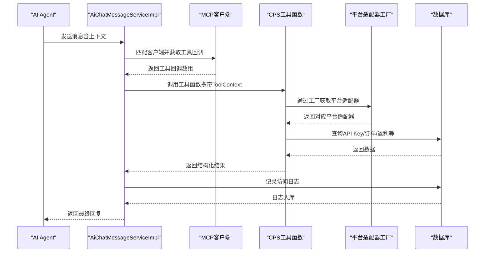

**图表来源**
- [AiChatMessageServiceImpl.java:127-425](file://backend/yudao-module-ai/src/main/java/cn/iocoder/yudao/module/ai/service/chat/AiChatMessageServiceImpl.java#L127-L425)
- [CpsSearchGoodsToolFunction.java:28-177](file://backend/yudao-module-cps/yudao-module-cps-biz/src/main/java/cn/iocoder/yudao/module/cps/mcp/tool/CpsSearchGoodsToolFunction.java#L28-L177)
- [CpsComparePricesToolFunction.java:30-176](file://backend/yudao-module-cps/yudao-module-cps-biz/src/main/java/cn/iocoder/yudao/module/cps/mcp/tool/CpsComparePricesToolFunction.java#L30-L176)
- [CpsGenerateLinkToolFunction.java:27-142](file://backend/yudao-module-cps/yudao-module-cps-biz/src/main/java/cn/iocoder/yudao/module/cps/mcp/tool/CpsGenerateLinkToolFunction.java#L27-L142)
- [CpsQueryOrdersToolFunction.java:33-169](file://backend/yudao-module-cps/yudao-module-cps-biz/src/main/java/cn/iocoder/yudao/module/cps/mcp/tool/CpsQueryOrdersToolFunction.java#L33-L169)
- [CpsGetRebateSummaryToolFunction.java:32-162](file://backend/yudao-module-cps/yudao-module-cps-biz/src/main/java/cn/iocoder/yudao/module/cps/mcp/tool/CpsGetRebateSummaryToolFunction.java#L32-L162)
- [CpsPlatformClientFactory.java:22-102](file://backend/yudao-module-cps/yudao-module-cps-biz/src/main/java/cn/iocoder/yudao/module/cps/client/CpsPlatformClientFactory.java#L22-L102)
- [CpsMcpAccessLogDO.java:22-62](file://backend/yudao-module-cps/yudao-module-cps-biz/src/main/java/cn/iocoder/yudao/module/cps/dal/dataobject/mcp/CpsMcpAccessLogDO.java#L22-L62)

## 详细组件分析

### 工具函数：商品搜索（cps_search_goods）
- 输入参数
  - keyword：关键词（必填）
  - platform_code：指定平台编码（可选）
  - page_size：返回数量（默认10，上限20）
  - price_min/price_max：价格区间过滤
- 输出
  - total：结果总数
  - goods：商品列表（含平台、标题、图片、原价、券后价、佣金、销量、goodsSign等）
- 关键逻辑
  - 校验关键词非空
  - 按平台或全平台搜索
  - 价格区间过滤
  - VO映射与返回

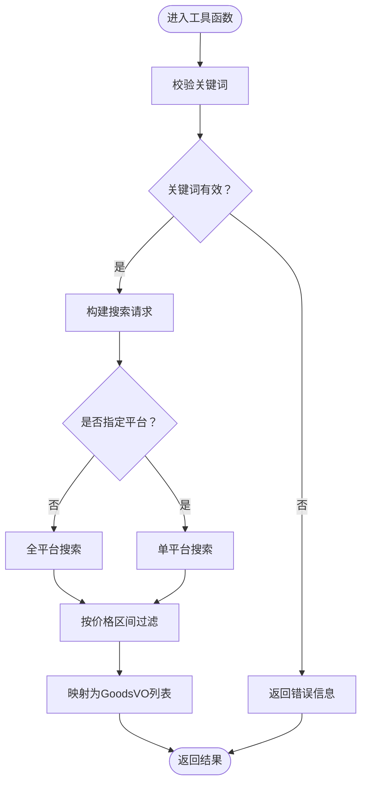

**图表来源**
- [CpsSearchGoodsToolFunction.java:120-174](file://backend/yudao-module-cps/yudao-module-cps-biz/src/main/java/cn/iocoder/yudao/module/cps/mcp/tool/CpsSearchGoodsToolFunction.java#L120-L174)

**章节来源**
- [CpsSearchGoodsToolFunction.java:28-177](file://backend/yudao-module-cps/yudao-module-cps-biz/src/main/java/cn/iocoder/yudao/module/cps/mcp/tool/CpsSearchGoodsToolFunction.java#L28-L177)

### 工具函数：多平台比价（cps_compare_prices）
- 输入参数
  - keyword：关键词（必填）
  - topN：每个平台返回前N条（默认5，上限10）
- 输出
  - total：参与比价商品总数
  - cheapest：价格最低
  - highestRebate：返利最高
  - bestValue：综合最优（实付价最低）
  - items：按实付价升序的完整列表
- 关键逻辑
  - 校验关键词
  - 全平台搜索并计算实付价（券后价 - 佣金）
  - 三类最优选择与排序

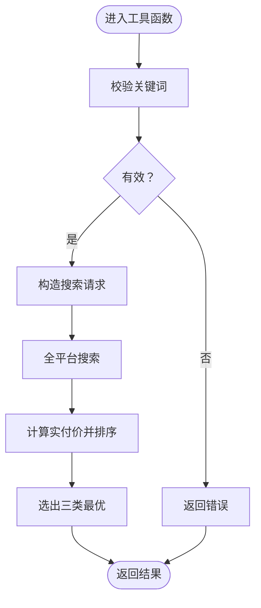

**图表来源**
- [CpsComparePricesToolFunction.java:113-173](file://backend/yudao-module-cps/yudao-module-cps-biz/src/main/java/cn/iocoder/yudao/module/cps/mcp/tool/CpsComparePricesToolFunction.java#L113-L173)

**章节来源**
- [CpsComparePricesToolFunction.java:30-176](file://backend/yudao-module-cps/yudao-module-cps-biz/src/main/java/cn/iocoder/yudao/module/cps/mcp/tool/CpsComparePricesToolFunction.java#L30-L176)

### 工具函数：生成推广链接（cps_generate_link）
- 输入参数
  - platform_code：平台编码（必填）
  - goods_id：平台商品ID（必填）
  - goods_sign：goodsSign（拼多多必填，其他可选）
  - member_id：会员ID（可选，缺省从ToolContext提取）
  - adzone_id：推广位ID（可选）
- 输出
  - shortUrl/longUrl/tpwd/mobileUrl：多种链接形式
  - actualPrice/commissionRate/commissionAmount：券后价、佣金比例与金额
  - couponInfo：券信息描述
- 关键逻辑
  - 校验必要参数
  - 从ToolContext提取登录用户ID
  - 调用服务生成推广链接并返回

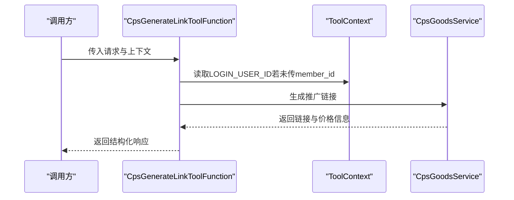

**图表来源**
- [CpsGenerateLinkToolFunction.java:97-139](file://backend/yudao-module-cps/yudao-module-cps-biz/src/main/java/cn/iocoder/yudao/module/cps/mcp/tool/CpsGenerateLinkToolFunction.java#L97-L139)

**章节来源**
- [CpsGenerateLinkToolFunction.java:27-142](file://backend/yudao-module-cps/yudao-module-cps-biz/src/main/java/cn/iocoder/yudao/module/cps/mcp/tool/CpsGenerateLinkToolFunction.java#L27-L142)

### 工具函数：订单查询（cps_query_orders）
- 输入参数
  - platformCode：平台编码（可选）
  - orderStatus：订单状态（可选）
  - pageNo/pageSize：分页（默认1/10，上限20）
- 输出
  - total：总记录数
  - orders：订单列表（含平台订单号、标题、主图、券后价、预估/实际返利、状态、返利入账时间、创建时间）
- 关键逻辑
  - 从ToolContext提取登录会员ID
  - 构造分页请求并查询订单
  - VO映射返回

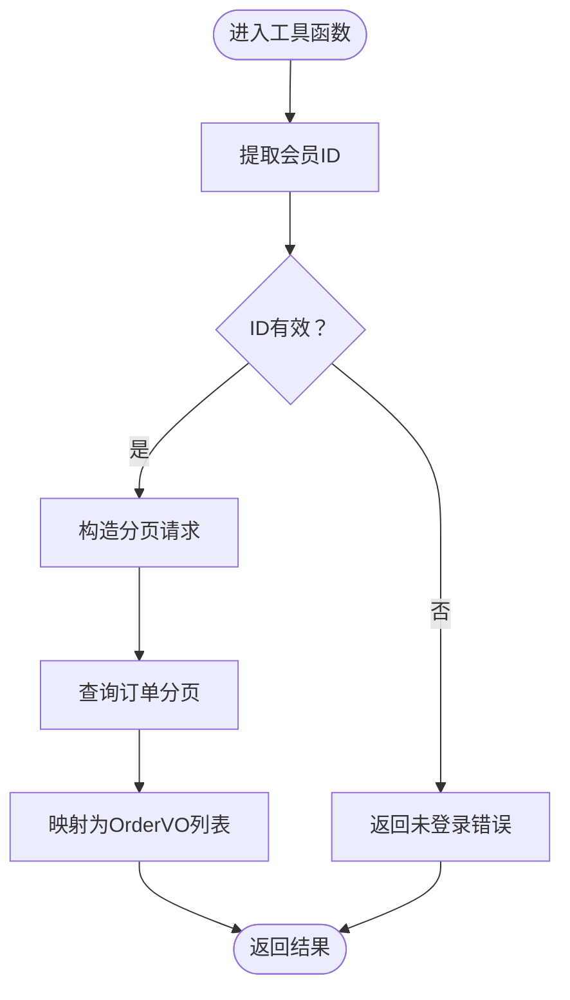

**图表来源**
- [CpsQueryOrdersToolFunction.java:120-157](file://backend/yudao-module-cps/yudao-module-cps-biz/src/main/java/cn/iocoder/yudao/module/cps/mcp/tool/CpsQueryOrdersToolFunction.java#L120-L157)

**章节来源**
- [CpsQueryOrdersToolFunction.java:33-169](file://backend/yudao-module-cps/yudao-module-cps-biz/src/main/java/cn/iocoder/yudao/module/cps/mcp/tool/CpsQueryOrdersToolFunction.java#L33-L169)

### 工具函数：返利汇总（cps_get_rebate_summary）
- 输入参数
  - recentCount：最近返利记录条数（默认5，上限20）
- 输出
  - availableBalance/frozenBalance/totalRebate/withdrawnAmount：可用/冻结/累计/已提现
  - accountStatus：账户状态
  - recentRecords：最近返利记录（含商品标题、平台编码、返利金额、类型、状态、时间）
- 关键逻辑
  - 从ToolContext提取登录会员ID
  - 获取或初始化返利账户
  - 查询最近返利记录并映射返回

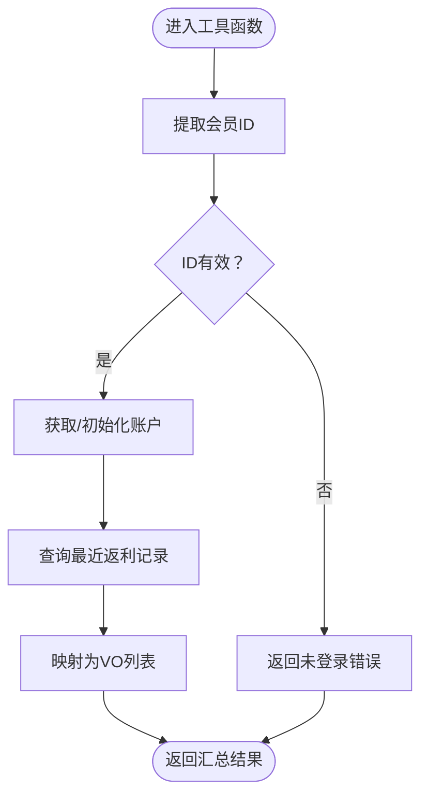

**图表来源**
- [CpsGetRebateSummaryToolFunction.java:107-149](file://backend/yudao-module-cps/yudao-module-cps-biz/src/main/java/cn/iocoder/yudao/module/cps/mcp/tool/CpsGetRebateSummaryToolFunction.java#L107-L149)

**章节来源**
- [CpsGetRebateSummaryToolFunction.java:32-162](file://backend/yudao-module-cps/yudao-module-cps-biz/src/main/java/cn/iocoder/yudao/module/cps/mcp/tool/CpsGetRebateSummaryToolFunction.java#L32-L162)

### 资源与凭证管理
- API Key管理
  - 字段：id/name/keyValue/description/status/expireTime/lastUseTime/useCount
  - Mapper提供按keyValue查询方法
- 访问日志
  - 字段：id/apiKeyId/toolName/requestParams/responseData/status/errorMessage/durationMs/clientIp
  - Mapper提供基础CRUD能力
- 管理后台功能
  - MCP服务状态、API Key管理、Tools配置、Resources管理、Prompts管理、访问日志、统计分析

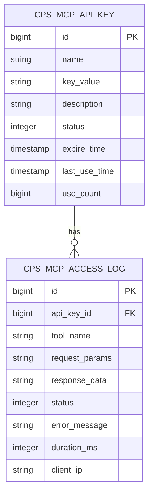

**图表来源**
- [CpsMcpApiKeyDO.java:24-60](file://backend/yudao-module-cps/yudao-module-cps-biz/src/main/java/cn/iocoder/yudao/module/cps/dal/dataobject/mcp/CpsMcpApiKeyDO.java#L24-L60)
- [CpsMcpAccessLogDO.java:22-62](file://backend/yudao-module-cps/yudao-module-cps-biz/src/main/java/cn/iocoder/yudao/module/cps/dal/dataobject/mcp/CpsMcpAccessLogDO.java#L22-L62)

**章节来源**
- [CpsMcpApiKeyDO.java:24-60](file://backend/yudao-module-cps/yudao-module-cps-biz/src/main/java/cn/iocoder/yudao/module/cps/dal/dataobject/mcp/CpsMcpApiKeyDO.java#L24-L60)
- [CpsMcpAccessLogDO.java:22-62](file://backend/yudao-module-cps/yudao-module-cps-biz/src/main/java/cn/iocoder/yudao/module/cps/dal/dataobject/mcp/CpsMcpAccessLogDO.java#L22-L62)
- [CpsMcpApiKeyMapper.java:13-19](file://backend/yudao-module-cps/yudao-module-cps-biz/src/main/java/cn/iocoder/yudao/module/cps/dal/mysql/mcp/CpsMcpApiKeyMapper.java#L13-L19)
- [CpsMcpAccessLogMapper.java:12-15](file://backend/yudao-module-cps/yudao-module-cps-biz/src/main/java/cn/iocoder/yudao/module/cps/dal/mysql/mcp/CpsMcpAccessLogMapper.java#L12-L15)
- [CPS系统PRD文档.md:694-737](file://docs/CPS系统PRD文档.md#L694-L737)

### 客户端集成与消息传递
- 安全配置
  - 自动放行MCP SSE与可流式HTTP端点，便于AI Agent连接
- 工具回调注册
  - 通过McpSyncClient匹配客户端，动态获取工具回调并注入AI服务
- 上下文管理
  - 历史消息按组倒序抽取，形成对话上下文，提升回复质量

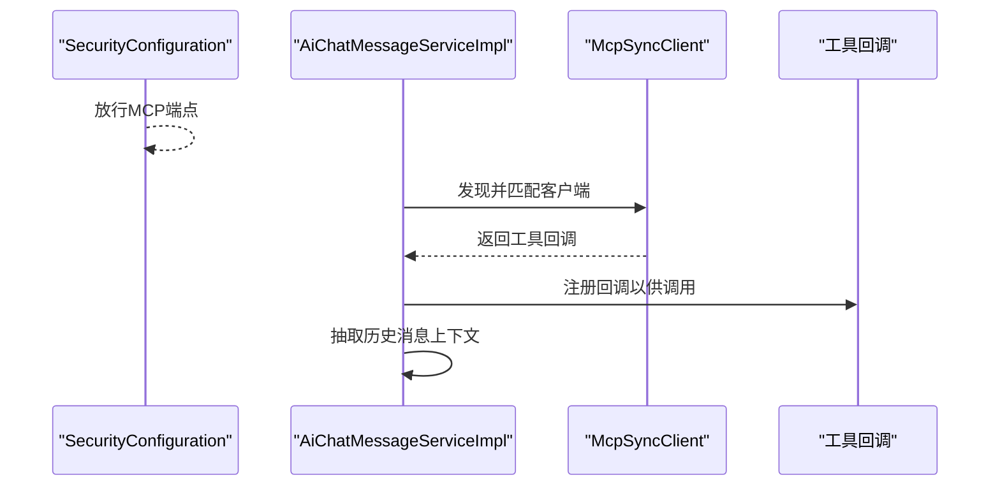

**图表来源**
- [SecurityConfiguration.java:25-40](file://backend/yudao-module-ai/src/main/java/cn/iocoder/yudao/module/ai/framework/security/config/SecurityConfiguration.java#L25-L40)
- [AiChatMessageServiceImpl.java:127-425](file://backend/yudao-module-ai/src/main/java/cn/iocoder/yudao/module/ai/service/chat/AiChatMessageServiceImpl.java#L127-L425)

**章节来源**
- [SecurityConfiguration.java:17-42](file://backend/yudao-module-ai/src/main/java/cn/iocoder/yudao/module/ai/framework/security/config/SecurityConfiguration.java#L17-L42)
- [AiChatMessageServiceImpl.java:127-425](file://backend/yudao-module-ai/src/main/java/cn/iocoder/yudao/module/ai/service/chat/AiChatMessageServiceImpl.java#L127-L425)

### 提示词模板与参数注入
- PRD文档定义了AI Agent端功能与交互模板，包括商品搜索、多平台比价、推广建议、订单追踪、返利咨询等
- 参数注入通过ToolContext实现，如登录用户ID键名约定，确保工具函数可按需读取上下文

**章节来源**
- [CPS系统PRD文档.md:356-373](file://docs/CPS系统PRD文档.md#L356-L373)
- [CpsGenerateLinkToolFunction.java:31-32](file://backend/yudao-module-cps/yudao-module-cps-biz/src/main/java/cn/iocoder/yudao/module/cps/mcp/tool/CpsGenerateLinkToolFunction.java#L31-L32)
- [CpsQueryOrdersToolFunction.java:37-37](file://backend/yudao-module-cps/yudao-module-cps-biz/src/main/java/cn/iocoder/yudao/module/cps/mcp/tool/CpsQueryOrdersToolFunction.java#L37-L37)
- [CpsGetRebateSummaryToolFunction.java:36-36](file://backend/yudao-module-cps/yudao-module-cps-biz/src/main/java/cn/iocoder/yudao/module/cps/mcp/tool/CpsGetRebateSummaryToolFunction.java#L36-L36)

## AI Agent推荐系统

### 个性化推荐功能
AI Agent推荐系统基于用户历史行为和偏好，提供智能化的商品推荐服务：

- **推荐算法**：基于用户浏览历史、购买记录、收藏行为等多维度数据
- **实时更新**：根据用户最新行为动态调整推荐策略
- **多维度排序**：综合考虑价格、返利、销量、评价等因素
- **A/B测试**：支持不同推荐策略的效果对比

### 价格趋势分析
提供商品价格变化趋势分析，帮助用户做出购买决策：

- **历史价格曲线**：展示商品历史价格变化趋势
- **价格预测**：基于机器学习模型预测未来价格走势
- **降价提醒**：当商品价格达到预设阈值时发送提醒
- **促销时机分析**：分析大促活动的最佳购买时机

### 返利优化建议
最大化用户返利收益的智能建议：

- **最优购买方案**：综合考虑价格和返利，推荐最优购买组合
- **返利计算器**：实时计算不同购买方案的返利收益
- **预算规划**：帮助用户合理规划购物预算和返利目标
- **风险评估**：评估不同购买方案的风险和收益

### 智能购物助手
全程协助用户完成购物流程：

- **购物清单管理**：帮助用户创建和管理购物清单
- **比价服务**：自动比较不同平台的价格和返利
- **优惠券整合**：整合各平台优惠券，提供最优使用策略
- **订单跟踪**：实时跟踪订单状态和返利进度

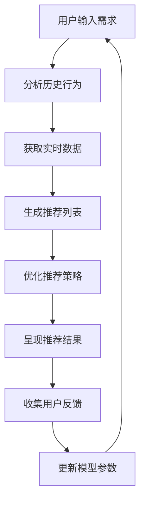

**图表来源**
- [CPS系统PRD文档.md:366-373](file://docs/CPS系统PRD文档.md#L366-L373)

**章节来源**
- [CPS系统PRD文档.md:356-373](file://docs/CPS系统PRD文档.md#L356-L373)

## 多平台协议支持

### 平台客户端工厂
平台客户端工厂采用策略模式，实现多平台的统一管理和动态注册：

- **自动注册**：所有实现了CpsPlatformClient接口的Bean自动注册到工厂
- **动态获取**：通过平台编码动态获取对应的适配器实例
- **状态管理**：管理平台的启用状态和配置信息
- **异常处理**：提供必需适配器的异常处理机制

### 平台枚举定义
定义支持的平台编码和名称，确保平台间的一致性：

- **平台编码**：taobao（淘宝）、jd（京东）、pdd（拼多多）、douyin（抖音）
- **平台名称**：提供友好的平台显示名称
- **数组支持**：支持平台编码数组的转换和验证
- **查找功能**：提供根据编码查找平台枚举的功能

### 平台适配器实现
各平台适配器实现统一的接口，提供平台特定的API调用：

- **淘宝适配器**：基于大淘客开放平台API，支持商品搜索、转链、订单查询
- **京东适配器**：基于大淘客开放平台聚合API，支持商品搜索、转链、订单查询
- **拼多多适配器**：基于大淘客开放平台聚合API，支持商品搜索、转链、订单查询
- **抖音适配器**：基于抖音联盟API，支持商品搜索、转链、订单查询

### 平台适配器特性
各平台适配器具有以下共同特性：

- **统一接口**：实现CpsPlatformClient接口，提供一致的API调用方式
- **配置管理**：通过CpsPlatformService获取平台配置信息
- **错误处理**：统一的异常处理和错误日志记录
- **连接测试**：提供平台连接测试功能
- **数据转换**：将平台API响应转换为统一的数据结构

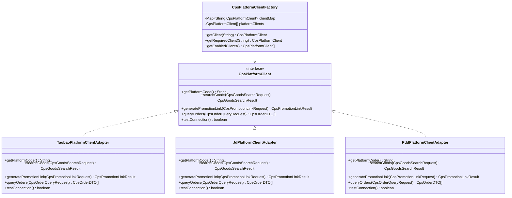

**图表来源**
- [CpsPlatformClientFactory.java:22-102](file://backend/yudao-module-cps/yudao-module-cps-biz/src/main/java/cn/iocoder/yudao/module/cps/client/CpsPlatformClientFactory.java#L22-L102)
- [CpsPlatformCodeEnum.java:14-45](file://backend/yudao-module-cps/yudao-module-cps-api/src/main/java/cn/iocoder/yudao/module/cps/enums/CpsPlatformCodeEnum.java#L14-L45)
- [TaobaoPlatformClientAdapter.java:29-336](file://backend/yudao-module-cps/yudao-module-cps-biz/src/main/java/cn/iocoder/yudao/module/cps/client/taobao/TaobaoPlatformClientAdapter.java#L29-336)
- [JdPlatformClientAdapter.java:26-292](file://backend/yudao-module-cps/yudao-module-cps-biz/src/main/java/cn/iocoder/yudao/module/cps/client/jd/JdPlatformClientAdapter.java#L26-292)
- [PddPlatformClientAdapter.java:25-320](file://backend/yudao-module-cps/yudao-module-cps-biz/src/main/java/cn/iocoder/yudao/module/cps/client/pdd/PddPlatformClientAdapter.java#L25-320)

**章节来源**
- [CpsPlatformClientFactory.java:22-102](file://backend/yudao-module-cps/yudao-module-cps-biz/src/main/java/cn/iocoder/yudao/module/cps/client/CpsPlatformClientFactory.java#L22-L102)
- [CpsPlatformCodeEnum.java:14-45](file://backend/yudao-module-cps/yudao-module-cps-api/src/main/java/cn/iocoder/yudao/module/cps/enums/CpsPlatformCodeEnum.java#L14-L45)
- [TaobaoPlatformClientAdapter.java:29-336](file://backend/yudao-module-cps/yudao-module-cps-biz/src/main/java/cn/iocoder/yudao/module/cps/client/taobao/TaobaoPlatformClientAdapter.java#L29-336)
- [JdPlatformClientAdapter.java:26-292](file://backend/yudao-module-cps/yudao-module-cps-biz/src/main/java/cn/iocoder/yudao/module/cps/client/jd/JdPlatformClientAdapter.java#L26-292)
- [PddPlatformClientAdapter.java:25-320](file://backend/yudao-module-cps/yudao-module-cps-biz/src/main/java/cn/iocoder/yudao/module/cps/client/pdd/PddPlatformClientAdapter.java#L25-320)

## 依赖分析
- 组件耦合
  - 工具函数依赖CPS服务层（商品搜索、订单查询、返利账户等）
  - 平台适配器依赖平台配置服务和外部API
  - AI服务依赖MCP客户端与工具回调解析器
  - 数据层通过Mapper访问API Key与访问日志表
- 外部依赖
  - Spring AI MCP Server相关属性用于端点放行
  - MyBatis基础Mapper提供通用CRUD能力
  - 各平台API依赖第三方开放平台服务

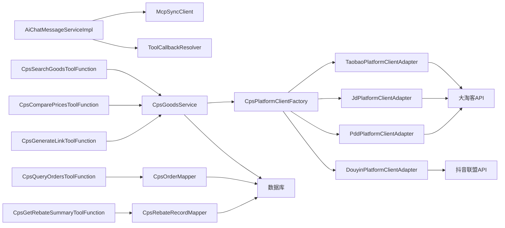

**图表来源**
- [AiChatMessageServiceImpl.java:127-425](file://backend/yudao-module-ai/src/main/java/cn/iocoder/yudao/module/ai/service/chat/AiChatMessageServiceImpl.java#L127-L425)
- [CpsSearchGoodsToolFunction.java:28-37](file://backend/yudao-module-cps/yudao-module-cps-biz/src/main/java/cn/iocoder/yudao/module/cps/mcp/tool/CpsSearchGoodsToolFunction.java#L28-L37)
- [CpsComparePricesToolFunction.java:30-35](file://backend/yudao-module-cps/yudao-module-cps-biz/src/main/java/cn/iocoder/yudao/module/cps/mcp/tool/CpsComparePricesToolFunction.java#L30-L35)
- [CpsGenerateLinkToolFunction.java:27-35](file://backend/yudao-module-cps/yudao-module-cps-biz/src/main/java/cn/iocoder/yudao/module/cps/mcp/tool/CpsGenerateLinkToolFunction.java#L27-L35)
- [CpsQueryOrdersToolFunction.java:33-40](file://backend/yudao-module-cps/yudao-module-cps-biz/src/main/java/cn/iocoder/yudao/module/cps/mcp/tool/CpsQueryOrdersToolFunction.java#L33-L40)
- [CpsGetRebateSummaryToolFunction.java:32-42](file://backend/yudao-module-cps/yudao-module-cps-biz/src/main/java/cn/iocoder/yudao/module/cps/mcp/tool/CpsGetRebateSummaryToolFunction.java#L32-L42)
- [CpsPlatformClientFactory.java:22-102](file://backend/yudao-module-cps/yudao-module-cps-biz/src/main/java/cn/iocoder/yudao/module/cps/client/CpsPlatformClientFactory.java#L22-L102)

**章节来源**
- [AiChatMessageServiceImpl.java:127-425](file://backend/yudao-module-ai/src/main/java/cn/iocoder/yudao/module/ai/service/chat/AiChatMessageServiceImpl.java#L127-L425)
- [CpsSearchGoodsToolFunction.java:28-37](file://backend/yudao-module-cps/yudao-module-cps-biz/src/main/java/cn/iocoder/yudao/module/cps/mcp/tool/CpsSearchGoodsToolFunction.java#L28-L37)
- [CpsComparePricesToolFunction.java:30-35](file://backend/yudao-module-cps/yudao-module-cps-biz/src/main/java/cn/iocoder/yudao/module/cps/mcp/tool/CpsComparePricesToolFunction.java#L30-L35)
- [CpsGenerateLinkToolFunction.java:27-35](file://backend/yudao-module-cps/yudao-module-cps-biz/src/main/java/cn/iocoder/yudao/module/cps/mcp/tool/CpsGenerateLinkToolFunction.java#L27-L35)
- [CpsQueryOrdersToolFunction.java:33-40](file://backend/yudao-module-cps/yudao-module-cps-biz/src/main/java/cn/iocoder/yudao/module/cps/mcp/tool/CpsQueryOrdersToolFunction.java#L33-L40)
- [CpsGetRebateSummaryToolFunction.java:32-42](file://backend/yudao-module-cps/yudao-module-cps-biz/src/main/java/cn/iocoder/yudao/module/cps/mcp/tool/CpsGetRebateSummaryToolFunction.java#L32-L42)
- [CpsPlatformClientFactory.java:22-102](file://backend/yudao-module-cps/yudao-module-cps-biz/src/main/java/cn/iocoder/yudao/module/cps/client/CpsPlatformClientFactory.java#L22-L102)

## 性能考量
- 工具函数参数限制
  - page_size/topN/pageNo等参数设置上限，避免高负载
  - 平台搜索限制每个平台的返回数量
- 数据过滤
  - 搜索阶段进行价格区间过滤，减少下游处理压力
  - 平台适配器内部进行数据过滤和转换
- 排序与聚合
  - 比价工具按券后价、佣金、实付价排序，建议在服务层做一次聚合，避免前端重复计算
  - 平台适配器提供排序和过滤功能
- 缓存策略（建议）
  - 对热点商品信息与平台配置进行缓存，结合TTL与失效策略
  - 对API Key与权限配置进行本地缓存，降低鉴权开销
  - 对平台配置和认证信息进行缓存
- 并发与限流
  - 基于API Key的限流配置（PRD中定义），结合令牌桶或漏桶算法
  - 平台适配器支持并发请求和重试机制
- 日志与监控
  - 访问日志记录耗时与状态，用于性能分析与告警
  - 平台适配器记录API调用日志和错误信息

## 故障排查指南
- 常见错误
  - 未登录或无法获取用户信息：工具函数在ToolContext缺失时返回明确错误
  - 关键参数为空：如关键词、平台编码、商品ID等
  - 平台适配器未找到：检查平台编码是否正确和平台是否启用
  - API调用失败：检查平台配置和网络连接
  - 查询异常：工具函数捕获异常并返回错误信息
- 日志定位
  - 访问日志包含工具名、请求参数、状态、错误信息、耗时、客户端IP，便于快速定位问题
  - 平台适配器记录详细的API调用日志和错误信息
- 安全与权限
  - 确认MCP端点已放行
  - 检查API Key状态与过期时间
  - 验证平台配置的正确性和有效性
- 上下文问题
  - 确保ToolContext中包含正确的登录用户ID键值
  - 检查AI Agent是否正确传递上下文信息

**章节来源**
- [CpsGenerateLinkToolFunction.java:97-139](file://backend/yudao-module-cps/yudao-module-cps-biz/src/main/java/cn/iocoder/yudao/module/cps/mcp/tool/CpsGenerateLinkToolFunction.java#L97-L139)
- [CpsQueryOrdersToolFunction.java:120-157](file://backend/yudao-module-cps/yudao-module-cps-biz/src/main/java/cn/iocoder/yudao/module/cps/mcp/tool/CpsQueryOrdersToolFunction.java#L120-L157)
- [CpsGetRebateSummaryToolFunction.java:107-149](file://backend/yudao-module-cps/yudao-module-cps-biz/src/main/java/cn/iocoder/yudao/module/cps/mcp/tool/CpsGetRebateSummaryToolFunction.java#L107-L149)
- [CpsMcpAccessLogDO.java:22-62](file://backend/yudao-module-cps/yudao-module-cps-biz/src/main/java/cn/iocoder/yudao/module/cps/dal/dataobject/mcp/CpsMcpAccessLogDO.java#L22-L62)
- [SecurityConfiguration.java:25-40](file://backend/yudao-module-ai/src/main/java/cn/iocoder/yudao/module/ai/framework/security/config/SecurityConfiguration.java#L25-L40)

## 结论
AgenticCPS通过MCP协议实现了AI Agent与CPS系统的无缝集成，提供开箱即用的工具集与完善的资源管理、安全与日志体系。新增的AI Agent推荐系统支持个性化推荐、价格趋势分析、返利优化建议等功能，进一步提升了用户体验。多平台协议支持包括淘宝、京东、拼多多、抖音四个主流电商平台，为用户提供全面的商品搜索和购买服务。

**更新** 完整的MCP协议集成现已扩展为包括AI Agent与CPS系统的无缝集成，提供5个开箱即用的工具集（商品搜索、多平台比价、生成推广链接、订单查询、返利汇总）与完善的管理后台功能（服务管理、API Key管理、Tools配置、Resources管理、Prompts管理、访问日志、统计分析）。新增AI Agent推荐系统，支持个性化推荐、价格趋势分析、返利优化建议等增强AI功能。多平台协议支持扩展为四个主流电商平台，提供更全面的服务覆盖。

建议在生产环境中完善缓存与限流策略，并持续利用访问日志进行性能与安全审计。

## 附录
- 快速参考
  - AI Agent零代码接入：通过标准MCP消息调用工具
  - 工具清单：商品搜索、多平台比价、生成推广链接、订单查询、返利汇总
  - 平台支持：淘宝、京东、拼多多、抖音
  - AI功能：个性化推荐、价格趋势分析、返利优化建议、智能购物助手
  - 管理后台：服务管理、API Key管理、Tools配置、Resources管理、Prompts管理、访问日志、统计分析

**章节来源**
- [application.yaml:199-210](file://backend/yudao-server/src/main/resources/application.yaml#L199-L210)
- [CPS系统PRD文档.md:343-373](file://docs/CPS系统PRD文档.md#L343-L373)
- [README.md:179-205](file://backend/README.md#L179-L205)
- [AGENTS.md:1-9](file://backend/AGENTS.md#L1-L9)