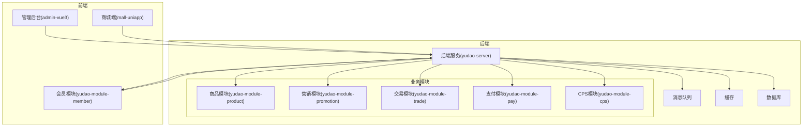
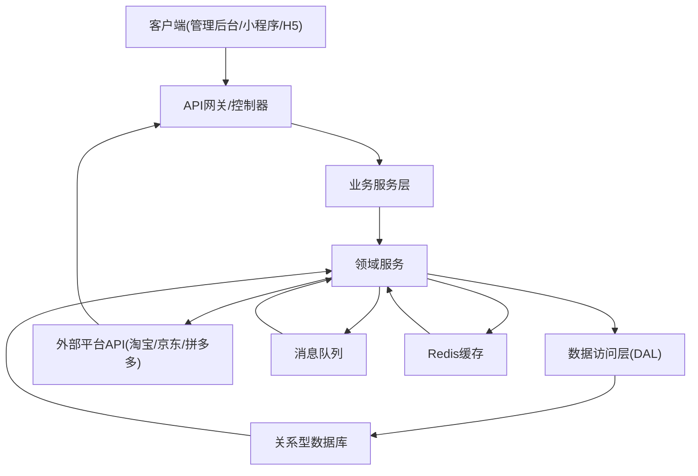
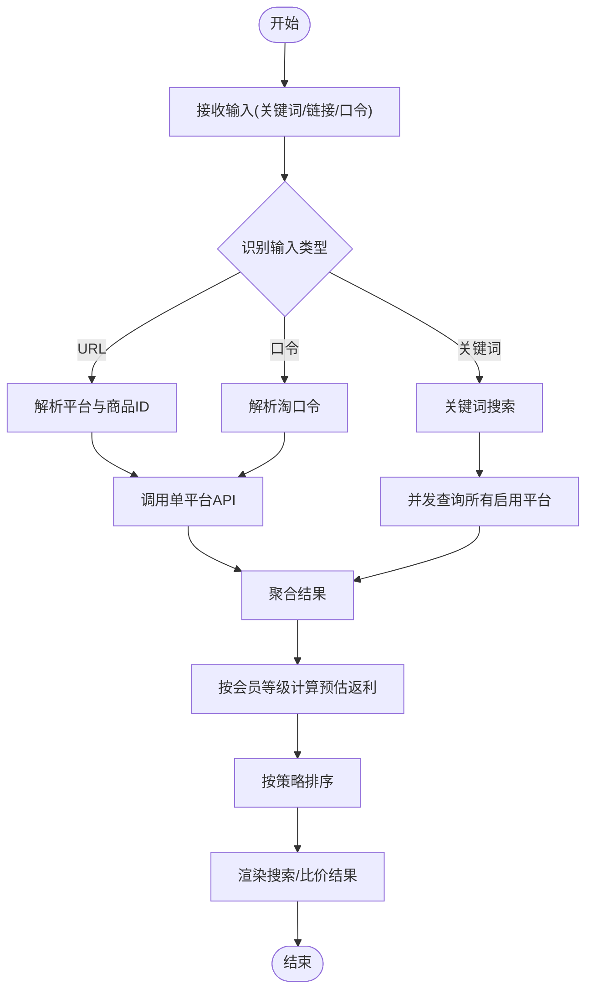
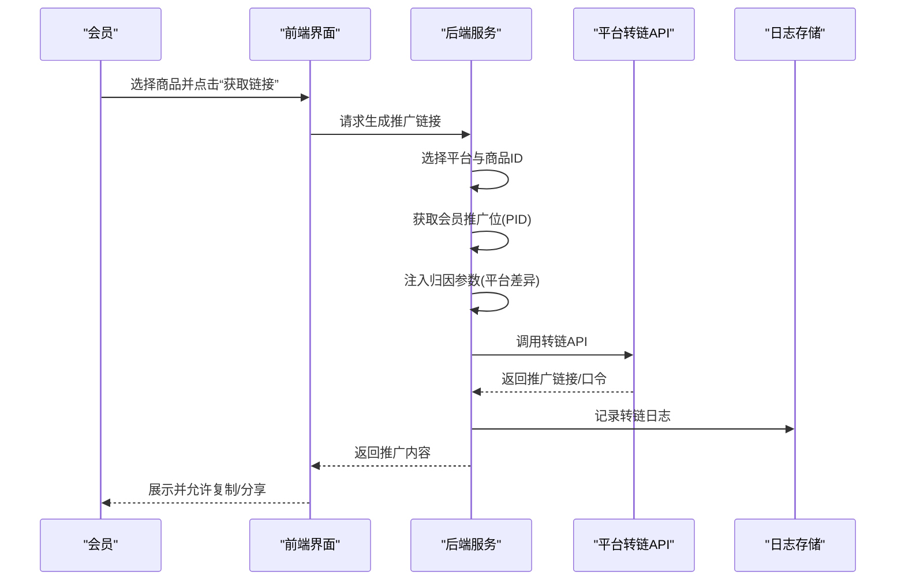
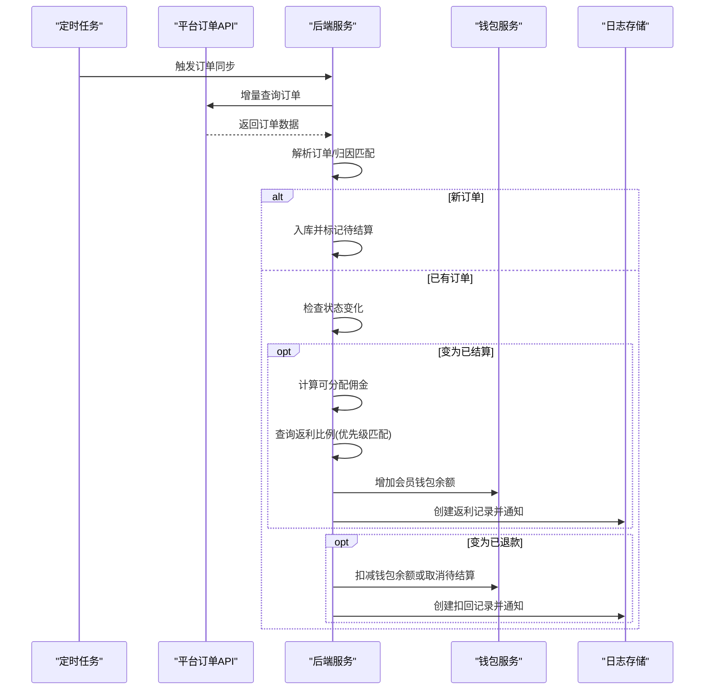
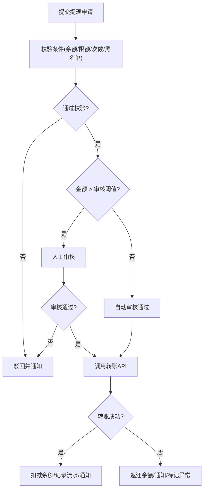
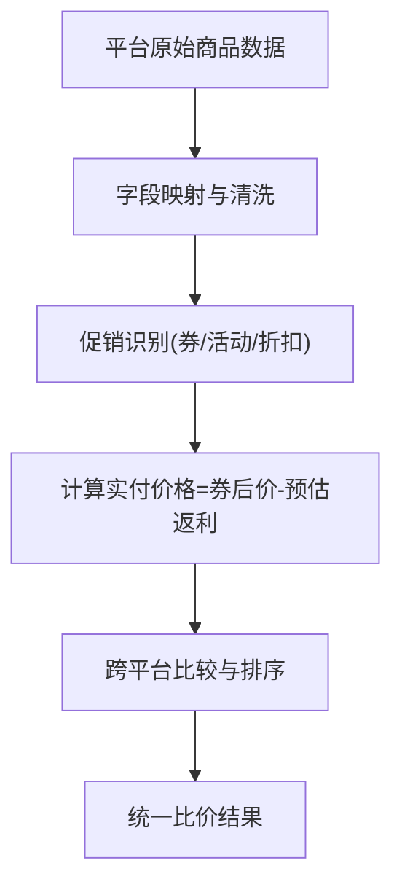
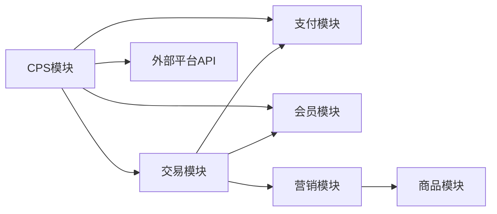

# 商品管理系统

<cite>
**本文引用的文件**
- [CPS系统PRD文档.md](file://docs/CPS系统PRD文档.md)
- [README.md](file://README.md)
</cite>

## 目录
1. [简介](#简介)
2. [项目结构](#项目结构)
3. [核心组件](#核心组件)
4. [架构总览](#架构总览)
5. [详细组件分析](#详细组件分析)
6. [依赖关系分析](#依赖关系分析)
7. [性能考虑](#性能考虑)
8. [故障排查指南](#故障排查指南)
9. [结论](#结论)
10. [附录](#附录)

## 简介
本文件面向“AgenticCPS”商品管理系统，围绕CPS商品信息管理展开，系统性梳理商品采集、数据清洗、价格监控、库存跟踪、多平台标准化处理、价格比较算法、促销活动识别、搜索与排序、导入导出与批量更新、数据质量监控、推荐与相似匹配、价格预警等能力。文档以PRD为权威依据，结合系统架构与业务流程，提供从概念到实现的完整技术说明。

## 项目结构
系统采用前后端分离与模块化架构，后端以多模块划分（如 mall、promotion、trade、pay、member 等），前端包含管理后台与多端应用（admin-uniapp、mall-uniapp 等）。CPS相关能力由 PRD 文档定义，涵盖商品搜索、多平台比价、推广链接生成、订单同步与结算、提现等核心流程。

**章节来源**
- [CPS系统PRD文档.md: 80-261:80-261](file://docs/CPS系统PRD文档.md#L80-L261)

## 核心组件
- 商品搜索与比价：支持关键词、链接/口令识别，多平台并发查询，统一结果聚合与排序。
- 推广链接生成：按平台差异注入归因参数，调用平台转链API，产出推广链接/口令。
- 订单同步与结算：定时任务增量拉取平台订单，进行归因匹配、状态变更处理、返利计算与入账。
- 提现管理：校验条件、自动/人工审核、转账打款、异常处理与通知。
- MCP AI Agent：通过MCP协议提供自然语言搜索、比价、订单追踪等增强能力。

**章节来源**
- [CPS系统PRD文档.md: 376-757:376-757](file://docs/CPS系统PRD文档.md#L376-L757)

## 架构总览
系统采用“前端 + 后端服务 + 业务模块 + 外部平台API + 存储与中间件”的分层架构。后端服务作为统一入口，对接商品、营销、交易、支付、会员、CPS等模块；通过消息队列异步处理订单同步；Redis用于缓存与会话；数据库承载持久化数据。

**图表来源**
- [CPS系统PRD文档.md: 80-261:80-261](file://docs/CPS系统PRD文档.md#L80-L261)

## 详细组件分析

### 商品搜索与多平台比价
- 输入识别：URL特征、淘口令特征、纯文本关键词。
- 并发查询：对启用平台并发调用，先到先展示，提升响应速度。
- 聚合与排序：按价格、销量、返利等维度排序，支持比价视图。
- 返利展示：按会员等级计算预估返利，未登录显示提示文案。

**图表来源**
- [CPS系统PRD文档.md: 121-150:121-150](file://docs/CPS系统PRD文档.md#L121-L150)

**章节来源**
- [CPS系统PRD文档.md: 378-448:378-448](file://docs/CPS系统PRD文档.md#L378-L448)

### 推广链接生成
- 商品选择与平台判定：确定平台与商品ID。
- 推广位获取：优先使用会员专属PID，否则使用平台默认PID。
- 归因参数注入：按平台差异注入adzone_id、subUnionId、custom_parameters等。
- 转链调用：调用平台转链API，产出推广链接与口令，记录日志。

**图表来源**
- [CPS系统PRD文档.md: 152-181:152-181](file://docs/CPS系统PRD文档.md#L152-L181)

**章节来源**
- [CPS系统PRD文档.md: 449-479:449-479](file://docs/CPS系统PRD文档.md#L449-L479)

### 订单同步与结算
- 定时任务：每5分钟触发，遍历启用平台，增量查询订单。
- 新增与更新：解析订单、匹配会员、入库；状态变化时更新。
- 结算与扣回：订单结算触发返利计算与入账；退款触发扣回或取消待结算。

**图表来源**
- [CPS系统PRD文档.md: 183-223:183-223](file://docs/CPS系统PRD文档.md#L183-L223)

**章节来源**
- [CPS系统PRD文档.md: 481-551:481-551](file://docs/CPS系统PRD文档.md#L481-L551)

### 提现流程
- 条件校验：余额、最低/最高限额、每日次数、黑名单。
- 申请与审核：自动阈值内通过，阈值外进入人工审核。
- 打款与异常：成功扣减余额并记录流水，失败返还余额并标记异常。

**图表来源**
- [CPS系统PRD文档.md: 225-261:225-261](file://docs/CPS系统PRD文档.md#L225-L261)

**章节来源**
- [CPS系统PRD文档.md: 552-551:552-551](file://docs/CPS系统PRD文档.md#L552-L551)

### 多平台商品数据标准化与价格比较
- 标准化策略：统一字段映射（标题、图片、券后价、销量、平台标识），缺失值处理与兜底策略。
- 价格比较算法：以“券后价 - 预估返利”作为实付成本，支持按实付最低、券后价最低、返利最高排序。
- 促销识别：通过平台提供的优惠券、活动标签、限时折扣等字段识别促销类型。

**图表来源**
- [CPS系统PRD文档.md: 417-448:417-448](file://docs/CPS系统PRD文档.md#L417-L448)

**章节来源**
- [CPS系统PRD文档.md: 417-448:417-448](file://docs/CPS系统PRD文档.md#L417-L448)

### 商品搜索实现原理与排序规则
- 搜索策略：关键词优先走多平台并发；URL/口令走平台识别与定向查询。
- 排序规则：综合、价格升/降、销量降、返利降。
- 异常处理：平台超时显示“暂时无法查询”，无结果提示更换关键词。

**章节来源**
- [CPS系统PRD文档.md: 378-416:378-416](file://docs/CPS系统PRD文档.md#L378-L416)

### 商品导入导出、批量更新与数据质量监控
- 导入导出：支持Excel批量导入商品基础信息与价格/库存，导出订单、返利明细、统计报表。
- 批量更新：支持批量修改价格、库存、返利比例、上下架状态。
- 数据质量监控：字段完整性校验、重复性检测、价格波动预警、库存异常提醒。

**章节来源**
- [CPS系统PRD文档.md: 306-342:306-342](file://docs/CPS系统PRD文档.md#L306-L342)

### 商品推荐与相似匹配、价格预警
- 推荐算法：基于热销、高佣、大额券等维度构建推荐频道；结合会员等级与偏好做个性化。
- 相似匹配：基于标题关键词、类目、品牌、价格区间进行近似匹配与去重。
- 价格预警：设置价格下限/上限阈值，价格突破时触发预警与通知。

**章节来源**
- [CPS系统PRD文档.md: 284-303:284-303](file://docs/CPS系统PRD文档.md#L284-L303)

## 依赖关系分析
- 模块耦合：商品、营销、交易、支付、会员、CPS模块围绕统一的订单生命周期协作；CPS模块依赖支付钱包能力。
- 外部依赖：对接淘宝/京东/拼多多等平台API，依赖消息队列进行异步处理。
- 数据一致性：通过定时任务与幂等设计保证订单状态一致；通过钱包服务保障返利入账一致性。

**图表来源**
- [CPS系统PRD文档.md: 80-261:80-261](file://docs/CPS系统PRD文档.md#L80-L261)

**章节来源**
- [CPS系统PRD文档.md: 80-261:80-261](file://docs/CPS系统PRD文档.md#L80-L261)

## 性能考虑
- 并发查询：多平台并发拉取，缩短首屏展示时间。
- 缓存策略：热点商品与搜索词缓存，降低数据库压力。
- 异步处理：订单同步与返利结算通过消息队列异步化，提升吞吐。
- 分页与排序：后端分页与索引优化，避免全表扫描。
- 超时与熔断：平台API超时与错误处理，保障用户体验。

## 故障排查指南
- 订单未归因：检查归因参数注入是否正确，核对会员PID与平台配置。
- 返利未入账：核查订单结算状态、平台服务费率、返利比例优先级。
- 提现失败：检查余额、限额、黑名单、转账接口返回码与账户状态。
- 搜索无结果：确认关键词有效性、平台API连通性、缓存是否异常。

**章节来源**
- [CPS系统PRD文档.md: 183-261:183-261](file://docs/CPS系统PRD文档.md#L183-L261)

## 结论
本系统以PRD为纲，围绕CPS商品管理的关键环节构建了完整的业务闭环：从商品搜索、多平台比价、推广链接生成，到订单同步、结算与提现，辅以AI Agent增强能力。通过标准化处理、价格比较算法、促销识别、推荐与预警机制，系统在提升用户体验的同时，也为运营提供了强大的数据支撑与可视化看板。

## 附录
- 术语说明：CPS（按销售额计费的联盟营销）、返利（佣金的一部分转入会员钱包）、PID（推广位标识）、归因（将订单与会员关联）。
- 参考文档：CPS系统PRD文档（v1.0）。

**章节来源**
- [CPS系统PRD文档.md: 1-800:1-800](file://docs/CPS系统PRD文档.md#L1-L800)