# 平台适配器系统

<cite>
**本文引用的文件**
- [CpsPlatformCodeEnum.java](file://backend/yudao-module-cps/yudao-module-cps-api/src/main/java/cn/iocoder/yudao/module/cps/enums/CpsPlatformCodeEnum.java)
- [CpsVendorCodeEnum.java](file://backend/yudao-module-cps/yudao-module-cps-api/src/main/java/cn/iocoder/yudao/module/cps/enums/CpsVendorCodeEnum.java)
- [CpsErrorCodeConstants.java](file://backend/yudao-module-cps/yudao-module-cps-api/src/main/java/cn/iocoder/yudao/module/cps/enums/CpsErrorCodeConstants.java)
- [CpsAdzoneTypeEnum.java](file://backend/yudao-module-cps/yudao-module-cps-api/src/main/java/cn/iocoder/yudao/module/cps/enums/CpsAdzoneTypeEnum.java)
- [CpsOrderStatusEnum.java](file://backend/yudao-module-cps/yudao-module-cps-api/src/main/java/cn/iocoder/yudao/module/cps/enums/CpsOrderStatusEnum.java)
- [CpsPlatformService.java](file://backend/yudao-module-cps/yudao-module-cps-biz/src/main/java/cn/iocoder/yudao/module/cps/service/platform/CpsPlatformService.java)
- [CpsPlatformServiceImpl.java](file://backend/yudao-module-cps/yudao-module-cps-biz/src/main/java/cn/iocoder/yudao/module/cps/service/platform/CpsPlatformServiceImpl.java)
- [CpsPlatformMapper.java](file://backend/yudao-module-cps/yudao-module-cps-biz/src/main/java/cn/iocoder/yudao/module/cps/dal/mysql/platform/CpsPlatformMapper.java)
- [CpsPlatformDO.java](file://backend/yudao-module-cps/yudao-module-cps-biz/src/main/java/cn/iocoder/yudao/module/cps/dal/dataobject/platform/CpsPlatformDO.java)
- [CpsCacheConfig.java](file://backend/yudao-module-cps/yudao-module-cps-biz/src/main/java/cn/iocoder/yudao/module/cps/config/CpsCacheConfig.java)
- [CpsPlatformClient.java](file://backend/yudao-module-cps/yudao-module-cps-biz/src/main/java/cn/iocoder/yudao/module/cps/client/CpsPlatformClient.java)
- [CpsApiVendorClient.java](file://backend/yudao-module-cps/yudao-module-cps-biz/src/main/java/cn/iocoder/yudao/module/cps/client/CpsApiVendorClient.java)
- [CpsPlatformClientFactory.java](file://backend/yudao-module-cps/yudao-module-cps-biz/src/main/java/cn/iocoder/yudao/module/cps/client/CpsPlatformClientFactory.java)
- [CpsVendorConfig.java](file://backend/yudao-module-cps/yudao-module-cps-biz/src/main/java/cn/iocoder/yudao/module/cps/client/dto/CpsVendorConfig.java)
- [TaobaoPlatformClientAdapter.java](file://backend/yudao-module-cps/yudao-module-cps-biz/src/main/java/cn/iocoder/yudao/module/cps/client/taobao/TaobaoPlatformClientAdapter.java)
- [JdPlatformClientAdapter.java](file://backend/yudao-module-cps/yudao-module-cps-biz/src/main/java/cn/iocoder/yudao/module/cps/client/jd/JdPlatformClientAdapter.java)
- [PddPlatformClientAdapter.java](file://backend/yudao-module-cps/yudao-module-cps-biz/src/main/java/cn/iocoder/yudao/module/cps/client/pdd/PddPlatformClientAdapter.java)
- [DouyinPlatformClientAdapter.java](file://backend/yudao-module-cps/yudao-module-cps-biz/src/main/java/cn/iocoder/yudao/module/cps/client/douyin/DouyinPlatformClientAdapter.java)
- [DouyinOfficialVendorClient.java](file://backend/yudao-module-cps/yudao-module-cps-biz/src/main/java/cn/iocoder/yudao/module/cps/client/official/douyin/DouyinOfficialVendorClient.java)
- [CpsGoodsSearchRequest.java](file://backend/yudao-module-cps/yudao-module-cps-biz/src/main/java/cn/iocoder/yudao/module/cps/client/dto/CpsGoodsSearchRequest.java)
- [CpsPromotionLinkRequest.java](file://backend/yudao-module-cps/yudao-module-cps-biz/src/main/java/cn/iocoder/yudao/module/cps/client/dto/CpsPromotionLinkRequest.java)
- [CpsOrderQueryRequest.java](file://backend/yudao-module-cps/yudao-module-cps-biz/src/main/java/cn/iocoder/yudao/module/cps/client/dto/CpsOrderQueryRequest.java)
- [CpsGoodsItem.java](file://backend/yudao-module-cps/yudao-module-cps-biz/src/main/java/cn/iocoder/yudao/module/cps/client/dto/CpsGoodsItem.java)
- [CpsOrderDTO.java](file://backend/yudao-module-cps/yudao-module-cps-biz/src/main/java/cn/iocoder/yudao/module/cps/client/dto/CpsOrderDTO.java)
- [CpsPromotionLinkResult.java](file://backend/yudao-module-cps/yudao-module-cps-biz/src/main/java/cn/iocoder/yudao/module/cps/client/dto/CpsPromotionLinkResult.java)
- [CpsGoodsSearchResult.java](file://backend/yudao-module-cps/yudao-module-cps-biz/src/main/java/cn/iocoder/yudao/module/cps/client/dto/CpsGoodsSearchResult.java)
- [CpsApiVendorDO.java](file://backend/yudao-module-cps/yudao-module-cps-biz/src/main/java/cn/iocoder/yudao/module/cps/dal/dataobject/vendor/CpsApiVendorDO.java)
- [CommonStatusEnum.java](file://backend/yudao-framework/yudao-framework-common/src/main/java/cn/iocoder/yudao/framework/common/enums/CommonStatusEnum.java)
- [ArrayValuable.java](file://backend/yudao-framework/yudao-framework-common/src/main/java/cn/iocoder/yudao/framework/common/core/ArrayValuable.java)
- [ErrorCode.java](file://backend/yudao-framework/yudao-framework-common/src/main/java/cn/iocoder/yudao/framework/common/exception/ErrorCode.java)
- [PageResult.java](file://backend/yudao-framework/yudao-framework-common/src/main/java/cn/iocoder/yudao/framework/common/pojo/PageResult.java)
- [BeanUtils.java](file://backend/yudao-framework/yudao-framework-common/src/main/java/cn/iocoder/yudao/framework/common/util/object/BeanUtils.java)
- [Cacheable.java](file://backend/yudao-framework/yudao-framework-common/src/main/java/org/springframework/cache/annotation/Cacheable.java)
- [CacheEvict.java](file://backend/yudao-framework/yudao-framework-common/src/main/java/org/springframework/cache/annotation/CacheEvict.java)
- [CpsPlatformPageReqVO.java](file://backend/yudao-module-cps/yudao-module-cps-api/src/main/java/cn/iocoder/yudao/module/cps/controller/admin/platform/vo/CpsPlatformPageReqVO.java)
- [CpsPlatformSaveReqVO.java](file://backend/yudao-module-cps/yudao-module-cps-api/src/main/java/cn/iocoder/yudao/module/cps/controller/admin/platform/vo/CpsPlatformSaveReqVO.java)
</cite>

## 更新摘要
**所做更改**
- 升级平台适配器系统为支持多供应商架构，新增供应商维度路由功能
- CpsPlatformClientFactory现在支持vendorCode:platformCode双维度路由，替代原有单一平台维度路由
- 新增CpsApiVendorClient接口和CpsVendorConfig配置DTO
- 新增供应商枚举CpsVendorCodeEnum，支持大淘客、好单库、官方API等供应商
- 更新抖音适配器为委托模式，通过工厂获取当前激活的供应商客户端
- 新增供应商配置数据对象CpsApiVendorDO，支持多供应商配置管理

## 目录
1. [引言](#引言)
2. [项目结构](#项目结构)
3. [核心组件](#核心组件)
4. [架构总览](#架构总览)
5. [详细组件分析](#详细组件分析)
6. [平台适配器实现](#平台适配器实现)
7. [统一接口层设计](#统一接口层设计)
8. [供应商多维度路由](#供应商多维度路由)
9. [依赖分析](#依赖分析)
10. [性能考虑](#性能考虑)
11. [故障排查指南](#故障排查指南)
12. [结论](#结论)
13. [附录](#附录)

## 引言
本文件全面阐述CPS多平台适配器系统的深度技术架构，系统性介绍平台抽象层设计、统一接口定义、平台差异处理策略，以及对主流电商（淘宝、京东、拼多多、抖音）的完整适配实现。文档涵盖授权机制、签名算法、请求限流、错误处理、平台配置管理、动态切换与故障转移、跨平台数据一致性、性能优化与监控告警等关键技术细节，并提供新平台接入的开发指南与测试验证方法。

**更新** 系统现已升级为支持多供应商架构，采用"策略模式 + 工厂模式 + 双维度路由"的复合架构设计，支持同一电商平台对接多个API供应商，实现了真正的可插拔多供应商适配能力。

## 项目结构
CPS模块采用"接口层-服务层-数据访问层-适配器层-DTO层"的分层组织方式，平台配置与业务逻辑集中在biz模块，API与枚举在api模块，公共框架能力来自yudao-framework，适配器层负责具体的平台集成。

```mermaid
graph TB
subgraph "API 层"
A1["CpsPlatformCodeEnum<br/>平台编码枚举"]
A2["CpsVendorCodeEnum<br/>供应商编码枚举"]
A3["CpsErrorCodeConstants<br/>错误码常量"]
A4["CpsAdzoneTypeEnum<br/>推广位类型枚举"]
A5["CpsOrderStatusEnum<br/>订单状态枚举"]
end
subgraph "服务层"
S1["CpsPlatformService<br/>接口"]
S2["CpsPlatformServiceImpl<br/>实现"]
end
subgraph "适配器层"
AD1["CpsPlatformClient<br/>平台策略接口"]
AD2["CpsApiVendorClient<br/>供应商策略接口"]
AD3["CpsPlatformClientFactory<br/>双维度工厂"]
AD4["TaobaoPlatformClientAdapter<br/>淘宝适配器"]
AD5["JdPlatformClientAdapter<br/>京东适配器"]
AD6["PddPlatformClientAdapter<br/>拼多多适配器"]
AD7["DouyinPlatformClientAdapter<br/>抖音适配器"]
end
subgraph "DTO层"
D1["CpsGoodsSearchRequest<br/>商品搜索请求"]
D2["CpsPromotionLinkRequest<br/>推广链接请求"]
D3["CpsOrderQueryRequest<br/>订单查询请求"]
D4["CpsGoodsItem<br/>商品信息DTO"]
D5["CpsOrderDTO<br/>订单DTO"]
D6["CpsPromotionLinkResult<br/>推广链接结果"]
D7["CpsGoodsSearchResult<br/>商品搜索结果"]
D8["CpsVendorConfig<br/>供应商配置DTO"]
end
subgraph "数据访问层"
D9["CpsPlatformMapper<br/>平台Mapper"]
D10["CpsPlatformDO<br/>平台DO"]
D11["CpsApiVendorDO<br/>供应商配置DO"]
end
subgraph "配置与缓存"
C1["CpsCacheConfig<br/>缓存配置"]
end
subgraph "公共框架"
F1["CommonStatusEnum<br/>通用状态"]
F2["ArrayValuable<br/>数组值接口"]
F3["ErrorCode<br/>错误码"]
F4["PageResult<br/>分页结果"]
F5["BeanUtils<br/>Bean 工具"]
F6["Cacheable/CacheEvict<br/>缓存注解"]
end
A1 --> S2
A2 --> AD3
S1 --> S2
S2 --> AD3
AD3 --> AD4
AD3 --> AD5
AD3 --> AD6
AD3 --> AD7
AD1 --> AD4
AD1 --> AD5
AD1 --> AD6
AD1 --> AD7
AD2 --> AD4
AD2 --> AD5
AD2 --> AD6
AD2 --> AD7
AD4 --> D1
AD4 --> D2
AD4 --> D3
AD4 --> D4
AD4 --> D5
AD4 --> D6
AD4 --> D7
AD5 --> D1
AD5 --> D2
AD5 --> D3
AD5 --> D4
AD5 --> D5
AD5 --> D6
AD5 --> D7
AD6 --> D1
AD6 --> D2
AD6 --> D3
AD6 --> D4
AD6 --> D5
AD6 --> D6
AD6 --> D7
AD7 --> D1
AD7 --> D2
AD7 --> D3
AD7 --> D4
AD7 --> D5
AD7 --> D6
AD7 --> D7
AD7 --> D8
S2 --> D9
D9 --> D10
S2 --> D11
S2 --> C1
S2 --> F1
S2 --> F2
S2 --> F3
S2 --> F4
S2 --> F5
S2 --> F6
```

**图表来源**
- [CpsPlatformCodeEnum.java:1-45](file://backend/yudao-module-cps/yudao-module-cps-api/src/main/java/cn/iocoder/yudao/module/cps/enums/CpsPlatformCodeEnum.java#L1-L45)
- [CpsVendorCodeEnum.java:1-52](file://backend/yudao-module-cps/yudao-module-cps-api/src/main/java/cn/iocoder/yudao/module/cps/enums/CpsVendorCodeEnum.java#L1-L52)
- [CpsPlatformService.java:1-53](file://backend/yudao-module-cps/yudao-module-cps-biz/src/main/java/cn/iocoder/yudao/module/cps/service/platform/CpsPlatformService.java#L1-L53)
- [CpsPlatformServiceImpl.java:1-35](file://backend/yudao-module-cps/yudao-module-cps-biz/src/main/java/cn/iocoder/yudao/module/cps/service/platform/CpsPlatformServiceImpl.java#L1-L35)
- [CpsPlatformClient.java:1-55](file://backend/yudao-module-cps/yudao-module-cps-biz/src/main/java/cn/iocoder/yudao/module/cps/client/CpsPlatformClient.java#L1-L55)
- [CpsApiVendorClient.java:1-84](file://backend/yudao-module-cps/yudao-module-cps-biz/src/main/java/cn/iocoder/yudao/module/cps/client/CpsApiVendorClient.java#L1-L84)
- [CpsPlatformClientFactory.java:1-198](file://backend/yudao-module-cps/yudao-module-cps-biz/src/main/java/cn/iocoder/yudao/module/cps/client/CpsPlatformClientFactory.java#L1-L198)
- [CpsVendorConfig.java:1-65](file://backend/yudao-module-cps/yudao-module-cps-biz/src/main/java/cn/iocoder/yudao/module/cps/client/dto/CpsVendorConfig.java#L1-L65)

**章节来源**
- [CpsPlatformCodeEnum.java:1-45](file://backend/yudao-module-cps/yudao-module-cps-api/src/main/java/cn/iocoder/yudao/module/cps/enums/CpsPlatformCodeEnum.java#L1-L45)
- [CpsVendorCodeEnum.java:1-52](file://backend/yudao-module-cps/yudao-module-cps-api/src/main/java/cn/iocoder/yudao/module/cps/enums/CpsVendorCodeEnum.java#L1-L52)
- [CpsPlatformService.java:1-53](file://backend/yudao-module-cps/yudao-module-cps-biz/src/main/java/cn/iocoder/yudao/module/cps/service/platform/CpsPlatformService.java#L1-L53)
- [CpsPlatformServiceImpl.java:1-35](file://backend/yudao-module-cps/yudao-module-cps-biz/src/main/java/cn/iocoder/yudao/module/cps/service/platform/CpsPlatformServiceImpl.java#L1-L35)
- [CpsPlatformClient.java:1-55](file://backend/yudao-module-cps/yudao-module-cps-biz/src/main/java/cn/iocoder/yudao/module/cps/client/CpsPlatformClient.java#L1-L55)
- [CpsApiVendorClient.java:1-84](file://backend/yudao-module-cps/yudao-module-cps-biz/src/main/java/cn/iocoder/yudao/module/cps/client/CpsApiVendorClient.java#L1-L84)
- [CpsPlatformClientFactory.java:1-198](file://backend/yudao-module-cps/yudao-module-cps-biz/src/main/java/cn/iocoder/yudao/module/cps/client/CpsPlatformClientFactory.java#L1-L198)
- [CpsVendorConfig.java:1-65](file://backend/yudao-module-cps/yudao-module-cps-biz/src/main/java/cn/iocoder/yudao/module/cps/client/dto/CpsVendorConfig.java#L1-L65)

## 核心组件
- **平台编码与枚举**：统一管理平台标识与名称，支持数组化查询与按编码检索，现已支持淘宝、京东、拼多多、抖音四大平台。
- **供应商编码与枚举**：统一管理API供应商标识，支持大淘客、好单库、官方API等供应商类型，支持聚合平台与官方API区分。
- **错误码常量**：集中定义CPS系统各模块错误码段落，便于统一异常处理与国际化。
- **推广位类型与订单状态**：标准化推广位与订单生命周期状态，支撑跨平台一致化展示与流转。
- **平台配置服务**：提供平台创建、更新、删除、分页查询、启用列表与按编码缓存查询能力。
- **平台客户端策略接口**：定义统一的平台适配器接口，支持商品搜索、推广链接生成、订单查询、连接测试等核心能力。
- **供应商客户端策略接口**：定义统一的供应商适配器接口，支持按供应商×平台双维度路由，面向底层实现。
- **平台客户端工厂**：基于Spring Bean自动注入机制，实现平台适配器的动态注册与管理，现支持双维度路由。
- **供应商配置DTO**：封装供应商运行时配置，包括API Key、Secret、基础URL、授权令牌等参数。
- **平台适配器实现**：针对淘宝、京东、拼多多、抖音四个主流电商平台的具体适配实现，封装各自的SDK或HTTP客户端。
- **统一DTO接口层**：提供平台无关的数据传输对象，屏蔽各平台的字段差异。
- **数据访问层**：基于MyBatis-Plus的Mapper与DO，支撑平台配置与供应商配置持久化。
- **缓存配置**：通过注解式缓存提升平台配置读取性能。

**章节来源**
- [CpsPlatformCodeEnum.java:1-45](file://backend/yudao-module-cps/yudao-module-cps-api/src/main/java/cn/iocoder/yudao/module/cps/enums/CpsPlatformCodeEnum.java#L1-L45)
- [CpsVendorCodeEnum.java:1-52](file://backend/yudao-module-cps/yudao-module-cps-api/src/main/java/cn/iocoder/yudao/module/cps/enums/CpsVendorCodeEnum.java#L1-L52)
- [CpsErrorCodeConstants.java:1-65](file://backend/yudao-module-cps/yudao-module-cps-api/src/main/java/cn/iocoder/yudao/module/cps/enums/CpsErrorCodeConstants.java#L1-L65)
- [CpsAdzoneTypeEnum.java:1-40](file://backend/yudao-module-cps/yudao-module-cps-api/src/main/java/cn/iocoder/yudao/module/cps/enums/CpsAdzoneTypeEnum.java#L1-L40)
- [CpsOrderStatusEnum.java:1-48](file://backend/yudao-module-cps/yudao-module-cps-api/src/main/java/cn/iocoder/yudao/module/cps/enums/CpsOrderStatusEnum.java#L1-L48)
- [CpsPlatformService.java:1-53](file://backend/yudao-module-cps/yudao-module-cps-biz/src/main/java/cn/iocoder/yudao/module/cps/service/platform/CpsPlatformService.java#L1-L53)
- [CpsPlatformServiceImpl.java:1-35](file://backend/yudao-module-cps/yudao-module-cps-biz/src/main/java/cn/iocoder/yudao/module/cps/service/platform/CpsPlatformServiceImpl.java#L1-L35)
- [CpsPlatformClient.java:1-55](file://backend/yudao-module-cps/yudao-module-cps-biz/src/main/java/cn/iocoder/yudao/module/cps/client/CpsPlatformClient.java#L1-L55)
- [CpsApiVendorClient.java:1-84](file://backend/yudao-module-cps/yudao-module-cps-biz/src/main/java/cn/iocoder/yudao/module/cps/client/CpsApiVendorClient.java#L1-L84)
- [CpsPlatformClientFactory.java:1-198](file://backend/yudao-module-cps/yudao-module-cps-biz/src/main/java/cn/iocoder/yudao/module/cps/client/CpsPlatformClientFactory.java#L1-L198)
- [CpsVendorConfig.java:1-65](file://backend/yudao-module-cps/yudao-module-cps-biz/src/main/java/cn/iocoder/yudao/module/cps/client/dto/CpsVendorConfig.java#L1-L65)

## 架构总览
平台适配器系统采用"统一抽象 + 策略实现 + 工厂管理 + 双维度路由"的核心架构，通过以下层次协同工作：
- **抽象层**：平台编码、供应商编码、枚举、错误码、状态机等统一定义，屏蔽平台与供应商差异。
- **适配层**：基于策略模式的平台客户端接口和供应商客户端接口，面向具体平台与供应商的SDK或HTTP客户端封装，负责签名、限流、重试、错误映射与数据转换。
- **工厂层**：基于Spring Bean自动注入机制的平台客户端工厂，实现适配器的动态注册与管理，现支持vendorCode:platformCode双维度路由。
- **服务层**：平台配置管理、推广位管理、订单同步、返利计算与提现流程编排。
- **DTO层**：统一的数据传输对象，屏蔽各平台字段差异，提供平台无关的接口。
- **数据层**：平台配置、推广位、订单、返利、账户、风控、供应商配置等数据模型与持久化。
- **运维层**：缓存、限流、熔断、监控与告警，保障高可用与可观测性。

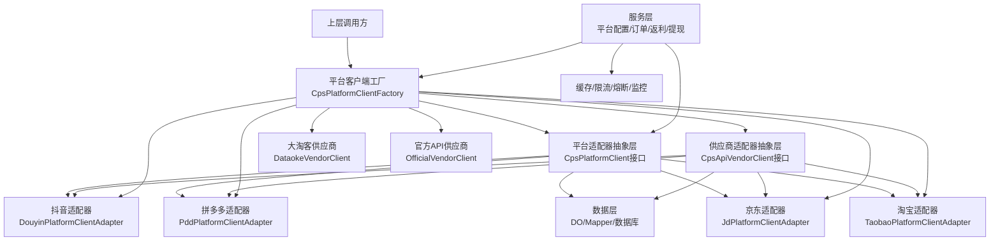

**图表来源**
- [CpsPlatformClient.java:1-55](file://backend/yudao-module-cps/yudao-module-cps-biz/src/main/java/cn/iocoder/yudao/module/cps/client/CpsPlatformClient.java#L1-L55)
- [CpsApiVendorClient.java:1-84](file://backend/yudao-module-cps/yudao-module-cps-biz/src/main/java/cn/iocoder/yudao/module/cps/client/CpsApiVendorClient.java#L1-L84)
- [CpsPlatformClientFactory.java:1-198](file://backend/yudao-module-cps/yudao-module-cps-biz/src/main/java/cn/iocoder/yudao/module/cps/client/CpsPlatformClientFactory.java#L1-L198)
- [TaobaoPlatformClientAdapter.java:1-336](file://backend/yudao-module-cps/yudao-module-cps-biz/src/main/java/cn/iocoder/yudao/module/cps/client/taobao/TaobaoPlatformClientAdapter.java#L1-L336)
- [JdPlatformClientAdapter.java:1-292](file://backend/yudao-module-cps/yudao-module-cps-biz/src/main/java/cn/iocoder/yudao/module/cps/client/jd/JdPlatformClientAdapter.java#L1-L292)
- [PddPlatformClientAdapter.java:1-320](file://backend/yudao-module-cps/yudao-module-cps-biz/src/main/java/cn/iocoder/yudao/module/cps/client/pdd/PddPlatformClientAdapter.java#L1-L320)
- [DouyinPlatformClientAdapter.java:1-64](file://backend/yudao-module-cps/yudao-module-cps-biz/src/main/java/cn/iocoder/yudao/module/cps/client/douyin/DouyinPlatformClientAdapter.java#L1-L64)

## 详细组件分析

### 平台配置服务组件
- **角色定位**：提供平台配置的增删改查、分页、启用列表与按编码缓存查询。
- **关键特性**：
  - 唯一性校验：平台编码唯一，避免重复。
  - 缓存策略：按平台编码缓存查询结果，更新时主动失效。
  - 分页与状态过滤：支持按状态筛选启用平台。
  - **新增**：activeVendorCode字段支持供应商激活配置。
- **错误处理**：未找到平台、编码冲突等场景抛出对应错误码。

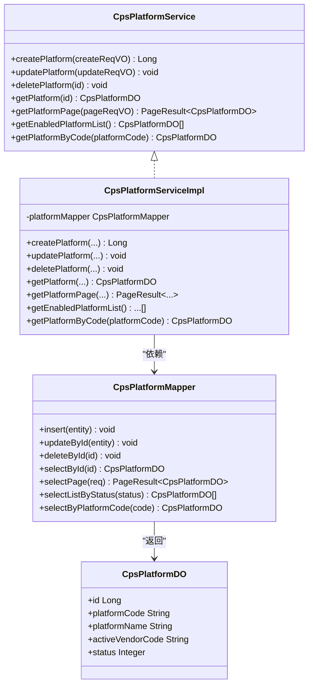

**图表来源**
- [CpsPlatformService.java:1-53](file://backend/yudao-module-cps/yudao-module-cps-biz/src/main/java/cn/iocoder/yudao/module/cps/service/platform/CpsPlatformService.java#L1-L53)
- [CpsPlatformServiceImpl.java:1-35](file://backend/yudao-module-cps/yudao-module-cps-biz/src/main/java/cn/iocoder/yudao/module/cps/service/platform/CpsPlatformServiceImpl.java#L1-L35)
- [CpsPlatformMapper.java](file://backend/yudao-module-cps/yudao-module-cps-biz/src/main/java/cn/iocoder/yudao/module/cps/dal/mysql/platform/CpsPlatformMapper.java)
- [CpsPlatformDO.java](file://backend/yudao-module-cps/yudao-module-cps-biz/src/main/java/cn/iocoder/yudao/module/cps/dal/dataobject/platform/CpsPlatformDO.java)

**章节来源**
- [CpsPlatformService.java:1-53](file://backend/yudao-module-cps/yudao-module-cps-biz/src/main/java/cn/iocoder/yudao/module/cps/service/platform/CpsPlatformService.java#L1-L53)
- [CpsPlatformServiceImpl.java:1-35](file://backend/yudao-module-cps/yudao-module-cps-biz/src/main/java/cn/iocoder/yudao/module/cps/service/platform/CpsPlatformServiceImpl.java#L1-L35)

### 平台客户端工厂组件
- **角色定位**：基于Spring Bean自动注入机制，实现平台适配器的动态注册与管理，现支持双维度路由。
- **关键特性**：
  - 自动注册：所有实现了CpsPlatformClient的Bean在启动时自动注册到工厂。
  - **新增**：供应商客户端自动注册，支持vendorCode:platformCode双维度路由。
  - 动态获取：根据平台编码动态获取对应的适配器实例。
  - **新增**：getVendorClient()支持供应商×平台双维度获取。
  - **新增**：getActiveVendorClient()根据平台配置获取激活的供应商客户端。
  - **新增**：getActiveVendorConfig()获取供应商运行时配置。
  - 状态过滤：支持获取已启用平台的客户端列表。
- **错误处理**：未找到适配器时返回null或抛出IllegalArgumentException。

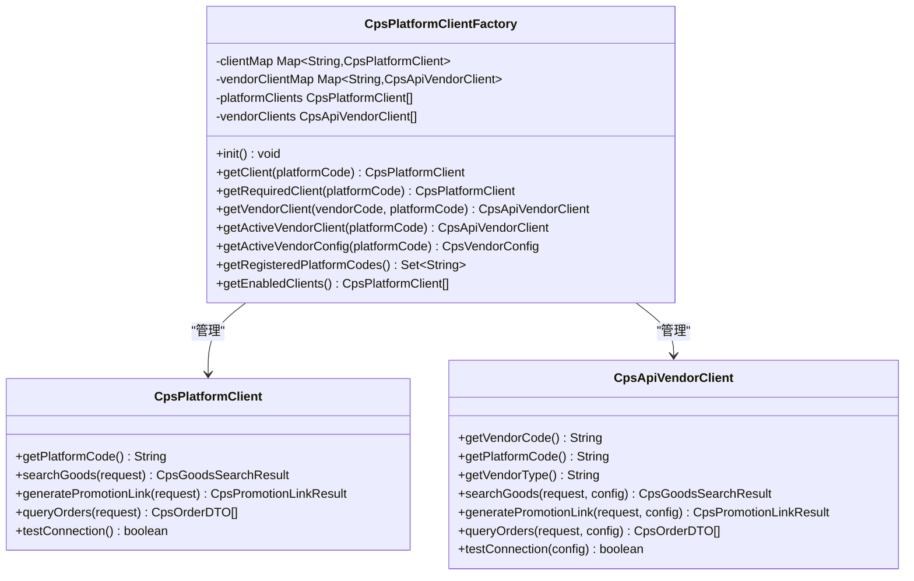

**图表来源**
- [CpsPlatformClientFactory.java:1-198](file://backend/yudao-module-cps/yudao-module-cps-biz/src/main/java/cn/iocoder/yudao/module/cps/client/CpsPlatformClientFactory.java#L1-L198)
- [CpsPlatformClient.java:1-55](file://backend/yudao-module-cps/yudao-module-cps-biz/src/main/java/cn/iocoder/yudao/module/cps/client/CpsPlatformClient.java#L1-L55)
- [CpsApiVendorClient.java:1-84](file://backend/yudao-module-cps/yudao-module-cps-biz/src/main/java/cn/iocoder/yudao/module/cps/client/CpsApiVendorClient.java#L1-L84)

**章节来源**
- [CpsPlatformClientFactory.java:1-198](file://backend/yudao-module-cps/yudao-module-cps-biz/src/main/java/cn/iocoder/yudao/module/cps/client/CpsPlatformClientFactory.java#L1-L198)
- [CpsPlatformClient.java:1-55](file://backend/yudao-module-cps/yudao-module-cps-biz/src/main/java/cn/iocoder/yudao/module/cps/client/CpsPlatformClient.java#L1-L55)
- [CpsApiVendorClient.java:1-84](file://backend/yudao-module-cps/yudao-module-cps-biz/src/main/java/cn/iocoder/yudao/module/cps/client/CpsApiVendorClient.java#L1-L84)

### 平台配置缓存流程
- **查询流程**：先查缓存，命中则返回；未命中则查数据库并回填缓存。
- **更新流程**：更新后按平台编码主动失效缓存，确保后续查询读到最新配置。

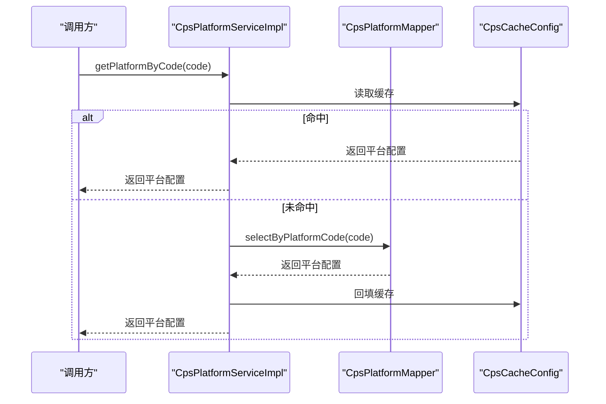

**图表来源**
- [CpsPlatformServiceImpl.java:80-84](file://backend/yudao-module-cps/yudao-module-cps-biz/src/main/java/cn/iocoder/yudao/module/cps/service/platform/CpsPlatformServiceImpl.java#L80-L84)
- [CpsCacheConfig.java](file://backend/yudao-module-cps/yudao-module-cps-biz/src/main/java/cn/iocoder/yudao/module/cps/config/CpsCacheConfig.java)

**章节来源**
- [CpsPlatformServiceImpl.java:80-84](file://backend/yudao-module-cps/yudao-module-cps-biz/src/main/java/cn/iocoder/yudao/module/cps/service/platform/CpsPlatformServiceImpl.java#L80-L84)

## 平台适配器实现

### 淘宝联盟适配器
淘宝适配器基于大淘客开放平台API，实现了完整的商品搜索、推广链接生成、订单查询等功能，采用MD5签名算法和统一的参数格式。

- **核心功能**：
  - 商品搜索：支持关键词搜索、价格区间、排序方式、优惠券筛选
  - 推广链接：支持淘宝客PID、渠道ID、外部ID等参数
  - 订单查询：支持按创建时间、付款时间、结算时间等维度查询
- **签名机制**：MD5签名，包含appKey、timer、nonce、signRan等参数
- **数据转换**：统一转换为平台无关的DTO对象

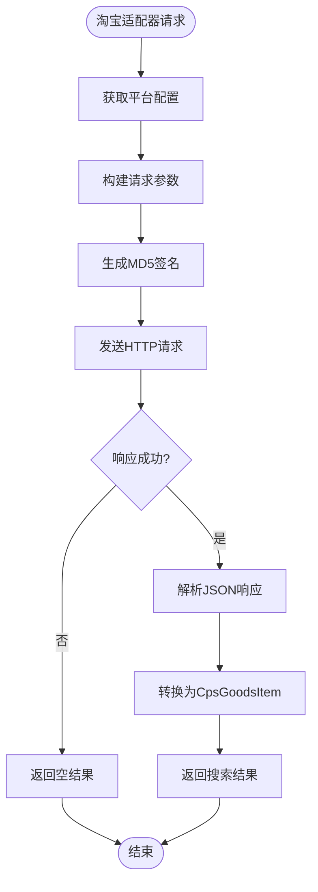

**图表来源**
- [TaobaoPlatformClientAdapter.java:50-102](file://backend/yudao-module-cps/yudao-module-cps-biz/src/main/java/cn/iocoder/yudao/module/cps/client/taobao/TaobaoPlatformClientAdapter.java#L50-L102)
- [TaobaoPlatformClientAdapter.java:214-252](file://backend/yudao-module-cps/yudao-module-cps-biz/src/main/java/cn/iocoder/yudao/module/cps/client/taobao/TaobaoPlatformClientAdapter.java#L214-L252)

**章节来源**
- [TaobaoPlatformClientAdapter.java:1-336](file://backend/yudao-module-cps/yudao-module-cps-biz/src/main/java/cn/iocoder/yudao/module/cps/client/taobao/TaobaoPlatformClientAdapter.java#L1-L336)

### 京东联盟适配器
京东适配器同样基于大淘客开放平台API，针对京东联盟的特点进行了专门的参数映射和数据转换。

- **核心功能**：
  - 商品搜索：支持关键词、价格区间、优惠券筛选
  - 推广链接：支持materialId（商品详情页链接）或skuId拼接
  - 订单查询：支持unionId认证和订单状态过滤
- **特殊处理**：京东联盟使用unionId存储在authToken字段中

**章节来源**
- [JdPlatformClientAdapter.java:1-292](file://backend/yudao-module-cps/yudao-module-cps-biz/src/main/java/cn/iocoder/yudao/module/cps/client/jd/JdPlatformClientAdapter.java#L1-L292)

### 拼多多联盟适配器
拼多多适配器基于大淘客开放平台API，处理了拼多多特有的价格单位（分）和佣金比例（千分比）转换。

- **核心功能**：
  - 商品搜索：支持关键词、排序方式、优惠券筛选
  - 推广链接：支持goodsSign（拼多多专用）
  - 订单查询：支持默认推广位和分页查询
- **数据转换**：
  - 价格单位转换：从分转换为元
  - 佣金比例转换：从千分比转换为百分比

**章节来源**
- [PddPlatformClientAdapter.java:1-320](file://backend/yudao-module-cps/yudao-module-cps-biz/src/main/java/cn/iocoder/yudao/module/cps/client/pdd/PddPlatformClientAdapter.java#L1-L320)

### 抖店联盟适配器
**更新** 抖店联盟适配器采用委托模式，通过CpsPlatformClientFactory获取当前激活的供应商客户端，实现多供应商支持。

- **委托模式**：通过工厂获取当前激活的供应商客户端，委托执行具体的API调用
- **多供应商支持**：支持大淘客供应商和官方API供应商两种实现
- **配置驱动**：通过平台配置的activeVendorCode字段切换供应商
- **当前状态**：官方API供应商已实现，大淘客供应商为桩实现

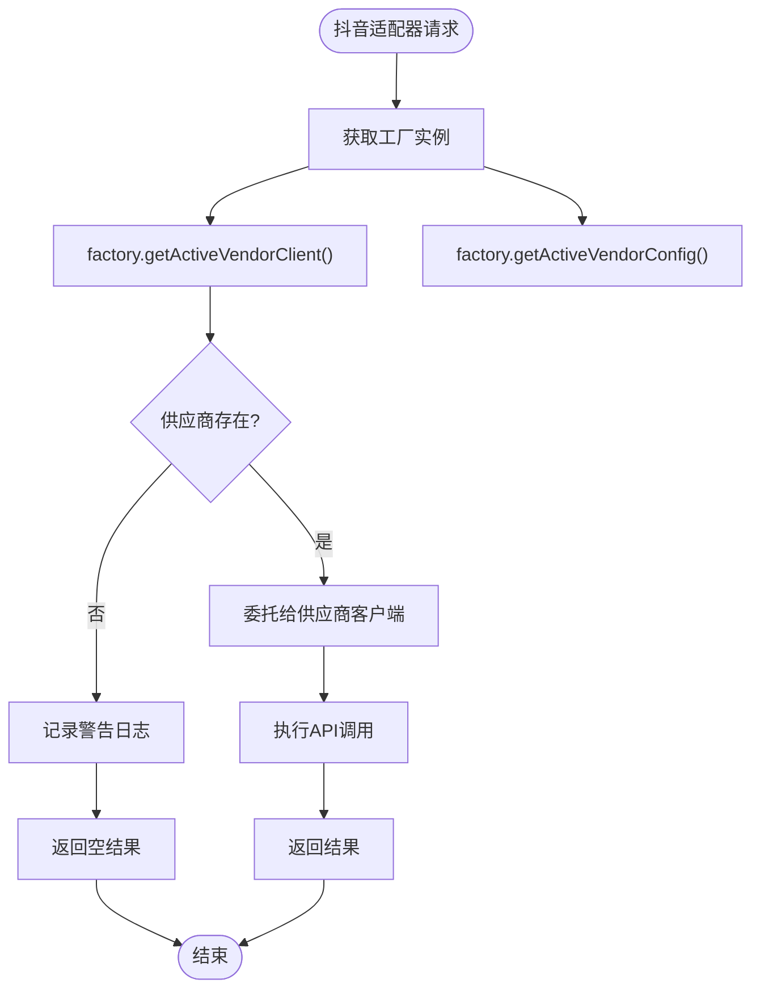

**图表来源**
- [DouyinPlatformClientAdapter.java:38-64](file://backend/yudao-module-cps/yudao-module-cps-biz/src/main/java/cn/iocoder/yudao/module/cps/client/douyin/DouyinPlatformClientAdapter.java#L38-L64)
- [CpsPlatformClientFactory.java:160-189](file://backend/yudao-module-cps/yudao-module-cps-biz/src/main/java/cn/iocoder/yudao/module/cps/client/CpsPlatformClientFactory.java#L160-L189)

**章节来源**
- [DouyinPlatformClientAdapter.java:1-64](file://backend/yudao-module-cps/yudao-module-cps-biz/src/main/java/cn/iocoder/yudao/module/cps/client/douyin/DouyinPlatformClientAdapter.java#L1-L64)
- [CpsPlatformClientFactory.java:160-189](file://backend/yudao-module-cps/yudao-module-cps-biz/src/main/java/cn/iocoder/yudao/module/cps/client/CpsPlatformClientFactory.java#L160-L189)

## 统一接口层设计

### 平台无关的DTO设计
系统通过统一的DTO接口层，屏蔽各平台的字段差异，提供平台无关的操作接口。

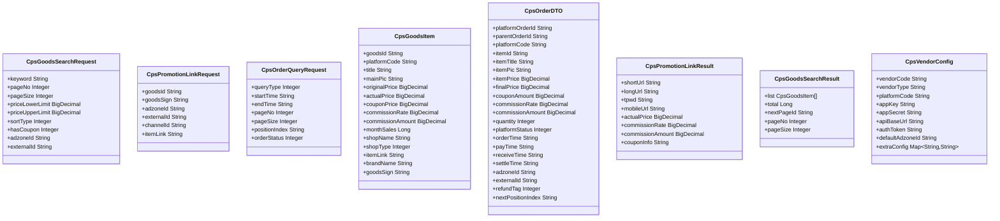

**图表来源**
- [CpsGoodsSearchRequest.java:1-61](file://backend/yudao-module-cps/yudao-module-cps-biz/src/main/java/cn/iocoder/yudao/module/cps/client/dto/CpsGoodsSearchRequest.java#L1-L61)
- [CpsPromotionLinkRequest.java:1-44](file://backend/yudao-module-cps/yudao-module-cps-biz/src/main/java/cn/iocoder/yudao/module/cps/client/dto/CpsPromotionLinkRequest.java#L1-L44)
- [CpsOrderQueryRequest.java:1-49](file://backend/yudao-module-cps/yudao-module-cps-biz/src/main/java/cn/iocoder/yudao/module/cps/client/dto/CpsOrderQueryRequest.java#L1-L49)
- [CpsGoodsItem.java:1-93](file://backend/yudao-module-cps/yudao-module-cps-biz/src/main/java/cn/iocoder/yudao/module/cps/client/dto/CpsGoodsItem.java#L1-L93)
- [CpsOrderDTO.java:1-123](file://backend/yudao-module-cps/yudao-module-cps-biz/src/main/java/cn/iocoder/yudao/module/cps/client/dto/CpsOrderDTO.java#L1-L123)
- [CpsPromotionLinkResult.java:1-58](file://backend/yudao-module-cps/yudao-module-cps-biz/src/main/java/cn/iocoder/yudao/module/cps/client/dto/CpsPromotionLinkResult.java#L1-L58)
- [CpsGoodsSearchResult.java:1-43](file://backend/yudao-module-cps/yudao-module-cps-biz/src/main/java/cn/iocoder/yudao/module/cps/client/dto/CpsGoodsSearchResult.java#L1-L43)
- [CpsVendorConfig.java:1-65](file://backend/yudao-module-cps/yudao-module-cps-biz/src/main/java/cn/iocoder/yudao/module/cps/client/dto/CpsVendorConfig.java#L1-L65)

### 平台差异处理策略
- **统一接口**：所有平台都实现CpsPlatformClient接口，提供一致的方法签名
- **参数映射**：在适配器内部处理各平台参数差异，对外暴露统一的DTO
- **数据转换**：统一价格单位、佣金比例等数值转换
- **状态对齐**：将不同平台的订单状态映射到统一的状态机
- **供应商隔离**：通过CpsApiVendorClient接口隔离供应商差异

**章节来源**
- [CpsPlatformClient.java:1-55](file://backend/yudao-module-cps/yudao-module-cps-biz/src/main/java/cn/iocoder/yudao/module/cps/client/CpsPlatformClient.java#L1-L55)
- [CpsApiVendorClient.java:1-84](file://backend/yudao-module-cps/yudao-module-cps-biz/src/main/java/cn/iocoder/yudao/module/cps/client/CpsApiVendorClient.java#L1-L84)
- [CpsPlatformCodeEnum.java:1-45](file://backend/yudao-module-cps/yudao-module-cps-api/src/main/java/cn/iocoder/yudao/module/cps/enums/CpsPlatformCodeEnum.java#L1-L45)

## 供应商多维度路由

### 双维度路由架构
**更新** 系统现支持vendorCode:platformCode双维度路由，通过CpsPlatformClientFactory实现供应商级路由。

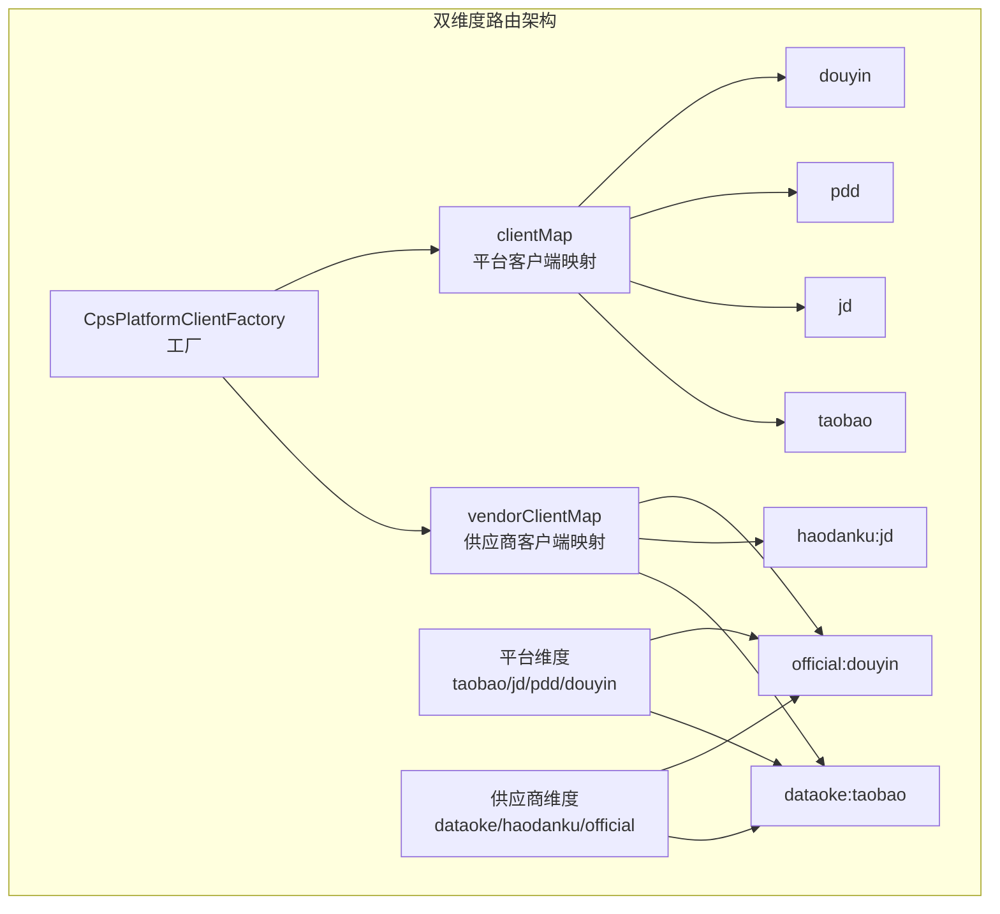

**图表来源**
- [CpsPlatformClientFactory.java:35-40](file://backend/yudao-module-cps/yudao-module-cps-biz/src/main/java/cn/iocoder/yudao/module/cps/client/CpsPlatformClientFactory.java#L35-L40)
- [CpsPlatformClientFactory.java:143-171](file://backend/yudao-module-cps/yudao-module-cps-biz/src/main/java/cn/iocoder/yudao/module/cps/client/CpsPlatformClientFactory.java#L143-L171)

### 供应商配置管理
**更新** 新增供应商配置数据对象，支持多供应商配置管理。

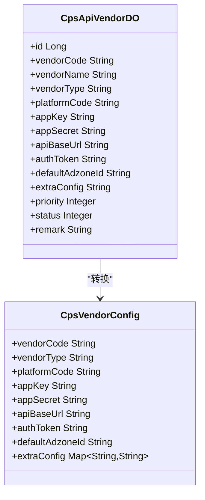

**图表来源**
- [CpsApiVendorDO.java:1-86](file://backend/yudao-module-cps/yudao-module-cps-biz/src/main/java/cn/iocoder/yudao/module/cps/dal/dataobject/vendor/CpsApiVendorDO.java#L1-L86)
- [CpsVendorConfig.java:1-65](file://backend/yudao-module-cps/yudao-module-cps-biz/src/main/java/cn/iocoder/yudao/module/cps/client/dto/CpsVendorConfig.java#L1-L65)

### 供应商枚举管理
**更新** 新增供应商枚举，支持聚合平台与官方API区分。

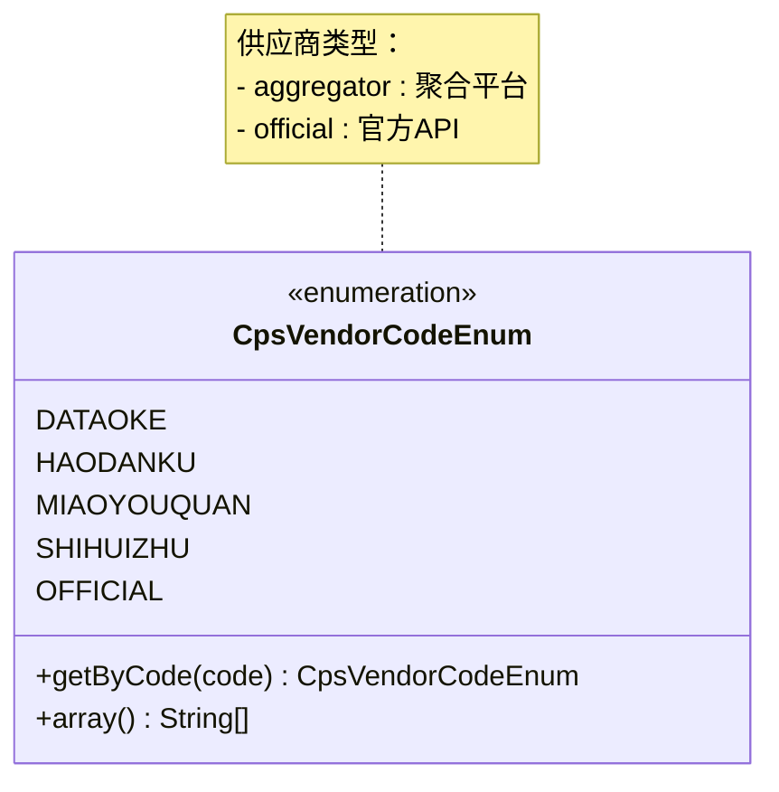

**图表来源**
- [CpsVendorCodeEnum.java:18-25](file://backend/yudao-module-cps/yudao-module-cps-api/src/main/java/cn/iocoder/yudao/module/cps/enums/CpsVendorCodeEnum.java#L18-L25)

### 供应商客户端实现
**更新** 新增供应商客户端接口，支持配置驱动的供应商实现。

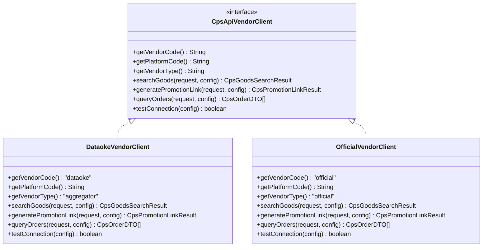

**图表来源**
- [CpsApiVendorClient.java:25-84](file://backend/yudao-module-cps/yudao-module-cps-biz/src/main/java/cn/iocoder/yudao/module/cps/client/CpsApiVendorClient.java#L25-L84)
- [DouyinOfficialVendorClient.java:23-35](file://backend/yudao-module-cps/yudao-module-cps-biz/src/main/java/cn/iocoder/yudao/module/cps/client/official/douyin/DouyinOfficialVendorClient.java#L23-L35)

**章节来源**
- [CpsPlatformClientFactory.java:134-197](file://backend/yudao-module-cps/yudao-module-cps-biz/src/main/java/cn/iocoder/yudao/module/cps/client/CpsPlatformClientFactory.java#L134-L197)
- [CpsVendorCodeEnum.java:1-52](file://backend/yudao-module-cps/yudao-module-cps-api/src/main/java/cn/iocoder/yudao/module/cps/enums/CpsVendorCodeEnum.java#L1-L52)
- [CpsApiVendorClient.java:1-84](file://backend/yudao-module-cps/yudao-module-cps-biz/src/main/java/cn/iocoder/yudao/module/cps/client/CpsApiVendorClient.java#L1-L84)
- [CpsVendorConfig.java:1-65](file://backend/yudao-module-cps/yudao-module-cps-biz/src/main/java/cn/iocoder/yudao/module/cps/client/dto/CpsVendorConfig.java#L1-L65)
- [CpsApiVendorDO.java:1-86](file://backend/yudao-module-cps/yudao-module-cps-biz/src/main/java/cn/iocoder/yudao/module/cps/dal/dataobject/vendor/CpsApiVendorDO.java#L1-L86)

## 依赖分析
- **低耦合高内聚**：服务层仅依赖Mapper接口与公共框架，适配器层通过策略接口与服务层解耦。
- **双维度路由**：通过CpsPlatformClientFactory实现平台维度与供应商维度的双重路由，支持灵活的供应商切换。
- **注解驱动缓存**：通过Cacheable/CacheEvict简化缓存逻辑，降低重复代码。
- **统一错误码**：CpsErrorCodeConstants集中定义错误码段落，便于异常治理与国际化。
- **数组化枚举**：ArrayValuable统一了枚举数组化与检索能力，减少样板代码。
- **工厂模式**：CpsPlatformClientFactory实现适配器的动态注册与管理，支持运行时扩展。

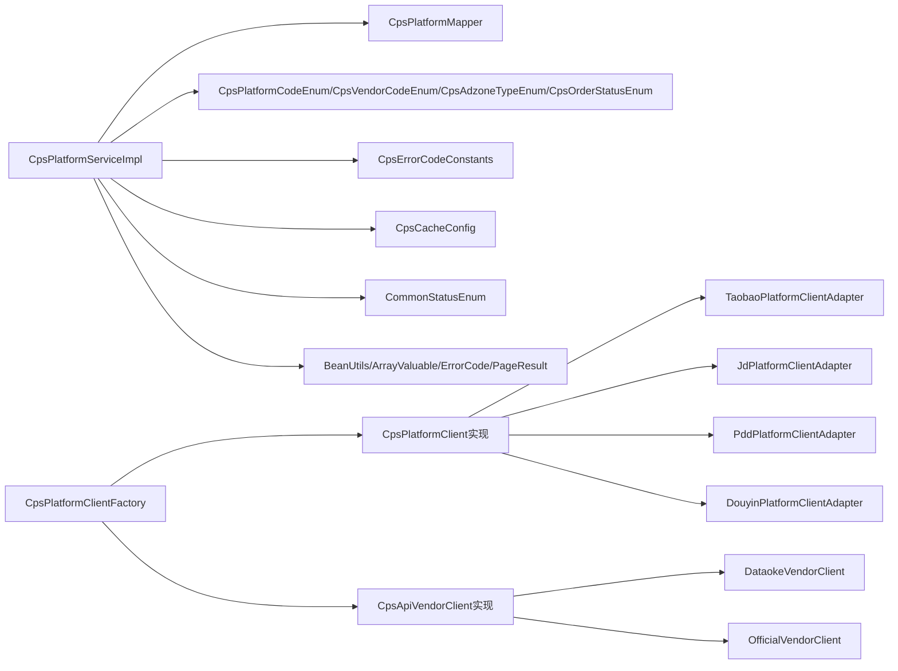

**图表来源**
- [CpsPlatformServiceImpl.java:1-35](file://backend/yudao-module-cps/yudao-module-cps-biz/src/main/java/cn/iocoder/yudao/module/cps/service/platform/CpsPlatformServiceImpl.java#L1-L35)
- [CpsPlatformClientFactory.java:45-58](file://backend/yudao-module-cps/yudao-module-cps-biz/src/main/java/cn/iocoder/yudao/module/cps/client/CpsPlatformClientFactory.java#L45-L58)
- [CpsPlatformCodeEnum.java:1-45](file://backend/yudao-module-cps/yudao-module-cps-api/src/main/java/cn/iocoder/yudao/module/cps/enums/CpsPlatformCodeEnum.java#L1-L45)
- [CpsVendorCodeEnum.java:1-52](file://backend/yudao-module-cps/yudao-module-cps-api/src/main/java/cn/iocoder/yudao/module/cps/enums/CpsVendorCodeEnum.java#L1-L52)
- [CpsErrorCodeConstants.java:1-65](file://backend/yudao-module-cps/yudao-module-cps-api/src/main/java/cn/iocoder/yudao/module/cps/enums/CpsErrorCodeConstants.java#L1-L65)
- [CpsAdzoneTypeEnum.java:1-40](file://backend/yudao-module-cps/yudao-module-cps-api/src/main/java/cn/iocoder/yudao/module/cps/enums/CpsAdzoneTypeEnum.java#L1-L40)
- [CpsOrderStatusEnum.java:1-48](file://backend/yudao-module-cps/yudao-module-cps-api/src/main/java/cn/iocoder/yudao/module/cps/enums/CpsOrderStatusEnum.java#L1-L48)
- [CpsCacheConfig.java](file://backend/yudao-module-cps/yudao-module-cps-biz/src/main/java/cn/iocoder/yudao/module/cps/config/CpsCacheConfig.java)
- [CommonStatusEnum.java](file://backend/yudao-framework/yudao-framework-common/src/main/java/cn/iocoder/yudao/framework/common/enums/CommonStatusEnum.java)
- [ArrayValuable.java](file://backend/yudao-framework/yudao-framework-common/src/main/java/cn/iocoder/yudao/framework/common/core/ArrayValuable.java)
- [ErrorCode.java](file://backend/yudao-framework/yudao-framework-common/src/main/java/cn/iocoder/yudao/framework/common/exception/ErrorCode.java)
- [PageResult.java](file://backend/yudao-framework/yudao-framework-common/src/main/java/cn/iocoder/yudao/framework/common/pojo/PageResult.java)
- [BeanUtils.java](file://backend/yudao-framework/yudao-framework-common/src/main/java/cn/iocoder/yudao/framework/common/util/object/BeanUtils.java)

**章节来源**
- [CpsPlatformServiceImpl.java:1-35](file://backend/yudao-module-cps/yudao-module-cps-biz/src/main/java/cn/iocoder/yudao/module/cps/service/platform/CpsPlatformServiceImpl.java#L1-L35)
- [CpsPlatformClientFactory.java:45-58](file://backend/yudao-module-cps/yudao-module-cps-biz/src/main/java/cn/iocoder/yudao/module/cps/client/CpsPlatformClientFactory.java#L45-L58)

## 性能考虑
- **缓存策略**：按平台编码缓存查询结果，更新时主动失效，兼顾一致性与性能。
- **分页查询**：平台配置分页接口支持大数据量场景下的高效检索。
- **对象转换**：使用BeanUtils进行轻量级对象转换，减少手动映射成本。
- **枚举数组化**：通过ArrayValuable统一数组化与检索，降低重复计算。
- **适配器复用**：通过工厂模式实现适配器的复用，避免重复初始化开销。
- **双维度路由优化**：供应商客户端映射表使用ConcurrentHashMap，支持高并发访问。
- **异步处理**：订单同步等耗时操作可通过异步队列处理，提升系统吞吐量。

## 故障排查指南
- **平台配置相关**
  - 平台不存在：检查平台ID或编码是否正确，确认数据库记录存在。
  - 平台编码重复：更新时需保证编码唯一，避免冲突。
  - 平台禁用：确认平台状态为启用，否则无法参与业务流程。
  - **新增**：activeVendorCode配置错误：检查平台配置的激活供应商编码。
- **适配器相关**
  - 适配器未注册：检查CpsPlatformClient实现类是否被Spring扫描。
  - **新增**：供应商客户端未注册：检查CpsApiVendorClient实现类是否被Spring扫描。
  - 签名失败：验证appKey、appSecret配置是否正确，检查时间戳和随机数生成。
  - 接口超时：检查网络连通性和平台API可用性。
  - **新增**：供应商路由失败：检查vendorCode:platformCode键值是否正确。
- **订单与返利相关**
  - 订单状态不合法：核对订单生命周期状态是否符合预期。
  - 返利账户余额不足/冻结：检查账户状态与可用余额。
- **错误码定位**
  - 使用CpsErrorCodeConstants中的段落快速定位问题类型，结合日志与参数上下文进行排查。

**章节来源**
- [CpsErrorCodeConstants.java:1-65](file://backend/yudao-module-cps/yudao-module-cps-api/src/main/java/cn/iocoder/yudao/module/cps/enums/CpsErrorCodeConstants.java#L1-L65)
- [CpsPlatformServiceImpl.java:86-100](file://backend/yudao-module-cps/yudao-module-cps-biz/src/main/java/cn/iocoder/yudao/module/cps/service/platform/CpsPlatformServiceImpl.java#L86-L100)
- [CpsPlatformClientFactory.java:143-171](file://backend/yudao-module-cps/yudao-module-cps-biz/src/main/java/cn/iocoder/yudao/module/cps/client/CpsPlatformClientFactory.java#L143-L171)
- [TaobaoPlatformClientAdapter.java:214-252](file://backend/yudao-module-cps/yudao-module-cps-biz/src/main/java/cn/iocoder/yudao/module/cps/client/taobao/TaobaoPlatformClientAdapter.java#L214-L252)

## 结论
平台适配器系统通过统一抽象与可插拔实现，实现了对多平台的兼容与扩展。依托枚举与错误码的标准化、服务层的清晰职责划分、数据访问层的稳定实现、适配器层的策略模式设计以及缓存与公共框架的支撑，系统在可维护性、可扩展性与运行效率方面均具备良好基础。

**更新** 系统现已支持多供应商架构，采用工厂模式实现双维度路由，具备强大的供应商切换与故障转移能力。通过供应商配置管理、委托模式适配器、多供应商客户端实现，系统能够灵活应对不同供应商的API差异，为未来的平台扩展奠定了坚实基础。

## 附录

### 新平台接入开发指南
- **平台枚举与常量**
  - 在平台编码枚举中新增平台标识与名称。
  - 如需新增业务状态或枚举，参照现有模式扩展。
- **平台配置管理**
  - 在数据访问层新增平台配置表与Mapper方法。
  - 在服务层扩展平台配置Service接口与实现，遵循现有校验与缓存策略。
  - **新增**：在平台配置中新增activeVendorCode字段，默认供应商编码。
- **适配器实现**
  - 实现CpsPlatformClient接口，定义统一的授权、签名、请求、限流、错误映射与数据转换方法。
  - **新增**：实现CpsApiVendorClient接口，定义供应商级的API调用逻辑。
  - 针对目标平台实现具体适配器，封装其SDK或HTTP客户端。
  - 实现testConnection方法用于配置校验。
- **供应商配置管理**
  - **新增**：在数据访问层新增供应商配置表与Mapper方法。
  - **新增**：在服务层扩展供应商配置Service接口与实现。
  - **新增**：支持多供应商配置，通过priority字段控制优先级。
- **配置与切换**
  - 在平台配置中新增平台密钥、域名、版本号等必要参数。
  - 适配器类添加@Component注解，自动注册到CpsPlatformClientFactory。
  - **新增**：供应商客户端通过工厂的vendorClientMap进行注册。
  - 支持动态切换与故障转移：通过配置中心与负载均衡实现。
  - **新增**：通过activeVendorCode字段实现供应商级切换。
- **测试与验证**
  - 单元测试：覆盖平台配置、适配器方法、错误处理路径。
  - **新增**：供应商客户端测试，验证双维度路由逻辑。
  - 集成测试：模拟真实请求与响应，验证数据转换与状态流转。
  - 压力测试：评估缓存命中率、接口延迟与并发吞吐。
- **监控与告警**
  - 埋点关键指标：请求耗时、错误率、重试次数、缓存命中率。
  - 告警阈值：针对超时、错误率、缓存失效率设置阈值并联动通知。

### 平台差异处理建议
- **授权机制**：统一OAuth或API Key流程，适配器内部完成令牌刷新与续期。
- **签名算法**：统一参数排序、拼接与签名生成，适配器内部封装。
- **请求限流**：依据平台速率限制配置全局或接口级限流策略。
- **数据转换**：统一字段映射与状态对齐，确保跨平台一致性。
- **错误处理**：统一错误码映射，提供平台特定的错误信息。
- **供应商隔离**：通过CpsApiVendorClient接口隔离供应商差异，支持多供应商并存。

### 跨平台数据一致性
- **状态机对齐**：以CpsOrderStatusEnum为准，统一订单状态转换。
- **主键与幂等**：为跨平台订单建立唯一索引与幂等键，避免重复处理。
- **事件驱动**：通过消息队列异步对账与补偿，保证最终一致性。
- **数据标准化**：统一价格单位、佣金比例等数值转换规则。
- **供应商透明**：通过供应商配置DTO隐藏供应商差异，提供统一接口。

### 平台适配器开发模板
```java
@Component
public class CustomPlatformClientAdapter implements CpsPlatformClient {
    
    @Override
    public String getPlatformCode() {
        return CpsPlatformCodeEnum.CUSTOM.getCode();
    }
    
    @Override
    public CpsGoodsSearchResult searchGoods(CpsGoodsSearchRequest request) {
        // 委托给当前激活的供应商客户端
        CpsApiVendorClient vendor = factory.getActiveVendorClient(getPlatformCode());
        CpsVendorConfig config = factory.getActiveVendorConfig(getPlatformCode());
        if (vendor == null || config == null) {
            return buildEmptyResult(request);
        }
        return vendor.searchGoods(request, config);
    }
    
    @Override
    public CpsPromotionLinkResult generatePromotionLink(CpsPromotionLinkRequest request) {
        CpsApiVendorClient vendor = factory.getActiveVendorClient(getPlatformCode());
        CpsVendorConfig config = factory.getActiveVendorConfig(getPlatformCode());
        if (vendor == null || config == null) {
            return null;
        }
        return vendor.generatePromotionLink(request, config);
    }
    
    @Override
    public List<CpsOrderDTO> queryOrders(CpsOrderQueryRequest request) {
        CpsApiVendorClient vendor = factory.getActiveVendorClient(getPlatformCode());
        CpsVendorConfig config = factory.getActiveVendorConfig(getPlatformCode());
        if (vendor == null || config == null) {
            return Collections.emptyList();
        }
        return vendor.queryOrders(request, config);
    }
    
    @Override
    public boolean testConnection() {
        CpsApiVendorClient vendor = factory.getActiveVendorClient(getPlatformCode());
        CpsVendorConfig config = factory.getActiveVendorConfig(getPlatformCode());
        if (vendor == null || config == null) {
            return false;
        }
        return vendor.testConnection(config);
    }
}
```

### 供应商客户端开发模板
```java
@Component
public class CustomVendorClient implements CpsApiVendorClient {
    
    @Override
    public String getVendorCode() {
        return "custom"; // 供应商编码
    }
    
    @Override
    public String getPlatformCode() {
        return CpsPlatformCodeEnum.TAOBAO.getCode(); // 关联平台
    }
    
    @Override
    public String getVendorType() {
        return "aggregator"; // 或 "official"
    }
    
    @Override
    public CpsGoodsSearchResult searchGoods(CpsGoodsSearchRequest request, CpsVendorConfig config) {
        // 实现具体的API调用逻辑
        return CpsGoodsSearchResult.builder().build();
    }
    
    @Override
    public CpsPromotionLinkResult generatePromotionLink(CpsPromotionLinkRequest request, CpsVendorConfig config) {
        // 实现具体的API调用逻辑
        return CpsPromotionLinkResult.builder().build();
    }
    
    @Override
    public List<CpsOrderDTO> queryOrders(CpsOrderQueryRequest request, CpsVendorConfig config) {
        // 实现具体的API调用逻辑
        return Collections.emptyList();
    }
    
    @Override
    public boolean testConnection(CpsVendorConfig config) {
        // 实现连接测试逻辑
        return true;
    }
}
```

**章节来源**
- [CpsPlatformClient.java:1-55](file://backend/yudao-module-cps/yudao-module-cps-biz/src/main/java/cn/iocoder/yudao/module/cps/client/CpsPlatformClient.java#L1-L55)
- [CpsApiVendorClient.java:1-84](file://backend/yudao-module-cps/yudao-module-cps-biz/src/main/java/cn/iocoder/yudao/module/cps/client/CpsApiVendorClient.java#L1-L84)
- [CpsPlatformCodeEnum.java:1-45](file://backend/yudao-module-cps/yudao-module-cps-api/src/main/java/cn/iocoder/yudao/module/cps/enums/CpsPlatformCodeEnum.java#L1-L45)
- [CpsVendorCodeEnum.java:1-52](file://backend/yudao-module-cps/yudao-module-cps-api/src/main/java/cn/iocoder/yudao/module/cps/enums/CpsVendorCodeEnum.java#L1-L52)
- [CpsPlatformClientFactory.java:134-197](file://backend/yudao-module-cps/yudao-module-cps-biz/src/main/java/cn/iocoder/yudao/module/cps/client/CpsPlatformClientFactory.java#L134-L197)