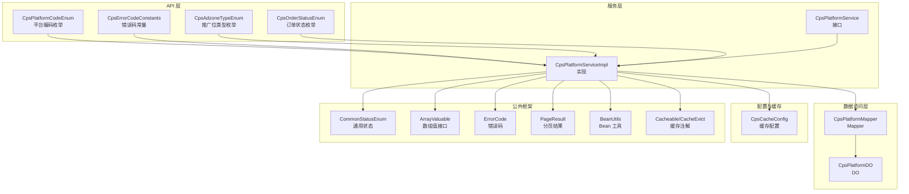
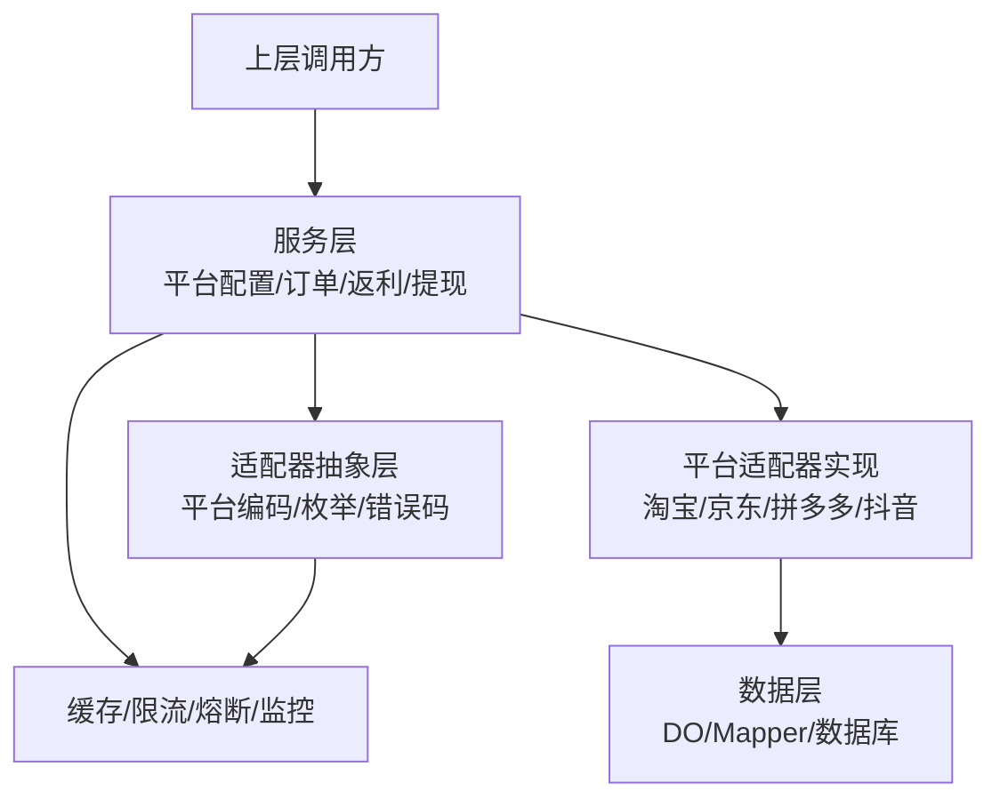
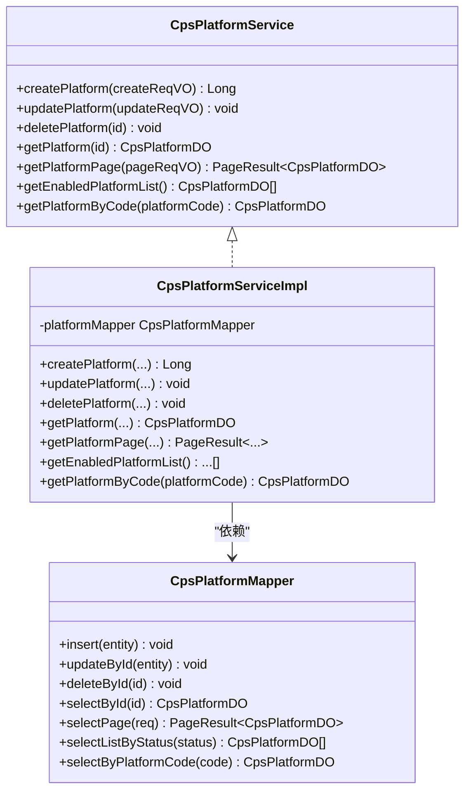
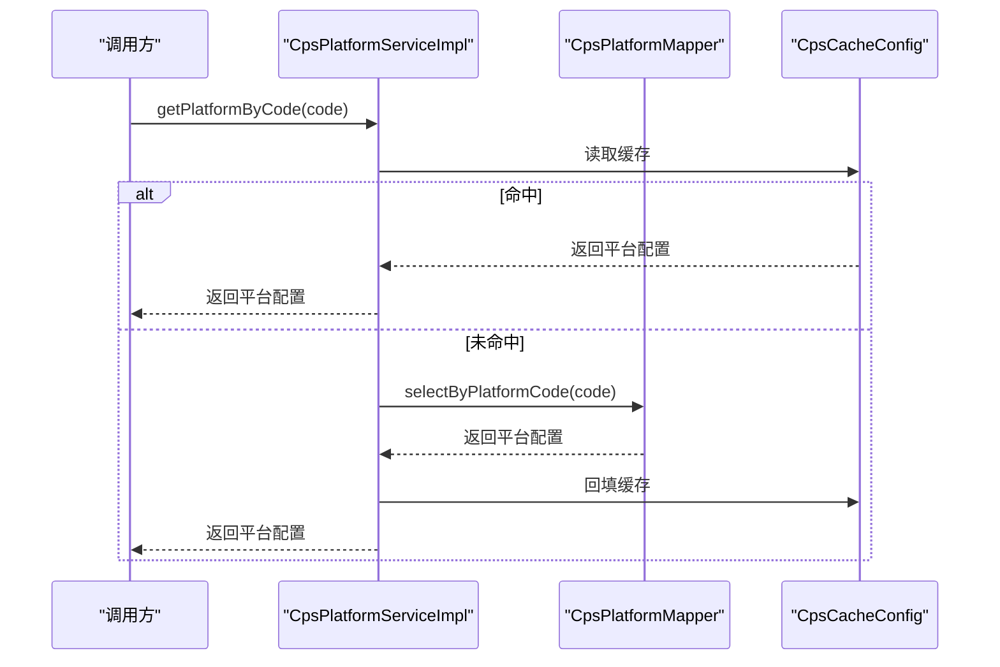
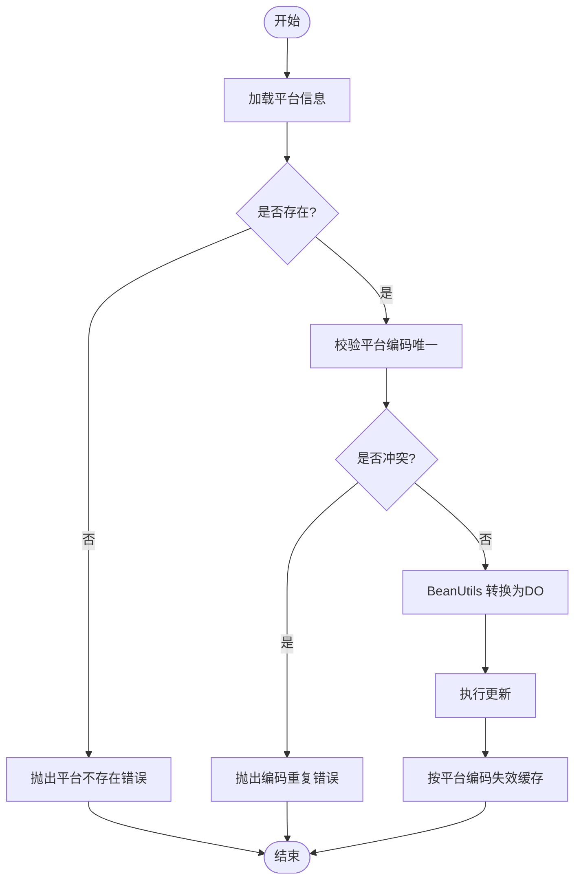
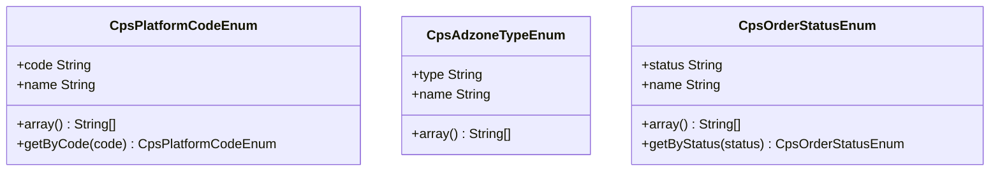
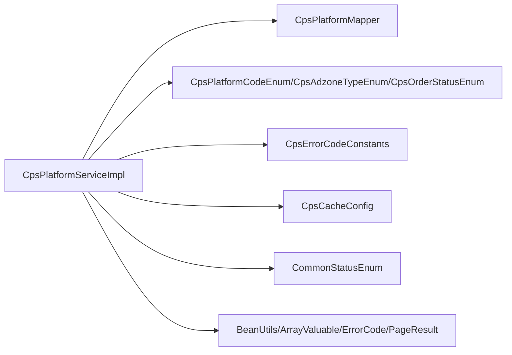

# 平台适配器系统

<cite>
**本文引用的文件**
- [CpsPlatformCodeEnum.java](file://backend/yudao-module-cps/yudao-module-cps-api/src/main/java/cn/iocoder/yudao/module/cps/enums/CpsPlatformCodeEnum.java)
- [CpsErrorCodeConstants.java](file://backend/yudao-module-cps/yudao-module-cps-api/src/main/java/cn/iocoder/yudao/module/cps/enums/CpsErrorCodeConstants.java)
- [CpsAdzoneTypeEnum.java](file://backend/yudao-module-cps/yudao-module-cps-api/src/main/java/cn/iocoder/yudao/module/cps/enums/CpsAdzoneTypeEnum.java)
- [CpsOrderStatusEnum.java](file://backend/yudao-module-cps/yudao-module-cps-api/src/main/java/cn/iocoder/yudao/module/cps/enums/CpsOrderStatusEnum.java)
- [CpsPlatformService.java](file://backend/yudao-module-cps/yudao-module-cps-biz/src/main/java/cn/iocoder/yudao/module/cps/service/platform/CpsPlatformService.java)
- [CpsPlatformServiceImpl.java](file://backend/yudao-module-cps/yudao-module-cps-biz/src/main/java/cn/iocoder/yudao/module/cps/service/platform/CpsPlatformServiceImpl.java)
- [CpsPlatformMapper.java](file://backend/yudao-module-cps/yudao-module-cps-biz/src/main/java/cn/iocoder/yudao/module/cps/dal/mysql/platform/CpsPlatformMapper.java)
- [CpsPlatformDO.java](file://backend/yudao-module-cps/yudao-module-cps-biz/src/main/java/cn/iocoder/yudao/module/cps/dal/dataobject/platform/CpsPlatformDO.java)
- [CpsCacheConfig.java](file://backend/yudao-module-cps/yudao-module-cps-biz/src/main/java/cn/iocoder/yudao/module/cps/config/CpsCacheConfig.java)
- [CommonStatusEnum.java](file://backend/yudao-framework/yudao-framework-common/src/main/java/cn/iocoder/yudao/framework/common/enums/CommonStatusEnum.java)
- [ArrayValuable.java](file://backend/yudao-framework/yudao-framework-common/src/main/java/cn/iocoder/yudao/framework/common/core/ArrayValuable.java)
- [ErrorCode.java](file://backend/yudao-framework/yudao-framework-common/src/main/java/cn/iocoder/yudao/framework/common/exception/ErrorCode.java)
- [PageResult.java](file://backend/yudao-framework/yudao-framework-common/src/main/java/cn/iocoder/yudao/framework/common/pojo/PageResult.java)
- [BeanUtils.java](file://backend/yudao-framework/yudao-framework-common/src/main/java/cn/iocoder/yudao/framework/common/util/object/BeanUtils.java)
- [Cacheable.java](file://backend/yudao-framework/yudao-framework-common/src/main/java/org/springframework/cache/annotation/Cacheable.java)
- [CacheEvict.java](file://backend/yudao-framework/yudao-framework-common/src/main/java/org/springframework/cache/annotation/CacheEvict.java)
- [CpsPlatformPageReqVO.java](file://backend/yudao-module-cps/yudao-module-cps-api/src/main/java/cn/iocoder/yudao/module/cps/controller/admin/platform/vo/CpsPlatformPageReqVO.java)
- [CpsPlatformSaveReqVO.java](file://backend/yudao-module-cps/yudao-module-cps-api/src/main/java/cn/iocoder/yudao/module/cps/controller/admin/platform/vo/CpsPlatformSaveReqVO.java)
</cite>

## 目录
1. [引言](#引言)
2. [项目结构](#项目结构)
3. [核心组件](#核心组件)
4. [架构总览](#架构总览)
5. [详细组件分析](#详细组件分析)
6. [依赖分析](#依赖分析)
7. [性能考虑](#性能考虑)
8. [故障排查指南](#故障排查指南)
9. [结论](#结论)
10. [附录](#附录)

## 引言
本文件面向CPS多平台适配器系统，系统性阐述平台抽象层设计、统一接口定义、平台差异处理策略，以及对主流电商（淘宝、京东、拼多多、抖音）的适配思路与扩展指引。文档同时覆盖授权机制、签名算法、请求限流、错误处理、平台配置管理、动态切换与故障转移、跨平台数据一致性、性能优化与监控告警等关键技术细节，并提供新平台接入的开发指南与测试验证方法。

## 项目结构
CPS模块采用“接口层-服务层-数据访问层-枚举与常量”的分层组织方式，平台配置与业务逻辑集中在biz模块，API与枚举在api模块，公共框架能力来自yudao-framework。

图表来源
- [CpsPlatformCodeEnum.java:1-45](file://backend/yudao-module-cps/yudao-module-cps-api/src/main/java/cn/iocoder/yudao/module/cps/enums/CpsPlatformCodeEnum.java#L1-L45)
- [CpsErrorCodeConstants.java:1-65](file://backend/yudao-module-cps/yudao-module-cps-api/src/main/java/cn/iocoder/yudao/module/cps/enums/CpsErrorCodeConstants.java#L1-L65)
- [CpsAdzoneTypeEnum.java:1-40](file://backend/yudao-module-cps/yudao-module-cps-api/src/main/java/cn/iocoder/yudao/module/cps/enums/CpsAdzoneTypeEnum.java#L1-L40)
- [CpsOrderStatusEnum.java:1-48](file://backend/yudao-module-cps/yudao-module-cps-api/src/main/java/cn/iocoder/yudao/module/cps/enums/CpsOrderStatusEnum.java#L1-L48)
- [CpsPlatformService.java:1-54](file://backend/yudao-module-cps/yudao-module-cps-biz/src/main/java/cn/iocoder/yudao/module/cps/service/platform/CpsPlatformService.java#L1-L54)
- [CpsPlatformServiceImpl.java:1-103](file://backend/yudao-module-cps/yudao-module-cps-biz/src/main/java/cn/iocoder/yudao/module/cps/service/platform/CpsPlatformServiceImpl.java#L1-L103)
- [CpsPlatformMapper.java](file://backend/yudao-module-cps/yudao-module-cps-biz/src/main/java/cn/iocoder/yudao/module/cps/dal/mysql/platform/CpsPlatformMapper.java)
- [CpsPlatformDO.java](file://backend/yudao-module-cps/yudao-module-cps-biz/src/main/java/cn/iocoder/yudao/module/cps/dal/dataobject/platform/CpsPlatformDO.java)
- [CpsCacheConfig.java](file://backend/yudao-module-cps/yudao-module-cps-biz/src/main/java/cn/iocoder/yudao/module/cps/config/CpsCacheConfig.java)
- [CommonStatusEnum.java](file://backend/yudao-framework/yudao-framework-common/src/main/java/cn/iocoder/yudao/framework/common/enums/CommonStatusEnum.java)
- [ArrayValuable.java](file://backend/yudao-framework/yudao-framework-common/src/main/java/cn/iocoder/yudao/framework/common/core/ArrayValuable.java)
- [ErrorCode.java](file://backend/yudao-framework/yudao-framework-common/src/main/java/cn/iocoder/yudao/framework/common/exception/ErrorCode.java)
- [PageResult.java](file://backend/yudao-framework/yudao-framework-common/src/main/java/cn/iocoder/yudao/framework/common/pojo/PageResult.java)
- [BeanUtils.java](file://backend/yudao-framework/yudao-framework-common/src/main/java/cn/iocoder/yudao/framework/common/util/object/BeanUtils.java)
- [Cacheable.java](file://backend/yudao-framework/yudao-framework-common/src/main/java/org/springframework/cache/annotation/Cacheable.java)
- [CacheEvict.java](file://backend/yudao-framework/yudao-framework-common/src/main/java/org/springframework/cache/annotation/CacheEvict.java)

章节来源
- [CpsPlatformCodeEnum.java:1-45](file://backend/yudao-module-cps/yudao-module-cps-api/src/main/java/cn/iocoder/yudao/module/cps/enums/CpsPlatformCodeEnum.java#L1-L45)
- [CpsPlatformService.java:1-54](file://backend/yudao-module-cps/yudao-module-cps-biz/src/main/java/cn/iocoder/yudao/module/cps/service/platform/CpsPlatformService.java#L1-L54)
- [CpsPlatformServiceImpl.java:1-103](file://backend/yudao-module-cps/yudao-module-cps-biz/src/main/java/cn/iocoder/yudao/module/cps/service/platform/CpsPlatformServiceImpl.java#L1-L103)

## 核心组件
- 平台编码与枚举：统一管理平台标识与名称，支持数组化查询与按编码检索。
- 错误码常量：集中定义CPS系统各模块错误码段落，便于统一异常处理与国际化。
- 推广位类型与订单状态：标准化推广位与订单生命周期状态，支撑跨平台一致化展示与流转。
- 平台配置服务：提供平台创建、更新、删除、分页查询、启用列表与按编码缓存查询能力。
- 数据访问层：基于MyBatis-Plus的Mapper与DO，支撑平台配置持久化。
- 缓存配置：通过注解式缓存提升平台配置读取性能。

章节来源
- [CpsPlatformCodeEnum.java:1-45](file://backend/yudao-module-cps/yudao-module-cps-api/src/main/java/cn/iocoder/yudao/module/cps/enums/CpsPlatformCodeEnum.java#L1-L45)
- [CpsErrorCodeConstants.java:1-65](file://backend/yudao-module-cps/yudao-module-cps-api/src/main/java/cn/iocoder/yudao/module/cps/enums/CpsErrorCodeConstants.java#L1-L65)
- [CpsAdzoneTypeEnum.java:1-40](file://backend/yudao-module-cps/yudao-module-cps-api/src/main/java/cn/iocoder/yudao/module/cps/enums/CpsAdzoneTypeEnum.java#L1-L40)
- [CpsOrderStatusEnum.java:1-48](file://backend/yudao-module-cps/yudao-module-cps-api/src/main/java/cn/iocoder/yudao/module/cps/enums/CpsOrderStatusEnum.java#L1-L48)
- [CpsPlatformService.java:1-54](file://backend/yudao-module-cps/yudao-module-cps-biz/src/main/java/cn/iocoder/yudao/module/cps/service/platform/CpsPlatformService.java#L1-L54)
- [CpsPlatformServiceImpl.java:1-103](file://backend/yudao-module-cps/yudao-module-cps-biz/src/main/java/cn/iocoder/yudao/module/cps/service/platform/CpsPlatformServiceImpl.java#L1-L103)

## 架构总览
平台适配器系统以“统一抽象 + 可插拔实现”为核心思想，通过以下层次协同工作：
- 抽象层：平台编码、枚举、错误码、状态机等统一定义，屏蔽平台差异。
- 适配层：面向具体平台的SDK或HTTP客户端封装（如淘宝联盟、京东联盟、拼多多联盟、抖音联盟），负责签名、限流、重试、错误映射与数据转换。
- 服务层：平台配置管理、推广位管理、订单同步、返利计算与提现流程编排。
- 数据层：平台配置、推广位、订单、返利、账户、风控等数据模型与持久化。
- 运维层：缓存、限流、熔断、监控与告警，保障高可用与可观测性。

## 详细组件分析

### 平台配置服务组件
- 角色定位：提供平台配置的增删改查、分页、启用列表与按编码缓存查询。
- 关键特性：
  - 唯一性校验：平台编码唯一，避免重复。
  - 缓存策略：按平台编码缓存查询结果，更新时主动失效。
  - 分页与状态过滤：支持按状态筛选启用平台。
- 错误处理：未找到平台、编码冲突等场景抛出对应错误码。

图表来源
- [CpsPlatformService.java:1-54](file://backend/yudao-module-cps/yudao-module-cps-biz/src/main/java/cn/iocoder/yudao/module/cps/service/platform/CpsPlatformService.java#L1-L54)
- [CpsPlatformServiceImpl.java:1-103](file://backend/yudao-module-cps/yudao-module-cps-biz/src/main/java/cn/iocoder/yudao/module/cps/service/platform/CpsPlatformServiceImpl.java#L1-L103)
- [CpsPlatformMapper.java](file://backend/yudao-module-cps/yudao-module-cps-biz/src/main/java/cn/iocoder/yudao/module/cps/dal/mysql/platform/CpsPlatformMapper.java)

章节来源
- [CpsPlatformService.java:1-54](file://backend/yudao-module-cps/yudao-module-cps-biz/src/main/java/cn/iocoder/yudao/module/cps/service/platform/CpsPlatformService.java#L1-L54)
- [CpsPlatformServiceImpl.java:1-103](file://backend/yudao-module-cps/yudao-module-cps-biz/src/main/java/cn/iocoder/yudao/module/cps/service/platform/CpsPlatformServiceImpl.java#L1-L103)

### 平台配置缓存流程
- 查询流程：先查缓存，命中则返回；未命中则查数据库并回填缓存。
- 更新流程：更新后按平台编码主动失效缓存，确保后续查询读到最新配置。

图表来源
- [CpsPlatformServiceImpl.java:80-84](file://backend/yudao-module-cps/yudao-module-cps-biz/src/main/java/cn/iocoder/yudao/module/cps/service/platform/CpsPlatformServiceImpl.java#L80-L84)
- [CpsCacheConfig.java](file://backend/yudao-module-cps/yudao-module-cps-biz/src/main/java/cn/iocoder/yudao/module/cps/config/CpsCacheConfig.java)

章节来源
- [CpsPlatformServiceImpl.java:80-84](file://backend/yudao-module-cps/yudao-module-cps-biz/src/main/java/cn/iocoder/yudao/module/cps/service/platform/CpsPlatformServiceImpl.java#L80-L84)

### 平台配置更新流程
- 更新前校验平台存在性与编码唯一性。
- 使用BeanUtils进行对象转换后执行更新。
- 更新成功后按平台编码失效缓存。

图表来源
- [CpsPlatformServiceImpl.java:44-54](file://backend/yudao-module-cps/yudao-module-cps-biz/src/main/java/cn/iocoder/yudao/module/cps/service/platform/CpsPlatformServiceImpl.java#L44-L54)
- [CpsPlatformServiceImpl.java:92-100](file://backend/yudao-module-cps/yudao-module-cps-biz/src/main/java/cn/iocoder/yudao/module/cps/service/platform/CpsPlatformServiceImpl.java#L92-L100)
- [BeanUtils.java](file://backend/yudao-framework/yudao-framework-common/src/main/java/cn/iocoder/yudao/framework/common/util/object/BeanUtils.java)

章节来源
- [CpsPlatformServiceImpl.java:44-54](file://backend/yudao-module-cps/yudao-module-cps-biz/src/main/java/cn/iocoder/yudao/module/cps/service/platform/CpsPlatformServiceImpl.java#L44-L54)
- [CpsPlatformServiceImpl.java:92-100](file://backend/yudao-module-cps/yudao-module-cps-biz/src/main/java/cn/iocoder/yudao/module/cps/service/platform/CpsPlatformServiceImpl.java#L92-L100)

### 平台枚举与状态机
- 平台编码：统一管理平台标识，支持数组化与按编码检索。
- 推广位类型：通用、渠道专属、用户专属，支撑差异化运营策略。
- 订单状态：从已下单到已到账、退款、失效，覆盖完整生命周期。
- 订单状态机：用于跨平台状态对齐与一致性校验。

图表来源
- [CpsPlatformCodeEnum.java:1-45](file://backend/yudao-module-cps/yudao-module-cps-api/src/main/java/cn/iocoder/yudao/module/cps/enums/CpsPlatformCodeEnum.java#L1-L45)
- [CpsAdzoneTypeEnum.java:1-40](file://backend/yudao-module-cps/yudao-module-cps-api/src/main/java/cn/iocoder/yudao/module/cps/enums/CpsAdzoneTypeEnum.java#L1-L40)
- [CpsOrderStatusEnum.java:1-48](file://backend/yudao-module-cps/yudao-module-cps-api/src/main/java/cn/iocoder/yudao/module/cps/enums/CpsOrderStatusEnum.java#L1-L48)

章节来源
- [CpsPlatformCodeEnum.java:1-45](file://backend/yudao-module-cps/yudao-module-cps-api/src/main/java/cn/iocoder/yudao/module/cps/enums/CpsPlatformCodeEnum.java#L1-L45)
- [CpsAdzoneTypeEnum.java:1-40](file://backend/yudao-module-cps/yudao-module-cps-api/src/main/java/cn/iocoder/yudao/module/cps/enums/CpsAdzoneTypeEnum.java#L1-L40)
- [CpsOrderStatusEnum.java:1-48](file://backend/yudao-module-cps/yudao-module-cps-api/src/main/java/cn/iocoder/yudao/module/cps/enums/CpsOrderStatusEnum.java#L1-L48)

## 依赖分析
- 低耦合高内聚：服务层仅依赖Mapper接口与公共框架，避免直接依赖具体实现。
- 注解驱动缓存：通过Cacheable/CacheEvict简化缓存逻辑，降低重复代码。
- 统一错误码：CpsErrorCodeConstants集中定义错误码段落，便于异常治理与国际化。
- 数组化枚举：ArrayValuable统一了枚举数组化与检索能力，减少样板代码。

图表来源
- [CpsPlatformServiceImpl.java:1-103](file://backend/yudao-module-cps/yudao-module-cps-biz/src/main/java/cn/iocoder/yudao/module/cps/service/platform/CpsPlatformServiceImpl.java#L1-L103)
- [CpsPlatformCodeEnum.java:1-45](file://backend/yudao-module-cps/yudao-module-cps-api/src/main/java/cn/iocoder/yudao/module/cps/enums/CpsPlatformCodeEnum.java#L1-L45)
- [CpsErrorCodeConstants.java:1-65](file://backend/yudao-module-cps/yudao-module-cps-api/src/main/java/cn/iocoder/yudao/module/cps/enums/CpsErrorCodeConstants.java#L1-L65)
- [CpsAdzoneTypeEnum.java:1-40](file://backend/yudao-module-cps/yudao-module-cps-api/src/main/java/cn/iocoder/yudao/module/cps/enums/CpsAdzoneTypeEnum.java#L1-L40)
- [CpsOrderStatusEnum.java:1-48](file://backend/yudao-module-cps/yudao-module-cps-api/src/main/java/cn/iocoder/yudao/module/cps/enums/CpsOrderStatusEnum.java#L1-L48)
- [CpsCacheConfig.java](file://backend/yudao-module-cps/yudao-module-cps-biz/src/main/java/cn/iocoder/yudao/module/cps/config/CpsCacheConfig.java)
- [CommonStatusEnum.java](file://backend/yudao-framework/yudao-framework-common/src/main/java/cn/iocoder/yudao/framework/common/enums/CommonStatusEnum.java)
- [ArrayValuable.java](file://backend/yudao-framework/yudao-framework-common/src/main/java/cn/iocoder/yudao/framework/common/core/ArrayValuable.java)
- [ErrorCode.java](file://backend/yudao-framework/yudao-framework-common/src/main/java/cn/iocoder/yudao/framework/common/exception/ErrorCode.java)
- [PageResult.java](file://backend/yudao-framework/yudao-framework-common/src/main/java/cn/iocoder/yudao/framework/common/pojo/PageResult.java)
- [BeanUtils.java](file://backend/yudao-framework/yudao-framework-common/src/main/java/cn/iocoder/yudao/framework/common/util/object/BeanUtils.java)

章节来源
- [CpsPlatformServiceImpl.java:1-103](file://backend/yudao-module-cps/yudao-module-cps-biz/src/main/java/cn/iocoder/yudao/module/cps/service/platform/CpsPlatformServiceImpl.java#L1-L103)

## 性能考虑
- 缓存策略：按平台编码缓存查询结果，更新时主动失效，兼顾一致性与性能。
- 分页查询：平台配置分页接口支持大数据量场景下的高效检索。
- 对象转换：使用BeanUtils进行轻量级对象转换，减少手动映射成本。
- 枚举数组化：通过ArrayValuable统一数组化与检索，降低重复计算。

## 故障排查指南
- 平台配置相关
  - 平台不存在：检查平台ID或编码是否正确，确认数据库记录存在。
  - 平台编码重复：更新时需保证编码唯一，避免冲突。
  - 平台禁用：确认平台状态为启用，否则无法参与业务流程。
- 订单与返利相关
  - 订单状态不合法：核对订单生命周期状态是否符合预期。
  - 返利账户余额不足/冻结：检查账户状态与可用余额。
- 错误码定位
  - 使用CpsErrorCodeConstants中的段落快速定位问题类型，结合日志与参数上下文进行排查。

章节来源
- [CpsErrorCodeConstants.java:1-65](file://backend/yudao-module-cps/yudao-module-cps-api/src/main/java/cn/iocoder/yudao/module/cps/enums/CpsErrorCodeConstants.java#L1-L65)
- [CpsPlatformServiceImpl.java:86-100](file://backend/yudao-module-cps/yudao-module-cps-biz/src/main/java/cn/iocoder/yudao/module/cps/service/platform/CpsPlatformServiceImpl.java#L86-L100)

## 结论
平台适配器系统通过统一抽象与可插拔实现，实现了对多平台的兼容与扩展。依托枚举与错误码的标准化、服务层的清晰职责划分、数据访问层的稳定实现，以及缓存与公共框架的支撑，系统在可维护性、可扩展性与运行效率方面均具备良好基础。后续可在适配层完善各平台的授权、签名、限流与数据转换细节，并建立完善的测试与监控体系。

## 附录

### 新平台接入开发指南
- 平台枚举与常量
  - 在平台编码枚举中新增平台标识与名称。
  - 如需新增业务状态或枚举，参照现有模式扩展。
- 平台配置管理
  - 在数据访问层新增平台配置表与Mapper方法。
  - 在服务层扩展平台配置Service接口与实现，遵循现有校验与缓存策略。
- 适配器实现
  - 设计平台适配器接口，定义统一的授权、签名、请求、限流、错误映射与数据转换方法。
  - 针对目标平台实现具体适配器，封装其SDK或HTTP客户端。
- 配置与切换
  - 在平台配置中新增平台密钥、域名、版本号等必要参数。
  - 支持动态切换与故障转移：通过配置中心与负载均衡实现。
- 测试与验证
  - 单元测试：覆盖平台配置、适配器方法、错误处理路径。
  - 集成测试：模拟真实请求与响应，验证数据转换与状态流转。
  - 压力测试：评估缓存命中率、接口延迟与并发吞吐。
- 监控与告警
  - 埋点关键指标：请求耗时、错误率、重试次数、缓存命中率。
  - 告警阈值：针对超时、错误率、缓存失效率设置阈值并联动通知。

### 平台差异处理建议
- 授权机制：统一OAuth或API Key流程，适配器内部完成令牌刷新与续期。
- 签名算法：统一参数排序、拼接与签名生成，适配器内部封装。
- 请求限流：依据平台速率限制配置全局或接口级限流策略。
- 数据转换：统一字段映射与状态对齐，确保跨平台一致性。

### 跨平台数据一致性
- 状态机对齐：以CpsOrderStatusEnum为准，统一订单状态转换。
- 主键与幂等：为跨平台订单建立唯一索引与幂等键，避免重复处理。
- 事件驱动：通过消息队列异步对账与补偿，保证最终一致性。