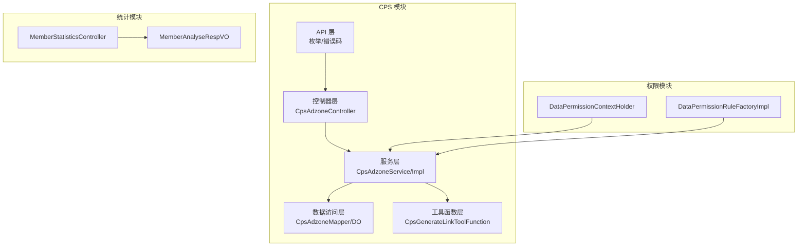
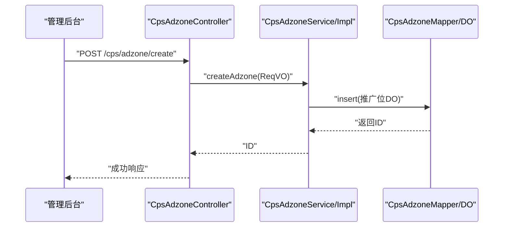
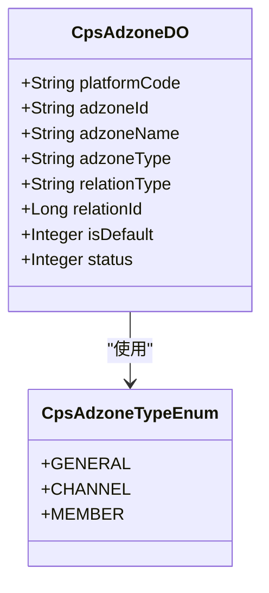
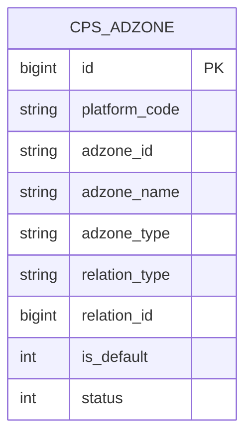
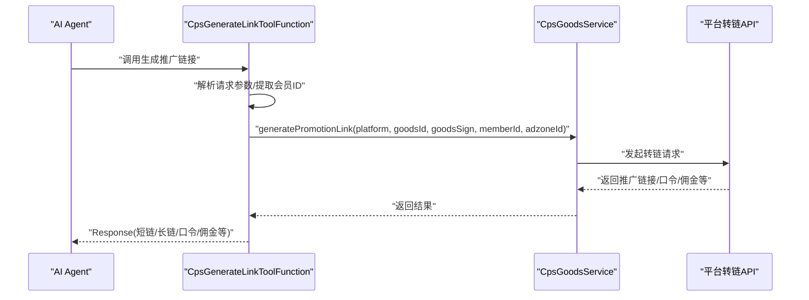
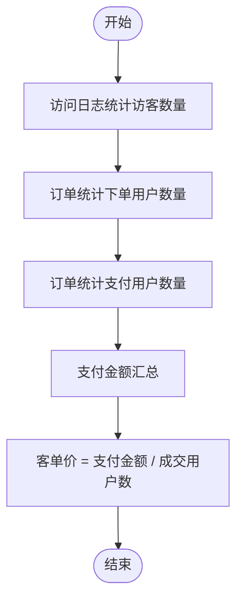
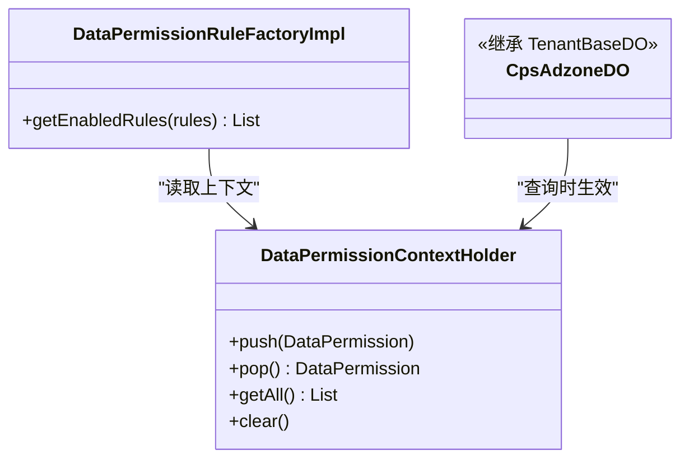
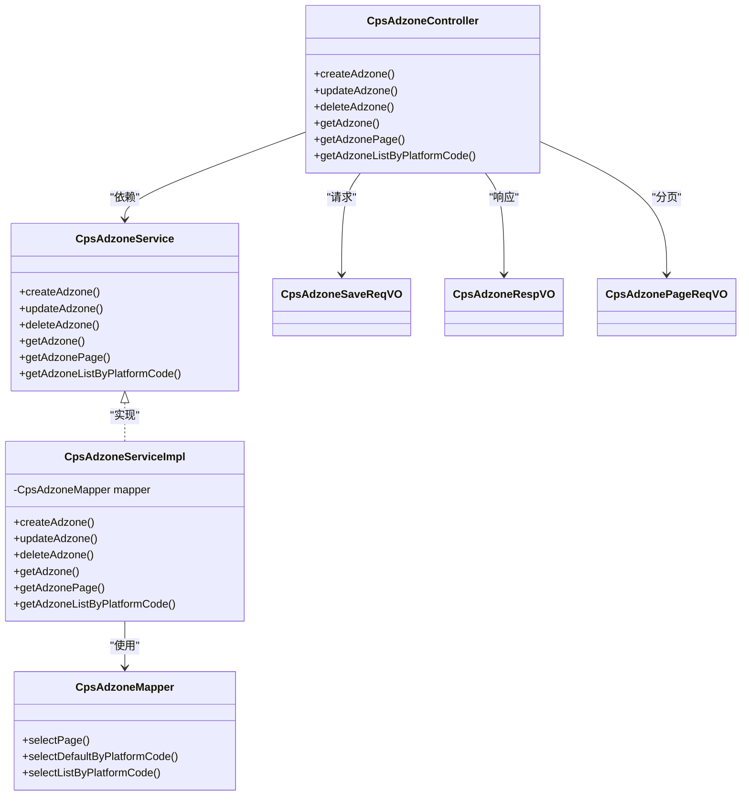
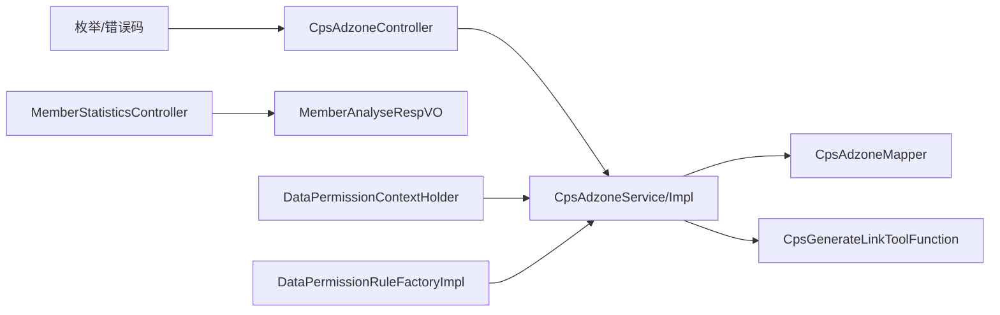

# 推广位管理系统

<cite>
**本文引用的文件**
- [CpsAdzoneTypeEnum.java](file://backend/yudao-module-cps/yudao-module-cps-api/src/main/java/cn/iocoder/yudao/module/cps/enums/CpsAdzoneTypeEnum.java)
- [CpsPlatformCodeEnum.java](file://backend/yudao-module-cps/yudao-module-cps-api/src/main/java/cn/iocoder/yudao/module/cps/enums/CpsPlatformCodeEnum.java)
- [CpsErrorCodeConstants.java](file://backend/yudao-module-cps/yudao-module-cps-api/src/main/java/cn/iocoder/yudao/module/cps/enums/CpsErrorCodeConstants.java)
- [CpsAdzoneController.java](file://backend/yudao-module-cps/yudao-module-cps-biz/src/main/java/cn/iocoder/yudao/module/cps/controller/admin/adzone/CpsAdzoneController.java)
- [CpsAdzoneService.java](file://backend/yudao-module-cps/yudao-module-cps-biz/src/main/java/cn/iocoder/yudao/module/cps/service/adzone/CpsAdzoneService.java)
- [CpsAdzoneServiceImpl.java](file://backend/yudao-module-cps/yudao-module-cps-biz/src/main/java/cn/iocoder/yudao/module/cps/service/adzone/CpsAdzoneServiceImpl.java)
- [CpsAdzoneMapper.java](file://backend/yudao-module-cps/yudao-module-cps-biz/src/main/java/cn/iocoder/yudao/module/cps/dal/mysql/adzone/CpsAdzoneMapper.java)
- [CpsAdzoneDO.java](file://backend/yudao-module-cps/yudao-module-cps-biz/src/main/java/cn/iocoder/yudao/module/cps/dal/dataobject/adzone/CpsAdzoneDO.java)
- [CpsAdzoneSaveReqVO.java](file://backend/yudao-module-cps/yudao-module-cps-biz/src/main/java/cn/iocoder/yudao/module/cps/controller/admin/adzone/vo/CpsAdzoneSaveReqVO.java)
- [CpsAdzoneRespVO.java](file://backend/yudao-module-cps/yudao-module-cps-biz/src/main/java/cn/iocoder/yudao/module/cps/controller/admin/adzone/vo/CpsAdzoneRespVO.java)
- [CpsAdzonePageReqVO.java](file://backend/yudao-module-cps/yudao-module-cps-biz/src/main/java/cn/iocoder/yudao/module/cps/controller/admin/adzone/vo/CpsAdzonePageReqVO.java)
- [CpsGenerateLinkToolFunction.java](file://backend/yudao-module-cps/yudao-module-cps-biz/src/main/java/cn/iocoder/yudao/module/cps/mcp/tool/CpsGenerateLinkToolFunction.java)
- [CPS系统PRD文档.md](file://docs/CPS系统PRD文档.md)
- [MemberStatisticsController.java](file://backend/yudao-module-mall/yudao-module-statistics/src/main/java/cn/iocoder/yudao/module/statistics/controller/admin/member/MemberStatisticsController.java)
- [MemberAnalyseRespVO.java](file://backend/yudao-module-mall/yudao-module-statistics/src/main/java/cn/iocoder/yudao/module/statistics/controller/admin/member/vo/MemberAnalyseRespVO.java)
- [DataPermissionContextHolder.java](file://backend/yudao-framework/yudao-spring-boot-starter-biz-data-permission/src/main/java/cn/iocoder/yudao/framework/datapermission/core/aop/DataPermissionContextHolder.java)
- [DataPermissionRuleFactoryImpl.java](file://backend/yudao-framework/yudao-spring-boot-starter-biz-data-permission/src/main/java/cn/iocoder/yudao/framework/datapermission/core/rule/DataPermissionRuleFactoryImpl.java)
</cite>

## 目录
1. [简介](#简介)
2. [项目结构](#项目结构)
3. [核心组件](#核心组件)
4. [架构总览](#架构总览)
5. [详细组件分析](#详细组件分析)
6. [依赖关系分析](#依赖关系分析)
7. [性能考虑](#性能考虑)
8. [故障排查指南](#故障排查指南)
9. [结论](#结论)
10. [附录](#附录)

## 简介
本文件面向推广位管理系统，系统性阐述推广位的创建、配置、管理、监控等核心能力，并结合现有代码与PRD文档，给出推广位类型、绑定关系、权限与数据隔离、推广链接生成算法、参数拼接规则、防重复机制、推广效果统计与收益分析、安全控制与访问统计、以及与各平台推广接口对接的实现要点。文档旨在帮助技术与非技术读者快速理解系统设计与实现。

## 项目结构
推广位管理位于 CPS 模块中，采用典型的分层架构：
- API 层：枚举与错误码定义
- 控制器层：管理后台接口
- 服务层：业务逻辑编排
- 数据访问层：MyBatis Mapper 与 DO 对象
- 工具函数层：AI Agent 调用的 MCP 工具函数
- 统计模块：会员分析与访问统计
- 权限模块：数据权限上下文与规则工厂

图表来源
- [CpsAdzoneController.java:24-83](file://backend/yudao-module-cps/yudao-module-cps-biz/src/main/java/cn/iocoder/yudao/module/cps/controller/admin/adzone/CpsAdzoneController.java#L24-L83)
- [CpsAdzoneService.java:16-48](file://backend/yudao-module-cps/yudao-module-cps-biz/src/main/java/cn/iocoder/yudao/module/cps/service/adzone/CpsAdzoneService.java#L16-L48)
- [CpsAdzoneServiceImpl.java:23-71](file://backend/yudao-module-cps/yudao-module-cps-biz/src/main/java/cn/iocoder/yudao/module/cps/service/adzone/CpsAdzoneServiceImpl.java#L23-L71)
- [CpsAdzoneMapper.java:17-43](file://backend/yudao-module-cps/yudao-module-cps-biz/src/main/java/cn/iocoder/yudao/module/cps/dal/mysql/adzone/CpsAdzoneMapper.java#L17-L43)
- [CpsAdzoneDO.java:16-68](file://backend/yudao-module-cps/yudao-module-cps-biz/src/main/java/cn/iocoder/yudao/module/cps/dal/dataobject/adzone/CpsAdzoneDO.java#L16-L68)
- [CpsGenerateLinkToolFunction.java:27-142](file://backend/yudao-module-cps/yudao-module-cps-biz/src/main/java/cn/iocoder/yudao/module/cps/mcp/tool/CpsGenerateLinkToolFunction.java#L27-L142)
- [MemberStatisticsController.java:55-76](file://backend/yudao-module-mall/yudao-module-statistics/src/main/java/cn/iocoder/yudao/module/statistics/controller/admin/member/MemberStatisticsController.java#L55-L76)
- [MemberAnalyseRespVO.java:8-26](file://backend/yudao-module-mall/yudao-module-statistics/src/main/java/cn/iocoder/yudao/module/statistics/controller/admin/member/vo/MemberAnalyseRespVO.java#L8-L26)
- [DataPermissionContextHolder.java:46-72](file://backend/yudao-framework/yudao-spring-boot-starter-biz-data-permission/src/main/java/cn/iocoder/yudao/framework/datapermission/core/aop/DataPermissionContextHolder.java#L46-L72)
- [DataPermissionRuleFactoryImpl.java:36-66](file://backend/yudao-framework/yudao-spring-boot-starter-biz-data-permission/src/main/java/cn/iocoder/yudao/framework/datapermission/core/rule/DataPermissionRuleFactoryImpl.java#L36-L66)

章节来源
- [CpsAdzoneController.java:24-83](file://backend/yudao-module-cps/yudao-module-cps-biz/src/main/java/cn/iocoder/yudao/module/cps/controller/admin/adzone/CpsAdzoneController.java#L24-L83)
- [CpsAdzoneService.java:16-48](file://backend/yudao-module-cps/yudao-module-cps-biz/src/main/java/cn/iocoder/yudao/module/cps/service/adzone/CpsAdzoneService.java#L16-L48)
- [CpsAdzoneServiceImpl.java:23-71](file://backend/yudao-module-cps/yudao-module-cps-biz/src/main/java/cn/iocoder/yudao/module/cps/service/adzone/CpsAdzoneServiceImpl.java#L23-L71)
- [CpsAdzoneMapper.java:17-43](file://backend/yudao-module-cps/yudao-module-cps-biz/src/main/java/cn/iocoder/yudao/module/cps/dal/mysql/adzone/CpsAdzoneMapper.java#L17-L43)
- [CpsAdzoneDO.java:16-68](file://backend/yudao-module-cps/yudao-module-cps-biz/src/main/java/cn/iocoder/yudao/module/cps/dal/dataobject/adzone/CpsAdzoneDO.java#L16-L68)
- [CpsGenerateLinkToolFunction.java:27-142](file://backend/yudao-module-cps/yudao-module-cps-biz/src/main/java/cn/iocoder/yudao/module/cps/mcp/tool/CpsGenerateLinkToolFunction.java#L27-L142)
- [MemberStatisticsController.java:55-76](file://backend/yudao-module-mall/yudao-module-statistics/src/main/java/cn/iocoder/yudao/module/statistics/controller/admin/member/MemberStatisticsController.java#L55-L76)
- [MemberAnalyseRespVO.java:8-26](file://backend/yudao-module-mall/yudao-module-statistics/src/main/java/cn/iocoder/yudao/module/statistics/controller/admin/member/vo/MemberAnalyseRespVO.java#L8-L26)
- [DataPermissionContextHolder.java:46-72](file://backend/yudao-framework/yudao-spring-boot-starter-biz-data-permission/src/main/java/cn/iocoder/yudao/framework/datapermission/core/aop/DataPermissionContextHolder.java#L46-L72)
- [DataPermissionRuleFactoryImpl.java:36-66](file://backend/yudao-framework/yudao-spring-boot-starter-biz-data-permission/src/main/java/cn/iocoder/yudao/framework/datapermission/core/rule/DataPermissionRuleFactoryImpl.java#L36-L66)

## 核心组件
- 推广位类型枚举：定义通用、渠道专属、用户专属三种类型，支撑不同绑定策略与展示策略。
- 平台编码枚举：定义淘宝、京东、拼多多、抖音等平台编码，作为推广位归属与转链对接的基础。
- 推广位实体与映射：包含平台编码、推广位ID、名称、类型、关联类型与ID、默认标记、状态等字段。
- 推广位控制器与服务：提供创建、更新、删除、查询、分页、按平台查询等接口。
- MCP 工具函数：为 AI Agent 生成带返利追踪的推广链接，支持多平台格式输出。
- 统计与分析：会员访问、下单、支付、客单价等分析，支撑推广效果评估。
- 权限与数据隔离：基于租户与数据权限规则，确保多租户与数据隔离。

章节来源
- [CpsAdzoneTypeEnum.java:14-39](file://backend/yudao-module-cps/yudao-module-cps-api/src/main/java/cn/iocoder/yudao/module/cps/enums/CpsAdzoneTypeEnum.java#L14-L39)
- [CpsPlatformCodeEnum.java:14-44](file://backend/yudao-module-cps/yudao-module-cps-api/src/main/java/cn/iocoder/yudao/module/cps/enums/CpsPlatformCodeEnum.java#L14-L44)
- [CpsAdzoneDO.java:16-68](file://backend/yudao-module-cps/yudao-module-cps-biz/src/main/java/cn/iocoder/yudao/module/cps/dal/dataobject/adzone/CpsAdzoneDO.java#L16-L68)
- [CpsAdzoneController.java:24-83](file://backend/yudao-module-cps/yudao-module-cps-biz/src/main/java/cn/iocoder/yudao/module/cps/controller/admin/adzone/CpsAdzoneController.java#L24-L83)
- [CpsAdzoneService.java:16-48](file://backend/yudao-module-cps/yudao-module-cps-biz/src/main/java/cn/iocoder/yudao/module/cps/service/adzone/CpsAdzoneService.java#L16-L48)
- [CpsGenerateLinkToolFunction.java:27-142](file://backend/yudao-module-cps/yudao-module-cps-biz/src/main/java/cn/iocoder/yudao/module/cps/mcp/tool/CpsGenerateLinkToolFunction.java#L27-L142)
- [MemberStatisticsController.java:55-76](file://backend/yudao-module-mall/yudao-module-statistics/src/main/java/cn/iocoder/yudao/module/statistics/controller/admin/member/MemberStatisticsController.java#L55-L76)
- [DataPermissionContextHolder.java:46-72](file://backend/yudao-framework/yudao-spring-boot-starter-biz-data-permission/src/main/java/cn/iocoder/yudao/framework/datapermission/core/aop/DataPermissionContextHolder.java#L46-L72)

## 架构总览
系统围绕“推广位”这一核心实体展开，形成“配置—绑定—生成—统计—风控”的闭环：
- 配置：平台编码与推广位类型定义
- 绑定：推广位与平台、渠道、用户的关联
- 生成：根据商品与推广位生成带归因参数的推广链接
- 统计：访问、转化、收益等指标分析
- 风控：权限与数据隔离保障

图表来源
- [CpsAdzoneController.java:33-38](file://backend/yudao-module-cps/yudao-module-cps-biz/src/main/java/cn/iocoder/yudao/module/cps/controller/admin/adzone/CpsAdzoneController.java#L33-L38)
- [CpsAdzoneServiceImpl.java:30-35](file://backend/yudao-module-cps/yudao-module-cps-biz/src/main/java/cn/iocoder/yudao/module/cps/service/adzone/CpsAdzoneServiceImpl.java#L30-L35)
- [CpsAdzoneMapper.java:17-27](file://backend/yudao-module-cps/yudao-module-cps-biz/src/main/java/cn/iocoder/yudao/module/cps/dal/mysql/adzone/CpsAdzoneMapper.java#L17-L27)
- [CpsAdzoneDO.java:16-68](file://backend/yudao-module-cps/yudao-module-cps-biz/src/main/java/cn/iocoder/yudao/module/cps/dal/dataobject/adzone/CpsAdzoneDO.java#L16-L68)

## 详细组件分析

### 推广位类型与适用场景
- 通用（general）：适用于多渠道共享的默认推广位，便于快速生成推广链接。
- 渠道专属（channel）：与特定渠道绑定，用于渠道维度的收益归因与统计。
- 用户专属（member）：与具体会员绑定，支持用户级归因与个性化推广。

图表来源
- [CpsAdzoneTypeEnum.java:14-39](file://backend/yudao-module-cps/yudao-module-cps-api/src/main/java/cn/iocoder/yudao/module/cps/enums/CpsAdzoneTypeEnum.java#L14-L39)
- [CpsAdzoneDO.java:16-68](file://backend/yudao-module-cps/yudao-module-cps-biz/src/main/java/cn/iocoder/yudao/module/cps/dal/dataobject/adzone/CpsAdzoneDO.java#L16-L68)

章节来源
- [CpsAdzoneTypeEnum.java:14-39](file://backend/yudao-module-cps/yudao-module-cps-api/src/main/java/cn/iocoder/yudao/module/cps/enums/CpsAdzoneTypeEnum.java#L14-L39)
- [CpsAdzoneDO.java:16-68](file://backend/yudao-module-cps/yudao-module-cps-biz/src/main/java/cn/iocoder/yudao/module/cps/dal/dataobject/adzone/CpsAdzoneDO.java#L16-L68)

### 推广位与商品、渠道、推广者的绑定关系
- 平台维度：每个推广位绑定一个平台编码，用于对接平台转链接口。
- 关联维度：relationType 支持 channel 或 member，relationId 指向具体对象ID。
- 默认推广位：isDefault 标记平台默认推广位，用于兜底生成链接。
- 状态控制：status 控制推广位启用/禁用，影响可用性。

图表来源
- [CpsAdzoneDO.java:16-68](file://backend/yudao-module-cps/yudao-module-cps-biz/src/main/java/cn/iocoder/yudao/module/cps/dal/dataobject/adzone/CpsAdzoneDO.java#L16-L68)

章节来源
- [CpsAdzoneDO.java:16-68](file://backend/yudao-module-cps/yudao-module-cps-biz/src/main/java/cn/iocoder/yudao/module/cps/dal/dataobject/adzone/CpsAdzoneDO.java#L16-L68)

### 推广链接生成算法与参数拼接规则
- 输入：平台编码、商品ID、商品签名（拼多多可选）、会员ID、推广位ID。
- 归因参数注入：
  - 淘宝：adzone_id + external_info
  - 京东：subUnionId = 会员标识映射
  - 拼多多：custom_parameters = {"uid":"会员ID"}
- 输出：短链、长链、移动端链接、淘口令（淘宝）、券后价、佣金比例、预估佣金、券信息等。
- AI Agent 场景：通过 MCP 工具函数在 ToolContext 中自动提取登录会员ID，完成订单归因。

图表来源
- [CpsGenerateLinkToolFunction.java:97-139](file://backend/yudao-module-cps/yudao-module-cps-biz/src/main/java/cn/iocoder/yudao/module/cps/mcp/tool/CpsGenerateLinkToolFunction.java#L97-L139)

章节来源
- [CpsGenerateLinkToolFunction.java:37-95](file://backend/yudao-module-cps/yudao-module-cps-biz/src/main/java/cn/iocoder/yudao/module/cps/mcp/tool/CpsGenerateLinkToolFunction.java#L37-L95)
- [CpsGenerateLinkToolFunction.java:97-139](file://backend/yudao-module-cps/yudao-module-cps-biz/src/main/java/cn/iocoder/yudao/module/cps/mcp/tool/CpsGenerateLinkToolFunction.java#L97-L139)
- [CPS系统PRD文档.md:152-182](file://docs/CPS系统PRD文档.md#L152-L182)

### 推广效果统计与收益分析
- 会员分析指标：访客数量、下单用户数量、成交用户数量、客单价（ATV）。
- 统计来源：访问日志统计访客、订单统计下单与支付人数、支付金额计算客单价。
- 对照数据：支持对比周期数据，辅助评估推广活动效果。

图表来源
- [MemberStatisticsController.java:55-76](file://backend/yudao-module-mall/yudao-module-statistics/src/main/java/cn/iocoder/yudao/module/statistics/controller/admin/member/MemberStatisticsController.java#L55-L76)
- [MemberAnalyseRespVO.java:8-26](file://backend/yudao-module-mall/yudao-module-statistics/src/main/java/cn/iocoder/yudao/module/statistics/controller/admin/member/vo/MemberAnalyseRespVO.java#L8-L26)

章节来源
- [MemberStatisticsController.java:55-76](file://backend/yudao-module-mall/yudao-module-statistics/src/main/java/cn/iocoder/yudao/module/statistics/controller/admin/member/MemberStatisticsController.java#L55-L76)
- [MemberAnalyseRespVO.java:8-26](file://backend/yudao-module-mall/yudao-module-statistics/src/main/java/cn/iocoder/yudao/module/statistics/controller/admin/member/vo/MemberAnalyseRespVO.java#L8-L26)

### 权限控制与数据隔离
- 数据权限上下文：通过 ThreadLocal 管理 DataPermission，支持在 AOP 中动态启用/禁用与选择规则。
- 规则工厂：根据配置选择包含/排除规则集合，或默认全部启用，保证查询与翻译过程的数据隔离。
- 结合租户基类：推广位实体继承 TenantBaseDO，天然具备多租户隔离能力。

图表来源
- [DataPermissionContextHolder.java:46-72](file://backend/yudao-framework/yudao-spring-boot-starter-biz-data-permission/src/main/java/cn/iocoder/yudao/framework/datapermission/core/aop/DataPermissionContextHolder.java#L46-L72)
- [DataPermissionRuleFactoryImpl.java:36-66](file://backend/yudao-framework/yudao-spring-boot-starter-biz-data-permission/src/main/java/cn/iocoder/yudao/framework/datapermission/core/rule/DataPermissionRuleFactoryImpl.java#L36-L66)
- [CpsAdzoneDO.java:24-24](file://backend/yudao-module-cps/yudao-module-cps-biz/src/main/java/cn/iocoder/yudao/module/cps/dal/dataobject/adzone/CpsAdzoneDO.java#L24-L24)

章节来源
- [DataPermissionContextHolder.java:46-72](file://backend/yudao-framework/yudao-spring-boot-starter-biz-data-permission/src/main/java/cn/iocoder/yudao/framework/datapermission/core/aop/DataPermissionContextHolder.java#L46-L72)
- [DataPermissionRuleFactoryImpl.java:36-66](file://backend/yudao-framework/yudao-spring-boot-starter-biz-data-permission/src/main/java/cn/iocoder/yudao/framework/datapermission/core/rule/DataPermissionRuleFactoryImpl.java#L36-L66)
- [CpsAdzoneDO.java:24-24](file://backend/yudao-module-cps/yudao-module-cps-biz/src/main/java/cn/iocoder/yudao/module/cps/dal/dataobject/adzone/CpsAdzoneDO.java#L24-L24)

### 推广位管理接口与数据模型
- 控制器提供创建、更新、删除、查询、分页、按平台查询等接口。
- 请求/响应 VO 明确字段含义与示例值，便于前后端协作。
- Mapper 提供分页、默认推广位查询、按平台查询等常用查询方法。

图表来源
- [CpsAdzoneController.java:24-83](file://backend/yudao-module-cps/yudao-module-cps-biz/src/main/java/cn/iocoder/yudao/module/cps/controller/admin/adzone/CpsAdzoneController.java#L24-L83)
- [CpsAdzoneService.java:16-48](file://backend/yudao-module-cps/yudao-module-cps-biz/src/main/java/cn/iocoder/yudao/module/cps/service/adzone/CpsAdzoneService.java#L16-L48)
- [CpsAdzoneServiceImpl.java:23-71](file://backend/yudao-module-cps/yudao-module-cps-biz/src/main/java/cn/iocoder/yudao/module/cps/service/adzone/CpsAdzoneServiceImpl.java#L23-L71)
- [CpsAdzoneMapper.java:17-43](file://backend/yudao-module-cps/yudao-module-cps-biz/src/main/java/cn/iocoder/yudao/module/cps/dal/mysql/adzone/CpsAdzoneMapper.java#L17-L43)
- [CpsAdzoneSaveReqVO.java:10-42](file://backend/yudao-module-cps/yudao-module-cps-biz/src/main/java/cn/iocoder/yudao/module/cps/controller/admin/adzone/vo/CpsAdzoneSaveReqVO.java#L10-L42)
- [CpsAdzoneRespVO.java:10-42](file://backend/yudao-module-cps/yudao-module-cps-biz/src/main/java/cn/iocoder/yudao/module/cps/controller/admin/adzone/vo/CpsAdzoneRespVO.java#L10-L42)
- [CpsAdzonePageReqVO.java:13-27](file://backend/yudao-module-cps/yudao-module-cps-biz/src/main/java/cn/iocoder/yudao/module/cps/controller/admin/adzone/vo/CpsAdzonePageReqVO.java#L13-L27)

章节来源
- [CpsAdzoneController.java:24-83](file://backend/yudao-module-cps/yudao-module-cps-biz/src/main/java/cn/iocoder/yudao/module/cps/controller/admin/adzone/CpsAdzoneController.java#L24-L83)
- [CpsAdzoneService.java:16-48](file://backend/yudao-module-cps/yudao-module-cps-biz/src/main/java/cn/iocoder/yudao/module/cps/service/adzone/CpsAdzoneService.java#L16-L48)
- [CpsAdzoneServiceImpl.java:23-71](file://backend/yudao-module-cps/yudao-module-cps-biz/src/main/java/cn/iocoder/yudao/module/cps/service/adzone/CpsAdzoneServiceImpl.java#L23-L71)
- [CpsAdzoneMapper.java:17-43](file://backend/yudao-module-cps/yudao-module-cps-biz/src/main/java/cn/iocoder/yudao/module/cps/dal/mysql/adzone/CpsAdzoneMapper.java#L17-L43)
- [CpsAdzoneSaveReqVO.java:10-42](file://backend/yudao-module-cps/yudao-module-cps-biz/src/main/java/cn/iocoder/yudao/module/cps/controller/admin/adzone/vo/CpsAdzoneSaveReqVO.java#L10-L42)
- [CpsAdzoneRespVO.java:10-42](file://backend/yudao-module-cps/yudao-module-cps-biz/src/main/java/cn/iocoder/yudao/module/cps/controller/admin/adzone/vo/CpsAdzoneRespVO.java#L10-L42)
- [CpsAdzonePageReqVO.java:13-27](file://backend/yudao-module-cps/yudao-module-cps-biz/src/main/java/cn/iocoder/yudao/module/cps/controller/admin/adzone/vo/CpsAdzonePageReqVO.java#L13-L27)

## 依赖关系分析
- 推广位类型与平台编码属于 API 层，被控制器与服务层广泛引用。
- 服务层依赖 Mapper 进行持久化操作，同时在工具函数中调用商品服务生成推广链接。
- 统计模块与权限模块分别通过控制器与规则工厂参与业务流程。

图表来源
- [CpsAdzoneTypeEnum.java:14-39](file://backend/yudao-module-cps/yudao-module-cps-api/src/main/java/cn/iocoder/yudao/module/cps/enums/CpsAdzoneTypeEnum.java#L14-L39)
- [CpsPlatformCodeEnum.java:14-44](file://backend/yudao-module-cps/yudao-module-cps-api/src/main/java/cn/iocoder/yudao/module/cps/enums/CpsPlatformCodeEnum.java#L14-L44)
- [CpsErrorCodeConstants.java:10-65](file://backend/yudao-module-cps/yudao-module-cps-api/src/main/java/cn/iocoder/yudao/module/cps/enums/CpsErrorCodeConstants.java#L10-L65)
- [CpsAdzoneController.java:24-83](file://backend/yudao-module-cps/yudao-module-cps-biz/src/main/java/cn/iocoder/yudao/module/cps/controller/admin/adzone/CpsAdzoneController.java#L24-L83)
- [CpsAdzoneService.java:16-48](file://backend/yudao-module-cps/yudao-module-cps-biz/src/main/java/cn/iocoder/yudao/module/cps/service/adzone/CpsAdzoneService.java#L16-L48)
- [CpsAdzoneServiceImpl.java:23-71](file://backend/yudao-module-cps/yudao-module-cps-biz/src/main/java/cn/iocoder/yudao/module/cps/service/adzone/CpsAdzoneServiceImpl.java#L23-L71)
- [CpsAdzoneMapper.java:17-43](file://backend/yudao-module-cps/yudao-module-cps-biz/src/main/java/cn/iocoder/yudao/module/cps/dal/mysql/adzone/CpsAdzoneMapper.java#L17-L43)
- [CpsGenerateLinkToolFunction.java:27-142](file://backend/yudao-module-cps/yudao-module-cps-biz/src/main/java/cn/iocoder/yudao/module/cps/mcp/tool/CpsGenerateLinkToolFunction.java#L27-L142)
- [MemberStatisticsController.java:55-76](file://backend/yudao-module-mall/yudao-module-statistics/src/main/java/cn/iocoder/yudao/module/statistics/controller/admin/member/MemberStatisticsController.java#L55-L76)
- [MemberAnalyseRespVO.java:8-26](file://backend/yudao-module-mall/yudao-module-statistics/src/main/java/cn/iocoder/yudao/module/statistics/controller/admin/member/vo/MemberAnalyseRespVO.java#L8-L26)
- [DataPermissionContextHolder.java:46-72](file://backend/yudao-framework/yudao-spring-boot-starter-biz-data-permission/src/main/java/cn/iocoder/yudao/framework/datapermission/core/aop/DataPermissionContextHolder.java#L46-L72)
- [DataPermissionRuleFactoryImpl.java:36-66](file://backend/yudao-framework/yudao-spring-boot-starter-biz-data-permission/src/main/java/cn/iocoder/yudao/framework/datapermission/core/rule/DataPermissionRuleFactoryImpl.java#L36-L66)

章节来源
- 同上

## 性能考虑
- 分页查询：通过 LambdaQueryWrapperX 的 eqIfPresent 与 orderByDesc 提升查询效率。
- 默认推广位缓存：可在服务层增加默认推广位缓存，减少数据库查询。
- 批量操作：批量查询平台推广位列表时，建议一次性加载并按需过滤。
- 统计指标：按天/周聚合访问与订单数据，降低实时统计压力。
- 数据权限：避免在高频查询中重复构建规则集合，可在规则工厂中做缓存优化。

## 故障排查指南
- 推广位不存在：创建/更新/删除前进行存在性校验，抛出对应错误码。
- 平台配置异常：平台不存在、平台已禁用、平台编码重复等错误码提示。
- 转链失败：检查平台编码与商品ID是否正确，必要时打印上游返回的错误信息。
- 权限问题：确认数据权限上下文是否正确设置，规则是否被正确启用/排除。

章节来源
- [CpsAdzoneServiceImpl.java:65-69](file://backend/yudao-module-cps/yudao-module-cps-biz/src/main/java/cn/iocoder/yudao/module/cps/service/adzone/CpsAdzoneServiceImpl.java#L65-L69)
- [CpsErrorCodeConstants.java:10-65](file://backend/yudao-module-cps/yudao-module-cps-api/src/main/java/cn/iocoder/yudao/module/cps/enums/CpsErrorCodeConstants.java#L10-L65)
- [CpsGenerateLinkToolFunction.java:97-139](file://backend/yudao-module-cps/yudao-module-cps-biz/src/main/java/cn/iocoder/yudao/module/cps/mcp/tool/CpsGenerateLinkToolFunction.java#L97-L139)
- [DataPermissionContextHolder.java:46-72](file://backend/yudao-framework/yudao-spring-boot-starter-biz-data-permission/src/main/java/cn/iocoder/yudao/framework/datapermission/core/aop/DataPermissionContextHolder.java#L46-L72)

## 结论
推广位管理系统以清晰的分层架构与完善的枚举/错误码体系为基础，实现了推广位的全生命周期管理，并通过 MCP 工具函数与多平台转链对接，支撑了高效的推广链接生成与归因。配合统计模块与数据权限机制，系统在功能完备性、安全性与可扩展性方面均具备良好基础。后续可在默认推广位缓存、批量查询优化、规则工厂缓存等方面进一步提升性能与稳定性。

## 附录
- 平台对接要点：依据 PRD 的转链参数注入规则，确保淘宝、京东、拼多多、抖音等平台的参数正确传递。
- 安全控制：结合数据权限与租户隔离，确保多租户环境下的数据安全与合规。
- 访问统计：利用访问日志与订单统计，持续优化推广效果与用户体验。

章节来源
- [CPS系统PRD文档.md:152-182](file://docs/CPS系统PRD文档.md#L152-L182)
- [CpsAdzoneTypeEnum.java:14-39](file://backend/yudao-module-cps/yudao-module-cps-api/src/main/java/cn/iocoder/yudao/module/cps/enums/CpsAdzoneTypeEnum.java#L14-L39)
- [CpsPlatformCodeEnum.java:14-44](file://backend/yudao-module-cps/yudao-module-cps-api/src/main/java/cn/iocoder/yudao/module/cps/enums/CpsPlatformCodeEnum.java#L14-L44)
- [CpsAdzoneDO.java:16-68](file://backend/yudao-module-cps/yudao-module-cps-biz/src/main/java/cn/iocoder/yudao/module/cps/dal/dataobject/adzone/CpsAdzoneDO.java#L16-L68)
- [MemberStatisticsController.java:55-76](file://backend/yudao-module-mall/yudao-module-statistics/src/main/java/cn/iocoder/yudao/module/statistics/controller/admin/member/MemberStatisticsController.java#L55-L76)
- [DataPermissionContextHolder.java:46-72](file://backend/yudao-framework/yudao-spring-boot-starter-biz-data-permission/src/main/java/cn/iocoder/yudao/framework/datapermission/core/aop/DataPermissionContextHolder.java#L46-L72)