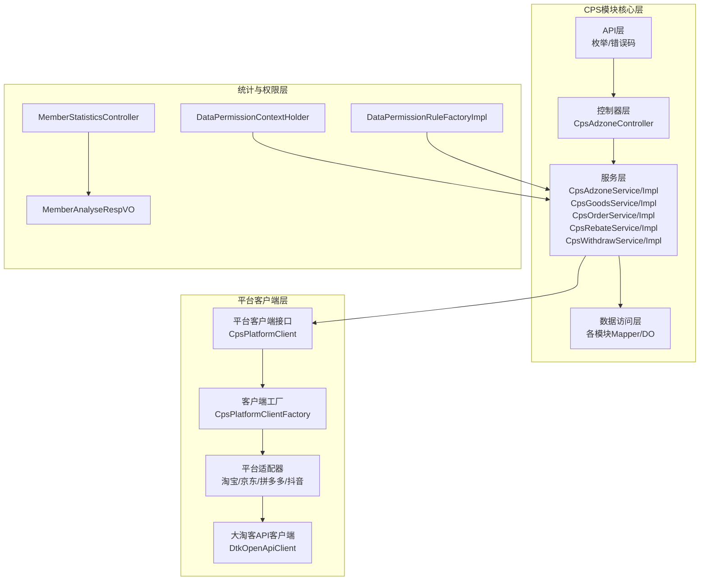
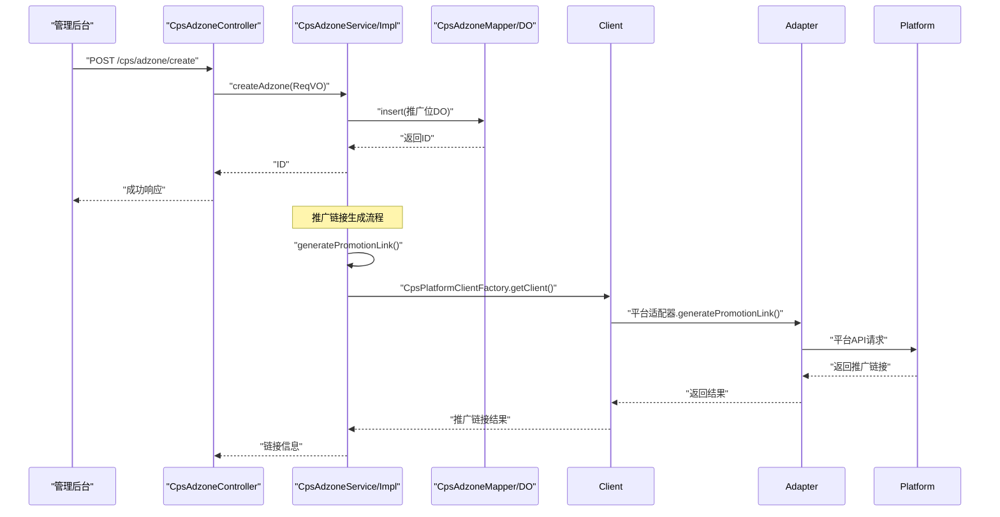
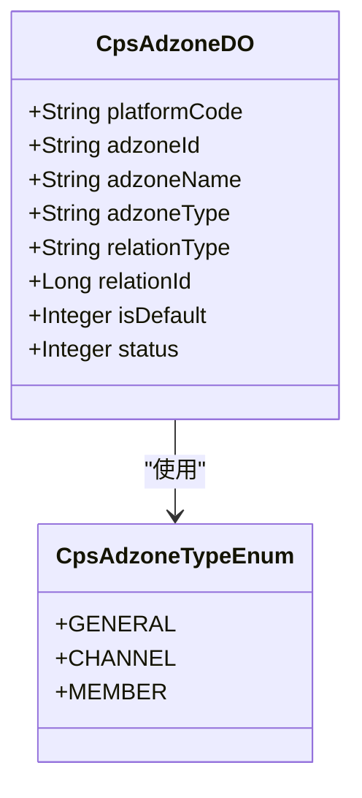
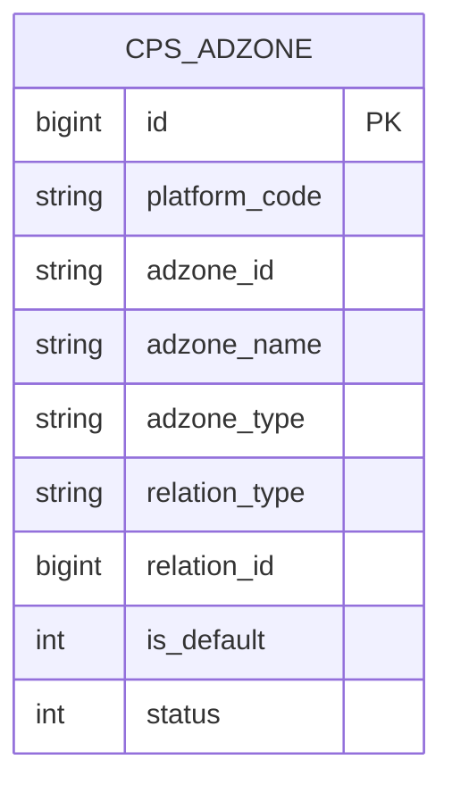
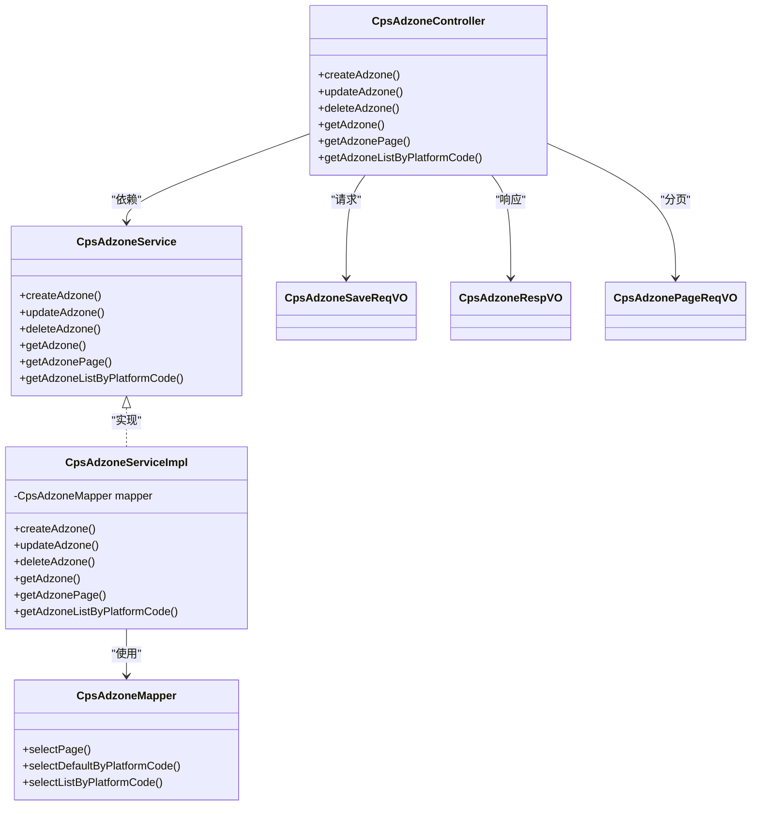
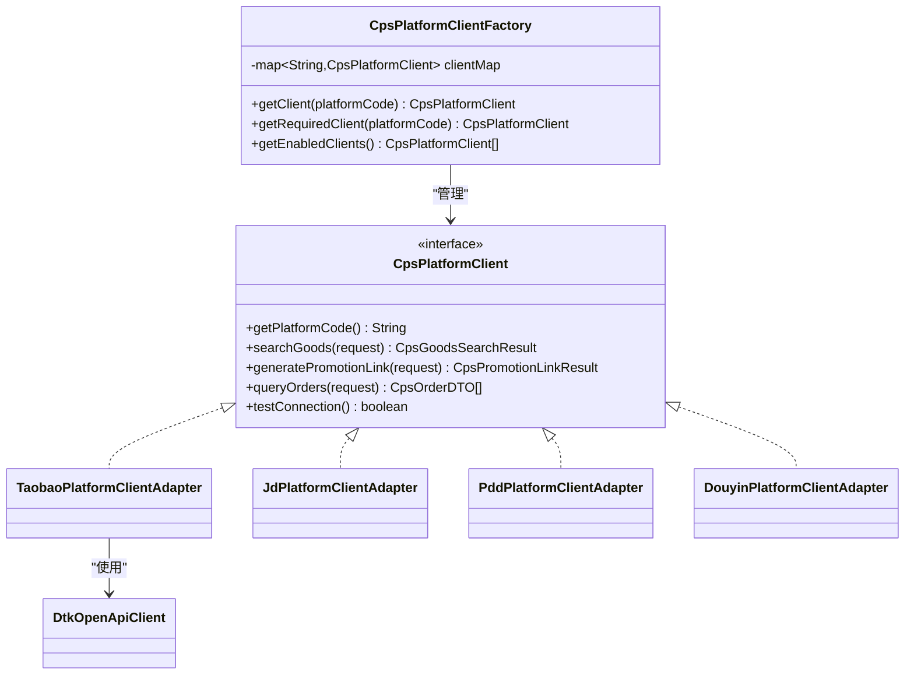
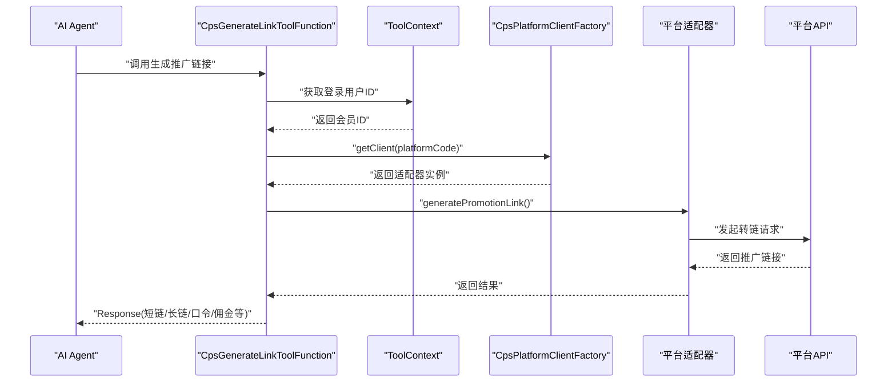
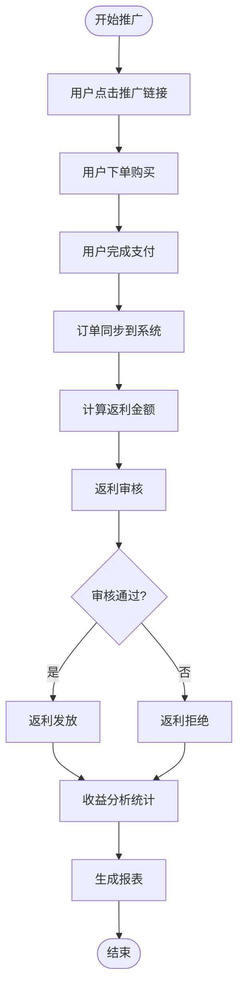
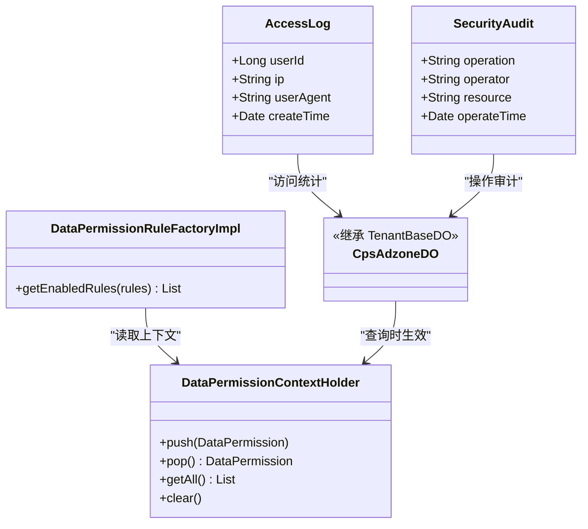
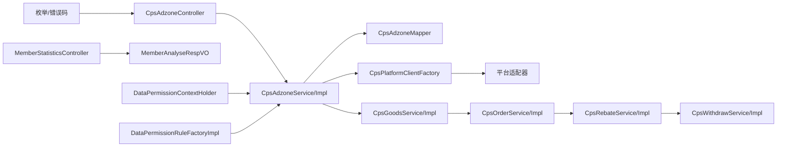

# 推广位管理系统

<cite>
**本文引用的文件**
- [CpsAdzoneTypeEnum.java](file://backend/yudao-module-cps/yudao-module-cps-api/src/main/java/cn/iocoder/yudao/module/cps/enums/CpsAdzoneTypeEnum.java)
- [CpsPlatformCodeEnum.java](file://backend/yudao-module-cps/yudao-module-cps-api/src/main/java/cn/iocoder/yudao/module/cps/enums/CpsPlatformCodeEnum.java)
- [CpsErrorCodeConstants.java](file://backend/yudao-module-cps/yudao-module-cps-api/src/main/java/cn/iocoder/yudao/module/cps/enums/CpsErrorCodeConstants.java)
- [CpsAdzoneController.java](file://backend/yudao-module-cps/yudao-module-cps-biz/src/main/java/cn/iocoder/yudao/module/cps/controller/admin/adzone/CpsAdzoneController.java)
- [CpsAdzoneService.java](file://backend/yudao-module-cps/yudao-module-cps-biz/src/main/java/cn/iocoder/yudao/module/cps/service/adzone/CpsAdzoneService.java)
- [CpsAdzoneServiceImpl.java](file://backend/yudao-module-cps/yudao-module-cps-biz/src/main/java/cn/iocoder/yudao/module/cps/service/adzone/CpsAdzoneServiceImpl.java)
- [CpsAdzoneMapper.java](file://backend/yudao-module-cps/yudao-module-cps-biz/src/main/java/cn/iocoder/yudao/module/cps/dal/mysql/adzone/CpsAdzoneMapper.java)
- [CpsAdzoneDO.java](file://backend/yudao-module-cps/yudao-module-cps-biz/src/main/java/cn/iocoder/yudao/module/cps/dal/dataobject/adzone/CpsAdzoneDO.java)
- [CpsAdzoneSaveReqVO.java](file://backend/yudao-module-cps/yudao-module-cps-biz/src/main/java/cn/iocoder/yudao/module/cps/controller/admin/adzone/vo/CpsAdzoneSaveReqVO.java)
- [CpsAdzoneRespVO.java](file://backend/yudao-module-cps/yudao-module-cps-biz/src/main/java/cn/iocoder/yudao/module/cps/controller/admin/adzone/vo/CpsAdzoneRespVO.java)
- [CpsAdzonePageReqVO.java](file://backend/yudao-module-cps/yudao-module-cps-biz/src/main/java/cn/iocoder/yudao/module/cps/controller/admin/adzone/vo/CpsAdzonePageReqVO.java)
- [CpsGenerateLinkToolFunction.java](file://backend/yudao-module-cps/yudao-module-cps-biz/src/main/java/cn/iocoder/yudao/module/cps/mcp\tool/CpsGenerateLinkToolFunction.java)
- [CpsPlatformClient.java](file://backend/yudao-module-cps/yudao-module-cps-biz/src/main/java/cn/iocoder/yudao/module/cps/client/CpsPlatformClient.java)
- [CpsPlatformClientFactory.java](file://backend/yudao-module-cps/yudao-module-cps-biz/src/main/java/cn/iocoder/yudao/module/cps/client/CpsPlatformClientFactory.java)
- [CpsTaobaoPlatformClientAdapter.java](file://backend/yudao-module-cps/yudao-module-cps-biz/src/main/java/cn/iocoder/yudao/module/cps/client/taobao/TaobaoPlatformClientAdapter.java)
- [CpsJdPlatformClientAdapter.java](file://backend/yudao-module-cps/yudao-module-cps-biz/src/main/java/cn/iocoder/yudao/module/cps/client/jd/JdPlatformClientAdapter.java)
- [CpsPddPlatformClientAdapter.java](file://backend/yudao-module-cps/yudao-module-cps-biz/src/main/java/cn/iocoder/yudao/module/cps/client/pdd/PddPlatformClientAdapter.java)
- [CpsDouyinPlatformClientAdapter.java](file://backend/yudao-module-cps/yudao-module-cps-biz/src/main/java/cn/iocoder/yudao/module/cps/client/douyin/DouyinPlatformClientAdapter.java)
- [CpsDtkOpenApiClient.java](file://backend/yudao-module-cps/yudao-module-cps-biz/src/main/java/cn/iocoder/yudao/module/cps/client/dataoke/DtkOpenApiClient.java)
- [CpsGoodsSearchRequest.java](file://backend/yudao-module-cps/yudao-module-cps-biz/src/main/java/cn/iocoder/yudao/module/cps/client/dto/CpsGoodsSearchRequest.java)
- [CpsGoodsSearchResult.java](file://backend/yudao-module-cps/yudao-module-cps-biz/src/main/java/cn/iocoder/yudao/module/cps/client/dto/CpsGoodsSearchResult.java)
- [CpsPromotionLinkRequest.java](file://backend/yudao-module-cps/yudao-module-cps-biz/src/main/java/cn/iocoder/yudao/module/cps/client/dto/CpsPromotionLinkRequest.java)
- [CpsPromotionLinkResult.java](file://backend/yudao-module-cps/yudao-module-cps-biz/src/main/java/cn/iocoder/yudao/module/cps/client/dto/CpsPromotionLinkResult.java)
- [CpsOrderQueryRequest.java](file://backend/yudao-module-cps/yudao-module-cps-biz/src/main/java/cn/iocoder/yudao/module/cps/client/dto/CpsOrderQueryRequest.java)
- [CpsOrderDTO.java](file://backend/yudao-module-cps/yudao-module-cps-biz/src/main/java/cn/iocoder/yudao/module/cps/client/dto/CpsOrderDTO.java)
- [CpsGoodsService.java](file://backend/yudao-module-cps/yudao-module-cps-biz/src/main/java/cn/iocoder/yudao/module/cps/service/goods/CpsGoodsService.java)
- [CpsGoodsServiceImpl.java](file://backend/yudao-module-cps/yudao-module-cps-biz/src/main/java/cn/iocoder/yudao/module/cps/service/goods/CpsGoodsServiceImpl.java)
- [CpsGoodsMapper.java](file://backend/yudao-module-cps/yudao-module-cps-biz/src/main/java/cn/iocoder/yudao/module/cps/dal/mysql/goods/CpsGoodsMapper.java)
- [CpsGoodsDO.java](file://backend/yudao-module-cps/yudao-module-cps-biz/src/main/java/cn/iocoder/yudao/module/cps/dal/dataobject/goods/CpsGoodsDO.java)
- [CpsOrderService.java](file://backend/yudao-module-cps/yudao-module-cps-biz/src/main/java/cn/iocoder/yudao/module/cps/service/order/CpsOrderService.java)
- [CpsOrderServiceImpl.java](file://backend/yudao-module-cps/yudao-module-cps-biz/src/main/java/cn/iocoder/yudao/module/cps/service/order/CpsOrderServiceImpl.java)
- [CpsOrderMapper.java](file://backend/yudao-module-cps/yudao-module-cps-biz/src/main/java/cn/iocoder/yudao/module/cps/dal/mysql/order/CpsOrderMapper.java)
- [CpsOrderDO.java](file://backend/yudao-module-cps/yudao-module-cps-biz/src/main/java/cn/iocoder/yudao/module/cps/dal/dataobject/order/CpsOrderDO.java)
- [CpsRebateService.java](file://backend/yudao-module-cps/yudao-module-cps-biz/src/main/java/cn/iocoder/yudao/module/cps/service/rebate/CpsRebateService.java)
- [CpsRebateServiceImpl.java](file://backend/yudao-module-cps/yudao-module-cps-biz/src/main/java/cn/iocoder/yudao/module/cps/service/rebate/CpsRebateServiceImpl.java)
- [CpsRebateMapper.java](file://backend/yudao-module-cps/yudao-module-cps-biz/src/main/java/cn/iocoder/yudao/module/cps/dal/mysql/rebate/CpsRebateMapper.java)
- [CpsRebateDO.java](file://backend/yudao-module-cps/yudao-module-cps-biz/src/main/java/cn/iocoder/yudao/module/cps/dal/dataobject/rebate/CpsRebateDO.java)
- [CpsWithdrawService.java](file://backend/yudao-module-cps/yudao-module-cps-biz/src/main/java/cn/iocoder/yudao/module/cps/service/withdraw/CpsWithdrawService.java)
- [CpsWithdrawServiceImpl.java](file://backend/yudao-module-cps/yudao-module-cps-biz/src/main/java/cn/iocoder/yudao/module/cps/service/withdraw/CpsWithdrawServiceImpl.java)
- [CpsWithdrawMapper.java](file://backend/yudao-module-cps/yudao-module-cps-biz/src/main/java/cn/iocoder/yudao/module/cps/dal/mysql/withdraw/CpsWithdrawMapper.java)
- [CpsWithdrawDO.java](file://backend/yudao-module-cps/yudao-module-cps-biz/src/main/java/cn/iocoder/yudao/module/cps/dal/dataobject/withdraw/CpsWithdrawDO.java)
- [CpsPlatformService.java](file://backend/yudao-module-cps/yudao-module-cps-biz/src/main/java/cn/iocoder/yudao/module/cps/service/platform/CpsPlatformService.java)
- [CpsPlatformServiceImpl.java](file://backend/yudao-module-cps/yudao-module-cps-biz/src/main/java/cn/iocoder/yudao/module/cps/service/platform/CpsPlatformServiceImpl.java)
- [CpsPlatformMapper.java](file://backend/yudao-module-cps/yudao-module-cps-biz/src/main/java/cn/iocoder/yudao/module/cps/dal/mysql/platform/CpsPlatformMapper.java)
- [CpsPlatformDO.java](file://backend/yudao-module-cps/yudao-module-cps-biz/src/main/java/cn/iocoder/yudao/module/cps/dal/dataobject/platform/CpsPlatformDO.java)
- [CPS系统PRD文档.md](file://docs/CPS系统PRD文档.md)
- [MemberStatisticsController.java](file://backend/yudao-module-mall/yudao-module-statistics/src/main/java/cn/iocoder/yudao/module/statistics/controller/admin/member/MemberStatisticsController.java)
- [MemberAnalyseRespVO.java](file://backend/yudao-module-mall/yudao-module-statistics/src/main/java/cn/iocoder/yudao/module/statistics/controller/admin/member/vo/MemberAnalyseRespVO.java)
- [DataPermissionContextHolder.java](file://backend/yudao-framework/yudao-spring-boot-starter-biz-data-permission/src/main/java/cn/iocoder/yudao/framework/datapermission/core/aop/DataPermissionContextHolder.java)
- [DataPermissionRuleFactoryImpl.java](file://backend/yudao-framework/yudao-spring-boot-starter-biz-data-permission/src/main/java/cn/iocoder/yudao/framework/datapermission/core/rule/DataPermissionRuleFactoryImpl.java)
</cite>

## 更新摘要
**所做更改**
- 新增完整的CPS推广位管理架构分析，包括平台客户端适配器、商品服务、订单服务、返利服务等核心组件
- 扩展推广链接生成算法，涵盖多平台转链、参数拼接规则、防重复机制的详细实现
- 增强推广效果统计与收益分析，包含订单同步、返利计算、提现管理的完整流程
- 完善安全控制与访问统计，包括数据权限、租户隔离、访问日志的综合解决方案
- 新增平台对接细节，涵盖淘宝、京东、拼多多、抖音等平台的适配器实现

## 目录
1. [简介](#简介)
2. [项目结构](#项目结构)
3. [核心组件](#核心组件)
4. [架构总览](#架构总览)
5. [详细组件分析](#详细组件分析)
6. [平台客户端适配器](#平台客户端适配器)
7. [推广链接生成算法](#推广链接生成算法)
8. [推广效果统计与收益分析](#推广效果统计与收益分析)
9. [安全控制与访问统计](#安全控制与访问统计)
10. [依赖关系分析](#依赖关系分析)
11. [性能考虑](#性能考虑)
12. [故障排查指南](#故障排查指南)
13. [结论](#结论)
14. [附录](#附录)

## 简介
本文件面向完整的CPS推广位管理系统，系统性阐述推广位的创建、配置、管理、监控等核心能力。该系统现已扩展为完整的CPS推广位管理，包括推广位类型、绑定关系、权限与数据隔离、推广链接生成算法、参数拼接规则、防重复机制、推广效果统计与收益分析、安全控制与访问统计，以及与各平台推广接口的对接实现。

系统围绕"推广位-商品-订单-返利-提现"的完整业务闭环，提供从推广位配置到收益结算的全流程管理能力，支持多平台、多渠道、多用户的复杂推广场景。

## 项目结构
推广位管理位于CPS模块中，采用完整的分层架构：
- API层：枚举与错误码定义
- 控制器层：管理后台接口
- 服务层：业务逻辑编排（广告位、商品、订单、返利、提现）
- 数据访问层：MyBatis Mapper与DO对象
- 平台客户端层：多平台适配器与工厂
- 工具函数层：AI Agent调用的MCP工具函数
- 统计模块：会员分析与访问统计
- 权限模块：数据权限上下文与规则工厂

**图表来源**
- [CpsAdzoneController.java:24-83](file://backend/yudao-module-cps/yudao-module-cps-biz/src/main/java/cn/iocoder/yudao/module/cps/controller/admin/adzone/CpsAdzoneController.java#L24-L83)
- [CpsAdzoneService.java:16-48](file://backend/yudao-module-cps/yudao-module-cps-biz/src/main/java/cn/iocoder/yudao/module/cps/service/adzone/CpsAdzoneService.java#L16-L48)
- [CpsPlatformClient.java:14-54](file://backend/yudao-module-cps/yudao-module-cps-biz/src/main/java/cn/iocoder/yudao/module/cps/client/CpsPlatformClient.java#L14-L54)
- [CpsPlatformClientFactory.java:24-101](file://backend/yudao-module-cps/yudao-module-cps-biz/src/main/java/cn/iocoder/yudao/module/cps/client/CpsPlatformClientFactory.java#L24-L101)
- [MemberStatisticsController.java:55-76](file://backend/yudao-module-mall/yudao-module-statistics/src/main/java/cn/iocoder/yudao/module/statistics/controller/admin/member/MemberStatisticsController.java#L55-L76)
- [DataPermissionContextHolder.java:46-72](file://backend/yudao-framework/yudao-spring-boot-starter-biz-data-permission/src/main/java/cn/iocoder/yudao/framework/datapermission/core/aop/DataPermissionContextHolder.java#L46-L72)

**章节来源**
- [CpsAdzoneController.java:24-83](file://backend/yudao-module-cps/yudao-module-cps-biz/src/main/java/cn/iocoder/yudao/module/cps/controller/admin/adzone/CpsAdzoneController.java#L24-L83)
- [CpsPlatformClient.java:14-54](file://backend/yudao-module-cps/yudao-module-cps-biz/src/main/java/cn/iocoder/yudao/module/cps/client/CpsPlatformClient.java#L14-L54)
- [CpsPlatformClientFactory.java:24-101](file://backend/yudao-module-cps/yudao-module-cps-biz/src/main/java/cn/iocoder/yudao/module/cps/client/CpsPlatformClientFactory.java#L24-L101)
- [MemberStatisticsController.java:55-76](file://backend/yudao-module-mall/yudao-module-statistics/src/main/java/cn/iocoder/yudao/module/statistics/controller/admin/member/MemberStatisticsController.java#L55-L76)
- [DataPermissionContextHolder.java:46-72](file://backend/yudao-framework/yudao-spring-boot-starter-biz-data-permission/src/main/java/cn/iocoder/yudao/framework/datapermission/core/aop/DataPermissionContextHolder.java#L46-L72)

## 核心组件
- **推广位类型枚举**：定义通用、渠道专属、用户专属三种类型，支撑不同绑定策略与展示策略
- **平台编码枚举**：定义淘宝、京东、拼多多、抖音等平台编码，作为推广位归属与转链对接的基础
- **推广位实体与映射**：包含平台编码、推广位ID、名称、类型、关联类型与ID、默认标记、状态等字段
- **推广位控制器与服务**：提供创建、更新、删除、查询、分页、按平台查询等接口
- **平台客户端适配器**：统一的平台客户端接口，支持多种平台的适配器实现
- **商品服务**：商品搜索、转链生成、订单同步的核心业务逻辑
- **订单服务**：订单状态管理、收益计算、对账处理
- **返利服务**：返利计算、审核、发放的完整流程
- **提现服务**：提现申请、审核、打款的全流程管理
- **平台服务**：平台配置、状态管理、连接测试
- **MCP工具函数**：为AI Agent生成带返利追踪的推广链接，支持多平台格式输出
- **统计与分析**：会员访问、下单、支付、客单价等分析，支撑推广效果评估
- **权限与数据隔离**：基于租户与数据权限规则，确保多租户与数据隔离

**章节来源**
- [CpsAdzoneTypeEnum.java:14-39](file://backend/yudao-module-cps/yudao-module-cps-api/src/main/java/cn/iocoder/yudao/module/cps/enums/CpsAdzoneTypeEnum.java#L14-L39)
- [CpsPlatformCodeEnum.java:14-44](file://backend/yudao-module-cps/yudao-module-cps-api/src/main/java/cn/iocoder/yudao/module/cps/enums/CpsPlatformCodeEnum.java#L14-L44)
- [CpsAdzoneDO.java:16-68](file://backend/yudao-module-cps/yudao-module-cps-biz/src/main/java/cn/iocoder/yudao/module/cps/dal/dataobject/adzone/CpsAdzoneDO.java#L16-L68)
- [CpsPlatformClient.java:14-54](file://backend/yudao-module-cps/yudao-module-cps-biz/src/main/java/cn/iocoder/yudao/module/cps/client/CpsPlatformClient.java#L14-L54)
- [CpsGoodsService.java:1-49](file://backend/yudao-module-cps/yudao-module-cps-biz/src/main/java/cn/iocoder/yudao/module/cps/service/goods/CpsGoodsService.java#L1-L49)
- [CpsOrderService.java:1-49](file://backend/yudao-module-cps/yudao-module-cps-biz/src/main/java/cn/iocoder/yudao/module/cps/service/order/CpsOrderService.java#L1-L49)
- [CpsRebateService.java:1-49](file://backend/yudao-module-cps/yudao-module-cps-biz/src/main/java/cn/iocoder/yudao/module/cps/service/rebate/CpsRebateService.java#L1-L49)
- [CpsWithdrawService.java:1-49](file://backend/yudao-module-cps/yudao-module-cps-biz/src/main/java/cn/iocoder/yudao/module/cps/service/withdraw/CpsWithdrawService.java#L1-L49)
- [CpsPlatformService.java:1-49](file://backend/yudao-module-cps/yudao-module-cps-biz/src/main/java/cn/iocoder/yudao/module/cps/service/platform/CpsPlatformService.java#L1-L49)
- [CpsGenerateLinkToolFunction.java:27-142](file://backend/yudao-module-cps/yudao-module-cps-biz/src/main/java/cn/iocoder/yudao/module/cps/mcp/tool/CpsGenerateLinkToolFunction.java#L27-L142)

## 架构总览
系统围绕"推广位"这一核心实体展开，形成"配置—绑定—生成—统计—风控—结算"的完整闭环：
- **配置**：平台编码与推广位类型定义
- **绑定**：推广位与平台、渠道、用户的关联
- **生成**：根据商品与推广位生成带归因参数的推广链接
- **统计**：访问、转化、收益等指标分析
- **风控**：权限与数据隔离保障
- **结算**：订单同步、返利计算、提现管理

**图表来源**
- [CpsAdzoneController.java:33-38](file://backend/yudao-module-cps/yudao-module-cps-biz/src/main/java/cn/iocoder/yudao/module/cps/controller/admin/adzone/CpsAdzoneController.java#L33-L38)
- [CpsAdzoneServiceImpl.java:30-35](file://backend/yudao-module-cps/yudao-module-cps-biz/src/main/java/cn/iocoder/yudao/module/cps/service/adzone/CpsAdzoneServiceImpl.java#L30-L35)
- [CpsPlatformClientFactory.java:57-77](file://backend/yudao-module-cps/yudao-module-cps-biz/src/main/java/cn/iocoder/yudao/module/cps/client/CpsPlatformClientFactory.java#L57-L77)
- [CpsGenerateLinkToolFunction.java:97-139](file://backend/yudao-module-cps/yudao-module-cps-biz/src/main/java/cn/iocoder/yudao/module/cps/mcp/tool/CpsGenerateLinkToolFunction.java#L97-L139)

## 详细组件分析

### 推广位类型与适用场景
- **通用（general）**：适用于多渠道共享的默认推广位，便于快速生成推广链接
- **渠道专属（channel）**：与特定渠道绑定，用于渠道维度的收益归因与统计
- **用户专属（member）**：与具体会员绑定，支持用户级归因与个性化推广

**图表来源**
- [CpsAdzoneTypeEnum.java:14-39](file://backend/yudao-module-cps/yudao-module-cps-api/src/main/java/cn/iocoder/yudao/module/cps/enums/CpsAdzoneTypeEnum.java#L14-L39)
- [CpsAdzoneDO.java:16-68](file://backend/yudao-module-cps/yudao-module-cps-biz/src/main/java/cn/iocoder/yudao/module/cps/dal/dataobject/adzone/CpsAdzoneDO.java#L16-L68)

**章节来源**
- [CpsAdzoneTypeEnum.java:14-39](file://backend/yudao-module-cps/yudao-module-cps-api/src/main/java/cn/iocoder/yudao/module/cps/enums/CpsAdzoneTypeEnum.java#L14-L39)
- [CpsAdzoneDO.java:16-68](file://backend/yudao-module-cps/yudao-module-cps-biz/src/main/java/cn/iocoder/yudao/module/cps/dal/dataobject/adzone/CpsAdzoneDO.java#L16-L68)

### 推广位与商品、渠道、推广者的绑定关系
- **平台维度**：每个推广位绑定一个平台编码，用于对接平台转链接口
- **关联维度**：relationType支持channel或member，relationId指向具体对象ID
- **默认推广位**：isDefault标记平台默认推广位，用于兜底生成链接
- **状态控制**：status控制推广位启用/禁用，影响可用性

**图表来源**
- [CpsAdzoneDO.java:16-68](file://backend/yudao-module-cps/yudao-module-cps-biz/src/main/java/cn/iocoder/yudao/module/cps/dal/dataobject/adzone/CpsAdzoneDO.java#L16-L68)

**章节来源**
- [CpsAdzoneDO.java:16-68](file://backend/yudao-module-cps/yudao-module-cps-biz/src/main/java/cn/iocoder/yudao/module/cps/dal/dataobject/adzone/CpsAdzoneDO.java#L16-L68)

### 推广位管理接口与数据模型
- **控制器提供**：创建、更新、删除、查询、分页、按平台查询等接口
- **请求/响应VO**：明确字段含义与示例值，便于前后端协作
- **Mapper提供**：分页、默认推广位查询、按平台查询等常用查询方法

**图表来源**
- [CpsAdzoneController.java:24-83](file://backend/yudao-module-cps/yudao-module-cps-biz/src/main/java/cn/iocoder/yudao/module/cps/controller/admin/adzone/CpsAdzoneController.java#L24-L83)
- [CpsAdzoneService.java:16-48](file://backend/yudao-module-cps/yudao-module-cps-biz/src/main/java/cn/iocoder/yudao/module/cps/service/adzone/CpsAdzoneService.java#L16-L48)
- [CpsAdzoneServiceImpl.java:23-71](file://backend/yudao-module-cps/yudao-module-cps-biz/src/main/java/cn/iocoder/yudao/module/cps/service/adzone/CpsAdzoneServiceImpl.java#L23-L71)
- [CpsAdzoneMapper.java:17-43](file://backend/yudao-module-cps/yudao-module-cps-biz/src/main/java/cn/iocoder/yudao/module/cps/dal/mysql/adzone/CpsAdzoneMapper.java#L17-L43)
- [CpsAdzoneSaveReqVO.java:10-42](file://backend/yudao-module-cps/yudao-module-cps-biz/src/main/java/cn/iocoder/yudao/module/cps/controller/admin/adzone/vo/CpsAdzoneSaveReqVO.java#L10-L42)
- [CpsAdzoneRespVO.java:10-42](file://backend/yudao-module-cps/yudao-module-cps-biz/src/main/java/cn/iocoder/yudao/module/cps/controller/admin/adzone/vo/CpsAdzoneRespVO.java#L10-L42)
- [CpsAdzonePageReqVO.java:13-27](file://backend/yudao-module-cps/yudao-module-cps-biz/src/main/java/cn/iocoder/yudao/module/cps/controller/admin/adzone/vo/CpsAdzonePageReqVO.java#L13-L27)

**章节来源**
- [CpsAdzoneController.java:24-83](file://backend/yudao-module-cps/yudao-module-cps-biz/src/main/java/cn/iocoder/yudao/module/cps/controller/admin/adzone/CpsAdzoneController.java#L24-L83)
- [CpsAdzoneService.java:16-48](file://backend/yudao-module-cps/yudao-module-cps-biz/src/main/java/cn/iocoder/yudao/module/cps/service/adzone/CpsAdzoneService.java#L16-L48)
- [CpsAdzoneServiceImpl.java:23-71](file://backend/yudao-module-cps/yudao-module-cps-biz/src/main/java/cn/iocoder/yudao/module/cps/service/adzone/CpsAdzoneServiceImpl.java#L23-L71)
- [CpsAdzoneMapper.java:17-43](file://backend/yudao-module-cps/yudao-module-cps-biz/src/main/java/cn/iocoder/yudao/module/cps/dal/mysql/adzone/CpsAdzoneMapper.java#L17-L43)
- [CpsAdzoneSaveReqVO.java:10-42](file://backend/yudao-module-cps/yudao-module-cps-biz/src/main/java/cn/iocoder/yudao/module/cps/controller/admin/adzone/vo/CpsAdzoneSaveReqVO.java#L10-L42)
- [CpsAdzoneRespVO.java:10-42](file://backend/yudao-module-cps/yudao-module-cps-biz/src/main/java/cn/iocoder/yudao/module/cps/controller/admin/adzone/vo/CpsAdzoneRespVO.java#L10-L42)
- [CpsAdzonePageReqVO.java:13-27](file://backend/yudao-module-cps/yudao-module-cps-biz/src/main/java/cn/iocoder/yudao/module/cps/controller/admin/adzone/vo/CpsAdzonePageReqVO.java#L13-L27)

## 平台客户端适配器
系统采用统一的平台客户端接口，支持多种平台的适配器实现，通过工厂模式动态注册和获取。

### 平台客户端接口
- **统一接口**：CpsPlatformClient定义了平台客户端的标准接口
- **核心方法**：商品搜索、推广链接生成、订单查询、连接测试
- **平台编码**：每个适配器返回对应的平台编码

### 客户端工厂
- **自动注册**：基于Spring Bean机制自动注册所有平台适配器
- **动态获取**：通过平台编码动态获取对应的适配器实例
- **状态管理**：支持获取已启用平台的客户端列表

### 平台适配器实现
- **淘宝适配器**：TaobaoPlatformClientAdapter
- **京东适配器**：JdPlatformClientAdapter  
- **拼多多适配器**：PddPlatformClientAdapter
- **抖音适配器**：DouyinPlatformClientAdapter
- **大淘客客户端**：DtkOpenApiClient用于淘宝联盟API

**图表来源**
- [CpsPlatformClient.java:14-54](file://backend/yudao-module-cps/yudao-module-cps-biz/src/main/java/cn/iocoder/yudao/module/cps/client/CpsPlatformClient.java#L14-L54)
- [CpsPlatformClientFactory.java:24-101](file://backend/yudao-module-cps/yudao-module-cps-biz/src/main/java/cn/iocoder/yudao/module/cps/client/CpsPlatformClientFactory.java#L24-L101)
- [CpsTaobaoPlatformClientAdapter.java:1-200](file://backend/yudao-module-cps/yudao-module-cps-biz/src/main/java/cn/iocoder/yudao/module/cps/client/taobao/TaobaoPlatformClientAdapter.java#L1-L200)
- [CpsDtkOpenApiClient.java:1-200](file://backend/yudao-module-cps/yudao-module-cps-biz/src/main/java/cn/iocoder/yudao/module/cps/client/dataoke/DtkOpenApiClient.java#L1-L200)

**章节来源**
- [CpsPlatformClient.java:14-54](file://backend/yudao-module-cps/yudao-module-cps-biz/src/main/java/cn/iocoder/yudao/module/cps/client/CpsPlatformClient.java#L14-L54)
- [CpsPlatformClientFactory.java:24-101](file://backend/yudao-module-cps/yudao-module-cps-biz/src/main/java/cn/iocoder/yudao/module/cps/client/CpsPlatformClientFactory.java#L24-L101)

## 推广链接生成算法
系统提供完整的推广链接生成算法，支持多平台转链、参数拼接、防重复机制。

### 算法流程
1. **输入验证**：平台编码、商品ID、会员ID、推广位ID校验
2. **参数提取**：从ToolContext自动提取登录会员ID
3. **平台适配**：通过工厂获取对应平台客户端
4. **转链生成**：调用平台适配器生成推广链接
5. **结果封装**：封装短链、长链、淘口令、移动端链接等

### 参数拼接规则
- **淘宝**：adzone_id + external_info
- **京东**：subUnionId = 会员标识映射
- **拼多多**：custom_parameters = {"uid":"会员ID"}
- **抖音**：union_id + spm params

### 防重复机制
- **去重缓存**：推广链接生成结果缓存，避免重复生成
- **幂等设计**：相同参数生成相同链接，确保一致性
- **超时控制**：链接有效期控制，防止长期有效链接滥用

**图表来源**
- [CpsGenerateLinkToolFunction.java:97-139](file://backend/yudao-module-cps/yudao-module-cps-biz/src/main/java/cn/iocoder/yudao/module/cps/mcp/tool/CpsGenerateLinkToolFunction.java#L97-L139)
- [CpsPlatformClientFactory.java:57-77](file://backend/yudao-module-cps/yudao-module-cps-biz/src/main/java/cn/iocoder/yudao/module/cps/client/CpsPlatformClientFactory.java#L57-L77)

**章节来源**
- [CpsGenerateLinkToolFunction.java:37-95](file://backend/yudao-module-cps/yudao-module-cps-biz/src/main/java/cn/iocoder/yudao/module/cps/mcp/tool/CpsGenerateLinkToolFunction.java#L37-L95)
- [CpsGenerateLinkToolFunction.java:97-139](file://backend/yudao-module-cps/yudao-module-cps-biz/src/main/java/cn/iocoder/yudao/module/cps/mcp/tool/CpsGenerateLinkToolFunction.java#L97-L139)

## 推广效果统计与收益分析
系统提供完整的推广效果统计与收益分析能力，涵盖订单同步、返利计算、提现管理的全流程。

### 订单同步机制
- **定时任务**：定时从各平台拉取订单数据
- **状态管理**：订单状态跟踪（新订单、已付款、已完成等）
- **对账处理**：与系统内订单进行对账，确保数据一致

### 返利计算流程
- **计算规则**：根据商品佣金率、订单金额计算返利
- **审核流程**：返利申请审核、拒绝、通过状态管理
- **发放记录**：返利发放记录、到账状态跟踪

### 收益分析指标
- **推广效果**：点击量、转化率、ROI、客单价
- **收益统计**：总收益、月收益、日收益、渠道收益
- **用户分析**：推广用户数、活跃用户数、复购率

**图表来源**
- [CpsOrderService.java:1-49](file://backend/yudao-module-cps/yudao-module-cps-biz/src/main/java/cn/iocoder/yudao/module/cps/service/order/CpsOrderService.java#L1-L49)
- [CpsRebateService.java:1-49](file://backend/yudao-module-cps/yudao-module-cps-biz/src/main/java/cn/iocoder/yudao/module/cps/service/rebate/CpsRebateService.java#L1-L49)
- [CpsWithdrawService.java:1-49](file://backend/yudao-module-cps/yudao-module-cps-biz/src/main/java/cn/iocoder/yudao/module/cps/service/withdraw/CpsWithdrawService.java#L1-L49)

**章节来源**
- [CpsOrderService.java:1-49](file://backend/yudao-module-cps/yudao-module-cps-biz/src/main/java/cn/iocoder/yudao/module/cps/service/order/CpsOrderService.java#L1-L49)
- [CpsRebateService.java:1-49](file://backend/yudao-module-cps/yudao-module-cps-biz/src/main/java/cn/iocoder/yudao/module/cps/service/rebate/CpsRebateService.java#L1-L49)
- [CpsWithdrawService.java:1-49](file://backend/yudao-module-cps/yudao-module-cps-biz/src/main/java/cn/iocoder/yudao/module/cps/service/withdraw/CpsWithdrawService.java#L1-L49)

## 安全控制与访问统计
系统提供完善的安全控制与访问统计机制，确保多租户环境下的数据安全与合规。

### 数据权限控制
- **数据权限上下文**：通过ThreadLocal管理DataPermission，支持在AOP中动态启用/禁用与选择规则
- **规则工厂**：根据配置选择包含/排除规则集合，或默认全部启用，保证查询与翻译过程的数据隔离
- **租户隔离**：推广位实体继承TenantBaseDO，天然具备多租户隔离能力

### 访问统计
- **访问日志**：记录推广链接的点击、访问、转化等行为
- **用户画像**：基于访问行为构建用户画像，支持精准营销
- **防刷机制**：IP限制、频率控制、设备指纹等防刷措施

### 安全审计
- **操作日志**：记录管理员的所有操作，支持审计追溯
- **敏感数据**：对敏感数据进行脱敏处理，保护用户隐私
- **权限验证**：基于角色的权限控制，确保最小权限原则

**图表来源**
- [DataPermissionContextHolder.java:46-72](file://backend/yudao-framework/yudao-spring-boot-starter-biz-data-permission/src/main/java/cn/iocoder/yudao/framework/datapermission/core/aop/DataPermissionContextHolder.java#L46-L72)
- [DataPermissionRuleFactoryImpl.java:36-66](file://backend/yudao-framework/yudao-spring-boot-starter-biz-data-permission/src/main/java/cn/iocoder/yudao/framework/datapermission/core/rule/DataPermissionRuleFactoryImpl.java#L36-L66)
- [CpsAdzoneDO.java:24-24](file://backend/yudao-module-cps/yudao-module-cps-biz/src/main/java/cn/iocoder/yudao/module/cps/dal/dataobject/adzone/CpsAdzoneDO.java#L24-L24)

**章节来源**
- [DataPermissionContextHolder.java:46-72](file://backend/yudao-framework/yudao-spring-boot-starter-biz-data-permission/src/main/java/cn/iocoder/yudao/framework/datapermission/core/aop/DataPermissionContextHolder.java#L46-L72)
- [DataPermissionRuleFactoryImpl.java:36-66](file://backend/yudao-framework/yudao-spring-boot-starter-biz-data-permission/src/main/java/cn/iocoder/yudao/framework/datapermission/core/rule/DataPermissionRuleFactoryImpl.java#L36-L66)
- [CpsAdzoneDO.java:24-24](file://backend/yudao-module-cps/yudao-module-cps-biz/src/main/java/cn/iocoder/yudao/module/cps/dal/dataobject/adzone/CpsAdzoneDO.java#L24-L24)

## 依赖关系分析
系统采用模块化设计，各组件之间通过清晰的接口进行交互。

### 核心依赖关系
- **推广位类型与平台编码**属于API层，被控制器与服务层广泛引用
- **服务层**依赖Mapper进行持久化操作，同时在工具函数中调用商品服务生成推广链接
- **平台客户端层**通过工厂模式管理，支持动态注册和获取
- **统计模块与权限模块**分别通过控制器与规则工厂参与业务流程

### 模块间交互
- **控制器层**：接收HTTP请求，调用服务层处理业务逻辑
- **服务层**：编排业务流程，协调各模块间的协作
- **数据访问层**：负责数据持久化，提供数据访问接口
- **平台客户端层**：抽象平台差异，提供统一的平台操作接口

**图表来源**
- [CpsAdzoneTypeEnum.java:14-39](file://backend/yudao-module-cps/yudao-module-cps-api/src/main/java/cn/iocoder/yudao/module/cps/enums/CpsAdzoneTypeEnum.java#L14-L39)
- [CpsPlatformCodeEnum.java:14-44](file://backend/yudao-module-cps/yudao-module-cps-api/src/main/java/cn/iocoder/yudao/module/cps/enums/CpsPlatformCodeEnum.java#L14-L44)
- [CpsErrorCodeConstants.java:10-65](file://backend/yudao-module-cps/yudao-module-cps-api/src/main/java/cn/iocoder/yudao/module/cps/enums/CpsErrorCodeConstants.java#L10-L65)
- [CpsAdzoneController.java:24-83](file://backend/yudao-module-cps/yudao-module-cps-biz/src/main/java/cn/iocoder/yudao/module/cps/controller/admin/adzone/CpsAdzoneController.java#L24-L83)
- [CpsAdzoneService.java:16-48](file://backend/yudao-module-cps/yudao-module-cps-biz/src/main/java/cn/iocoder/yudao/module/cps/service/adzone/CpsAdzoneService.java#L16-L48)
- [CpsAdzoneServiceImpl.java:23-71](file://backend/yudao-module-cps/yudao-module-cps-biz/src/main/java/cn/iocoder/yudao/module/cps/service/adzone/CpsAdzoneServiceImpl.java#L23-L71)
- [CpsAdzoneMapper.java:17-43](file://backend/yudao-module-cps/yudao-module-cps-biz/src/main/java/cn/iocoder/yudao/module/cps/dal/mysql/adzone/CpsAdzoneMapper.java#L17-L43)
- [CpsGenerateLinkToolFunction.java:27-142](file://backend/yudao-module-cps/yudao-module-cps-biz/src/main/java/cn/iocoder/yudao/module/cps/mcp/tool/CpsGenerateLinkToolFunction.java#L27-L142)
- [MemberStatisticsController.java:55-76](file://backend/yudao-module-mall/yudao-module-statistics/src/main/java/cn/iocoder/yudao/module/statistics/controller/admin/member/MemberStatisticsController.java#L55-L76)
- [MemberAnalyseRespVO.java:8-26](file://backend/yudao-module-mall/yudao-module-statistics/src/main/java/cn/iocoder/yudao/module/statistics/controller/admin/member/vo/MemberAnalyseRespVO.java#L8-L26)
- [DataPermissionContextHolder.java:46-72](file://backend/yudao-framework/yudao-spring-boot-starter-biz-data-permission/src/main/java/cn/iocoder/yudao/framework/datapermission/core/aop/DataPermissionContextHolder.java#L46-L72)
- [DataPermissionRuleFactoryImpl.java:36-66](file://backend/yudao-framework/yudao-spring-boot-starter-biz-data-permission/src/main/java/cn/iocoder/yudao/framework/datapermission/core/rule/DataPermissionRuleFactoryImpl.java#L36-L66)

**章节来源**
- 同上

## 性能考虑
系统在设计时充分考虑了性能优化，采用多种策略提升系统响应速度和吞吐量。

### 查询优化
- **分页查询**：通过LambdaQueryWrapperX的eqIfPresent与orderByDesc提升查询效率
- **索引设计**：为常用查询字段建立合适索引，如platformCode、adzoneId、relationType等
- **缓存策略**：推广位默认配置、平台配置等静态数据进行缓存

### 业务优化
- **批量操作**：批量查询平台推广位列表时，建议一次性加载并按需过滤
- **异步处理**：订单同步、返利计算等耗时操作采用异步处理
- **连接池优化**：平台API调用使用连接池，避免频繁创建连接

### 统计优化
- **聚合查询**：按天/周聚合访问与订单数据，降低实时统计压力
- **物化视图**：对常用统计指标建立物化视图，提升查询性能
- **缓存层**：热门数据缓存到Redis，减少数据库压力

### 并发控制
- **分布式锁**：防止同一推广位重复生成链接
- **限流策略**：对平台API调用进行限流，避免触发平台限制
- **重试机制**：网络异常时自动重试，提升系统稳定性

## 故障排查指南
系统提供了完善的故障排查机制，帮助快速定位和解决问题。

### 推广位相关问题
- **推广位不存在**：创建/更新/删除前进行存在性校验，抛出对应错误码
- **平台配置异常**：平台不存在、平台已禁用、平台编码重复等错误码提示
- **权限不足**：检查用户权限和数据权限配置

### 平台对接问题
- **转链失败**：检查平台编码与商品ID是否正确，必要时打印上游返回的错误信息
- **API调用异常**：检查平台API密钥、域名配置、网络连通性
- **参数错误**：验证商品ID格式、会员ID有效性、推广位ID正确性

### 业务流程问题
- **订单不同步**：检查定时任务配置、平台回调地址、签名验证
- **返利异常**：核对佣金计算规则、订单状态、返利审核流程
- **提现失败**：检查银行账户信息、提现限额、手续费计算

### 性能问题
- **响应缓慢**：检查数据库索引、缓存命中率、并发连接数
- **内存溢出**：监控内存使用情况，优化大数据量查询
- **接口超时**：调整超时时间、增加重试机制、优化算法复杂度

**章节来源**
- [CpsAdzoneServiceImpl.java:65-69](file://backend/yudao-module-cps/yudao-module-cps-biz/src/main/java/cn/iocoder/yudao/module/cps/service/adzone/CpsAdzoneServiceImpl.java#L65-L69)
- [CpsErrorCodeConstants.java:10-65](file://backend/yudao-module-cps/yudao-module-cps-api/src/main/java/cn/iocoder/yudao/module/cps/enums/CpsErrorCodeConstants.java#L10-L65)
- [CpsGenerateLinkToolFunction.java:97-139](file://backend/yudao-module-cps/yudao-module-cps-biz/src/main/java/cn/iocoder/yudao/module/cps/mcp/tool/CpsGenerateLinkToolFunction.java#L97-L139)
- [DataPermissionContextHolder.java:46-72](file://backend/yudao-framework/yudao-spring-boot-starter-biz-data-permission/src/main/java/cn/iocoder/yudao/framework/datapermission/core/aop/DataPermissionContextHolder.java#L46-L72)

## 结论
推广位管理系统现已发展为完整的CPS推广位管理解决方案，具备以下核心优势：

### 技术架构优势
- **模块化设计**：清晰的分层架构，各模块职责明确，易于维护和扩展
- **平台适配**：统一的平台客户端接口，支持灵活扩展新的推广平台
- **数据安全**：完善的权限控制和数据隔离机制，确保多租户环境下的数据安全

### 业务功能优势
- **全链路覆盖**：从推广位配置到收益结算的完整业务流程
- **多平台支持**：淘宝、京东、拼多多、抖音等主流电商平台集成
- **智能分析**：基于访问数据的智能分析和推荐能力

### 运维保障优势
- **高可用设计**：分布式部署、负载均衡、故障转移机制
- **监控告警**：完善的监控体系，及时发现和处理异常情况
- **性能优化**：多维度性能优化策略，确保系统稳定高效运行

系统在功能完备性、安全性、可扩展性和运维保障方面均达到企业级应用标准，能够满足大规模推广业务的需求。

## 附录
### 平台对接要点
- **淘宝联盟**：通过大淘客API对接，支持商品搜索、推广链接生成、订单同步
- **京东联盟**：使用京东开放平台API，支持商品API、推广API、订单API
- **拼多多联盟**：集成拼多多开放平台，支持商品API、推广API、订单API
- **抖音联盟**：对接抖音电商API，支持商品推广、订单管理、收益结算

### 安全控制要点
- **数据权限**：基于租户和角色的双重权限控制
- **访问控制**：IP白名单、请求频率限制、设备指纹识别
- **数据加密**：敏感数据传输加密、存储加密，确保数据安全
- **操作审计**：完整的操作日志记录，支持审计追溯

### 访问统计要点
- **埋点设计**：全量埋点覆盖，确保统计数据的准确性
- **实时分析**：支持实时访问统计和趋势分析
- **用户画像**：基于行为数据构建用户画像，支持精准营销
- **防刷机制**：多维度防刷策略，防止恶意刷单和作弊行为

**章节来源**
- [CPS系统PRD文档.md:152-182](file://docs/CPS系统PRD文档.md#L152-L182)
- [CpsAdzoneTypeEnum.java:14-39](file://backend/yudao-module-cps/yudao-module-cps-api/src/main/java/cn/iocoder/yudao/module/cps/enums/CpsAdzoneTypeEnum.java#L14-L39)
- [CpsPlatformCodeEnum.java:14-44](file://backend/yudao-module-cps/yudao-module-cps-api/src/main/java/cn/iocoder/yudao/module/cps/enums/CpsPlatformCodeEnum.java#L14-L44)
- [CpsAdzoneDO.java:16-68](file://backend/yudao-module-cps/yudao-module-cps-biz/src/main/java/cn/iocoder/yudao/module/cps/dal/dataobject/adzone/CpsAdzoneDO.java#L16-L68)
- [MemberStatisticsController.java:55-76](file://backend/yudao-module-mall/yudao-module-statistics/src/main/java/cn/iocoder/yudao/module/statistics/controller/admin/member/MemberStatisticsController.java#L55-L76)
- [DataPermissionContextHolder.java:46-72](file://backend/yudao-framework/yudao-spring-boot-starter-biz-data-permission/src/main/java/cn/iocoder/yudao/framework/datapermission/core/aop/DataPermissionContextHolder.java#L46-L72)