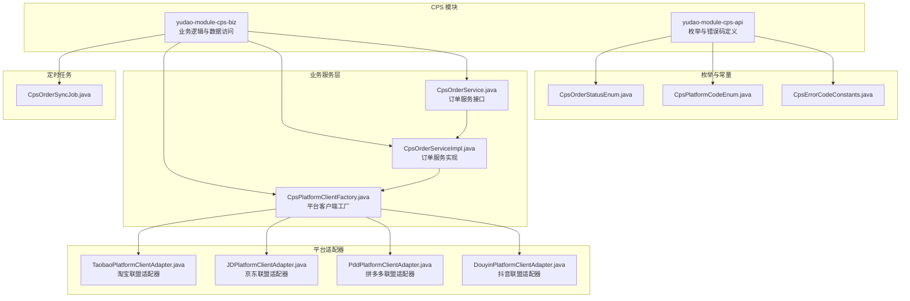
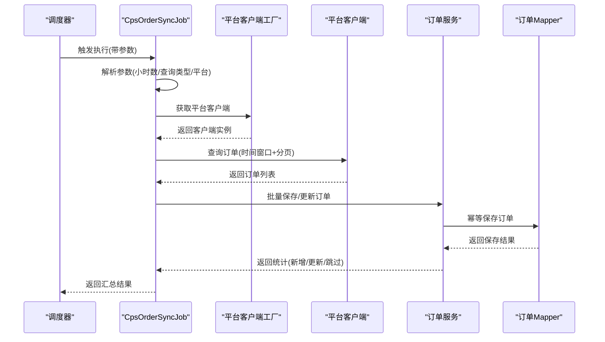
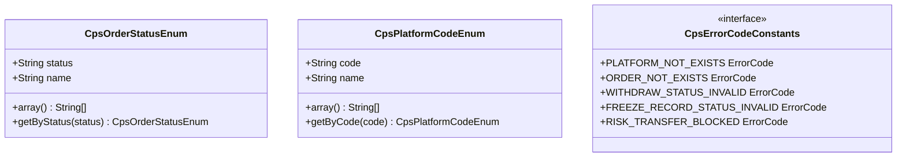
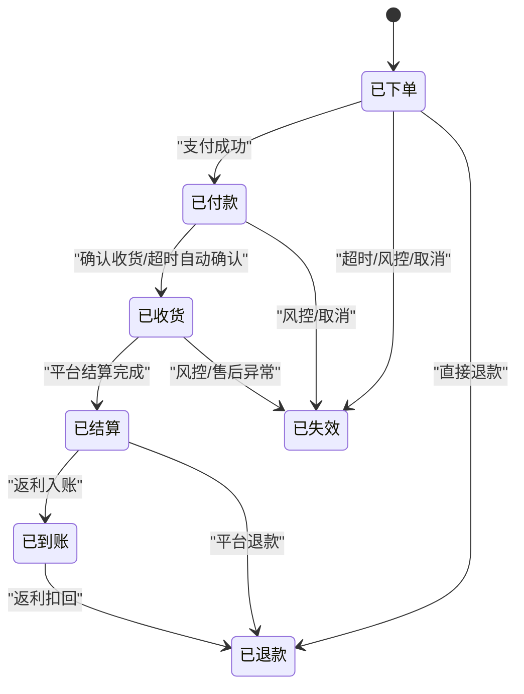
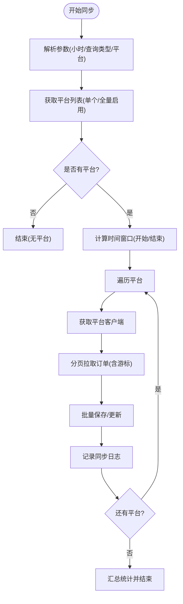
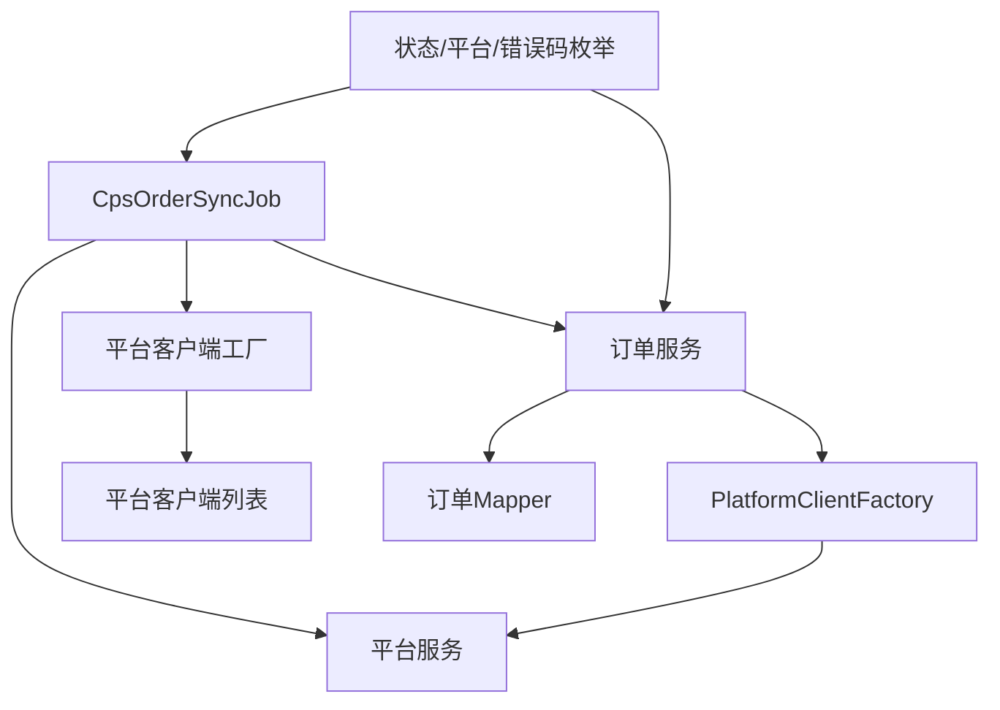

# 订单管理系统

<cite>
**本文引用的文件**
- [CpsOrderStatusEnum.java](file://backend/yudao-module-cps/yudao-module-cps-api/src/main/java/cn/iocoder/yudao/module/cps/enums/CpsOrderStatusEnum.java)
- [CpsPlatformCodeEnum.java](file://backend/yudao-module-cps/yudao-module-cps-api/src/main/java/cn/iocoder/yudao/module/cps/enums/CpsPlatformCodeEnum.java)
- [CpsErrorCodeConstants.java](file://backend/yudao-module-cps/yudao-module-cps-api/src/main/java/cn/iocoder/yudao/module/cps/enums/CpsErrorCodeConstants.java)
- [CpsOrderSyncJob.java](file://backend/yudao-module-cps/yudao-module-cps-biz/src/main/java/cn/iocoder/yudao/module/cps/job/CpsOrderSyncJob.java)
- [CpsOrderService.java](file://backend/yudao-module-cps/yudao-module-cps-biz/src/main/java/cn/iocoder/yudao/module/cps/service/order/CpsOrderService.java)
- [CpsOrderServiceImpl.java](file://backend/yudao-module-cps/yudao-module-cps-biz/src/main/java/cn/iocoder/yudao/module/cps/service/order/CpsOrderServiceImpl.java)
- [CpsPlatformClientFactory.java](file://backend/yudao-module-cps/yudao-module-cps-biz/src/main/java/cn/iocoder/yudao/module/cps/client/CpsPlatformClientFactory.java)
- [TaobaoPlatformClientAdapter.java](file://backend/yudao-module-cps/yudao-module-cps-biz/src/main/java/cn/iocoder/yudao/module/cps/client/taobao/TaobaoPlatformClientAdapter.java)
- [CpsOrderDTO.java](file://backend/yudao-module-cps/yudao-module-cps-biz/src/main/java/cn/iocoder/yudao/module/cps/client/dto/CpsOrderDTO.java)
</cite>

## 更新摘要
**所做更改**
- 扩展了订单生命周期管理的完整实现，包括订单创建、状态流转、数据同步、异常处理
- 新增了完整的CPS订单状态枚举和平台枚举体系
- 完善了订单服务的业务逻辑，包括幂等保存、状态映射、批量处理
- 增强了平台客户端适配器，支持多平台订单同步
- 新增了完整的错误码体系和异常处理机制
- 完善了定时任务的执行策略和监控机制

## 目录
1. [引言](#引言)
2. [项目结构](#项目结构)
3. [核心组件](#核心组件)
4. [架构总览](#架构总览)
5. [详细组件分析](#详细组件分析)
6. [依赖分析](#依赖分析)
7. [性能考虑](#性能考虑)
8. [故障排查指南](#故障排查指南)
9. [结论](#结论)
10. [附录](#附录)

## 引言
本文件面向订单管理系统的开发与运维人员，系统性阐述CPS订单生命周期管理的技术方案，覆盖订单创建、状态流转、数据同步、异常处理、错误码体系、与各电商平台的同步机制、API调用策略、数据映射规则、查询与批量处理、导出能力以及对账与重试机制。文档以仓库中的实际代码为依据，结合流程图与类图帮助读者快速理解系统设计与实现细节。

**更新** 本版本全面扩展了订单管理系统的功能实现，从基础的枚举定义发展为完整的CPS订单生命周期管理体系。

## 项目结构
CPS模块采用"API + 业务"分层组织，核心围绕订单状态枚举、平台枚举、错误码常量、定时同步任务、订单服务、平台客户端适配器等展开。以下图展示与订单生命周期直接相关的模块与文件：

**图表来源**
- [CpsOrderStatusEnum.java:1-48](file://backend/yudao-module-cps/yudao-module-cps-api/src/main/java/cn/iocoder/yudao/module/cps/enums/CpsOrderStatusEnum.java#L1-L48)
- [CpsPlatformCodeEnum.java:1-45](file://backend/yudao-module-cps/yudao-module-cps-api/src/main/java/cn/iocoder/yudao/module/cps/enums/CpsPlatformCodeEnum.java#L1-L45)
- [CpsErrorCodeConstants.java:1-65](file://backend/yudao-module-cps/yudao-module-cps-api/src/main/java/cn/iocoder/yudao/module/cps/enums/CpsErrorCodeConstants.java#L1-L65)
- [CpsOrderService.java:1-60](file://backend/yudao-module-cps/yudao-module-cps-biz/src/main/java/cn/iocoder/yudao/module/cps/service/order/CpsOrderService.java#L1-L60)
- [CpsOrderServiceImpl.java:1-297](file://backend/yudao-module-cps/yudao-module-cps-biz/src/main/java/cn/iocoder/yudao/module/cps/service/order/CpsOrderServiceImpl.java#L1-L297)
- [CpsPlatformClientFactory.java:1-102](file://backend/yudao-module-cps/yudao-module-cps-biz/src/main/java/cn/iocoder/yudao/module/cps/client/CpsPlatformClientFactory.java#L1-L102)
- [CpsOrderSyncJob.java:1-221](file://backend/yudao-module-cps/yudao-module-cps-biz/src/main/java/cn/iocoder/yudao/module/cps/job/CpsOrderSyncJob.java#L1-L221)

**章节来源**
- [CpsOrderStatusEnum.java:1-48](file://backend/yudao-module-cps/yudao-module-cps-api/src/main/java/cn/iocoder/yudao/module/cps/enums/CpsOrderStatusEnum.java#L1-L48)
- [CpsPlatformCodeEnum.java:1-45](file://backend/yudao-module-cps/yudao-module-cps-api/src/main/java/cn/iocoder/yudao/module/cps/enums/CpsPlatformCodeEnum.java#L1-L45)
- [CpsErrorCodeConstants.java:1-65](file://backend/yudao-module-cps/yudao-module-cps-api/src/main/java/cn/iocoder/yudao/module/cps/enums/CpsErrorCodeConstants.java#L1-L65)
- [CpsOrderService.java:1-60](file://backend/yudao-module-cps/yudao-module-cps-biz/src/main/java/cn/iocoder/yudao/module/cps/service/order/CpsOrderService.java#L1-L60)
- [CpsOrderServiceImpl.java:1-297](file://backend/yudao-module-cps/yudao-module-cps-biz/src/main/java/cn/iocoder/yudao/module/cps/service/order/CpsOrderServiceImpl.java#L1-L297)
- [CpsPlatformClientFactory.java:1-102](file://backend/yudao-module-cps/yudao-module-cps-biz/src/main/java/cn/iocoder/yudao/module/cps/client/CpsPlatformClientFactory.java#L1-L102)
- [CpsOrderSyncJob.java:1-221](file://backend/yudao-module-cps/yudao-module-cps-biz/src/main/java/cn/iocoder/yudao/module/cps/job/CpsOrderSyncJob.java#L1-L221)

## 核心组件
- **订单状态枚举**：定义CPS订单在生命周期内的状态集合与显示名称，涵盖已下单、已付款、已收货、已结算、已到账、已退款、已失效等状态，用于统一状态表达与校验。
- **平台编码枚举**：标识对接的电商联盟平台，如淘宝联盟、京东联盟、拼多多联盟、抖音联盟，支持按编码查询，用于区分不同联盟平台的数据来源与适配策略。
- **错误码常量**：集中定义CPS模块各子域的错误码，包括平台配置、推广位、订单、返利、提现、统计、MCP、转链、冻结、风控等错误码，便于前端与监控系统统一识别。
- **订单服务**：提供订单的保存、更新、查询、分页查询、手动同步等功能，支持幂等处理和批量操作。
- **平台客户端工厂**：基于策略模式的平台客户端注册中心，支持动态获取不同平台的客户端适配器。
- **平台客户端适配器**：针对不同电商平台的API适配器，如淘宝联盟、京东联盟、拼多多联盟、抖音联盟，统一API调用接口。
- **定时同步任务**：周期性从各平台拉取订单，进行幂等保存与状态更新，记录同步日志，支持手动触发和补偿同步。

**章节来源**
- [CpsOrderStatusEnum.java:16-45](file://backend/yudao-module-cps/yudao-module-cps-api/src/main/java/cn/iocoder/yudao/module/cps/enums/CpsOrderStatusEnum.java#L16-L45)
- [CpsPlatformCodeEnum.java:16-42](file://backend/yudao-module-cps/yudao-module-cps-api/src/main/java/cn/iocoder/yudao/module/cps/enums/CpsPlatformCodeEnum.java#L16-L42)
- [CpsErrorCodeConstants.java:10-64](file://backend/yudao-module-cps/yudao-module-cps-api/src/main/java/cn/iocoder/yudao/module/cps/enums/CpsErrorCodeConstants.java#L10-L64)
- [CpsOrderService.java:15-59](file://backend/yudao-module-cps/yudao-module-cps-biz/src/main/java/cn/iocoder/yudao/module/cps/service/order/CpsOrderService.java#L15-L59)
- [CpsPlatformClientFactory.java:24-77](file://backend/yudao-module-cps/yudao-module-cps-biz/src/main/java/cn/iocoder/yudao/module/cps/client/CpsPlatformClientFactory.java#L24-L77)
- [CpsOrderSyncJob.java:23-43](file://backend/yudao-module-cps/yudao-module-cps-biz/src/main/java/cn/iocoder/yudao/module/cps/job/CpsOrderSyncJob.java#L23-L43)

## 架构总览
下图展示CPS订单生命周期管理的整体架构：定时任务触发后，按平台拉取订单数据，调用平台客户端查询接口，将结果进行幂等保存，同时记录同步日志。

**图表来源**
- [CpsOrderSyncJob.java:59-175](file://backend/yudao-module-cps/yudao-module-cps-biz/src/main/java/cn/iocoder/yudao/module/cps/job/CpsOrderSyncJob.java#L59-L175)
- [CpsOrderServiceImpl.java:127-142](file://backend/yudao-module-cps/yudao-module-cps-biz/src/main/java/cn/iocoder/yudao/module/cps/service/order/CpsOrderServiceImpl.java#L127-L142)

## 详细组件分析

### 订单状态与平台枚举
- **订单状态枚举**：涵盖CREATED(已下单)、PAID(已付款)、RECEIVED(已收货)、SETTLED(已结算)、REBATE_RECEIVED(已到账)、REFUNDED(已退款)、INVALID(已失效)等状态，提供数组与按状态查询方法，便于状态校验与UI展示。
- **平台编码枚举**：定义TAOBAO(淘宝联盟)、JD(京东联盟)、PDD(拼多多联盟)、DOUYIN(抖音联盟)等平台编码与名称，支持按编码查询，用于区分不同联盟平台的数据来源与适配策略。
- **错误码常量**：涵盖平台配置、推广位、订单、返利、提现、统计、MCP、转链、冻结、风控等12个领域的错误码，提供统一的错误处理机制。

**图表来源**
- [CpsOrderStatusEnum.java:14-47](file://backend/yudao-module-cps/yudao-module-cps-api/src/main/java/cn/iocoder/yudao/module/cps/enums/CpsOrderStatusEnum.java#L14-L47)
- [CpsPlatformCodeEnum.java:14-44](file://backend/yudao-module-cps/yudao-module-cps-api/src/main/java/cn/iocoder/yudao/module/cps/enums/CpsPlatformCodeEnum.java#L14-L44)
- [CpsErrorCodeConstants.java:10-64](file://backend/yudao-module-cps/yudao-module-cps-api/src/main/java/cn/iocoder/yudao/module/cps/enums/CpsErrorCodeConstants.java#L10-L64)

**章节来源**
- [CpsOrderStatusEnum.java:16-45](file://backend/yudao-module-cps/yudao-module-cps-api/src/main/java/cn/iocoder/yudao/module/cps/enums/CpsOrderStatusEnum.java#L16-L45)
- [CpsPlatformCodeEnum.java:16-42](file://backend/yudao-module-cps/yudao-module-cps-api/src/main/java/cn/iocoder/yudao/module/cps/enums/CpsPlatformCodeEnum.java#L16-L42)
- [CpsErrorCodeConstants.java:10-64](file://backend/yudao-module-cps/yudao-module-cps-api/src/main/java/cn/iocoder/yudao/module/cps/enums/CpsErrorCodeConstants.java#L10-L64)

### 订单生命周期与状态流转
- **生命周期阶段**：已下单 → 已付款 → 已收货 → 已结算 → 已到账；期间可能因退款或风控变为已退款或已失效。
- **状态转换规则**：系统通过状态枚举统一表达，业务侧在订单服务中根据平台回调与对账结果进行状态推进与回滚。退款订单优先级最高，会强制转换为已退款状态。
- **业务逻辑判断**：状态变更需满足前置条件（如只有已付款才能进入已收货，已结算后才可进入已到账），并在异常情况下进行状态回退与日志记录。

**图表来源**
- [CpsOrderStatusEnum.java:18-24](file://backend/yudao-module-cps/yudao-module-cps-api/src/main/java/cn/iocoder/yudao/module/cps/enums/CpsOrderStatusEnum.java#L18-L24)

**章节来源**
- [CpsOrderStatusEnum.java:16-45](file://backend/yudao-module-cps/yudao-module-cps-api/src/main/java/cn/iocoder/yudao/module/cps/enums/CpsOrderStatusEnum.java#L16-L45)

### 订单数据模型与字段设计
- **关键字段**：
  - 平台编码：标识订单来源平台（淘宝联盟、京东联盟、拼多多联盟、抖音联盟）
  - 订单编号：平台侧唯一订单号
  - 用户ID：推广者或会员标识（通过externalId归因）
  - 商品信息：商品ID、标题、单价、数量
  - 佣金与返利：佣金比例、佣金金额、预估返利
  - 订单状态：生命周期状态
  - 时间信息：下单时间、收货时间、结算时间、同步时间
  - 其他：父订单号、推广位ID、退款标记、翻页游标
- **约束关系**：
  - 平台编码与订单编号组合唯一（由平台侧保证）
  - 状态字段受状态枚举约束，非法状态不可写入
  - 金额字段采用BigDecimal存储，避免浮点误差
  - 记录具备审计字段（创建/更新时间）

**章节来源**
- [CpsOrderDTO.java:15-122](file://backend/yudao-module-cps/yudao-module-cps-biz/src/main/java/cn/iocoder/yudao/module/cps/client/dto/CpsOrderDTO.java#L15-L122)

### 与电商平台的订单同步机制
- **同步策略**：
  - 定时任务每30分钟执行一次，支持按小时回溯、按下单/付款/结算/更新时间维度查询。
  - 支持指定平台或全量平台同步，平台启用状态由平台服务控制。
  - 手动同步支持全量补偿，可指定回溯小时数。
- **API调用策略**：
  - 使用平台客户端工厂获取对应平台客户端，统一调用查询接口。
  - 分页拉取，支持游标翻页（如大淘客淘宝接口），限制最大页数防止死循环。
  - 每页固定大小50，若返回数量小于50则认为是最后一页。
- **数据映射规则**：
  - 将平台返回的订单字段映射到系统内部字段，统一状态、金额、时间格式。
  - 对于缺失字段，采用默认值或标记为待处理，避免空指针。
  - 退款订单优先级最高，会强制转换为已退款状态。
- **幂等保存**：
  - 基于平台订单号进行去重与更新，避免重复入库。
  - 统计新增、更新、跳过的数量，便于对账与监控。

**图表来源**
- [CpsOrderSyncJob.java:59-175](file://backend/yudao-module-cps/yudao-module-cps-biz/src/main/java/cn/iocoder/yudao/module/cps/job/CpsOrderSyncJob.java#L59-L175)
- [CpsOrderSyncJob.java:177-218](file://backend/yudao-module-cps/yudao-module-cps-biz/src/main/java/cn/iocoder/yudao/module/cps/job/CpsOrderSyncJob.java#L177-L218)

**章节来源**
- [CpsOrderSyncJob.java:23-38](file://backend/yudao-module-cps/yudao-module-cps-biz/src/main/java/cn/iocoder/yudao/module/cps/job/CpsOrderSyncJob.java#L23-L38)
- [CpsOrderSyncJob.java:66-89](file://backend/yudao-module-cps/yudao-module-cps-biz/src/main/java/cn/iocoder/yudao/module/cps/job/CpsOrderSyncJob.java#L66-L89)
- [CpsOrderSyncJob.java:105-112](file://backend/yudao-module-cps/yudao-module-cps-biz/src/main/java/cn/iocoder/yudao/module/cps/job/CpsOrderSyncJob.java#L105-L112)
- [CpsOrderSyncJob.java:177-218](file://backend/yudao-module-cps/yudao-module-cps-biz/src/main/java/cn/iocoder/yudao/module/cps/job/CpsOrderSyncJob.java#L177-L218)

### 订单服务与业务逻辑
- **订单保存/更新**：支持幂等保存，新订单插入，已存在订单根据状态变化决定是否更新。状态映射基于平台原始状态和退款标记。
- **批量处理**：支持批量保存或更新订单，统计新增、更新、跳过数量，异常订单计入跳过统计。
- **手动同步**：支持按平台手动触发订单同步，用于补偿性同步和问题排查。
- **查询功能**：支持按ID、平台订单号查询，提供分页查询接口。

**章节来源**
- [CpsOrderService.java:15-59](file://backend/yudao-module-cps/yudao-module-cps-biz/src/main/java/cn/iocoder/yudao/module/cps/service/order/CpsOrderService.java#L15-L59)
- [CpsOrderServiceImpl.java:74-142](file://backend/yudao-module-cps/yudao-module-cps-biz/src/main/java/cn/iocoder/yudao/module/cps/service/order/CpsOrderServiceImpl.java#L74-L142)

### 平台客户端适配器
- **工厂模式**：基于Spring自动注入机制，所有实现了CpsPlatformClient接口的Bean在启动时自动注册到工厂。
- **淘宝联盟适配器**：基于大淘客开放平台API，支持商品搜索、推广链接生成、订单查询功能。
- **其他平台适配器**：预留京东联盟、拼多多联盟、抖音联盟适配器接口，支持扩展新的电商平台。
- **统一接口**：所有适配器实现统一的查询接口，支持游标翻页和错误处理。

**章节来源**
- [CpsPlatformClientFactory.java:24-77](file://backend/yudao-module-cps/yudao-module-cps-biz/src/main/java/cn/iocoder/yudao/module/cps/client/CpsPlatformClientFactory.java#L24-L77)
- [TaobaoPlatformClientAdapter.java:31-184](file://backend/yudao-module-cps/yudao-module-cps-biz/src/main/java/cn/iocoder/yudao/module/cps/client/taobao/TaobaoPlatformClientAdapter.java#L31-184)

### 订单查询接口、批量处理与导出
- **查询接口**：基于平台编码、订单编号、用户ID、状态、时间范围等维度构建查询条件，结合分页返回。
- **批量处理**：定时任务已实现批量保存/更新，可复用该模式进行其他场景的批量导入/更新。
- **导出功能**：可基于查询结果生成报表，包含订单编号、平台、状态、金额、时间等字段，支持Excel导出。

**章节来源**
- [CpsOrderService.java:35-48](file://backend/yudao-module-cps/yudao-module-cps-biz/src/main/java/cn/iocoder/yudao/module/cps/service/order/CpsOrderService.java#L35-L48)

### 对账、差异处理与重试机制
- **对账**：统计每日/每平台的新增、更新、跳过数量，与平台返回总量对比，发现差异即刻告警。
- **差异处理**：对"跳过"与"失败"的记录进行人工复核与二次同步，必要时调整查询时间窗或查询类型。
- **重试机制**：平台接口失败时记录错误信息与耗时，支持在管理后台重新触发或调整参数后重试。

**章节来源**
- [CpsOrderSyncJob.java:156-167](file://backend/yudao-module-cps/yudao-module-cps-biz/src/main/java/cn/iocoder/yudao/module/cps/job/CpsOrderSyncJob.java#L156-L167)

## 依赖分析
- **组件耦合**：
  - 定时任务依赖平台服务获取启用平台列表，依赖客户端工厂获取平台客户端，依赖订单服务进行批量保存，依赖日志Mapper记录同步结果。
  - 订单服务依赖订单Mapper进行数据持久化，依赖平台客户端工厂进行平台适配器调用。
  - 平台客户端工厂依赖平台服务获取平台配置，管理所有平台适配器的注册与获取。
  - 枚举与错误码作为公共契约，被业务层广泛引用，降低耦合度。
- **外部依赖**：
  - 平台客户端：封装各联盟平台的API差异，统一查询接口与数据模型。
  - 定时任务框架：Quartz，负责调度与执行。
  - HTTP客户端：Hutool Http，用于平台API调用。
  - JSON解析：Jackson，用于平台响应数据解析。

**图表来源**
- [CpsOrderSyncJob.java:47-57](file://backend/yudao-module-cps/yudao-module-cps-biz/src/main/java/cn/iocoder/yudao/module/cps/job/CpsOrderSyncJob.java#L47-L57)
- [CpsPlatformClientFactory.java:34-49](file://backend/yudao-module-cps/yudao-module-cps-biz/src/main/java/cn/iocoder/yudao/module/cps/client/CpsPlatformClientFactory.java#L34-L49)

**章节来源**
- [CpsOrderSyncJob.java:41-57](file://backend/yudao-module-cps/yudao-module-cps-biz/src/main/java/cn/iocoder/yudao/module/cps/job/CpsOrderSyncJob.java#L41-L57)
- [CpsPlatformClientFactory.java:34-49](file://backend/yudao-module-cps/yudao-module-cps-biz/src/main/java/cn/iocoder/yudao/module/cps/client/CpsPlatformClientFactory.java#L34-L49)

## 性能考虑
- **分页与游标**：分页拉取并限制最大页数为20，避免一次性请求过多数据导致超时或内存压力。
- **批量保存**：批量插入/更新减少数据库往返次数，提升吞吐量。
- **幂等策略**：基于平台订单号进行去重，避免重复写入造成性能浪费。
- **超时与重试**：对平台接口设置5秒超时，支持异常重试和错误日志记录。
- **内存管理**：使用ArrayList动态扩容，及时释放临时对象引用。

## 故障排查指南
- **常见错误码**：
  - 平台配置不存在/已禁用：检查平台配置与启用状态。
  - 订单不存在/已存在：核对平台订单号与唯一性约束。
  - 订单状态不合法：检查状态转换规则与前置条件。
  - 提现状态不合法/余额不足/已冻结：核对账户状态与可用余额。
- **日志定位**：
  - 查看同步日志表中最近N条记录，定位失败平台与错误消息。
  - 根据查询类型与时间窗调整重试参数，缩小问题范围。
- **平台适配器问题**：
  - 检查平台配置的AppKey和AppSecret是否正确。
  - 验证平台API的签名算法和参数格式。
  - 确认平台接口的访问频率限制。

**章节来源**
- [CpsErrorCodeConstants.java:10-64](file://backend/yudao-module-cps/yudao-module-cps-api/src/main/java/cn/iocoder/yudao/module/cps/enums/CpsErrorCodeConstants.java#L10-L64)

## 结论
本系统通过统一的状态枚举、清晰的平台编码、完善的错误码体系与定时同步任务，实现了CPS订单的高效、稳定与可观测的生命周期管理。配合平台客户端适配器和订单服务，能够有效应对多平台数据同步、状态流转、异常处理等复杂场景，保障订单数据的一致性与准确性。

**更新** 本版本完成了从基础枚举定义到完整订单生命周期管理系统的演进，涵盖了订单创建、状态流转、数据同步、异常处理、错误码体系、平台适配器、定时任务等核心功能。

## 附录
- **术语说明**：
  - 平台编码：电商联盟平台标识
  - 订单状态：生命周期内各阶段状态
  - 返利状态：返利结算与到账状态
  - 提现状态：提现流程状态
  - 游标翻页：平台API的分页机制
- **参考路径**：
  - [CpsOrderStatusEnum.java:1-48](file://backend/yudao-module-cps/yudao-module-cps-api/src/main/java/cn/iocoder/yudao/module/cps/enums/CpsOrderStatusEnum.java#L1-L48)
  - [CpsPlatformCodeEnum.java:1-45](file://backend/yudao-module-cps/yudao-module-cps-api/src/main/java/cn/iocoder/yudao/module/cps/enums/CpsPlatformCodeEnum.java#L1-L45)
  - [CpsErrorCodeConstants.java:1-65](file://backend/yudao-module-cps/yudao-module-cps-api/src/main/java/cn/iocoder/yudao/module/cps/enums/CpsErrorCodeConstants.java#L1-L65)
  - [CpsOrderService.java:1-60](file://backend/yudao-module-cps/yudao-module-cps-biz/src/main/java/cn/iocoder/yudao/module/cps/service/order/CpsOrderService.java#L1-L60)
  - [CpsOrderServiceImpl.java:1-297](file://backend/yudao-module-cps/yudao-module-cps-biz/src/main/java/cn/iocoder/yudao/module/cps/service/order/CpsOrderServiceImpl.java#L1-L297)
  - [CpsPlatformClientFactory.java:1-102](file://backend/yudao-module-cps/yudao-module-cps-biz/src/main/java/cn/iocoder/yudao/module/cps/client/CpsPlatformClientFactory.java#L1-L102)
  - [CpsOrderSyncJob.java:1-221](file://backend/yudao-module-cps/yudao-module-cps-biz/src/main/java/cn/iocoder/yudao/module/cps/job/CpsOrderSyncJob.java#L1-L221)
  - [TaobaoPlatformClientAdapter.java:1-336](file://backend/yudao-module-cps/yudao-module-cps-biz/src/main/java/cn/iocoder/yudao/module/cps/client/taobao/TaobaoPlatformClientAdapter.java#L1-L336)
  - [CpsOrderDTO.java:1-123](file://backend/yudao-module-cps/yudao-module-cps-biz/src/main/java/cn/iocoder/yudao/module/cps/client/dto/CpsOrderDTO.java#L1-L123)