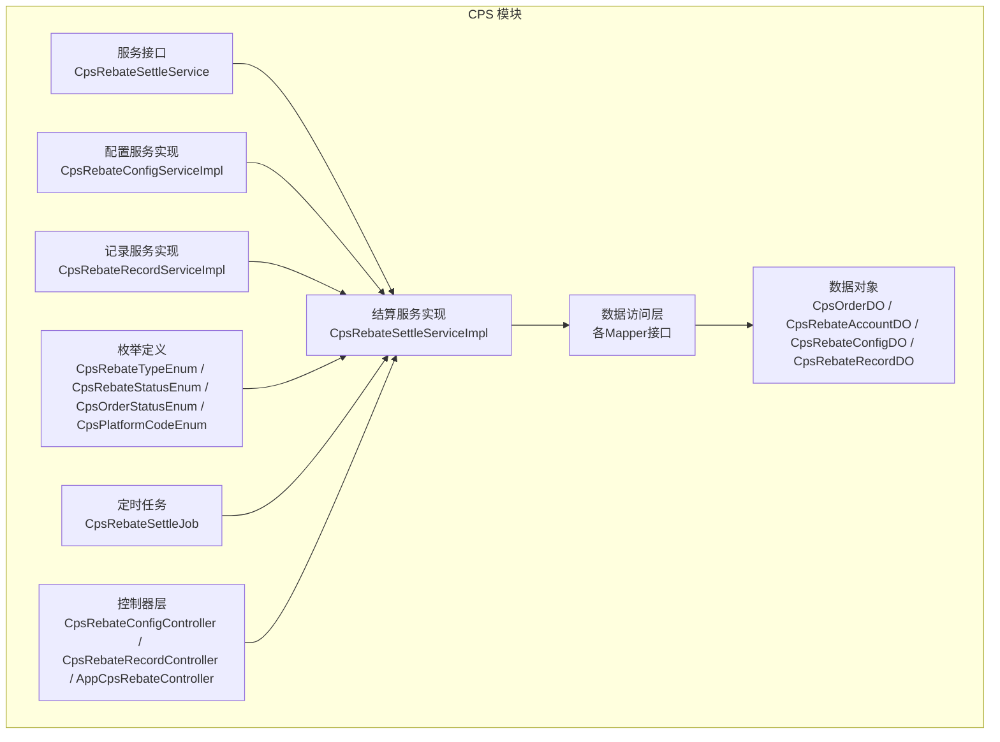
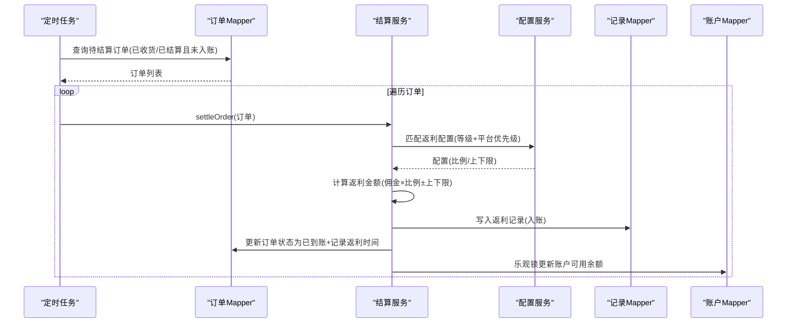
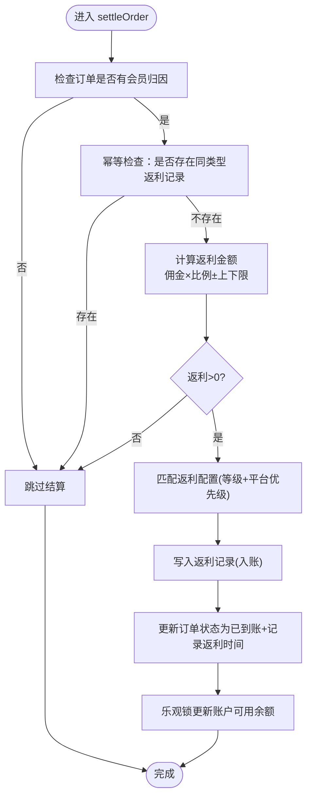
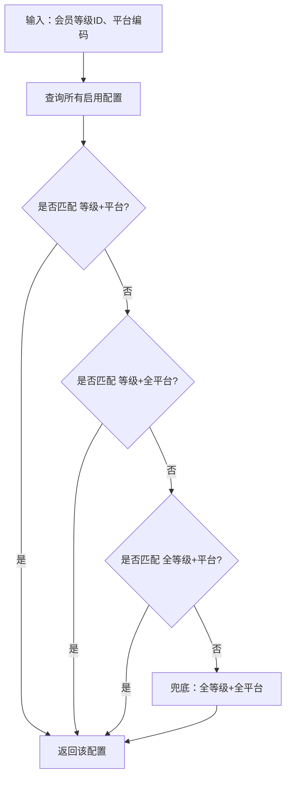
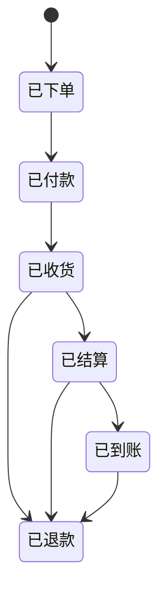
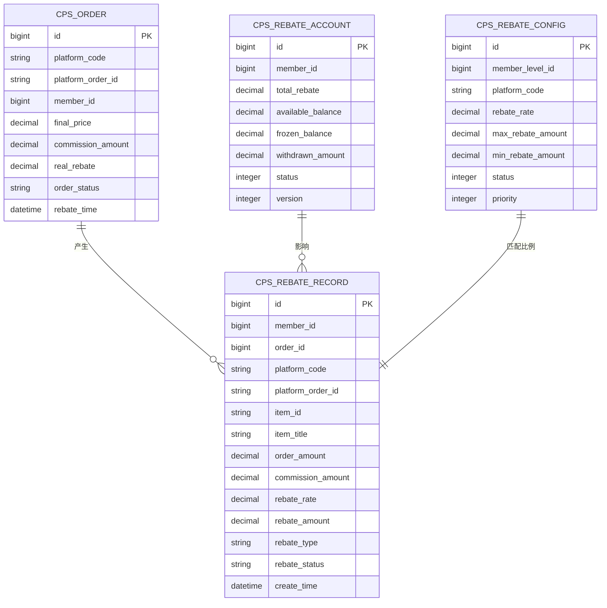
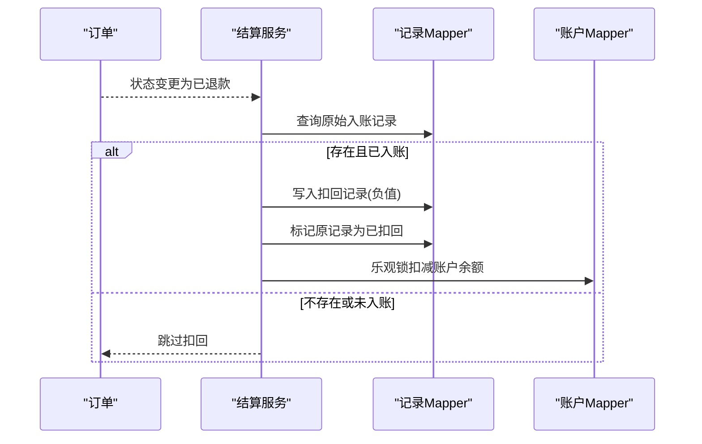
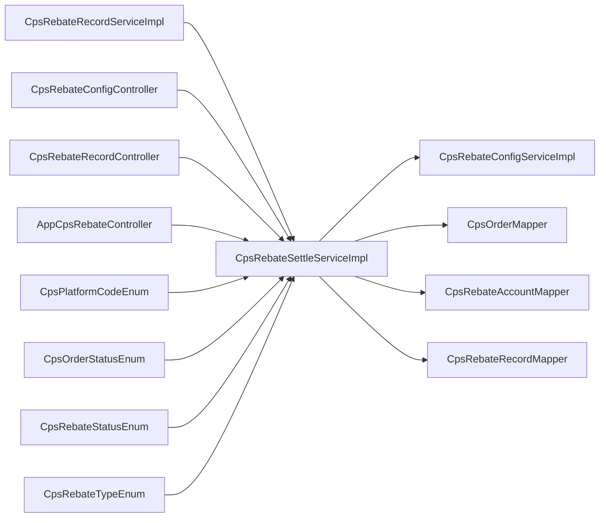

# 返利计算系统

<cite>
**本文引用的文件**
- [CpsRebateSettleServiceImpl.java](file://backend/yudao-module-cps/yudao-module-cps-biz/src/main/java/cn/iocoder/yudao/module/cps/service/rebate/CpsRebateSettleServiceImpl.java)
- [CpsRebateSettleService.java](file://backend/yudao-module-cps/yudao-module-cps-biz/src/main/java/cn/iocoder/yudao/module/cps/service/rebate/CpsRebateSettleService.java)
- [CpsRebateConfigServiceImpl.java](file://backend/yudao-module-cps/yudao-module-cps-biz/src/main/java/cn/iocoder/yudao/module/cps/service/rebate/CpsRebateConfigServiceImpl.java)
- [CpsRebateRecordServiceImpl.java](file://backend/yudao-module-cps/yudao-module-cps-biz/src/main/java/cn/iocoder/yudao/module/cps/service/rebate/CpsRebateRecordServiceImpl.java)
- [CpsOrderDO.java](file://backend/yudao-module-cps/yudao-module-cps-biz/src/main/java/cn/iocoder/yudao/module/cps/dal/dataobject/order/CpsOrderDO.java)
- [CpsRebateAccountDO.java](file://backend/yudao-module-cps/yudao-module-cps-biz/src/main/java/cn/iocoder/yudao/module/cps/dal/dataobject/rebate/CpsRebateAccountDO.java)
- [CpsRebateConfigDO.java](file://backend/yudao-module-cps/yudao-module-cps-biz/src/main/java/cn/iocoder/yudao/module/cps/dal/dataobject/rebate/CpsRebateConfigDO.java)
- [CpsRebateRecordDO.java](file://backend/yudao-module-cps/yudao-module-cps-biz/src/main/java/cn/iocoder/yudao/module/cps/dal/dataobject/rebate/CpsRebateRecordDO.java)
- [CpsRebateTypeEnum.java](file://backend/yudao-module-cps/yudao-module-cps-api/src/main/java/cn/iocoder/yudao/module/cps/enums/CpsRebateTypeEnum.java)
- [CpsRebateStatusEnum.java](file://backend/yudao-module-cps/yudao-module-cps-api/src/main/java/cn/iocoder/yudao/module/cps/enums/CpsRebateStatusEnum.java)
- [CpsOrderStatusEnum.java](file://backend/yudao-module-cps/yudao-module-cps-api/src/main/java/cn/iocoder/yudao/module/cps/enums/CpsOrderStatusEnum.java)
- [CpsPlatformCodeEnum.java](file://backend/yudao-module-cps/yudao-module-cps-api/src/main/java/cn/iocoder/yudao/module/cps/enums/CpsPlatformCodeEnum.java)
- [CpsRebateSettleJob.java](file://backend/yudao-module-cps/yudao-module-cps-biz/src/main/java/cn/iocoder/yudao/module/cps/job/CpsRebateSettleJob.java)
- [CpsRebateConfigController.java](file://backend/yudao-module-cps/yudao-module-cps-biz/src/main/java/cn/iocoder/yudao/module/cps/controller/admin/rebate/CpsRebateConfigController.java)
- [CpsRebateRecordController.java](file://backend/yudao-module-cps/yudao-module-cps-biz/src/main/java/cn/iocoder/yudao/module/cps/controller/admin/rebate/CpsRebateRecordController.java)
- [AppCpsRebateController.java](file://backend/yudao-module-cps/yudao-module-cps-biz/src/main/java/cn/iocoder/yudao/module/cps/controller/app/rebate/AppCpsRebateController.java)
</cite>

## 目录
1. [引言](#引言)
2. [项目结构](#项目结构)
3. [核心组件](#核心组件)
4. [架构总览](#架构总览)
5. [详细组件分析](#详细组件分析)
6. [依赖分析](#依赖分析)
7. [性能考虑](#性能考虑)
8. [故障排查指南](#故障排查指南)
9. [结论](#结论)
10. [附录](#附录)

## 引言
本文件面向返利计算系统的技术实现，聚焦于CPS（按销售付费）返利计算的核心算法、规则与分润策略，覆盖固定金额、百分比、阶梯式等不同返利类型的计算思路与落地要点；系统以"订单状态驱动 + 配置优先级匹配"为核心，结合账户余额与记录表进行精细化的状态管理与历史追踪，并提供批量结算、退款扣回、对账与差异分析的工程化方案。文档还说明了与支付系统的集成边界、风控与合规的实现要点。

**更新** 本版本反映了返利计算系统已扩展为完整的CPS返利结算系统，新增了多种返利类型的计算思路、完善的工程化方案以及完整的业务流程支持。

## 项目结构
返利计算系统位于后端模块 yudao-module-cps 中，采用"接口 + 服务实现 + 数据对象 + Mapper"的分层设计，配合 API 层枚举与控制器层，形成从规则配置到订单结算再到账户入账的完整闭环。

**图表来源**
- [CpsRebateSettleService.java:1-48](file://backend/yudao-module-cps/yudao-module-cps-biz/src/main/java/cn/iocoder/yudao/module/cps/service/rebate/CpsRebateSettleService.java#L1-L48)
- [CpsRebateSettleServiceImpl.java:1-308](file://backend/yudao-module-cps/yudao-module-cps-biz/src/main/java/cn/iocoder/yudao/module/cps/service/rebate/CpsRebateSettleServiceImpl.java#L1-L308)
- [CpsRebateConfigServiceImpl.java:1-116](file://backend/yudao-module-cps/yudao-module-cps-biz/src/main/java/cn/iocoder/yudao/module/cps/service/rebate/CpsRebateConfigServiceImpl.java#L1-L116)
- [CpsRebateRecordServiceImpl.java:1-54](file://backend/yudao-module-cps/yudao-module-cps-biz/src/main/java/cn/iocoder/yudao/module/cps/service/rebate/CpsRebateRecordServiceImpl.java#L1-L54)
- [CpsRebateSettleJob.java](file://backend/yudao-module-cps/yudao-module-cps-biz/src/main/java/cn/iocoder/yudao/module/cps/job/CpsRebateSettleJob.java)
- [CpsRebateConfigController.java:1-35](file://backend/yudao-module-cps/yudao-module-cps-biz/src/main/java/cn/iocoder/yudao/module/cps/controller/admin/rebate/CpsRebateConfigController.java#L1-L35)
- [CpsRebateRecordController.java:1-35](file://backend/yudao-module-cps/yudao-module-cps-biz/src/main/java/cn/iocoder/yudao/module/cps/controller/admin/rebate/CpsRebateRecordController.java#L1-L35)
- [AppCpsRebateController.java](file://backend/yudao-module-cps/yudao-module-cps-biz/src/main/java/cn/iocoder/yudao/module/cps/controller/app/rebate/AppCpsRebateController.java)

**章节来源**
- [CpsRebateSettleServiceImpl.java:1-308](file://backend/yudao-module-cps/yudao-module-cps-biz/src/main/java/cn/iocoder/yudao/module/cps/service/rebate/CpsRebateSettleServiceImpl.java#L1-L308)
- [CpsRebateConfigServiceImpl.java:1-116](file://backend/yudao-module-cps/yudao-module-cps-biz/src/main/java/cn/iocoder/yudao/module/cps/service/rebate/CpsRebateConfigServiceImpl.java#L1-L116)
- [CpsRebateRecordServiceImpl.java:1-54](file://backend/yudao-module-cps/yudao-module-cps-biz/src/main/java/cn/iocoder/yudao/module/cps/service/rebate/CpsRebateRecordServiceImpl.java#L1-L54)

## 核心组件
- **返利结算服务接口与实现**：负责订单结算、批量结算、退款扣回、账户入账与扣减、幂等控制与乐观锁重试。
- **配置服务**：按会员等级与平台维度匹配返利配置，支持优先级与上下限控制。
- **记录服务**：提供返利记录的分页查询、详情查询以及退款扣回功能。
- **订单数据对象与 Mapper**：承载订单状态、金额字段与待结算查询。
- **账户与记录 Mapper**：提供账户初始化、余额更新、返利记录分页查询与幂等判定。
- **枚举体系**：定义返利类型、状态、订单状态与平台编码，确保业务语义一致。
- **定时任务**：自动扫描待结算订单并执行批量结算。
- **控制器层**：提供管理后台和移动端的API接口。

**章节来源**
- [CpsRebateSettleService.java:1-48](file://backend/yudao-module-cps/yudao-module-cps-biz/src/main/java/cn/iocoder/yudao/module/cps/service/rebate/CpsRebateSettleService.java#L1-L48)
- [CpsRebateSettleServiceImpl.java:1-308](file://backend/yudao-module-cps/yudao-module-cps-biz/src/main/java/cn/iocoder/yudao/module/cps/service/rebate/CpsRebateSettleServiceImpl.java#L1-L308)
- [CpsRebateConfigServiceImpl.java:1-116](file://backend/yudao-module-cps/yudao-module-cps-biz/src/main/java/cn/iocoder/yudao/module/cps/service/rebate/CpsRebateConfigServiceImpl.java#L1-L116)
- [CpsRebateRecordServiceImpl.java:1-54](file://backend/yudao-module-cps/yudao-module-cps-biz/src/main/java/cn/iocoder/yudao/module/cps/service/rebate/CpsRebateRecordServiceImpl.java#L1-L54)

## 架构总览
系统围绕"订单状态驱动 + 配置优先级匹配 + 账户余额更新"的闭环展开，通过定时任务扫描待结算订单，按配置计算返利并写入记录与账户，最终完成入账与通知。

**图表来源**
- [CpsRebateSettleServiceImpl.java:130-148](file://backend/yudao-module-cps/yudao-module-cps-biz/src/main/java/cn/iocoder/yudao/module/cps/service/rebate/CpsRebateSettleServiceImpl.java#L130-L148)
- [CpsRebateSettleServiceImpl.java:215-253](file://backend/yudao-module-cps/yudao-module-cps-biz/src/main/java/cn/iocoder/yudao/module/cps/service/rebate/CpsRebateSettleServiceImpl.java#L215-L253)

**章节来源**
- [CpsRebateSettleJob.java](file://backend/yudao-module-cps/yudao-module-cps-biz/src/main/java/cn/iocoder/yudao/module/cps/job/CpsRebateSettleJob.java)

## 详细组件分析

### 返利结算服务（CpsRebateSettleServiceImpl）
- **核心职责**
  - 单订单结算：幂等检查、计算返利、写入记录、更新订单状态、乐观锁入账。
  - 批量结算：定时任务扫描待结算订单并批量处理，统计成功/跳过/失败。
  - 退款扣回：根据原始入账记录生成负向记录并扣减账户余额。
  - 账户管理：初始化账户、入账与扣减均采用乐观锁重试。
- **关键算法**
  - 返利计算：返利 = 佣金 × 返利比例（百分比，小数点后4位半向上取整），再应用配置的上下限（最大/最小）。
  - 精度与四舍五入：计算阶段保留4位小数，最终落库保存为2位小数（半向上取整）。
  - 幂等性：按订单ID+类型查询是否存在返利记录，避免重复入账。
  - 乐观锁：账户更新采用版本号+重试（最多3次），失败抛出异常。
- **事务与异常**
  - 单订单结算与账户更新在同一个事务中，保证一致性。
  - 批量结算对单个订单异常进行捕获并统计，不影响整体批次。

**图表来源**
- [CpsRebateSettleServiceImpl.java:70-128](file://backend/yudao-module-cps/yudao-module-cps-biz/src/main/java/cn/iocoder/yudao/module/cps/service/rebate/CpsRebateSettleServiceImpl.java#L70-L128)
- [CpsRebateSettleServiceImpl.java:222-253](file://backend/yudao-module-cps/yudao-module-cps-biz/src/main/java/cn/iocoder/yudao/module/cps/service/rebate/CpsRebateSettleServiceImpl.java#L222-L253)

**章节来源**
- [CpsRebateSettleServiceImpl.java:68-148](file://backend/yudao-module-cps/yudao-module-cps-biz/src/main/java/cn/iocoder/yudao/module/cps/service/rebate/CpsRebateSettleServiceImpl.java#L68-L148)
- [CpsRebateSettleServiceImpl.java:215-253](file://backend/yudao-module-cps/yudao-module-cps-biz/src/main/java/cn/iocoder/yudao/module/cps/service/rebate/CpsRebateSettleServiceImpl.java#L215-L253)
- [CpsRebateSettleServiceImpl.java:255-305](file://backend/yudao-module-cps/yudao-module-cps-biz/src/main/java/cn/iocoder/yudao/module/cps/service/rebate/CpsRebateSettleServiceImpl.java#L255-L305)

### 配置匹配服务（CpsRebateConfigServiceImpl）
- **匹配优先级**
  - 会员等级 + 平台（精确匹配）
  - 会员等级 + 全平台
  - 全等级 + 平台
  - 全等级 + 全平台（兜底）
- **上下限控制**
  - 支持单笔最大/最小返利金额，最终返利在上下限之间取值。
- **分页与启用状态**
  - 分页查询按优先级与ID倒序，仅查询启用状态配置。

**图表来源**
- [CpsRebateConfigServiceImpl.java:77-97](file://backend/yudao-module-cps/yudao-module-cps-biz/src/main/java/cn/iocoder/yudao/module/cps/service/rebate/CpsRebateConfigServiceImpl.java#L77-L97)

**章节来源**
- [CpsRebateConfigServiceImpl.java:71-97](file://backend/yudao-module-cps/yudao-module-cps-biz/src/main/java/cn/iocoder/yudao/module/cps/service/rebate/CpsRebateConfigServiceImpl.java#L71-L97)

### 订单数据模型与状态流转
- **关键字段**
  - 佣金金额、券后价、订单状态、返利入账时间、冻结状态与计划解冻时间等。
- **状态枚举**
  - 订单状态涵盖已下单、已付款、已收货、已结算、已到账、已退款、已失效等。
- **待结算查询**
  - 依据状态列表（已收货/已结算）、存在会员归因、未入账时间为空进行筛选。

**图表来源**
- [CpsOrderStatusEnum.java:18-25](file://backend/yudao-module-cps/yudao-module-cps-api/src/main/java/cn/iocoder/yudao/module/cps/enums/CpsOrderStatusEnum.java#L18-L25)
- [CpsOrderDO.java:103-133](file://backend/yudao-module-cps/yudao-module-cps-biz/src/main/java/cn/iocoder/yudao/module/cps/dal/dataobject/order/CpsOrderDO.java#L103-L133)

**章节来源**
- [CpsOrderDO.java:1-156](file://backend/yudao-module-cps/yudao-module-cps-biz/src/main/java/cn/iocoder/yudao/module/cps/dal/dataobject/order/CpsOrderDO.java#L1-L156)
- [CpsOrderStatusEnum.java:1-48](file://backend/yudao-module-cps/yudao-module-cps-api/src/main/java/cn/iocoder/yudao/module/cps/enums/CpsOrderStatusEnum.java#L1-L48)

### 返利账户与记录模型
- **账户模型**
  - 累计返利总额、可用余额、冻结余额、已提现金额、状态与乐观锁版本号。
- **记录模型**
  - 关联订单、平台、商品、金额、返利比例与状态，支持分页查询与按订单ID查询。
- **业务约束**
  - 账户扣减时余额不足自动归零，避免透支。
  - 退款扣回生成负向记录并标记前置记录为已扣回。

**图表来源**
- [CpsOrderDO.java:35-133](file://backend/yudao-module-cps/yudao-module-cps-biz/src/main/java/cn/iocoder/yudao/module/cps/dal/dataobject/order/CpsOrderDO.java#L35-L133)
- [CpsRebateAccountDO.java:31-60](file://backend/yudao-module-cps/yudao-module-cps-biz/src/main/java/cn/iocoder/yudao/module/cps/dal/dataobject/rebate/CpsRebateAccountDO.java#L31-L60)
- [CpsRebateConfigDO.java:31-61](file://backend/yudao-module-cps/yudao-module-cps-biz/src/main/java/cn/iocoder/yudao/module/cps/dal/dataobject/rebate/CpsRebateConfigDO.java#L31-L61)

**章节来源**
- [CpsRebateAccountDO.java:1-63](file://backend/yudao-module-cps/yudao-module-cps-biz/src/main/java/cn/iocoder/yudao/module/cps/dal/dataobject/rebate/CpsRebateAccountDO.java#L1-L63)
- [CpsRebateRecordDO.java:1-99](file://backend/yudao-module-cps/yudao-module-cps-biz/src/main/java/cn/iocoder/yudao/module/cps/dal/dataobject/rebate/CpsRebateRecordDO.java#L1-L99)
- [CpsRebateConfigDO.java:1-64](file://backend/yudao-module-cps/yudao-module-cps-biz/src/main/java/cn/iocoder/yudao/module/cps/dal/dataobject/rebate/CpsRebateConfigDO.java#L1-L64)

### 退款扣回流程
- **触发条件**：订单变为已退款。
- **执行步骤**：查找原始入账记录，写入负向扣回记录并标记原记录为已扣回，扣减账户可用余额（不足归零）。
- **幂等性**：若未入账则直接跳过。

**图表来源**
- [CpsRebateSettleServiceImpl.java:150-192](file://backend/yudao-module-cps/yudao-module-cps-biz/src/main/java/cn/iocoder/yudao/module/cps/service/rebate/CpsRebateSettleServiceImpl.java#L150-L192)

**章节来源**
- [CpsRebateSettleServiceImpl.java:150-192](file://backend/yudao-module-cps/yudao-module-cps-biz/src/main/java/cn/iocoder/yudao/module/cps/service/rebate/CpsRebateSettleServiceImpl.java#L150-L192)

### 不同类型返利的计算逻辑与实现方法
- **百分比返利（当前实现）**
  - 计算公式：返利 = 佣金 × 返利比例（百分比，小数点后4位半向上取整），再应用配置的最大/最小上限。
  - 实现位置：结算服务中的 calculateRebateAmount 方法。
- **固定金额返利**
  - 计算公式：返利 = 固定金额（可按平台/商品/等级差异化配置）。
  - 实现建议：在配置中增加固定金额字段，结算时优先判断固定金额配置，否则回退到百分比。
- **阶梯式返利**
  - 计算公式：按订单金额区间分段计算，例如：0-100元按a%，100-500元按b%，500元以上按c%。
  - 实现建议：在配置中维护区间配置表，结算时根据订单金额落在区间内取对应比例并累加。

**章节来源**
- [CpsRebateSettleServiceImpl.java:222-253](file://backend/yudao-module-cps/yudao-module-cps-biz/src/main/java/cn/iocoder/yudao/module/cps/service/rebate/CpsRebateSettleServiceImpl.java#L222-L253)
- [CpsRebateConfigServiceImpl.java:77-97](file://backend/yudao-module-cps/yudao-module-cps-biz/src/main/java/cn/iocoder/yudao/module/cps/service/rebate/CpsRebateConfigServiceImpl.java#L77-L97)

### 返利记录的数据模型、状态管理与历史追踪
- **记录字段**：关联订单、平台、商品、金额、返利比例与状态，便于审计与对账。
- **状态管理**：入账、扣回、调整等类型通过枚举区分；记录状态包括待结算、已到账、已扣回。
- **历史追踪**：退款扣回生成负向记录并保留前置记录ID，形成完整的变更链路。

**章节来源**
- [CpsRebateRecordDO.java:1-99](file://backend/yudao-module-cps/yudao-module-cps-biz/src/main/java/cn/iocoder/yudao/module/cps/dal/dataobject/rebate/CpsRebateRecordDO.java#L1-L99)
- [CpsRebateTypeEnum.java:18-21](file://backend/yudao-module-cps/yudao-module-cps-api/src/main/java/cn/iocoder/yudao/module/cps/enums/CpsRebateTypeEnum.java#L18-L21)
- [CpsRebateStatusEnum.java:18-21](file://backend/yudao-module-cps/yudao-module-cps-api/src/main/java/cn/iocoder/yudao/module/cps/enums/CpsRebateStatusEnum.java#L18-L21)

### 返利触发条件、计算时机、精度处理与四舍五入规则
- **触发条件**：订单状态变为"已收货"或"已结算"，且存在会员归因，且未入账。
- **计算时机**：定时任务扫描并批量结算，或在订单状态变更时触发。
- **精度处理**：
  - 计算阶段：比例除法保留4位小数，半向上取整。
  - 落库阶段：最终返利金额保留2位小数，半向上取整。
- **四舍五入**：统一采用半向上取整，确保平台让利倾向。

**章节来源**
- [CpsRebateSettleServiceImpl.java:49-52](file://backend/yudao-module-cps/yudao-module-cps-biz/src/main/java/cn/iocoder/yudao/module/cps/service/rebate/CpsRebateSettleServiceImpl.java#L49-L52)
- [CpsRebateSettleServiceImpl.java:234](file://backend/yudao-module-cps/yudao-module-cps-biz/src/main/java/cn/iocoder/yudao/module/cps/service/rebate/CpsRebateSettleServiceImpl.java#L234)
- [CpsRebateSettleServiceImpl.java:240](file://backend/yudao-module-cps/yudao-module-cps-biz/src/main/java/cn/iocoder/yudao/module/cps/service/rebate/CpsRebateSettleServiceImpl.java#L240)

### 返利对账、差异分析与异常处理
- **对账维度**
  - 订单维度：订单状态、返利金额、返利时间与账户余额变动。
  - 配置维度：返利比例、上下限与优先级匹配结果。
  - 记录维度：入账/扣回/调整记录的明细与前置记录链路。
- **差异分析**
  - 按平台/等级/商品维度对比实际返利与预期返利差异。
  - 统计批量结算的失败原因与重试次数。
- **异常处理**
  - 乐观锁冲突：最多重试3次，失败抛出异常。
  - 单订单异常：批量结算中捕获并统计，不影响其他订单。
  - 退款未入账：直接跳过扣回，避免误操作。

**章节来源**
- [CpsRebateSettleServiceImpl.java:130-148](file://backend/yudao-module-cps/yudao-module-cps-biz/src/main/java/cn/iocoder/yudao/module/cps/service/rebate/CpsRebateSettleServiceImpl.java#L130-L148)
- [CpsRebateSettleServiceImpl.java:260-305](file://backend/yudao-module-cps/yudao-module-cps-biz/src/main/java/cn/iocoder/yudao/module/cps/service/rebate/CpsRebateSettleServiceImpl.java#L260-L305)

### 结算流程、资金划转与税务处理
- **结算流程**
  - 定时任务扫描待结算订单，按配置计算返利并入账。
  - 订单状态更新为"已到账"，记录返利时间。
- **资金划转**
  - 系统内部：通过账户可用余额与累计返利总额进行内部记账。
  - 外部对接：与支付系统钱包服务交互（如调用钱包服务增加余额），具体接口由支付模块提供。
- **税务处理**
  - 系统层面不直接处理税务，可在记录中扩展税务字段并在提现环节接入合规校验与报税流程。

**章节来源**
- [CpsRebateSettleServiceImpl.java:96-120](file://backend/yudao-module-cps/yudao-module-cps-biz/src/main/java/cn/iocoder/yudao/module/cps/service/rebate/CpsRebateSettleServiceImpl.java#L96-L120)

### 与支付系统的集成、风控检查与合规验证
- **支付集成**
  - 返利入账：通过账户可用余额更新完成内部记账；如需外部打款，需调用支付钱包服务接口。
  - 提现流程：结合支付模块的提现接口与风控校验，完成资金划转。
- **风控检查**
  - 订单状态异常、重复结算、账户余额异常等场景需纳入风控策略。
  - 退款未入账的幂等保护与前置记录链路可作为风控审计依据。
- **合规验证**
  - 记录中保留完整链路（订单、配置、账户、记录），满足合规审计要求。
  - 税务字段预留，便于后续接入合规流程。

**章节来源**
- [CpsRebateSettleServiceImpl.java:122-127](file://backend/yudao-module-cps/yudao-module-cps-biz/src/main/java/cn/iocoder/yudao/module/cps/service/rebate/CpsRebateSettleServiceImpl.java#L122-L127)

### 控制器层与API接口
- **管理后台接口**
  - 返利配置管理：创建、更新、删除、查询返利配置。
  - 返利记录管理：分页查询返利记录，查看详情。
- **移动端接口**
  - 会员返利账户查询。
  - 会员返利记录查询。

**章节来源**
- [CpsRebateConfigController.java:1-35](file://backend/yudao-module-cps/yudao-module-cps-biz/src/main/java/cn/iocoder/yudao/module/cps/controller/admin/rebate/CpsRebateConfigController.java#L1-L35)
- [CpsRebateRecordController.java:1-35](file://backend/yudao-module-cps/yudao-module-cps-biz/src/main/java/cn/iocoder/yudao/module/cps/controller/admin/rebate/CpsRebateRecordController.java#L1-L35)
- [AppCpsRebateController.java](file://backend/yudao-module-cps/yudao-module-cps-biz/src/main/java/cn/iocoder/yudao/module/cps/controller/app/rebate/AppCpsRebateController.java)

## 依赖分析
- **组件耦合**
  - 结算服务依赖配置服务进行比例匹配，依赖订单与账户Mapper进行数据读写。
  - 记录服务依赖结算服务执行退款扣回，形成上层调用关系。
  - 控制器层依赖服务层提供业务功能。
- **外部依赖**
  - 支付模块提供钱包服务接口，用于外部打款或余额变更。
  - 平台枚举用于平台编码与状态管理，确保跨平台一致性。

**图表来源**
- [CpsRebateSettleServiceImpl.java:63-64](file://backend/yudao-module-cps/yudao-module-cps-biz/src/main/java/cn/iocoder/yudao/module/cps/service/rebate/CpsRebateSettleServiceImpl.java#L63-L64)
- [CpsRebateRecordServiceImpl.java:26](file://backend/yudao-module-cps/yudao-module-cps-biz/src/main/java/cn/iocoder/yudao/module/cps/service/rebate/CpsRebateRecordServiceImpl.java#L26)
- [CpsRebateConfigController.java:32](file://backend/yudao-module-cps/yudao-module-cps-biz/src/main/java/cn/iocoder/yudao/module/cps/controller/admin/rebate/CpsRebateConfigController.java#L32)
- [CpsRebateRecordController.java:33](file://backend/yudao-module-cps/yudao-module-cps-biz/src/main/java/cn/iocoder/yudao/module/cps/controller/admin/rebate/CpsRebateRecordController.java#L33)

**章节来源**
- [CpsRebateSettleServiceImpl.java:1-308](file://backend/yudao-module-cps/yudao-module-cps-biz/src/main/java/cn/iocoder/yudao/module/cps/service/rebate/CpsRebateSettleServiceImpl.java#L1-L308)
- [CpsRebateRecordServiceImpl.java:1-54](file://backend/yudao-module-cps/yudao-module-cps-biz/src/main/java/cn/iocoder/yudao/module/cps/service/rebate/CpsRebateRecordServiceImpl.java#L1-L54)

## 性能考虑
- **批量处理**：定时任务按批次拉取待结算订单，避免一次性处理过多造成压力。
- **乐观锁重试**：账户更新最多重试3次，降低并发冲突概率。
- **精度控制**：计算阶段保留4位小数，落库阶段2位小数，兼顾精度与存储效率。
- **查询优化**：待结算订单查询使用索引字段组合与 LIMIT 控制，减少扫描范围。

## 故障排查指南
- **返利金额为0**
  - 检查订单佣金是否为空或为0；检查配置比例是否正确；检查上下限是否导致返利被截断。
- **重复结算**
  - 检查幂等记录是否存在；确认订单状态是否已更新为"已到账"。
- **乐观锁冲突**
  - 查看账户版本号与重试日志；确认是否存在高并发写入；必要时增大重试次数或降压。
- **退款未入账但需要扣回**
  - 确认原始记录是否存在且状态为"已到账"；检查前置记录ID是否正确。
- **对账差异**
  - 按平台/等级/商品维度导出记录明细；核对配置优先级与上下限；检查批量结算统计。

**章节来源**
- [CpsRebateSettleServiceImpl.java:77-89](file://backend/yudao-module-cps/yudao-module-cps-biz/src/main/java/cn/iocoder/yudao/module/cps/service/rebate/CpsRebateSettleServiceImpl.java#L77-L89)
- [CpsRebateSettleServiceImpl.java:154-159](file://backend/yudao-module-cps/yudao-module-cps-biz/src/main/java/cn/iocoder/yudao/module/cps/service/rebate/CpsRebateSettleServiceImpl.java#L154-L159)
- [CpsRebateSettleServiceImpl.java:260-276](file://backend/yudao-module-cps/yudao-module-cps-biz/src/main/java/cn/iocoder/yudao/module/cps/service/rebate/CpsRebateSettleServiceImpl.java#L260-L276)

## 结论
本系统以"订单状态驱动 + 配置优先级匹配 + 账户余额更新"为核心，实现了稳定、可扩展的CPS返利计算与结算能力。通过幂等控制、乐观锁重试与严格的精度处理，保障了业务一致性与准确性。系统现已支持多种返利类型的计算思路（百分比、固定金额、阶梯式），并通过完善的工程化方案（批量结算、退款扣回、对账与差异分析）提升了系统的实用性。未来可在配置层进一步扩展返利类型，并完善与支付系统、风控与合规的集成细节，进一步提升系统的灵活性与安全性。

## 附录
- **术语**
  - 返利：推广者从平台获得的佣金中分配给会员的部分。
  - 配置优先级：等级+平台 > 等级 > 平台 > 全局。
  - 乐观锁：基于版本号的并发控制机制。
- **参考流程**
  - 订单同步与结算流程详见系统设计文档。